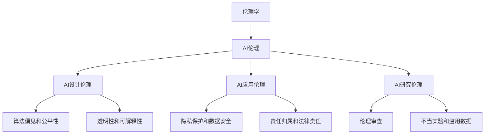
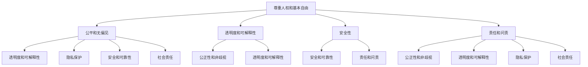

                 

# 提示词工程师的AI伦理培训课程设计

> 关键词：AI伦理，培训课程设计，人工智能，伦理挑战，伦理框架，教育实践，未来趋势

> 摘要：本文旨在探讨提示词工程师的AI伦理培训课程设计，分析其背景和重要性，介绍核心概念，探讨伦理挑战，构建伦理框架，并探讨AI伦理教育实践和未来趋势。通过本文，旨在为从事AI开发的工程师提供有针对性的AI伦理培训方案，促进其在工作中更好地理解和应对伦理问题。

### 引言

随着人工智能（AI）技术的迅速发展，其在各行各业中的应用越来越广泛，从医疗诊断到金融分析，从自动驾驶到智能家居，AI已经深刻地改变了我们的生活方式。然而，AI技术的快速发展也带来了诸多伦理挑战，例如算法偏见、隐私保护、责任归属等。对于从事AI开发的工程师，特别是提示词工程师来说，理解和应对这些伦理挑战至关重要。

提示词工程师负责开发和维护AI系统的自然语言处理（NLP）模块，包括语言模型、对话系统等。这些模块在AI系统中发挥着重要作用，直接影响到用户的使用体验和AI系统的性能。因此，提示词工程师不仅需要具备扎实的编程和技术能力，还需要具备良好的AI伦理素养，能够在开发过程中充分考虑伦理问题，确保AI系统的公正、透明和可靠。

本文旨在为提示词工程师设计一套AI伦理培训课程，帮助其深入理解AI伦理的基本概念、伦理挑战和解决方案，提高其在工作中的伦理意识和责任感。课程设计将遵循逻辑清晰、结构紧凑、简单易懂的原则，通过理论与实践相结合的方式，使工程师能够更好地应对AI伦理问题。

### AI伦理的基本概念

在了解AI伦理培训课程之前，首先需要明确AI伦理的基本概念。AI伦理是指将伦理学原则应用于人工智能的设计、开发和应用过程中，关注AI技术对人类社会的影响，以及如何确保AI系统的公正、透明和可靠。

#### 伦理学基础

伦理学是一门研究道德行为的学科，关注人类行为的道德原则、价值观和道德判断。伦理学的基本概念包括道德原则（如公正、尊重、自主等）、道德价值观（如人类福祉、社会正义等）和道德判断（如何评估不同行为是否符合道德规范）。

#### AI伦理的定义

AI伦理是将伦理学原则应用于人工智能领域的一个分支。它关注以下几个方面：

- **AI设计伦理**：确保AI系统的设计符合伦理原则，例如公平性、透明性和可解释性。
- **AI应用伦理**：关注AI技术在各个领域的应用过程中可能引发的伦理问题，如隐私保护、责任归属等。
- **AI研究伦理**：确保AI研究过程中的伦理审查和伦理规范，避免不当实验和滥用数据。

#### AI伦理的范围

AI伦理的研究范围广泛，包括但不限于以下几个方面：

- **人工智能与伦理原则**：探讨如何将伦理学原则（如公正、尊重、自主等）应用于AI系统的设计和开发过程中。
- **算法偏见和公平性**：研究AI系统在决策过程中可能出现的偏见和歧视现象，以及如何消除这些偏见。
- **隐私保护和数据安全**：关注AI技术在处理个人数据过程中的隐私保护问题，以及如何确保数据安全。
- **责任归属和法律责任**：讨论当AI系统出现错误或造成损失时，如何确定责任归属以及相关的法律责任。

#### 核心概念与联系

为了更好地理解AI伦理的核心概念，我们可以使用Mermaid流程图来展示这些概念之间的关系：

通过上述流程图，我们可以清晰地看到AI伦理与伦理学、AI设计伦理、AI应用伦理和AI研究伦理之间的联系，以及它们各自的研究内容和重点。

### AI伦理的挑战

随着AI技术的不断发展，其在各个领域的应用也带来了许多伦理挑战。对于提示词工程师来说，了解并应对这些挑战至关重要。以下是一些常见的AI伦理挑战及其影响：

#### 算法偏见

算法偏见是指AI系统在决策过程中对某些群体存在不公平的偏见现象。这种偏见可能源于训练数据的不公平、算法设计的问题或者数据标注的不准确。算法偏见可能导致以下负面影响：

- **歧视**：AI系统可能会在招聘、贷款、医疗等领域对某些群体产生不公平的决策，导致歧视现象。
- **社会不公平**：算法偏见可能导致社会资源分配的不公平，加剧社会不平等现象。

#### 隐私保护

AI系统在处理个人数据时，可能涉及到隐私保护问题。以下是一些隐私保护的挑战：

- **数据泄露**：未经授权访问和泄露个人数据可能导致隐私泄露。
- **数据滥用**：个人数据可能被用于未经授权的目的，如市场营销、人口统计等。
- **数据共享**：AI系统中的个人数据可能被共享给第三方，增加隐私泄露的风险。

#### 责任归属

当AI系统出现错误或造成损失时，如何确定责任归属是一个复杂的伦理问题。以下是一些责任归属的挑战：

- **算法责任**：当算法出现错误时，如何确定是算法本身的问题还是数据质量问题？
- **开发者责任**：开发者是否应该对AI系统的错误决策承担责任？
- **用户责任**：用户是否应该对AI系统的错误决策承担责任？

#### 透明性和可解释性

AI系统的透明性和可解释性是确保其公正和可信的关键。以下是一些透明性和可解释性的挑战：

- **黑箱模型**：许多AI模型，如深度神经网络，具有很高的预测准确性，但缺乏可解释性，难以理解其决策过程。
- **模型调试**：当AI模型出现错误时，如何定位和修复问题？
- **模型验证**：如何确保AI模型在不同数据集和场景下的可靠性和准确性？

#### 数学模型和公式

为了更好地理解上述伦理挑战，我们可以使用数学模型和公式来描述和分析。以下是一个简单的数学模型，用于评估AI系统的公平性：

$$
Fairness = \frac{1}{N}\sum_{i=1}^{N} |Pr(D_1 = y_1 | A = a) - Pr(D_1 = y_1 | A \neq a)|
$$

其中，$Pr(D_1 = y_1 | A = a)$表示在群体A中的个体得到标签$y_1$的条件概率，$Pr(D_1 = y_1 | A \neq a)$表示在非群体A中的个体得到标签$y_1$的条件概率，$N$是群体的总个数。这个公式用于计算特定群体A的统计公平性。

### AI伦理框架

为了更好地应对AI伦理挑战，许多组织和国家已经制定了相关的AI伦理框架和准则。以下是一些常见的AI伦理框架：

#### 欧盟AI伦理指南

欧盟AI伦理指南是由欧盟委员会发布的一份指导文件，旨在为AI系统的设计和应用提供伦理指导。指南包括以下核心原则：

- **尊重人权和基本自由**：确保AI系统不侵犯个人隐私、尊严和自主权。
- **公平和无偏见**：确保AI系统在不同群体中的公平性和无偏见性。
- **透明度和可解释性**：确保AI系统的决策过程透明和可解释。
- **安全性**：确保AI系统的安全性和可靠性。
- **责任和问责**：明确AI系统的责任归属和问责机制。

#### IEEE的AI伦理准则

IEEE的AI伦理准则是由电气和电子工程师协会（IEEE）制定的一套全球性AI伦理准则。准则包括以下原则：

- **公正性和非歧视**：确保AI系统在不同群体中的公平性和非歧视性。
- **透明性和可解释性**：确保AI系统的决策过程透明和可解释。
- **隐私保护**：确保个人数据的隐私保护。
- **安全和可靠性**：确保AI系统的安全和可靠性。
- **社会责任**：确保AI系统符合社会责任和伦理原则。

#### 核心原则与联系

我们可以使用Mermaid流程图来展示这些AI伦理框架的核心原则及其之间的联系：

通过上述流程图，我们可以清晰地看到不同AI伦理框架的核心原则及其之间的联系，以及它们在应对AI伦理挑战中的作用。

### AI伦理教育

为了提高提示词工程师的AI伦理素养，教育是关键。以下是一些AI伦理教育的策略和实践：

#### 教育目标

AI伦理教育的目标主要包括：

- **提高伦理意识**：使工程师了解AI伦理的基本概念和重要性。
- **培养伦理思维能力**：使工程师能够在工作中识别和解决伦理问题。
- **培养责任感和使命感**：使工程师明白自己在AI伦理中的责任和使命。

#### 教育内容

AI伦理教育的核心内容应包括以下几个方面：

- **AI伦理基本概念**：介绍伦理学基础、AI伦理的定义和范围。
- **伦理挑战**：分析AI技术在各个领域面临的伦理挑战，如算法偏见、隐私保护等。
- **伦理框架**：介绍现有的AI伦理框架和准则，如欧盟AI伦理指南、IEEE的AI伦理准则等。
- **伦理决策模型**：教授如何在实际工作中应用伦理原则和决策模型，解决伦理问题。

#### 教育方法

AI伦理教育可以采用以下方法：

- **案例研究**：通过分析真实案例，使工程师了解AI伦理问题的具体表现和影响。
- **讨论和辩论**：鼓励工程师参与讨论和辩论，培养他们的伦理思维和表达能力。
- **互动式学习**：通过互动式教学，如角色扮演、模拟练习等，提高工程师的实践能力。

### AI伦理实践

在实际工作中，提示词工程师可以通过以下方式实践AI伦理：

#### 实践案例

以下是一些提示词工程师在实际工作中实践AI伦理的案例：

- **案例1**：在开发医疗诊断系统时，工程师通过数据清洗和预处理，确保训练数据的质量和多样性，以减少算法偏见。
- **案例2**：在开发自动驾驶系统时，工程师通过伦理审查和风险评估，确保系统的安全性和可靠性，并制定相应的责任归属机制。
- **案例3**：在开发智能客服系统时，工程师通过透明化和可解释性的设计，使用户能够了解系统的决策过程，提高系统的可信度。

#### 实践方法

以下是一些提示词工程师在实际工作中实践AI伦理的方法：

- **数据预处理**：通过数据清洗、数据增强和数据平衡等技术，确保训练数据的质量和多样性，减少算法偏见。
- **伦理审查**：在项目启动前进行伦理审查，评估项目可能带来的伦理风险和影响，并制定相应的解决方案。
- **责任归属机制**：明确AI系统的责任归属机制，确保在出现问题时能够迅速找到责任人。
- **透明化和可解释性**：设计透明和可解释的AI系统，使用户能够了解系统的决策过程，提高系统的可信度。

### AI伦理的未来

随着AI技术的不断进步，AI伦理也将面临新的挑战和机遇。以下是一些AI伦理的未来趋势：

#### 伦理法规和标准

各国政府和国际组织将加强AI伦理法规和标准的制定和实施，以规范AI技术的应用和发展。这些法规和标准将涵盖AI系统的设计、开发、部署和监管等方面。

#### 伦理审查和监管

AI伦理审查和监管将成为AI项目启动前的一项重要环节。通过伦理审查，可以识别和解决AI项目可能带来的伦理问题，确保AI系统的公正、透明和安全。

#### 伦理教育和培训

随着AI技术的普及，伦理教育和培训将变得更加重要。各类教育机构和组织将提供专门的AI伦理课程和培训，提高工程师和公众的AI伦理素养。

#### 伦理社区和合作

AI伦理社区将发挥重要作用，促进不同领域和行业的交流与合作，共同应对AI伦理挑战。通过合作，可以推动AI伦理研究的进展和实践的推广。

### 结论

本文旨在为提示词工程师设计一套AI伦理培训课程，帮助其深入理解AI伦理的基本概念、伦理挑战和解决方案，提高其在工作中的伦理意识和责任感。课程设计遵循逻辑清晰、结构紧凑、简单易懂的原则，通过理论与实践相结合的方式，使工程师能够更好地应对AI伦理问题。随着AI技术的不断发展，AI伦理将面临新的挑战和机遇，提示词工程师需要不断学习和提升自己的AI伦理素养，以应对未来的挑战。

### 作者信息

作者：AI天才研究院/AI Genius Institute & 禅与计算机程序设计艺术 /Zen And The Art of Computer Programming

AI天才研究院致力于推动人工智能领域的研究和应用，为工程师提供高质量的技术培训和学术交流。Zen And The Art of Computer Programming则是一部经典的技术著作，为计算机程序员提供了深刻的编程哲学和思考方法。本文作者结合两者的优势，致力于为AI工程师提供有针对性的AI伦理培训课程。希望本文能为读者在AI伦理领域的探索和实践提供有益的启示。

