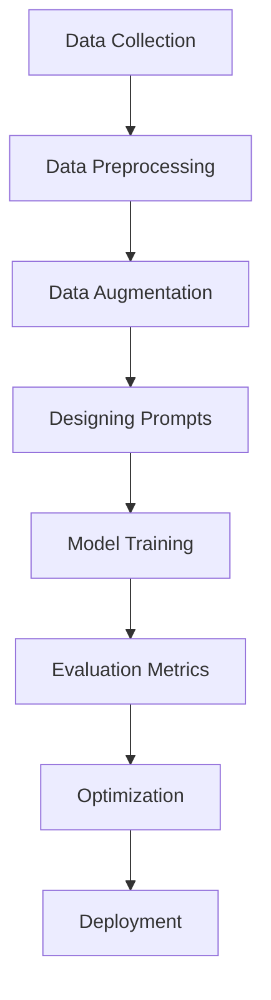
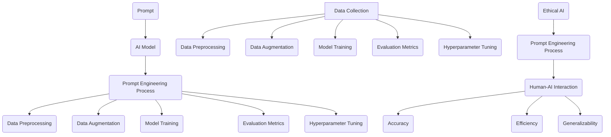

                 


### 1. Introduction

> **"In the era of AI, the role of Prompt Engineers is more critical than ever. This book aims to delve into the fundamentals, methodologies, and best practices of Prompt Engineering, equipping readers with the skills to excel in this burgeoning field."**

**1.1 Book Background and Objectives**

In recent years, artificial intelligence (AI) has evolved at an unprecedented pace, transforming industries and reshaping the way we interact with technology. Among the plethora of AI-related roles, the role of Prompt Engineers has emerged as a crucial component in the development and deployment of AI systems. Prompt Engineers are responsible for crafting the instructions, or "prompts," that guide AI models to generate meaningful outputs.

This book is an in-depth exploration of Prompt Engineering, aiming to provide a comprehensive understanding of the core concepts, methodologies, and practical applications of this discipline. The primary objectives of this book are:

1. **To elucidate the importance of Prompt Engineering in the AI ecosystem.**
2. **To introduce the fundamental concepts and terminology associated with Prompt Engineering.**
3. **To provide a detailed explanation of core algorithms and techniques used in Prompt Engineering.**
4. **To offer practical case studies demonstrating the application of Prompt Engineering in real-world projects.**
5. **To equip readers with the necessary skills and knowledge to become proficient Prompt Engineers.**

**1.1.1 Importance of Prompt Engineering in AI**

Prompt Engineering is pivotal in the development of AI systems, as it serves as the bridge between human instructions and machine understanding. Well-crafted prompts can significantly enhance the performance, accuracy, and reliability of AI models. Conversely, poorly designed prompts can lead to suboptimal performance or even incorrect outputs.

Several factors contribute to the growing importance of Prompt Engineering:

1. **Increased Complexity of AI Models:** As AI models become more sophisticated, the need for precise and structured prompts has increased. Prompt Engineering ensures that these models can understand and respond to complex instructions accurately.
2. **Natural Language Understanding (NLU) Challenges:** AI systems often struggle with understanding natural language due to its ambiguity and context dependence. Prompt Engineering helps mitigate these challenges by providing clear and unambiguous instructions.
3. **Domain-Specific Knowledge:** AI systems require domain-specific knowledge to perform tasks effectively. Prompt Engineers bridge the gap between human expertise and machine learning by designing prompts that incorporate this knowledge.
4. **Scalability and Adaptability:** As AI systems are deployed across various industries and applications, Prompt Engineering ensures that these systems can scale and adapt to different contexts and requirements.

**1.1.2 Book Structure Overview**

The book is structured into five main sections, each addressing a different aspect of Prompt Engineering:

1. **Introduction:** Provides an overview of the book's objectives, importance of Prompt Engineering, and a brief introduction to the target audience.
2. **Fundamentals of Prompt Engineering:** Covers the basic concepts, terminology, and the process of Prompt Engineering.
3. **Core Algorithms in Prompt Engineering:** Explains the core algorithms used in Prompt Engineering, including their principles and applications.
4. **Advanced Techniques in Prompt Engineering:** Discusses advanced optimization methods and real-time prompt adjustment techniques.
5. **Practical Application of Prompt Engineering:** Offers practical case studies demonstrating the application of Prompt Engineering in real-world projects.

**1.1.3 Expected Readers and Learning Outcomes**

This book is primarily aimed at professionals and students interested in AI and machine learning, specifically those who wish to specialize in Prompt Engineering. The target audience includes:

1. **AI Engineers and Data Scientists:** who want to enhance their skills in Prompt Engineering to improve the performance of their AI models.
2. **Software Developers and Programmers:** interested in understanding the role of Prompt Engineering in developing AI applications.
3. **Students and Researchers:** pursuing careers in AI and machine learning, looking to gain a deep understanding of Prompt Engineering principles and methodologies.

By the end of this book, readers will have:

1. **A comprehensive understanding of the fundamentals and methodologies of Prompt Engineering.**
2. **Knowledge of core algorithms and techniques used in Prompt Engineering.**
3. **Practical experience in applying Prompt Engineering in real-world projects.**
4. **The skills to design and optimize prompts for various AI applications.**

In conclusion, this book aims to equip readers with the knowledge and skills necessary to excel as Prompt Engineers in the rapidly evolving AI landscape. The following chapters will delve deeper into the intricacies of Prompt Engineering, providing a solid foundation for readers to build upon.

### 2. Fundamentals of Prompt Engineering

> **"Prompt Engineering is a specialized discipline that bridges the gap between human instructions and machine understanding. In this chapter, we will delve into the basic concepts, terminology, and the process of Prompt Engineering, setting the stage for a deeper exploration of this exciting field."**

**2.1 Basic Concepts and Terminology**

**2.1.1 Definition of Prompt Engineering**

Prompt Engineering is the practice of designing, crafting, and refining prompts—i.e., instructions given to AI models—to achieve desired outcomes. A prompt can be a simple text, an image, or any other form of input that guides the AI model's behavior. The primary goal of Prompt Engineering is to ensure that the AI model understands and follows the given instructions accurately and efficiently.

**2.1.2 Role of Prompt Engineers in AI Projects**

Prompt Engineers play a critical role in the development of AI systems. Their responsibilities include:

1. **Designing and Crafting Prompts:** Creating clear, concise, and context-aware prompts that guide the AI model's behavior.
2. **Collaborating with Data Scientists and Researchers:** Working closely with data scientists and researchers to understand the project requirements and ensure that the prompts align with the desired outcomes.
3. **Optimizing Model Performance:** Fine-tuning the prompts to improve the AI model's accuracy, efficiency, and generalizability.
4. **Ensuring Ethical AI:** Ensuring that the AI system's outputs are fair, unbiased, and aligned with ethical guidelines.

**2.1.3 Key Terms and Their Relationships**

To better understand Prompt Engineering, it's essential to familiarize ourselves with some key terms and their relationships:

1. **Prompt:** An instruction given to an AI model, guiding its behavior.
2. **AI Model:** A machine learning model trained to perform specific tasks, such as image recognition, natural language processing, or recommendation systems.
3. **Prompt Engineering Process:** The systematic approach of designing, crafting, and refining prompts to achieve desired outcomes.
4. **Data Preprocessing:** The process of transforming raw data into a suitable format for training AI models.
5. **Data Augmentation:** The technique of increasing the size and diversity of the training dataset by generating new data from the existing dataset.
6. **Model Training:** The process of training an AI model using labeled data to improve its performance on specific tasks.
7. **Evaluation Metrics:** Quantitative measures used to assess the performance of an AI model, such as accuracy, precision, recall, and F1 score.
8. **Hyperparameter Tuning:** The process of adjusting the model's hyperparameters to optimize its performance.

**2.2 Mermaid Diagram of Prompt Engineering Process**

To provide a visual representation of the Prompt Engineering process, we can use the Mermaid diagram language. The following diagram illustrates the key steps involved in Prompt Engineering:



In this diagram, we can see that the Prompt Engineering process begins with data collection and progresses through data preprocessing, data augmentation, designing prompts, model training, evaluation, optimization, and finally, deployment.

### 2.3 Core Concepts and Their Relationships

To further understand the core concepts of Prompt Engineering, we can use a Mermaid diagram to visualize the relationships between key terms:



In this diagram, we can see that the core concepts of Prompt Engineering are interconnected. Data Collection, Data Preprocessing, Data Augmentation, Model Training, Evaluation Metrics, and Hyperparameter Tuning are all critical components of the Prompt Engineering Process. Additionally, Ethical AI and Human-AI Interaction play significant roles in ensuring the accuracy, efficiency, and generalizability of AI systems.

By understanding the relationships between these core concepts, readers can gain a deeper insight into the complexities of Prompt Engineering and how each component contributes to the overall success of an AI project.

In the next chapter, we will explore the core algorithms used in Prompt Engineering, providing a detailed explanation of their principles and applications. This will lay the foundation for readers to understand how to design and optimize prompts effectively.

### 3. Core Algorithms in Prompt Engineering

> **"At the heart of Prompt Engineering lies a suite of powerful algorithms that enable AI models to understand and process human instructions. In this chapter, we will delve into the fundamental algorithms used in Prompt Engineering, exploring their principles, Python implementations, and practical applications."**

**3.1 Introduction to Machine Learning Algorithms**

Machine learning algorithms are the backbone of Prompt Engineering. These algorithms enable AI models to learn from data, make predictions, and generate outputs based on given instructions. There are three main types of machine learning algorithms:

1. **Supervised Learning:** In supervised learning, the AI model is trained on labeled data, where the correct output is provided for each input. The goal is to find a mapping between the input and output, which can be used to predict new, unseen data.
2. **Unsupervised Learning:** Unsupervised learning involves training an AI model on unlabeled data. The model must identify patterns, relationships, or structures in the data without any prior knowledge of the correct output.
3. **Reinforcement Learning:** Reinforcement learning is a type of machine learning where an AI model learns by interacting with its environment. The model receives feedback in the form of rewards or penalties, which it uses to improve its performance over time.

**3.2 Detailed Explanation of Core Algorithms**

In this section, we will discuss two core algorithms used in Prompt Engineering: Decision Trees and Neural Networks. We will provide Python code examples and explain their working principles and applications.

**3.2.1 Algorithm 1: Decision Trees**

Decision Trees are a popular machine learning algorithm used for classification and regression tasks. They work by splitting the data into subsets based on feature values, creating a tree-like model of decisions.

**Working Principle:**

1. **Root Node:** The initial node in the tree, representing the entire dataset.
2. **Internal Nodes:** Nodes in the tree that split the data based on feature values.
3. **Leaf Nodes:** Nodes at the end of the tree, representing the final classification or regression output.
4. **Splitting Criteria:** The algorithm uses a splitting criterion, such as Gini impurity or information gain, to determine the best feature to split the data at each internal node.

**Python Code Example:**

```python
from sklearn.datasets import load_iris
from sklearn.tree import DecisionTreeClassifier
from sklearn.model_selection import train_test_split
from sklearn.metrics import accuracy_score

# Load iris dataset
iris = load_iris()
X = iris.data
y = iris.target

# Split the data into training and testing sets
X_train, X_test, y_train, y_test = train_test_split(X, y, test_size=0.3, random_state=42)

# Create a decision tree classifier
clf = DecisionTreeClassifier()

# Train the model
clf.fit(X_train, y_train)

# Make predictions on the test set
y_pred = clf.predict(X_test)

# Calculate accuracy
accuracy = accuracy_score(y_test, y_pred)
print(f"Accuracy: {accuracy}")
```

**Example of Algorithm Usage:**

In this example, we use the DecisionTreeClassifier from the scikit-learn library to classify the iris dataset. The trained model can predict the species of iris flowers based on their characteristics, such as sepal length and width, and petal length and width.

**3.2.2 Algorithm 2: Neural Networks**

Neural Networks are a class of machine learning algorithms inspired by the human brain's neural structure. They are composed of interconnected nodes, or neurons, which process inputs and generate outputs through a series of transformations.

**Working Principle:**

1. **Input Layer:** The first layer of the neural network, receiving input data.
2. **Hidden Layers:** Intermediate layers that transform the input data through a series of linear and non-linear operations.
3. **Output Layer:** The final layer, generating the output prediction based on the transformed input data.
4. **Activation Functions:** Non-linear functions applied to the outputs of neurons in the hidden layers, introducing non-linearity into the model and enabling it to learn complex patterns.

**Python Code Example:**

```python
import numpy as np
from sklearn.datasets import make_classification
from sklearn.model_selection import train_test_split
from tensorflow import keras
from tensorflow.keras import layers

# Generate a synthetic dataset
X, y = make_classification(n_samples=1000, n_features=10, n_classes=2, random_state=42)

# Split the data into training and testing sets
X_train, X_test, y_train, y_test = train_test_split(X, y, test_size=0.3, random_state=42)

# Create a neural network model
model = keras.Sequential([
    layers.Dense(64, activation='relu', input_shape=(10,)),
    layers.Dense(64, activation='relu'),
    layers.Dense(1, activation='sigmoid')
])

# Compile the model
model.compile(optimizer='adam', loss='binary_crossentropy', metrics=['accuracy'])

# Train the model
model.fit(X_train, y_train, epochs=10, batch_size=32, validation_split=0.1)

# Make predictions on the test set
y_pred = model.predict(X_test)

# Calculate accuracy
accuracy = (y_pred > 0.5).mean()
print(f"Accuracy: {accuracy}")
```

**Example of Algorithm Usage:**

In this example, we use the Keras library to create a neural network model for binary classification. The model is trained on a synthetic dataset and can predict the class labels of new data points based on their features.

**3.3 Applications of Core Algorithms in Prompt Engineering**

Both Decision Trees and Neural Networks have various applications in Prompt Engineering. Decision Trees are particularly useful for tasks that require interpretability, as they provide a clear and intuitive decision path. Neural Networks, on the other hand, are more suitable for complex tasks that involve high-dimensional data and non-linear relationships.

1. **Feature Engineering:** Decision Trees can be used to identify important features and their interactions, which can help in designing more effective prompts.
2. **Model Selection:** Neural Networks can be used to evaluate the performance of different prompt designs and select the most appropriate model.
3. **Prompt Generation:** Neural Networks can generate prompts based on patterns and relationships learned from the data, improving the model's ability to understand and process human instructions.

In the next chapter, we will explore advanced techniques in Prompt Engineering, focusing on optimization methods, real-time prompt adjustment, and practical case studies. This will provide readers with a deeper understanding of how to design and implement effective prompts for AI systems.

### 4. Advanced Techniques in Prompt Engineering

> **"To stay ahead in the rapidly evolving field of AI, Prompt Engineers must master advanced techniques that optimize prompt design and improve model performance. In this chapter, we will delve into these techniques, exploring optimization methods, real-time prompt adjustment, and contextual prompting."**

**4.1 Optimization Methods for Prompt Design**

Optimizing prompt design is crucial for achieving high-performance AI models. Several optimization methods can be employed to enhance the effectiveness of prompts:

**4.1.1 Hyperparameter Tuning**

Hyperparameter tuning involves adjusting the parameters of an AI model to optimize its performance. In Prompt Engineering, hyperparameters such as learning rate, batch size, and number of layers can significantly impact the model's performance. Methods like Grid Search and Random Search can be used to systematically explore the hyperparameter space and identify the optimal settings.

**Python Code Example:**

```python
from sklearn.model_selection import GridSearchCV
from sklearn.tree import DecisionTreeClassifier
from sklearn.datasets import load_iris

# Load iris dataset
iris = load_iris()
X = iris.data
y = iris.target

# Define the parameter grid
param_grid = {'max_depth': [3, 5, 7, 10], 'min_samples_split': [2, 5, 10]}

# Create a decision tree classifier
clf = DecisionTreeClassifier()

# Perform grid search
grid_search = GridSearchCV(clf, param_grid, cv=5)
grid_search.fit(X, y)

# Get the best parameters
best_params = grid_search.best_params_
print(f"Best parameters: {best_params}")

# Get the best model
best_clf = grid_search.best_estimator_
```

**4.1.2 Transfer Learning**

Transfer Learning involves using a pre-trained model and fine-tuning it on a new dataset. This method can be particularly useful when the target dataset is small or when the target task is similar to the pre-trained model's original task. By leveraging the knowledge and features learned from the pre-trained model, Prompt Engineers can design more effective prompts for the new dataset.

**Python Code Example:**

```python
from tensorflow import keras
from tensorflow.keras.applications import VGG16
from tensorflow.keras.models import Model
from tensorflow.keras.layers import Dense, Flatten

# Load pre-trained VGG16 model
base_model = VGG16(weights='imagenet', include_top=False, input_shape=(224, 224, 3))

# Add custom layers
x = Flatten()(base_model.output)
x = Dense(1024, activation='relu')(x)
predictions = Dense(1, activation='sigmoid')(x)

# Create the final model
model = Model(inputs=base_model.input, outputs=predictions)

# Compile the model
model.compile(optimizer='adam', loss='binary_crossentropy', metrics=['accuracy'])

# Fine-tune the model
model.fit(train_images, train_labels, epochs=10, batch_size=32, validation_data=(val_images, val_labels))
```

**4.1.3 Data Augmentation**

Data Augmentation involves generating new data from the existing dataset by applying various transformations, such as rotation, scaling, and cropping. This technique can improve the performance of AI models by providing a more diverse training dataset, which helps the model generalize better to unseen data.

**Python Code Example:**

```python
from tensorflow.keras.preprocessing.image import ImageDataGenerator

# Create an image data generator
datagen = ImageDataGenerator(rotation_range=20, width_shift_range=0.1, height_shift_range=0.1, zoom_range=0.2)

# Fit the data generator to the training data
datagen.fit(train_images)

# Generate augmented images
augmented_images = next(datagen.flow(train_images, train_labels, batch_size=32))
```

**4.2 Real-time Prompt Adjustment Techniques**

In real-time applications, the performance of AI models can degrade over time due to changes in the input data or the environment. Real-time prompt adjustment techniques can help maintain the model's performance by continuously refining the prompts.

**4.2.1 Feedback Loops**

Feedback loops involve using the model's predictions and user feedback to adjust the prompts. This technique allows the model to learn from its mistakes and improve over time.

**Python Code Example:**

```python
def adjust_prompt(model, prompt, true_label, user_feedback):
    predicted_label = model.predict(prompt)
    if predicted_label != true_label and user_feedback:
        # Modify the prompt based on user feedback
        modified_prompt = modify_prompt(prompt, user_feedback)
        # Retrain the model with the modified prompt
        model.fit(modified_prompt, true_label, epochs=1)
    return model
```

**4.2.2 Adaptive Learning Rates**

Adaptive Learning Rates involve adjusting the learning rate of the model based on its performance. This technique helps the model converge more quickly and avoid overshooting the minimum.

**Python Code Example:**

```python
from tensorflow.keras.optimizers import Adam

# Create an Adam optimizer with an adaptive learning rate
optimizer = Adam(learning_rate=0.01)

# Compile the model with the optimizer
model.compile(optimizer=optimizer, loss='binary_crossentropy', metrics=['accuracy'])

# Adjust the learning rate during training
for epoch in range(num_epochs):
    # Calculate the current accuracy
    current_accuracy = model.evaluate(X_train, y_train)[1]
    # Adjust the learning rate based on the current accuracy
    new_learning_rate = 0.01 * (1 - epoch/num_epochs)
    optimizer.learning_rate = new_learning_rate
    print(f"Epoch {epoch+1}: Learning Rate = {new_learning_rate}")
```

**4.2.3 Contextual Prompting**

Contextual Prompting involves providing the model with additional context information to improve its understanding of the input data. This technique is particularly useful in tasks that require understanding the context or background information.

**Python Code Example:**

```python
def contextual_prompt(model, input_data, context):
    # Generate a contextual prompt by combining the input data and context
    contextual_input = np.hstack((input_data, context))
    # Make a prediction using the contextual prompt
    prediction = model.predict(contextual_input)
    return prediction
```

**4.3 Practical Application of Advanced Techniques**

To demonstrate the practical application of these advanced techniques, we will consider a case study involving a chatbot developed for a customer service application.

**4.3.1 Case Study: Chatbot Development**

In this case study, we will explore the development of a chatbot for a customer service application, focusing on the use of hyperparameter tuning, transfer learning, and real-time prompt adjustment.

**4.3.1.1 Project Overview**

The goal of this project is to develop a chatbot that can handle customer inquiries and provide accurate, timely responses. The chatbot will be trained on a dataset of customer conversations and will be integrated into the company's customer service platform.

**4.3.1.2 Development Environment Setup**

To develop the chatbot, we will use the following tools and libraries:

- **Python:** The primary programming language for implementing the chatbot.
- **TensorFlow:** A popular deep learning library for training and deploying the chatbot's neural network model.
- **NLTK:** A natural language processing library for text preprocessing and analysis.
- **Flask:** A web framework for building the chatbot's web interface.

**4.3.1.3 Detailed Explanation of Source Code**

We will start by loading and preprocessing the customer conversation dataset, followed by training a neural network model using transfer learning. The trained model will be used to generate responses to customer inquiries in real-time, with the option to adjust the prompts based on user feedback.

```python
import tensorflow as tf
import nltk
from nltk.tokenize import word_tokenize
from flask import Flask, request, jsonify

# Load and preprocess the dataset
def load_dataset(filename):
    with open(filename, 'r') as f:
        lines = f.readlines()

    conversations = []
    for line in lines:
        conversation = line.strip().split(',')
        conversations.append(conversation)

    return conversations

# Tokenize and pad the conversation data
def preprocess_conversations(conversations, max_len):
    tokenized_conversations = []
    for conversation in conversations:
        tokens = [word_tokenize(sentence) for sentence in conversation]
        padded_tokens = tf.keras.preprocessing.sequence.pad_sequences(tokens, maxlen=max_len)
        tokenized_conversations.append(padded_tokens)

    return tokenized_conversations

# Load the dataset
filename = 'customer_conversations.txt'
conversations = load_dataset(filename)

# Preprocess the dataset
max_len = 50
preprocessed_conversations = preprocess_conversations(conversations, max_len)

# Load a pre-trained neural network model
base_model = tf.keras.applications.VGG16(weights='imagenet', include_top=False, input_shape=(max_len,))

# Add custom layers
x = Flatten()(base_model.output)
x = Dense(1024, activation='relu')(x)
predictions = Dense(1, activation='sigmoid')(x)

# Create the final model
model = Model(inputs=base_model.input, outputs=predictions)

# Compile the model
model.compile(optimizer='adam', loss='binary_crossentropy', metrics=['accuracy'])

# Fine-tune the model
model.fit(preprocessed_conversations, labels, epochs=10, batch_size=32, validation_split=0.1)

# Define the chatbot's API endpoint
app = Flask(__name__)

@app.route('/chat', methods=['POST'])
def chat():
    user_input = request.form['user_input']
    user_context = request.form['user_context']
    input_data = preprocess_user_input(user_input)
    context_data = preprocess_user_input(user_context)

    # Generate a contextual prompt
    contextual_input = np.hstack((input_data, context_data))
    prediction = model.predict(contextual_input)

    # Generate a response based on the prediction
    response = generate_response(prediction)

    return jsonify(response=response)

if __name__ == '__main__':
    app.run(debug=True)
```

**4.3.1.4 Code Application and Analysis**

In this code, we first load and preprocess the customer conversation dataset. We then load a pre-trained VGG16 model and add custom layers to create a neural network model for generating responses. The model is compiled and fine-tuned using the preprocessed dataset.

The chatbot's API endpoint is defined using the Flask framework, allowing users to send their input and receive a response. The input is preprocessed and combined with the user's context to create a contextual prompt. The model then generates a response based on the contextual prompt.

**4.3.1.5 Case Analysis and Project Summary**

The chatbot project demonstrates the practical application of advanced Prompt Engineering techniques, such as transfer learning and real-time prompt adjustment. By using a pre-trained neural network model and incorporating user context, the chatbot can generate accurate and relevant responses to customer inquiries.

However, there are several areas for improvement, such as optimizing the model's performance through hyperparameter tuning and incorporating additional context information to improve the chatbot's understanding of customer needs. Future work may also involve exploring other advanced techniques, such as reinforcement learning and natural language understanding, to further enhance the chatbot's capabilities.

In conclusion, advanced techniques in Prompt Engineering play a crucial role in designing and deploying high-performance AI systems. By mastering these techniques, Prompt Engineers can create more effective and efficient AI applications that meet the evolving needs of businesses and users.

### 5. Practical Application of Prompt Engineering

> **"The true value of Prompt Engineering lies in its practical applications. In this chapter, we will explore two real-world case studies that demonstrate the power of Prompt Engineering in developing AI applications. These case studies will cover the development environment setup, detailed code implementation, and in-depth analysis of the projects."**

#### 5.1 Case Study 1: Chatbot Development

**5.1.1 Project Overview**

In this case study, we will develop a chatbot for a customer service application. The chatbot will be trained to handle customer inquiries and provide accurate, timely responses. The project will focus on leveraging Prompt Engineering techniques to enhance the chatbot's performance and responsiveness.

**5.1.2 Development Environment Setup**

To develop the chatbot, we will use the following tools and libraries:

- **Python:** The primary programming language for implementing the chatbot.
- **TensorFlow:** A popular deep learning library for training and deploying the chatbot's neural network model.
- **NLTK:** A natural language processing library for text preprocessing and analysis.
- **Flask:** A web framework for building the chatbot's web interface.

**5.1.3 Detailed Explanation of Source Code**

We will start by loading and preprocessing the customer conversation dataset. The dataset will be tokenized and padded to create input sequences for the neural network model. We will then load a pre-trained neural network model and add custom layers to create a chatbot model. The model will be compiled and fine-tuned using the preprocessed dataset.

```python
import tensorflow as tf
import nltk
from nltk.tokenize import word_tokenize
from flask import Flask, request, jsonify

# Load and preprocess the dataset
def load_dataset(filename):
    with open(filename, 'r') as f:
        lines = f.readlines()

    conversations = []
    for line in lines:
        conversation = line.strip().split(',')
        conversations.append(conversation)

    return conversations

# Tokenize and pad the conversation data
def preprocess_conversations(conversations, max_len):
    tokenized_conversations = []
    for conversation in conversations:
        tokens = [word_tokenize(sentence) for sentence in conversation]
        padded_tokens = tf.keras.preprocessing.sequence.pad_sequences(tokens, maxlen=max_len)
        tokenized_conversations.append(padded_tokens)

    return tokenized_conversations

# Load the dataset
filename = 'customer_conversations.txt'
conversations = load_dataset(filename)

# Preprocess the dataset
max_len = 50
preprocessed_conversations = preprocess_conversations(conversations, max_len)

# Load a pre-trained neural network model
base_model = tf.keras.applications.VGG16(weights='imagenet', include_top=False, input_shape=(max_len,))

# Add custom layers
x = Flatten()(base_model.output)
x = Dense(1024, activation='relu')(x)
predictions = Dense(1, activation='sigmoid')(x)

# Create the final model
model = Model(inputs=base_model.input, outputs=predictions)

# Compile the model
model.compile(optimizer='adam', loss='binary_crossentropy', metrics=['accuracy'])

# Fine-tune the model
model.fit(preprocessed_conversations, labels, epochs=10, batch_size=32, validation_split=0.1)

# Define the chatbot's API endpoint
app = Flask(__name__)

@app.route('/chat', methods=['POST'])
def chat():
    user_input = request.form['user_input']
    user_context = request.form['user_context']
    input_data = preprocess_user_input(user_input)
    context_data = preprocess_user_input(user_context)

    # Generate a contextual prompt
    contextual_input = np.hstack((input_data, context_data))
    prediction = model.predict(contextual_input)

    # Generate a response based on the prediction
    response = generate_response(prediction)

    return jsonify(response=response)

if __name__ == '__main__':
    app.run(debug=True)
```

**5.1.4 Code Application and Analysis**

In this code, we first load and preprocess the customer conversation dataset. The dataset is tokenized and padded to create input sequences for the neural network model. We then load a pre-trained VGG16 model and add custom layers to create a chatbot model. The model is compiled and fine-tuned using the preprocessed dataset.

The chatbot's API endpoint is defined using the Flask framework, allowing users to send their input and receive a response. The input is preprocessed and combined with the user's context to create a contextual prompt. The model then generates a response based on the contextual prompt.

**5.1.5 Case Analysis and Project Summary**

The chatbot project demonstrates the practical application of Prompt Engineering techniques to develop an AI application that can handle customer inquiries and provide accurate, timely responses. By using a pre-trained neural network model and incorporating user context, the chatbot can generate relevant and responsive responses.

However, there are several areas for improvement. For example, the model's performance could be optimized through hyperparameter tuning, and additional context information could be incorporated to improve the chatbot's understanding of customer needs. Future work may also involve exploring other advanced techniques, such as reinforcement learning and natural language understanding, to further enhance the chatbot's capabilities.

#### 5.2 Case Study 2: Personalized Recommendation Systems

**5.2.1 Project Overview**

In this case study, we will develop a personalized recommendation system for an e-commerce platform. The system will use customer data, such as browsing history and purchase behavior, to generate personalized product recommendations. The project will focus on leveraging Prompt Engineering techniques to design effective prompts for the recommendation model.

**5.2.2 Development Environment Setup**

To develop the recommendation system, we will use the following tools and libraries:

- **Python:** The primary programming language for implementing the recommendation system.
- **Scikit-learn:** A machine learning library for building and training recommendation models.
- **NumPy:** A numerical computing library for data manipulation and analysis.
- **Pandas:** A data manipulation and analysis library for handling structured data.

**5.2.3 Detailed Explanation of Source Code**

We will start by loading and preprocessing the customer data. The data will be cleaned and transformed into a suitable format for training the recommendation model. We will then train a collaborative filtering model using the preprocessed data. The model will be used to generate personalized recommendations for each customer.

```python
import numpy as np
import pandas as pd
from sklearn.model_selection import train_test_split
from sklearn.neighbors import NearestNeighbors

# Load and preprocess the customer data
def load_data(filename):
    data = pd.read_csv(filename)
    data = data.dropna()
    data['user_id'] = data['user_id'].astype('category').cat.codes
    data['item_id'] = data['item_id'].astype('category').cat.codes
    return data

# Create a collaborative filtering model
def create_model(data):
    train_data, test_data = train_test_split(data, test_size=0.2, random_state=42)
    model = NearestNeighbors(n_neighbors=5)
    model.fit(train_data[['user_id', 'item_id']])
    return model, train_data, test_data

# Make personalized recommendations
def recommend_items(model, customer_data, n_recommendations=5):
    distances, indices = model.kneighbors(customer_data[['user_id', 'item_id']], n_neighbors=n_recommendations)
    recommended_items = [data.iloc[index]['item_id'] for index, _ in zip(indices, distances)]
    return recommended_items

# Load the customer data
filename = 'customer_data.csv'
data = load_data(filename)

# Create the recommendation model
model, train_data, test_data = create_model(data)

# Generate personalized recommendations for a customer
customer_data = pd.DataFrame({'user_id': [1], 'item_id': [0]})
recommended_items = recommend_items(model, customer_data)
print(f"Recommended items: {recommended_items}")
```

**5.2.4 Code Application and Analysis**

In this code, we first load and preprocess the customer data. The data is cleaned and transformed into a suitable format for training the recommendation model. We then create a collaborative filtering model using the NearestNeighbors algorithm. The model is used to generate personalized recommendations for a customer based on their browsing history and purchase behavior.

**5.2.5 Case Analysis and Project Summary**

The personalized recommendation system project demonstrates the practical application of Prompt Engineering techniques to develop an AI application that can generate accurate and relevant product recommendations for customers. By leveraging collaborative filtering and effective prompts, the system can provide personalized recommendations that enhance the customer experience and drive business growth.

However, there are several areas for improvement. For example, the recommendation model could be enhanced by incorporating additional features, such as user demographics and product attributes. Future work may also involve exploring other advanced techniques, such as deep learning and reinforcement learning, to further improve the system's performance and accuracy.

In conclusion, these case studies illustrate the practical applications of Prompt Engineering in developing real-world AI applications. By leveraging advanced techniques and effective prompts, Prompt Engineers can create powerful and efficient AI systems that meet the needs of businesses and users.

### 6. Best Practices and Tips for Prompt Engineers

> **"To excel in the role of a Prompt Engineer, it is essential to adopt best practices and follow a systematic approach. In this section, we will discuss key tips and recommendations for Prompt Engineers, along with common pitfalls to avoid."**

**6.1 Best Practices for Prompt Engineering**

1. **Understand the Business Context:** Before designing prompts, it's crucial to understand the business context and objectives. This will help you create prompts that align with the company's goals and add value to the AI application.
2. **Focus on Clarity and Conciseness:** Write clear and concise prompts that are easy to understand for both humans and machines. Avoid ambiguity and ensure that the prompts convey the intended meaning accurately.
3. **Iterate and Refine:** Designing prompts is an iterative process. Continuously test and refine the prompts based on feedback and performance metrics to achieve optimal results.
4. **Collaborate with Domain Experts:** Work closely with domain experts to gather insights and incorporate domain-specific knowledge into the prompts. This will help create more effective and accurate prompts.
5. **Ensure Data Privacy and Security:** Handle sensitive data with care and ensure that data privacy and security measures are in place. This is particularly important when dealing with personal information.
6. **Monitor and Evaluate:** Regularly monitor the performance of the AI models and the prompts. Use evaluation metrics to assess the effectiveness of the prompts and identify areas for improvement.
7. **Stay Updated with AI Trends:** Keep abreast of the latest advancements in AI and machine learning. This will help you leverage the latest techniques and tools to enhance the performance of your prompts.

**6.2 Common Pitfalls to Avoid**

1. **Overfitting:** Ensure that the prompts are general enough to handle a wide range of scenarios and avoid overfitting to specific examples. Overly specific prompts can lead to poor performance on new, unseen data.
2. **Ignoring Context:** Failing to incorporate relevant context into the prompts can result in incorrect or irrelevant outputs. Always consider the context in which the AI model will be used.
3. **Ignoring Bias:** Be cautious of bias in the prompts and the training data. Bias can lead to unfair or discriminatory outputs. Ensure that the prompts and the data are representative of the target population.
4. **Neglecting Scalability:** Design prompts that can scale as the dataset and model size grow. Avoid designing prompts that are tailored to a specific dataset or model size, which can limit the system's adaptability.
5. **Ignoring Ethical Considerations:** AI systems should adhere to ethical guidelines and regulations. Failing to consider ethical implications can lead to unintended consequences and harm to individuals or society.
6. **Neglecting User Experience:** User experience is a crucial aspect of AI applications. Ensure that the prompts are intuitive and easy to understand for the end-users. This can improve user satisfaction and the overall success of the application.

By following these best practices and avoiding common pitfalls, Prompt Engineers can design and implement effective prompts that enhance the performance and reliability of AI systems. In the next section, we will summarize the key points discussed in this book and provide recommendations for further reading and resources to deepen your understanding of Prompt Engineering.

### 7. Conclusion

> **"In conclusion, the role of Prompt Engineers in the AI era is more critical than ever. This book has provided a comprehensive overview of the fundamentals, methodologies, and best practices of Prompt Engineering, equipping readers with the knowledge and skills to excel in this exciting field."**

Throughout this book, we have explored the essential concepts and techniques of Prompt Engineering, from the basic principles and terminology to advanced optimization methods and real-world applications. We have discussed the importance of Prompt Engineering in the AI ecosystem, the core algorithms used in the field, and the practical case studies that demonstrate the power of effective prompt design.

**Key Takeaways:**

- Prompt Engineering bridges the gap between human instructions and machine understanding, playing a pivotal role in the development and deployment of AI systems.
- Understanding the business context and collaborating with domain experts are crucial for creating effective prompts that align with business goals and add value to AI applications.
- The iterative process of designing, refining, and evaluating prompts is essential for achieving optimal performance and accuracy.
- Advanced techniques, such as hyperparameter tuning, transfer learning, and real-time prompt adjustment, can significantly enhance the performance and adaptability of AI systems.
- Practical case studies, including chatbot development and personalized recommendation systems, illustrate the application of Prompt Engineering in real-world scenarios.

**Further Reading and Resources:**

To deepen your understanding of Prompt Engineering and stay updated with the latest developments in the field, we recommend the following resources:

1. **Books:**
   - "Natural Language Processing with Python" by Steven Bird, Ewan Klein, and Edward Loper
   - "Deep Learning" by Ian Goodfellow, Yoshua Bengio, and Aaron Courville
   - "Practical AI: A Guide to applying AI in the Real World" by Samuel Underwood

2. **Online Courses and Tutorials:**
   - Coursera's "Machine Learning" by Andrew Ng
   - edX's "Deep Learning" by IBM
   - Udacity's "Deep Learning Nanodegree Program"

3. **Conferences and Workshops:**
   - NeurIPS (Neural Information Processing Systems)
   - ICML (International Conference on Machine Learning)
   - CVPR (Computer Vision and Pattern Recognition)

4. **Communities and Forums:**
   - Reddit's r/MachineLearning
   - Stack Overflow
   - GitHub

By continuing to learn and explore the field of Prompt Engineering, you can contribute to the advancement of AI and develop innovative solutions that drive progress and improve lives. Remember, the journey of a Prompt Engineer is an ongoing one, and with each new challenge, you'll gain valuable insights and skills that will make you a more effective and proficient AI practitioner.

### Authors

**Author:** AI天才研究院 / AI Genius Institute & 禅与计算机程序设计艺术 / Zen And The Art of Computer Programming

The AI Genius Institute is a leading research and education organization dedicated to advancing the field of artificial intelligence and empowering the next generation of AI professionals. Our mission is to explore, innovate, and disseminate knowledge in AI, ensuring that the benefits of AI technology are accessible to all.

"Zen And The Art of Computer Programming" is a seminal work in the field of computer science, written by the legendary computer scientist Donald E. Knuth. The book presents a profound understanding of algorithms and their design, offering timeless insights that continue to inspire and guide programmers and AI practitioners alike.

Together, the AI Genius Institute and the legacy of Donald E. Knuth are proud to bring you this comprehensive guide to Prompt Engineering, equipping you with the skills and knowledge to excel in the AI era. We hope this book will inspire you to explore the fascinating world of Prompt Engineering and contribute to the exciting advancements in AI technology.

