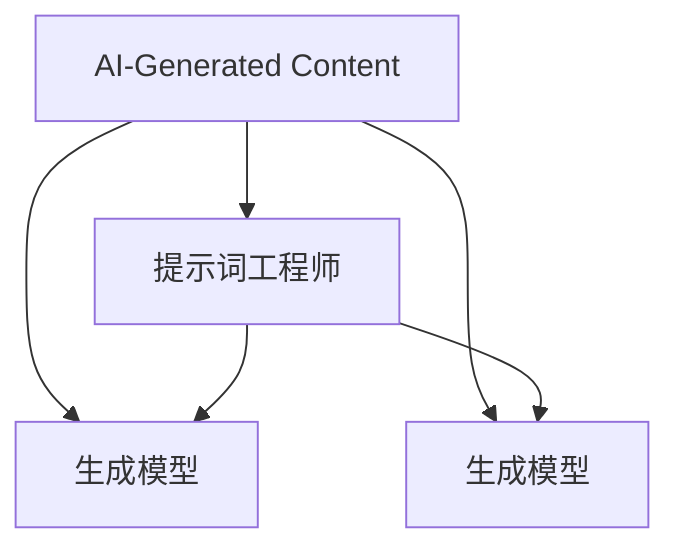

                 

## 提示词工程师：AIGC时代的新兴职业

### 关键词

- **提示词工程师**
- **AIGC**
- **生成模型**
- **人工智能内容生成**
- **AI工程师职业**

> 摘要：本文探讨了AIGC时代下新兴职业——提示词工程师的角色与职责。通过深入解析提示词工程师的核心技能、工作流程以及其与AIGC技术的紧密关联，本文旨在为读者呈现这一职业的独特价值和前景。同时，文章还通过具体案例展示了提示词工程师在实际项目中的应用，并提供了一些职业发展的最佳实践和未来展望。

### 引言

随着人工智能技术的飞速发展，人工智能生成内容（AIGC，AI-Generated Content）逐渐成为各类应用中的重要组成部分。从文本生成、图像生成到音频合成，AIGC技术正在改变内容创作的方方面面。在这一背景下，出现了一个新的职业角色——提示词工程师。本文将详细介绍这一职业的背景、职责、核心技能以及其在AIGC时代的重要性。

### 背景介绍

人工智能生成内容（AIGC）是指利用人工智能技术自动生成文本、图像、音频、视频等多种形式的内容。AIGC的核心在于生成模型的创新，这些模型能够通过学习和理解大量的数据，生成新的、符合特定需求的内容。近年来，生成对抗网络（GAN）、变分自编码器（VAE）、生成式预训练语言模型（如GPT）等技术的进步，极大地推动了AIGC的发展。

在这一技术浪潮中，提示词工程师应运而生。提示词工程师的主要职责是生成高质量的提示词（prompt），这些提示词是引导生成模型生成目标内容的关键。因此，提示词工程师在AIGC技术体系中扮演着至关重要的角色。

### 核心概念与联系

为了更好地理解提示词工程师的工作，我们需要明确以下几个核心概念及其相互之间的联系：

- **AIGC（AI-Generated Content）**：人工智能生成内容，包括文本、图像、音频等多种形式。
- **生成模型**：如GPT、DALL-E等，是AIGC技术的核心组件，负责生成内容。
- **提示词工程师**：在AIGC时代中的专业角色，主要负责生成高质量的提示词，引导AI生成内容。

以下是这些概念之间的联系：



### 核心算法原理讲解

AIGC技术依赖于多种核心算法，其中生成模型是关键。生成模型通常分为两大类：基于判别器的生成模型和自编码器。以下我们将重点讲解一种典型的生成模型——GPT（Generative Pre-trained Transformer）。

#### GPT模型原理

GPT模型基于Transformer架构，其核心思想是自注意力机制。Transformer模型通过多头自注意力机制，能够捕捉输入文本序列中的长距离依赖关系。这使得GPT模型在语言生成任务中表现出色。

GPT模型的工作流程大致如下：

1. **输入编码**：将输入文本转换为模型能够处理的向量表示。
2. **自注意力机制**：模型对输入向量进行多次自注意力计算，从而捕捉长距离依赖关系。
3. **前馈网络**：对自注意力结果进行前馈神经网络处理。
4. **输出生成**：通过模型的输出层生成新的文本序列。

以下是GPT模型的基本原理伪代码：

```python
# GPT模型基本原理伪代码

# 定义Transformer模型
class Transformer(Model):
    # 定义模型结构
    # ...

# 预训练
model = Transformer()
model.compile(optimizer='adam', loss='categorical_crossentropy')
model.fit(text_data, labels, epochs=5)

# 微调
model.fit(test_data, test_labels, epochs=1)
```

#### 数学模型和公式

GPT模型中的多头自注意力机制是核心组件之一。其数学公式如下：

$$
\text{Attention}(Q, K, V) = \text{softmax}\left(\frac{QK^T}{\sqrt{d_k}}\right)V
$$

其中，$Q, K, V$ 分别代表查询、键、值向量，$d_k$ 代表键向量的维度。

### 项目实战

为了更好地理解提示词工程师的实际工作，我们将通过一个具体案例来展示其应用。以下是使用GPT模型生成新闻摘要的项目实战。

#### 项目实战：生成新闻摘要

新闻摘要生成是AIGC技术的一个典型应用场景。以下是该项目的基本步骤：

1. **数据准备**：收集大量新闻文章，并将其分割成句子。
2. **模型训练**：使用GPT模型对句子进行预训练。
3. **新闻摘要生成**：输入新闻文章，使用GPT模型生成摘要。

以下是该项目的基本代码：

```python
# 导入GPT模型
from transformers import GPT2LMHeadModel, GPT2Tokenizer

# 加载GPT模型
tokenizer = GPT2Tokenizer.from_pretrained('gpt2')
model = GPT2LMHeadModel.from_pretrained('gpt2')

# 预训练
model.train()

# 新闻摘要生成
def generate_summary(article):
    inputs = tokenizer.encode(article, return_tensors='pt')
    summary_ids = model.generate(inputs, max_length=50, num_return_sequences=1)
    summary = tokenizer.decode(summary_ids[0])
    return summary
```

### 职业发展

提示词工程师作为AIGC时代的新兴职业，具有广阔的职业发展前景。以下是提示词工程师在职业发展中的一些最佳实践：

1. **掌握多领域知识**：提示词工程师需要具备跨学科的知识背景，包括计算机科学、语言学、数据科学等。通过不断学习和实践，提升自己的综合能力。

2. **熟练使用生成模型**：熟悉各种生成模型的工作原理和调优方法，能够根据不同应用场景选择合适的模型。

3. **关注用户体验**：了解用户需求，生成符合用户期望的高质量内容。

4. **参与开源项目**：积极参与开源项目，积累实战经验，提升个人技术影响力。

5. **持续学习**：AIGC技术不断进步，提示词工程师需要持续学习最新的技术动态和研究成果，保持自己的竞争力。

### 小结

提示词工程师是AIGC时代下涌现的新兴职业，承担着生成高质量内容的重要角色。通过对核心概念、算法原理和项目实战的讲解，本文展示了提示词工程师的工作职责和职业前景。随着AIGC技术的不断发展，提示词工程师将在未来发挥更加重要的作用。

### 注意事项与拓展阅读

在成为一名优秀的提示词工程师的道路上，以下是一些需要注意的事项和推荐拓展阅读：

#### 注意事项

1. **数据质量**：提示词工程师需要高度关注数据质量，确保训练数据清洁、多样、相关性强。
2. **隐私保护**：处理个人数据时，要严格遵守隐私保护法规，确保用户隐私安全。
3. **模型安全**：在模型设计和部署过程中，要考虑模型的安全性，防止恶意攻击和数据泄露。
4. **持续学习**：AIGC技术发展迅速，提示词工程师需要不断更新自己的知识和技能。

#### 拓展阅读

1. **《深度学习》（Deep Learning）**：Goodfellow等人的经典教材，深入讲解了神经网络和深度学习的原理。
2. **《生成对抗网络：理论与应用》（Generative Adversarial Nets: Theory and Applications）**：详细介绍了GAN的基本原理和应用。
3. **《NLP实战：深度学习技术》（Natural Language Processing with Deep Learning）**：介绍了NLP领域的深度学习技术，包括文本生成等应用。
4. **《AIGC：人工智能生成内容》（AI-Generated Content）**：一本关于AIGC技术全面介绍的书籍，适合进一步了解相关领域。

### 作者信息

作者：AI天才研究院/AI Genius Institute & 禅与计算机程序设计艺术 /Zen And The Art of Computer Programming

AI天才研究院专注于人工智能领域的教育和研究，致力于培养下一代AI领军人才。同时，我们也通过《禅与计算机程序设计艺术》等著作，推广计算机科学的哲学与艺术。希望通过本文，能够为读者带来关于提示词工程师职业的深入理解和启示。

