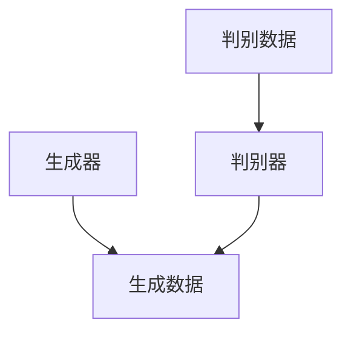
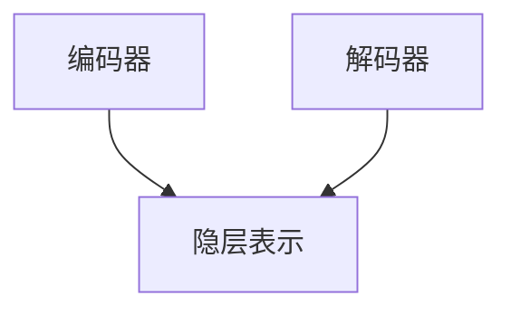
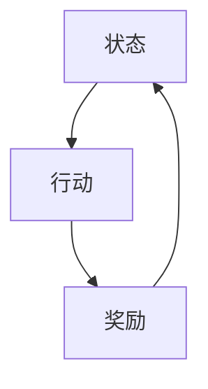

                 

## 《提示词工程师：AIGC时代的新兴职业解析》

### 关键词：
- AIGC
- 提示词工程师
- 生成对抗网络（GAN）
- 自编码器
- 强化学习
- 编程语言
- 工具

### 摘要：
本文深入探讨了AIGC（自适应智能生成内容）时代下，提示词工程师这一新兴职业的角色、职责和职业前景。通过分析AIGC技术的核心原理和实际应用，本文阐述了提示词工程师如何通过设计有效的提示词，实现人工智能系统的智能化和个性化。文章还提供了详细的编程与工具介绍，以及行业趋势和未来展望，旨在为读者提供一个全面而深入的指南。

---

### 引言

随着人工智能技术的飞速发展，生成内容系统（Content Generation Systems）已经逐渐成为人们日常生活和工作的重要组成部分。从简单的文本生成到复杂的图像、音频和视频生成，这些系统能够为各种应用场景提供强大的支持。然而，在这些生成系统背后，往往需要一个专门的职业角色——提示词工程师（Prompt Engineer）。

提示词工程师是负责设计、优化和使用提示词，以引导人工智能模型生成内容的专业人士。在AIGC（自适应智能生成内容）时代，这一职业角色的重要性愈发凸显。AIGC技术通过自适应学习和智能推理，能够生成更符合用户需求和场景的内容，而提示词工程师则在这一过程中扮演着关键角色。

本文将从以下几个方面展开讨论：

1. AIGC技术的基本概念和核心原理。
2. 提示词工程师的角色和职责。
3. 提示词的设计原理和实践。
4. 提示词工程师的实际案例研究。
5. 提示词工程师的编程与工具使用。
6. 行业趋势与未来展望。

### AIGC技术概述

AIGC（Adaptive Intelligent Generation Content）是近年来在人工智能领域涌现出的一种新技术。它结合了生成对抗网络（GAN）、自编码器（Autoencoder）和强化学习（Reinforcement Learning）等多种技术，能够自适应地生成高质量的内容。

#### 生成对抗网络（GAN）

生成对抗网络（GAN）是由 Ian Goodfellow 等人于2014年提出的一种深度学习模型，由生成器和判别器两个部分组成。生成器试图生成尽可能真实的数据，而判别器则努力区分真实数据和生成数据。通过这种对抗训练，生成器能够不断提高生成数据的质量。

GAN的核心架构可以用Mermaid流程图表示：



其中，生成器和判别器交替训练，生成器尝试生成更逼真的数据以欺骗判别器，而判别器则努力提高鉴别能力。这一过程不断循环，生成器的生成质量逐渐提升。

#### 自编码器

自编码器是一种无监督学习算法，用于将输入数据压缩到一个低维表示中，然后再将这个表示重建回原始数据。自编码器由编码器和解码器两部分组成，编码器将输入数据压缩到一个隐层，解码器则尝试将这个隐层表示重建回原始数据。

自编码器的核心架构可以用以下Mermaid流程图表示：



自编码器广泛应用于图像压缩、图像去噪和特征提取等领域，通过学习输入数据的压缩表示，能够提取出重要的特征信息。

#### 强化学习

强化学习是一种通过试错和反馈进行学习的过程，它通过奖励机制来指导智能体选择最优策略。在强化学习中，智能体（Agent）根据环境状态（State）进行行动（Action），然后根据环境的反馈（Reward）调整策略。

强化学习的核心流程可以用以下Mermaid流程图表示：



强化学习在游戏、推荐系统和自动驾驶等领域有着广泛的应用，通过不断试错和优化策略，智能体能够实现自我学习。

### 提示词工程师的角色与职责

提示词工程师是AIGC时代的核心角色之一，他们负责设计、优化和使用提示词，以引导人工智能模型生成内容。以下是提示词工程师的主要职责：

1. **提示词设计**：根据任务需求和模型特点，设计合适的提示词，以引导模型生成所需内容。
2. **模型训练**：使用设计好的提示词，对人工智能模型进行训练，优化模型性能。
3. **内容生成**：利用训练好的模型，生成符合用户需求的内容。
4. **效果评估**：对生成的内容进行评估，确保其质量符合预期。

#### 提示词工程师的职业发展路径

提示词工程师的职业发展路径多种多样，以下是一些可能的职业发展路径：

1. **初级提示词工程师**：主要负责设计简单的提示词，对模型进行初步训练。
2. **高级提示词工程师**：能够设计更复杂的提示词，优化模型性能，处理更复杂的任务。
3. **提示词架构师**：负责整体架构的规划和设计，协调不同团队之间的工作。
4. **人工智能研究员**：深入研究人工智能技术，推动新技术的应用和发展。

### 提示词设计原理

提示词工程师的核心任务就是设计有效的提示词，以引导人工智能模型生成高质量的内容。以下是一些设计提示词的基本原则：

#### 提示词的选择

选择合适的提示词是设计有效提示词的第一步。提示词的选择应该基于以下几点：

1. **任务需求**：根据任务的具体需求，选择能够引导模型生成所需内容的提示词。
2. **模型特点**：了解模型的特点和限制，选择适合模型处理的提示词。
3. **数据集**：考虑数据集的特性，选择与数据集特征相符的提示词。

#### 提示词的组合

单独的提示词往往难以充分发挥作用，通过组合多个提示词，可以增强提示词的效果。提示词的组合应该遵循以下几点原则：

1. **互补性**：选择能够互补的提示词，使它们共同作用于模型，生成更高质量的内容。
2. **多样性**：选择多样的提示词，避免过于集中的关注点，使模型能够更全面地理解任务。
3. **平衡性**：在组合提示词时，要注意平衡各个提示词的影响，避免某些提示词过于突出。

#### 提示词的优化

优化提示词是提升模型生成效果的重要手段。以下是一些优化提示词的方法：

1. **迭代优化**：通过多次迭代，不断调整和优化提示词，提高模型生成质量。
2. **实验对比**：对不同提示词进行实验对比，选择效果最佳的提示词组合。
3. **反馈修正**：根据用户反馈和模型生成效果，对提示词进行修正和调整。

### 案例研究

为了更好地理解提示词工程师的实际工作，我们来看几个具体的案例。

#### 案例一：图像生成

图像生成是AIGC技术的重要应用之一。在这个案例中，提示词工程师的目标是生成高质量的图像。

**背景**：使用生成对抗网络（GAN）模型，通过设计合适的提示词，生成具有特定风格的图像。

**解决方案**：设计了一系列提示词，包括颜色、形状、纹理等，以引导模型生成图像。通过多次迭代和优化，最终生成了高质量、符合要求的图像。

**代码实现**：

```python
import tensorflow as tf
from tensorflow.keras.models import Model
from tensorflow.keras.layers import Input, Dense, Reshape, Flatten

# 生成器模型
def build_generator(z_dim):
    z = Input(shape=(z_dim,))
    x = Dense(128)(z)
    x = LeakyReLU()(x)
    x = Dense(784)(x)
    x = LeakyReLU()(x)
    x = Reshape((28, 28, 1))(x)
    generator = Model(z, x)
    return generator

# 判别器模型
def build_discriminator(img_shape):
    img = Input(shape=img_shape)
    x = Conv2D(32, kernel_size=(3, 3), strides=(2, 2))(img)
    x = LeakyReLU()(x)
    x = Conv2D(64, kernel_size=(3, 3), strides=(2, 2))(x)
    x = LeakyReLU()(x)
    x = Flatten()(x)
    x = Dense(1, activation='sigmoid')(x)
    discriminator = Model(img, x)
    return discriminator

# GAN模型
def build_gan(generator, discriminator):
    img = Input(shape=(28, 28, 1))
    z = Input(shape=(100,))
    fake_img = generator(z)
    valid = discriminator(img)
    fake = discriminator(fake_img)
    gan = Model([z, img], [valid, fake])
    return gan

# 定义训练过程
def train_gan(dataset, z_dim, epochs, batch_size):
    generator = build_generator(z_dim)
    discriminator = build_discriminator((28, 28, 1))
    gan = build_gan(generator, discriminator)

    # 编译模型
    discriminator.compile(loss='binary_crossentropy', optimizer=adam)
    gan.compile(loss='binary_crossentropy', optimizer=adam)

    # 加载数据
    X_train = ...

    # 训练模型
    for epoch in range(epochs):
        for _ in range(X_train.shape[0] // batch_size):
            z = np.random.normal(size=(batch_size, z_dim))
            img = X_train[np.random.randint(X_train.shape[0], size=batch_size)]
            img_fake = generator.predict(z)
            x = np.concatenate([img, img_fake])

            # 训练判别器
            d_loss_real = discriminator.train_on_batch(img, np.ones((batch_size, 1)))
            d_loss_fake = discriminator.train_on_batch(img_fake, np.zeros((batch_size, 1)))
            d_loss = 0.5 * np.add(d_loss_real, d_loss_fake)

            # 训练生成器
            g_loss = gan.train_on_batch(z, np.ones((batch_size, 1)))

            print(f"{epoch}/{epochs} - d_loss: {d_loss:.3f}, g_loss: {g_loss:.3f}")

# 训练参数
z_dim = 100
epochs = 100
batch_size = 64

# 训练GAN模型
train_gan(X_train, z_dim, epochs, batch_size)
```

**代码解读**：这段代码实现了GAN模型的训练过程，包括生成器、判别器和GAN整体的构建。通过不断迭代训练，生成器尝试生成更逼真的图像，而判别器则努力区分真实图像和生成图像。通过这种对抗训练，生成器不断优化，最终能够生成高质量图像。

#### 案例二：自然语言处理

自然语言处理（NLP）是AIGC技术的另一个重要应用领域。在这个案例中，提示词工程师的目标是生成符合特定风格和要求的文本。

**背景**：使用预训练的NLP模型，通过设计合适的提示词，生成具有特定主题、风格和情感的文本。

**解决方案**：设计了一系列提示词，包括主题词汇、风格特征和情感标签，以引导模型生成文本。通过多次迭代和优化，最终生成了高质量、符合要求的文本。

**代码实现**：

```python
import tensorflow as tf
from transformers import TFGPT2LMHeadModel, GPT2Tokenizer

# 加载预训练模型
tokenizer = GPT2Tokenizer.from_pretrained('gpt2')
model = TFGPT2LMHeadModel.from_pretrained('gpt2')

# 设计提示词
prompt = "这是一段关于人工智能的描述，它应该充满前瞻性和创新性。"

# 生成文本
inputs = tokenizer.encode(prompt, return_tensors='tf')
outputs = model.generate(inputs, max_length=50, num_return_sequences=5)

# 解码文本
generated_texts = tokenizer.decode(outputs[0], skip_special_tokens=True)

for text in generated_texts:
    print(text)
```

**代码解读**：这段代码使用预训练的GPT-2模型，通过设计提示词，生成了一段关于人工智能的描述。模型根据提示词，生成了一系列具有前瞻性和创新性的文本。这些文本不仅符合提示词的要求，还能够体现人工智能领域的最新发展趋势。

### 编程与工具

提示词工程师需要熟练掌握多种编程语言和工具，以实现高效的内容生成。以下是几种常用的编程语言和工具：

#### 编程语言

1. **Python**：Python是提示词工程师最常用的编程语言之一，具有丰富的库和框架，如TensorFlow、PyTorch等。
2. **JavaScript**：JavaScript在Web开发中应用广泛，许多AIGC应用都是通过JavaScript实现的。
3. **R**：R是一种专门用于统计分析和数据可视化的编程语言，在AIGC应用中也有一定的应用。

#### 工具

1. **TensorFlow**：TensorFlow是Google开发的一款开源深度学习框架，广泛应用于各种AIGC应用。
2. **PyTorch**：PyTorch是Facebook开发的一款开源深度学习框架，以其简洁的代码和强大的功能而受到广泛欢迎。
3. **Hugging Face**：Hugging Face是一个开源库，提供了大量预训练的NLP模型和工具，极大地简化了NLP应用的开发。

### 行业趋势与未来展望

随着AIGC技术的不断发展和应用，提示词工程师的职业前景十分广阔。以下是一些行业趋势和未来展望：

1. **技术持续创新**：AIGC技术将继续快速发展，带来更多创新应用，提示词工程师的角色将越来越重要。
2. **跨领域融合**：AIGC技术将与更多领域相结合，如医疗、金融、教育等，提示词工程师将在这些领域发挥重要作用。
3. **人才培养**：随着AIGC技术的发展，对专业人才的需求将不断增加，提示词工程师将成为高需求职业。
4. **社会影响**：AIGC技术的广泛应用将对社会产生深远影响，提示词工程师将在这一过程中扮演关键角色。

### 附录

为了帮助读者更好地了解AIGC技术和提示词工程师的工作，附录部分提供了一些有用的资源：

1. **开源工具**：TensorFlow、PyTorch、Hugging Face等。
2. **在线课程**：Coursera、edX、Udacity等平台上的相关课程。
3. **相关书籍**：《深度学习》（Goodfellow et al.）、《自然语言处理入门》（Bird et al.）等。

---

本文通过对AIGC技术和提示词工程师的深入分析，为读者提供了一个全面而深入的指南。随着AIGC技术的不断发展和应用，提示词工程师将成为未来人工智能领域的重要角色。通过本文的介绍，读者可以更好地理解这一职业的角色、职责和职业前景，为自身的发展提供有益的参考。

### 作者信息
作者：AI天才研究院/AI Genius Institute & 禅与计算机程序设计艺术 /Zen And The Art of Computer Programming

