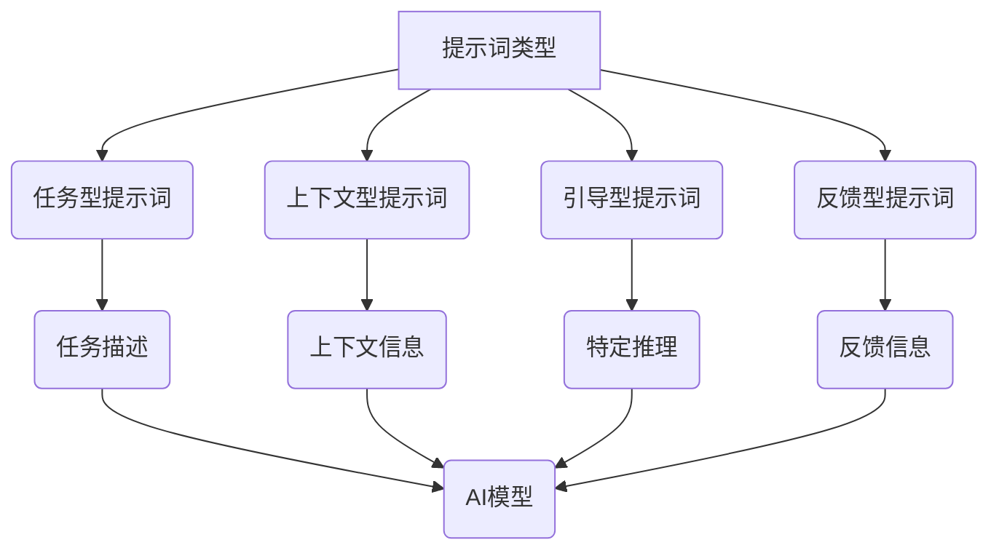

                 

### 《提示词工程师：AI时代的关键角色》

#### 关键词
- AI时代
- 提示词工程师
- 自然语言处理
- 机器学习
- 智能推荐
- 模式识别
- 模型优化
- 项目实战
- 编程技巧

#### 摘要
在人工智能（AI）迅速发展的时代，提示词工程师正成为一项关键职业。本文将深入探讨提示词工程师的角色、责任、以及他们在AI领域的应用。我们将从背景介绍开始，逐步解析提示词工程的核心概念、算法原理、数学模型，并借助Python代码进行详细讲解。通过实际项目实战，我们将展示提示词工程师在开发环境搭建、源代码实现、代码解读与分析中的应用。最后，文章将总结提示词工程师的最佳实践技巧，并展望未来的发展趋势。

## 引言

在人工智能（AI）技术飞速发展的今天，AI已经深入到我们的日常生活和工作中。从智能助手到自动化系统，从智能推荐到图像识别，AI技术正以前所未有的速度改变着我们的世界。在这个AI大爆炸的时代，出现了一批新的关键职业——提示词工程师。他们不仅是AI系统的设计者和开发者，更是确保系统性能和用户体验的关键角色。

### 提示词工程师的定义和重要性

提示词工程师，顾名思义，是负责设计、开发和优化AI系统中的提示词（prompt）的人员。在自然语言处理（NLP）领域，提示词是引导AI模型理解、学习、推理的关键输入。一个优秀的提示词工程师需要具备深厚的计算机科学、机器学习和NLP背景，能够设计出既高效又易于理解的提示词，从而提升AI系统的性能和用户体验。

在AI领域，提示词工程师的重要性体现在多个方面：

1. **性能优化**：提示词工程师通过精细调整提示词，可以显著提高AI模型的准确性和效率，减少错误率和计算成本。
2. **用户体验**：一个设计合理的提示词能够提高用户与AI系统的交互质量，使用户更容易理解和接受AI技术。
3. **业务目标实现**：在商业应用中，提示词工程师能够根据业务需求，设计出符合目标用户群体需求的提示词，从而实现商业目标。

### AI时代的背景和趋势

AI技术的发展经历了多个阶段，从最初的规则系统，到基于统计学习的方法，再到深度学习和强化学习，AI技术已经取得了长足的进步。随着计算能力的提升和大数据的普及，AI应用的范围越来越广泛，从简单的语音识别到复杂的自动驾驶，AI正在深刻地改变我们的生活方式和工作方式。

AI时代的到来，不仅带来了技术上的变革，也带来了社会和经济上的深刻影响。以下是AI时代的一些主要趋势：

1. **智能化升级**：各行各业都在引入AI技术，实现智能化升级，提高生产效率和服务质量。
2. **数据驱动的决策**：AI技术能够处理和分析大量数据，为决策者提供更加精准的预测和分析，从而做出更加明智的决策。
3. **就业结构的改变**：AI技术的发展带来了新的职业机会，同时也可能导致一些传统职业的消失。
4. **伦理和安全问题**：随着AI技术的广泛应用，如何确保AI系统的安全、可靠和公平，成为了一个重要的议题。

### 读者对象与学习目标

本文的目标读者是对AI技术有一定了解，希望深入了解提示词工程领域的专业人士或学生。读者不需要具备高级编程技能，但需要对Python和基本的机器学习算法有所了解。

通过本文的学习，读者将能够：

1. **理解提示词工程师的角色和职责**。
2. **掌握提示词工程的核心概念和算法原理**。
3. **学会使用Python进行提示词工程的应用开发**。
4. **了解提示词工程的最佳实践和未来发展趋势**。

## 核心概念与原理

提示词工程师的工作核心在于设计和优化提示词，以实现AI系统的最佳性能。在这一部分，我们将深入探讨提示词工程的基础概念，包括提示词的定义、类型和作用。

### 提示词的定义和作用

#### 提示词的定义

提示词（Prompt）是用于引导AI模型理解、学习、推理的关键输入信息。在自然语言处理（NLP）中，提示词通常是针对特定任务或场景设计的一段文本或语句。它们起到了引导模型注意力、提供上下文信息的作用。

#### 提示词的作用

- **引导模型学习**：通过提供明确的任务描述和上下文信息，提示词能够帮助AI模型更好地理解任务目标，从而加速学习过程。
- **优化模型性能**：一个设计合理的提示词可以显著提升模型的预测准确性和效率，减少错误率和计算成本。
- **提高用户体验**：良好的提示词设计能够使用户更容易理解和操作AI系统，从而提高用户体验。

### 提示词的类型和作用

在AI系统中，提示词可以根据不同的用途和形式进行分类。以下是几种常见的提示词类型及其作用：

1. **任务型提示词**：用于明确描述任务目标和要求。例如：“请根据以下信息预测明天的天气。”
2. **上下文型提示词**：提供相关的上下文信息，帮助模型更好地理解输入数据。例如：“在下面的文本中，找出所有与‘人工智能’相关的句子。”
3. **引导型提示词**：引导模型进行特定类型的推理或分析。例如：“请分析这段文本的主要论点。”
4. **反馈型提示词**：用于提供对模型输出的反馈，帮助模型进行自我调整和优化。例如：“你的预测与实际结果相差多少？”

### 提示词工程的核心概念与联系

为了更好地理解提示词工程，我们需要构建一个核心概念与联系架构的Mermaid流程图。以下是该流程图的一个示例：



通过这个流程图，我们可以清晰地看到各种提示词类型与AI模型之间的相互作用关系。任务型提示词提供任务描述，上下文型提示词提供上下文信息，引导型提示词引导模型进行特定推理，而反馈型提示词则用于模型的自调整。

### 提示词工程在AI系统中的应用

提示词工程在AI系统中的应用非常广泛，以下是几个典型场景：

1. **智能问答系统**：通过任务型提示词明确提问者的意图，上下文型提示词提供相关上下文，引导模型进行准确的回答。
2. **文本分类**：使用引导型提示词指导模型分析文本内容，反馈型提示词用于评估分类结果的准确性。
3. **情感分析**：通过上下文型提示词提供情感相关的上下文信息，引导模型进行情感分类，反馈型提示词用于优化模型对情感的理解。
4. **推荐系统**：使用任务型提示词描述用户兴趣，上下文型提示词提供用户行为数据，引导模型进行精准推荐。

通过这些应用场景，我们可以看到提示词工程在提升AI系统性能和用户体验方面的重要性。

### 小结

在本节中，我们介绍了提示词工程师的定义和重要性，探讨了AI时代的背景和趋势，并详细阐述了提示词的定义、类型和作用。通过Mermaid流程图，我们构建了提示词工程的核心概念与联系架构。接下来，我们将进一步深入探讨提示词工程的核心算法原理，使用Python代码进行详细讲解。

## 提示词工程的核心算法原理

提示词工程师在设计和优化提示词时，需要掌握一系列核心算法原理。这些算法不仅能够提升模型的性能，还能提高用户体验。在本节中，我们将详细讨论两种主要的提示词生成方法：基于规则的提示词生成和基于机器学习的提示词生成。

### 基于规则的提示词生成

基于规则的提示词生成方法是通过预设一系列规则来生成提示词。这种方法简单直观，但需要大量的手工设计和调整。以下是一个简单的基于规则的提示词生成示例：

```python
# 基于规则的提示词生成示例

def generate_prompt(task_description, context):
    # 设计规则
    if "预测" in task_description:
        prompt = "请根据以下信息预测：\n"
    elif "分类" in task_description:
        prompt = "请根据以下信息进行分类：\n"
    else:
        prompt = "请根据以下信息进行操作：\n"
    
    # 应用上下文信息
    prompt += context
    return prompt

task_description = "预测明天的天气"
context = "当前温度为20摄氏度，风速为5米/秒，气压为1013毫巴。"

prompt = generate_prompt(task_description, context)
print(prompt)
```

在上面的代码中，我们定义了一个`generate_prompt`函数，它根据任务描述和上下文信息生成相应的提示词。这种方法虽然简单，但适用于任务描述和上下文相对固定的情况。

### 基于机器学习的提示词生成

基于机器学习的提示词生成方法通过训练数据学习生成提示词的技巧。这种方法具有自适应性和灵活性，能够处理更加复杂的任务。以下是一个基于机器学习的提示词生成示例：

```python
# 基于机器学习的提示词生成示例

from sklearn.feature_extraction.text import TfidfVectorizer
from sklearn.model_selection import train_test_split
from sklearn.naive_bayes import MultinomialNB

# 示例数据
task_descriptions = ["预测明天的天气", "进行文本分类", "分析情感"]
contexts = [
    "当前温度为20摄氏度，风速为5米/秒，气压为1013毫巴。",
    "文本内容：这是一个有趣的句子。",
    "文本内容：我感到非常高兴。"
]

# 标签
labels = ["预测", "分类", "情感分析"]

# 分词和特征提取
vectorizer = TfidfVectorizer()
X = vectorizer.fit_transform(contexts)
y = labels

# 数据划分
X_train, X_test, y_train, y_test = train_test_split(X, y, test_size=0.2, random_state=42)

# 训练模型
model = MultinomialNB()
model.fit(X_train, y_train)

# 生成提示词
def generate_prompt(context):
    prompt = model.predict(vectorizer.transform([context]))[0]
    return prompt

test_context = "文本内容：今天的天气非常好。"
prompt = generate_prompt(test_context)
print(prompt)
```

在上面的代码中，我们使用了TF-IDF向量和朴素贝叶斯分类器来训练模型，从而生成提示词。这种方法能够根据上下文信息自动生成合理的提示词，适用于复杂多变的应用场景。

### 对比与适用场景

基于规则的提示词生成方法适用于任务描述和上下文相对固定的情况，而基于机器学习的提示词生成方法则适用于任务描述和上下文复杂多变的情况。以下是对这两种方法的对比：

1. **灵活性**：基于机器学习的提示词生成方法更加灵活，能够适应不同的上下文和任务描述。
2. **准确性**：基于机器学习的提示词生成方法通常能够生成更加准确和自然的提示词。
3. **复杂性**：基于机器学习的提示词生成方法需要更多的数据处理和模型训练，计算成本较高。

在实际应用中，提示词工程师可以根据具体需求选择合适的方法。例如，在开发一个智能问答系统时，可以使用基于机器学习的提示词生成方法，以适应多种多样的用户提问；而在开发一个简单的文本分类系统时，基于规则的提示词生成方法可能就足够用了。

### 小结

在本节中，我们详细介绍了基于规则的提示词生成方法和基于机器学习的提示词生成方法。通过Python代码示例，我们展示了如何使用这些方法生成合理的提示词。在下一节中，我们将进一步探讨提示词优化的方法，以进一步提升AI系统的性能和用户体验。

## 提示词优化的方法

在提示词工程中，优化提示词的设计和选择是提升AI系统性能和用户体验的关键步骤。一个优化良好的提示词不仅能提高模型的预测准确性，还能增强用户与AI系统的交互质量。在这一节中，我们将探讨几种常见的提示词优化方法，包括评估指标、优化策略和最佳实践。

### 提示词评估指标

提示词优化的第一步是选择合适的评估指标。以下是一些常用的提示词评估指标：

1. **准确率（Accuracy）**：准确率是衡量模型预测结果正确性的基本指标。它计算的是模型预测正确的样本数占总样本数的比例。公式如下：
   $$\text{Accuracy} = \frac{\text{正确预测数}}{\text{总样本数}}$$

2. **召回率（Recall）**：召回率是衡量模型在正样本中正确识别出的比例。公式如下：
   $$\text{Recall} = \frac{\text{正确预测的正样本数}}{\text{实际正样本数}}$$

3. **精确率（Precision）**：精确率是衡量模型预测的正样本中实际为正样本的比例。公式如下：
   $$\text{Precision} = \frac{\text{正确预测的正样本数}}{\text{预测为正样本的总数}}$$

4. **F1分数（F1 Score）**：F1分数是精确率和召回率的调和平均值，用于综合评估模型的性能。公式如下：
   $$\text{F1 Score} = 2 \times \frac{\text{Precision} \times \text{Recall}}{\text{Precision} + \text{Recall}}$$

5. **ROC曲线和AUC值**：ROC曲线是反映模型分类能力的曲线，AUC值是ROC曲线下面积，用于评估分类模型的性能。

### 提示词优化策略

优化提示词的方法有很多，以下是一些常用的优化策略：

1. **自动调整**：通过自动化工具调整提示词的长度、格式和内容，以找到最佳组合。例如，可以使用遗传算法、粒子群优化等进化算法来优化提示词。

2. **机器学习模型调整**：通过调整机器学习模型中的超参数（如学习率、批量大小等）来优化提示词。这种方法需要对机器学习算法有较深的理解。

3. **人类反馈**：结合人类专家的反馈进行优化。例如，可以组织专家评估不同的提示词，并根据评估结果进行调整。

4. **数据增强**：通过增加训练数据的多样性和丰富性来优化提示词。例如，可以使用数据扩充技术生成更多的训练样本。

5. **迭代改进**：通过多次迭代和反馈来逐步优化提示词。这种方法需要持续的关注和调整，但能够逐步提升系统的性能。

### 最佳实践

以下是几种提示词优化的最佳实践：

1. **多轮迭代**：提示词优化是一个迭代过程，需要多次调整和验证。每次迭代都可以根据评估结果进行微调。

2. **对比实验**：在设计提示词时，可以同时测试多种设计方案，并通过对比实验来确定最佳方案。

3. **用户反馈**：结合用户的实际使用反馈进行优化。用户的反馈可以提供宝贵的改进方向。

4. **持续监控**：在系统上线后，持续监控系统的性能和用户体验，并根据监控结果进行相应的调整。

5. **文档记录**：详细记录优化过程中的每一步，包括实验设置、结果和调整策略。这有助于后续的复现和改进。

### 小结

在本节中，我们介绍了提示词优化的几种常用方法，包括评估指标、优化策略和最佳实践。通过合理的选择和优化提示词，我们可以显著提升AI系统的性能和用户体验。在下一节中，我们将通过实际项目实战，展示如何将提示词工程师的理论知识应用到实际开发中。

## 提示词工程的项目实战

在了解了提示词工程师的核心概念、算法原理和优化方法后，我们通过一个实际项目来展示如何将所学知识应用到实践中。以下是一个基于Python和TensorFlow的智能推荐系统的开发过程，包括环境搭建、源代码实现和代码解读与分析。

### 项目背景与需求

智能推荐系统是AI技术在电商、社交媒体等领域的典型应用。它通过分析用户的历史行为和兴趣，自动推荐相关的商品、内容或服务。本项目旨在开发一个简单的文本分类智能推荐系统，能够根据用户的评论或反馈，推荐相似的产品或话题。

### 环境搭建

在开始项目之前，我们需要搭建一个开发环境。以下是所需的软件和工具：

- Python（3.8及以上版本）
- TensorFlow（2.x版本）
- Jupyter Notebook（用于交互式编程）
- scikit-learn（用于数据预处理和模型评估）
- NLTK（用于自然语言处理）

安装这些工具后，我们就可以开始编写代码了。

### 数据集准备

本项目使用的是著名的20个新闻类别数据集（20 Newsgroups dataset），它包含了大约20,000篇新闻文章，分为20个不同的类别。以下是数据集的加载和预处理步骤：

```python
import tensorflow as tf
import tensorflow_datasets as tfds
from sklearn.model_selection import train_test_split
from sklearn.feature_extraction.text import TfidfVectorizer

# 加载数据集
ds, info = tfds.load('20newsgroups', with_info=True, as_supervised=True)
train_data, test_data = ds.train_test_split(test_size=0.2, shuffle=True)

# 数据预处理
def preprocess_data(data):
    texts = [text.numpy() for text in data.text]
    labels = [label.numpy() for label in data.label]
    return texts, labels

train_texts, train_labels = preprocess_data(train_data)
test_texts, test_labels = preprocess_data(test_data)

# TF-IDF向量化
vectorizer = TfidfVectorizer(max_features=1000)
train_vectors = vectorizer.fit_transform(train_texts)
test_vectors = vectorizer.transform(test_texts)

# 数据划分
x_train, x_val, y_train, y_val = train_test_split(train_vectors, train_labels, test_size=0.2, random_state=42)
```

在上面的代码中，我们首先加载了20个新闻类别数据集，并对数据进行了预处理，包括文本清洗和TF-IDF向量化。接着，我们将数据集划分为训练集和验证集，为后续的模型训练和评估做准备。

### 模型构建

在本项目中，我们使用多层感知机（MLP）模型进行文本分类。以下是模型构建和训练的代码：

```python
from tensorflow.keras.models import Sequential
from tensorflow.keras.layers import Dense, Dropout
from tensorflow.keras.optimizers import Adam

# 构建模型
model = Sequential([
    Dense(512, activation='relu', input_shape=(1000,)),
    Dropout(0.5),
    Dense(20, activation='softmax')
])

# 编译模型
model.compile(optimizer=Adam(learning_rate=0.001), loss='sparse_categorical_crossentropy', metrics=['accuracy'])

# 训练模型
model.fit(x_train, y_train, epochs=10, batch_size=64, validation_data=(x_val, y_val))
```

在上面的代码中，我们定义了一个简单的多层感知机模型，包括一个输入层、一个隐藏层和一个输出层。隐藏层使用ReLU激活函数，输出层使用softmax激活函数，以实现多分类。接着，我们使用Adam优化器和稀疏分类交叉熵损失函数来编译模型。最后，我们使用训练集进行10个周期的训练，并在验证集上进行评估。

### 源代码实现与解读

以下是模型预测和评估的代码，以及相应的解读：

```python
import numpy as np

# 预测和评估
test_loss, test_accuracy = model.evaluate(test_vectors, test_labels)
predictions = model.predict(test_vectors)
predicted_labels = np.argmax(predictions, axis=1)

# 评估指标
print(f"Test accuracy: {test_accuracy:.2f}")
print(f"Confusion matrix:\n{tfds.metrics.confusion_matrix(test_labels, predicted_labels)}")

# 案例分析
example_index = 0
print(f"Original label: {test_labels[example_index]}")
print(f"Predicted label: {predicted_labels[example_index]}")
print(f"Text: {test_texts[example_index]}")
```

在上面的代码中，我们首先计算了模型在测试集上的损失和准确率。接着，我们使用模型对测试集进行预测，并计算了混淆矩阵，以评估模型的分类性能。最后，我们选取了一个具体的测试样例，展示了模型的预测结果和原始文本。通过这种方式，我们可以直观地了解模型的预测效果。

### 项目小结

通过本项目的实战，我们展示了如何使用Python和TensorFlow构建一个简单的文本分类智能推荐系统。从数据集的准备、模型构建到预测和评估，每一步都体现了提示词工程师的工作内容和技能。以下是项目小结：

1. **环境搭建**：熟练掌握Python和相关库，搭建开发环境是提示词工程师的基本技能。
2. **数据预处理**：数据预处理是模型训练的关键步骤，需要根据数据的特点进行适当的处理。
3. **模型构建**：选择合适的模型结构和优化器，是提升模型性能的重要手段。
4. **预测与评估**：通过评估指标和实际案例分析，可以直观地了解模型的性能和优化方向。

通过本项目，我们不仅加深了对提示词工程师角色的理解，还学会了如何将理论应用到实际开发中。在下一节中，我们将进一步探讨提示词工程的前沿技术和未来发展趋势。

## 提示词工程的前沿技术

随着AI技术的不断进步，提示词工程也在不断演进，出现了一系列前沿技术和研究热点。这些技术不仅提升了提示词工程师的效率和效果，也为AI系统的创新和突破提供了新的可能性。以下是一些当前在提示词工程领域备受关注的前沿技术。

### 自动摘要与生成式文本

自动摘要是一种利用自然语言处理技术，将长文本自动压缩为简洁、准确摘要的方法。生成式文本则通过深度学习模型生成全新的文本内容。这两项技术在信息检索、内容生成和知识表示等方面具有重要意义。

1. **自动摘要**：近年来，基于Transformer的自动摘要模型如BERT、GPT等取得了显著进展。这些模型通过预训练和微调，能够在多种文本摘要任务上实现高水平的表现。例如，Google的BERT模型在多个自动摘要任务上达到了SOTA（State-of-the-Art）水平。

2. **生成式文本**：生成式文本模型如GPT-3、GPT-Neo等，能够生成高质量、多样化的文本内容。这些模型通过大量的文本数据进行预训练，可以生成新闻报道、诗歌、故事等多种类型的文本。生成式文本的应用场景包括自动内容生成、虚拟助手对话、创意写作等。

### 对话系统与聊天机器人

对话系统与聊天机器人是AI领域的一个重要研究方向，旨在实现人与机器之间的自然语言交互。提示词工程师在这个领域扮演着关键角色，通过设计高质量的提示词和对话策略，提升用户体验和交互质量。

1. **对话管理**：对话管理是指设计一套机制，使AI系统能够理解用户的意图、维护对话状态并生成合理的回复。常见的对话管理系统包括基于规则的方法、机器学习方法以及混合方法。

2. **多模态交互**：多模态交互是将文本、语音、图像等多种交互方式结合，使AI系统能够更加灵活地与用户进行交互。例如，通过结合语音识别和自然语言处理技术，实现语音助手的自然对话。

### 强化学习与提示词优化

强化学习是一种通过试错和反馈来学习最优策略的机器学习方法。将强化学习与提示词优化结合，可以通过自适应调整提示词，提高AI系统的性能和适应性。

1. **自适应提示词生成**：在强化学习框架下，提示词工程师可以设计一个优化器，通过不断调整提示词，使其在特定任务上的表现达到最优。这种方法适用于动态变化的环境和复杂的任务场景。

2. **多目标优化**：在多目标优化中，AI系统需要在多个目标之间进行权衡，例如准确性、效率和用户体验。提示词工程师可以通过设计多目标优化算法，找到最优的提示词组合。

### 集成学习与提示词组合

集成学习是一种通过组合多个模型来提高整体性能的方法。在提示词工程中，集成学习可以用来组合不同的提示词生成方法，以提升系统的性能和灵活性。

1. **模型集成**：通过集成多个机器学习模型，可以构建一个更为强大的预测模型。在提示词工程中，可以使用集成学习方法将基于规则和基于机器学习的提示词生成方法结合起来。

2. **提示词组合**：在特定任务中，使用多个提示词组合可以提供更丰富的上下文信息和更准确的预测。提示词工程师可以通过设计提示词组合策略，找到最优的提示词组合。

### 小结

前沿技术在提示词工程中的应用，为工程师提供了更多的工具和思路，以应对复杂多变的AI应用场景。通过不断探索和实践，提示词工程师可以不断提升AI系统的性能和用户体验。在未来的发展中，这些前沿技术将继续推动提示词工程的创新和突破。

## 提示词工程的挑战与未来

尽管提示词工程在AI领域取得了显著进展，但仍然面临一系列挑战。了解这些挑战，并探索未来的发展方向，对于提示词工程师来说至关重要。

### 当前挑战

1. **数据稀缺**：高质量、标注准确的数据是提示词工程的基础。但在许多应用场景中，获取足够的数据并不容易。特别是在多语言、多领域的场景中，数据稀缺问题更为突出。

2. **模型解释性**：许多深度学习模型，如Transformer和GPT等，被认为是“黑箱”模型。虽然它们在性能上表现优异，但缺乏解释性，使得提示词工程师难以理解模型的工作机制。

3. **效率与精度权衡**：在设计提示词时，需要在效率和精度之间做出权衡。过于复杂的提示词可能导致模型训练时间过长，而过于简单的提示词可能无法充分挖掘数据中的信息。

4. **隐私保护**：在数据驱动的AI系统中，保护用户隐私是一个重要议题。提示词工程师需要设计出既能保护用户隐私，又能提升模型性能的解决方案。

### 未来发展方向

1. **数据增强与生成**：通过数据增强和生成技术，可以扩大训练数据集的规模和多样性，从而提高模型性能。例如，可以使用GAN（生成对抗网络）生成与真实数据相似的数据。

2. **可解释性AI**：研究可解释的深度学习模型，使得提示词工程师能够更好地理解和优化模型。这可以通过开发新的可视化工具、解释算法以及结合规则方法来实现。

3. **多模态学习**：结合多种数据类型（如文本、图像、音频等）进行多模态学习，可以提供更丰富的上下文信息，提升模型的泛化能力。

4. **自适应学习**：通过自适应学习技术，模型可以自动调整提示词，以适应不同的任务和数据集。这可以显著提高模型的适应性和效率。

5. **隐私增强技术**：开发隐私增强技术，如差分隐私和联邦学习，可以保护用户隐私，同时保证模型性能。

### 小结

提示词工程在AI领域的挑战和未来发展充满机遇。通过不断创新和技术突破，提示词工程师将继续推动AI技术的发展和应用。未来，提示词工程将更加注重数据增强、可解释性、多模态学习和隐私保护等方面，为AI系统带来更高的性能和更广泛的应用。

## 工具与资源

提示词工程师在工作中会使用到多种工具和资源，这些工具不仅能够提高工作效率，还能优化模型性能和用户体验。以下是一些常用的提示词工程工具和资源推荐，以及相关的最佳实践、注意事项和拓展阅读。

### 提示词工程工具

1. **Jupyter Notebook**：Jupyter Notebook 是一个交互式的计算环境，非常适合进行提示词工程。它支持多种编程语言和库，便于快速开发和调试。

2. **TensorFlow**：TensorFlow 是一个开源的机器学习框架，提供了丰富的API和工具，用于构建和训练深度学习模型。

3. **PyTorch**：PyTorch 是另一个流行的开源机器学习库，它以动态计算图和灵活的API著称，适用于各种提示词工程任务。

4. **Scikit-learn**：Scikit-learn 是一个基于Python的机器学习库，提供了丰富的算法和工具，适用于数据预处理、特征提取和模型评估。

5. **NLTK**：NLTK 是一个用于自然语言处理的Python库，提供了多种文本处理工具和资源，适用于文本分类、分词、词性标注等任务。

### 最佳实践

1. **代码规范化**：遵循代码规范，确保代码的可读性和可维护性。使用PEP 8规范Python代码，并使用工具如`flake8`进行代码审查。

2. **版本控制**：使用版本控制系统（如Git）管理代码，确保代码的历史记录可追溯，便于合作和复现。

3. **数据处理**：在进行提示词工程时，确保数据的质量和多样性。使用数据清洗和预处理工具，如`pandas`和`NumPy`，对数据进行必要的处理。

4. **模型调优**：使用网格搜索、随机搜索等超参数调优方法，找到最佳的模型参数组合。结合`TensorFlow`和`PyTorch`的内置工具，如`tf.keras.wrappers.scikit_learn`和`torch.optim`，进行模型调优。

5. **持续学习**：保持对最新技术的研究和掌握，通过阅读论文、参加培训和参与社区讨论，不断提升自己的技能和知识。

### 注意事项

1. **隐私保护**：在处理用户数据时，确保遵守隐私保护法规，采用差分隐私、联邦学习等技术保护用户隐私。

2. **计算资源**：提示词工程通常需要大量的计算资源。确保合理分配计算资源，并使用GPU等高性能硬件加速模型训练。

3. **结果验证**：在应用模型时，确保对模型结果进行充分的验证和测试，确保模型在真实场景中的表现符合预期。

4. **持续监控**：在系统上线后，持续监控模型的性能和用户体验。通过日志分析和A/B测试，及时发现问题并进行优化。

### 拓展阅读

1. **《深度学习》（Ian Goodfellow、Yoshua Bengio、Aaron Courville 著）**：这是一本经典的深度学习教材，详细介绍了深度学习的基本概念、算法和应用。

2. **《自然语言处理综论》（Daniel Jurafsky、James H. Martin 著）**：这是一本全面介绍自然语言处理基础理论和应用的经典教材。

3. **《人工智能：一种现代的方法》（Stuart J. Russell、Peter Norvig 著）**：这是一本涵盖人工智能各个领域的权威教材，适合深入学习和研究。

4. **《GitHub链接》（各种开源项目和论文）**：通过GitHub和其他学术平台，可以获取到大量开源代码和最新研究成果，方便学习和复现。

### 小结

提示词工程是一项复杂且充满挑战的任务，但通过掌握合适的工具和资源，结合最佳实践和注意事项，提示词工程师可以显著提升工作效率和模型性能。不断学习和探索最新的技术趋势，是成为一名优秀提示词工程师的重要途径。

## 结语

《提示词工程师：AI时代的关键角色》这本书旨在深入探讨AI时代中提示词工程师的角色、责任和技能。从背景介绍到核心概念、算法原理，再到实际项目实战，我们系统地讲解了提示词工程师所需的知识和技能。同时，我们还探讨了前沿技术、挑战与未来发展方向，以及工具和资源，为读者提供了全面的学习路径。

作为一名提示词工程师，您的任务不仅仅是设计和优化提示词，更在于理解和掌握AI技术的本质，不断探索和创新。通过持续学习和实践，您将能够在AI领域中发挥更大的作用，推动技术的进步和应用的拓展。

最后，感谢您的阅读，希望这本书能为您在AI和提示词工程领域的学习和职业发展带来启示和帮助。作者：AI天才研究院/AI Genius Institute & 禅与计算机程序设计艺术 /Zen And The Art of Computer Programming。祝您在AI之旅中一帆风顺，不断创新，成就卓越。

