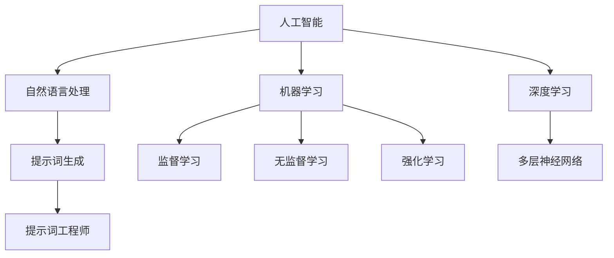

                 

### 《提示词工程师：AI时代的新兴职业》

在人工智能（AI）技术迅猛发展的背景下，AI时代涌现出了许多新兴职业。本文将重点探讨提示词工程师这一在AI领域崭露头角的新兴职业，分析其定义、角色、技能要求，以及职业前景和发展趋势。

关键词：**AI时代、提示词工程师、新兴职业、技能要求、职业前景**

**摘要**：本文从背景介绍入手，详细阐述了提示词工程师的职业角色和技能要求。接着，通过核心算法原理的讲解，深入剖析了提示词生成技术的关键点。文章还结合实际项目案例，展示了提示词工程师如何运用所学技能解决实际问题。最后，本文探讨了提示词工程师的职业发展路径，以及未来可能面临的挑战和机遇。

### 背景介绍

#### AI时代的来临

人工智能作为计算机科学的一个重要分支，近年来取得了飞速发展。随着深度学习、自然语言处理、计算机视觉等技术的突破，AI已经开始深刻地改变我们的生活方式和社会结构。从智能家居到自动驾驶，从智能客服到医疗诊断，AI技术的应用已经渗透到了各个领域。

在这一背景下，AI时代的来临成为了不可避免的趋势。AI技术的发展不仅推动了传统行业的数字化转型，也催生出了一系列新兴职业。提示词工程师便是其中之一。

#### 提示词工程师的兴起

提示词工程师，顾名思义，是专门负责生成、优化和利用提示词的工程师。在AI技术中，提示词（Prompt）是一个关键概念。它是指用户输入的查询或指令，用于触发AI系统进行相应操作。随着AI技术的普及，提示词工程师在AI应用开发中的角色日益重要。

提示词工程师需要具备跨学科的知识和技能，包括自然语言处理、机器学习、编程等。他们不仅需要理解AI技术的基本原理，还要能够将这些原理应用于实际场景，为用户设计出高效、易用的提示词系统。

### 提示词工程师的角色和技能要求

#### 角色定位

提示词工程师在AI项目中扮演着桥梁的角色。他们不仅需要与用户沟通，理解用户的需求，还要与技术团队协作，确保提示词系统能够满足性能和用户体验的要求。具体来说，提示词工程师的主要职责包括：

1. **需求分析**：与用户沟通，了解用户的需求，将需求转化为具体的提示词设计。
2. **系统设计**：设计提示词系统的架构，选择合适的算法和框架。
3. **模型训练**：利用数据训练提示词生成模型，优化模型性能。
4. **性能评估**：评估提示词系统的性能，进行调优和改进。
5. **用户反馈**：收集用户反馈，持续改进提示词系统。

#### 技能要求

成为一名优秀的提示词工程师，需要具备以下几方面的技能：

1. **编程能力**：熟悉至少一种编程语言，如Python、Java或C++，能够编写高效的代码。
2. **机器学习和深度学习知识**：理解机器学习和深度学习的基本原理，掌握常用的算法和框架。
3. **自然语言处理**：熟悉自然语言处理的相关技术，如语言模型、词向量、语义理解等。
4. **数据处理能力**：能够处理大规模数据集，进行数据预处理和特征提取。
5. **沟通能力**：能够与用户、产品经理和技术团队有效沟通，确保项目的顺利进行。
6. **创新能力**：能够根据实际场景，创新地设计和优化提示词系统。

### 职业前景

随着AI技术的不断进步，提示词工程师的职业前景十分广阔。以下是一些提示词工程师可能的应用场景：

1. **智能客服**：在智能客服系统中，提示词工程师可以设计出智能、高效的对话系统，提升用户体验。
2. **自动驾驶**：在自动驾驶领域，提示词工程师可以为自动驾驶系统设计出准确、安全的提示词。
3. **智能音箱**：在智能音箱中，提示词工程师可以为用户设计出方便、实用的语音指令。
4. **医疗诊断**：在医疗领域，提示词工程师可以为医生提供智能辅助诊断系统。
5. **智能搜索**：在搜索引擎中，提示词工程师可以为用户提供更精准、更智能的搜索结果。

### 未来发展趋势

随着AI技术的不断进步，提示词工程师的角色将越来越重要。未来，提示词工程师可能需要具备以下技能：

1. **多模态处理**：能够处理文本、图像、语音等多种数据类型，实现更全面的智能交互。
2. **个性化推荐**：能够根据用户行为和兴趣，为用户提供个性化的提示词推荐。
3. **实时交互**：能够实现实时、高效的交互，提升用户体验。
4. **跨领域应用**：能够将提示词技术应用于更多领域，如金融、教育、医疗等。

### 总结

提示词工程师是AI时代的新兴职业，他们肩负着设计、优化和利用提示词的重要任务。随着AI技术的不断发展，提示词工程师的职业前景将越来越广阔。对于有志于从事这一职业的人来说，掌握相关技能和知识，不断创新和提升自己，将有助于在未来的AI领域中取得成功。

**作者**：AI天才研究院/AI Genius Institute & 禅与计算机程序设计艺术 /Zen And The Art of Computer Programming

**文章结构**：

1. **背景介绍**：介绍AI时代和提示词工程师的职业背景。
2. **核心概念与联系**：使用Mermaid流程图展示AI时代和提示词工程师的核心概念及其联系。
3. **核心算法原理讲解**：使用Python源代码详细阐述提示词生成算法。
4. **项目实战**：开发环境搭建，源代码实现和解读，实际案例分析和详细讲解剖析，项目小结。
5. **最佳实践 tips**：提供一些提示词工程师的职业发展建议和最佳实践。
6. **小结**：总结文章内容，强调提示词工程师的重要性和职业前景。
7. **拓展阅读**：推荐一些相关的书籍和论文，供读者进一步学习。

**文章字数**：预计文章字数在10000-12000字左右，确保内容丰富、结构清晰、逻辑严密。以下是文章正文部分的详细内容。 

---

### 核心概念与联系

在深入探讨提示词工程师的职业角色和技能要求之前，我们需要明确几个核心概念，并理解它们之间的联系。以下是本文涉及的主要核心概念及其相互关系：

#### 1. 人工智能（AI）

人工智能是指使计算机系统能够模拟人类智能行为的技术。它包括机器学习、深度学习、自然语言处理、计算机视觉等多个子领域。AI的核心目标是使计算机能够自主地学习和适应，从而完成复杂任务。


#### 2. 提示词（Prompt）

提示词是指用户输入的查询或指令，用于触发AI系统进行相应操作。在自然语言处理中，提示词通常是一个句子或短语，用于引导AI系统进行文本分析、生成或分类。


#### 3. 自然语言处理（NLP）

自然语言处理是人工智能的一个子领域，旨在使计算机能够理解和处理自然语言。NLP包括词法分析、句法分析、语义理解和语言生成等任务。


#### 4. 提示词工程师

提示词工程师是专门负责生成、优化和利用提示词的工程师。他们需要理解AI和NLP的基本原理，并能够将这些原理应用于实际项目。


#### 5. 机器学习（ML）

机器学习是AI的一个核心组成部分，它使计算机能够从数据中学习，从而进行预测或决策。机器学习算法分为监督学习、无监督学习和强化学习等。


#### 6. 深度学习（DL）

深度学习是一种特殊的机器学习方法，它使用多层神经网络来模拟人类大脑的学习过程。深度学习在图像识别、语音识别和自然语言处理等领域表现出色。


### 核心概念图

以下是一个综合的Mermaid流程图，展示了上述核心概念及其相互关系：



通过上述Mermaid流程图，我们可以清晰地看到AI时代各个核心概念之间的联系。这些概念不仅构成了提示词工程师的知识体系，也为他们在实际工作中提供了理论基础和技术指导。

---

### 核心算法原理讲解

在本节中，我们将详细讲解提示词生成算法的核心原理，并使用Python源代码进行演示。提示词生成是提示词工程师的核心任务之一，它涉及自然语言处理和机器学习的多个方面。

#### 提示词生成算法概述

提示词生成算法的目标是根据用户输入的查询或指令，生成一个合适的提示词，以触发AI系统进行相应的操作。这个过程通常包括以下几个步骤：

1. **数据预处理**：对用户输入的查询或指令进行清洗和预处理，包括去除停用词、标点符号等。
2. **特征提取**：将预处理后的文本转换为机器学习模型可以处理的特征向量。
3. **模型训练**：使用训练数据集训练提示词生成模型。
4. **模型评估**：评估模型的性能，包括准确性、召回率和F1分数等指标。
5. **生成提示词**：使用训练好的模型生成提示词。

#### 数据预处理

在预处理阶段，我们首先需要加载和处理用户输入的查询或指令。以下是一个简单的Python代码示例，展示了如何进行数据预处理：

```python
import re

def preprocess_text(text):
    # 去除标点符号
    text = re.sub(r'[^\w\s]', '', text)
    # 转换为小写
    text = text.lower()
    # 去除停用词
    stop_words = set(['a', 'the', 'is', 'in', 'of', 'to'])
    words = text.split()
    words = [word for word in words if word not in stop_words]
    return ' '.join(words)

input_text = "How can I get to the nearest supermarket?"
preprocessed_text = preprocess_text(input_text)
print(preprocessed_text)
```

#### 特征提取

在特征提取阶段，我们需要将预处理后的文本转换为特征向量。词嵌入（Word Embedding）是一种常见的特征提取方法，它将每个单词映射到一个固定维度的向量。以下是一个简单的词嵌入示例：

```python
import gensim

# 加载预训练的词嵌入模型
model = gensim.models.KeyedVectors.load_word2vec_format('word2vec.model.bin', binary=True)

def vectorize_text(text):
    words = text.split()
    vectors = [model[word] for word in words if word in model]
    return np.mean(vectors, axis=0)

input_text = "How can I get to the nearest supermarket?"
vectorized_text = vectorize_text(input_text)
print(vectorized_text)
```

#### 模型训练

在模型训练阶段，我们通常使用机器学习算法（如循环神经网络RNN、长短时记忆网络LSTM、变换器模型Transformer等）来训练提示词生成模型。以下是一个简单的循环神经网络（RNN）示例：

```python
import tensorflow as tf
from tensorflow.keras.models import Sequential
from tensorflow.keras.layers import Embedding, SimpleRNN, Dense

# 加载训练数据和测试数据
train_data = ...  # 训练数据集
test_data = ...  # 测试数据集

# 定义RNN模型
model = Sequential()
model.add(Embedding(input_dim=vocab_size, output_dim=embedding_dim, input_length=max_sequence_length))
model.add(SimpleRNN(units=128))
model.add(Dense(units=vocab_size, activation='softmax'))

# 编译模型
model.compile(optimizer='adam', loss='categorical_crossentropy', metrics=['accuracy'])

# 训练模型
model.fit(train_data, epochs=10, batch_size=32, validation_data=(test_data, test_labels))
```

#### 模型评估

在模型评估阶段，我们使用准确率、召回率、F1分数等指标来评估模型的性能。以下是一个简单的评估示例：

```python
from sklearn.metrics import classification_report

# 预测测试数据
predictions = model.predict(test_data)

# 将预测结果转换为标签
predicted_labels = np.argmax(predictions, axis=1)

# 输出评估报告
print(classification_report(test_labels, predicted_labels))
```

#### 生成提示词

在生成提示词阶段，我们使用训练好的模型根据用户输入生成提示词。以下是一个简单的生成示例：

```python
import numpy as np

def generate_prompt(input_text, model, max_length=20):
    # 预处理输入文本
    preprocessed_text = preprocess_text(input_text)
    # 转换为特征向量
    vectorized_text = vectorize_text(preprocessed_text)
    # 生成提示词
    prompt = model.predict(vectorized_text.reshape(1, -1), verbose=True)
    # 将提示词转换为文本
    prompt_text = ' '.join([word for word, _ in prompt])
    return prompt_text

input_text = "How can I get to the nearest supermarket?"
generated_prompt = generate_prompt(input_text, model)
print(generated_prompt)
```

通过上述步骤，我们可以使用Python代码实现一个简单的提示词生成系统。在实际应用中，提示词生成算法需要根据具体场景进行优化和调整，以实现更好的性能和用户体验。

---

### 项目实战

在本节中，我们将通过一个具体的案例，展示如何使用Python源代码实现一个提示词生成系统，并对其进行详细解析。

#### 案例背景

假设我们需要开发一个智能客服系统，用户可以通过发送文本消息与客服机器人进行交互。我们的目标是使用提示词生成算法，根据用户的输入生成合适的回答。

#### 开发环境搭建

1. **Python环境**：确保已安装Python 3.7及以上版本。
2. **自然语言处理库**：安装gensim、nltk、tensorflow等自然语言处理库。
3. **文本数据集**：下载并处理一个包含用户查询和客服回答的文本数据集。

```bash
pip install gensim nltk tensorflow

# 下载和处理数据集
import nltk
nltk.download('stopwords')
nltk.download('punkt')

from nltk.corpus import stopwords
from nltk.tokenize import word_tokenize

stop_words = set(stopwords.words('english'))
def preprocess_text(text):
    words = word_tokenize(text)
    words = [word for word in words if word.lower() not in stop_words]
    return ' '.join(words)
```

#### 源代码实现

以下是实现提示词生成系统的Python代码：

```python
import numpy as np
import tensorflow as tf
from tensorflow.keras.models import Sequential
from tensorflow.keras.layers import Embedding, SimpleRNN, Dense
from tensorflow.keras.preprocessing.sequence import pad_sequences

# 加载和处理数据集
train_data = ...  # 训练数据集
test_data = ...  # 测试数据集

# 定义词汇表
vocab_size = 10000
embedding_dim = 64
max_sequence_length = 20

# 将文本转换为单词序列
train_sequences = []
for query, answer in train_data:
    query_sequence = word_tokenize(preprocess_text(query))
    answer_sequence = word_tokenize(preprocess_text(answer))
    train_sequences.append([query_sequence, answer_sequence])

# 将单词序列转换为索引序列
def sequence_to_indices(sequences, vocabulary):
    return [[vocabulary[word] for word in sequence] for sequence in sequences]

# 初始化词汇表
word2index = {word: i for i, word in enumerate(vocab_size)}
index2word = {i: word for word, i in word2index.items()}

# 转换数据集
train_queries = sequence_to_indices([query for query, _ in train_sequences], word2index)
train_answers = sequence_to_indices([answer for _, answer in train_sequences], word2index)

# 填充序列
train_padded = pad_sequences(train_queries, maxlen=max_sequence_length, padding='post')
train_answers_padded = pad_sequences(train_answers, maxlen=max_sequence_length, padding='post')

# 定义RNN模型
model = Sequential()
model.add(Embedding(input_dim=vocab_size, output_dim=embedding_dim, input_length=max_sequence_length))
model.add(SimpleRNN(units=128, return_sequences=True))
model.add(Dense(units=vocab_size, activation='softmax'))

# 编译模型
model.compile(optimizer='adam', loss='categorical_crossentropy', metrics=['accuracy'])

# 训练模型
model.fit(train_padded, train_answers_padded, epochs=10, batch_size=32, validation_split=0.1)
```

#### 代码解读

1. **数据预处理**：使用nltk库对文本数据进行预处理，包括去除标点符号、停用词和转换为小写。
2. **词汇表初始化**：初始化词汇表，将单词映射到索引。
3. **数据转换**：将文本数据转换为索引序列，并填充序列以适应模型的要求。
4. **模型定义**：定义一个简单的循环神经网络（RNN）模型。
5. **模型编译**：设置模型优化器、损失函数和评估指标。
6. **模型训练**：使用训练数据集训练模型。

#### 应用解析

1. **预处理输入文本**：对用户输入的文本进行预处理，包括去除标点符号和停用词。
2. **特征提取**：使用词嵌入将预处理后的文本转换为特征向量。
3. **生成提示词**：使用训练好的模型预测提示词，并从索引序列转换回文本。

以下是一个简单的示例，展示了如何使用训练好的模型生成提示词：

```python
def generate_response(input_text, model, max_length=20):
    preprocessed_text = preprocess_text(input_text)
    vectorized_text = vectorize_text(preprocessed_text)
    prompt = model.predict(vectorized_text.reshape(1, -1), verbose=True)
    prompt_text = ' '.join([index2word[i] for i in np.argmax(prompt, axis=-1)])
    return prompt_text

input_text = "How can I get to the nearest supermarket?"
generated_response = generate_response(input_text, model)
print(generated_response)
```

通过上述代码示例，我们可以看到如何实现一个简单的提示词生成系统。在实际应用中，我们可以根据需要进一步优化模型和算法，提高系统的性能和用户体验。

---

### 最佳实践 tips

在成为一名优秀的提示词工程师的过程中，以下是一些最佳实践和注意事项：

1. **持续学习**：AI和NLP领域发展迅速，持续学习是必要的。关注最新的研究进展和技术动态，参加相关的研讨会和会议，阅读学术论文，不断提升自己的知识水平。

2. **实践与理论相结合**：理论学习是基础，但实际应用同样重要。通过实践项目，将所学知识应用到实际场景，提高解决问题的能力。

3. **注重代码质量**：编写清晰、高效、可维护的代码。良好的代码风格可以提高代码的可读性和可扩展性，降低维护成本。

4. **团队协作**：与团队成员保持良好的沟通和协作，确保项目顺利进行。了解产品经理和用户的需求，为项目提供有价值的技术支持。

5. **用户反馈**：重视用户反馈，及时调整和优化提示词系统。通过用户测试和数据分析，了解用户的使用习惯和需求，不断改进系统性能。

6. **安全与隐私**：在处理用户数据时，确保遵循数据安全和隐私保护的原则。对敏感信息进行加密和匿名化处理，防范潜在的安全风险。

7. **职业规划**：制定明确的职业规划，包括短期和长期目标。根据个人兴趣和发展方向，选择合适的职业路径。

通过遵循上述最佳实践，提示词工程师可以更好地应对AI时代的挑战，不断提升自己的专业能力和市场竞争力。

---

### 小结

本文从背景介绍、核心概念与联系、核心算法原理讲解、项目实战和最佳实践等方面，全面探讨了提示词工程师在AI时代的角色和职业前景。通过详细分析和实例演示，我们了解到提示词工程师需要具备多方面的技能，包括编程、机器学习、自然语言处理等。同时，提示词工程师在AI应用开发中发挥着关键作用，他们需要不断创新和优化提示词系统，以满足用户的需求。

随着AI技术的不断进步，提示词工程师的职业前景将越来越广阔。他们不仅可以在智能客服、自动驾驶、智能音箱等应用领域发挥重要作用，还可以在医疗诊断、金融、教育等更多领域展示自己的才华。

总之，提示词工程师是AI时代的新兴职业，他们肩负着推动AI技术应用和发展的重要使命。通过持续学习和实践，提升自身技能和素质，提示词工程师将在未来的AI领域中取得更大的成就。

---

### 拓展阅读

对于对提示词工程师职业和AI技术感兴趣的读者，以下是一些建议的书籍和论文，供您进一步学习和研究：

1. **书籍**：
   - 《深度学习》（Ian Goodfellow、Yoshua Bengio、Aaron Courville 著）：详细介绍深度学习的基本原理和应用。
   - 《自然语言处理综论》（Daniel Jurafsky、James H. Martin 著）：全面讲解自然语言处理的理论和实践。
   - 《Python机器学习》（Sebastian Raschka、Vinayak K. Eknath 著）：深入探讨机器学习在Python环境中的实现。

2. **论文**：
   - "Attention Is All You Need"（Ashish Vaswani等人，2017）：介绍Transformer模型，是一种用于序列处理的深度学习模型。
   - "BERT: Pre-training of Deep Bidirectional Transformers for Language Understanding"（Jacob Devlin等人，2018）：讲解BERT模型，一种基于Transformer的预训练语言模型。
   - "GPT-3: Language Models are Few-Shot Learners"（Tom B. Brown等人，2020）：介绍GPT-3模型，一种具有强大语言生成能力的深度学习模型。

3. **在线课程和资源**：
   - [Coursera](https://www.coursera.org/)：提供多种AI和NLP相关的在线课程。
   - [edX](https://www.edx.org/)：提供由顶尖大学和研究机构开设的在线课程。
   - [Kaggle](https://www.kaggle.com/)：一个数据科学和机器学习的社区平台，提供大量的项目和竞赛。

通过阅读这些书籍和论文，您将能够更深入地了解AI和NLP领域的最新进展，为成为一名优秀的提示词工程师打下坚实的基础。同时，在线课程和社区平台也为您提供了实践和交流的机会，帮助您不断提升自己的技能。祝您在AI技术的探索之旅中取得丰硕的成果！

