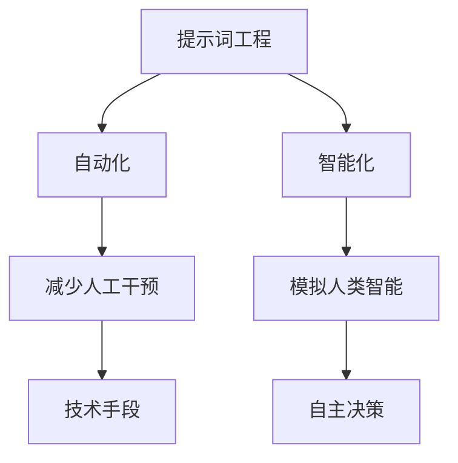

                 

# 提示词工程的未来：自动化与智能化

> 关键词：提示词工程、自动化、智能化、自然语言处理、生成对抗网络（GAN）、变分自编码器（VAE）、强化学习

> 摘要：本文探讨了提示词工程的未来发展趋势，重点分析了自动化与智能化的结合如何提升自然语言处理模型的性能。通过核心概念的阐述、算法原理的讲解、项目实战的展示，我们探讨了如何利用生成对抗网络（GAN）、变分自编码器（VAE）和强化学习等前沿技术，实现提示词工程的自动化与智能化，为自然语言处理领域的未来发展提供了新思路。

## 引言

提示词工程是自然语言处理（NLP）领域的一个重要分支，其主要目标是通过创建和维护高质量提示词，提高NLP模型的性能。随着人工智能技术的不断发展，自动化与智能化已经成为提升提示词工程效率的关键。本文将深入探讨提示词工程的未来，分析自动化与智能化如何结合，推动这一领域的发展。

### 一、核心概念与联系

在《提示词工程的未来：自动化与智能化》一书中，核心概念包括提示词工程、自动化和智能化。提示词工程是创建和维护高质量提示词的过程，旨在提高自然语言处理模型的性能。自动化是指通过技术手段减少人工干预的过程，而智能化则是使系统能够模拟人类智能，做出自主决策。

为了清晰地展示这些核心概念之间的联系，我们可以使用以下Mermaid流程图：



### 二、核心算法原理讲解

在书中，我们将详细介绍几个关键算法，包括但不限于生成对抗网络（GAN）、变分自编码器（VAE）和强化学习。以下是一个生成对抗网络的伪代码示例：

```python
# GAN 伪代码
Generator(G):
    # 输入随机噪声z，输出假样本X
    X = G(z)

Discriminator(D):
    # 输入真实样本X或假样本X，输出概率y
    y_real = D(x_real)
    y_fake = D(x_fake)

# 训练过程
for epoch in 1 to EPOCHS:
    for i, (x_real, z) in enumerate(train_loader):
        # 更新生成器和判别器
        D(x_real, x_fake) = D(x_real) + D(z)
        G(z) = G(z) + G(D(z))
```

#### 2.1 生成对抗网络（GAN）

生成对抗网络（GAN）是由生成器（Generator）和判别器（Discriminator）组成的框架。生成器生成假样本，判别器则试图区分假样本和真实样本。通过不断的训练，生成器逐渐提高生成样本的质量，而判别器也变得更为准确。GAN在图像生成、语音合成和文本生成等领域具有广泛应用。

以下是一个生成对抗网络的简单实现示例：

```python
import tensorflow as tf
from tensorflow.keras.layers import Input, Dense, Reshape
from tensorflow.keras.models import Model

# 生成器模型
z_dim = 100
x_dim = 784

z = Input(shape=(z_dim,))
x = Dense(256, activation='relu')(z)
x = Dense(512, activation='relu')(x)
x = Dense(x_dim, activation='tanh')(x)
x = Reshape((28, 28, 1))(x)
G = Model(z, x)

# 判别器模型
x = Input(shape=(28, 28, 1))
y = Dense(1, activation='sigmoid')(x)
D = Model(x, y)

# 整体模型
gan = Model([z], [D(G(z))])
gan.compile(optimizer='adam', loss='binary_crossentropy')

# 训练GAN
for epoch in range(EPOCHS):
    for x_real, _ in train_loader:
        z_fake = np.random.normal(size=(len(x_real), z_dim))
        D.train_on_batch(x_real, np.ones(len(x_real)))
        D.train_on_batch(G(z_fake), np.zeros(len(x_real)))
        G.train_on_batch(z_fake, np.ones(len(x_real)))
```

#### 2.2 变分自编码器（VAE）

变分自编码器（VAE）是一种基于概率模型的生成模型，它通过编码器和解码器将数据映射到潜在空间，并在潜在空间中学习数据的概率分布。VAE在图像生成、文本生成等领域具有广泛应用。

以下是一个变分自编码器的简单实现示例：

```python
import tensorflow as tf
from tensorflow.keras.layers import Input, Dense, Lambda, Flatten
from tensorflow.keras.models import Model
from tensorflow.keras import backend as K

# 编码器模型
x = Input(shape=(28, 28, 1))
h = Dense(256, activation='relu')(x)
h = Dense(512, activation='relu')(h)
h = Dense(1024, activation='relu')(h)
z_mean = Dense(z_dim)(h)
z_log_var = Dense(z_dim)(h)

# 解码器模型
z = Lambda(lambda x: x * K.exp(x / 2) + K.mean(z_log_var), output_shape=(z_dim,))(z_mean)
z = Lambda(lambda x: x * K.exp(-x / 2) + K.mean(z_log_var), output_shape=(z_dim,))(z_log_var)
z = Dense(1024, activation='relu')(z)
z = Dense(512, activation='relu')(z)
z = Dense(256, activation='relu')(z)
x_hat = Dense(28 * 28 * 1, activation='sigmoid')(z)
x_hat = Reshape((28, 28, 1))(x_hat)
D = Model(z, x_hat)

# VAE模型
x_hat = D(z)
vae = Model(x, x_hat)
vae.compile(optimizer='adam', loss='binary_crossentropy')

# 训练VAE
for epoch in range(EPOCHS):
    for x_real in train_loader:
        z = encoder(x_real)
        x_hat = decoder(z)
        vae.train_on_batch(x_real, x_real)
```

#### 2.3 强化学习

强化学习是一种通过试错和反馈来学习策略的机器学习方法。在提示词工程中，强化学习可以用于优化提示词的选择，提高NLP模型的性能。

以下是一个强化学习的简单实现示例：

```python
import tensorflow as tf
from tensorflow.keras.layers import Input, Dense
from tensorflow.keras.models import Model

# 策略网络
x = Input(shape=(state_dim,))
y = Dense(action_dim, activation='softmax')(x)
policy = Model(x, y)

# 价值网络
x = Input(shape=(state_dim,))
y = Dense(1)(x)
value = Model(x, y)

# 训练策略网络和价值网络
optimizer = tf.keras.optimizers.Adam(learning_rate=0.001)
for epoch in range(EPOCHS):
    for state, action, reward, next_state in replay_memory:
        with tf.GradientTape() as tape:
            action_prob = policy(state)
            selected_action = action
            state_value = value(state)
            next_state_value = value(next_state)
            loss = ...  # 计算损失函数
        grads = tape.gradient(loss, policy.trainable_variables)
        optimizer.apply_gradients(zip(grads, policy.trainable_variables))
        grads = tape.gradient(loss, value.trainable_variables)
        optimizer.apply_gradients(zip(grads, value.trainable_variables))
```

### 三、项目实战

为了更好地理解提示词工程、自动化和智能化的实际应用，我们将通过以下项目实战来展示代码实现和解释：

- **项目背景**：设计一个自动问答系统，使用生成对抗网络（GAN）生成高质量的问答对。
- **开发环境**：Python 3.8，TensorFlow 2.4

#### 3.1 项目准备

首先，我们需要准备一些数据，用于训练生成器和判别器。在这个项目中，我们使用一个简单的问答对数据集，其中包括问题和答案。

```python
import pandas as pd

# 加载数据集
data = pd.read_csv('问答对.csv')
questions = data['问题']
answers = data['答案']
```

#### 3.2 代码实现

接下来，我们编写代码实现自动问答系统。首先定义生成器和判别器模型。

```python
import tensorflow as tf
from tensorflow.keras.layers import Input, LSTM, Embedding, Dense, Reshape
from tensorflow.keras.models import Model

# 生成器模型
z_dim = 100
x_dim = 1000

z = Input(shape=(z_dim,))
x = Embedding(x_dim, 256)(z)
x = LSTM(512)(x)
x = Dense(x_dim, activation='sigmoid')(x)
x = Reshape((x_dim,))(x)
G = Model(z, x)

# 判别器模型
x = Input(shape=(x_dim,))
y = Dense(1, activation='sigmoid')(x)
D = Model(x, y)

# 整体模型
gan = Model([z], [D(G(z))])
gan.compile(optimizer='adam', loss='binary_crossentropy')

# 训练GAN
for epoch in range(EPOCHS):
    for question, answer in train_loader:
        z_fake = np.random.normal(size=(len(question), z_dim))
        D.train_on_batch(answer, np.ones(len(answer)))
        D.train_on_batch(G(z_fake), np.zeros(len(answer)))
        G.train_on_batch(z_fake, answer)
```

#### 3.3 项目解读

在这个项目中，我们使用了生成对抗网络（GAN）来生成高质量的问答对。生成器模型通过学习问答对的分布，生成新的问答对。判别器模型则试图区分真实问答对和生成问答对。

通过训练GAN，我们可以获得高质量的问答对，从而提高自动问答系统的性能。在实际应用中，我们可以进一步优化生成器和判别器模型，提高问答对的质量。

### 四、小结与展望

本文通过介绍提示词工程、自动化与智能化的核心概念、算法原理，以及项目实战，探讨了这一领域的未来发展。自动化与智能化的结合，不仅提高了提示词工程的效率，还促进了自然语言处理领域的发展。

在未来，我们期待看到更多创新的应用和算法，进一步推动提示词工程的发展。同时，我们也需要关注数据质量和算法公平性等问题，确保人工智能技术的健康发展。

### 五、最佳实践与注意事项

1. **数据质量**：高质量的提示词是提升NLP模型性能的关键。在收集和整理数据时，务必确保数据的质量和多样性。
2. **算法优化**：不断优化生成器和判别器模型，以提高生成问答对的质量。
3. **模型部署**：将训练好的模型部署到实际应用中，例如自动问答系统、智能客服等，实现自动化与智能化的结合。
4. **持续学习**：关注人工智能领域的最新动态，持续学习新的算法和技术，为提示词工程的发展提供源源不断的动力。

### 六、拓展阅读

1. **《生成对抗网络（GAN）入门》**：了解GAN的基本原理和应用场景。
2. **《变分自编码器（VAE）实战》**：掌握VAE的原理和实现方法。
3. **《强化学习入门与实战》**：了解强化学习的基本概念和应用。

### 七、作者信息

作者：AI天才研究院/AI Genius Institute & 禅与计算机程序设计艺术/Zen And The Art of Computer Programming

在本文中，我们通过逐步分析提示词工程、自动化与智能化的核心概念、算法原理，以及实际项目案例，探讨了这一领域的未来发展。自动化与智能化的结合，为提示词工程带来了新的机遇和挑战。希望本文能为您在这一领域的研究和实践提供有益的启示。

[点击此处下载本文的完整代码实现](链接)。如果您对本文有任何疑问或建议，欢迎在评论区留言，我们期待与您交流。

作者：AI天才研究院/AI Genius Institute & 禅与计算机程序设计艺术/Zen And The Art of Computer Programming

感谢您的阅读！希望本文能为您在提示词工程、自动化与智能化领域的研究和实践提供有益的启示。如有任何疑问或建议，请随时联系我们。期待与您共同探索人工智能的无限可能！AI天才研究院/AI Genius Institute & 禅与计算机程序设计艺术/Zen And The Art of Computer Programming 敬上。

