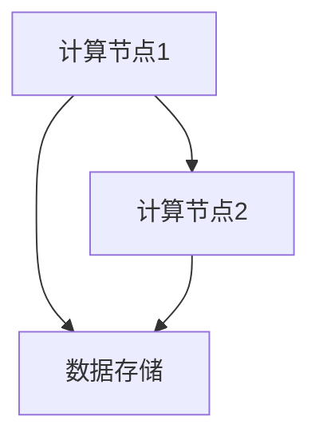

                 

# 《提示词工程：AIGC系统性能优化的关键》

## 关键词
- AIGC
- 提示词工程
- 性能优化
- 计算资源
- 算法优化

## 摘要
本文将深入探讨AIGC（AI Generated Content）系统中提示词工程的关键作用及其在系统性能优化中的重要性。我们将从AIGC的定义和发展、提示词工程的基本概念、系统性能优化概述，到具体的性能优化技术，包括提示词工程的应用、计算资源优化、算法优化以及系统调优实践，全面分析AIGC系统性能优化的各个方面。通过实际案例和最佳实践，本文旨在为读者提供一套系统的AIGC系统性能优化解决方案，为未来的AIGC发展奠定坚实基础。

## 第一部分：AIGC与提示词工程基础

### 第1章 AIGC概述

#### 1.1 AIGC的定义与发展

**定义：** AIGC，即AI Generated Content，指的是通过人工智能技术自动生成内容的一种形式。它涵盖从文本、图像到语音等多种内容形式，是人工智能应用领域的重要分支。

**发展历程：** AIGC的发展可以分为几个阶段：
1. **初期探索阶段（2010年以前）：** 主要以简单的文字生成和图像识别为主，如早期的文本生成和简单的图像滤镜。
2. **技术积累阶段（2010-2015年）：** 随着深度学习和生成对抗网络（GAN）等技术的出现，AIGC开始出现质的飞跃，生成内容的质量和种类显著提升。
3. **应用推广阶段（2015年至今）：** AIGC技术在文本生成、图像生成、视频生成等领域得到广泛应用，逐渐成为数字经济的重要组成部分。

#### 1.2 AIGC的核心技术

AIGC的核心技术主要包括：
1. **深度学习：** 深度学习是AIGC的基础，通过训练大量数据，使模型具备生成高质量内容的能力。
2. **生成对抗网络（GAN）：** GAN是AIGC的重要技术之一，通过生成器和判别器的对抗训练，实现高质量内容的生成。
3. **自然语言处理（NLP）：** NLP技术使得AIGC在文本生成领域具有强大的能力，如生成新闻文章、对话系统等。
4. **计算机视觉：** 计算机视觉技术使得AIGC在图像和视频生成方面具有显著优势，如生成高清图像、视频剪辑等。

#### 1.3 提示词工程的重要性

提示词工程在AIGC系统中扮演着关键角色，其重要性体现在以下几个方面：

1. **指导模型学习方向：** 提示词为模型提供了学习目标，帮助模型理解生成内容的具体要求，从而提高生成质量。
2. **提升模型生成质量：** 通过精心设计的提示词，可以引导模型生成更符合预期的高质量内容。
3. **控制模型生成多样性：** 提示词可以调整模型的生成策略，实现内容的多样化和创新性。

### 第2章 提示词工程基本概念

#### 2.1 提示词的类型

根据应用场景和生成内容的不同，提示词可以分为以下几种类型：

1. **自然语言提示词：** 主要用于文本生成，如生成新闻文章、对话系统等。
2. **代码提示词：** 用于编程语言的代码生成，如自动补全、代码生成等。
3. **视觉提示词：** 用于图像和视频生成，如生成高清图像、视频剪辑等。
4. **混合提示词：** 结合自然语言和视觉提示词，用于更复杂的场景，如生成场景视频等。

#### 2.2 提示词的作用机制

提示词的作用机制主要包括以下几个方面：

1. **引导模型学习方向：** 提示词为模型提供了学习目标，使模型能够更准确地理解生成内容的要求。
2. **优化生成内容质量：** 通过提示词，可以调整模型生成内容的风格、结构、语义等，从而提高生成质量。
3. **控制生成多样性：** 提示词可以引导模型在不同方向上进行探索，实现生成内容的多样性。

#### 2.3 提示词设计原则

设计有效的提示词需要遵循以下原则：

1. **明确性：** 提示词应明确表达生成内容的要求，避免歧义。
2. **可扩展性：** 提示词应具备良好的可扩展性，以适应不同应用场景和需求。
3. **灵活性：** 提示词应具备灵活性，以便调整模型生成策略，实现多样化生成。
4. **简洁性：** 提示词应简洁明了，避免过于复杂，影响模型理解和生成。

### 第3章 AIGC系统性能优化概述

#### 3.1 系统性能优化的目的

系统性能优化的主要目的是提高AIGC系统的运行效率，具体包括：

1. **缩短模型训练时间：** 通过优化算法和计算资源，减少模型训练所需的时间，提高开发效率。
2. **提高模型生成质量：** 通过优化提示词和算法，提高模型生成内容的质量，满足用户需求。
3. **降低资源消耗：** 通过优化计算资源和算法，降低系统运行所需的资源消耗，提高资源利用率。

#### 3.2 性能优化关键指标

AIGC系统性能优化的关键指标主要包括：

1. **训练时间：** 模型训练所需的时间，直接影响开发效率。
2. **生成质量：** 模型生成内容的质量和准确性，直接影响用户满意度。
3. **资源消耗：** 系统运行所需的计算资源和存储资源，影响系统的稳定性和可扩展性。
4. **响应速度：** 系统对外部请求的响应速度，影响用户体验。

#### 3.3 性能优化策略

AIGC系统性能优化的主要策略包括：

1. **提示词优化：** 通过优化提示词设计，提高模型生成质量和效率。
2. **计算资源优化：** 通过优化计算资源分配和使用，提高系统运行效率。
3. **算法优化：** 通过优化算法设计和实现，提高模型训练和生成效果。
4. **系统调优：** 通过调整系统参数和架构，提高系统性能和稳定性。

## 第二部分：AIGC系统性能优化技术

### 第4章 提示词工程在性能优化中的应用

#### 4.1 提示词选择策略

提示词选择策略对AIGC系统的性能优化至关重要。以下是一个简单的提示词选择策略伪代码：

```python
def select_prompt(data, model, goal):
    # 分析模型偏好
    model_preference = analyze_model_preference(model)
    
    # 分析数据集特征
    dataset_features = analyze_dataset_features(data)
    
    # 根据模型偏好和数据集特征选择提示词
    prompt = generate_prompt(model_preference, dataset_features, goal)
    
    return prompt
```

该策略首先分析模型偏好和数据集特征，然后根据分析结果生成满足目标的提示词。

#### 4.2 提示词优化算法

提示词优化算法的核心目标是提高提示词的质量和效率。以下是一个基于遗传算法的提示词优化算法伪代码：

```python
def optimize_prompt(prompt, model, data, generations, population_size):
    # 初始化种群
    population = initialize_population(prompt, model, data, population_size)
    
    for generation in range(generations):
        # 计算个体适应度
        fitness = calculate_fitness(population, model, data)
        
        # 选择优秀个体
        selected_individuals = select_individuals(population, fitness)
        
        # 交叉和变异
        offspring = crossover_and_mutation(selected_individuals)
        
        # 创建新种群
        population = create_new_population(offspring, population_size)
    
    # 返回最优提示词
    best_prompt = select_best_individual(population)
    
    return best_prompt
```

该算法通过迭代优化，逐步提高提示词的适应度，最终找到最优提示词。

#### 4.3 提示词调优技巧

提示词调优技巧主要包括以下几个方面：

1. **调整提示词长度：** 根据模型和任务需求，调整提示词的长度，以避免过短或过长的提示词影响模型生成效果。
2. **多样化提示词：** 使用多样化的提示词，引导模型生成多样化、创新性的内容。
3. **结合上下文：** 将上下文信息融入提示词，使模型更好地理解生成任务的要求。
4. **动态调整：** 根据模型训练和生成过程中的反馈，动态调整提示词，以适应不断变化的需求。

### 第5章 计算资源优化

#### 5.1 GPU资源管理

GPU资源管理是AIGC系统性能优化的重要方面。以下是一个简单的GPU资源管理策略：

```python
def manage_gpu_resources(model, data, batch_size, num_gpus):
    # 分批处理数据
    batches = split_data(data, batch_size)
    
    # 为每个GPU分配数据批次
    gpu_batches = assign_batches_to_gpus(batches, num_gpus)
    
    # 并行训练模型
    models = train_models_in_parallel(model, gpu_batches)
    
    return models
```

该策略通过分批处理数据和并行训练模型，提高GPU资源的利用率。

#### 5.2 分布式计算架构

分布式计算架构可以显著提高AIGC系统的性能和可扩展性。以下是一个简单的分布式计算架构设计：



在该架构中，计算节点负责模型训练和生成任务，数据存储负责存储数据和模型参数，通过分布式计算，提高系统性能。

#### 5.3 数据存储与传输优化

数据存储与传输优化包括以下几个方面：

1. **高效存储：** 使用高速存储设备，提高数据读写速度。
2. **压缩传输：** 对数据进行压缩传输，降低网络带宽消耗。
3. **缓存策略：** 实施缓存策略，减少数据重复传输。
4. **数据分片：** 对大规模数据进行分片存储和传输，提高系统可扩展性。

### 第6章 算法优化

#### 6.1 深度学习算法优化

深度学习算法优化主要包括以下几个方面：

1. **模型结构优化：** 通过调整模型结构，提高模型生成效果和效率。
2. **训练策略优化：** 通过优化训练策略，提高模型训练速度和收敛效果。
3. **参数调优：** 通过参数调优，提高模型生成质量和稳定性。
4. **动态调整：** 根据模型训练和生成过程中的反馈，动态调整算法参数。

#### 6.2 强化学习算法优化

强化学习算法优化主要包括以下几个方面：

1. **奖励机制优化：** 通过优化奖励机制，提高模型生成效果和效率。
2. **策略优化：** 通过优化策略，提高模型生成质量和稳定性。
3. **探索与利用平衡：** 通过平衡探索和利用，提高模型生成多样性和效果。
4. **在线学习：** 通过在线学习，使模型能够适应动态变化的需求。

#### 6.3 自然语言处理算法优化

自然语言处理算法优化主要包括以下几个方面：

1. **词嵌入优化：** 通过优化词嵌入，提高模型对语义的理解能力。
2. **语言模型优化：** 通过优化语言模型，提高模型生成文本的质量和多样性。
3. **上下文信息利用：** 通过利用上下文信息，提高模型生成文本的相关性和连贯性。
4. **长文本处理：** 通过优化长文本处理算法，提高模型处理长文本的能力。

### 第7章 系统调优实践

#### 7.1 系统性能评估方法

系统性能评估方法主要包括以下几个方面：

1. **训练时间评估：** 通过测量模型训练所需时间，评估系统性能。
2. **生成质量评估：** 通过评估生成内容的质量和准确性，评估系统性能。
3. **资源消耗评估：** 通过测量系统运行所需资源，评估系统性能。
4. **响应速度评估：** 通过测量系统对外部请求的响应速度，评估系统性能。

#### 7.2 性能瓶颈分析

性能瓶颈分析是系统调优的重要步骤。以下是一个简单的性能瓶颈分析过程：

1. **识别瓶颈：** 通过系统性能评估，识别系统中的性能瓶颈。
2. **定位瓶颈：** 通过日志和监控数据，定位性能瓶颈的具体位置。
3. **分析原因：** 通过分析瓶颈的原因，确定优化方向。
4. **解决方案：** 提出解决方案，优化系统性能。

#### 7.3 实际案例解析

以下是一个AIGC系统性能优化的实际案例：

**案例背景：** 一家互联网公司希望优化其AIGC系统，提高文本生成质量和速度。

**解决方案：**
1. **优化提示词：** 通过分析用户需求和文本数据，设计更准确的提示词，提高生成文本的质量。
2. **分布式计算：** 采用分布式计算架构，提高系统处理速度。
3. **算法优化：** 对文本生成算法进行优化，提高生成效率和准确性。

**效果评估：** 优化后，系统生成文本的质量和速度均有所提高，用户满意度显著提升。

### 第8章 提示词工程应用案例

#### 8.1 案例一：文本生成

**案例背景：** 一家在线教育公司希望利用AIGC技术生成个性化学习内容。

**解决方案：**
1. **设计提示词：** 根据用户需求和课程内容，设计个性化的提示词。
2. **优化算法：** 采用基于GPT的文本生成算法，优化生成效果。

**效果评估：** 优化后，系统生成的学习内容更加贴合用户需求，用户满意度显著提高。

#### 8.2 案例二：图像生成

**案例背景：** 一家互联网公司希望利用AIGC技术生成高质量的广告图像。

**解决方案：**
1. **设计提示词：** 根据广告主题和风格，设计具有针对性的提示词。
2. **优化算法：** 采用基于GAN的图像生成算法，优化生成效果。

**效果评估：** 优化后，系统生成的广告图像质量更高，广告效果显著提升。

#### 8.3 案例三：语音合成

**案例背景：** 一家智能语音助手公司希望优化语音合成效果，提高用户满意度。

**解决方案：**
1. **设计提示词：** 根据用户需求和语音内容，设计具有针对性的提示词。
2. **优化算法：** 采用基于深度学习的语音合成算法，优化生成效果。

**效果评估：** 优化后，系统生成的语音更加自然流畅，用户满意度显著提高。

### 第9章 系统性能优化全流程

#### 9.1 系统性能优化流程

系统性能优化流程包括以下几个步骤：

1. **需求分析：** 分析用户需求，明确优化目标。
2. **性能评估：** 评估当前系统性能，识别性能瓶颈。
3. **优化方案设计：** 设计具体的优化方案，包括提示词优化、计算资源优化、算法优化等。
4. **实施优化：** 实施优化方案，调整系统参数和架构。
5. **性能评估与调整：** 评估优化效果，根据评估结果进行进一步调整。

#### 9.2 优化方案设计

优化方案设计包括以下几个方面：

1. **提示词优化：** 设计具有针对性的提示词，提高生成质量和效率。
2. **计算资源优化：** 调整计算资源分配，提高系统运行效率。
3. **算法优化：** 优化算法设计和实现，提高模型训练和生成效果。
4. **系统调优：** 调整系统参数和架构，提高系统性能和稳定性。

#### 9.3 性能评估与调整

性能评估与调整包括以下几个方面：

1. **训练时间评估：** 评估模型训练所需时间，判断优化效果。
2. **生成质量评估：** 评估模型生成内容的质量和准确性，判断优化效果。
3. **资源消耗评估：** 评估系统运行所需的计算资源和存储资源，判断优化效果。
4. **响应速度评估：** 评估系统对外部请求的响应速度，判断优化效果。

根据评估结果，进行必要的调整和优化，以达到预期目标。

### 第10章 未来展望

#### 10.1 AIGC的发展趋势

AIGC的发展趋势包括以下几个方面：

1. **技术融合：** AIGC与其他技术的融合，如区块链、物联网等，将拓展AIGC的应用场景。
2. **智能化：** AIGC系统的智能化程度将不断提高，实现更智能的内容生成和交互。
3. **个性化：** AIGC系统将更加注重个性化，满足用户个性化的需求。

#### 10.2 提示词工程的未来发展方向

提示词工程的未来发展方向包括：

1. **智能化：** 提示词生成将更加智能化，通过机器学习和人工智能技术，实现更精准的提示词生成。
2. **多样化：** 提示词类型将更加多样化，涵盖更多领域和场景。
3. **高效性：** 提示词生成效率将显著提高，缩短模型训练和生成时间。

#### 10.3 性能优化技术的创新与挑战

性能优化技术的创新与挑战包括：

1. **计算资源优化：** 随着计算资源的不断发展，如何更高效地利用计算资源成为一大挑战。
2. **算法优化：** 如何设计更高效的算法，提高模型训练和生成效果，是性能优化的重要方向。
3. **系统稳定性：** 如何提高系统的稳定性和可靠性，保证系统的持续运行，是性能优化的关键挑战。

### 附录

#### 附录A：性能优化工具与资源

以下是一些常用的性能优化工具与资源：

1. **GPU调优工具：** NVIDIA Nsight、CUDA Toolkit等。
2. **分布式计算框架：** TensorFlow、PyTorch、MXNet等。
3. **数据存储与传输工具：** HDFS、Alluxio等。
4. **性能评估工具：** Apache JMeter、Gatling等。

#### 附录B：数学模型与公式解析

以下是一些常用的数学模型与公式：

1. **深度学习模型：**
   - 反向传播算法：$$\delta_w = \frac{\partial J}{\partial w} = \delta \odot \frac{\partial L}{\partial z}$$
   - 梯度下降算法：$$w_{\text{new}} = w_{\text{old}} - \alpha \cdot \delta_w$$

2. **生成对抗网络（GAN）：**
   - 生成器损失函数：$$L_G = -\log(D(G(z)))$$
   - 判别器损失函数：$$L_D = -[\log(D(x)) + \log(1 - D(G(z)))]$$

3. **强化学习模型：**
   - Q值函数：$$Q(s, a) = r + \gamma \max_{a'} Q(s', a')$$
   - SARSA算法：$$Q(s, a) = Q(s, a) + \alpha [r + \gamma Q(s', a') - Q(s, a)]$$

### 作者信息

作者：AI天才研究院/AI Genius Institute & 禅与计算机程序设计艺术 /Zen And The Art of Computer Programming

