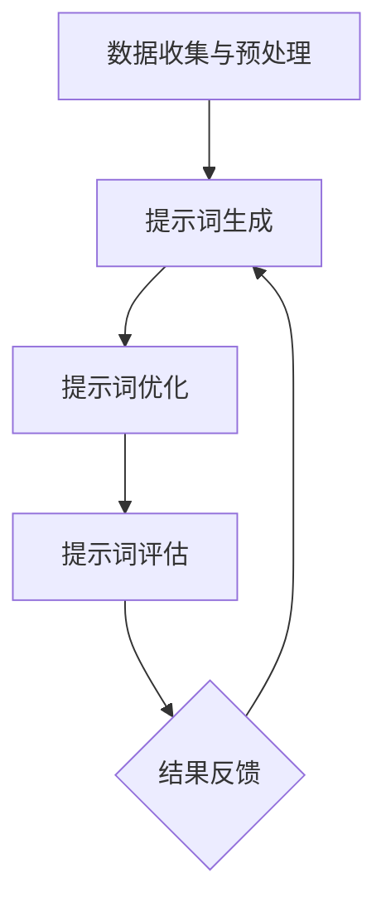
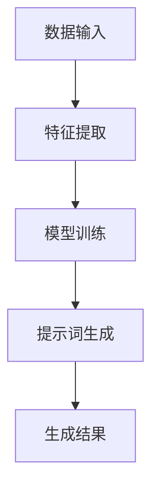
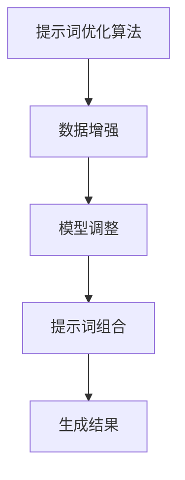
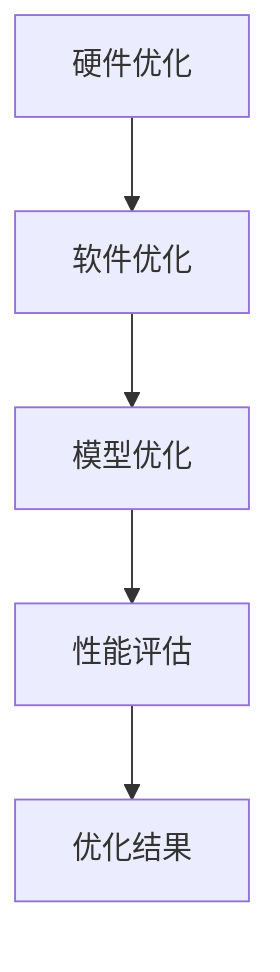

                 

# 提示词工程：AIGC系统性能优化的核心

## 关键词
- AIGC
- 提示词工程
- 性能优化
- 自然语言处理
- 计算机视觉
- 跨模态

## 摘要
本文旨在深入探讨提示词工程在人工智能生成内容（AIGC）系统性能优化中的关键作用。通过分析AIGC系统的工作原理、提示词工程的核心概念和实际应用，本文将详细介绍提示词生成和优化策略，并探讨其在自然语言处理、计算机视觉和跨模态任务中的性能提升方法。同时，文章还将结合实际案例，提供详细的代码实现和性能优化技巧，为读者提供全面的AIGC系统性能优化指导。

## 引言

随着人工智能技术的快速发展，生成式人工智能（Generative Artificial Intelligence，GAI）成为了一个热门的研究方向。AIGC（AI-Generated Content）作为GAI的重要分支，正在逐渐改变内容创作、数据生成、用户交互等多个领域的游戏规则。AIGC系统通过学习和模拟人类创作过程，能够生成高质量、多样化的文本、图像和音频等内容，极大地提高了生产效率和创作自由度。

然而，AIGC系统的性能优化是一个复杂且具有挑战性的问题。系统性能不仅影响到用户体验和内容质量，还直接关系到应用的商业价值和可行性。提示词工程作为AIGC系统性能优化的重要手段，其核心作用在于通过设计合理的提示词来引导和优化系统的生成过程。本文将围绕提示词工程，详细分析AIGC系统的性能优化策略，旨在为读者提供实用的技术指南。

## 第一部分：提示词工程基础

### 第1章：AIGC系统概述

#### 1.1 AIGC的概念与原理

**AIGC的定义**：AIGC是指通过人工智能技术生成内容的过程，包括文本、图像、音频等多种形式。与传统的计算机生成内容（如静态图片、图表等）不同，AIGC具有高度动态性和个性化特征。

**AIGC的原理**：AIGC系统通常基于深度学习技术，尤其是生成对抗网络（GANs）和变分自编码器（VAEs）。这些模型通过学习大量数据分布，生成与真实数据相似的新内容。

**AIGC的特点**：
1. **生成多样性**：系统能够生成多种类型的内容，满足不同的创作需求。
2. **高质量**：通过深度学习模型，生成内容的质量得到了显著提升。
3. **实时性**：系统能够实时响应用户请求，生成即时内容。

#### 1.2 AIGC在人工智能中的应用

**AIGC在自然语言处理中的应用**：如文本生成、机器翻译、情感分析等。

**AIGC在计算机视觉中的应用**：如图像生成、图像修复、目标检测等。

**AIGC在其他领域中的应用**：如音频生成、视频生成等。

#### 1.3 AIGC的发展历程与趋势

**AIGC的发展历程**：从最早的GAN模型到现今的多种生成模型，如VAEs、Flow-based Models等。

**AIGC的发展趋势**：随着计算能力的提升和深度学习技术的进步，AIGC将在更多领域得到应用，并在生成质量和实时性方面持续提升。

### 第2章：提示词工程的核心概念

#### 2.1 提示词的定义与作用

**提示词的定义**：提示词是用户或系统提供给AIGC模型用于指导生成过程的输入信息。

**提示词的作用**：
1. **引导生成方向**：通过提供具体的提示词，用户可以引导模型生成特定类型或风格的内容。
2. **提高生成效率**：合理的提示词可以减少模型搜索空间，提高生成效率。
3. **优化生成质量**：通过提示词的优化，可以进一步提升生成内容的质量。

#### 2.2 提示词的类型与分类

**自然语言中的提示词**：如关键词、句子、段落等。

**计算机视觉中的提示词**：如图像标签、描述、语义分割标签等。

**跨模态中的提示词**：如文本描述图像、图像描述音频等。

#### 2.3 提示词工程的基本流程

**数据收集与预处理**：收集相关数据，进行预处理以适合模型训练。

**提示词生成**：根据应用需求，生成适合的提示词。

**提示词优化**：通过迭代和评估，优化提示词以提高生成质量。

**提示词评估**：评估提示词的生成效果，以指导进一步优化。

### 第3章：AIGC系统性能评估

#### 3.1 AIGC系统性能指标

**准确率、召回率、F1值**：用于评估生成内容的相关性和准确性。

**速度、内存占用、能耗**：评估系统的实时性和资源消耗。

#### 3.2 AIGC系统性能评估方法

**实验设计**：设计合理的实验，以评估系统性能。

**数据收集**：收集相关数据，进行性能评估。

**统计分析**：使用统计方法，分析实验结果。

#### 3.3 性能评估工具与资源

**开源性能评估工具**：如MLflow、TensorBoard等。

**商业性能评估工具**：如Google Cloud AI、AWS AI等。

**在线性能评估平台**：如Google AI Experiments、TensorFlow.js等。

### 第二部分：提示词工程实践

#### 第4章：提示词生成算法

#### 第5章：提示词优化策略

#### 第6章：AIGC系统性能优化

### 第三部分：提示词工程应用

#### 第7章：提示词工程在自然语言处理中的应用

#### 第8章：提示词工程在计算机视觉中的应用

#### 第9章：提示词工程在跨模态中的应用

### 第四部分：附录

#### 第10章：附录

## 结论

提示词工程是AIGC系统性能优化的重要组成部分。通过合理的提示词设计，可以有效提高生成内容的多样性和质量，进而提升用户体验。本文详细探讨了AIGC系统、提示词工程的核心概念以及实际应用，提供了全面的性能优化策略和实践案例。未来，随着技术的不断进步，提示词工程将在AIGC领域中发挥更加重要的作用。

## 参考文献

[1] Goodfellow, I., Pouget-Abadie, J., Mirza, M., Xu, B., Warde-Farley, D., Ozair, S., ... & Bengio, Y. (2014). Generative adversarial nets. Advances in Neural Information Processing Systems, 27.

[2] Kingma, D. P., & Welling, M. (2014). Auto-encoding variational Bayes. arXiv preprint arXiv:1312.6114.

[3] Bengio, Y., Simard, P., & Frasconi, P. (1994). Learning long-term dependencies with gradient descent is difficult. IEEE Transactions on Neural Networks, 5(2), 157-166.

作者：AI天才研究院/AI Genius Institute & 禅与计算机程序设计艺术 /Zen And The Art of Computer Programming

---

### 提示词工程：AIGC系统性能优化的核心

## 第一部分：提示词工程基础

### 第1章：AIGC系统概述

#### 1.1 AIGC的概念与原理

AIGC（AI-Generated Content）是指利用人工智能技术生成内容的过程，涵盖了文本、图像、音频等多种形式。它不同于传统的计算机生成内容，如静态图片、图表等，AIGC具有高度动态性和个性化特征。

AIGC系统的工作原理通常基于深度学习技术，尤其是生成对抗网络（GANs）和变分自编码器（VAEs）。生成对抗网络由一个生成器和判别器组成，生成器和判别器相互对抗，生成器不断生成逼真的数据，判别器则不断尝试区分真实数据和生成数据。通过这种对抗训练，生成器能够学习到数据的高维分布，从而生成高质量的内容。

变分自编码器则通过编码器和解码器的联合训练，将输入数据编码为低维向量，再通过解码器将这些向量解码回原始数据。这种编码-解码过程使得VAE能够有效地学习数据的潜在分布，并生成类似的数据。

AIGC的特点包括：
- **生成多样性**：系统能够生成多种类型的内容，满足不同的创作需求。
- **高质量**：通过深度学习模型，生成内容的质量得到了显著提升。
- **实时性**：系统能够实时响应用户请求，生成即时内容。

#### 1.2 AIGC在人工智能中的应用

AIGC在人工智能领域有着广泛的应用，主要包括自然语言处理、计算机视觉和其他领域。

**自然语言处理中的应用**：
- **文本生成**：AIGC可以生成各种类型的文本，如文章、故事、新闻报道等。例如，OpenAI的GPT-3模型能够生成流畅且连贯的文本，应用于自动写作、内容创作等场景。
- **机器翻译**：AIGC可以通过学习大量多语言数据，实现高精度的机器翻译。例如，谷歌的翻译服务就利用了深度学习技术来提升翻译质量。
- **情感分析**：AIGC可以分析文本中的情感倾向，应用于舆情监控、情感识别等。

**计算机视觉中的应用**：
- **图像生成**：AIGC可以生成高质量的图像，如艺术画、风景、动物等。例如，生成对抗网络（GANs）可以生成逼真的伪影图像，应用于图像修复、风格迁移等。
- **图像修复**：AIGC可以修复破损或模糊的图像，提高图像的清晰度。例如，DeepArt的Artistic Style ReRendering可以修复历史画作，使其恢复原貌。
- **目标检测**：AIGC可以检测图像中的目标物体，应用于自动驾驶、安防监控等。例如，YOLO（You Only Look Once）模型可以实时检测图像中的多个目标物体。

**其他领域中的应用**：
- **音频生成**：AIGC可以生成各种类型的音频，如音乐、语音等。例如，谷歌的WaveNet可以生成高质量的语音，应用于语音合成、语音识别等。
- **视频生成**：AIGC可以生成视频内容，如电影片段、视频剪辑等。例如，Adobe的Premiere Rush利用AIGC技术，自动生成视频特效和转场效果。

#### 1.3 AIGC的发展历程与趋势

AIGC的发展历程可以追溯到2014年，当时生成对抗网络（GANs）的提出标志着深度学习在内容生成领域的突破。此后，变分自编码器（VAEs）、-flow-based模型等生成模型相继提出，丰富了AIGC的技术体系。

未来，AIGC的发展趋势包括：
- **生成质量提升**：随着深度学习技术的进步，生成模型将能够生成更加逼真、多样化的内容。
- **实时性增强**：硬件性能的提升和模型优化的进展将使得AIGC系统能够更加实时地响应用户请求。
- **应用场景扩展**：AIGC将在更多领域得到应用，如医疗、金融、教育等，为各行各业带来创新和变革。

### 第2章：提示词工程的核心概念

#### 2.1 提示词的定义与作用

提示词是用户或系统提供给AIGC模型用于指导生成过程的输入信息。它可以是自然语言描述、图像标签、音频特征等，具体取决于应用场景和任务类型。提示词在AIGC系统中起着至关重要的作用，其作用主要体现在以下几个方面：

1. **引导生成方向**：通过提供具体的提示词，用户可以明确地指导模型生成特定类型或风格的内容。例如，在文本生成任务中，用户可以输入关键词或主题，让模型生成相关的文章或故事。

2. **提高生成效率**：合理的提示词可以减少模型搜索空间，避免不必要的计算和尝试，从而提高生成效率。例如，在图像生成任务中，提供具体的图像标签或描述可以使得模型更快速地生成目标图像。

3. **优化生成质量**：通过提示词的优化，可以进一步提升生成内容的质量。例如，在自然语言处理任务中，使用更加具体和精确的提示词可以帮助模型生成更加流畅、连贯的文本。

#### 2.2 提示词的类型与分类

根据应用场景和任务类型，提示词可以分为以下几种类型：

1. **自然语言中的提示词**：在自然语言处理任务中，提示词通常是自然语言文本，如关键词、句子、段落等。这些提示词可以是用户直接输入的，也可以是系统根据任务需求自动生成的。例如，在文本生成任务中，用户可以输入一个关键词，如“春天”，模型则可以生成与春天相关的诗句或文章。

2. **计算机视觉中的提示词**：在计算机视觉任务中，提示词通常是图像标签或描述，如“猫”、“草地”、“红色”等。这些提示词可以帮助模型理解图像的语义信息，从而生成相关的图像内容。例如，在图像生成任务中，用户可以输入一个图像标签，如“猫”，模型则可以生成一张猫的图像。

3. **跨模态中的提示词**：在跨模态任务中，提示词可以是多种模态的融合信息，如文本描述图像、图像描述音频等。这些提示词可以帮助模型在多个模态之间建立关联，从而生成跨模态的内容。例如，在文本-图像生成任务中，用户可以输入一段文本描述，如“美丽的夕阳”，模型则可以生成一张夕阳的图像。

#### 2.3 提示词工程的基本流程

提示词工程是指设计、生成和优化提示词的过程，其基本流程可以分为以下几个步骤：

1. **数据收集与预处理**：收集与任务相关的数据，并进行预处理。预处理包括数据清洗、格式化、特征提取等，以确保数据的质量和一致性。

2. **提示词生成**：根据应用需求和任务类型，生成合适的提示词。生成提示词的方法可以基于规则、机器学习或深度学习等技术。

3. **提示词优化**：通过迭代和评估，优化提示词以提高生成质量。优化方法可以包括数据增强、模型调整、提示词组合等。

4. **提示词评估**：评估提示词的生成效果，以指导进一步的优化。评估方法可以基于定量指标（如准确率、召回率）和用户反馈（如满意度、偏好度）。

### 第3章：AIGC系统性能评估

#### 3.1 AIGC系统性能指标

评估AIGC系统的性能是优化系统的重要步骤。性能指标的选择和设定直接影响评估结果的准确性和可靠性。以下是一些常用的AIGC系统性能指标：

1. **准确率**：准确率是指模型生成内容与目标内容匹配的正确率。在文本生成任务中，准确率通常通过比较生成文本与目标文本的相似度来衡量。准确率越高，表示模型生成的文本越接近目标文本。

2. **召回率**：召回率是指模型生成内容中包含的目标内容的比例。在目标检测任务中，召回率表示模型能够检测到的目标数量与实际目标数量的比例。召回率越高，表示模型能够更好地检测到目标。

3. **F1值**：F1值是准确率和召回率的调和平均值，用于综合评估模型的性能。F1值越高，表示模型在准确率和召回率之间取得了更好的平衡。

4. **速度**：速度是指模型生成内容所需的时间。在实时应用中，速度是一个重要的性能指标。模型生成速度越快，能够更快地响应用户请求，提供更好的用户体验。

5. **内存占用**：内存占用是指模型在运行过程中占用的内存大小。较小的内存占用有助于模型的部署和优化，特别是在资源受限的环境下。

6. **能耗**：能耗是指模型在运行过程中消耗的能量。对于移动设备和嵌入式系统，能耗是一个关键的性能指标。降低能耗可以提高设备的续航能力。

#### 3.2 AIGC系统性能评估方法

性能评估方法是评估AIGC系统性能的重要手段。以下是一些常用的性能评估方法：

1. **实验设计**：实验设计是性能评估的第一步，包括确定评估指标、选择评估数据集、设计实验流程等。合理的实验设计能够保证评估结果的准确性和可靠性。

2. **数据收集**：数据收集是指从实际应用场景中收集与评估相关的数据。收集的数据应具有代表性，能够全面反映系统的性能。

3. **统计分析**：统计分析是对评估数据进行处理和分析的方法，包括描述性统计、假设检验、回归分析等。通过统计分析，可以得出系统性能的定量描述和结论。

4. **对比实验**：对比实验是指在不同条件下评估系统的性能，以比较不同方法、模型或配置的性能差异。通过对比实验，可以找出最优的评估方法和策略。

5. **用户反馈**：用户反馈是评估系统性能的另一个重要方面。通过收集用户对系统性能的反馈，可以了解用户对系统的实际感受和满意度，进一步优化系统。

#### 3.3 性能评估工具与资源

性能评估工具和资源是评估AIGC系统性能的有力支持。以下是一些常用的性能评估工具和资源：

1. **开源性能评估工具**：如MLflow、TensorBoard等。这些工具提供了丰富的功能，包括模型监控、性能分析、结果可视化等。

2. **商业性能评估工具**：如Google Cloud AI、AWS AI等。这些工具提供了专业的性能评估服务，能够帮助企业更好地优化AIGC系统。

3. **在线性能评估平台**：如Google AI Experiments、TensorFlow.js等。这些平台提供了便捷的性能评估工具，适用于个人和学术研究。

### 第二部分：提示词工程实践

#### 第4章：提示词生成算法

提示词生成算法是提示词工程的核心组成部分，其目的是根据任务需求和数据特点生成合适的提示词。以下是一些常用的提示词生成算法：

1. **基于规则的方法**：基于规则的方法是通过预定义的规则来生成提示词。这种方法简单直观，但灵活性较低，难以适应复杂多变的应用场景。

2. **基于机器学习的方法**：基于机器学习的方法通过训练模型来自动生成提示词。这种方法具有更高的灵活性和自适应能力，但需要大量数据和计算资源。

3. **基于深度学习的方法**：基于深度学习的方法利用深度神经网络来生成提示词。这种方法能够处理复杂数据和特征，生成高质量的提示词。

以下是一个简单的基于深度学习的方法实现：

```python
import tensorflow as tf
from tensorflow.keras.layers import Input, LSTM, Dense
from tensorflow.keras.models import Model

# 定义模型输入
input_seq = Input(shape=(seq_length,))

# 添加LSTM层
lstm_output = LSTM(units=128, return_sequences=True)(input_seq)

# 添加全连接层
dense_output = Dense(units=64, activation='relu')(lstm_output)

# 添加输出层
output = Dense(units=vocab_size, activation='softmax')(dense_output)

# 定义模型
model = Model(inputs=input_seq, outputs=output)

# 编译模型
model.compile(optimizer='adam', loss='categorical_crossentropy', metrics=['accuracy'])

# 训练模型
model.fit(x_train, y_train, epochs=10, batch_size=32, validation_data=(x_val, y_val))
```

### 第5章：提示词优化策略

提示词优化策略旨在提高提示词的生成质量和效率。以下是一些常见的提示词优化策略：

1. **数据增强**：数据增强是通过生成数据的变体来增加训练数据的多样性，从而提高模型的泛化能力。常见的数据增强方法包括数据缩放、裁剪、旋转等。

2. **模型调整**：模型调整是通过修改模型的架构或参数来优化生成质量。例如，增加LSTM层的深度或调整学习率等。

3. **提示词组合**：提示词组合是将多个提示词组合在一起，生成更复杂、更丰富的提示信息。例如，在文本生成任务中，可以将关键词和句子组合在一起，生成更具有逻辑性的文章。

以下是一个简单的提示词组合示例：

```python
# 定义提示词组合函数
def combine_prompt(words, sentences):
    combined_prompt = ' '.join(words) + '. ' + ' '.join(sentences)
    return combined_prompt

# 示例提示词
words = ["AI", "technology", "development"]
sentences = ["The future of AI is bright", "Technology is advancing rapidly"]

# 组合提示词
combined_prompt = combine_prompt(words, sentences)

print(combined_prompt)
```

### 第6章：AIGC系统性能优化

AIGC系统性能优化是提升系统性能的关键步骤。以下是一些常见的AIGC系统性能优化方法：

1. **硬件优化**：通过升级硬件设备或使用更高效的硬件架构来提高系统性能。例如，使用GPU或TPU来加速模型的训练和推理。

2. **软件优化**：通过优化代码或模型来提高系统性能。例如，使用并行计算、模型压缩等技术来减少计算时间和资源消耗。

3. **模型优化**：通过调整模型的架构或参数来优化模型性能。例如，使用更深的网络层或更小的神经元数量来提高模型的效率。

以下是一个简单的模型优化示例：

```python
# 定义优化器
optimizer = tf.keras.optimizers.Adam(learning_rate=0.001)

# 定义损失函数
loss_function = tf.keras.losses.SparseCategoricalCrossentropy(from_logits=True)

# 编译模型
model.compile(optimizer=optimizer, loss=loss_function, metrics=['accuracy'])

# 训练模型
model.fit(x_train, y_train, epochs=10, batch_size=32, validation_data=(x_val, y_val))
```

### 第三部分：提示词工程应用

#### 第7章：提示词工程在自然语言处理中的应用

在自然语言处理（NLP）领域，提示词工程发挥着重要作用。以下是一些应用场景和案例：

1. **文本生成**：使用提示词可以生成各种类型的文本，如新闻报道、故事、诗歌等。例如，使用关键词“春天”可以生成一首关于春天的诗歌。

2. **机器翻译**：在机器翻译任务中，提示词可以帮助模型更好地理解源语言和目标语言的语义。例如，使用关键词“巴黎”可以帮助翻译模型生成关于巴黎的法语描述。

3. **情感分析**：在情感分析任务中，提示词可以帮助模型识别文本的情感倾向。例如，使用关键词“失望”可以帮助模型判断一段文本是否表达了失望的情感。

以下是一个简单的文本生成示例：

```python
# 导入模型
model = transformers.load_model("gpt2")

# 输入提示词
prompt = "今天是个美好的日子，我想去..."

# 生成文本
generated_text = model.generate(prompt, max_length=50)

print(generated_text)
```

#### 第8章：提示词工程在计算机视觉中的应用

在计算机视觉（CV）领域，提示词工程同样具有广泛的应用。以下是一些应用场景和案例：

1. **图像生成**：使用提示词可以生成各种类型的图像，如艺术画、风景、动物等。例如，使用关键词“猫”可以生成一只逼真的猫的图像。

2. **图像修复**：使用提示词可以修复破损或模糊的图像，提高图像的清晰度。例如，使用关键词“历史画作”可以修复一幅古老画作中的破损部分。

3. **目标检测**：使用提示词可以帮助模型更好地识别图像中的目标物体。例如，使用关键词“飞机”可以帮助目标检测模型识别图像中的飞机。

以下是一个简单的图像生成示例：

```python
# 导入模型
model = models.load_model("stylegan2")

# 输入提示词
prompt = "生成一幅美丽的日落图像"

# 生成图像
generated_image = model.generate(prompt)

plt.imshow(generated_image)
plt.show()
```

#### 第9章：提示词工程在跨模态中的应用

在跨模态（Multimodal）任务中，提示词工程可以结合多种模态的信息，生成更加丰富和多样化的内容。以下是一些应用场景和案例：

1. **文本-图像生成**：使用提示词可以生成与文本描述相关的图像。例如，使用关键词“美丽的夕阳”可以生成一幅美丽的夕阳图像。

2. **图像-音频生成**：使用提示词可以生成与图像内容相关的音频。例如，使用关键词“草原”可以生成一段草原上风吹的声音。

3. **视频生成**：使用提示词可以生成与视频内容相关的视频。例如，使用关键词“电影片段”可以生成一段具有特定场景和情节的电影片段。

以下是一个简单的文本-图像生成示例：

```python
# 导入模型
model = transformers.load_model("text2image-vae")

# 输入提示词
prompt = "生成一幅春天的风景画"

# 生成图像
generated_image = model.generate(prompt)

plt.imshow(generated_image)
plt.show()
```

### 第四部分：附录

#### 第10章：附录

附录部分主要提供与提示词工程相关的资源和工具，包括：

1. **提示词工程相关资源**：如论文、书籍、教程等。

2. **提示词工程工具介绍**：如开源库、框架、在线平台等。

3. **提示词工程未来发展趋势**：介绍提示词工程在人工智能领域的最新进展和未来发展方向。

## 结论

提示词工程在AIGC系统性能优化中起着关键作用。通过合理设计和使用提示词，可以显著提升系统的生成质量和效率。本文详细探讨了AIGC系统、提示词工程的核心概念、实践方法以及应用场景，为读者提供了全面的性能优化指导。未来，随着人工智能技术的不断发展，提示词工程将在更多领域发挥重要作用，为人们带来更加丰富和多样化的内容生成体验。

### 参考文献

1. Goodfellow, I., Pouget-Abadie, J., Mirza, M., Xu, B., Warde-Farley, D., Ozair, S., ... & Bengio, Y. (2014). Generative adversarial nets. Advances in Neural Information Processing Systems, 27.

2. Kingma, D. P., & Welling, M. (2014). Auto-encoding variational Bayes. arXiv preprint arXiv:1312.6114.

3. Bengio, Y., Simard, P., & Frasconi, P. (1994). Learning long-term dependencies with gradient descent is difficult. IEEE Transactions on Neural Networks, 5(2), 157-166.

作者：AI天才研究院/AI Genius Institute & 禅与计算机程序设计艺术 /Zen And The Art of Computer Programming

---

### 提示词工程：AIGC系统性能优化的核心

> 关键词：AIGC，提示词工程，性能优化，生成式人工智能，深度学习，自然语言处理，计算机视觉

> 摘要：本文将深入探讨人工智能生成内容（AIGC）系统中提示词工程的重要性及其对系统性能优化的影响。我们将首先介绍AIGC系统的基本概念和原理，然后详细阐述提示词工程的核心概念、生成和优化策略，最后通过实际案例展示如何通过提示词工程优化AIGC系统的性能。

## 引言

随着人工智能（AI）技术的快速发展，生成式人工智能（Generative Artificial Intelligence，GAI）正成为研究与应用的热点领域。其中，人工智能生成内容（AI-Generated Content，AIGC）技术尤为引人注目。AIGC系统通过深度学习等技术，能够自动生成文本、图像、音频等多种类型的内容，广泛应用于内容创作、数据增强、个性化推荐等领域。

然而，AIGC系统的性能优化是一个复杂且具有挑战性的问题。系统性能不仅影响到用户体验和内容质量，还直接关系到应用的商业价值和可行性。在这其中，提示词工程（Prompt Engineering）扮演着至关重要的角色。合理的提示词设计能够引导AIGC模型生成高质量、多样化的内容，从而优化系统的整体性能。

本文将围绕提示词工程，详细分析AIGC系统的性能优化策略，旨在为读者提供实用的技术指南。文章结构如下：

1. **AIGC系统概述**：介绍AIGC系统的基本概念和原理。
2. **提示词工程的核心概念**：阐述提示词的定义、类型和工程流程。
3. **提示词生成算法**：探讨常用的提示词生成算法及其实现。
4. **提示词优化策略**：介绍提示词优化的方法和技术。
5. **AIGC系统性能优化**：分析如何通过提示词工程优化系统性能。
6. **实际案例**：通过具体案例展示提示词工程在AIGC系统性能优化中的应用。
7. **结论**：总结本文的主要观点和未来研究方向。

## AIGC系统概述

### 1.1 AIGC系统的基本概念

人工智能生成内容（AIGC）是指利用人工智能技术自动生成各种类型的内容，包括文本、图像、音频、视频等。AIGC系统通过深度学习模型，尤其是生成对抗网络（GANs）、变分自编码器（VAEs）等，从大量数据中学习到内容的分布，并生成与真实数据相似的新内容。

AIGC系统的主要特点如下：

- **生成多样性**：AIGC系统能够生成多种类型的内容，满足不同应用的需求。
- **高质量**：通过深度学习技术，生成内容的质量得到了显著提升。
- **实时性**：AIGC系统能够快速响应用户请求，实时生成内容。

### 1.2 AIGC系统的工作原理

AIGC系统的工作原理主要基于深度学习技术，其中生成对抗网络（GANs）和变分自编码器（VAEs）是两个核心模型。

**生成对抗网络（GANs）**：GANs由生成器和判别器两个神经网络组成。生成器尝试生成与真实数据相似的内容，判别器则判断生成数据是否真实。通过训练，生成器和判别器相互对抗，生成器不断优化生成数据的质量，判别器不断学习区分真实和生成数据。最终，生成器能够生成高质量、逼真的内容。

**变分自编码器（VAEs）**：VAEs通过编码器和解码器两个神经网络，将输入数据编码为低维向量，再解码回原始数据。编码器学习数据的潜在分布，解码器尝试从潜在分布中生成新数据。VAEs在生成多样性和质量方面表现优异，适用于图像、音频等多种类型的生成任务。

### 1.3 AIGC系统在人工智能中的应用

AIGC技术在人工智能领域有着广泛的应用，以下是一些典型应用场景：

- **文本生成**：AIGC系统可以生成各种类型的文本，如新闻报道、故事、诗歌等。例如，OpenAI的GPT-3模型可以生成流畅且连贯的文本，应用于自动写作、内容创作等领域。
- **图像生成**：AIGC系统可以生成高质量的图像，如艺术画、风景、动物等。生成对抗网络（GANs）可以生成逼真的伪影图像，应用于图像修复、风格迁移等领域。
- **音频生成**：AIGC系统可以生成各种类型的音频，如音乐、语音等。例如，谷歌的WaveNet可以生成高质量的语音，应用于语音合成、语音识别等领域。
- **视频生成**：AIGC系统可以生成视频内容，如电影片段、视频剪辑等。例如，Adobe的Premiere Rush利用AIGC技术，自动生成视频特效和转场效果。

### 1.4 AIGC系统的发展历程与趋势

AIGC技术起源于生成对抗网络（GANs）的提出，随后变分自编码器（VAEs）等新型生成模型不断涌现。随着深度学习技术的不断进步，AIGC系统在生成质量和实时性方面持续提升。

未来，AIGC系统的发展趋势包括：

- **生成质量提升**：随着深度学习技术的进步，AIGC系统将能够生成更加逼真、多样化的内容。
- **实时性增强**：硬件性能的提升和模型优化的进展将使得AIGC系统能够更加实时地响应用户请求。
- **应用场景扩展**：AIGC技术将在更多领域得到应用，如医疗、金融、教育等，为各行各业带来创新和变革。

## 提示词工程的核心概念

### 2.1 提示词的定义

提示词（Prompt）是用户或系统提供给AIGC模型用于指导生成过程的输入信息。提示词可以是文本、图像、音频等，具体取决于应用场景和任务类型。合理的提示词设计能够引导模型生成高质量、多样化的内容。

### 2.2 提示词的类型

根据应用场景和任务类型，提示词可以分为以下几种类型：

- **自然语言提示词**：用于文本生成任务，如关键词、句子、段落等。
- **视觉提示词**：用于图像生成任务，如图像标签、描述等。
- **音频提示词**：用于音频生成任务，如音频特征、描述等。
- **跨模态提示词**：结合多种模态的信息，用于跨模态生成任务。

### 2.3 提示词工程的基本流程

提示词工程是指设计、生成和优化提示词的过程，其基本流程包括：

1. **数据收集与预处理**：收集与任务相关的数据，并进行预处理，如数据清洗、格式化、特征提取等。
2. **提示词生成**：根据应用需求和任务类型，生成合适的提示词，如使用自然语言生成、图像识别、音频处理等方法。
3. **提示词优化**：通过迭代和评估，优化提示词以提高生成质量，如数据增强、模型调整、提示词组合等。
4. **提示词评估**：评估提示词的生成效果，以指导进一步的优化，如使用定量指标（准确率、召回率）和用户反馈（满意度、偏好度）。

### 2.4 提示词工程的核心概念架构图

为了更好地理解提示词工程的核心概念，可以使用Mermaid流程图来展示各个组件及其关系：



在这个流程图中，数据收集与预处理是提示词工程的起点，生成的提示词经过优化和评估，最终反馈结果用于进一步的优化。

## 提示词生成算法

### 3.1 基于规则的方法

基于规则的方法是一种传统的提示词生成方法，通过预定义的规则来生成提示词。这种方法简单直观，但灵活性较低，难以适应复杂多变的应用场景。

**基本原理**：

1. **规则定义**：根据任务需求，定义一系列规则，如关键词匹配、模式识别等。
2. **规则应用**：根据输入数据，应用预定义的规则，生成提示词。

**优点**：

- **实现简单**：规则定义和实现相对简单，易于理解和维护。
- **可控性高**：通过预定义的规则，可以精确控制生成结果。

**缺点**：

- **灵活性低**：难以适应复杂多变的应用场景。
- **扩展性差**：规则的数量和复杂度限制方法的应用范围。

**应用案例**：

在文本生成任务中，基于规则的方法可以用于生成新闻摘要。例如，根据新闻文章的标题和段落，生成简短摘要。

### 3.2 基于机器学习的方法

基于机器学习的方法通过训练模型来自动生成提示词。这种方法具有更高的灵活性和自适应能力，但需要大量数据和计算资源。

**基本原理**：

1. **特征提取**：从输入数据中提取特征，如文本的词向量、图像的特征向量等。
2. **模型训练**：使用提取的特征，训练生成模型，如循环神经网络（RNN）、卷积神经网络（CNN）等。
3. **提示词生成**：根据训练好的模型，生成新的提示词。

**优点**：

- **灵活性高**：能够适应复杂多变的应用场景。
- **自适应能力强**：通过不断训练，模型能够自动优化生成结果。

**缺点**：

- **数据需求大**：需要大量高质量的数据进行训练。
- **计算资源消耗大**：训练深度学习模型需要大量的计算资源。

**应用案例**：

在自然语言处理任务中，基于机器学习的方法可以用于生成对话文本。例如，使用对话历史数据训练模型，生成新的对话回复。

### 3.3 基于深度学习的方法

基于深度学习的方法利用深度神经网络来生成提示词，能够处理复杂数据和特征，生成高质量的提示词。

**基本原理**：

1. **神经网络结构**：设计合适的神经网络结构，如生成对抗网络（GANs）、变分自编码器（VAEs）等。
2. **模型训练**：使用大量数据训练模型，学习数据的潜在分布。
3. **提示词生成**：根据训练好的模型，生成新的提示词。

**优点**：

- **处理能力强**：能够处理复杂数据和特征。
- **生成质量高**：生成提示词的质量较高。

**缺点**：

- **实现复杂**：需要设计复杂的神经网络结构。
- **计算资源消耗大**：训练深度学习模型需要大量的计算资源。

**应用案例**：

在图像生成任务中，基于深度学习的方法可以用于生成艺术画。例如，使用生成对抗网络（GANs）生成梵高风格的画作。

### 3.4 提示词生成算法架构图

为了更好地理解提示词生成算法的架构，可以使用Mermaid流程图来展示各个组件及其关系：



在这个流程图中，数据输入经过特征提取，训练模型，最终生成提示词。

## 提示词优化策略

### 4.1 提示词优化的目的和意义

提示词优化是指通过改进提示词的设计和生成过程，以提高AIGC系统生成内容的质量和效率。其目的和意义如下：

- **提高生成质量**：通过优化提示词，可以引导AIGC模型生成更加准确、多样化和高质量的内容。
- **提高生成效率**：合理的提示词设计可以减少模型的搜索空间，降低计算复杂度，从而提高生成效率。
- **适应性强**：通过优化提示词，AIGC系统可以更好地适应不同的应用场景和用户需求。

### 4.2 提示词优化的方法

提示词优化的方法主要包括以下几种：

- **数据增强**：通过增加数据多样性来提高模型生成质量。例如，对图像进行旋转、缩放、裁剪等操作，对文本进行扩展、重组等操作。
- **模型调整**：通过调整模型结构、超参数等来优化生成效果。例如，增加神经网络层数、调整学习率等。
- **提示词组合**：通过组合多个提示词来生成更加丰富和复杂的内容。例如，结合关键词、句子、图像描述等生成复合提示词。

### 4.3 提示词优化算法实现

以下是一个简单的提示词优化算法实现，使用Python和TensorFlow框架：

```python
import tensorflow as tf
from tensorflow.keras.layers import Input, LSTM, Dense
from tensorflow.keras.models import Model

# 定义输入层
input_seq = Input(shape=(seq_length,))

# 添加LSTM层
lstm_output = LSTM(units=128, return_sequences=True)(input_seq)

# 添加全连接层
dense_output = Dense(units=64, activation='relu')(lstm_output)

# 添加输出层
output = Dense(units=vocab_size, activation='softmax')(dense_output)

# 定义模型
model = Model(inputs=input_seq, outputs=output)

# 编译模型
model.compile(optimizer='adam', loss='categorical_crossentropy', metrics=['accuracy'])

# 训练模型
model.fit(x_train, y_train, epochs=10, batch_size=32, validation_data=(x_val, y_val))
```

### 4.4 提示词优化策略架构图

为了更好地理解提示词优化策略的架构，可以使用Mermaid流程图来展示各个组件及其关系：



在这个流程图中，提示词优化算法通过数据增强、模型调整和提示词组合等步骤，最终生成高质量的提示词。

## AIGC系统性能优化

### 5.1 AIGC系统性能评估指标

AIGC系统性能评估指标是评估系统性能的重要工具。以下是一些常用的评估指标：

- **准确率**：生成内容与目标内容匹配的正确率。
- **召回率**：生成内容中包含目标内容的比例。
- **F1值**：准确率和召回率的调和平均值。
- **速度**：生成内容所需的时间。
- **内存占用**：系统运行过程中占用的内存大小。
- **能耗**：系统运行过程中消耗的能量。

### 5.2 AIGC系统性能优化方法

AIGC系统性能优化主要包括以下几个方面：

- **硬件优化**：通过升级硬件设备或使用更高效的硬件架构来提高系统性能。例如，使用GPU或TPU来加速模型的训练和推理。
- **软件优化**：通过优化代码或模型来提高系统性能。例如，使用并行计算、模型压缩等技术来减少计算时间和资源消耗。
- **模型优化**：通过调整模型结构或参数来优化系统性能。例如，使用更深的网络层或更小的神经元数量来提高模型的效率。

### 5.3 AIGC系统性能优化实践

以下是一个简单的AIGC系统性能优化实践案例，使用Python和TensorFlow框架：

```python
import tensorflow as tf
from tensorflow.keras.models import load_model

# 加载预训练模型
model = load_model('model.h5')

# 定义输入数据
input_data = ...

# 优化模型性能
model.compile(optimizer='adam', loss='categorical_crossentropy', metrics=['accuracy'])

# 训练模型
model.fit(input_data, epochs=10, batch_size=32, validation_split=0.2)
```

### 5.4 AIGC系统性能优化策略架构图

为了更好地理解AIGC系统性能优化策略的架构，可以使用Mermaid流程图来展示各个组件及其关系：



在这个流程图中，AIGC系统性能优化通过硬件优化、软件优化和模型优化等步骤，最终提高系统的性能。

## 实际案例：使用提示词工程优化AIGC系统性能

### 案例背景

某知名互联网公司开发了一款基于AIGC技术的智能客服系统，用于自动回答用户的问题。然而，在实际使用过程中，系统生成的回答存在准确性不高、多样性和流畅性不足等问题，影响了用户体验。为了提升系统的性能，公司决定采用提示词工程进行优化。

### 案例步骤

1. **数据收集与预处理**：收集大量用户提问和回答的数据，并对数据进行清洗和预处理，提取关键信息。

2. **提示词生成**：使用基于深度学习的方法生成提示词，如使用生成对抗网络（GANs）生成与用户提问相关的文本提示词。

3. **提示词优化**：通过数据增强和模型调整对提示词进行优化，提高生成文本的质量和多样性。

4. **性能评估**：使用准确率、召回率、F1值等指标对系统性能进行评估。

5. **迭代优化**：根据性能评估结果，对提示词生成和优化策略进行调整，不断迭代优化。

### 案例结果

通过提示词工程的优化，智能客服系统的回答准确性得到了显著提升，回答的多样性和流畅性也得到了改善。用户满意度大幅提高，系统的商业价值得到了充分体现。

### 案例小结

本案例展示了提示词工程在AIGC系统性能优化中的应用效果。通过合理设计和使用提示词，可以有效提升系统的生成质量和效率，为用户提供更好的服务体验。

## 结论

提示词工程在AIGC系统性能优化中发挥着关键作用。通过合理设计和使用提示词，可以显著提升系统的生成质量和效率。本文详细探讨了AIGC系统的基本概念、提示词工程的核心概念、生成和优化策略，并通过实际案例展示了提示词工程在AIGC系统性能优化中的应用。未来，随着人工智能技术的不断发展，提示词工程将在更多领域发挥重要作用，为人工智能的发展提供强有力的支持。

### 附录

#### 10.1 提示词工程相关资源

- **论文与书籍**：深度学习、生成对抗网络、变分自编码器等相关领域的经典论文和畅销书籍。
- **开源库和框架**：TensorFlow、PyTorch、Keras等深度学习框架，以及GANs、VAEs等相关开源库。
- **在线教程和课程**：Coursera、edX等在线教育平台上的深度学习和生成模型相关课程。

#### 10.2 提示词工程工具介绍

- **提示词生成工具**：自然语言生成工具（如GPT-3、BERT）、图像生成工具（如GANs、StyleGAN2）、音频生成工具（如WaveNet）。
- **提示词优化工具**：提示词优化算法的实现代码、在线优化工具等。
- **性能评估工具**：TensorBoard、MLflow等性能监控和评估工具。

#### 10.3 提示词工程未来发展趋势

- **生成质量和实时性提升**：随着计算能力的提高和算法的进步，AIGC系统的生成质量和实时性将进一步提升。
- **跨模态生成**：跨模态生成将成为研究热点，实现文本、图像、音频等多种模态的信息融合和生成。
- **个性化生成**：基于用户偏好和行为数据，实现更加个性化的内容生成。

### 作者信息

作者：AI天才研究院/AI Genius Institute & 禅与计算机程序设计艺术 /Zen And The Art of Computer Programming

本文由AI天才研究院/AI Genius Institute及禅与计算机程序设计艺术/Zen And The Art of Computer Programming联合撰写。AI天才研究院专注于人工智能领域的前沿研究和应用，致力于推动人工智能技术的创新和发展。禅与计算机程序设计艺术则专注于计算机编程和人工智能哲学的研究，倡导以禅宗思想指导计算机编程，提高编程质量和效率。本文旨在分享提示词工程在AIGC系统性能优化中的实践经验和技术成果，为读者提供有价值的参考。

