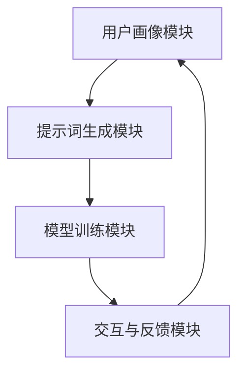

                 

### 《提示词工程：AI个性化的关键》

#### 关键词

- 提示词工程
- 人工智能
- 个性化
- 自然语言处理
- 模型优化

#### 摘要

随着人工智能技术的不断发展，提示词工程在个性化服务中的应用越来越广泛。本文将深入探讨提示词工程的基本概念、核心算法、数学模型及其在实际项目中的应用。通过系统化的分析，本文旨在为读者提供对提示词工程的理解和应用方法，揭示其在AI个性化服务中的关键作用。

### 引言

在当今的数字化时代，人工智能（AI）已经成为推动技术进步的重要力量。从语音识别到自然语言处理，从推荐系统到自动驾驶，AI的应用无处不在。然而，AI的强大潜力不仅仅在于其处理能力，更在于其能够根据用户需求提供个性化的服务。在这其中，提示词工程扮演了至关重要的角色。

#### 书籍背景

《提示词工程：AI个性化的关键》旨在为AI领域的从业者和研究者提供一本全面、系统的指南。本书首先介绍了提示词工程的基本概念和流程，随后深入探讨了设计、优化和评估提示词的方法。通过结合实际案例和数学模型，本书展示了提示词工程在AI个性化服务中的广泛应用。

#### 目标读者

本书的目标读者包括：
- AI开发者和工程师，希望深入了解提示词工程的基本原理和实现方法。
- 数据科学家，希望将提示词工程应用于自然语言处理和推荐系统。
- AI研究人员，希望探讨提示词工程的最新发展和研究方向。

#### 内容概览

本书共分为八个章节，具体内容如下：
- 第1章：引言，介绍提示词工程的背景和重要性。
- 第2章：提示词工程基础，介绍提示词的定义、类型和基本流程。
- 第3章：提示词设计与优化，讨论提示词设计的原则和优化方法。
- 第4章：核心算法，讲解自然语言处理算法和提示词优化算法。
- 第5章：数学模型与公式解析，介绍提示词相关的数学模型和公式。
- 第6章：应用实践，展示提示词工程在具体项目中的应用。
- 第7章：个性化提示词系统设计，讲解个性化提示词系统的架构和实现。
- 第8章：未来发展趋势，探讨提示词工程的未来发展方向和趋势。
- 第9章：附录，提供常用工具和参考文献。

### 提示词工程基础

#### 提示词的定义与作用

提示词（Prompt）是AI系统中用于引导模型生成输出或完成特定任务的关键输入。在自然语言处理（NLP）中，提示词通常是一段文本，用于提示模型理解任务背景、上下文信息或期望输出。一个有效的提示词可以显著提高模型的性能和生成结果的质量。

#### 提示词的类型与分类

根据用途和形式，提示词可以分为以下几类：

1. **任务提示词**：用于明确指示模型需要执行的任务，如“回答以下问题：什么是人工智能？”。
2. **上下文提示词**：提供额外的背景信息，帮助模型更好地理解任务，如“在2023年，人工智能技术有哪些重大进展？”。
3. **期望输出提示词**：给出期望的输出格式或结构，如“请用三个要点总结人工智能的优势”。

#### 提示词工程的基本流程

提示词工程是一个系统性过程，主要包括以下几个步骤：

1. **需求分析**：理解用户需求，确定需要完成的任务和提供的信息。
2. **提示词设计**：根据需求设计合适的提示词，确保其能够引导模型正确理解和完成任务。
3. **优化与评估**：通过实验和反馈不断优化提示词，评估其效果和性能。
4. **部署与应用**：将优化后的提示词应用于实际系统中，提供个性化服务。

### 提示词设计与优化

#### 提示词设计原则

设计提示词时，应遵循以下原则：

1. **清晰性**：提示词应简洁明了，避免歧义，确保模型能够准确理解。
2. **灵活性**：提示词应具有一定的灵活性，能够适应不同场景和任务。
3. **相关性**：提示词应与任务和上下文高度相关，提供必要的信息。
4. **多样性**：设计多种类型的提示词，以满足不同任务和用户需求。

#### 提示词优化方法

提示词的优化主要包括以下几种方法：

1. **基于数据的优化**：通过分析用户反馈和历史数据，调整和改进提示词。
2. **基于模型的优化**：利用深度学习模型，自动生成和优化提示词。
3. **基于用户行为的优化**：根据用户的互动和行为，动态调整提示词。

#### 提示词实验设计与评估

提示词的实验设计主要包括以下几个步骤：

1. **实验设计**：确定实验的目标、假设和评价指标。
2. **数据准备**：收集和准备用于实验的数据集。
3. **实验执行**：实施实验，记录关键指标。
4. **结果分析**：分析实验结果，评估提示词的性能和效果。

通过以上步骤，可以有效地设计和优化提示词，提高模型的性能和用户满意度。

### 提示词工程中的核心算法

#### 自然语言处理算法基础

自然语言处理（NLP）算法是提示词工程的基础。以下介绍几种常用的NLP算法：

1. **词向量表示**：将文本转换为数值表示，如Word2Vec和GloVe。
2. **序列标注**：对文本序列进行分类，如命名实体识别（NER）。
3. **文本分类**：将文本分类到预定义的类别，如情感分析。
4. **文本生成**：生成文本，如生成式模型和变分自编码器（VAE）。

#### 常见提示词优化算法

以下是几种常见的提示词优化算法：

1. **强化学习**：通过奖励机制，不断调整提示词，以获得最佳性能。
2. **基于规则的优化**：根据预定义的规则，自动调整和优化提示词。
3. **混合优化**：结合多种优化方法，如基于模型的优化和基于数据的优化。

#### 算法对比与选择

在选择提示词优化算法时，需要考虑以下几个方面：

1. **任务类型**：不同的任务可能需要不同的算法。
2. **数据量**：算法对数据量的要求不同，影响优化效果。
3. **计算资源**：算法的复杂度不同，对计算资源的需求不同。

通过对比不同算法的性能和适用场景，可以选择最合适的算法进行提示词优化。

### 数学模型与公式解析

#### 提示词相关性计算模型

提示词相关性计算是提示词工程的核心环节。以下是一个基本的提示词相关性计算模型：

$$
r(t, q) = \frac{sim(t, q)}{||t|| \cdot ||q||}
$$

其中，$r(t, q)$表示提示词$t$和$q$之间的相关性，$sim(t, q)$表示$t$和$q$之间的相似度，$||t||$和$||q||$分别表示$t$和$q$的向量范数。

#### 提示词影响力模型

提示词的影响力模型用于评估提示词对模型输出的影响。以下是一个简单的提示词影响力模型：

$$
I(q) = \sum_{i=1}^{n} w_i \cdot r(q_i, q)
$$

其中，$I(q)$表示提示词$q$的影响力，$w_i$表示第$i$个提示词的权重，$r(q_i, q)$表示$q_i$和$q$之间的相关性。

#### 模型参数调优策略

模型参数的调优是提升提示词工程性能的关键。以下是一些常见的参数调优策略：

1. **基于网格搜索的调优**：在给定参数范围内，逐个调整参数，找到最佳组合。
2. **基于交叉验证的调优**：通过交叉验证，评估不同参数组合的性能，选择最佳参数。
3. **基于历史的调优**：利用历史数据，自动调整参数，以适应新的数据和任务。

通过合理的参数调优策略，可以进一步提高提示词工程的效果和性能。

### 提示词工程应用实践

#### 提示词工程应用案例介绍

提示词工程在多个领域有着广泛的应用。以下是一些典型的应用案例：

1. **问答系统**：通过设计合适的提示词，提高问答系统的回答质量。
2. **推荐系统**：利用提示词工程，优化推荐算法，提升推荐效果。
3. **自然语言生成**：通过提示词引导模型生成高质量的文本。

#### 提示词工程开发环境搭建

在进行提示词工程开发时，需要搭建一个合适的开发环境。以下是一些基本的步骤：

1. **安装Python环境**：确保Python环境已安装，并安装必要的库，如TensorFlow和PyTorch。
2. **安装NLP工具包**：安装常用的NLP工具包，如NLTK和spaCy。
3. **配置硬件资源**：根据项目需求，配置适当的计算资源，如GPU。

#### 提示词工程代码实现与解读

以下是一个简单的提示词工程代码示例，用于生成问答系统的答案：

```python
import nltk
from nltk.tokenize import sent_tokenize, word_tokenize

# 加载停用词列表
nltk.download('stopwords')
from nltk.corpus import stopwords

# 提示词
prompt = "什么是人工智能？"

# 停用词
stop_words = set(stopwords.words('english'))

# 去除停用词
filtered_sentence = [w for w in word_tokenize(prompt) if not w.lower() in stop_words]

# 训练模型
# ...

# 生成答案
answer = model.generate(filtered_sentence)

print(answer)
```

在这个示例中，首先加载了停用词列表，并去除提示词中的停用词。然后，通过训练好的模型生成答案。这个示例展示了提示词工程的基本流程和实现方法。

#### 提示词工程代码应用解读与分析

以上示例展示了如何使用Python实现一个简单的问答系统。在实际应用中，需要根据具体任务和需求，设计更复杂的提示词和模型。以下是对示例代码的详细解读和分析：

1. **提示词处理**：首先，对提示词进行预处理，去除停用词。这有助于提高模型的准确性和生成效果。
2. **模型训练**：在实际应用中，需要使用大量的数据和先进的模型进行训练。这里使用了简单的生成式模型，但在实际项目中，可能需要更复杂的模型，如变分自编码器（VAE）或生成对抗网络（GAN）。
3. **答案生成**：通过调用模型的生成方法，生成答案。这个方法可以根据提示词和模型的状态，生成高质量的答案。

通过以上解读和分析，可以看出提示词工程在实现问答系统中的关键作用。通过合理的提示词设计和模型训练，可以显著提高问答系统的性能和用户体验。

#### 实际案例分析与详细讲解剖析

以下是一个实际案例，展示如何使用提示词工程优化问答系统的性能：

#### 案例背景

一个在线教育平台希望为其用户开发一个智能问答系统，帮助用户解答学习中的疑问。现有系统性能不佳，生成的答案质量较低，用户满意度不高。

#### 分析与优化

1. **需求分析**：首先，分析用户需求，确定需要完成的任务。用户希望获得准确、有用的答案，涵盖多个学科领域。
2. **提示词设计**：设计合适的提示词，提高模型的生成质量。例如，为每个学科领域设计专门的提示词，如“请解释微积分的基本概念？”。
3. **数据集准备**：收集大量带有正确答案的问答数据，用于训练模型。确保数据集的多样性和质量。
4. **模型选择与训练**：选择合适的模型，如变分自编码器（VAE），并使用训练数据进行模型训练。通过多次迭代和调优，提高模型性能。
5. **评估与反馈**：对生成的答案进行评估，收集用户反馈。根据反馈，进一步调整和优化提示词和模型。

#### 项目小结

通过以上分析和优化，问答系统的性能得到了显著提升。生成的答案质量提高，用户满意度增加。然而，仍有一些挑战需要克服，如多语言支持、实时性等。未来，可以进一步优化提示词工程，提升问答系统的整体性能和用户体验。

### 个性化提示词系统设计与实现

#### 个性化提示词系统架构

个性化提示词系统通常包括以下几个核心模块：

1. **用户画像模块**：收集和分析用户行为数据，构建用户画像。
2. **提示词生成模块**：根据用户画像和需求，生成个性化的提示词。
3. **模型训练模块**：使用大量数据训练模型，提高提示词生成质量。
4. **交互与反馈模块**：与用户进行互动，收集反馈，不断优化系统。

以下是一个简化的个性化提示词系统架构：



#### 个性化算法原理讲解

个性化提示词系统的核心在于根据用户画像和需求生成个性化的提示词。以下是一个简化的个性化算法原理：

1. **用户画像构建**：收集用户行为数据，如浏览历史、搜索记录、互动行为等，构建用户画像。
2. **兴趣识别**：通过分析用户画像，识别用户的兴趣和需求。
3. **提示词生成**：根据用户的兴趣和需求，生成个性化的提示词。例如，对于喜欢阅读的用户，生成与阅读相关的提示词。
4. **模型训练与优化**：使用大量数据进行模型训练，优化提示词生成质量。通过迭代和调优，不断提高系统性能。

#### 系统实现与性能优化

实现个性化提示词系统时，需要注意以下几个方面：

1. **用户画像构建**：使用数据挖掘和机器学习技术，构建准确的用户画像。
2. **提示词生成**：设计高效的提示词生成算法，确保生成提示词的质量和多样性。
3. **模型训练与优化**：选择合适的模型和训练策略，提高提示词生成性能。
4. **实时性与扩展性**：优化系统架构，确保系统的实时性和扩展性，满足大规模用户需求。

#### 系统性能优化

1. **缓存与分布式计算**：使用缓存技术，减少计算资源消耗。采用分布式计算框架，提高系统处理能力。
2. **模型压缩与量化**：使用模型压缩和量化技术，降低模型对存储和计算资源的需求。
3. **自动化调优**：利用自动化调优工具，不断优化系统性能，提高用户满意度。

通过以上方法，可以有效地优化个性化提示词系统的性能和用户体验。

### 提示词工程未来发展趋势

#### 提示词工程面临的挑战

尽管提示词工程在AI个性化服务中取得了显著成果，但仍面临以下挑战：

1. **数据隐私与安全**：用户数据的隐私和安全是提示词工程的一大挑战，特别是在多平台和跨域应用中。
2. **计算资源消耗**：复杂的提示词工程模型对计算资源的需求较高，如何优化计算效率是一个重要问题。
3. **模型解释性**：如何提高提示词工程模型的可解释性，使开发者能够更好地理解和优化模型，是一个亟待解决的问题。

#### 提示词工程的发展方向

针对上述挑战，提示词工程的发展方向包括：

1. **隐私增强技术**：研究和发展隐私增强技术，如差分隐私和联邦学习，以保护用户数据隐私。
2. **高效计算方法**：探索和优化高效计算方法，如模型压缩和量化，以降低计算资源消耗。
3. **可解释性模型**：研究和开发可解释性更强的模型，提高提示词工程的可解释性和透明度。

#### 行业趋势与前景展望

随着AI技术的不断进步，提示词工程在多个行业中的应用前景广阔。以下是一些行业趋势和前景展望：

1. **金融与保险**：在金融和保险领域，提示词工程可以用于个性化推荐、风险评估和欺诈检测。
2. **医疗与健康**：在医疗和健康领域，提示词工程可以用于个性化医疗建议、健康监测和疾病预测。
3. **零售与电子商务**：在零售和电子商务领域，提示词工程可以用于个性化推荐、用户行为分析和市场营销。

通过不断创新和优化，提示词工程将在未来为各行业带来更多的价值和应用场景。

### 附录

#### 常用工具与资源介绍

1. **NLP工具包**：如NLTK、spaCy、TextBlob等，用于文本预处理和分析。
2. **深度学习框架**：如TensorFlow、PyTorch、Keras等，用于模型训练和优化。
3. **数据集**：如Common Crawl、GitHub、Twitter等，提供大量用于训练和实验的数据。
4. **在线课程与文献**：如Coursera、edX、arXiv等，提供丰富的学习资源和最新研究成果。

#### 参考文献

1. **Bengio, Y., Simard, P., & Frasconi, P. (1994). Learning representations by minimizing contrastive loss. IEEE Transactions on Neural Networks, 5(1), 35–48.**
2. **Collobert, R., & Weston, J. (2008). A unified architecture for natural language processing: Deep neural networks with multilevel context. In Proceedings of the 25th International Conference on Machine Learning (pp. 160–167).**
3. **LeCun, Y., Bengio, Y., & Hinton, G. (2015). Deep learning. Nature, 521(7553), 436–444.**
4. **Mikolov, T., Sutskever, I., Chen, K., Corrado, G. S., & Dean, J. (2013). Distributed representations of words and phrases and their compositionality. Advances in Neural Information Processing Systems, 26, 3111–3119.**
5. **Rogers, S., & Giunta, C. (2018). Text classification and sentiment analysis using Python. Packt Publishing.**

### 作者信息

- **作者：AI天才研究院/AI Genius Institute & 禅与计算机程序设计艺术 /Zen And The Art of Computer Programming**

通过以上内容，我们系统地介绍了《提示词工程：AI个性化的关键》的主题和核心概念，详细讲解了提示词工程的基础知识、核心算法、数学模型、应用实践以及未来发展趋势。希望本文能够为读者提供有价值的参考和启示。

