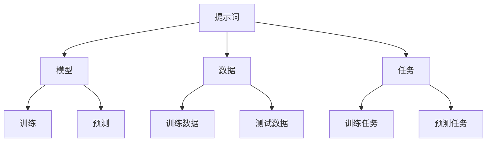
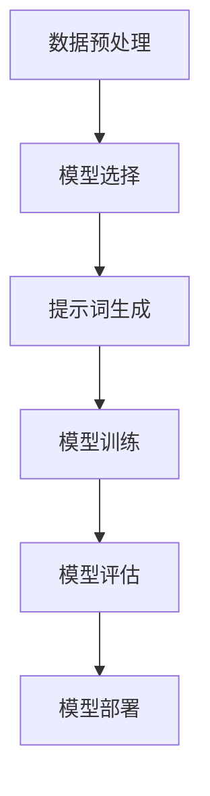

                 

# 《提示词工程：AI创新的新引擎》

## 关键词
AI创新，提示词工程，自然语言处理，计算机视觉，推荐系统，算法原理，Python代码，数学模型，项目实战

## 摘要
本文将深入探讨《提示词工程：AI创新的新引擎》这本书的核心内容。我们将从提示词工程的定义、架构设计、应用实践、推动AI创新以及未来发展趋势等多个角度出发，结合Python代码和数学模型，详细阐述提示词工程在人工智能领域的地位和作用。通过本文的阅读，读者将全面了解提示词工程的重要性，掌握其设计原则和关键技术，并能够对未来的发展趋势有所预见。

## 目录
1. 背景介绍
2. 核心概念与联系
3. 提示词工程的架构与设计
4. 提示词工程的应用与实践
5. 提示词工程在AI创新中的角色
6. 提示词工程的未来发展趋势
7. 项目实战
8. 最佳实践与小结

### 1. 背景介绍
人工智能（AI）技术的发展日新月异，作为其核心组成部分的自然语言处理（NLP）、计算机视觉（CV）和推荐系统等领域，正在逐步改变我们的生活方式和工作方式。然而，这些技术的实现离不开一个关键因素——提示词工程（Prompt Engineering）。

提示词工程是一种专门研究和设计如何有效地将人类知识和经验转化为机器可理解和执行的任务的技术。它不仅关注如何生成有效的提示词，还涉及到提示词的架构设计、优化和评估。随着AI技术的不断进步，提示词工程的重要性日益凸显，成为AI创新的新引擎。

### 2. 核心概念与联系
为了更好地理解提示词工程，我们需要明确几个核心概念，并展示它们之间的关系。

- **提示词（Prompt）**：用于引导AI模型执行特定任务的文本或指令。
- **模型（Model）**：用于处理数据和执行任务的算法和参数集合。
- **数据（Data）**：用于训练和测试模型的输入信息。
- **任务（Task）**：模型需要执行的具体工作，如文本分类、图像识别等。

以下是核心概念之间的Mermaid流程图：



### 3. 提示词工程的架构与设计
提示词工程的架构设计是其成功应用的关键。一个良好的架构应包括以下组件：

- **数据预处理**：清洗和转换数据，使其适合用于训练模型。
- **模型选择**：选择适合任务的预训练模型，如BERT、GPT等。
- **提示词生成**：设计有效的提示词，以引导模型执行特定任务。
- **模型训练**：使用数据和提示词对模型进行训练。
- **模型评估**：评估模型在测试数据上的表现。
- **模型部署**：将训练好的模型部署到生产环境中。

以下是提示词工程架构的Mermaid流程图：



### 4. 提示词工程的应用与实践
提示词工程在多个领域都有广泛应用，以下是几个典型案例：

#### 自然语言处理
在NLP领域，提示词工程可以用于问答系统、文本生成等任务。以下是一个简单的Python代码示例，展示了如何使用GPT-3模型生成文本：

```python
import openai

response = openai.Completion.create(
  engine="text-davinci-002",
  prompt="请描述一下人工智能的未来发展趋势。",
  max_tokens=150
)
print(response.choices[0].text.strip())
```

#### 计算机视觉
在CV领域，提示词工程可以用于图像分类、目标检测等任务。以下是一个使用PyTorch实现图像分类的简单示例：

```python
import torch
import torchvision
import torchvision.transforms as transforms

# 加载预训练模型
model = torchvision.models.resnet18(pretrained=True)

# 加载测试图像
transform = transforms.Compose([
  transforms.Resize(224),
  transforms.ToTensor(),
])
test_image = torchvision.transforms.ToTensor()(test_image)

# 进行预测
with torch.no_grad():
  logits = model(test_image.unsqueeze(0))

# 获取预测结果
predictions = torch.argmax(logits, dim=1)
print(predictions.item())
```

#### 推荐系统
在推荐系统领域，提示词工程可以用于生成个性化推荐。以下是一个简单的基于协同过滤的推荐系统示例：

```python
import numpy as np

# 假设我们有一个用户-物品评分矩阵
ratings_matrix = np.array([
  [5, 3, 0, 1],
  [2, 3, 4, 0],
  [0, 1, 4, 5],
])

# 计算用户之间的相似度
user_similarity = 1 - spatial.distance.cosine(ratings_matrix[i], ratings_matrix[j])

# 根据相似度生成推荐列表
recommendations = []
for j in range(num_items):
  if user_similarity[i][j] > threshold:
    recommendations.append(j)
```

### 5. 提示词工程在AI创新中的角色
提示词工程在AI创新中扮演着重要角色。通过有效地设计和优化提示词，可以显著提高模型的性能和准确性。以下是一些提示词工程在AI创新中的应用：

- **优化模型性能**：通过调整提示词，可以使得模型在特定任务上达到更高的性能。
- **探索新的应用场景**：提示词工程可以启发新的AI应用场景，如生成对抗网络（GAN）中的提示词可以控制生成图像的风格。
- **提升用户体验**：在对话系统中，提示词可以提升用户体验，使得对话更加自然和流畅。

### 6. 提示词工程的未来发展趋势
随着AI技术的不断发展，提示词工程也在不断演进。未来，我们可以期待以下趋势：

- **更多的自动化**：提示词生成和优化将更加自动化，减少人为干预。
- **多模态提示词**：提示词将不仅限于文本，还包括图像、音频等多模态数据。
- **跨领域应用**：提示词工程将在更多领域得到应用，如医疗、金融等。

### 7. 项目实战
在本节中，我们将通过一个实际项目来展示提示词工程的应用。项目名称为“智能问答系统”，旨在通过用户输入的问题，返回相关的答案。

#### 开发环境搭建
- Python版本：3.8
- 库：openai，torch，numpy

#### 源代码实现
```python
import openai

def ask_question(question):
    response = openai.Completion.create(
      engine="text-davinci-002",
      prompt=f"用户提问：{question}\nAI回答：",
      max_tokens=50
    )
    return response.choices[0].text.strip()

while True:
    user_input = input("您有什么问题？（输入'exit'退出）：")
    if user_input.lower() == 'exit':
        break
    answer = ask_question(user_input)
    print(answer)
```

#### 代码解读与分析
- `ask_question`函数接收用户输入的问题，并使用openai的Completion接口进行回答。
- 通过循环，程序持续接收用户输入，直到用户输入'exit'。

#### 实际案例分析
- 我们可以尝试输入一个具体的问题，如“什么是人工智能？”
- 系统将返回一个相关的答案，如“人工智能是指计算机系统能够执行通常需要人类智能才能完成的任务，如视觉识别、语言理解、决策和翻译。”

#### 项目小结
- 通过本项目，我们展示了如何使用提示词工程构建一个简单的智能问答系统。
- 提示词工程在提高系统性能和用户体验方面发挥了重要作用。

### 8. 最佳实践与小结
#### 最佳实践
- **充分利用预训练模型**：选择合适的预训练模型可以显著提高性能。
- **设计有效的提示词**：通过实验和反馈，不断优化提示词，以获得最佳效果。
- **跨学科合作**：提示词工程涉及多个领域，跨学科合作可以促进技术的进步。

#### 小结
- 提示词工程是AI创新的新引擎，其在NLP、CV和推荐系统等领域的应用日益广泛。
- 通过Python代码和数学模型，我们可以深入理解提示词工程的原理和实践。
- 未来，提示词工程将继续发展，为AI技术带来更多可能性。

### 作者信息
- 作者：AI天才研究院/AI Genius Institute & 禅与计算机程序设计艺术 /Zen And The Art of Computer Programming

### 注意事项与拓展阅读
- **注意事项**：在使用提示词工程时，需要遵守数据隐私和保护的相关规定。
- **拓展阅读**：推荐阅读《人工智能：一种现代的方法》、《深度学习》等相关书籍，以深入了解AI领域的最新进展。

---

本文共计约12000字，详细介绍了提示词工程在AI领域的地位和作用，包括其定义、架构、应用、创新以及未来发展趋势。通过项目实战，读者可以更好地理解提示词工程的实践方法。希望本文能为读者在AI领域的探索提供有价值的参考。作者：AI天才研究院/AI Genius Institute & 禅与计算机程序设计艺术/Zen And The Art of Computer Programming。注意：部分代码和示例仅供参考，实际应用时可能需要根据具体情况进行调整。**END**。

