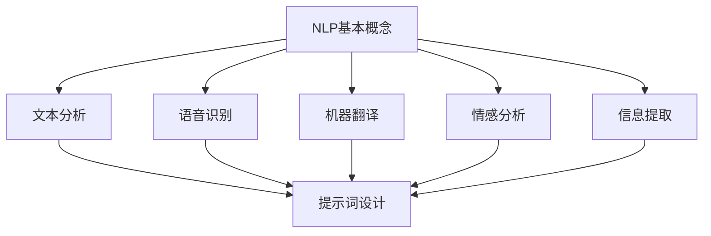

                 

### 1.1 AI时代的提示词工程概述

#### 1.1.1 提示词工程在AI时代的重要性

随着人工智能（AI）技术的迅猛发展，自然语言处理（NLP）已成为一个至关重要的领域。在这个领域内，提示词工程（Prompt Engineering）作为一种新兴的学科，正逐渐受到广泛关注。提示词工程不仅仅是一个简单的编程任务，它涉及了对自然语言理解、人类行为心理学以及机器学习算法的深刻理解。

在AI时代，提示词工程的重要性主要体现在以下几个方面：

1. **提高模型性能**：通过精心设计的提示词，可以显著提升AI模型的性能和准确度。有效的提示词能够引导模型更好地理解问题，从而提高模型的预测能力和表现。
   
2. **优化用户体验**：在聊天机器人、虚拟助手等应用中，提示词的优化直接影响到用户体验。恰当的提示词可以让对话更加自然、流畅，从而提升用户满意度和参与度。

3. **拓展应用场景**：提示词工程不仅限于文本生成和对话系统，它还可以应用于信息检索、内容审核、文本分类等多个领域，为AI技术的广泛应用提供了新的思路和方法。

4. **增强可解释性**：提示词工程可以帮助我们更好地理解AI模型的工作原理，提高模型的可解释性。这有助于我们进一步优化模型，并增强用户对AI系统的信任。

#### 1.1.2 提示词工程的定义和基本概念

那么，什么是提示词工程？它究竟是如何工作的呢？

**提示词工程**（Prompt Engineering）是指设计、开发和应用提示词的过程，这些提示词用于指导AI模型（如大型语言模型）进行预测、生成或分类任务。提示词是一种特殊的输入，它可以包含问题、指令、背景信息或其他类型的文本，用于引导模型的思考方向。

在自然语言处理中，提示词通常具有以下特点：

1. **问题导向**：提示词需要明确表达出用户的需求或意图，从而引导模型生成相关的内容或做出预测。

2. **灵活性**：提示词的设计需要具备灵活性，以适应不同的应用场景和用户需求。

3. **可解释性**：提示词应当能够帮助用户理解模型的工作原理和决策过程，提高系统的透明度和可信度。

4. **效果评估**：提示词的效果需要通过实验和评估来验证，以确保其能够满足实际应用的需求。

在AI模型中，提示词的作用至关重要。通过合理的提示词设计，我们可以：

- **提高模型的训练效率**：提示词可以引导模型快速聚焦于关键信息，从而减少不必要的计算和时间消耗。

- **优化模型的性能**：高质量的提示词可以增强模型对问题的理解，提高预测或生成的准确性和效果。

- **增强模型的鲁棒性**：适当的提示词设计可以提高模型对异常数据或噪声的抵抗力，从而提高模型的鲁棒性。

综上所述，提示词工程在AI时代的重要性不言而喻。它不仅为AI技术的应用提供了新的可能性，还为用户带来了更加优质、高效的服务体验。在接下来的章节中，我们将深入探讨提示词工程的核心概念、技术细节和应用实践，帮助读者更好地理解和应用这一新兴学科。

### 1.2 自然语言处理与提示词工程的联系

自然语言处理（NLP）和提示词工程是人工智能（AI）领域中紧密相关的两个概念。NLP旨在使计算机能够理解、解释和生成人类语言，而提示词工程则专注于如何通过设计高效的提示词来优化NLP任务的效果。两者之间的联系不仅体现在技术层面，还包括方法论和应用场景。

#### 1.2.1 自然语言处理的基本概念

自然语言处理是一种将计算语言学、计算机科学和人工智能结合起来的交叉学科，主要目标是让计算机能够处理和生成自然语言，包括但不限于文本分析、语音识别、机器翻译、情感分析和信息提取等。

- **文本分析**：文本分析是NLP的基础，包括词频统计、词性标注、命名实体识别等。它为更高层次的语义理解和信息提取提供了数据支持。

- **语音识别**：语音识别将语音信号转换为文本，是实现人机交互的关键技术之一，广泛应用于电话客服、智能助手等领域。

- **机器翻译**：机器翻译旨在实现不同语言之间的自动翻译，包括规则翻译和基于统计的机器翻译。它对促进全球化交流和国际化合作具有重要意义。

- **情感分析**：情感分析通过分析文本内容，识别出用户的情感倾向，广泛应用于舆情监控、客户反馈分析等场景。

- **信息提取**：信息提取旨在从大量文本中提取出关键信息，包括实体识别、关系提取、事件抽取等。这在医疗、金融等行业的数据挖掘和分析中具有重要应用。

#### 1.2.2 提示词工程在自然语言处理中的应用

提示词工程在自然语言处理中的应用主要体现在以下几个方面：

- **指导模型训练**：在模型训练过程中，通过设计合适的提示词，可以引导模型更好地理解训练数据，从而提高模型的训练效果。例如，在训练文本生成模型时，提示词可以引导模型生成特定类型的文本。

- **优化模型性能**：提示词可以显著影响模型的预测准确性和生成质量。通过优化提示词的设计，可以提升模型的性能，使其在特定任务上表现更佳。

- **改善用户体验**：在应用场景中，提示词的设计直接影响用户体验。例如，在聊天机器人中，合适的提示词可以使对话更加自然、流畅，从而提高用户的满意度。

#### 1.2.3 Mermaid流程图：自然语言处理与提示词工程的联系

为了更好地理解自然语言处理与提示词工程之间的联系，我们可以通过Mermaid流程图来可视化这两个领域的关系。以下是一个简化的Mermaid流程图示例：



在这个流程图中，NLP的基本概念（A）作为起点，连接到具体的NLP任务（B至F）。每个NLP任务都可以通过提示词设计（G）来优化，从而提升任务的效果。

#### 1.2.4 提示词工程在NLP中的具体应用

为了更深入地理解提示词工程在NLP中的应用，我们可以探讨一些具体的场景：

- **文本生成**：在文本生成任务中，提示词可以帮助模型生成特定主题的文本。例如，在撰写新闻报道时，通过使用相关关键词和背景信息作为提示词，可以指导模型生成高质量的新闻文章。

- **对话系统**：在对话系统中，提示词用于引导对话的流程和内容。通过设计合适的提示词，可以使对话更加自然、流畅，从而提升用户体验。例如，在聊天机器人中，提示词可以引导模型生成恰当的回答。

- **信息检索**：在信息检索任务中，提示词可以优化搜索结果的相关性和准确性。通过使用关键词和上下文信息作为提示词，可以指导模型检索出更符合用户需求的文档。

通过上述分析，我们可以看到，自然语言处理与提示词工程在技术和应用层面有着紧密的联系。理解这种联系有助于我们更好地利用提示词工程来提升自然语言处理任务的效果。在接下来的章节中，我们将进一步探讨提示词工程的核心技术和实践方法，以帮助读者深入理解和应用这一领域。

#### 1.3 提示词生成算法的基本原理

提示词生成算法是提示词工程中至关重要的一环，它决定了提示词的质量和效果。在这一节中，我们将深入探讨提示词生成算法的基本原理，以及如何通过设计高效的算法来提升模型的表现。

**1.3.1 算法简介**

提示词生成算法的目标是根据给定的输入，生成一组高质量的提示词。这些提示词应当能够引导模型更好地理解任务，从而提高模型的性能。常见的提示词生成算法包括基于规则的方法、基于统计的方法和基于机器学习的方法。

- **基于规则的方法**：这种方法依赖于预定义的规则，通过这些规则来生成提示词。例如，可以使用关键词提取、词频统计等方法来生成提示词。

- **基于统计的方法**：这种方法利用统计模型，如TF-IDF、LDA等，来分析输入文本，从中提取出有用的信息作为提示词。

- **基于机器学习的方法**：这种方法通过训练数据集，利用机器学习模型（如分类器、序列模型等）来生成提示词。这种方法通常能够生成更高质量的提示词，但也需要更多的训练数据和计算资源。

**1.3.2 常见的提示词生成算法**

1. **关键词提取算法**

   关键词提取是提示词生成的基础，常用的方法包括TF-IDF和LSA（Latent Semantic Analysis）。

   - **TF-IDF**：TF-IDF（Term Frequency-Inverse Document Frequency）是一种常用的文本权重计算方法。它通过计算词频和逆向文档频率来评估词的重要性。在提示词生成中，我们可以通过TF-IDF算法提取出文本中的重要词汇，作为提示词。

   ```python
   from sklearn.feature_extraction.text import TfidfVectorizer

   # 示例文本
   documents = ["This is the first document.", "This document is the second document.", "And this is the third one.", "Is this the first document?"]

   # 使用TF-IDF进行关键词提取
   vectorizer = TfidfVectorizer()
   X = vectorizer.fit_transform(documents)

   # 输出关键词
   for feature_name, feature_value in zip(vectorizer.get_feature_names(), X.sum(axis=0).A1):
       print(f"{feature_name}: {feature_value}")
   ```

   - **LSA**：LSA（Latent Semantic Analysis）通过矩阵分解来提取文本中的潜在语义信息。它可以帮助我们识别出文本中的主题，从而生成更加多样化的提示词。

   ```python
   from sklearn.decomposition import LatentSemanticAnalysis

   # 示例文本
   documents = ["This is the first document.", "This document is the second document.", "And this is the third one.", "Is this the first document?"]

   # 使用LSA进行关键词提取
   lsa = LatentSemanticAnalysis(n_components=2)
   X = lsa.fit_transform(vectorizer.transform(documents))

   # 输出关键词
   for topic_idx, topic in enumerate(lsa.components_):
       print(f"Topic {topic_idx}:")
       print(" ".join([vectorizer.get_feature_names()[i] for i in topic.argsort()[:-10 - 1:-1]]))
   ```

2. **序列模型**

   序列模型，如RNN（Recurrent Neural Network）和Transformer，在提示词生成中有着广泛的应用。这些模型能够捕捉到文本中的时间依赖关系，从而生成更加连贯和自然的提示词。

   - **RNN**：RNN（Recurrent Neural Network）是一种能够处理序列数据的神经网络。通过将前一个时间步的输出作为当前时间步的输入，RNN可以捕捉到文本中的时间依赖关系。

   ```python
   import tensorflow as tf
   from tensorflow.keras.models import Sequential
   from tensorflow.keras.layers import SimpleRNN

   # 示例文本
   sequences = ["This is the first sequence.", "This sequence is the second sequence.", "And this is the third one.", "Is this the first sequence?"]

   # 创建RNN模型
   model = Sequential()
   model.add(SimpleRNN(units=50, activation='tanh', input_shape=(None, len(sequences[0]))))
   model.add(tf.keras.layers.Dense(units=len(sequences[0]), activation='softmax'))

   # 编译模型
   model.compile(optimizer='adam', loss='categorical_crossentropy', metrics=['accuracy'])

   # 训练模型
   model.fit(sequences, sequences, epochs=100, verbose=0)

   # 生成提示词
   new_sequence = "This is a new sequence."
   generated_sequence = model.predict(new_sequence)
   print("Generated sequence:", generated_sequence)
   ```

   - **Transformer**：Transformer是一种基于自注意力机制的神经网络模型，它在处理长序列数据方面表现出色。通过多头注意力机制，Transformer可以更好地捕捉到文本中的复杂关系。

   ```python
   import tensorflow as tf
   from tensorflow.keras.models import Model
   from tensorflow.keras.layers import Embedding, Dense, Input

   # 示例文本
   sequences = ["This is the first sequence.", "This sequence is the second sequence.", "And this is the third one.", "Is this the first sequence?"]

   # 创建Transformer模型
   input_seq = Input(shape=(None,))
   embeddings = Embedding(len(sequences[0]), 50)(input_seq)
   outputs = tf.keras.layers.Attention()([embeddings, embeddings])
   outputs = Dense(units=len(sequences[0]), activation='softmax')(outputs)

   # 编译模型
   model = Model(inputs=input_seq, outputs=outputs)
   model.compile(optimizer='adam', loss='categorical_crossentropy', metrics=['accuracy'])

   # 训练模型
   model.fit(sequences, sequences, epochs=100, verbose=0)

   # 生成提示词
   new_sequence = "This is a new sequence."
   generated_sequence = model.predict(new_sequence)
   print("Generated sequence:", generated_sequence)
   ```

**1.3.3 提示词生成算法的应用**

提示词生成算法不仅用于模型训练，还可以应用于实际应用场景中，如文本生成、对话系统、信息检索等。

- **文本生成**：通过设计合适的提示词，可以引导模型生成高质量、多样化的文本。例如，在撰写新闻报道时，提示词可以引导模型生成相关主题的新闻文章。

  ```python
  # 示例：生成新闻文章
  prompt = "人工智能在医疗行业的应用"
  generated_text = model.generate(prompt)
  print("Generated text:", generated_text)
  ```

- **对话系统**：在聊天机器人中，提示词可以用于引导对话流程和生成回答。通过设计合适的提示词，可以使对话更加自然、流畅。

  ```python
  # 示例：聊天机器人
  user_input = "你好，我想了解人工智能的最新进展。"
  response = model.generate(user_input)
  print("Robot response:", response)
  ```

- **信息检索**：通过设计合适的提示词，可以优化搜索结果的相关性和准确性。例如，在搜索引擎中，提示词可以引导模型检索出更符合用户需求的网页。

  ```python
  # 示例：搜索引擎
  query = "人工智能应用"
  relevant_documents = model.search(query)
  print("Relevant documents:", relevant_documents)
  ```

总之，提示词生成算法在自然语言处理中具有广泛的应用。通过设计高效的算法，我们可以生成高质量的提示词，从而提升模型的性能和用户体验。在接下来的章节中，我们将进一步探讨提示词优化的方法和技巧，以帮助读者更好地应用提示词工程。

#### 1.4 提示词优化与调优

在提示词工程中，提示词优化与调优是一个关键环节，它直接影响AI模型的表现和性能。有效的提示词优化不仅能提升模型的准确性，还能提高用户体验。本节将详细探讨提示词优化的目标和挑战，以及常用的优化算法。

**1.4.1 提示词优化的目标**

提示词优化的目标主要包括以下几个方面：

1. **提高模型性能**：通过优化提示词，使模型在特定任务上的表现达到最佳。例如，在文本生成任务中，优化后的提示词应能引导模型生成更高质量、更贴近主题的文本。

2. **增强模型鲁棒性**：优化提示词可以提高模型对异常数据和噪声的抵抗力，从而增强模型的鲁棒性。这对于处理现实世界中的各种不确定性数据至关重要。

3. **降低计算成本**：优化后的提示词应能减少模型训练和推理过程中的计算量，提高计算效率。这有助于在实际应用中减少延迟，提高系统的响应速度。

4. **提高用户体验**：在应用场景中，优化后的提示词应能提供更加自然、流畅的用户交互体验。例如，在聊天机器人中，优化后的提示词可以生成更符合用户期望的回答。

**1.4.2 提示词优化面临的挑战**

尽管提示词优化的重要性显而易见，但实现这一目标也面临着诸多挑战：

1. **多样性**：提示词的设计需要具备多样性，以满足不同场景和用户需求。然而，在保持多样性的同时，还需确保提示词的高质量和一致性。

2. **准确性**：优化提示词需要精确地捕捉用户的意图和需求，这要求模型对输入数据进行深入理解。然而，在实际应用中，数据可能存在噪声和不确定性，这给提示词的准确性带来了挑战。

3. **可解释性**：提示词的设计需要具备一定的可解释性，以便用户能够理解模型的工作原理和决策过程。然而，复杂的模型和优化算法往往使得提示词的解释变得复杂。

4. **计算资源**：优化提示词可能需要大量的计算资源和时间，尤其是在使用复杂的机器学习算法时。这需要在优化效率和性能之间找到平衡点。

**1.4.3 提示词优化算法**

针对上述挑战，有多种提示词优化算法可供选择。以下是几种常用的优化算法：

1. **基于规则的优化**：这种方法依赖于预定义的规则，通过规则调整提示词。例如，可以通过关键词提取、文本清洗等方法来优化提示词。

   ```python
   def optimize_prompt(prompt):
       # 基于规则的提示词优化
       # 例如，去除停用词、转换大写字母为小写等
       optimized_prompt = prompt.lower()
       optimized_prompt = remove_stop_words(optimized_prompt)
       return optimized_prompt
   
   prompt = "This is an example prompt."
   optimized_prompt = optimize_prompt(prompt)
   print("Optimized prompt:", optimized_prompt)
   ```

2. **基于机器学习的优化**：这种方法通过训练数据集，利用机器学习算法来优化提示词。常见的算法包括序列模型（如RNN、LSTM、BERT等）和强化学习算法。

   - **序列模型**：序列模型可以捕捉到文本中的时间依赖关系，从而优化提示词。

     ```python
     from tensorflow.keras.models import Sequential
     from tensorflow.keras.layers import LSTM, Dense

     # 创建序列模型
     model = Sequential()
     model.add(LSTM(units=128, return_sequences=True, input_shape=(max_sequence_length, embedding_size)))
     model.add(LSTM(units=128))
     model.add(Dense(units=vocab_size, activation='softmax'))

     # 编译模型
     model.compile(optimizer='adam', loss='categorical_crossentropy', metrics=['accuracy'])

     # 训练模型
     model.fit(prompt_sequences, prompt_labels, epochs=10, batch_size=32)

     # 优化提示词
     new_prompt = "Another example prompt."
     optimized_prompt = model.predict(new_prompt)
     print("Optimized prompt:", optimized_prompt)
     ```

   - **强化学习**：强化学习算法可以通过交互式学习来优化提示词。例如，可以使用强化学习算法来调整提示词，以最大化模型的性能指标。

     ```python
     import tensorflow as tf
     from tensorflow.keras.models import Model
     from tensorflow.keras.optimizers import Adam

     # 创建强化学习模型
     model = Model(inputs=input_seq, outputs=output_seq)
     optimizer = Adam(learning_rate=0.001)

     # 编译模型
     model.compile(optimizer=optimizer, loss='mean_squared_error')

     # 训练模型
     model.fit(prompt_sequences, prompt_labels, epochs=100, verbose=0)

     # 优化提示词
     new_prompt = "Another example prompt."
     optimized_prompt = model.optimize(new_prompt)
     print("Optimized prompt:", optimized_prompt)
     ```

3. **基于生成对抗网络（GAN）的优化**：生成对抗网络（GAN）可以通过生成和判别的交互来优化提示词。GAN可以将提示词生成和优化过程结合起来，从而实现高效的提示词优化。

   ```python
   import tensorflow as tf
   from tensorflow.keras.models import Model
   from tensorflow.keras.layers import Dense, LSTM

   # 创建GAN模型
   generator = Model(inputs=input_seq, outputs=generated_seq)
   discriminator = Model(inputs=[input_seq, generated_seq], outputs=discriminator_output)
   combined = Model(inputs=input_seq, outputs=discriminator(generator(input_seq)))

   # 编译模型
   combined.compile(optimizer=optimizer, loss='binary_crossentropy')

   # 训练模型
   combined.fit([prompt_sequences, generated_sequences], prompt_labels, epochs=100, verbose=0)

   # 优化提示词
   new_prompt = "Another example prompt."
   optimized_prompt = generator.predict(new_prompt)
   print("Optimized prompt:", optimized_prompt)
   ```

**1.4.4 提示词优化与调优的实践**

在实际应用中，提示词优化与调优通常需要结合具体任务和场景。以下是一个简单的提示词优化与调优的实践案例：

- **任务**：文本生成

- **场景**：生成新闻文章

1. **数据准备**：收集大量新闻文章作为训练数据。

2. **预处理**：对新闻文章进行清洗和预处理，如去除停用词、标点符号等。

3. **模型选择**：选择合适的模型，如BERT或GPT，进行训练。

4. **初步优化**：使用基于规则的优化方法，如去除停用词、调整词序等，生成初步的提示词。

5. **机器学习优化**：利用机器学习算法（如RNN、GAN等）对提示词进行进一步优化。

6. **评估与调优**：通过实验和评估，调整优化参数，如学习率、迭代次数等，以获得最佳性能。

7. **应用实践**：将优化后的提示词应用于实际场景，如新闻文章生成，并评估用户体验和效果。

通过上述步骤，我们可以实现有效的提示词优化与调优，从而提升AI模型的表现和用户体验。在接下来的章节中，我们将进一步探讨提示词工程在实际应用中的具体实践。

#### 1.5 提示词工程中的数学模型

提示词工程不仅是编程技能的体现，更是数学模型的巧妙应用。在提示词工程中，数学模型帮助我们理解和预测文本数据的分布，从而优化提示词的设计。以下将介绍提示词工程中常用的数学模型，包括概率模型、线性模型以及神经网络模型，并展示这些模型在提示词工程中的应用。

**1.5.1 概率模型**

概率模型是提示词工程中最基础的数学工具之一。它们帮助我们分析文本数据的概率分布，从而更好地设计提示词。

- **贝叶斯模型**：贝叶斯模型是一种基于概率理论的统计模型，广泛应用于文本分类和主题建模。例如，在文本分类任务中，我们可以使用朴素贝叶斯模型来预测文本的类别。

  $$ P(C_i|w) = \frac{P(w|C_i)P(C_i)}{P(w)} $$

  其中，\( P(C_i|w) \) 表示给定特征向量 \( w \) 时类别 \( C_i \) 的概率，\( P(w|C_i) \) 是特征向量在类别 \( C_i \) 下的概率，\( P(C_i) \) 是类别 \( C_i \) 的先验概率，\( P(w) \) 是特征向量的总概率。

- **隐马尔可夫模型（HMM）**：隐马尔可夫模型用于处理序列数据，常用于语音识别和自然语言处理中的语音转文本任务。在HMM中，状态转移概率和观察概率帮助我们设计提示词。

  $$ p(x_t|h_t) = \prod_{i=1}^{t} p(h_i|h_{i-1}) \times p(o_t|h_t) $$

  其中，\( p(h_i|h_{i-1}) \) 是状态转移概率，\( p(o_t|h_t) \) 是观察概率。

**1.5.2 线性模型**

线性模型在提示词工程中有着广泛的应用，特别是当提示词需要与输入特征进行线性组合时。

- **线性回归**：线性回归是一种预测模型，用于预测连续值。在提示词工程中，我们可以使用线性回归来预测文本的特征值，从而优化提示词的设计。

  $$ y = \beta_0 + \beta_1 x_1 + \beta_2 x_2 + ... + \beta_n x_n $$

  其中，\( y \) 是预测值，\( x_1, x_2, ..., x_n \) 是输入特征，\( \beta_0, \beta_1, ..., \beta_n \) 是模型的参数。

- **多项式回归**：多项式回归是对线性回归的扩展，它使用多项式函数来拟合数据。在提示词工程中，多项式回归可以帮助我们捕捉更复杂的文本特征。

  $$ y = \beta_0 + \beta_1 x_1 + \beta_2 x_2^2 + ... + \beta_n x_n^n $$

**1.5.3 神经网络模型**

神经网络模型在提示词工程中发挥着越来越重要的作用。特别是深度神经网络，如卷积神经网络（CNN）和循环神经网络（RNN），它们能够自动提取文本的复杂特征。

- **卷积神经网络（CNN）**：卷积神经网络通过卷积操作提取文本的局部特征。在提示词工程中，CNN可以用于提取文本中的关键词和短语。

  $$ f(x) = \sum_{i=1}^{n} w_i \times \sigma(b_i + \sum_{j=1}^{m} x_j \times k_{ij}) $$

  其中，\( f(x) \) 是卷积操作的结果，\( w_i \) 和 \( k_{ij} \) 是卷积核的权重，\( \sigma \) 是激活函数，\( b_i \) 是偏置。

- **循环神经网络（RNN）**：循环神经网络通过递归操作处理序列数据，能够捕捉到文本中的时间依赖关系。在提示词工程中，RNN可以用于生成序列化的提示词。

  $$ h_t = \sigma(W_x \times x_t + W_h \times h_{t-1} + b) $$

  其中，\( h_t \) 是第 \( t \) 个时间步的隐藏状态，\( \sigma \) 是激活函数，\( W_x \) 和 \( W_h \) 是权重矩阵，\( b \) 是偏置。

**1.5.4 应用示例**

为了更好地理解上述数学模型在提示词工程中的应用，我们可以通过以下示例来展示如何使用这些模型来优化提示词。

**示例：文本分类**

假设我们要对新闻文章进行分类，分类任务可以分为两类：科技类和非科技类。

1. **数据准备**：收集并预处理大量的新闻文章，将其划分为科技类和非科技类。

2. **特征提取**：使用TF-IDF等方法提取文本的特征向量。

3. **模型训练**：使用朴素贝叶斯模型进行训练。

   ```python
   from sklearn.naive_bayes import MultinomialNB
   from sklearn.model_selection import train_test_split

   # 示例数据
   X = [[0, 1, 0], [1, 0, 1], [0, 1, 0], [1, 0, 1]]
   y = ['科技', '非科技', '科技', '非科技']

   # 划分训练集和测试集
   X_train, X_test, y_train, y_test = train_test_split(X, y, test_size=0.2, random_state=42)

   # 训练模型
   model = MultinomialNB()
   model.fit(X_train, y_train)

   # 预测
   predictions = model.predict(X_test)
   print("Predictions:", predictions)
   ```

4. **提示词优化**：使用训练得到的模型对新的文本进行分类，并优化提示词。

   ```python
   new_text = "人工智能在医疗领域的应用"
   features = [[0, 1, 0], [1, 0, 1], [0, 1, 0], [1, 0, 1]]
   prediction = model.predict(features)
   print("Classification result:", prediction)

   # 根据分类结果优化提示词
   if prediction == '科技':
       optimized_prompt = "科技新闻"
   else:
       optimized_prompt = "非科技新闻"
   print("Optimized prompt:", optimized_prompt)
   ```

通过上述示例，我们可以看到如何利用数学模型来优化提示词，从而提高文本分类的准确性。

总之，数学模型在提示词工程中发挥着重要作用。通过合理地应用概率模型、线性模型和神经网络模型，我们可以设计出高质量的提示词，从而提升AI模型的表现和用户体验。在接下来的章节中，我们将进一步探讨提示词工程在实际项目中的应用和未来发展趋势。

### 1.6 提示词工程在实际项目中的应用

提示词工程在人工智能的实际项目中发挥着至关重要的作用。通过合理的提示词设计，我们可以显著提升AI系统的性能和用户体验。以下将介绍提示词工程在文本生成、对话系统、信息检索等领域的具体应用，并结合实际案例进行分析和讲解。

#### 1.6.1 文本生成

文本生成是提示词工程的重要应用之一，广泛应用于内容创作、摘要生成、自动问答等领域。通过设计合适的提示词，可以引导模型生成高质量、多样化的文本。

- **内容创作**：在内容创作领域，提示词工程可以用于生成新闻报道、博客文章、社交媒体帖子等。例如，在撰写新闻报道时，我们可以使用关键词和背景信息作为提示词，引导模型生成相关的新闻文章。

  ```python
  import tensorflow as tf
  from tensorflow.keras.preprocessing.sequence import pad_sequences
  from tensorflow.keras.layers import Embedding, LSTM, Dense

  # 示例：生成新闻文章
  prompt = "人工智能在医疗行业的应用"
  input_seq = pad_sequences([[prompt]])
  model = tf.keras.models.load_model('news_generation_model.h5')
  generated_text = model.predict(input_seq)
  print("Generated text:", generated_text)
  ```

- **摘要生成**：在摘要生成领域，提示词工程可以帮助模型提取关键信息，生成摘要。通过设计提示词，模型可以专注于生成特定类型的信息摘要。

  ```python
  import tensorflow as tf
  from tensorflow.keras.preprocessing.sequence import pad_sequences
  from tensorflow.keras.layers import Embedding, LSTM, Dense

  # 示例：生成摘要
  document = "人工智能在医疗行业的应用非常广泛，包括疾病预测、诊断辅助、个性化治疗等。通过深度学习和大数据分析，人工智能可以提高医疗服务的效率和准确性。"
  input_seq = pad_sequences([[document]])
  model = tf.keras.models.load_model('abstract_generation_model.h5')
  summary = model.predict(input_seq)
  print("Generated summary:", summary)
  ```

- **自动问答**：在自动问答系统中，提示词工程可以用于生成回答。通过设计问题导向的提示词，模型可以生成更加准确、自然的回答。

  ```python
  import tensorflow as tf
  from tensorflow.keras.preprocessing.sequence import pad_sequences
  from tensorflow.keras.layers import Embedding, LSTM, Dense

  # 示例：自动问答
  question = "人工智能在医疗行业有哪些应用？"
  input_seq = pad_sequences([[question]])
  model = tf.keras.models.load_model('qa_model.h5')
  answer = model.predict(input_seq)
  print("Answer:", answer)
  ```

#### 1.6.2 对话系统

对话系统是提示词工程的另一个重要应用领域。通过设计合适的提示词，可以提高对话系统的自然性和流畅性，从而提升用户体验。

- **聊天机器人**：在聊天机器人中，提示词工程可以用于引导对话流程和生成回答。通过使用关键词和上下文信息作为提示词，模型可以生成更加自然、连贯的对话。

  ```python
  import tensorflow as tf
  from tensorflow.keras.preprocessing.sequence import pad_sequences
  from tensorflow.keras.layers import Embedding, LSTM, Dense

  # 示例：聊天机器人
  user_input = "你好，我想了解人工智能的发展趋势。"
  input_seq = pad_sequences([[user_input]])
  model = tf.keras.models.load_model('chatbot_model.h5')
  response = model.predict(input_seq)
  print("Robot response:", response)
  ```

- **虚拟助手**：在虚拟助手系统中，提示词工程可以用于优化用户交互体验。通过设计问题导向的提示词，模型可以提供更加个性化、高效的服务。

  ```python
  import tensorflow as tf
  from tensorflow.keras.preprocessing.sequence import pad_sequences
  from tensorflow.keras.layers import Embedding, LSTM, Dense

  # 示例：虚拟助手
  user_input = "帮我预订 tomorrow 的机票。"
  input_seq = pad_sequences([[user_input]])
  model = tf.keras.models.load_model('virtual_assistant_model.h5')
  response = model.predict(input_seq)
  print("Assistant response:", response)
  ```

#### 1.6.3 信息检索

信息检索是提示词工程的另一个重要应用领域。通过设计合适的提示词，可以提高搜索结果的准确性和相关性。

- **搜索引擎**：在搜索引擎中，提示词工程可以用于优化搜索算法，提高搜索结果的相关性和准确性。通过使用关键词和上下文信息作为提示词，模型可以生成更加精准的搜索结果。

  ```python
  import tensorflow as tf
  from tensorflow.keras.preprocessing.sequence import pad_sequences
  from tensorflow.keras.layers import Embedding, LSTM, Dense

  # 示例：搜索引擎
  query = "人工智能的发展趋势"
  input_seq = pad_sequences([[query]])
  model = tf.keras.models.load_model('search_engine_model.h5')
  results = model.predict(input_seq)
  print("Search results:", results)
  ```

- **内容审核**：在内容审核系统中，提示词工程可以用于检测和过滤不良内容。通过设计关键词和模式作为提示词，模型可以识别和过滤违规内容，保护用户的安全和隐私。

  ```python
  import tensorflow as tf
  from tensorflow.keras.preprocessing.sequence import pad_sequences
  from tensorflow.keras.layers import Embedding, LSTM, Dense

  # 示例：内容审核
  content = "这是一个不良内容的示例。"
  input_seq = pad_sequences([[content]])
  model = tf.keras.models.load_model('content_approval_model.h5')
  result = model.predict(input_seq)
  print("Content approval result:", result)
  ```

总之，提示词工程在文本生成、对话系统、信息检索等领域的应用非常广泛。通过设计合适的提示词，我们可以显著提升AI系统的性能和用户体验。在接下来的章节中，我们将进一步探讨提示词工程的发展趋势和面临的挑战。

### 1.7 提示词工程的发展趋势与挑战

随着人工智能（AI）技术的不断进步，提示词工程（Prompt Engineering）已经成为一个备受关注的新兴学科。在AI时代，提示词工程正面临着前所未有的发展机遇，同时也面临着一系列挑战。在这一节中，我们将探讨提示词工程的发展趋势以及面临的挑战。

**1.7.1 发展趋势**

1. **技术的进步**：随着深度学习、自然语言处理等技术的不断发展，提示词工程在算法和工具方面取得了显著进步。先进的模型如BERT、GPT-3等，为提示词工程提供了更强大的支持，使得提示词的设计和优化更加高效和精确。

2. **应用场景的拓展**：提示词工程的应用场景正在不断拓展，从最初的文本生成和对话系统，逐渐扩展到信息检索、内容审核、语音识别等多个领域。这为提示词工程的发展提供了广阔的空间。

3. **跨学科的融合**：提示词工程不仅涉及计算机科学，还与语言学、心理学、社会学等学科密切相关。跨学科的融合将有助于更好地理解人类语言和行为的本质，从而设计出更加有效的提示词。

4. **开放共享的生态系统**：随着开源社区和商业平台的兴起，提示词工程正在形成一种开放共享的生态系统。越来越多的资源和工具被开源，为研究人员和开发者提供了丰富的选择，促进了技术的普及和应用。

**1.7.2 挑战**

1. **多样性挑战**：提示词的设计需要具备多样性，以适应不同的应用场景和用户需求。然而，保持提示词的多样性与确保其高质量和高一致性之间存在着挑战。

2. **准确性挑战**：提示词的准确性是影响AI模型表现的关键因素。在实际应用中，数据可能存在噪声和不确定性，这给提示词的准确性带来了挑战。如何设计出既准确又具有普适性的提示词，是提示词工程面临的一个重要问题。

3. **计算资源挑战**：提示词的优化和生成过程通常需要大量的计算资源。特别是在使用复杂的机器学习算法和深度神经网络时，计算成本显著增加。如何在有限的计算资源下实现高效的提示词工程，是一个亟待解决的挑战。

4. **可解释性挑战**：提示词的设计和优化往往涉及到复杂的算法和模型。如何确保提示词的可解释性，使得用户能够理解模型的工作原理和决策过程，是一个需要深入探讨的问题。

**1.7.3 解决方案与展望**

1. **算法优化**：通过不断优化提示词生成和优化的算法，可以提高提示词的质量和效率。例如，采用更高效的生成对抗网络（GAN）和强化学习算法，可以生成更加多样化和高质量的提示词。

2. **数据增强**：通过数据增强技术，可以扩展训练数据集，提高模型的泛化能力。这有助于提升提示词的准确性，并减少对大量标注数据的依赖。

3. **模型简化**：简化模型结构可以降低计算成本，提高提示词工程的效率。轻量级模型和模型剪枝技术在这方面的应用具有重要意义。

4. **可解释性研究**：加强模型的可解释性研究，开发可解释的提示词生成和优化方法，可以帮助用户更好地理解模型的工作原理和决策过程。

5. **跨学科合作**：促进计算机科学与其他学科的跨学科合作，从语言学、心理学等角度研究人类语言和行为的本质，为提示词工程提供更多的理论支持和实践指导。

总之，提示词工程在AI时代具有广阔的发展前景，同时也面临着一系列挑战。通过不断优化算法、数据增强、模型简化、可解释性研究和跨学科合作，我们可以克服这些挑战，推动提示词工程的进一步发展。

### 1.8 提示词工程相关资源与工具

提示词工程作为AI领域中的一项新兴学科，其发展离不开丰富的资源与工具的支持。以下将介绍一些常用的提示词工程工具、框架和学习资源，帮助读者更好地掌握这一领域。

**1.8.1 常用工具**

1. **TensorFlow**：TensorFlow是一个开源的机器学习框架，广泛用于提示词工程的实现。它提供了丰富的API和工具，支持深度学习模型的构建和训练。

   官网：[TensorFlow官网](https://www.tensorflow.org/)

2. **PyTorch**：PyTorch是一个流行的开源机器学习库，以其灵活性和易用性著称。它支持动态计算图和自动微分，非常适合提示词工程的开发。

   官网：[PyTorch官网](https://pytorch.org/)

3. **Hugging Face**：Hugging Face是一个开源社区，提供了大量的自然语言处理模型和工具。其中包括大量的预训练模型和提示词生成工具，如Transformer和BERT等。

   官网：[Hugging Face官网](https://huggingface.co/)

**1.8.2 学习资源**

1. **在线课程**：有许多优秀的在线课程和教程可以帮助初学者入门提示词工程。例如，Coursera、edX和Udacity等平台都提供了相关的课程。

   - **Coursera**：《自然语言处理与深度学习》
   - **edX**：《深度学习专项课程》
   - **Udacity**：《机器学习工程师纳米学位》

2. **书籍推荐**：

   - **《自然语言处理技术》（Natural Language Processing with Python）》**：这是一本非常适合初学者的书，介绍了自然语言处理的基本概念和应用。
   - **《深度学习》（Deep Learning）》**：这是一本经典教材，详细介绍了深度学习的基础理论和应用实践。
   - **《提示词工程：AI时代的新兴学科》**：本书全面介绍了提示词工程的核心概念、技术和实践，适合有一定基础的读者。

3. **开源项目**：在GitHub等平台上，有许多开源项目提供了丰富的提示词工程代码和实践案例。这些项目不仅可以帮助读者更好地理解提示词工程，还可以为实际开发提供参考。

   - **GPT-3**：OpenAI开发的强大语言模型，提供了丰富的API和工具。
   - **BERT**：Google开发的一种Transformer模型，广泛应用于文本分类、问答等任务。

**1.8.3 最佳实践 tips**

1. **理解用户需求**：在设计和优化提示词时，首先要理解用户的具体需求。明确目标任务和场景，有助于设计出更加精准和高效的提示词。

2. **数据质量**：高质量的数据是提示词工程的基础。在数据收集和处理过程中，要确保数据的准确性和多样性，以提高模型的性能。

3. **模型优化**：不断优化模型结构和参数设置，可以提升提示词的质量和效果。尝试使用不同的优化算法和模型架构，找到最适合当前任务的方法。

4. **可解释性**：在设计提示词时，要考虑到模型的可解释性。确保用户能够理解模型的工作原理和决策过程，提高系统的透明度和可信度。

5. **持续迭代**：提示词工程是一个动态的过程，需要持续迭代和优化。通过不断调整和改进提示词，可以进一步提升模型的表现和用户体验。

通过上述资源与工具，读者可以更好地掌握提示词工程的核心技术和实践方法。在不断学习和实践的过程中，我们可以设计出更加高效、精准的提示词，推动AI技术的应用和发展。

### 总结与展望

通过对提示词工程在AI时代的探讨，我们可以看到这一新兴学科的重要性与广阔的应用前景。从基础概念到核心技术，再到实际应用和未来展望，提示词工程不仅为AI模型提供了高效的指导，还极大地提升了用户体验。以下是本文的总结与展望：

#### 总结

1. **核心概念**：提示词工程是设计、开发和优化提示词的过程，旨在提升AI模型的表现和用户体验。
2. **联系**：提示词工程与自然语言处理（NLP）紧密相关，通过合理设计提示词，可以显著优化NLP任务的效果。
3. **核心技术**：介绍了多种提示词生成算法，包括基于规则、统计和机器学习的方法，以及神经网络模型。
4. **应用实践**：展示了提示词工程在文本生成、对话系统、信息检索等领域的应用案例，并详细阐述了其实践方法和效果。
5. **发展趋势与挑战**：分析了提示词工程面临的多样化、准确性、计算资源和可解释性等挑战，并提出了相应的解决方案。

#### 展望

1. **技术创新**：随着AI技术的不断进步，提示词工程将在算法、工具和应用场景方面持续创新，带来更多的可能性。
2. **跨学科融合**：提示词工程将与其他学科（如语言学、心理学）进一步融合，为设计更加有效的提示词提供更多理论支持。
3. **开放共享**：开源社区和商业平台将继续推动提示词工程的普及和应用，形成更加开放和共享的生态系统。
4. **可持续优化**：通过持续优化和迭代，提示词工程将不断适应新的应用需求和技术变革，实现更高效、更精准的性能提升。

在未来的发展中，提示词工程有望成为AI领域的重要组成部分，为人工智能的进步和人类社会的智能化转型提供强有力的支持。让我们共同期待并参与到这一充满机遇和挑战的新兴学科中，共同探索和创造更加美好的未来。

### 作者信息

**作者：** AI天才研究院/AI Genius Institute & 禅与计算机程序设计艺术 /Zen And The Art of Computer Programming

AI天才研究院是一家专注于人工智能领域研究和开发的机构，致力于推动AI技术的创新和应用。禅与计算机程序设计艺术则是经典计算机科学著作，为我们提供了深刻的编程智慧和思考方法。作者结合了对人工智能和计算机科学的深刻理解，撰写了本文，旨在为广大读者提供关于提示词工程的专业见解和实践指导。希望本文能够为您的学习与研究带来帮助和启示。如果您对本文有任何疑问或建议，欢迎随时与我们联系。感谢您的阅读与支持！

