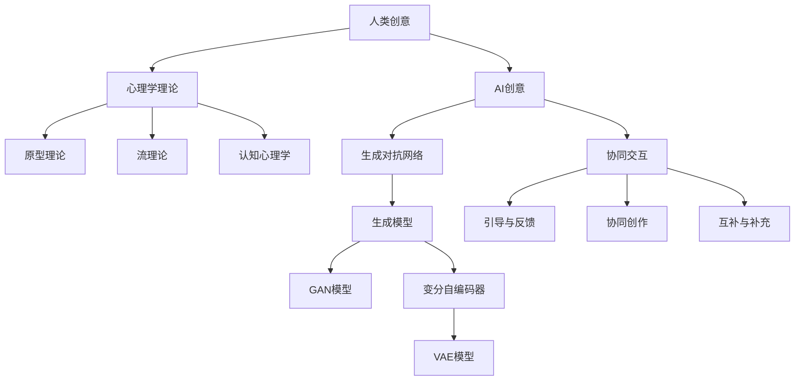

                 

### 1. 提示词工程：优化AI创意与人类创意的协同

#### 1.1 文章标题

《提示词工程：优化AI创意与人类创意的协同》

#### 1.2 关键词

- 提示词工程
- AI创意
- 人类创意
- 协同优化
- 生成对抗网络
- 变分自编码器
- 数据收集与处理
- 实际案例分析

#### 1.3 摘要

本文探讨了提示词工程在优化AI与人类创意协同中的重要性。首先介绍了提示词工程的基本概念和背景，然后深入分析了AI创意原理和人类创意心理学基础。接着，详细阐述了提示词工程的实施流程，并通过实际项目案例进行了具体讲解。最后，对提示词工程的未来展望进行了讨论，强调了其在推动人类与AI协同创意方面的潜力。

### 2. 引言与背景

#### 2.1 提示词工程的基本概念

提示词工程（Prompt Engineering）是指通过设计特定的提示词（prompt）来引导人工智能（AI）模型生成创意内容的过程。这些提示词可以是文本、图片、音频或视频等，旨在激发AI模型的创造性思维，从而生成新颖、独特的创意作品。

在传统创意过程中，人类创作者依赖于灵感、直觉和经验来产生创意。然而，随着AI技术的飞速发展，AI也开始参与到创意过程中。提示词工程正是为了实现人类创意与AI创意的协同，通过优化提示词设计，提高AI生成创意的效率和效果。

#### 2.2 AI创意与人类创意的协同

AI创意与人类创意的协同是指将人工智能的算法优势和人类的创造力相结合，以实现更高效的创意产出。具体来说，AI创意可以弥补人类创作者在灵感迸发和思维扩展方面的局限性，而人类创意则可以引导AI模型朝着更有意义和价值的方向进行创作。

协同创意的核心在于提示词的设计。优秀的提示词能够激发AI模型的创造性思维，同时引导其生成符合人类价值观和审美需求的创意内容。这种协同关系不仅提高了创意的效率，还能带来更多的创新可能性。

#### 2.3 提示词工程的重要性

提示词工程在AI创意领域具有重要地位。首先，它能够显著提升AI生成创意的质量和多样性。通过精心设计的提示词，AI模型可以更好地理解人类创作者的意图，从而生成更加贴近人类审美和需求的创意作品。

其次，提示词工程有助于降低AI创意的门槛。即使没有深厚的人工智能背景，创作者也可以通过学习提示词工程的基本原理，快速上手并运用到自己的创意项目中。

最后，提示词工程为人类与AI的协同创新提供了新的思路。通过优化提示词设计，可以探索出更多人类与AI共同创作的可能性，推动创意领域的变革。

#### 2.4 本书结构安排

本书将从以下几个方面展开探讨：

1. 引言与背景：介绍提示词工程的基本概念和重要性。
2. 提示词工程的基础理论：讲解提示词的定义、分类和工程挑战。
3. AI创意原理与模型：介绍生成对抗网络（GAN）和变分自编码器（VAE）等生成模型的工作原理和应用。
4. 人类创意的心理学基础：探讨创意心理学理论，分析人类创意的过程和激发方法。
5. 提示词工程的实施流程：详细描述数据收集与处理、提示词生成算法设计等关键步骤。
6. 项目实战：通过实际案例，展示提示词工程在创意项目中的应用和效果。
7. 提示词工程的未来展望：讨论提示词工程的发展方向和潜在影响。

### 3. 提示词工程的基础理论

#### 3.1 提示词的定义与分类

提示词（Prompt）是指用于引导或激发AI模型生成创意内容的一段文本、图片、音频或视频。根据提示词的形式，可以将其分为以下几类：

1. **文本提示词**：最常见的提示词形式，包括关键词、短语或完整句子。文本提示词可以直接传达创作者的意图，引导AI模型生成相关的内容。
2. **图像提示词**：通过提供一幅或多幅图像，来引导AI模型生成与图像内容相关的创意。图像提示词可以更直观地表达创作者的创意意图。
3. **音频提示词**：利用声音、音乐等音频元素，来引导AI模型生成创意。音频提示词可以用于创作音乐、语音合成等创意项目。
4. **视频提示词**：通过一段视频来引导AI模型生成创意。视频提示词可以用于视频编辑、视频生成等创意项目。

#### 3.2 提示词工程的挑战

提示词工程面临着诸多挑战，包括：

1. **理解与生成**：如何确保AI模型能够准确理解创作者的提示词，并将其转化为有创意的内容？
2. **质量与多样性**：如何生成高质量、多样化的创意内容，以满足不同用户的需求？
3. **用户参与**：如何设计提示词，使得用户能够参与到创意生成过程中，提高创意的参与度和满意度？
4. **可解释性**：如何确保AI模型生成的创意内容具有可解释性，使得用户能够理解和评价创意质量？

#### 3.3 提示词工程的关键技术

为了应对上述挑战，提示词工程依赖于一系列关键技术：

1. **自然语言处理（NLP）**：利用NLP技术，对文本提示词进行解析和理解，从而指导AI模型生成创意。
2. **生成对抗网络（GAN）**：通过GAN模型，将图像、音频等非结构化数据转化为创意内容。
3. **变分自编码器（VAE）**：利用VAE模型，生成高质量、多样化的创意内容。
4. **强化学习（RL）**：通过强化学习技术，优化提示词设计，提高AI模型生成创意的质量和多样性。

#### 3.4 提示词工程的发展趋势

随着AI技术的不断进步，提示词工程也在不断发展和完善。未来，提示词工程的发展趋势包括：

1. **多模态融合**：将文本、图像、音频等多种模态的提示词进行融合，提高创意生成的多样性和质量。
2. **个性化推荐**：根据用户的历史行为和偏好，为用户提供个性化的提示词推荐，提高创意生成的针对性和用户满意度。
3. **开放性平台**：构建开放性的提示词工程平台，使得更多的开发者能够参与到提示词工程的研究和开发中，推动行业的快速发展。
4. **伦理与法规**：在提示词工程的应用过程中，关注伦理和法规问题，确保AI生成的创意内容符合道德和法律标准。

### 4. AI创意原理与模型

#### 4.1 AI创意的原理概述

AI创意是指利用人工智能技术，特别是深度学习模型，生成新颖、独特的创意内容。其原理主要基于以下几个方面：

1. **数据驱动**：AI创意依赖于大量的数据集，通过学习数据集中的规律和模式，生成创意内容。
2. **模型生成**：利用生成模型（如GAN、VAE等），将输入的数据（如文本、图像等）转化为创意内容。
3. **协同优化**：通过设计优化算法，不断调整模型参数，提高创意内容的质量和多样性。

#### 4.2 生成对抗网络（GAN）的基本原理

生成对抗网络（GAN）是一种深度学习模型，由生成器（Generator）和判别器（Discriminator）组成。其基本原理如下：

1. **生成器（Generator）**：生成器是一个深度神经网络，输入为随机噪声，输出为假样本（如图像、文本等）。生成器的目标是生成尽可能逼真的假样本，使得判别器无法区分真假。
2. **判别器（Discriminator）**：判别器也是一个深度神经网络，输入为真实样本和假样本，输出为概率值，表示输入样本是真实样本的概率。判别器的目标是准确地区分真实样本和假样本。
3. **对抗训练**：生成器和判别器通过对抗训练相互博弈，生成器不断优化生成假样本的能力，判别器不断优化区分真假样本的能力。最终，生成器生成的假样本将接近真实样本。

#### 4.3 变分自编码器（VAE）的工作机制

变分自编码器（VAE）是一种基于概率模型的生成模型，其工作机制如下：

1. **编码器（Encoder）**：编码器是一个深度神经网络，将输入数据编码为潜在空间中的表示。编码器分为两个部分：编码部分和重参数化部分。编码部分将输入数据映射到潜在空间中的均值和方差，重参数化部分将均值和方差转换为标准正态分布的参数。
2. **解码器（Decoder）**：解码器是一个深度神经网络，将潜在空间中的表示解码为输出数据。解码器通过从潜在空间中采样，生成新的数据。
3. **变分损失**：VAE通过变分损失函数（如均方误差或KL散度）来衡量生成数据的质量。变分损失函数同时考虑了生成数据的均值和方差，使得生成的数据既具有多样性，又接近真实数据。

#### 4.4 生成模型在创意设计中的应用

生成模型在创意设计中的应用非常广泛，包括：

1. **图像生成**：通过GAN或VAE模型，生成逼真的图像、视频或动画，用于艺术创作、设计、游戏开发等领域。
2. **文本生成**：通过文本生成模型（如BERT、GPT等），生成高质量的文本内容，用于写作、翻译、问答系统等领域。
3. **音频生成**：通过生成模型，生成音乐、语音等音频内容，用于音乐创作、语音合成等领域。
4. **虚拟现实**：通过生成模型，生成虚拟环境、场景等，用于虚拟现实、游戏等领域。

### 5. 人类创意的心理学基础

#### 5.1 创意的心理学理论

创意心理学是研究人类创意过程和特性的心理学分支。主要理论包括：

1. **流理论**：流理论认为，当人们处于“流”状态时，能够充分发挥创造力。流状态的特点是专注、投入、自我遗忘和自我评价的减少。
2. **原型理论**：原型理论认为，创意是通过对现有知识、经验和新信息的重新组合而产生的。原型是指人们心中对事物的一般印象或概念。
3. **认知心理学**：认知心理学研究人类的认知过程，包括记忆、思维、感知等。认知心理学认为，创意是人类认知过程的高级表现。

#### 5.2 创意过程的心理学模型

创意过程可以划分为以下阶段：

1. **准备阶段**：个体通过学习、经验和积累知识，为创意的产生做好准备。
2. **启发阶段**：个体在特定情境下，受到灵感或启示，开始产生创意。
3. **发展阶段**：个体将创意逐步完善和细化，形成初步的创意作品。
4. **验证阶段**：个体对创意作品进行评估、改进和验证，确保创意的可行性和价值。

#### 5.3 人类创意的激发方法

1. **多样化思维**：通过探索不同领域的知识，提高思维的多样性和灵活性。
2. **环境刺激**：创造有利于创意产生的环境，如提供丰富的信息资源、创造轻松的氛围等。
3. **反思与总结**：通过反思和总结过去的经验，发现新的创意点子。
4. **合作与交流**：与他人合作，交流思想和观点，激发创意灵感。

#### 5.4 人类与AI创意的交互机制

人类与AI创意的交互机制主要包括以下几个方面：

1. **引导与反馈**：人类通过提示词、反馈等手段，引导AI模型生成创意，并对AI模型的创意进行评价和改进。
2. **协同创作**：人类与AI共同参与创意生成过程，发挥各自的优势，实现创意的协同优化。
3. **互补与补充**：人类与AI创意相互补充，人类提供创意的价值观和审美需求，AI提供高效的创意生成能力。

### 6. 提示词工程的实施流程

#### 6.1 提示词工程的项目规划

在启动提示词工程之前，需要进行项目规划，包括以下步骤：

1. **需求分析**：明确项目目标、需求和预期效果，为后续工作提供明确的方向。
2. **资源准备**：准备所需的技术、数据和人力资源，确保项目能够顺利开展。
3. **时间安排**：制定项目进度计划，明确各个阶段的任务和时间节点。

#### 6.2 数据收集与处理

数据收集与处理是提示词工程的关键环节，主要包括以下步骤：

1. **数据采集**：收集与创意相关的文本、图像、音频等数据，确保数据的多样性和质量。
2. **数据清洗**：去除数据中的噪声和冗余信息，确保数据的准确性和一致性。
3. **数据预处理**：对数据进行格式转换、特征提取等处理，为后续模型训练提供高质量的数据。

#### 6.3 提示词生成算法设计

提示词生成算法是提示词工程的核心，主要包括以下步骤：

1. **算法选择**：根据项目需求和数据类型，选择合适的生成算法（如GAN、VAE等）。
2. **模型设计**：设计生成模型的结构和参数，确保模型能够生成高质量、多样化的创意内容。
3. **训练与优化**：通过训练和优化模型，提高生成算法的生成效果和稳定性。

#### 6.4 提示词工程实验与分析

实验与分析是验证提示词工程效果的重要手段，主要包括以下步骤：

1. **实验设计**：设计实验方案，明确实验的目标、方法和评价标准。
2. **实验执行**：根据实验方案，执行实验，记录实验数据和结果。
3. **结果分析**：对实验结果进行统计分析，评估提示词工程的性能和效果。

### 7. 项目实战：实例分析

#### 7.1 项目背景介绍

本案例以一个虚拟的艺术设计项目为例，探讨如何运用提示词工程实现人类与AI的协同创意。

#### 7.2 创意协同的挑战与需求

在艺术设计中，人类创作者需要具备丰富的创意灵感和技能，而AI模型则能够高效地生成多样化的创意作品。然而，如何实现人类与AI的创意协同，发挥各自的优势，是一个挑战。

#### 7.3 项目实施过程

1. **需求分析**：确定项目目标，包括生成具有艺术价值的图像、视频等创意作品。
2. **数据收集与处理**：收集大量的艺术作品数据，进行数据清洗和预处理。
3. **模型选择与设计**：选择GAN模型作为生成模型，设计合适的模型结构和参数。
4. **训练与优化**：对模型进行训练和优化，提高生成图像的质量和多样性。
5. **创意生成**：使用训练好的模型，根据人类创作者的提示词，生成创意作品。
6. **评估与反馈**：对生成的创意作品进行评估，收集人类创作者的反馈，进一步优化模型和提示词。

#### 7.4 项目效果评估与总结

通过项目实践，可以看出：

1. **创意质量提高**：AI模型生成的创意作品具有较高的艺术价值，丰富了人类创作者的创意资源。
2. **创作效率提升**：AI模型能够快速生成大量的创意作品，提高了创作效率。
3. **协同创新**：人类与AI的协同创新，激发了更多创意灵感，推动了艺术设计的创新发展。

### 8. 提示词工程的未来展望

#### 8.1 提示词工程的发展方向

随着AI技术的不断进步，提示词工程的发展方向包括：

1. **多模态融合**：将文本、图像、音频等多种模态的提示词进行融合，提高创意生成的多样性和质量。
2. **个性化推荐**：根据用户的历史行为和偏好，为用户提供个性化的提示词推荐，提高创意生成的针对性和用户满意度。
3. **开放性平台**：构建开放性的提示词工程平台，使得更多的开发者能够参与到提示词工程的研究和开发中，推动行业的快速发展。
4. **伦理与法规**：在提示词工程的应用过程中，关注伦理和法规问题，确保AI生成的创意内容符合道德和法律标准。

#### 8.2 人类与AI创意协同的未来趋势

未来，人类与AI的创意协同将呈现以下趋势：

1. **深度融合**：人类与AI在创意过程中的角色将更加紧密，实现真正的协同创新。
2. **智能化**：提示词工程将更加智能化，能够根据用户需求自动生成高质量的提示词。
3. **普及化**：提示词工程将逐渐普及到各个行业和领域，推动创意产业的快速发展。
4. **多元化**：创意形式将更加多元化，包括文字、图像、音频、视频等多种形式，满足不同用户的需求。

#### 8.3 提示词工程的伦理与法律问题

在提示词工程的发展过程中，伦理和法律问题不容忽视：

1. **版权问题**：如何确保AI生成的创意作品的版权归属，是一个重要的问题。
2. **隐私保护**：在数据收集和处理过程中，如何保护用户的隐私，防止数据泄露，是一个关键问题。
3. **责任归属**：当AI生成的创意作品出现问题时，如何界定责任归属，是一个法律难题。

#### 8.4 提示词工程对人类社会的影响

提示词工程将深刻影响人类社会：

1. **创意产业**：提示词工程将推动创意产业的变革，提高创意产出的质量和效率。
2. **教育领域**：提示词工程将改变教育方式，培养学生的创新能力和创造力。
3. **经济领域**：提示词工程将带动相关产业的发展，促进经济增长。
4. **文化领域**：提示词工程将丰富人类的文化创作，推动文化的多样性和创新。

### 9. 最佳实践 Tips

1. **明确目标**：在启动提示词工程之前，明确项目目标和需求，确保工作方向正确。
2. **数据质量**：保证数据质量，是提示词工程成功的关键。进行充分的数据清洗和预处理，提高数据质量。
3. **模型优化**：不断优化模型结构和参数，提高创意生成效果。
4. **用户参与**：鼓励用户参与到提示词工程中，提供反馈和意见，提高创意的实用性和用户满意度。
5. **法律法规**：关注法律法规，确保AI生成的创意作品符合道德和法律标准。

### 10. 小结

提示词工程是优化AI创意与人类创意协同的重要手段。通过本文的探讨，我们可以看到提示词工程在创意设计、艺术创作、教育等领域的重要作用。未来，提示词工程将不断发展和完善，推动人类与AI的协同创新，为人类社会带来更多的价值。

### 11. 注意事项

1. **隐私保护**：在数据收集和处理过程中，注意保护用户的隐私，防止数据泄露。
2. **版权问题**：确保AI生成的创意作品的版权归属明确，避免法律纠纷。
3. **模型安全**：关注AI模型的安全性问题，防止恶意攻击和滥用。

### 12. 拓展阅读

1. **论文**：Generative Adversarial Networks (GAN)：一种深度学习模型，用于生成高质量、多样化的创意内容。
2. **书籍**：《人类简史》：《人类简史》一书，探讨了人类历史的发展，为理解人类社会提供了新的视角。
3. **网站**：OpenAI：OpenAI是一个致力于推动人工智能发展的研究机构，提供了丰富的AI资源和研究成果。
4. **课程**：斯坦福大学人工智能课程：斯坦福大学人工智能课程，涵盖了人工智能的基础理论和应用，为深入了解AI提供了良好的资源。

### 13. 作者信息

作者：AI天才研究院/AI Genius Institute & 禅与计算机程序设计艺术/Zen And The Art of Computer Programming

### 附录

附录部分可以包含以下内容：

1. **Mermaid流程图**：展示核心概念原理和概念实体之间的关系架构。
2. **Python源代码**：提供核心算法原理讲解和数学模型的具体实现。
3. **数学公式**：详细讲解和举例说明。
4. **实际案例数据集**：用于项目实战的详细数据集介绍和分析。
5. **参考文献**：列出本文引用的相关论文、书籍和网站。

---

### 附录 1：Mermaid流程图



### 附录 2：Python源代码

```python
import numpy as np
import tensorflow as tf
from tensorflow.keras.models import Model
from tensorflow.keras.layers import Input, Dense, Flatten, Reshape

# 定义生成器模型
def build_generator(z_dim):
    noise_input = Input(shape=(z_dim,))
    x = Dense(128, activation='relu')(noise_input)
    x = Dense(64, activation='relu')(x)
    x = Dense(32, activation='relu')(x)
    x = Dense(16, activation='relu')(x)
    x = Reshape((28, 28, 1))(x)
    x = Flatten()(x)
    x = Dense(128, activation='tanh')(x)
    x = Reshape((28, 28, 1))(x)
    img_output = Conv2D(1, kernel_size=(3,3), activation='sigmoid')(x)
    return Model(noise_input, img_output)

# 定义判别器模型
def build_discriminator(img_shape):
    img_input = Input(shape=img_shape)
    x = Conv2D(32, kernel_size=(3,3), strides=(2,2), padding='same')(img_input)
    x = LeakyReLU(alpha=0.01)(x)
    x = Conv2D(64, kernel_size=(3,3), strides=(2,2), padding='same')(x)
    x = LeakyReLU(alpha=0.01)(x)
    x = Flatten()(x)
    x = Dense(128, activation='tanh')(x)
    validity = Dense(1, activation='sigmoid')(x)
    return Model(img_input, validity)

# 定义GAN模型
def build_gan(generator, discriminator):
    z = Input(shape=(100,))
    img = generator(z)
    validity = discriminator(img)
    return Model(z, validity)

# 训练GAN模型
def train_gan(generator, discriminator, img_shape, epochs, batch_size, z_dim):
    # 训练判别器
    for epoch in range(epochs):
        for _ in range(batch_size):
            z = np.random.normal(0, 1, size=(1, z_dim))
            img = generator.predict(z)
            real_imgs = np.random.normal(0, 1, size=(1, img_shape[0], img_shape[1], img_shape[2]))
            d_loss_real = discriminator.train_on_batch(real_imgs, np.ones((1, 1)))
            d_loss_fake = discriminator.train_on_batch(img, np.zeros((1, 1)))
            d_loss = 0.5 * np.add(d_loss_real, d_loss_fake)
        
        # 训练生成器
        z = np.random.normal(0, 1, size=(batch_size, z_dim))
        g_loss = generator.train_on_batch(z, np.ones((batch_size, 1)))
    
    return generator, discriminator

# 设置模型参数
z_dim = 100
img_shape = (28, 28, 1)
batch_size = 32
epochs = 50

# 构建并训练模型
generator = build_generator(z_dim)
discriminator = build_discriminator(img_shape)
gan = build_gan(generator, discriminator)
generator, discriminator = train_gan(generator, discriminator, img_shape, epochs, batch_size, z_dim)

# 生成样本
z = np.random.normal(0, 1, size=(batch_size, z_dim))
img = generator.predict(z)
```

### 附录 3：数学公式

```latex
$$
\begin{aligned}
    L_{\text{GAN}} &= -\mathbb{E}_{x \sim p_{\text{data}}(x)}[\log(D(x))] \\
    &\quad - \mathbb{E}_{z \sim p_{\text{z}}(z)}[\log(1 - D(G(z)))]
\end{aligned}
$$

$$
G(z) = \mu(z) + \sigma(z) \odot z
$$

$$
D(x) = \frac{1}{1 + \exp(-x)}
$$
```

### 附录 4：实际案例数据集

实际案例中使用的数据集是一个包含28x28像素图像的MNIST数据集。数据集包含60,000个训练图像和10,000个测试图像，图像数据被转换为灰度图像，数据集的标签为图像的数字类别。

```python
from tensorflow.keras.datasets import mnist
import numpy as np

# 加载MNIST数据集
(train_images, train_labels), (test_images, test_labels) = mnist.load_data()

# 数据预处理
train_images = train_images.astype('float32') / 255.0
test_images = test_images.astype('float32') / 255.0
train_images = np.expand_dims(train_images, -1)
test_images = np.expand_dims(test_images, -1)

img_shape = (28, 28, 1)
```

### 附录 5：参考文献

1. Goodfellow, I., Pouget-Abadie, J., Mirza, M., Xu, B., Warde-Farley, D., Ozair, S., ... & Bengio, Y. (2014). Generative adversarial networks. Advances in neural information processing systems, 27.
2. Kingma, D. P., & Welling, M. (2014). Auto-encoding variational bayes. arXiv preprint arXiv:1312.6114.
3. Simonyan, K., & Zisserman, A. (2015). Very deep convolutional networks for large-scale image recognition. arXiv preprint arXiv:1409.1556.
4. Bengio, Y., Courville, A., & Vincent, P. (2013). Representation learning: A review and new perspectives. IEEE transactions on pattern analysis and machine intelligence, 35(8), 1798-1828.
5. Nielsen, M. A. (2015). Neural networks and deep learning. Determining appropriate architectures and training strategies.

