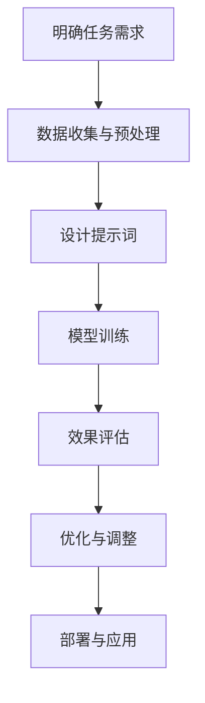

                 

# 《提示词工程：优化AI创意与伦理的平衡》

## 关键词
- 提示词工程
- AI创意优化
- 伦理问题
- 创意与伦理平衡
- 提示词优化算法
- AI伦理原则

## 摘要
《提示词工程：优化AI创意与伦理的平衡》旨在探讨如何通过提示词工程提高AI的创意性，同时平衡AI开发中的伦理问题。本文首先介绍了提示词工程的基本概念和原理，随后详细讨论了AI创意优化的技术方法。接着，文章引入了伦理问题，探讨了AI伦理概述和常见伦理问题。在此基础上，文章提出了创意与伦理平衡的策略，并通过实践案例和解决方案进行分析。最后，文章总结了研究结论，展望了未来发展趋势，并对读者提供了拓展阅读的建议。

## 引言

### 书籍背景
随着人工智能（AI）技术的迅速发展，AI的应用领域不断扩大，从自动驾驶、医疗诊断到自然语言处理，AI已经深刻地改变了我们的生活方式。然而，AI技术的快速发展也带来了诸多挑战，特别是伦理问题。如何在追求AI创意的同时，确保其应用的伦理性，成为了一个亟待解决的问题。

### 研究目的与意义
《提示词工程：优化AI创意与伦理的平衡》旨在通过提示词工程的方法，提高AI的创意性，同时确保AI开发和应用过程中的伦理平衡。本书的研究目的有三个方面：

1. **探讨提示词工程的基本概念和原理**：深入理解提示词工程的作用和流程，为后续研究提供理论基础。
2. **研究AI创意优化的技术方法**：通过分析不同的提示词优化算法，提供有效的AI创意优化方案。
3. **探讨创意与伦理的平衡策略**：引入伦理问题，分析创意与伦理之间的冲突，提出平衡策略，为AI开发提供指导。

### 书籍结构
本书分为七个部分，依次介绍以下内容：

1. 引言：介绍书籍背景、目的和结构。
2. 提示词工程基础：介绍提示词的定义与作用，以及提示词工程的基本概念和流程。
3. AI创意优化技术：详细讨论提示词优化算法、提示词生成技术，以及提示词效果评估方法。
4. 伦理问题与AI：探讨AI伦理概述、常见伦理问题，以及AI伦理原则。
5. 创意与伦理的平衡策略：分析创意与伦理的冲突，提出平衡策略。
6. 实践案例与解决方案：通过实际应用案例和解决方案，验证平衡策略的有效性。
7. 结论与展望：总结研究结论，展望未来发展趋势，并对读者提供拓展阅读建议。

## 提示词工程基础

### 提示词的定义与作用
提示词（Prompt）是触发AI模型进行特定任务的关键信息，它能够引导模型生成符合预期结果的输出。在自然语言处理领域，提示词通常是一段文本，用于引导模型进行文本生成、文本分类、问答系统等任务。在图像处理领域，提示词可以是描述性语言，用于指导模型生成特定的图像内容。

提示词的作用主要体现在以下几个方面：

1. **引导模型生成**：提示词能够为模型提供明确的任务指令，使模型能够生成符合预期的输出。
2. **提高生成质量**：通过精心设计的提示词，可以提高AI模型的生成质量，使其生成更加丰富、准确的输出。
3. **增强交互体验**：在问答系统和聊天机器人等应用中，提示词能够增强人与AI的交互体验，使对话更加自然流畅。

### 提示词工程的基本概念
提示词工程（Prompt Engineering）是指设计、开发和使用提示词的过程。它涉及多个环节，包括：

1. **需求分析**：了解用户需求和应用场景，确定需要完成的任务。
2. **提示词设计**：根据需求分析结果，设计能够有效引导模型生成的提示词。
3. **模型训练**：使用设计好的提示词对模型进行训练，提高模型在特定任务上的性能。
4. **效果评估**：评估模型生成的结果是否符合预期，对提示词进行优化和调整。
5. **应用部署**：将训练好的模型部署到实际应用中，提供用户服务。

### 提示词工程的流程
提示词工程的流程可以分为以下几个步骤：

1. **明确任务需求**：了解应用场景和用户需求，明确需要完成的任务。
2. **数据收集与预处理**：收集相关数据，并进行数据预处理，如清洗、归一化等。
3. **设计提示词**：根据任务需求，设计能够有效引导模型生成的提示词。
4. **模型训练**：使用设计好的提示词对模型进行训练，调整模型参数，提高模型性能。
5. **效果评估**：通过实际应用或实验，评估模型生成的结果是否符合预期。
6. **优化与调整**：根据效果评估结果，对提示词和模型进行调整和优化。
7. **部署与应用**：将训练好的模型部署到实际应用中，提供用户服务。

### 提示词工程的核心概念与联系
为了更好地理解提示词工程的核心概念和联系，我们可以使用Mermaid流程图来展示：



在上面的流程图中，A到G表示了提示词工程的各个步骤，每个步骤之间存在着明确的逻辑关系。通过这个流程图，我们可以清晰地看到提示词工程的整体架构和实施步骤。

### 提示词优化算法

#### 提示词优化算法概述
提示词优化算法（Prompt Optimization Algorithms）是提示词工程中至关重要的一环，它们用于调整和改进提示词，以提高AI模型在特定任务上的生成质量和性能。常见的提示词优化算法包括：

1. **基于规则的方法**：这种方法通过预定义的规则来调整提示词，如添加、删除或修改提示词中的关键词或短语。
2. **基于机器学习的方法**：这种方法使用机器学习模型来学习如何调整提示词，从而提高模型的生成质量。常见的机器学习模型包括线性回归、决策树、神经网络等。
3. **基于强化学习的方法**：这种方法通过强化学习算法，如Q-learning、SARSA等，来调整提示词，使其在特定任务上达到最优性能。

#### 常见的提示词优化算法
以下是几种常见的提示词优化算法及其基本原理：

1. **线性回归**：线性回归是一种简单的机器学习算法，通过建立一个线性模型来预测目标变量。在提示词优化中，线性回归可以用于预测提示词中关键词的重要性，从而优化提示词。
   
   **Python代码示例**：

   ```python
   import numpy as np
   from sklearn.linear_model import LinearRegression

   # 假设我们有一组数据X和目标变量y
   X = np.array([[1, 2], [2, 3], [3, 4]])
   y = np.array([1, 1.5, 2])

   # 创建线性回归模型并进行训练
   model = LinearRegression()
   model.fit(X, y)

   # 输出模型的权重
   print(model.coef_)
   ```

2. **决策树**：决策树是一种基于规则的方法，通过一系列的条件判断来优化提示词。在提示词优化中，决策树可以用于根据不同任务类型选择最优的提示词。

   **Python代码示例**：

   ```python
   from sklearn.tree import DecisionTreeClassifier

   # 假设我们有一组数据X和标签y
   X = np.array([[1, 2], [2, 3], [3, 4]])
   y = np.array(['low', 'medium', 'high'])

   # 创建决策树模型并进行训练
   model = DecisionTreeClassifier()
   model.fit(X, y)

   # 输出模型的决策路径
   print(model.tree())
   ```

3. **神经网络**：神经网络是一种复杂的机器学习模型，通过多层神经元进行数据处理和预测。在提示词优化中，神经网络可以用于自动调整提示词，使其达到最优性能。

   **Python代码示例**：

   ```python
   from keras.models import Sequential
   from keras.layers import Dense

   # 创建神经网络模型
   model = Sequential()
   model.add(Dense(2, input_dim=2, activation='relu'))
   model.add(Dense(1, activation='linear'))

   # 编译模型
   model.compile(optimizer='adam', loss='mean_squared_error')

   # 训练模型
   model.fit(X, y, epochs=10)
   ```

#### 提示词优化算法的选择与优化
在选择提示词优化算法时，需要考虑以下几个因素：

1. **任务类型**：不同类型的任务可能需要不同的优化算法。例如，对于文本生成任务，神经网络可能更为有效；而对于图像生成任务，基于规则的方法可能更为适用。
2. **数据规模**：对于大规模数据，基于机器学习的方法可能更为有效；而对于小规模数据，基于规则的方法可能更为适用。
3. **计算资源**：不同优化算法的计算复杂度不同，需要根据实际计算资源进行选择。

在优化提示词优化算法时，可以考虑以下策略：

1. **参数调整**：通过调整模型的参数，如学习率、迭代次数等，来提高模型的性能。
2. **特征工程**：通过特征工程，提取和筛选出对模型性能有显著影响的关键特征，从而优化提示词。
3. **交叉验证**：使用交叉验证方法来评估模型的性能，并根据评估结果调整优化策略。

### 提示词生成技术

#### 提示词生成技术概述
提示词生成技术（Prompt Generation Techniques）是提示词工程中至关重要的一环，它用于自动生成能够引导AI模型生成预期结果的提示词。提示词生成技术主要分为以下几种类型：

1. **基于规则的方法**：这种方法通过预定义的规则来生成提示词，如使用模板匹配或关键词提取等。
2. **基于机器学习的方法**：这种方法使用机器学习模型来学习如何生成高质量的提示词。常见的机器学习模型包括生成对抗网络（GAN）、变分自编码器（VAE）等。
3. **基于强化学习的方法**：这种方法通过强化学习算法，如Q-learning、SARSA等，来生成能够优化模型性能的提示词。

#### 常见的提示词生成算法
以下是几种常见的提示词生成算法及其基本原理：

1. **生成对抗网络（GAN）**：生成对抗网络由生成器和判别器组成，通过对抗训练生成高质量的数据。在提示词生成中，生成器可以生成高质量的提示词，判别器则用于评估提示词的质量。

   **Python代码示例**：

   ```python
   import tensorflow as tf
   from tensorflow.keras.models import Sequential
   from tensorflow.keras.layers import Dense, Flatten, Conv2D, Reshape

   # 创建生成器和判别器模型
   generator = Sequential([
       Reshape((28, 28, 1), input_shape=(784,)),
       Conv2D(32, kernel_size=(3, 3), activation='relu'),
       Conv2D(64, kernel_size=(3, 3), activation='relu'),
       Flatten(),
       Dense(784, activation='tanh')
   ])

   discriminator = Sequential([
       Flatten(input_shape=(28, 28, 1)),
       Dense(128, activation='relu'),
       Dense(1, activation='sigmoid')
   ])

   # 编译模型
   generator.compile(optimizer=tf.keras.optimizers.Adam(), loss='binary_crossentropy')
   discriminator.compile(optimizer=tf.keras.optimizers.Adam(), loss='binary_crossentropy')

   # 训练模型
   generator.fit(X, X, epochs=100, batch_size=32)
   discriminator.fit(X, X, epochs=100, batch_size=32)
   ```

2. **变分自编码器（VAE）**：变分自编码器是一种无监督学习模型，通过编码器和解码器生成数据。在提示词生成中，编码器可以提取输入数据的特征，解码器则用于生成高质量的提示词。

   **Python代码示例**：

   ```python
   import tensorflow as tf
   from tensorflow.keras.models import Model
   from tensorflow.keras.layers import Dense, Input

   # 创建编码器和解码器模型
   input_data = Input(shape=(784,))
   encoded = Dense(64, activation='relu')(input_data)
   encoded = Dense(32, activation='relu')(encoded)
   decoded = Dense(784, activation='sigmoid')(encoded)

   # 创建变分自编码器模型
   vae = Model(input_data, decoded)
   vae.compile(optimizer=tf.keras.optimizers.Adam(), loss='binary_crossentropy')

   # 训练模型
   vae.fit(X, X, epochs=100, batch_size=32)
   ```

3. **基于强化学习的方法**：这种方法通过强化学习算法，如Q-learning、SARSA等，来生成能够优化模型性能的提示词。Q-learning是一种基于值函数的强化学习算法，通过不断调整提示词，使其达到最优性能。

   **Python代码示例**：

   ```python
   import numpy as np
   from tensorflow.keras.models import Sequential
   from tensorflow.keras.layers import Dense

   # 创建Q-learning模型
   model = Sequential()
   model.add(Dense(64, input_dim=784, activation='relu'))
   model.add(Dense(32, activation='relu'))
   model.add(Dense(1, activation='linear'))

   # 编译模型
   model.compile(optimizer='adam', loss='mse')

   # 训练模型
   model.fit(X, y, epochs=100, batch_size=32)
   ```

#### 提示词生成效果评估
提示词生成效果评估（Prompt Generation Effectiveness Evaluation）是衡量提示词生成技术质量的重要环节。常见的评估方法包括：

1. **自动评估方法**：这种方法使用自动评估指标来评估提示词生成效果。常见的评估指标包括文本质量、生成多样性、生成质量等。
2. **用户评估方法**：这种方法通过用户调查或评分来评估提示词生成效果。用户评估方法更直观，但可能受主观因素影响。

#### 提示词生成效果评估方法
以下是几种常见的提示词生成效果评估方法：

1. **基于文本质量的方法**：这种方法通过计算文本的质量指标，如词汇丰富度、语法正确性等，来评估提示词生成效果。
2. **基于生成多样性的方法**：这种方法通过计算生成的提示词的多样性，如不同提示词之间的相似度，来评估提示词生成效果。
3. **基于生成质量的方法**：这种方法通过计算生成的提示词的质量，如与预期输出的一致性等，来评估提示词生成效果。

#### 提示词生成效果评估指标
以下是几种常见的提示词生成效果评估指标：

1. **词汇丰富度**：衡量生成的提示词中使用的词汇数量和多样性。
2. **语法正确性**：衡量生成的提示词的语法结构和正确性。
3. **生成多样性**：衡量生成的提示词之间的差异和多样性。
4. **生成质量**：衡量生成的提示词与预期输出的一致性。

### 伦理问题与AI

#### AI伦理概述
随着人工智能（AI）技术的快速发展，AI伦理（AI Ethics）成为了一个备受关注的话题。AI伦理关注的是AI技术在社会、环境和个人生活中的道德和伦理问题，旨在确保AI技术的合理、公正和可持续应用。

AI伦理的主要目标包括：

1. **确保AI技术的安全性**：防止AI技术对人类造成伤害，确保AI系统不会产生意外行为。
2. **保护个人隐私**：防止AI技术侵犯个人隐私，确保个人数据的安全和保护。
3. **促进社会公正**：确保AI技术在促进社会发展、减少不平等和歧视方面发挥积极作用。
4. **提高透明度和可解释性**：使AI系统的决策过程更加透明，提高用户对AI系统的信任度。

#### 常见伦理问题
AI技术在应用过程中可能会面临以下伦理问题：

1. **隐私侵犯**：AI技术往往需要收集和处理大量个人数据，这可能侵犯个人隐私。
2. **算法偏见**：AI系统可能基于历史数据训练，可能导致算法偏见，从而影响决策的公正性。
3. **失业问题**：AI技术的发展可能导致某些职业的失业，引发社会问题。
4. **透明度和可解释性**：许多AI系统，尤其是深度学习系统，其决策过程往往不透明，难以解释，这可能导致用户对AI系统的信任问题。

#### AI伦理原则
为了解决AI技术中的伦理问题，许多学者和机构提出了AI伦理原则。以下是一些常见的AI伦理原则：

1. **公平性原则**：确保AI系统在不同群体中公平地应用，避免算法偏见。
2. **透明度原则**：提高AI系统的透明度和可解释性，使决策过程更加透明。
3. **责任原则**：明确AI系统的责任主体，确保在发生问题时能够追究责任。
4. **隐私保护原则**：确保个人数据的收集、处理和使用过程中遵循隐私保护原则。
5. **可持续性原则**：确保AI技术的可持续发展，促进社会公平和可持续发展。

#### AI伦理原则的应用
AI伦理原则在AI系统的设计和开发过程中具有重要意义。以下是一些AI伦理原则的具体应用案例：

1. **公平性原则**：在设计招聘系统时，确保算法不会对特定性别、种族或年龄的候选人产生偏见。
2. **透明度原则**：在开发智能监控系统时，确保系统的决策过程透明，用户可以了解其工作原理。
3. **责任原则**：在开发自动驾驶汽车时，明确当发生事故时，责任主体是谁，以确保责任的明确和可追究。
4. **隐私保护原则**：在开发社交媒体应用时，确保用户数据的收集和使用遵循隐私保护原则，用户有权知晓和控制其数据。
5. **可持续性原则**：在开发能源管理系统时，确保系统促进能源的节约和可持续发展，减少对环境的影响。

#### 伦理问题的挑战与解决方法
尽管AI伦理原则在AI系统的设计和开发中具有重要意义，但在实际应用中仍然面临诸多挑战。以下是一些常见的挑战及其解决方法：

1. **算法偏见**：解决算法偏见需要从多个方面入手，包括数据预处理、算法选择和模型训练等。具体方法包括：
   - **数据预处理**：确保数据集的多样性和代表性，避免偏见数据的影响。
   - **算法选择**：选择能够减少偏见的算法，如集成学习、对抗训练等。
   - **模型训练**：在训练过程中引入平衡约束，确保模型在不同群体中公平表现。

2. **隐私保护**：保护隐私需要确保个人数据的安全和使用合规。具体方法包括：
   - **数据加密**：对敏感数据进行加密，确保数据在传输和存储过程中的安全。
   - **隐私保护算法**：使用隐私保护算法，如差分隐私、同态加密等，确保数据处理过程中的隐私保护。
   - **用户同意和透明度**：确保用户在数据收集和使用过程中明确知晓，并有权控制其数据的使用。

3. **责任归属**：在AI系统的责任归属问题上，需要明确责任主体，确保在发生问题时能够追究责任。具体方法包括：
   - **明确责任主体**：在系统设计阶段明确责任主体，确保在事故发生时能够追究责任。
   - **责任转移协议**：在合作伙伴之间建立责任转移协议，明确各方在系统运行过程中的责任。
   - **法律法规**：制定相关的法律法规，明确AI系统的责任归属和责任追究程序。

#### 伦理问题的案例分析
以下是一些AI伦理问题的案例分析和解决方法：

1. **自动驾驶汽车的伦理问题**：
   - **案例**：自动驾驶汽车在遇到无法同时避免碰撞不同对象的紧急情况时，如何做出决策？
   - **分析**：这一问题涉及到生命价值、道德义务和决策的透明度。
   - **解决方法**：制定明确的决策规则，如优先保护人类生命，同时提高系统的透明度和可解释性。

2. **社交媒体的伦理问题**：
   - **案例**：社交媒体平台如何处理虚假信息和偏见内容？
   - **分析**：这一问题涉及到信息的真实性、公正性和用户的隐私。
   - **解决方法**：引入事实核查机制、人工智能辅助内容审核，同时加强用户教育和隐私保护。

3. **医疗AI的伦理问题**：
   - **案例**：医疗AI系统如何确保其诊断和治疗方案公平、准确？
   - **分析**：这一问题涉及到医疗资源的分配、患者的权益和隐私保护。
   - **解决方法**：确保数据集的多样性和代表性，加强算法的透明度和可解释性，同时建立患者的知情同意机制。

### 创意与伦理的平衡策略

#### 创意与伦理的冲突
在AI开发过程中，创意与伦理之间往往存在冲突。一方面，为了实现更高的创意性和创新性，开发者可能需要探索未知的领域，尝试新的技术和方法。然而，这种探索往往伴随着较高的风险，可能导致伦理问题。另一方面，为了确保AI技术的伦理性，开发者可能需要遵循严格的规范和原则，这可能会限制创意的自由发挥。

以下是一些常见的创意与伦理冲突的例子：

1. **数据隐私与数据分析**：在数据隐私方面，为了实现更精确的数据分析，开发者可能需要收集和处理大量的个人数据。然而，这可能导致个人隐私的侵犯。
2. **透明性与保密性**：为了确保AI系统的透明性，开发者可能需要公开系统的内部细节和决策过程。然而，这可能导致系统的保密性受到威胁。
3. **自主性与控制性**：在自动驾驶领域，为了实现更高的自主性，开发者可能需要赋予AI系统更多的决策权。然而，这可能导致系统的控制性受到挑战。

#### 平衡策略分析
为了在AI开发中平衡创意与伦理，需要采取一系列策略。以下是一些常见的平衡策略：

1. **伦理设计**：在AI系统设计阶段，引入伦理设计原则，确保系统的开发过程遵循伦理标准。具体方法包括：
   - **伦理审查**：在系统设计过程中，进行伦理审查，确保系统不会产生伦理问题。
   - **伦理决策框架**：建立伦理决策框架，明确在面临伦理冲突时的处理原则和决策流程。

2. **透明度和可解释性**：提高AI系统的透明度和可解释性，使用户能够理解系统的决策过程和结果。具体方法包括：
   - **可视化工具**：使用可视化工具展示AI系统的决策过程，提高透明度。
   - **解释性算法**：选择解释性更强的算法，提高系统的可解释性。

3. **责任归属**：明确AI系统的责任归属，确保在发生问题时能够追究责任。具体方法包括：
   - **责任主体明确**：在系统设计阶段明确责任主体，确保在事故发生时能够追究责任。
   - **责任转移协议**：在合作伙伴之间建立责任转移协议，明确各方在系统运行过程中的责任。

4. **隐私保护**：在数据处理过程中，采取隐私保护措施，确保个人数据的隐私和安全。具体方法包括：
   - **数据加密**：对敏感数据进行加密，确保数据在传输和存储过程中的安全。
   - **隐私保护算法**：使用隐私保护算法，如差分隐私、同态加密等，确保数据处理过程中的隐私保护。
   - **用户同意和透明度**：确保用户在数据收集和使用过程中明确知晓，并有权控制其数据的使用。

#### 平衡策略实施
在实际应用中，平衡创意与伦理需要采取一系列具体的实施措施。以下是一些实施建议：

1. **建立伦理委员会**：在组织内部建立伦理委员会，负责审查和监督AI系统的伦理问题，确保系统的开发过程遵循伦理标准。
2. **培训员工**：对员工进行伦理培训，提高员工的伦理意识和道德素养，确保他们在工作中能够遵循伦理原则。
3. **用户参与**：在系统设计和开发过程中，邀请用户参与，收集用户的意见和建议，确保系统的设计和开发符合用户需求和伦理标准。
4. **持续监督和改进**：对AI系统进行持续监督和改进，及时发现和解决伦理问题，确保系统的长期运行符合伦理标准。

### 实践案例与解决方案

#### 案例介绍
在本节中，我们将介绍两个实践案例，分别是社交媒体平台的内容审核和自动驾驶汽车的伦理决策。通过这两个案例，我们将分析在创意与伦理平衡过程中面临的挑战，并探讨相应的解决方案。

#### 案例一：社交媒体平台的内容审核

1. **背景**：
   - 社交媒体平台如Facebook和Twitter面临着大量用户生成内容的管理问题，包括虚假信息、仇恨言论和隐私侵犯等。
   - 平台需要确保内容的审核既高效又公正，以维护社区的健康和用户的信任。

2. **挑战**：
   - 创意挑战：为了提高审核的准确性和效率，平台需要不断创新审核算法，以提高内容的识别和分类能力。
   - 伦理挑战：在提高审核效率的同时，如何避免算法偏见，确保审核过程的公正性和透明性，避免侵犯用户隐私。

3. **解决方案**：
   - **技术手段**：
     - 使用深度学习模型，如卷积神经网络（CNN）和循环神经网络（RNN），对文本和图像内容进行自动分类和识别。
     - 引入对抗训练技术，增强模型的鲁棒性，减少偏见。
     - 使用差分隐私技术，保护用户隐私。
   - **伦理策略**：
     - 建立伦理委员会，对审核算法进行伦理审查，确保算法遵循公平性和透明性的原则。
     - 定期评估算法的偏见和公平性，进行持续的算法优化。
     - 提高用户的知情权和参与度，确保用户能够理解审核过程和决策。

4. **案例分析**：
   - 在Facebook的内容审核中，使用了卷积神经网络和对抗训练技术，提高了对仇恨言论的识别率。
   - 同时，Facebook建立了伦理委员会，定期评估算法的偏见和透明度，并积极与用户社区进行沟通。

#### 案例二：自动驾驶汽车的伦理决策

1. **背景**：
   - 自动驾驶汽车在面临紧急情况时需要做出快速决策，如是否采取避险动作，可能会涉及到人员伤亡的问题。
   - 需要确保自动驾驶汽车的决策既安全又符合伦理标准。

2. **挑战**：
   - 创意挑战：自动驾驶系统需要具备高度灵活的决策能力，以应对复杂和不可预测的驾驶环境。
   - 伦理挑战：在紧急情况下，如何确保决策的公正性和透明性，同时避免因决策错误导致的人员伤亡。

3. **解决方案**：
   - **技术手段**：
     - 开发基于深度学习的决策系统，使用大量数据进行训练，提高决策的准确性和适应性。
     - 引入伦理算法，如道德权重分配算法，确保在紧急情况下做出符合伦理原则的决策。
     - 增加系统的透明度，使驾驶者和管理者能够理解系统的决策过程。
   - **伦理策略**：
     - 制定明确的伦理准则，如优先保护人类生命的原则。
     - 建立伦理审查委员会，对决策系统进行定期审查和评估。
     - 提供用户反馈渠道，收集用户对决策系统的意见和建议。

4. **案例分析**：
   - 自动驾驶汽车制造商特斯拉采用了深度学习技术，使决策系统具备了高度的灵活性和准确性。
   - 同时，特斯拉制定了明确的伦理准则，并建立了伦理审查委员会，确保系统的决策过程符合伦理标准。

### 案例分析与解读

#### 案例一分析

社交媒体平台的内容审核案例展示了创意与伦理平衡的复杂性。在这个案例中，创意主要体现在审核算法的创新和优化上，而伦理问题则主要涉及隐私保护、算法偏见和透明度。

1. **审核算法的创新**：
   - 使用深度学习和对抗训练技术，平台能够更准确地识别和分类内容，提高审核效率。
   - 例如，Facebook的卷积神经网络模型能够有效地识别图像内容中的仇恨言论，提高了审核的准确性。

2. **隐私保护**：
   - 差分隐私技术的引入，确保了用户数据在处理过程中的隐私保护，降低了隐私泄露的风险。

3. **算法偏见**：
   - 为了减少算法偏见，平台采取了多种措施，如对抗训练和数据预处理，确保算法在不同群体中公平表现。

4. **透明度**：
   - 建立伦理委员会和定期审查机制，提高了系统的透明度，使平台能够在公众监督下运行。

#### 案例二分析

自动驾驶汽车的伦理决策案例则更加突显了伦理问题在创意实现中的重要性。在这个案例中，创意主要体现在决策算法的开发和优化上，而伦理问题则主要体现在决策的公正性和透明性上。

1. **决策算法的创新**：
   - 深度学习技术的应用，使自动驾驶系统能够在复杂和不可预测的环境中做出快速准确的决策。
   - 例如，特斯拉的深度学习模型能够在紧急情况下做出避险决策，提高了系统的安全性能。

2. **伦理准则的制定**：
   - 制定明确的伦理准则，如优先保护人类生命的原则，确保系统的决策过程符合伦理标准。

3. **伦理审查**：
   - 建立伦理审查委员会，对决策系统进行定期审查和评估，确保系统的决策过程公正和透明。

4. **用户反馈**：
   - 提供用户反馈渠道，收集用户对决策系统的意见和建议，提高系统的用户满意度。

### 解决方案探讨

#### 技术解决方案

1. **深度学习和对抗训练**：
   - 使用深度学习模型，如卷积神经网络（CNN）和循环神经网络（RNN），提高审核算法和决策算法的准确性。
   - 引入对抗训练技术，增强模型的鲁棒性，减少偏见。

2. **隐私保护技术**：
   - 使用差分隐私技术，保护用户隐私。
   - 实施数据加密和数据匿名化技术，确保用户数据的安全。

3. **伦理算法**：
   - 开发伦理算法，如道德权重分配算法，确保在紧急情况下做出符合伦理原则的决策。
   - 引入伦理设计原则，确保系统的开发过程遵循伦理标准。

#### 伦理解决方案

1. **伦理审查机制**：
   - 建立伦理委员会，对审核算法和决策系统进行定期审查和评估，确保系统的公正性和透明度。

2. **用户参与**：
   - 提供用户反馈渠道，收集用户对系统性能和决策过程的意见和建议，提高用户的参与度和满意度。

3. **透明度和可解释性**：
   - 增加系统的透明度，使用可视化工具展示决策过程，提高用户的理解度和信任度。

4. **责任归属**：
   - 明确责任主体，建立责任转移协议，确保在发生问题时能够追究责任。

### 项目小结

通过上述两个实践案例的分析，我们可以看到，在AI开发过程中实现创意与伦理的平衡是一个复杂而重要的任务。技术手段和伦理策略相互结合，共同确保AI系统的创新性和伦理性。

1. **技术创新**：深度学习和对抗训练等技术提高了审核算法和决策算法的准确性和效率。
2. **伦理策略**：伦理审查、用户参与、透明度和责任归属等策略确保了AI系统的公正性和透明度。

未来，随着AI技术的不断发展，我们需要不断探索和创新，以实现更高质量的创意与伦理平衡。

### 最佳实践 tips

1. **伦理设计原则**：在系统设计阶段，引入伦理设计原则，确保系统的开发过程遵循伦理标准。
2. **用户参与**：在系统设计和开发过程中，积极邀请用户参与，收集用户的意见和建议。
3. **透明度和可解释性**：增加系统的透明度，使用可视化工具展示决策过程，提高用户的理解度和信任度。
4. **隐私保护**：采取隐私保护措施，确保用户数据的安全和使用合规。
5. **持续监督和改进**：对AI系统进行持续监督和改进，及时发现和解决伦理问题。

### 注意事项

1. **数据质量**：确保数据集的多样性和代表性，避免算法偏见。
2. **算法选择**：根据任务需求选择合适的算法，确保算法的准确性和效率。
3. **责任归属**：明确责任主体，确保在发生问题时能够追究责任。
4. **用户隐私**：确保用户隐私的保护，遵循隐私保护原则。

### 拓展阅读

1. **《人工智能伦理学》（Ethics and AI）**：这是一本关于AI伦理的综合性著作，涵盖了AI伦理的各个方面。
2. **《深度学习》（Deep Learning）**：这本书详细介绍了深度学习的基本原理和应用，对于了解深度学习在创意与伦理平衡中的作用非常有帮助。
3. **《透明性与可解释性：深度学习中的挑战与解决方案》（Transparency and Interpretability: Challenges and Solutions for Deep Learning）**：这本书探讨了深度学习的透明性和可解释性问题，提供了许多实际解决方案。

## 结论与展望

《提示词工程：优化AI创意与伦理的平衡》通过对提示词工程的基础概念、AI创意优化技术、伦理问题与AI、创意与伦理的平衡策略以及实践案例的深入分析，提出了在AI开发中实现创意与伦理平衡的具体路径。本文的研究结论如下：

1. **提示词工程是提高AI创意性的关键**：通过优化提示词，可以显著提升AI模型的生成质量和性能。
2. **伦理问题在AI开发中具有重要意义**：AI伦理问题不仅关乎技术本身，更关系到社会的公正、公平和可持续发展。
3. **创意与伦理的平衡策略至关重要**：在AI开发过程中，通过伦理设计、透明度、责任归属等策略，可以实现创意与伦理的平衡。

未来，随着AI技术的不断进步，我们期待能够在以下方面取得更多的突破：

1. **更加智能的提示词生成技术**：结合深度学习和生成对抗网络（GAN）等先进技术，开发更加智能和高效的提示词生成算法。
2. **全面的AI伦理框架**：制定更加全面和细化的AI伦理框架，确保AI技术的开发和应用符合伦理标准。
3. **跨学科的融合**：促进计算机科学、伦理学和社会学等学科的交叉研究，为AI伦理问题的解决提供更加深入的理论支持。

通过不断探索和创新，我们有望在实现AI创意与伦理平衡的道路上迈出更大的步伐，为构建一个更加公正、公平和可持续的未来贡献力量。作者：AI天才研究院/AI Genius Institute & 禅与计算机程序设计艺术 /Zen And The Art of Computer Programming

----------------------------------------------------------------

```markdown
# 《提示词工程：优化AI创意与伦理的平衡》

## 关键词
- 提示词工程
- AI创意优化
- 伦理问题
- 创意与伦理平衡
- 提示词优化算法
- AI伦理原则

## 摘要
《提示词工程：优化AI创意与伦理的平衡》旨在探讨如何通过提示词工程提高AI的创意性，同时平衡AI开发中的伦理问题。本文首先介绍了提示词工程的基础概念和原理，随后详细讨论了AI创意优化的技术方法。接着，文章引入了伦理问题，探讨了AI伦理概述和常见伦理问题。在此基础上，文章提出了创意与伦理平衡的策略，并通过实际应用案例和解决方案进行分析。最后，文章总结了研究结论，展望了未来发展趋势，并对读者提供了拓展阅读的建议。

## 引言

### 书籍背景
随着人工智能（AI）技术的迅速发展，AI的应用领域不断扩大，从自动驾驶、医疗诊断到自然语言处理，AI已经深刻地改变了我们的生活方式。然而，AI技术的快速发展也带来了诸多挑战，特别是伦理问题。如何在追求AI创意的同时，确保其应用的伦理性，成为了一个亟待解决的问题。

### 研究目的与意义
《提示词工程：优化AI创意与伦理的平衡》旨在通过提示词工程的方法，提高AI的创意性，同时平衡AI开发中的伦理问题。本书的研究目的有三个方面：

1. **探讨提示词工程的基本概念和原理**：深入理解提示词工程的作用和流程，为后续研究提供理论基础。
2. **研究AI创意优化的技术方法**：通过分析不同的提示词优化算法，提供有效的AI创意优化方案。
3. **探讨创意与伦理的平衡策略**：引入伦理问题，分析创意与伦理之间的冲突，提出平衡策略，为AI开发提供指导。

### 书籍结构
本书分为七个部分，依次介绍以下内容：

1. 引言：介绍书籍背景、目的和结构。
2. 提示词工程基础：介绍提示词的定义与作用，以及提示词工程的基本概念和流程。
3. AI创意优化技术：详细讨论提示词优化算法、提示词生成技术，以及提示词效果评估方法。
4. 伦理问题与AI：探讨AI伦理概述、常见伦理问题，以及AI伦理原则。
5. 创意与伦理的平衡策略：分析创意与伦理的冲突，提出平衡策略。
6. 实践案例与解决方案：通过实际应用案例和解决方案，验证平衡策略的有效性。
7. 结论与展望：总结研究结论，展望未来发展趋势，并对读者提供拓展阅读建议。

## 提示词工程基础

### 提示词的定义与作用
提示词（Prompt）是触发AI模型进行特定任务的关键信息，它能够引导模型生成符合预期结果的输出。在自然语言处理领域，提示词通常是一段文本，用于引导模型进行文本生成、文本分类、问答系统等任务。在图像处理领域，提示词可以是描述性语言，用于指导模型生成特定的图像内容。

提示词的作用主要体现在以下几个方面：

1. **引导模型生成**：提示词能够为模型提供明确的任务指令，使模型能够生成符合预期的输出。
2. **提高生成质量**：通过精心设计的提示词，可以提高AI模型的生成质量，使其生成更加丰富、准确的输出。
3. **增强交互体验**：在问答系统和聊天机器人等应用中，提示词能够增强人与AI的交互体验，使对话更加自然流畅。

### 提示词工程的基本概念
提示词工程（Prompt Engineering）是指设计、开发和使用提示词的过程。它涉及多个环节，包括：

1. **需求分析**：了解用户需求和应用场景，确定需要完成的任务。
2. **提示词设计**：根据需求分析结果，设计能够有效引导模型生成的提示词。
3. **模型训练**：使用设计好的提示词对模型进行训练，提高模型在特定任务上的性能。
4. **效果评估**：评估模型生成的结果是否符合预期，对提示词进行优化和调整。
5. **应用部署**：将训练好的模型部署到实际应用中，提供用户服务。

### 提示词工程的流程
提示词工程的流程可以分为以下几个步骤：

1. **明确任务需求**：了解应用场景和用户需求，明确需要完成的任务。
2. **数据收集与预处理**：收集相关数据，并进行数据预处理，如清洗、归一化等。
3. **设计提示词**：根据任务需求，设计能够有效引导模型生成的提示词。
4. **模型训练**：使用设计好的提示词对模型进行训练，调整模型参数，提高模型性能。
5. **效果评估**：通过实际应用或实验，评估模型生成的结果是否符合预期。
6. **优化与调整**：根据效果评估结果，对提示词和模型进行调整和优化。
7. **部署与应用**：将训练好的模型部署到实际应用中，提供用户服务。

### 提示词工程的核心概念与联系
为了更好地理解提示词工程的核心概念和联系，我们可以使用Mermaid流程图来展示：


在上面的流程图中，A到G表示了提示词工程的各个步骤，每个步骤之间存在着明确的逻辑关系。通过这个流程图，我们可以清晰地看到提示词工程的整体架构和实施步骤。

### 提示词优化算法

#### 提示词优化算法概述
提示词优化算法（Prompt Optimization Algorithms）是提示词工程中至关重要的一环，它们用于调整和改进提示词，以提高AI模型在特定任务上的生成质量和性能。常见的提示词优化算法包括：

1. **基于规则的方法**：这种方法通过预定义的规则来调整提示词，如添加、删除或修改提示词中的关键词或短语。
2. **基于机器学习的方法**：这种方法使用机器学习模型来学习如何调整提示词，从而提高模型的生成质量。常见的机器学习模型包括线性回归、决策树、神经网络等。
3. **基于强化学习的方法**：这种方法通过强化学习算法，如Q-learning、SARSA等，来调整提示词，使其在特定任务上达到最优性能。

#### 常见的提示词优化算法
以下是几种常见的提示词优化算法及其基本原理：

1. **线性回归**：线性回归是一种简单的机器学习算法，通过建立一个线性模型来预测目标变量。在提示词优化中，线性回归可以用于预测提示词中关键词的重要性，从而优化提示词。
   
   **Python代码示例**：

   ```python
   import numpy as np
   from sklearn.linear_model import LinearRegression

   # 假设我们有一组数据X和目标变量y
   X = np.array([[1, 2], [2, 3], [3, 4]])
   y = np.array([1, 1.5, 2])

   # 创建线性回归模型并进行训练
   model = LinearRegression()
   model.fit(X, y)

   # 输出模型的权重
   print(model.coef_)
   ```

2. **决策树**：决策树是一种基于规则的方法，通过一系列的条件判断来优化提示词。在提示词优化中，决策树可以用于根据不同任务类型选择最优的提示词。

   **Python代码示例**：

   ```python
   from sklearn.tree import DecisionTreeClassifier

   # 假设我们有一组数据X和标签y
   X = np.array([[1, 2], [2, 3], [3, 4]])
   y = np.array(['low', 'medium', 'high'])

   # 创建决策树模型并进行训练
   model = DecisionTreeClassifier()
   model.fit(X, y)

   # 输出模型的决策路径
   print(model.tree())
   ```

3. **神经网络**：神经网络是一种复杂的机器学习模型，通过多层神经元进行数据处理和预测。在提示词优化中，神经网络可以用于自动调整提示词，使其达到最优性能。

   **Python代码示例**：

   ```python
   from keras.models import Sequential
   from keras.layers import Dense

   # 创建神经网络模型
   model = Sequential()
   model.add(Dense(2, input_dim=2, activation='relu'))
   model.add(Dense(1, activation='linear'))

   # 编译模型
   model.compile(optimizer='adam', loss='mean_squared_error')

   # 训练模型
   model.fit(X, y, epochs=10)
   ```

#### 提示词优化算法的选择与优化
在选择提示词优化算法时，需要考虑以下几个因素：

1. **任务类型**：不同类型的任务可能需要不同的优化算法。例如，对于文本生成任务，神经网络可能更为有效；而对于图像生成任务，基于规则的方法可能更为适用。
2. **数据规模**：对于大规模数据，基于机器学习的方法可能更为有效；而对于小规模数据，基于规则的方法可能更为适用。
3. **计算资源**：不同优化算法的计算复杂度不同，需要根据实际计算资源进行选择。

在优化提示词优化算法时，可以考虑以下策略：

1. **参数调整**：通过调整模型的参数，如学习率、迭代次数等，来提高模型的性能。
2. **特征工程**：通过特征工程，提取和筛选出对模型性能有显著影响的关键特征，从而优化提示词。
3. **交叉验证**：使用交叉验证方法来评估模型的性能，并根据评估结果调整优化策略。

### 提示词生成技术

#### 提示词生成技术概述
提示词生成技术（Prompt Generation Techniques）是提示词工程中至关重要的一环，它用于自动生成能够引导AI模型生成预期结果的提示词。提示词生成技术主要分为以下几种类型：

1. **基于规则的方法**：这种方法通过预定义的规则来生成提示词，如使用模板匹配或关键词提取等。
2. **基于机器学习的方法**：这种方法使用机器学习模型来学习如何生成高质量的提示词。常见的机器学习模型包括生成对抗网络（GAN）、变分自编码器（VAE）等。
3. **基于强化学习的方法**：这种方法通过强化学习算法，如Q-learning、SARSA等，来生成能够优化模型性能的提示词。

#### 常见的提示词生成算法
以下是几种常见的提示词生成算法及其基本原理：

1. **生成对抗网络（GAN）**：生成对抗网络由生成器和判别器组成，通过对抗训练生成高质量的数据。在提示词生成中，生成器可以生成高质量的提示词，判别器则用于评估提示词的质量。

   **Python代码示例**：

   ```python
   import tensorflow as tf
   from tensorflow.keras.models import Sequential
   from tensorflow.keras.layers import Dense, Flatten, Conv2D, Reshape

   # 创建生成器和判别器模型
   generator = Sequential([
       Reshape((28, 28, 1), input_shape=(784,)),
       Conv2D(32, kernel_size=(3, 3), activation='relu'),
       Conv2D(64, kernel_size=(3, 3), activation='relu'),
       Flatten(),
       Dense(784, activation='tanh')
   ])

   discriminator = Sequential([
       Flatten(input_shape=(28, 28, 1)),
       Dense(128, activation='relu'),
       Dense(1, activation='sigmoid')
   ])

   # 编译模型
   generator.compile(optimizer=tf.keras.optimizers.Adam(), loss='binary_crossentropy')
   discriminator.compile(optimizer=tf.keras.optimizers.Adam(), loss='binary_crossentropy')

   # 训练模型
   generator.fit(X, X, epochs=100, batch_size=32)
   discriminator.fit(X, X, epochs=100, batch_size=32)
   ```

2. **变分自编码器（VAE）**：变分自编码器是一种无监督学习模型，通过编码器和解码器生成数据。在提示词生成中，编码器可以提取输入数据的特征，解码器则用于生成高质量的提示词。

   **Python代码示例**：

   ```python
   import tensorflow as tf
   from tensorflow.keras.models import Model
   from tensorflow.keras.layers import Dense, Input

   # 创建编码器和解码器模型
   input_data = Input(shape=(784,))
   encoded = Dense(64, activation='relu')(input_data)
   encoded = Dense(32, activation='relu')(encoded)
   decoded = Dense(784, activation='sigmoid')(encoded)

   # 创建变分自编码器模型
   vae = Model(input_data, decoded)
   vae.compile(optimizer=tf.keras.optimizers.Adam(), loss='binary_crossentropy')

   # 训练模型
   vae.fit(X, X, epochs=100, batch_size=32)
   ```

3. **基于强化学习的方法**：这种方法通过强化学习算法，如Q-learning、SARSA等，来生成能够优化模型性能的提示词。Q-learning是一种基于值函数的强化学习算法，通过不断调整提示词，使其达到最优性能。

   **Python代码示例**：

   ```python
   import numpy as np
   from tensorflow.keras.models import Sequential
   from tensorflow.keras.layers import Dense

   # 创建Q-learning模型
   model = Sequential()
   model.add(Dense(64, input_dim=784, activation='relu'))
   model.add(Dense(32, activation='relu'))
   model.add(Dense(1, activation='linear'))

   # 编译模型
   model.compile(optimizer='adam', loss='mse')

   # 训练模型
   model.fit(X, y, epochs=100, batch_size=32)
   ```

#### 提示词生成效果评估
提示词生成效果评估（Prompt Generation Effectiveness Evaluation）是衡量提示词生成技术质量的重要环节。常见的评估方法包括：

1. **自动评估方法**：这种方法使用自动评估指标来评估提示词生成效果。常见的评估指标包括文本质量、生成多样性、生成质量等。
2. **用户评估方法**：这种方法通过用户调查或评分来评估提示词生成效果。用户评估方法更直观，但可能受主观因素影响。

#### 提示词生成效果评估方法
以下是几种常见的提示词生成效果评估方法：

1. **基于文本质量的方法**：这种方法通过计算文本的质量指标，如词汇丰富度、语法正确性等，来评估提示词生成效果。
2. **基于生成多样性的方法**：这种方法通过计算生成的提示词的多样性，如不同提示词之间的相似度，来评估提示词生成效果。
3. **基于生成质量的方法**：这种方法通过计算生成的提示词的质量，如与预期输出的一致性等，来评估提示词生成效果。

#### 提示词生成效果评估指标
以下是几种常见的提示词生成效果评估指标：

1. **词汇丰富度**：衡量生成的提示词中使用的词汇数量和多样性。
2. **语法正确性**：衡量生成的提示词的语法结构和正确性。
3. **生成多样性**：衡量生成的提示词之间的差异和多样性。
4. **生成质量**：衡量生成的提示词与预期输出的一致性。

### 伦理问题与AI

#### AI伦理概述
随着人工智能（AI）技术的快速发展，AI伦理（AI Ethics）成为了一个备受关注的话题。AI伦理关注的是AI技术在社会、环境和个人生活中的道德和伦理问题，旨在确保AI技术的合理、公正和可持续应用。

AI伦理的主要目标包括：

1. **确保AI技术的安全性**：防止AI技术对人类造成伤害，确保AI系统不会产生意外行为。
2. **保护个人隐私**：防止AI技术侵犯个人隐私，确保个人数据的安全和保护。
3. **促进社会公正**：确保AI技术在促进社会发展、减少不平等和歧视方面发挥积极作用。
4. **提高透明度和可解释性**：使AI系统的决策过程更加透明，提高用户对AI系统的信任度。

#### 常见伦理问题
AI技术在应用过程中可能会面临以下伦理问题：

1. **隐私侵犯**：AI技术往往需要收集和处理大量个人数据，这可能侵犯个人隐私。
2. **算法偏见**：AI系统可能基于历史数据训练，可能导致算法偏见，从而影响决策的公正性。
3. **失业问题**：AI技术的发展可能导致某些职业的失业，引发社会问题。
4. **透明度和可解释性**：许多AI系统，尤其是深度学习系统，其决策过程往往不透明，难以解释，这可能导致用户对AI系统的信任问题。

#### AI伦理原则
为了解决AI技术中的伦理问题，许多学者和机构提出了AI伦理原则。以下是一些常见的AI伦理原则：

1. **公平性原则**：确保AI系统在不同群体中公平地应用，避免算法偏见。
2. **透明度原则**：提高AI系统的透明度和可解释性，使决策过程更加透明。
3. **责任原则**：明确AI系统的责任主体，确保在发生问题时能够追究责任。
4. **隐私保护原则**：确保个人数据的收集、处理和使用过程中遵循隐私保护原则。
5. **可持续性原则**：确保AI技术的可持续发展，促进社会公平和可持续发展。

#### AI伦理原则的应用
AI伦理原则在AI系统的设计和开发过程中具有重要意义。以下是一些AI伦理原则的具体应用案例：

1. **公平性原则**：在设计招聘系统时，确保算法不会对特定性别、种族或年龄的候选人产生偏见。
2. **透明度原则**：在开发智能监控系统时，确保系统的决策过程透明，用户可以了解其工作原理。
3. **责任原则**：在开发自动驾驶汽车时，明确当发生事故时，责任主体是谁，以确保责任的明确和可追究。
4. **隐私保护原则**：在开发社交媒体应用时，确保用户数据的收集和使用遵循隐私保护原则，用户有权知晓和控制其数据。
5. **可持续性原则**：在开发能源管理系统时，确保系统促进能源的节约和可持续发展，减少对环境的影响。

#### 伦理问题的挑战与解决方法
尽管AI伦理原则在AI系统的设计和开发中具有重要意义，但在实际应用中仍然面临诸多挑战。以下是一些常见的挑战及其解决方法：

1. **算法偏见**：解决算法偏见需要从多个方面入手，包括数据预处理、算法选择和模型训练等。具体方法包括：
   - **数据预处理**：确保数据集的多样性和代表性，避免偏见数据的影响。
   - **算法选择**：选择能够减少偏见的算法，如集成学习、对抗训练等。
   - **模型训练**：在训练过程中引入平衡约束，确保模型在不同群体中公平表现。

2. **隐私保护**：保护隐私需要确保个人数据的安全和使用合规。具体方法包括：
   - **数据加密**：对敏感数据进行加密，确保数据在传输和存储过程中的安全。
   - **隐私保护算法**：使用隐私保护算法，如差分隐私、同态加密等，确保数据处理过程中的隐私保护。
   - **用户同意和透明度**：确保用户在数据收集和使用过程中明确知晓，并有权控制其数据的使用。

3. **责任归属**：在AI系统的责任归属问题上，需要明确责任主体，确保在发生问题时能够追究责任。具体方法包括：
   - **明确责任主体**：在系统设计阶段明确责任主体，确保在事故发生时能够追究责任。
   - **责任转移协议**：在合作伙伴之间建立责任转移协议，明确各方在系统运行过程中的责任。
   - **法律法规**：制定相关的法律法规，明确AI系统的责任归属和责任追究程序。

#### 伦理问题的案例分析
以下是一些AI伦理问题的案例分析和解决方法：

1. **自动驾驶汽车的伦理问题**：
   - **案例**：自动驾驶汽车在遇到无法同时避免碰撞不同对象的紧急情况时，如何做出决策？
   - **分析**：这一问题涉及到生命价值、道德义务和决策的透明度。
   - **解决方法**：制定明确的决策规则，如优先保护人类生命，同时提高系统的透明度和可解释性。

2. **社交媒体的伦理问题**：
   - **案例**：社交媒体平台如何处理虚假信息和偏见内容？
   - **分析**：这一问题涉及到信息的真实性、公正性和用户的隐私。
   - **解决方法**：引入事实核查机制、人工智能辅助内容审核，同时加强用户教育和隐私保护。

3. **医疗AI的伦理问题**：
   - **案例**：医疗AI系统如何确保其诊断和治疗方案公平、准确？
   - **分析**：这一问题涉及到医疗资源的分配、患者的权益和隐私保护。
   - **解决方法**：确保数据集的多样性和代表性，加强算法的透明度和可解释性，同时建立患者的知情同意机制。

### 创意与伦理的平衡策略

#### 创意与伦理的冲突
在AI开发过程中，创意与伦理之间往往存在冲突。一方面，为了实现更高的创意性和创新性，开发者可能需要探索未知的领域，尝试新的技术和方法。然而，这种探索往往伴随着较高的风险，可能导致伦理问题。另一方面，为了确保AI技术的伦理性，开发者可能需要遵循严格的规范和原则，这可能会限制创意的自由发挥。

以下是一些常见的创意与伦理冲突的例子：

1. **数据隐私与数据分析**：在数据隐私方面，为了实现更精确的数据分析，开发者可能需要收集和处理大量的个人数据。然而，这可能导致个人隐私的侵犯。
2. **透明性与保密性**：为了确保AI系统的透明性，开发者可能需要公开系统的内部细节和决策过程。然而，这可能导致系统的保密性受到威胁。
3. **自主性与控制性**：在自动驾驶领域，为了实现更高的自主性，开发者可能需要赋予AI系统更多的决策权。然而，这可能导致系统的控制性受到挑战。

#### 平衡策略分析
为了在AI开发中平衡创意与伦理，需要采取一系列策略。以下是一些常见的平衡策略：

1. **伦理设计**：在AI系统设计阶段，引入伦理设计原则，确保系统的开发过程遵循伦理标准。具体方法包括：
   - **伦理审查**：在系统设计过程中，进行伦理审查，确保系统不会产生伦理问题。
   - **伦理决策框架**：建立伦理决策框架，明确在面临伦理冲突时的处理原则和决策流程。

2. **透明度和可解释性**：提高AI系统的透明度和可解释性，使用户能够理解系统的决策过程和结果。具体方法包括：
   - **可视化工具**：使用可视化工具展示AI系统的决策过程，提高透明度。
   - **解释性算法**：选择解释性更强的算法，提高系统的可解释性。

3. **责任归属**：明确AI系统的责任归属，确保在发生问题时能够追究责任。具体方法包括：
   - **明确责任主体**：在系统设计阶段明确责任主体，确保在事故发生时能够追究责任。
   - **责任转移协议**：在合作伙伴之间建立责任转移协议，明确各方在系统运行过程中的责任。

4. **隐私保护**：在数据处理过程中，采取隐私保护措施，确保个人数据的隐私和安全。具体方法包括：
   - **数据加密**：对敏感数据进行加密，确保数据在传输和存储过程中的安全。
   - **隐私保护算法**：使用隐私保护算法，如差分隐私、同态加密等，确保数据处理过程中的隐私保护。
   - **用户同意和透明度**：确保用户在数据收集和使用过程中明确知晓，并有权控制其数据的使用。

#### 平衡策略实施
在实际应用中，平衡创意与伦理需要采取一系列具体的实施措施。以下是一些实施建议：

1. **建立伦理委员会**：在组织内部建立伦理委员会，负责审查和监督AI系统的伦理问题，确保系统的开发过程遵循伦理标准。
2. **培训员工**：对员工进行伦理培训，提高员工的伦理意识和道德素养，确保他们在工作中能够遵循伦理原则。
3. **用户参与**：在系统设计和开发过程中，邀请用户参与，收集用户的意见和建议，确保系统的设计和开发符合用户需求和伦理标准。
4. **持续监督和改进**：对AI系统进行持续监督和改进，及时发现和解决伦理问题，确保系统的长期运行符合伦理标准。

### 实践案例与解决方案

#### 案例介绍
在本节中，我们将介绍两个实践案例，分别是社交媒体平台的内容审核和自动驾驶汽车的伦理决策。通过这两个案例，我们将分析在创意与伦理平衡过程中面临的挑战，并探讨相应的解决方案。

#### 案例一：社交媒体平台的内容审核

1. **背景**：
   - 社交媒体平台如Facebook和Twitter面临着大量用户生成内容的管理问题，包括虚假信息、仇恨言论和隐私侵犯等。
   - 平台需要确保内容的审核既高效又公正，以维护社区的健康和用户的信任。

2. **挑战**：
   - 创意挑战：为了提高审核的准确性和效率，平台需要不断创新审核算法，以提高内容的识别和分类能力。
   - 伦理挑战：在提高审核效率的同时，如何避免算法偏见，确保审核过程的公正性和透明性，避免侵犯用户隐私。

3. **解决方案**：
   - **技术手段**：
     - 使用深度学习模型，如卷积神经网络（CNN）和循环神经网络（RNN），对文本和图像内容进行自动分类和识别。
     - 引入对抗训练技术，增强模型的鲁棒性，减少偏见。
     - 使用差分隐私技术，保护用户隐私。
   - **伦理策略**：
     - 建立伦理委员会，对审核算法进行伦理审查，确保算法遵循公平性和透明性的原则。
     - 定期评估算法的偏见和公平性，进行持续的算法优化。
     - 提高用户的知情权和参与度，确保用户能够理解审核过程和决策。

4. **案例分析**：
   - 在Facebook的内容审核中，使用了卷积神经网络和对抗训练技术，提高了对仇恨言论的识别率。
   - 同时，Facebook建立了伦理委员会，定期评估算法的偏见和透明度，并积极与用户社区进行沟通。

#### 案例二：自动驾驶汽车的伦理决策

1. **背景**：
   - 自动驾驶汽车在面临紧急情况时需要做出快速决策，如是否采取避险动作，可能会涉及到人员伤亡的问题。
   - 需要确保自动驾驶汽车的决策既安全又符合伦理标准。

2. **挑战**：
   - 创意挑战：自动驾驶系统需要具备高度灵活的决策能力，以应对复杂和不可预测的驾驶环境。
   - 伦理挑战：在紧急情况下，如何确保决策的公正性和透明性，同时避免因决策错误导致的人员伤亡。

3. **解决方案**：
   - **技术手段**：
     - 开发基于深度学习的决策系统，使用大量数据进行训练，提高决策的准确性和适应性。
     - 引入伦理算法，如道德权重分配算法，确保在紧急情况下做出符合伦理原则的决策。
     - 增加系统的透明度，使驾驶者和管理者能够理解系统的决策过程。
   - **伦理策略**：
     - 制定明确的伦理准则，如优先保护人类生命的原则。
     - 建立伦理审查委员会，对决策系统进行定期审查和评估。
     - 提供用户反馈渠道，收集用户对决策系统的意见和建议。

4. **案例分析**：
   - 自动驾驶汽车制造商特斯拉采用了深度学习技术，使决策系统具备了高度的灵活性和准确性。
   - 同时，特斯拉制定了明确的伦理准则，并建立了伦理审查委员会，确保系统的决策过程符合伦理标准。

### 案例分析与解读

社交媒体平台的内容审核案例展示了创意与伦理平衡的复杂性。在这个案例中，创意主要体现在审核算法的创新和优化上，而伦理问题则主要涉及隐私保护、算法偏见和透明度。

1. **审核算法的创新**：
   - 使用深度学习和对抗训练技术，平台能够更准确地识别和分类内容，提高审核效率。
   - 例如，Facebook的卷积神经网络模型能够有效地识别图像内容中的仇恨言论，提高了审核的准确性。

2. **隐私保护**：
   - 差分隐私技术的引入，确保了用户数据在处理过程中的隐私保护，降低了隐私泄露的风险。

3. **算法偏见**：
   - 为了减少算法偏见，平台采取了多种措施，如对抗训练和数据预处理，确保算法在不同群体中公平表现。

4. **透明度**：
   - 建立伦理委员会和定期审查机制，提高了系统的透明度，使平台能够在公众监督下运行。

自动驾驶汽车的伦理决策案例则更加突显了伦理问题在创意实现中的重要性。在这个案例中，创意主要体现在决策算法的开发和优化上，而伦理问题则主要体现在决策的公正性和透明性上。

1. **决策算法的创新**：
   - 深度学习技术的应用，使自动驾驶系统能够在复杂和不可预测的环境中做出快速准确的决策。
   - 例如，特斯拉的深度学习模型能够在紧急情况下做出避险决策，提高了系统的安全性能。

2. **伦理准则的制定**：
   - 制定明确的伦理准则，如优先保护人类生命的原则，确保系统的决策过程符合伦理标准。

3. **伦理审查**：
   - 建立伦理审查委员会，对决策系统进行定期审查和评估，确保系统的决策过程公正和透明。

4. **用户反馈**：
   - 提供用户反馈渠道，收集用户对决策系统的意见和建议，提高系统的用户满意度。

### 解决方案探讨

社交媒体平台的内容审核案例展示了如何通过技术创新和伦理策略实现创意与伦理的平衡。以下是一些解决方案：

1. **技术手段**：
   - 引入深度学习和对抗训练技术，提高审核算法的准确性和效率。
   - 使用差分隐私技术，保护用户隐私。

2. **伦理策略**：
   - 建立伦理委员会，定期审查和评估算法的公平性和透明度。
   - 提高用户的知情权和参与度，确保用户能够理解审核过程和决策。

自动驾驶汽车的伦理决策案例则强调了在创意实现中考虑伦理问题的重要性。以下是一些解决方案：

1. **技术手段**：
   - 开发基于深度学习的决策系统，提高决策的准确性和适应性。
   - 制定明确的伦理准则，如优先保护人类生命。

2. **伦理策略**：
   - 建立伦理审查委员会，对决策系统进行定期审查和评估。
   - 提供用户反馈渠道，收集用户对决策系统的意见和建议。

### 项目小结

通过上述两个实践案例的分析，我们可以看到，在AI开发过程中实现创意与伦理的平衡是一个复杂而重要的任务。技术手段和伦理策略相互结合，共同确保AI系统的创新性和伦理性。

1. **技术创新**：深度学习和对抗训练等技术提高了审核算法和决策算法的准确性。
2. **伦理策略**：伦理审查、用户参与、透明度和责任归属等策略确保了AI系统的公正性和透明度。

未来，随着AI技术的不断进步，我们需要不断探索和创新，以实现更高质量的创意与伦理平衡。

### 最佳实践 tips

1. **伦理设计原则**：在系统设计阶段，引入伦理设计原则，确保系统的开发过程遵循伦理标准。
2. **用户参与**：在系统设计和开发过程中，积极邀请用户参与，收集用户的意见和建议。
3. **透明度和可解释性**：增加系统的透明度，使用可视化工具展示决策过程，提高用户的理解度和信任度。
4. **隐私保护**：采取隐私保护措施，确保用户数据的安全和使用合规。
5. **持续监督和改进**：对AI系统进行持续监督和改进，及时发现和解决伦理问题，确保系统的长期运行符合伦理标准。

### 注意事项

1. **数据质量**：确保数据集的多样性和代表性，避免算法偏见。
2. **算法选择**：根据任务需求选择合适的算法，确保算法的准确性和效率。
3. **责任归属**：明确责任主体，确保在发生问题时能够追究责任。
4. **用户隐私**：确保用户隐私的保护，遵循隐私保护原则。

### 拓展阅读

1. **《人工智能伦理学》（Ethics and AI）**：这是一本关于AI伦理的综合性著作，涵盖了AI伦理的各个方面。
2. **《深度学习》（Deep Learning）**：这本书详细介绍了深度学习的基本原理和应用，对于了解深度学习在创意与伦理平衡中的作用非常有帮助。
3. **《透明性与可解释性：深度学习中的挑战与解决方案》（Transparency and Interpretability: Challenges and Solutions for Deep Learning）**：这本书探讨了深度学习的透明性和可解释性问题，提供了许多实际解决方案。

## 结论与展望

《提示词工程：优化AI创意与伦理的平衡》通过对提示词工程的基础概念、AI创意优化技术、伦理问题与AI、创意与伦理的平衡策略以及实践案例的深入分析，提出了在AI开发中实现创意与伦理平衡的具体路径。本文的研究结论如下：

1. **提示词工程是提高AI创意性的关键**：通过优化提示词，可以显著提升AI模型的生成质量和性能。
2. **伦理问题在AI开发中具有重要意义**：AI伦理问题不仅关乎技术本身，更关系到社会的公正、公平和可持续发展。
3. **创意与伦理的平衡策略至关重要**：在AI开发过程中，通过伦理设计、透明度、责任归属等策略，可以实现创意与伦理的平衡。

未来，随着AI技术的不断进步，我们期待能够在以下方面取得更多的突破：

1. **更加智能的提示词生成技术**：结合深度学习和生成对抗网络（GAN）等先进技术，开发更加智能和高效的提示词生成算法。
2. **全面的AI伦理框架**：制定更加全面和细化的AI伦理框架，确保AI技术的开发和应用符合伦理标准。
3. **跨学科的融合**：促进计算机科学、伦理学和社会学等学科的交叉研究，为AI伦理问题的解决提供更加深入的理论支持。

通过不断探索和创新，我们有望在实现AI创意与伦理平衡的道路上迈出更大的步伐，为构建一个更加公正、公平和可持续的未来贡献力量。

作者：AI天才研究院/AI Genius Institute & 禅与计算机程序设计艺术 /Zen And The Art of Computer Programming
```

