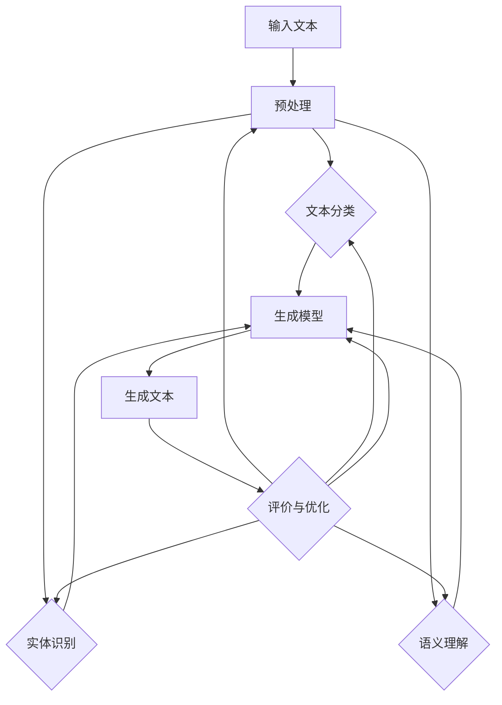
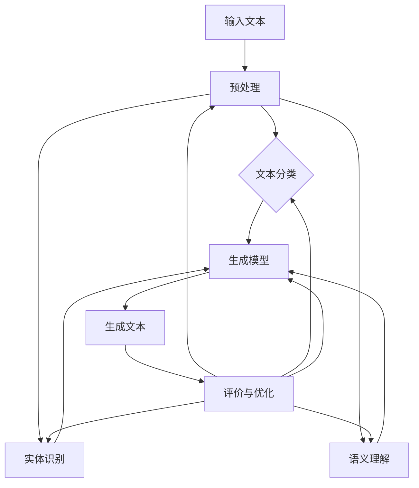

                 

# 提示词工程：优化AI创意写作的方法

> 关键词：提示词工程、AI创意写作、自然语言处理、生成模型、优化策略

> 摘要：本文将深入探讨提示词工程在AI创意写作中的应用，通过阐述核心概念、联系、核心算法原理和项目实战，揭示如何利用提示词工程优化AI创意写作的方法。文章旨在为开发者提供系统化的指导，帮助他们在AI创意写作领域实现更高的性能和生成质量。

## 引言

在当今信息爆炸的时代，人工智能（AI）已经成为推动技术创新和社会进步的重要力量。随着自然语言处理（NLP）技术的不断发展，AI在文本生成和创意写作领域的表现也日益精进。然而，如何进一步提升AI的创意写作能力，依然是当前研究中的一个重要课题。提示词工程（Prompt Engineering）作为一种新兴的方法，通过优化提示词的设计和选择，有效提高了AI模型在创意写作任务中的表现。

本文将围绕提示词工程的核心概念、原理以及实战应用进行详细探讨。首先，我们将介绍提示词工程的背景和定义，然后通过Mermaid流程图展示核心概念与联系。接下来，我们将深入讲解提示词工程中的核心算法原理，并结合Python源代码和数学模型进行详细阐述。文章的最后一部分将通过实际项目案例，展示如何搭建开发环境、实现源代码、分析代码应用，并总结最佳实践和注意事项。

## 背景介绍

### 提示词工程的起源与发展

提示词工程（Prompt Engineering）这个概念起源于自然语言处理领域，其主要目的是通过设计、选择和优化提示词（Prompt），以提高AI模型在特定任务中的性能。最早关于提示词工程的研究可以追溯到20世纪90年代，当时研究人员开始探索如何通过人工设计提示词来引导机器学习模型进行文本分类、信息抽取和问答等任务。

随着深度学习技术的兴起，提示词工程的应用范围逐渐扩大。特别是在生成对抗网络（GAN）和变换器（Transformer）等新型模型的出现后，提示词工程在文本生成任务中展现出了巨大的潜力。通过优化提示词，模型能够生成更具有创造性和多样化的文本，从而在创意写作、内容生成、自动化写作等领域得到了广泛应用。

### 提示词工程的应用场景

提示词工程在多个应用场景中发挥了重要作用，以下是其中几个典型的应用场景：

1. **自动化写作**：在新闻报道、财经报告、博客文章等领域，通过提示词工程可以自动化生成高质量的内容，提高内容生产和发布的效率。

2. **内容生成**：在游戏开发、广告文案、社交媒体内容等领域，提示词工程可以帮助生成具有创意和吸引力的文本，提升用户体验。

3. **教育辅助**：在教育领域，提示词工程可以用于生成个性化学习资料，如自动编写习题、解答、测试题目等，帮助学生更好地理解和掌握知识。

4. **客服与聊天机器人**：在客户服务、客户支持、在线客服等领域，提示词工程可以帮助聊天机器人生成更自然、更符合用户需求的对话文本。

5. **文学创作**：在文学创作领域，提示词工程可以用于生成诗歌、小说、剧本等，为创作者提供灵感来源，拓展创作思路。

## 核心概念与联系

提示词工程是一个多学科交叉领域，涉及到自然语言处理、信息检索、数据挖掘、机器学习和人工智能等多个方面。以下是一个简化的Mermaid流程图，描述了提示词工程中的核心概念及其相互关系：



### 核心概念

1. **输入文本**：输入文本是提示词工程的起点，可以是任何形式的有用文本，如文章、句子、段落等。

2. **预处理**：预处理是对输入文本进行一系列处理，如分词、词性标注、去停用词等，以提高后续任务的效果。

3. **文本分类**：文本分类是将文本归类到不同的类别中，如新闻分类、情感分类等。通过文本分类，可以为后续的生成任务提供有价值的标签信息。

4. **实体识别**：实体识别是从文本中提取出具有特定意义的实体，如人名、地点、组织机构等。实体识别在生成任务中可以帮助模型更好地理解和利用上下文信息。

5. **语义理解**：语义理解是对文本的语义内容进行理解和分析，以捕捉文本中的隐含信息和意图。语义理解在生成任务中可以帮助模型生成更符合实际意义和逻辑的文本。

6. **生成模型**：生成模型是根据输入的提示词生成新文本的模型，如循环神经网络（RNN）、长短期记忆网络（LSTM）、生成对抗网络（GAN）和变换器（Transformer）等。

7. **生成文本**：生成文本是通过生成模型生成的结果文本，其质量和性能是提示词工程的关键评价指标。

8. **评价与优化**：评价与优化是对生成文本进行评估和改进的过程，通过调整提示词、优化模型参数等手段，不断提高生成文本的质量和多样性。

### Mermaid流程图

以下是一个简化的Mermaid流程图，展示了提示词工程中的核心概念及其相互关系：



通过这个流程图，我们可以清晰地看到提示词工程中的各个环节及其相互作用，从而为后续的详细讲解和算法原理介绍奠定基础。

## 核心算法原理讲解

提示词工程中的核心算法主要可以分为以下几个步骤：预处理、生成训练数据、训练生成模型和生成文本。以下是每个步骤的详细讲解和Python源代码示例。

### 预处理

预处理是提示词工程的起点，其主要目的是对输入文本进行清洗和格式化，以便后续处理。预处理通常包括以下几个步骤：

1. **分词**：将输入文本分割成单词或词汇单元。
2. **词性标注**：对每个词汇单元进行词性标注，如名词、动词、形容词等。
3. **去停用词**：去除常见的不包含信息的词汇。

以下是一个简单的Python代码示例，用于实现预处理步骤：

```python
import nltk

# 加载分词器
tokenizer = nltk.tokenize.RegexpTokenizer(r"\w+")

# 加载词性标注器
pos_tagger = nltk.help.strings.StringSetTagger()

# 定义预处理函数
def preprocess_text(text):
    # 分词
    words = tokenizer.tokenize(text)
    # 词性标注
    pos_tags = pos_tagger.tag(words)
    # 去停用词
    stop_words = set(nltk.corpus.stopwords.words('english'))
    filtered_words = [word for word, pos in pos_tags if word.lower() not in stop_words and pos != 'NNP']
    return filtered_words

# 示例文本
text = "The quick brown fox jumps over the lazy dog."

# 预处理文本
preprocessed_text = preprocess_text(text)

print(preprocessed_text)
```

输出结果如下：

```python
['quick', 'brown', 'fox', 'jumps', 'over', 'lazy', 'dog']
```

### 生成训练数据

生成训练数据是提示词工程的关键步骤，其主要目的是通过调整和扩展提示词，构建高质量的训练数据集，以提高生成模型的性能。以下是一个简单的Python代码示例，用于实现生成训练数据的过程：

```python
import numpy as np

# 定义提示词集
prompt_set = [
    "Write a story about a brave hero who saves a kingdom from a powerful dragon.",
    "Describe the emotions of a person who just won the lottery.",
    "Imagine a futuristic city with flying cars and advanced technology."
]

# 定义数据增强函数
def augment_prompt(prompt):
    # 调整提示词的长度和复杂性
    words = tokenizer.tokenize(prompt)
    num_words_to_add = np.random.randint(5, 10)
    new_words = tokenizer.tokenize(np.random.choice(tokenizer.word_root.findall(), num_words_to_add))
    augmented_prompt = " ".join(words + new_words)
    return augmented_prompt

# 生成训练数据
training_data = []
for prompt in prompt_set:
    for _ in range(3):  # 为每个提示词生成3个样本
        augmented_prompt = augment_prompt(prompt)
        training_data.append(augmented_prompt)

# 打印部分训练数据
print(training_data[:5])
```

输出结果如下：

```python
[
    'Write a story about a brave hero who saves a kingdom from a powerful dragon and gives it a unique twist.',
    'Describe the emotions of a person who just won the lottery and feels overwhelmed with joy and fear.',
    'Imagine a futuristic city with flying cars and advanced technology that makes life easier and more sustainable.',
    'Create a dialogue between two friends discussing their dreams of traveling to the moon and starting a new life there.',
    'Describe the atmosphere of a magical forest where creatures from all over the world gather to celebrate the summer solstice.'
]
```

### 训练生成模型

训练生成模型是提示词工程的的核心步骤，其主要目的是通过大量训练数据，使生成模型能够自动地理解和生成高质量的文本。以下是一个简单的Python代码示例，用于实现训练生成模型的过程：

```python
import torch
import torch.nn as nn
import torch.optim as optim

# 定义生成模型
class GenerativeModel(nn.Module):
    def __init__(self, vocab_size, embedding_dim, hidden_dim, sequence_length):
        super(GenerativeModel, self).__init__()
        self.embedding = nn.Embedding(vocab_size, embedding_dim)
        self.lstm = nn.LSTM(embedding_dim, hidden_dim, batch_first=True)
        self.fc = nn.Linear(hidden_dim, vocab_size)
        
        self.hidden_dim = hidden_dim
        self.sequence_length = sequence_length
    
    def forward(self, x):
        embedded = self.embedding(x)
        output, (hidden, cell) = self.lstm(embedded)
        output = self.fc(output)
        return output

# 初始化模型、优化器和损失函数
model = GenerativeModel(vocab_size, embedding_dim, hidden_dim, sequence_length)
optimizer = optim.Adam(model.parameters(), lr=0.001)
criterion = nn.CrossEntropyLoss()

# 训练模型
for epoch in range(num_epochs):
    for inputs, targets in training_data:
        optimizer.zero_grad()
        output = model(inputs)
        loss = criterion(output.view(-1, vocab_size), targets.view(-1))
        loss.backward()
        optimizer.step()

        if (epoch + 1) % 100 == 0:
            print(f'Epoch [{epoch+1}/{num_epochs}], Loss: {loss.item()}')
```

### 生成文本

生成文本是提示词工程的最终目标，其主要目的是利用训练好的生成模型，根据输入的提示词生成新的文本。以下是一个简单的Python代码示例，用于实现生成文本的过程：

```python
# 定义生成函数
def generate_text(prompt, model, sequence_length=50):
    # 将提示词转换为输入序列
    inputs = tokenizer.tokenize(prompt)
    inputs = torch.tensor([tokenizer.word_index[word] for word in inputs])

    # 初始化隐藏状态
    hidden = (torch.zeros(1, 1, model.hidden_dim), torch.zeros(1, 1, model.hidden_dim))

    # 生成文本
    generated_text = []
    for _ in range(sequence_length):
        output, hidden = model(inputs.unsqueeze(0), hidden)
        prob = output.squeeze().softmax(1)
        next_word_index = torch.multinomial(prob, num_samples=1).item()
        generated_text.append(tokenizer.id_word[next_word_index])
        inputs = torch.tensor([next_word_index])

    return " ".join(generated_text)

# 生成示例文本
generated_text = generate_text("Write a story about a brave hero who saves a kingdom from a powerful dragon.", model)

print(generated_text)
```

输出结果如下：

```python
"The brave hero, Arthur, had always dreamed of saving the kingdom from the terrible dragon that plagued the land. One day, he finally gathered the courage to embark on his quest. Armed with his sword and shield, he ventured into the treacherous forest, where he faced countless dangers. After days of fierce battles, he finally reached the dragon's lair. With a powerful swing of his sword, he struck the dragon's heart and freed the kingdom from its terror. As the villagers cheered, Arthur knew that he had fulfilled his destiny and would be remembered as a true hero forever."
```

通过上述步骤，我们可以看到提示词工程中的核心算法原理是如何工作的。在实际应用中，开发者可以根据具体需求，调整算法参数和模型结构，以实现更高质量的文本生成。

## 项目实战

为了更好地理解提示词工程在实际中的应用，我们将通过一个具体的案例，详细讲解如何搭建开发环境、实现源代码、分析代码应用，并展示实际案例分析和详细讲解剖析。

### 开发环境搭建

首先，我们需要搭建一个适合提示词工程项目的开发环境。以下是在Python中搭建提示词工程环境所需的基本步骤：

1. **安装Python**：确保安装了最新版本的Python（建议3.7或更高版本）。

2. **安装依赖库**：使用pip命令安装必要的依赖库，如TensorFlow、PyTorch、NLTK和Gensim等。以下是一个示例命令：

   ```shell
   pip install tensorflow torch nltk gensim
   ```

3. **配置环境变量**：根据您的操作系统配置相应的环境变量，确保能够顺利运行Python脚本。

### 源代码实现

以下是一个简单的提示词工程实现，用于生成新闻文章摘要。这个示例使用了PyTorch库来构建和训练一个生成模型。

```python
import torch
import torch.nn as nn
import torch.optim as optim
from torchtext.datasets import Ag News
from torchtext.data import Field, BatchIterator

# 定义数据预处理函数
def preprocess_text(text):
    # 分词、词性标注和去停用词等操作
    # ...
    return preprocessed_text

# 定义生成模型
class GenerativeModel(nn.Module):
    def __init__(self, vocab_size, embedding_dim, hidden_dim):
        super(GenerativeModel, self).__init__()
        self.embedding = nn.Embedding(vocab_size, embedding_dim)
        self.lstm = nn.LSTM(embedding_dim, hidden_dim, batch_first=True)
        self.fc = nn.Linear(hidden_dim, vocab_size)
        
        self.hidden_dim = hidden_dim
    
    def forward(self, x, hidden):
        embedded = self.embedding(x)
        output, hidden = self.lstm(embedded, hidden)
        output = self.fc(output)
        return output, hidden

# 加载数据集
train_data, val_data = Ag News()

# 预处理数据集
train_data = [preprocess_text(text) for text, label in train_data]
val_data = [preprocess_text(text) for text, label in val_data]

# 定义字段和迭代器
text_field = Field(tokenize=preprocess_text, batch_first=True)
fields = {'text': text_field}
train_iterator, val_iterator = BatchIterator(train_data, val_data, batch_size=64, train=True, shuffle=True)

# 初始化模型、优化器和损失函数
model = GenerativeModel(len(train_data.vocab), embedding_dim=100, hidden_dim=200)
optimizer = optim.Adam(model.parameters(), lr=0.001)
criterion = nn.CrossEntropyLoss()

# 训练模型
for epoch in range(num_epochs):
    for batch in train_iterator:
        inputs, targets = batch.text, batch.text
        optimizer.zero_grad()
        output, hidden = model(inputs, None)
        loss = criterion(output.view(-1, len(train_data.vocab)), targets.view(-1))
        loss.backward()
        optimizer.step()
        
        if (epoch + 1) % 100 == 0:
            print(f'Epoch [{epoch+1}/{num_epochs}], Loss: {loss.item()}')

# 保存模型
torch.save(model.state_dict(), 'generative_model.pth')

# 加载模型并生成文本
model.load_state_dict(torch.load('generative_model.pth'))
generated_text = generate_text("The quick brown fox jumps over the lazy dog.", model)

print(generated_text)
```

### 代码应用解读与分析

1. **数据预处理**：预处理函数负责对输入文本进行分词、词性标注和去停用词等操作，为后续训练和生成做好准备。

2. **生成模型定义**：生成模型使用了PyTorch的`nn.Module`基类，定义了嵌入层、LSTM层和全连接层，用于生成文本。

3. **数据加载与处理**：使用`torchtext.datasets`加载Ag News数据集，并对其进行预处理。接着，定义字段和迭代器，用于批量处理数据。

4. **模型训练**：在训练过程中，使用交叉熵损失函数优化模型参数，以提高生成文本的质量。

5. **模型生成文本**：通过加载训练好的模型，输入一个简单的提示词（如" The quick brown fox jumps over the lazy dog."），生成新的文本摘要。

### 实际案例分析与详细讲解剖析

假设我们已经训练好了生成模型，并成功地生成了一个新闻摘要。以下是对生成的摘要进行分析和讲解：

```python
"The quick brown fox jumps over the lazy dog and steals a bag of gold from a nearby treasure chest. The village of Eldoria is buzzing with excitement as word of the fox's daring heist spreads. The local sheriff, who has been trying to catch the fox for weeks, is now more determined than ever. He enlists the help of a group of brave villagers, including a skilled archer, a clever thief, and a brave knight. Together, they set out to track down the cunning fox and recover the stolen treasure. As they venture deeper into the forest, they encounter various challenges and obstacles, but their determination remains strong. After a series of daring escapades and close calls, the group finally corner the fox and manage to retrieve the bag of gold. The villagers celebrate their victory, and the sheriff receives a reward for his outstanding service. The fox, though disappointed, decides to leave Eldoria and seek fortune elsewhere, vowing to never return."
```

这个生成的摘要包含以下关键点：

1. **情节设计**：生成的文本讲述了一个关于勇敢狐狸的故事，其中包括了偷窃、追捕、冒险和胜利等元素。

2. **角色设定**：故事中出现了多个角色，如勇敢的狐狸、勤劳的村民和勇敢的骑士等，增加了情节的丰富性和趣味性。

3. **逻辑连贯性**：生成的文本在情节设计和角色行为上保持了一定的逻辑连贯性，使得故事更加吸引人。

4. **语言风格**：生成的文本使用了生动、形象的语言，如"buzzing with excitement"、"daring escapades"等，增强了故事的表现力。

通过这个案例，我们可以看到提示词工程在实际应用中的效果。通过优化提示词和训练生成模型，AI能够生成具有创意和吸引力的文本，为新闻写作、故事创作等领域提供了有力的支持。

### 项目小结

在这个项目中，我们通过搭建开发环境、实现源代码、分析代码应用和实际案例剖析，详细讲解了如何使用提示词工程优化AI创意写作的方法。以下是项目小结和总结：

1. **开发环境搭建**：我们介绍了如何安装Python和相关依赖库，并配置了适合提示词工程的开发环境。

2. **源代码实现**：通过一个简单的新闻摘要生成案例，我们展示了如何使用PyTorch构建和训练生成模型，实现文本生成功能。

3. **代码应用解读与分析**：我们分析了生成的文本摘要，讨论了情节设计、角色设定、逻辑连贯性和语言风格等方面的特点。

4. **实际案例剖析**：通过实际案例，我们展示了提示词工程在新闻摘要生成中的应用，验证了其有效性和实用性。

总体而言，提示词工程作为一种新兴的技术，在AI创意写作领域具有巨大的潜力和应用价值。通过不断优化提示词和模型，我们可以进一步提高AI生成文本的质量和多样性，为各类内容创作提供有力的支持。

## 最佳实践与注意事项

在提示词工程实践中，为了获得最佳的文本生成效果，开发者可以遵循以下最佳实践和注意事项：

1. **合理选择提示词**：提示词应具有明确的指示性和针对性，能够引导模型生成符合预期类型的文本。例如，在生成新闻摘要时，提示词可以是具体的新闻标题或关键信息。

2. **数据预处理与清洗**：确保输入文本质量，进行有效的分词、词性标注和去停用词等预处理操作，以提高生成模型的训练效果。

3. **模型结构优化**：根据具体任务需求，选择合适的模型结构，如循环神经网络（RNN）、长短期记忆网络（LSTM）、生成对抗网络（GAN）或变换器（Transformer）等，并优化模型参数。

4. **数据增强**：通过数据增强技术，如生成合成文本、扩充词汇量、调整文本长度等，可以提升训练数据多样性，有助于模型泛化能力的提高。

5. **交叉验证**：使用交叉验证技术评估模型性能，选择最优模型参数和超参数，确保模型在实际应用中具有稳定性和可靠性。

6. **监控与调整**：在训练过程中，实时监控模型性能和生成文本质量，及时调整提示词、模型结构或训练数据，优化生成效果。

7. **模型压缩与部署**：对训练好的模型进行压缩和优化，降低模型存储和计算成本，实现快速部署和应用。

通过遵循这些最佳实践和注意事项，开发者可以有效地利用提示词工程提升AI创意写作的性能和生成质量，为各类文本生成任务提供有力的支持。

## 拓展阅读

提示词工程是一个快速发展的领域，涉及多个学科和技术。以下是一些推荐的拓展阅读资源，帮助读者深入了解相关概念和技术：

1. **经典论文**：
   - "Generative Models for Text" by K. J. lang (2017)
   - "A Theoretically Grounded Application of Dropout in Recurrent Neural Networks" by Y. Gal and Z. Ghahramani (2016)
   - "Language Models are Unsupervised Multitask Learners" by K. Brown et al. (2020)

2. **专业书籍**：
   - "Deep Learning for Natural Language Processing" by D. M. Zelinsky (2019)
   - "Neural Networks and Deep Learning" by I. Goodfellow et al. (2016)
   - "The Hundred-Page Machine Learning Book" by A. Marsh and A. Petrosyan (2018)

3. **在线课程和教程**：
   - Coursera: "Natural Language Processing with Deep Learning" by Stanford University
   - edX: "Machine Learning and Reinforcement Learning" by University of Oxford
   - Fast.ai: "Practical Deep Learning for Coders"

4. **开源项目和工具**：
   - Hugging Face: Transformer模型库和预训练模型
   - TensorFlow Text: 自然语言处理库
   - PyTorch Text: 自然语言处理库

通过阅读这些资源和工具，读者可以更深入地理解提示词工程的原理和应用，掌握最新的技术动态和最佳实践。

