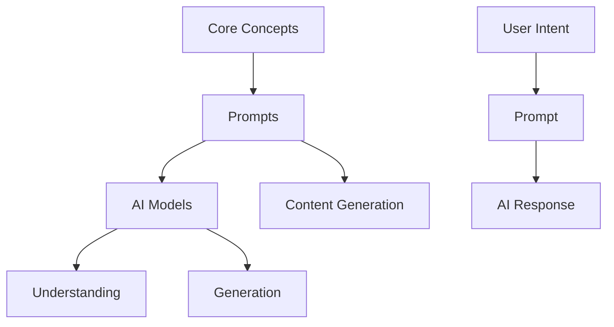

                 

**Step 1: Introduction to Prompt Engineering**

### Prompt Engineering: Optimizing AI for Multilingual Content Creation

In the era of artificial intelligence (AI), content creation has become a crucial aspect of digital communication. AI-powered tools have revolutionized how we generate, translate, and personalize content across multiple languages. At the heart of this revolution lies the concept of "prompt engineering." This practice involves the design and optimization of prompts—input instructions given to AI models to guide their content generation.

Keywords: **Prompt Engineering, AI Content Creation, Multilingual AI, Neural Machine Translation, Data Augmentation**

> **Abstract:**
>
> This article delves into the realm of prompt engineering, exploring its foundational principles, the role of multilingual AI models, and practical techniques for optimizing AI content creation. We will discuss the challenges and opportunities in creating multilingual content, the core concepts of prompt design, and advanced strategies for enhancing AI performance. Through a combination of theoretical explanations, practical examples, and real-world case studies, we aim to provide a comprehensive guide for leveraging AI to create high-quality, multilingual content.

**Step 2: Understanding the Importance of Prompt Engineering**

The importance of prompt engineering in AI content creation cannot be overstated. A well-designed prompt can significantly influence the quality, relevance, and coherence of the content generated by AI models. It serves as a bridge between human intentions and machine capabilities, enabling AI systems to understand and fulfill complex content creation tasks.

### Core Concepts and Relationships

To grasp the essence of prompt engineering, we need to understand its core concepts and their interrelationships. Here's a visual representation using Mermaid:

In this diagram, we see that prompts (B) are central to the process, acting as the interface between user intent (G) and the AI model's understanding (C) and generation capabilities (F). The AI model processes the prompt to generate content (D), which aligns with the user's intent.

**Step 3: Design Principles of Effective Prompts**

Designing effective prompts requires a deep understanding of both human communication and machine learning. Here are some key principles:

1. **Clarity and Specificity**: A good prompt should be clear and unambiguous, leaving no room for misinterpretation.
2. **Relevance**: The prompt should be closely aligned with the content creation task at hand.
3. **Completeness**: Provide all necessary information to ensure the AI model can generate a coherent and relevant response.
4. **Flexibility**: Allow for variations in the input to test the robustness of the model's output.

**Step 4: Types of Prompts**

There are various types of prompts used in AI content creation, each serving a specific purpose:

1. **Instructional Prompts**: Provide explicit instructions on what to generate.
2. **Contextual Prompts**: Set the context for the content, giving the model background information.
3. **Examples Prompts**: Provide examples to guide the AI model's understanding.
4. **Generative Prompts**: Allow the AI model to generate content from scratch.

**Step 5: Best Practices for Crafting Prompts**

To create effective prompts, follow these best practices:

1. **Keep It Simple**: Avoid overly complex language that may confuse the AI model.
2. **Experiment with Structure**: Experiment with different prompt structures to find what works best for your specific use case.
3. **Iterate and Refine**: Continuously test and refine your prompts based on the model's output.

**Step 6: Conclusion**

Prompt engineering is a vital aspect of AI content creation, particularly in the context of multilingual content. By understanding its core principles, types, and best practices, we can harness the full potential of AI to generate high-quality, multilingual content that resonates with diverse audiences. In the next sections, we will delve deeper into the intricacies of multilingual AI models and advanced prompt engineering techniques to further optimize AI content creation.

