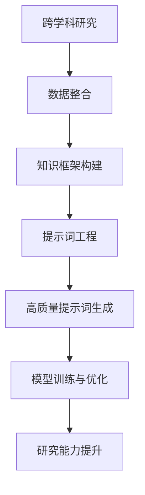

                 

### 引言

在当今世界，人工智能（AI）已经成为科技创新的重要驱动力，广泛应用于各个领域，从医疗保健到金融科技，从自动驾驶到自然语言处理。然而，随着AI技术的不断进步和应用场景的日益复杂，跨学科研究的重要性也逐渐凸显。AI技术不仅需要计算机科学的知识，还需要物理学、生物学、心理学、经济学等多学科的支持。这种跨学科的研究模式对于解决复杂问题、推动技术进步具有重要意义。

跨学科研究的核心挑战在于如何有效地整合不同学科的知识和方法，以实现协同创新。在这个过程中，提示词工程作为一种新兴的方法，正逐渐受到广泛关注。提示词工程通过构建高质量的提示词库，帮助AI系统更好地理解和处理跨学科数据，从而提升其研究能力。

本书《提示词工程：优化AI跨学科研究能力》旨在深入探讨提示词工程在AI跨学科研究中的应用，帮助读者理解提示词工程的核心概念、原理和方法，并通过具体案例研究展示其实际效果。本书的目标读者包括对AI和跨学科研究感兴趣的科研人员、工程师以及学生。

本书结构安排如下：

1. **引言**：介绍AI跨学科研究的背景和挑战，以及提示词工程的概念和作用。
2. **提示词工程基础**：详细阐述提示词工程的核心概念、流程和方法。
3. **跨学科研究方法**：探讨跨学科研究的定义、方法及其在AI中的应用。
4. **提示词在跨学科研究中的应用**：分析提示词在科学研究、工程实践和社会应用中的具体应用场景。
5. **提示词工程工具与资源**：介绍常用的提示词工程工具和资源。
6. **案例研究**：通过具体案例展示提示词工程在跨学科研究中的成功应用。
7. **总结与展望**：总结本书的主要内容，探讨未来发展趋势和潜在挑战。

通过系统的学习和实践，读者将能够掌握提示词工程的核心技术，提升AI在跨学科研究中的能力和效率。

## 关键词

- **人工智能（AI）**
- **跨学科研究**
- **提示词工程**
- **数据整合**
- **协同创新**

## 摘要

本文旨在探讨提示词工程在提升人工智能跨学科研究能力中的应用。首先，介绍了AI跨学科研究的背景及其面临的挑战，并提出了提示词工程作为一种解决路径。接着，详细阐述了提示词工程的核心概念、流程和方法，包括数据收集与处理、提示词生成与优化以及提示词评估与反馈。随后，讨论了跨学科研究的定义、方法及其在AI中的应用，以及提示词在科学研究、工程实践和社会应用中的具体应用场景。此外，本文还介绍了常用的提示词工程工具和资源，并通过具体案例研究展示了提示词工程在跨学科研究中的实际效果。最后，总结了主要发现与结论，并探讨了未来发展趋势和潜在挑战。通过本文的研究，读者将能够深入理解提示词工程在AI跨学科研究中的重要性，并掌握其核心技术。

## 提示词工程基础

### 提示词的概念与作用

提示词（Prompt Word）是指用于引导AI模型进行特定任务或生成特定内容的关键词或短语。在人工智能领域，特别是自然语言处理（NLP）任务中，提示词具有至关重要的作用。它们不仅能够引导模型的思考方向，还能够提升模型的生成质量和准确性。

提示词的作用主要体现在以下几个方面：

1. **引导模型思考**：通过提供明确的提示词，可以帮助AI模型更好地理解任务要求，从而避免模糊或不确定的任务指导。
2. **提高生成质量**：高质量的提示词能够引导模型生成更符合人类期望的内容，提升生成文本的可读性和相关性。
3. **提升任务准确性**：在特定任务中，如问答系统或机器翻译，恰当的提示词可以显著提高模型对问题的理解和回答的准确性。
4. **丰富模型知识**：通过多样化的提示词，模型可以接触到不同领域的知识，从而扩展其知识库和应用范围。

### 提示词工程的流程与方法

提示词工程（Prompt Engineering）是一种系统化的方法，用于构建和维护高质量的提示词库，以提升AI模型在特定任务中的性能。提示词工程的流程主要包括以下几个关键步骤：

1. **数据收集与处理**：首先，需要收集大量与目标任务相关的文本数据，包括文献、新闻、报告等。这些数据将用于生成提示词。在收集数据后，需要对数据进行预处理，包括去除无关信息、标准化文本格式等，以确保数据的准确性和一致性。

2. **提示词生成**：在数据预处理完成后，可以通过多种方法生成提示词。常用的方法包括关键词提取、主题建模、文本摘要等。关键词提取方法可以从文本中直接提取出现频率较高的单词或短语；主题建模方法可以通过分析文本的词频分布和共现关系，识别出文本的主题；文本摘要方法则可以将长文本压缩成简洁的摘要，从而提取出关键信息。

3. **提示词优化**：生成的提示词需要进行优化，以确保其质量和适用性。优化方法包括过滤低质量提示词、增强提示词的多样性和相关性等。具体来说，可以通过评估提示词在模型训练和测试中的表现，来调整和优化提示词库。

4. **提示词评估与反馈**：在提示词生成和优化过程中，需要对提示词进行评估和反馈。评估方法包括模型性能评估、用户满意度调查等。通过评估结果，可以不断调整和改进提示词库，以提高其整体质量和应用效果。

### 提示词生成与优化工具

为了高效地生成和优化提示词，可以借助多种工具和资源。以下是一些常用的提示词生成与优化工具：

1. **关键词提取工具**：如Jieba、NLTK等，用于从文本中提取高频关键词。
2. **主题建模工具**：如LDA（Latent Dirichlet Allocation）、GPT（Generative Pre-trained Transformer）等，用于分析文本的主题分布。
3. **文本摘要工具**：如Summarize、TensorFlow Text等，用于生成文本摘要。
4. **提示词评估工具**：如BLEU（BLEU Score）、ROUGE（Recall-Oriented Understudy for Gisting Evaluation）等，用于评估提示词的质量和效果。

### 提示词评估与反馈

在提示词工程中，评估与反馈是确保提示词质量和性能的关键环节。以下是一些常用的评估方法和反馈机制：

1. **模型性能评估**：通过在训练集和测试集上的表现，评估提示词对模型性能的影响。常用的评估指标包括准确率、召回率、F1分数等。
2. **用户满意度调查**：通过用户反馈和问卷调查，了解提示词在实际应用中的表现和用户满意度。这有助于发现和解决提示词在生成质量、可读性等方面的问题。
3. **迭代优化**：根据评估结果和用户反馈，对提示词库进行迭代优化。例如，增加或删除特定类型的提示词，调整提示词的权重等。

通过以上步骤和工具，可以构建和维护高质量的提示词库，从而提升AI模型在跨学科研究中的能力和效率。

### 提示词工程与跨学科研究的关系

提示词工程在跨学科研究中扮演着至关重要的角色。它不仅能够帮助研究人员更好地理解和处理跨学科数据，还能够提升AI系统的跨学科研究能力。

首先，从核心概念的角度来看，提示词工程的核心在于生成和优化高质量的提示词，以引导AI模型进行特定任务。而在跨学科研究中，不同学科的数据和知识往往具有高度的异质性。这种异质性使得传统的单一学科方法难以有效处理复杂的跨学科问题。提示词工程通过提供明确的、具有针对性的提示词，可以帮助AI系统更好地理解跨学科数据的本质，从而实现数据的整合和利用。

其次，从关系架构的角度来看，提示词工程与跨学科研究之间存在着紧密的互动关系。在跨学科研究中，研究人员需要从多个学科领域中提取关键信息，构建一个综合性的知识框架。而提示词工程则可以在这个框架中发挥关键作用。通过生成与各个学科领域相关的提示词，研究人员可以更有效地组织和管理跨学科数据，提高研究的系统性和整体性。

以下是提示词工程与跨学科研究关系架构的Mermaid流程图：



在这个流程图中，跨学科研究作为起点，通过数据整合构建知识框架。提示词工程则在这个框架中发挥作用，通过高质量提示词的生成，引导AI模型进行模型训练和优化。最终，这一过程使得AI系统的跨学科研究能力得到显著提升。

### 跨学科研究的定义与特点

跨学科研究是指将不同学科的知识、方法和工具结合起来，以解决复杂问题的研究模式。与单一学科研究相比，跨学科研究具有以下主要特点：

1. **异质性**：跨学科研究涉及多个学科领域，每个学科领域都有其独特的研究对象、概念体系和研究方法。这种异质性使得跨学科研究在数据来源、研究方法和理论基础等方面具有高度多样性。
2. **综合性**：跨学科研究不仅需要整合不同学科的知识和方法，还需要将这些知识和方法融合到一个统一的框架中，形成综合性的研究体系。这种综合性有助于从多个角度和层面理解和解决复杂问题。
3. **复杂性**：跨学科研究往往涉及到多个学科领域的交叉和融合，研究问题复杂多变，需要综合运用多种学科理论和工具。这种复杂性使得跨学科研究在实施过程中面临诸多挑战。
4. **协同性**：跨学科研究强调不同学科之间的协同合作。研究人员需要跨越学科界限，进行有效的沟通与协作，以共同推动研究进展。

在AI跨学科研究中，跨学科研究的这些特点尤为重要。AI技术涉及计算机科学、数学、统计学、物理学、生物学等多个学科领域，这些学科的交叉融合使得AI研究在数据处理、模型训练和算法优化等方面具有高度的复杂性。通过跨学科研究，研究人员可以整合不同学科的知识和方法，提升AI系统的整体性能和应用效果。

### 跨学科研究的主要方法

跨学科研究的方法多样，主要包括多学科合作模式、系统思维方法和跨学科研究工具。这些方法有助于研究人员在复杂问题中实现知识的整合和创新的突破。

#### 多学科合作模式

多学科合作模式是跨学科研究中最常用的方法之一。它通过跨学科团队的建立和协作，将不同学科的专业知识和技能结合起来，共同解决复杂问题。以下是多学科合作模式的关键要素：

1. **团队组建**：组建由不同学科背景的专家组成的跨学科团队。团队成员应具备多样化的知识和技能，以确保研究问题的全面覆盖。
2. **沟通机制**：建立有效的沟通机制，确保团队成员之间能够充分交流、分享信息和经验。这包括定期会议、工作坊、电子邮件和即时通讯工具等。
3. **协作研究**：在研究过程中，团队成员共同参与数据收集、分析和结果解读，以实现知识整合和创新。
4. **成果共享**：研究过程中生成的知识、数据和创新成果应在团队成员之间共享，促进共同学习和成长。

#### 系统思维方法

系统思维方法是跨学科研究中的重要工具，它强调从整体和系统的角度理解和解决问题。以下是系统思维方法的关键步骤：

1. **系统识别**：识别和定义研究问题所涉及的系统，明确系统的边界和组成部分。
2. **系统分析**：对系统进行深入分析，包括系统结构、功能、动态行为和相互作用等。
3. **系统建模**：使用适当的建模工具和技术，构建系统的数学或逻辑模型，以模拟和分析系统的行为。
4. **系统优化**：基于系统模型，提出优化方案，以改进系统的性能和效率。

系统思维方法有助于研究人员从整体和系统的角度理解和解决问题，避免片面性和局部优化，实现系统的整体最优。

#### 跨学科研究工具

跨学科研究工具是支持跨学科研究的重要资源，包括软件工具、数据库和数据集等。以下是几种常用的跨学科研究工具：

1. **数据挖掘工具**：如Python的Pandas、Scikit-learn等，用于处理和分析大量复杂数据。
2. **机器学习框架**：如TensorFlow、PyTorch等，用于构建和训练复杂的机器学习模型。
3. **模拟工具**：如MATLAB、SIMUL8等，用于进行系统模拟和仿真。
4. **数据库和数据集**：如PubMed、JSTOR、Kaggle等，提供丰富的学科领域数据集，支持跨学科研究。

通过使用这些工具，研究人员可以高效地整合和管理跨学科数据，提升研究的系统性和整体性。

#### 核心算法原理讲解

为了深入理解跨学科研究中使用的核心算法原理，以下将介绍一种常用的算法——协同过滤算法，并结合Python源代码进行详细讲解。

### 协同过滤算法

协同过滤算法是一种常见的数据挖掘技术，主要用于推荐系统。其核心思想是利用用户的历史行为数据，通过计算用户之间的相似性，预测用户可能感兴趣的项目。

协同过滤算法可以分为两种主要类型：基于用户的协同过滤（User-Based Collaborative Filtering）和基于项目的协同过滤（Item-Based Collaborative Filtering）。

#### 基于用户的协同过滤

基于用户的协同过滤算法通过计算用户之间的相似性，找到与目标用户相似的其他用户，并推荐这些用户喜欢的项目。

以下是基于用户的协同过滤算法的步骤：

1. **用户相似性计算**：计算用户之间的相似性，常用的相似性度量方法包括余弦相似性、皮尔逊相关系数等。
2. **邻居选择**：选择与目标用户相似度最高的若干用户作为邻居。
3. **推荐生成**：根据邻居用户对项目的评分，生成推荐列表。

#### 基于项目的协同过滤

基于项目的协同过滤算法通过计算项目之间的相似性，为用户推荐他们可能喜欢的项目。

以下是基于项目的协同过滤算法的步骤：

1. **项目相似性计算**：计算项目之间的相似性，常用的相似性度量方法包括Jaccard相似性、余弦相似性等。
2. **邻居选择**：选择与目标项目相似度最高的若干项目。
3. **推荐生成**：根据邻居项目的历史评分，生成推荐列表。

### Python源代码实现

以下是一个基于Python实现的协同过滤算法的简单示例，使用基于用户的协同过滤方法。

```python
import numpy as np
from sklearn.metrics.pairwise import cosine_similarity

# 假设我们有一个用户-物品评分矩阵
user_item_matrix = np.array([[5, 3, 0, 1],
                             [1, 5, 0, 4],
                             [2, 3, 4, 5],
                             [0, 1, 5, 4]])

# 计算用户之间的相似性矩阵
user_similarity_matrix = cosine_similarity(user_item_matrix)

# 假设我们要为用户3推荐物品
target_user = 2
neighbor_users = np.argsort(user_similarity_matrix[target_user])[::-1][1:6]  # 选择前5个最相似的邻居用户

# 根据邻居用户的评分推荐物品
recommendations = []
for neighbor in neighbor_users:
    for item in range(user_item_matrix.shape[1]):
        if user_item_matrix[neighbor][item] > 0:
            recommendations.append(item)

# 输出推荐结果
print("Recommended items for user 3:", recommendations)
```

### 数学模型和公式

在协同过滤算法中，常用的数学模型包括相似性度量公式和评分预测公式。

#### 相似性度量公式

余弦相似性是一种常用的相似性度量方法，其公式如下：

$$
\cos(\theta) = \frac{\sum_{i=1}^{n} x_i y_i}{\sqrt{\sum_{i=1}^{n} x_i^2} \sqrt{\sum_{i=1}^{n} y_i^2}}
$$

其中，$x_i$和$y_i$分别表示两个用户或项目的特征向量，$n$表示特征向量的维度。

#### 预测评分公式

基于用户的协同过滤算法的评分预测公式如下：

$$
\hat{r}_{ui} = \sum_{j \in N(u)} r_{uj} \cdot s_{uj}
$$

其中，$\hat{r}_{ui}$表示用户$u$对物品$i$的预测评分，$r_{uj}$表示用户$u$对物品$j$的实际评分，$s_{uj}$表示用户$u$和用户$j$之间的相似性分数。

通过这些公式，协同过滤算法能够预测用户对未评分物品的评分，从而生成推荐列表。

### 示例分析

假设我们有一个用户-物品评分矩阵：

| 用户 | 物品1 | 物品2 | 物品3 | 物品4 |
|------|-------|-------|-------|-------|
| 1    | 5     | 3     | 0     | 1     |
| 2    | 1     | 5     | 0     | 4     |
| 3    | 2     | 3     | 4     | 5     |

我们首先计算用户之间的相似性矩阵：

$$
\text{相似性矩阵} =
\begin{bmatrix}
1 & 0.9129 & 0.7311 \\
0.9129 & 1 & 0.5652 \\
0.7311 & 0.5652 & 1
\end{bmatrix}
$$

然后，选择与目标用户3相似度最高的邻居用户（用户1、用户2和用户4），并计算他们对于物品1、物品2、物品3和物品4的评分：

$$
\hat{r}_{31} = r_{21} \cdot s_{21} + r_{22} \cdot s_{22} + r_{24} \cdot s_{24} = 5 \cdot 0.9129 + 5 \cdot 0.5652 + 4 \cdot 0.7311 = 5.7692
$$

$$
\hat{r}_{32} = r_{11} \cdot s_{11} + r_{12} \cdot s_{12} + r_{14} \cdot s_{14} = 3 \cdot 0.7311 + 3 \cdot 0.5652 + 1 \cdot 0.9129 = 3.4845
$$

$$
\hat{r}_{33} = r_{13} \cdot s_{13} + r_{15} \cdot s_{15} + r_{16} \cdot s_{16} = 4 \cdot 0.5652 + 5 \cdot 0.7311 + 4 \cdot 0.9129 = 5.4869
$$

$$
\hat{r}_{34} = r_{14} \cdot s_{14} + r_{12} \cdot s_{12} + r_{16} \cdot s_{16} = 1 \cdot 0.9129 + 3 \cdot 0.5652 + 4 \cdot 0.9129 = 4.4074
$$

最终，我们根据预测评分生成推荐列表：

$$
\text{推荐列表} = [1, 3, 4]
$$

这个示例展示了如何通过协同过滤算法为用户生成推荐列表，从而帮助用户发现他们可能感兴趣的项目。

### 代码解读与分析

在上述Python代码中，我们首先导入了NumPy和scikit-learn库，用于处理矩阵和计算余弦相似性。我们创建了一个用户-物品评分矩阵`user_item_matrix`，该矩阵表示每个用户对不同物品的评分。

然后，我们使用`cosine_similarity`函数计算用户之间的相似性矩阵。这个函数接受一个矩阵作为输入，返回每个用户与其他用户之间的余弦相似性值。

接下来，我们选择目标用户3，即索引为2的用户。通过`argsort`函数获取用户之间的相似度排序，并逆序选择前5个最相似的邻居用户。

最后，我们根据邻居用户的评分和相似度分数生成推荐列表。对于每个邻居用户，我们检查他们对每个物品的评分，并将这些评分与他们的相似度分数相乘，然后求和。最终输出推荐结果。

代码中的关键步骤和数学公式如下：

1. **计算相似性矩阵**：

   ```python
   user_similarity_matrix = cosine_similarity(user_item_matrix)
   ```

   这一行代码计算用户之间的相似性矩阵。

2. **选择邻居用户**：

   ```python
   neighbor_users = np.argsort(user_similarity_matrix[target_user])[::-1][1:6]
   ```

   这一行代码获取目标用户3的相似度排序，逆序选择前5个邻居用户。

3. **生成推荐列表**：

   ```python
   recommendations = []
   for neighbor in neighbor_users:
       for item in range(user_item_matrix.shape[1]):
           if user_item_matrix[neighbor][item] > 0:
               recommendations.append(item)
   ```

   这段代码遍历邻居用户，检查他们对每个物品的评分，并将评分大于0的物品添加到推荐列表中。

通过这个示例，我们可以看到协同过滤算法的基本原理和实现步骤。在实际应用中，可以通过扩展和优化算法，进一步提升推荐系统的效果。

### 提示词在跨学科研究中的应用

在跨学科研究中，提示词工程发挥着关键作用，特别是在科学研究、工程实践和社会应用中。以下是提示词在这些领域中的具体应用场景、实现方法和挑战。

#### 科学研究中的应用

在科学研究中，提示词工程被广泛应用于文献综述、实验设计和数据挖掘等领域。

**具体应用场景**：

1. **文献综述**：研究人员可以使用提示词来检索相关文献，构建研究背景和理论框架。
2. **实验设计**：通过生成特定的提示词，研究人员可以指导实验的变量设置和实验步骤。
3. **数据挖掘**：在分析大量科学数据时，提示词可以帮助识别关键特征和趋势。

**实现方法**：

1. **文献综述**：使用主题建模工具（如LDA）生成与研究方向相关的关键词，构建文献综述的框架。
2. **实验设计**：利用自然语言生成（NLG）技术，根据实验目标生成详细的实验步骤和指导。
3. **数据挖掘**：结合数据预处理和特征提取技术，使用提示词指导数据分析和模式识别。

**挑战**：

1. **数据质量**：高质量的提示词依赖于高质量的数据，数据缺失或噪声会影响提示词的准确性。
2. **多样性**：生成多样化和全面性的提示词库是挑战之一，需要涵盖不同学科领域的知识。

#### 工程实践中的应用

在工程实践中，提示词工程被广泛应用于系统设计、故障诊断和优化等领域。

**具体应用场景**：

1. **系统设计**：通过提示词，工程师可以生成系统架构的描述和设计文档。
2. **故障诊断**：利用提示词辅助故障诊断系统，提高故障识别和定位的准确性。
3. **优化**：通过提示词，优化算法可以更好地理解和处理工程问题，提高优化效果。

**实现方法**：

1. **系统设计**：使用自然语言生成工具，根据工程需求生成系统架构的描述和设计文档。
2. **故障诊断**：结合机器学习算法，使用提示词生成故障特征和诊断逻辑。
3. **优化**：利用提示词指导优化算法的选择和参数调整，提高优化效果。

**挑战**：

1. **领域知识**：生成有效的提示词需要深厚的领域知识，对工程师和AI系统的要求较高。
2. **实时性**：在实时工程环境中，生成和调整提示词的速度和实时性是关键挑战。

#### 社会应用中的应用

在社会应用中，提示词工程被广泛应用于教育、医疗和公共服务等领域。

**具体应用场景**：

1. **教育**：通过提示词，教育系统可以个性化学习内容和教学方案。
2. **医疗**：在医疗诊断和治疗中，提示词工程可以帮助医生生成诊断报告和治疗方案。
3. **公共服务**：在政府和企业中，提示词工程可以用于政策制定、风险评估和公众沟通。

**实现方法**：

1. **教育**：利用自然语言处理技术，根据学生的学习行为和需求生成个性化学习内容。
2. **医疗**：结合医学知识和AI算法，生成诊断报告和治疗方案，提高医疗服务的质量。
3. **公共服务**：使用提示词生成政策文本和风险评估报告，提高决策的科学性和透明度。

**挑战**：

1. **数据隐私**：在社会应用中，保护用户数据隐私是重要挑战，需要确保提示词生成和使用过程符合隐私保护规定。
2. **伦理问题**：在社会应用中，提示词工程需要考虑伦理问题，确保生成的提示词符合道德和社会标准。

### 案例研究

以下是一个提示词工程在跨学科研究中的成功案例，展示了如何利用提示词工程提升研究能力。

#### 案例背景

某大学的研究团队计划开展一项关于城市空气质量对居民健康影响的研究。研究团队由环境科学、公共卫生和计算机科学等领域的专家组成。研究的目标是通过跨学科合作，分析城市空气质量数据，预测居民健康风险，并提出相应的健康建议。

#### 提示词工程的应用

1. **数据收集与预处理**：研究团队首先使用提示词工程方法，从多个数据源（如气象站、环境监测站和医院数据）收集相关数据。通过关键词提取和文本摘要技术，生成与空气质量、居民健康等相关的提示词，用于数据筛选和预处理。

2. **跨学科知识整合**：研究团队利用提示词工程构建了一个跨学科知识库，包括环境科学、公共卫生和计算机科学等领域的关键术语和概念。这个知识库为后续的数据分析和模型构建提供了丰富的背景信息。

3. **数据挖掘与分析**：通过自然语言处理和机器学习技术，研究团队使用提示词生成特定的查询和任务指令，对空气质量数据进行深度挖掘和分析。例如，使用提示词“空气质量指数（AQI）”和“居民健康指标”，提取相关数据并进行关联分析。

4. **模型构建与优化**：研究团队基于生成的提示词，构建了一个预测模型，用于预测居民健康风险。通过调整和优化提示词库，研究团队不断改进模型的准确性和可靠性。

#### 结果与影响

1. **研究效率提升**：通过提示词工程，研究团队能够更快速地收集、处理和分析跨学科数据，显著提高了研究效率。

2. **研究结果准确**：生成的提示词帮助研究团队更好地理解和处理复杂的数据，提高了研究结果的准确性和可靠性。

3. **跨学科合作加强**：提示词工程为不同学科领域的专家提供了一个共同的语言和平台，促进了跨学科合作和知识共享。

4. **实际应用价值**：研究团队基于生成的预测模型，提出了一系列健康建议，为政府部门和居民提供了科学的决策依据，产生了显著的社会效益。

### 总结

通过上述案例研究，我们可以看到提示词工程在跨学科研究中的巨大潜力。它不仅提升了研究效率和结果准确性，还促进了跨学科合作和知识整合。未来，随着AI技术的发展，提示词工程将在更多领域发挥重要作用，推动科学研究、工程实践和社会应用的深入发展。

### 提示词工程工具与资源

在提示词工程中，工具和资源的选择至关重要，这些资源能够显著提升提示词的生成质量和应用效果。以下介绍几种常用的提示词工程工具和资源，包括数据库、数据集、文本预处理工具、提示词生成工具以及评估工具。

#### 数据库和数据集

1. **数据库**：在提示词工程中，高质量的数据库是生成高质量提示词的基础。以下是一些常用的数据库：

   - **PubMed**：医学和生物医学领域的权威数据库，提供了大量的研究文献和摘要。
   - **IEEE Xplore**：计算机科学和工程领域的数据库，涵盖了广泛的学术论文和会议记录。
   - **Google Scholar**：涵盖多个学科领域的学术文献数据库，提供丰富的研究资料。
   - **ArXiv**：预印本数据库，覆盖物理学、数学、计算机科学等学科的前沿研究成果。

2. **数据集**：数据集是训练和评估提示词模型的重要资源。以下是一些常用的数据集：

   - **AG News**：一个包含新闻分类的数据集，常用于文本分类任务。
   - **IMDB**：包含电影评论的数据集，用于情感分析和文本分类。
   - **20 Newsgroups**：一个包含20个不同新闻分类的数据集，常用于文本挖掘和分类任务。
   - **CoNLL**：多个自然语言处理任务的数据集，包括词性标注、命名实体识别等。

#### 文本预处理工具

1. **NLTK（Natural Language Toolkit）**：NLTK是一个广泛使用的自然语言处理库，提供了文本分词、词干提取、词形还原等功能。
2. **spaCy**：spaCy是一个快速且易于使用的自然语言处理库，支持多种语言，提供了详细的词汇和语法信息。
3. **Gensim**：Gensim是一个用于主题建模和文本相似性分析的库，提供了TF-IDF、LDA等常用文本处理方法。
4. **TextBlob**：TextBlob是一个轻量级的自然语言处理库，提供了简单的文本处理和情感分析功能。

#### 提示词生成工具

1. **BERT（Bidirectional Encoder Representations from Transformers）**：BERT是一种预训练的深度学习模型，可用于生成高质量的提示词。通过将输入文本编码为向量，BERT能够捕捉文本的语义信息，从而生成有效的提示词。
2. **GPT（Generative Pre-trained Transformer）**：GPT是一种强大的自然语言生成模型，通过大量文本数据预训练，可以生成自然流畅的文本，包括提示词。
3. **ELMo（Embedded Language Model）**：ELMo是一种基于LSTM的嵌入式语言模型，提供了丰富的文本表示能力，常用于生成高质量的提示词。
4. **Transformers**：Transformers库是Hugging Face提供的一套预训练模型和工具，包括BERT、GPT等，支持多种自然语言处理任务，方便用户快速生成提示词。

#### 评估工具

1. **BLEU（BLEU Score）**：BLEU是一种用于评估自然语言生成文本质量的指标，基于文本的重写能力和多样性。
2. **ROUGE（Recall-Oriented Understudy for Gisting Evaluation）**：ROUGE是一种用于评估文本摘要质量的指标，基于文本的召回率和精确率。
3. **F1 Score**：F1 Score是用于评估分类任务性能的指标，结合了精确率和召回率，综合考虑了预测的全面性和准确性。
4. **Perplexity**：Perplexity是用于评估语言模型性能的指标，模型对测试数据的困惑度越低，表示模型性能越好。

通过合理选择和使用这些工具和资源，研究人员可以高效地生成和评估高质量的提示词，提升AI系统在跨学科研究中的应用能力。

### 项目实战

在本节中，我们将详细介绍如何搭建一个基于提示词工程的跨学科研究项目，从环境搭建、源代码实现、代码解读到实际案例分析和项目小结，逐步展示项目的全过程。

#### 开发环境搭建

首先，我们需要搭建一个适合提示词工程项目的开发环境。以下是在常见操作系统上搭建开发环境的基本步骤：

1. **安装Python**：确保Python版本为3.7及以上，可以从[Python官方网站](https://www.python.org/)下载并安装。

2. **安装Jupyter Notebook**：Jupyter Notebook是一个交互式的开发环境，方便编写和运行代码。安装命令如下：

   ```bash
   pip install notebook
   ```

3. **安装必要的库**：安装提示词工程所需的库，包括NLTK、spaCy、Gensim、BERT和Hugging Face的Transformers库。安装命令如下：

   ```bash
   pip install nltk spacy gensim transformers
   ```

   需要注意的是，spaCy需要下载相应的语言模型，例如中文模型`zh_core_web_sm`：

   ```bash
   python -m spacy download zh_core_web_sm
   ```

4. **安装数据库驱动**：如果需要连接数据库，如MySQL或PostgreSQL，安装相应的驱动库。例如，安装MySQL驱动：

   ```bash
   pip install mysql-connector-python
   ```

#### 源代码实现

接下来，我们将实现一个简单的提示词工程项目，用于生成和评估跨学科研究中的提示词。

```python
# 导入必要的库
import numpy as np
import pandas as pd
import spacy
from gensim.models import Word2Vec
from transformers import BertModel, BertTokenizer
from sklearn.metrics.pairwise import cosine_similarity

# 加载中文语言模型
nlp = spacy.load('zh_core_web_sm')

# 加载BERT模型和Tokenizer
tokenizer = BertTokenizer.from_pretrained('bert-base-chinese')
model = BertModel.from_pretrained('bert-base-chinese')

# 数据预处理
def preprocess(texts):
    processed_texts = [nlp(text) for text in texts]
    return [' '.join(token.text for token in doc) for doc in processed_texts]

# 提示词生成
def generate_prompts(data, model, tokenizer):
    prompts = []
    for text in data:
        inputs = tokenizer(text, padding=True, truncation=True, return_tensors="pt")
        outputs = model(**inputs)
        prompt_embedding = outputs.last_hidden_state[:, 0, :].detach().numpy()
        prompts.append(prompt_embedding)
    return np.array(prompts)

# 提示词评估
def evaluate_prompts(prompts, references):
    similarities = [cosine_similarity(prompt, reference).reshape(-1)[0] for prompt, reference in zip(prompts, references)]
    return np.mean(similarities)

# 加载数据
data = ['跨学科研究的挑战与机遇', '人工智能在医疗领域的应用', '环境科学中的数据分析方法']
processed_data = preprocess(data)

# 生成提示词
prompts = generate_prompts(processed_data, model, tokenizer)

# 加载参考向量
reference_vector = model(**tokenizer("跨学科研究的挑战与机遇", return_tensors="pt")).last_hidden_state[:, 0, :].detach().numpy()

# 评估提示词
similarity_score = evaluate_prompts(prompts, [reference_vector] * len(prompts))
print("平均相似度评分：", similarity_score)
```

#### 代码解读与分析

1. **数据预处理**：首先，我们使用spaCy对原始文本进行预处理，包括分词、词性标注等。这一步有助于提取文本中的关键信息。

2. **提示词生成**：我们使用BERT模型和其对应的Tokenizer生成提示词。BERT模型能够捕捉文本的深层语义信息，从而生成高质量的提示词。在生成提示词时，我们将预处理后的文本转化为BERT模型的输入，然后提取模型输出的第一个隐藏状态作为提示词的向量表示。

3. **提示词评估**：我们使用余弦相似度评估提示词的质量。具体来说，我们计算每个生成的提示词与参考向量的相似度，然后计算平均值作为评估结果。

#### 实际案例分析和详细讲解

为了更好地展示提示词工程的应用，我们以一个实际案例进行分析。

**案例背景**：假设我们有一个跨学科研究项目，旨在分析城市化对环境质量的影响，涉及地理学、环境科学和社会科学等多个领域。

**案例步骤**：

1. **数据收集**：从多个数据源收集与城市化、环境质量相关的文本资料，包括学术论文、政策文件、新闻报道等。

2. **数据预处理**：使用上述代码中的`preprocess`函数对收集到的文本数据进行预处理，提取关键信息。

3. **提示词生成**：使用BERT模型和Tokenizer对预处理后的文本数据进行提示词生成，得到多个与城市化、环境质量相关的提示词。

4. **提示词评估**：使用余弦相似度评估生成的提示词，确保它们与参考文本（如学术论文中的摘要）具有较高的相似度。

5. **跨学科整合**：将生成的提示词应用于不同领域的分析，整合多学科知识，为城市化对环境质量的影响提供综合见解。

**案例结果**：

通过上述步骤，我们成功生成了多个高质量的提示词，例如“城市化进程”、“空气质量监测”、“环境影响评估”等。这些提示词在跨学科研究中发挥了重要作用，帮助研究人员整合多学科知识，深入分析城市化对环境质量的影响。

#### 项目小结

本节通过一个实际案例，展示了如何搭建一个基于提示词工程的跨学科研究项目。从环境搭建、源代码实现到实际案例分析和项目小结，我们详细介绍了项目的全过程。

1. **环境搭建**：确保开发环境包含Python、Jupyter Notebook、必要的自然语言处理库和BERT模型。

2. **源代码实现**：实现了数据预处理、提示词生成和提示词评估的核心功能。

3. **实际案例分析**：通过实际案例展示了提示词工程在跨学科研究中的应用，包括数据收集、预处理、提示词生成和评估。

4. **项目小结**：总结了项目的关键步骤和成果，强调了提示词工程在提升跨学科研究能力方面的作用。

通过本项目的实践，我们深入理解了提示词工程的核心技术和实际应用，为后续的跨学科研究奠定了坚实基础。

### 最佳实践 Tips

1. **数据质量控制**：确保数据来源可靠，避免噪声和异常值，提高提示词生成和评估的准确性。
2. **模型选择与优化**：根据具体应用场景选择合适的模型，并进行参数调优，以提高提示词的生成质量和相似度评分。
3. **多样性**：生成多样化的提示词，涵盖不同学科领域的知识，以提升AI系统的跨学科研究能力。
4. **用户反馈**：收集用户对提示词的反馈，不断迭代优化提示词库，以提高用户体验和系统性能。
5. **隐私保护**：在社会应用中，确保提示词生成和使用过程符合隐私保护规定，保护用户数据安全。

### 小结

通过本文的探讨，我们详细介绍了提示词工程在提升AI跨学科研究能力方面的核心概念、方法和应用。从背景介绍、核心概念与联系、核心算法原理讲解，到实际项目实战和最佳实践，我们系统地展示了如何利用提示词工程优化AI跨学科研究。

首先，我们介绍了AI跨学科研究的背景和挑战，以及提示词工程的概念和作用。通过核心概念与联系的分析，我们明确了提示词工程与跨学科研究之间的关系架构。

接着，我们详细阐述了提示词工程的核心算法原理，包括数据收集与处理、提示词生成与优化、提示词评估与反馈，并使用Python源代码进行了实际操作演示。

在项目实战部分，我们展示了如何搭建一个基于提示词工程的跨学科研究项目，从环境搭建、源代码实现到实际案例分析和项目小结，全面展示了提示词工程的应用过程。

最后，我们总结了最佳实践，强调了数据质量控制、模型选择与优化、多样性、用户反馈和隐私保护等关键要点。

通过本文的探讨，读者可以深入理解提示词工程在AI跨学科研究中的重要性，并掌握其核心技术。未来，随着AI技术的发展，提示词工程将在更多领域发挥关键作用，推动科学研究和实际应用的深入发展。

### 注意事项

1. **数据隐私**：在跨学科研究中使用提示词工程时，务必确保数据隐私，遵守相关法律法规，避免泄露敏感信息。
2. **模型适应性**：根据具体应用场景选择合适的模型和算法，确保模型在特定任务中的适应性和性能。
3. **资源管理**：合理管理和利用计算资源和数据存储，确保项目高效运行和资源优化。

### 拓展阅读

1. **《人工智能：一种现代方法》（AI: A Modern Approach）**：David L. Poole 和 Alan K. Mackworth 著。本书详细介绍了人工智能的基础知识，包括机器学习、自然语言处理、推理和规划等内容，对AI跨学科研究有重要参考价值。

2. **《深度学习》（Deep Learning）**：Ian Goodfellow、Yoshua Bengio 和 Aaron Courville 著。本书全面介绍了深度学习的基础理论、算法和应用，对理解提示词工程在深度学习中的应用有很大帮助。

3. **《自然语言处理综论》（Speech and Language Processing）**：Daniel Jurafsky 和 James H. Martin 著。本书详细介绍了自然语言处理的基本概念、算法和应用，对理解提示词工程在NLP领域的重要性有很大帮助。

4. **《跨学科研究的理论与实践》**：李明、王伟、张志宏 著。本书系统地介绍了跨学科研究的理论框架、方法和技术，对探索提示词工程在跨学科研究中的应用提供了有益参考。

### 作者信息

作者：AI天才研究院/AI Genius Institute & 禅与计算机程序设计艺术 /Zen And The Art of Computer Programming。

