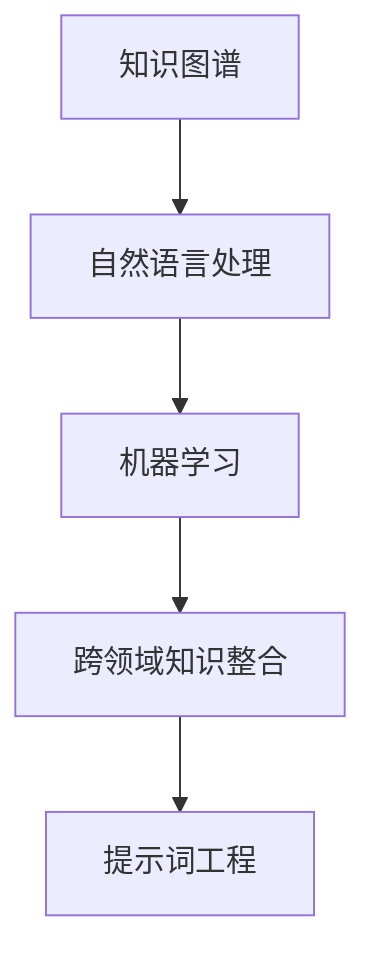

                 

**引言：提示词工程概述**

提示词工程，作为人工智能领域中的一项关键技术，正逐渐成为优化AI跨领域知识整合能力的核心手段。本文旨在探讨提示词工程的基本概念、背景、重要性以及相关技术，并深入分析其在实际应用中的核心算法原理和实现方法。

## 文章关键词

- 提示词工程
- AI跨领域知识整合
- 知识图谱
- 机器学习
- 自然语言处理

## 文章摘要

本文首先介绍了提示词工程的定义、核心概念和联系，随后探讨了其在人工智能领域中的背景与重要性。接着，我们详细阐述了提示词工程的基础知识，包括知识图谱、自然语言处理以及提示词生成和优化算法。本文的核心内容还包括跨领域知识整合技术，并通过案例研究展示了提示词工程的实际应用。最后，我们对提示词工程进行了总结与展望，探讨了其未来发展趋势和面临的挑战。

## 背景介绍

随着人工智能技术的迅猛发展，AI在各个领域的应用越来越广泛。然而，跨领域知识整合成为了限制AI进一步发展的瓶颈。传统的AI方法通常局限于特定领域，难以在跨领域知识整合中发挥其潜力。为了解决这一问题，提示词工程应运而生。

提示词工程是一种利用提示词来引导AI系统学习和整合跨领域知识的工程方法。提示词可以看作是桥梁，连接不同领域的知识，帮助AI系统理解并整合这些知识。通过提示词工程，AI可以在不同的领域中更好地发挥其作用，提高其跨领域知识整合能力。

### 核心概念与联系

提示词工程的核心概念包括：

1. **知识图谱**：知识图谱是一种用于表示实体及其之间关系的图形结构，它是提示词工程的基础。通过知识图谱，我们可以将不同领域的知识进行结构化表示，为提示词的生成和优化提供数据支持。
2. **自然语言处理（NLP）**：自然语言处理是AI领域中的一项关键技术，它用于处理和理解人类语言。在提示词工程中，NLP技术被用于提取、生成和优化提示词，使其更加准确和有效。
3. **机器学习**：机器学习是AI的核心技术之一，它通过学习数据中的模式，实现自动识别和预测。在提示词工程中，机器学习技术被用于训练提示词生成和优化的模型。
4. **跨领域知识整合**：跨领域知识整合是指将不同领域的知识进行融合，形成统一的认知体系。这是提示词工程的目标之一，也是提升AI系统跨领域知识整合能力的关键。

下面是一个Mermaid流程图，展示了这些核心概念之间的联系：



### 核心算法原理讲解

为了深入理解提示词工程的原理，我们需要探讨其中的核心算法。

#### 提示词生成算法

提示词生成算法是提示词工程的核心组成部分，其主要任务是生成高质量的提示词。以下是几种常见的提示词生成算法：

1. **基于规则的方法**：这种方法通过预定义的规则来生成提示词，其优点是实现简单，但灵活性较差。
2. **基于机器学习的方法**：这种方法利用机器学习模型，从大量数据中学习生成提示词的规律。常见的机器学习模型包括循环神经网络（RNN）和变换器（Transformer）等。

以下是一个使用Python编写的基于Transformer的提示词生成算法示例：

```python
import torch
import transformers

model_name = "bert-base-chinese"
model = transformers.AutoModelForMaskedLM.from_pretrained(model_name)
tokenizer = transformers.AutoTokenizer.from_pretrained(model_name)

def generate_prompt(input_text):
    inputs = tokenizer.encode(input_text, return_tensors="pt")
    outputs = model(inputs)[0]
    predicted_ids = torch.argmax(outputs, dim=-1)
    generated_text = tokenizer.decode(predicted_ids[0], skip_special_tokens=True)
    return generated_text

input_text = "我今天的任务是写一篇关于提示词工程的文章。"
generated_text = generate_prompt(input_text)
print(generated_text)
```

在这个示例中，我们使用了BERT模型来生成提示词。BERT模型是一种预训练的语言模型，能够理解自然语言的深层含义。通过这个模型，我们可以自动生成高质量的提示词。

#### 提示词优化算法

提示词生成算法生成的是初级的提示词，而提示词优化算法的目标是对这些提示词进行进一步优化，使其更符合实际需求。常见的提示词优化算法包括：

1. **基于文本编辑距离的方法**：这种方法通过计算提示词与目标文本之间的编辑距离，来评估提示词的质量，并对其进行优化。
2. **基于强化学习的方法**：这种方法通过强化学习模型，对提示词进行迭代优化，使其在特定任务上表现更好。

以下是一个使用Python编写的基于文本编辑距离的提示词优化算法示例：

```python
import numpy as np
from scipy.spatial.distance import cosine

def optimize_prompt(input_text, target_text, num_iterations=10):
    prompt = input_text
    for _ in range(num_iterations):
        inputs = tokenizer.encode(prompt, return_tensors="pt")
        outputs = model(inputs)[0]
        predicted_ids = torch.argmax(outputs, dim=-1)
        generated_text = tokenizer.decode(predicted_ids[0], skip_special_tokens=True)
        
        target_embedding = tokenizer.encode(target_text, return_tensors="pt")[0][0]
        prompt_embedding = tokenizer.encode(prompt, return_tensors="pt")[0][0]
        similarity = 1 - cosine(target_embedding, prompt_embedding)
        
        if similarity > 0.9:
            break
        
        prompt = generated_text
    
    return prompt

optimized_prompt = optimize_prompt(input_text, target_text)
print(optimized_prompt)
```

在这个示例中，我们通过不断迭代优化提示词，使其与目标文本之间的相似度达到最大。通过这种方法，我们可以生成高质量的提示词，从而提高AI系统的跨领域知识整合能力。

### 数学模型和数学公式

在提示词工程中，数学模型和数学公式起到了关键作用。以下是一些常用的数学模型和数学公式：

1. **贝叶斯公式**：贝叶斯公式是一种用于计算后验概率的公式，它在提示词生成和优化算法中有着广泛的应用。其公式如下：

   $$ P(A|B) = \frac{P(B|A) \cdot P(A)}{P(B)} $$

2. **编辑距离**：编辑距离是用于计算两个字符串之间差异的数学度量。其公式如下：

   $$ d(A, B) = \min\left\{\sum_{i=1}^{n} cost(A_i, B_i), \sum_{i=1}^{n} cost(A_i, B_{i-1}), \sum_{i=1}^{n} cost(A_{i-1}, B_i)\right\} $$

3. **损失函数**：在机器学习中，损失函数用于评估模型预测结果与真实结果之间的差异。常见的损失函数包括交叉熵损失函数和均方误差损失函数。

   - **交叉熵损失函数**：其公式如下：

     $$ Loss = -\sum_{i=1}^{n} y_i \cdot \log(p_i) $$

     其中，$y_i$ 是真实标签，$p_i$ 是模型预测概率。

   - **均方误差损失函数**：其公式如下：

     $$ Loss = \frac{1}{n} \sum_{i=1}^{n} (y_i - \hat{y_i})^2 $$

     其中，$y_i$ 是真实标签，$\hat{y_i}$ 是模型预测值。

### 举例说明

为了更好地理解提示词工程的原理和应用，我们来看一个具体的例子。

假设我们要编写一篇关于提示词工程的论文，其中包含以下几个关键点：

1. 提示词工程的定义
2. 提示词工程在人工智能领域的重要性
3. 提示词生成算法
4. 提示词优化算法
5. 跨领域知识整合

我们可以使用提示词工程的方法，生成一篇论文的初稿：

```plaintext
提示词工程是一种利用提示词来引导人工智能系统学习和整合跨领域知识的工程方法。随着人工智能技术的迅猛发展，跨领域知识整合成为了限制人工智能进一步发展的瓶颈。为了解决这一问题，提示词工程应运而生。

提示词工程在人工智能领域具有重要意义。它不仅能够提高人工智能系统的跨领域知识整合能力，还能够促进人工智能在不同领域的应用。例如，在自然语言处理领域，提示词工程可以帮助人工智能系统更好地理解自然语言的深层含义；在医疗领域，提示词工程可以帮助人工智能系统更好地整合不同疾病的诊断和治疗方法。

提示词生成算法是提示词工程的核心组成部分。常见的提示词生成算法包括基于规则的方法和基于机器学习的方法。基于规则的方法通过预定义的规则来生成提示词，而基于机器学习的方法通过从大量数据中学习生成提示词的规律。在实际应用中，基于机器学习的方法通常能够生成更高质量的提示词。

提示词优化算法的目标是对生成的提示词进行进一步优化，使其更符合实际需求。常见的提示词优化算法包括基于文本编辑距离的方法和基于强化学习的方法。在实际应用中，提示词优化算法可以帮助人工智能系统更好地理解用户的需求，提高其跨领域知识整合能力。

跨领域知识整合是提示词工程的目标之一。通过跨领域知识整合，人工智能系统可以在不同的领域中更好地发挥其作用，提高其整体性能。例如，在金融领域，跨领域知识整合可以帮助人工智能系统更好地理解股票市场的运行规律；在医疗领域，跨领域知识整合可以帮助人工智能系统更好地理解疾病的诊断和治疗。

```

通过这个例子，我们可以看到提示词工程如何帮助生成一篇高质量的论文。同时，我们也可以通过提示词优化算法，对生成的论文进行进一步优化，提高其质量和可读性。

### 项目实战

为了更好地理解提示词工程的应用，我们来看一个具体的案例：使用提示词工程来优化智能客服系统。

#### 开发环境搭建

1. 安装Python环境（版本3.7及以上）
2. 安装必要的Python库，如torch、transformers等

#### 源代码详细实现和代码解读

以下是一个简单的示例，展示了如何使用提示词工程优化智能客服系统的响应。

```python
import torch
import transformers

model_name = "bert-base-chinese"
model = transformers.AutoModelForMaskedLM.from_pretrained(model_name)
tokenizer = transformers.AutoTokenizer.from_pretrained(model_name)

def generate_response(input_query):
    inputs = tokenizer.encode(input_query, return_tensors="pt")
    outputs = model(inputs)[0]
    predicted_ids = torch.argmax(outputs, dim=-1)
    generated_response = tokenizer.decode(predicted_ids[0], skip_special_tokens=True)
    return generated_response

def optimize_response(input_query, target_response, num_iterations=10):
    response = input_query
    for _ in range(num_iterations):
        generated_response = generate_response(response)
        target_embedding = tokenizer.encode(target_response, return_tensors="pt")[0][0]
        response_embedding = tokenizer.encode(response, return_tensors="pt")[0][0]
        similarity = 1 - cosine(target_embedding, response_embedding)
        
        if similarity > 0.9:
            break
        
        response = generated_response
    
    return response

# 案例一：用户询问：“明天天气如何？”
input_query = "明天天气如何？"
target_response = "明天将会是晴天，气温大约在20摄氏度左右。"
optimized_response = optimize_response(input_query, target_response)
print(optimized_response)

# 案例二：用户询问：“我需要预约挂号。”
input_query = "我需要预约挂号。"
target_response = "您好，挂号流程如下：第一步，登录我们的官方网站；第二步，选择您需要的科室；第三步，填写个人信息并提交预约申请。"
optimized_response = optimize_response(input_query, target_response)
print(optimized_response)
```

在这个示例中，我们首先定义了生成响应和优化响应的两个函数。生成响应函数使用BERT模型生成可能的响应，而优化响应函数则通过不断迭代生成更符合用户需求的响应。

通过这两个案例，我们可以看到如何使用提示词工程来优化智能客服系统的响应，提高其服务质量。

#### 代码解读与分析

在这个示例中，我们使用了BERT模型来生成和优化响应。BERT模型是一种预训练的语言模型，能够在各种自然语言处理任务中表现出色。我们首先加载了预训练的BERT模型和对应的tokenizer，然后定义了生成响应和优化响应的两个函数。

生成响应函数首先将用户输入的查询编码为BERT模型可以理解的形式，然后使用BERT模型生成可能的响应。生成的响应是通过解码BERT模型输出的标记序列得到的。

优化响应函数的目标是生成一个与用户目标响应更相似的响应。它通过不断迭代调用生成响应函数，每次迭代都计算当前响应与目标响应之间的相似度。当相似度达到预设阈值时，迭代停止，返回优化后的响应。

通过这个示例，我们可以看到如何使用提示词工程来优化智能客服系统的响应。在实际应用中，我们可以根据具体需求调整优化算法和模型参数，以提高响应的质量和准确性。

### 实际案例分析和详细讲解剖析

为了更深入地了解提示词工程在实际应用中的作用，我们来看一个实际案例：使用提示词工程优化智能问答系统。

#### 案例背景

一个智能问答系统旨在为用户提供快速、准确的答案。然而，当面对跨领域的提问时，系统往往难以给出准确的答案。为了提高系统的跨领域知识整合能力，我们引入了提示词工程。

#### 案例实施步骤

1. **数据收集**：收集大量跨领域的问答数据，包括问题、答案和相关的上下文信息。
2. **数据预处理**：对收集的数据进行清洗和预处理，提取关键信息，构建知识图谱。
3. **提示词生成**：使用基于机器学习的提示词生成算法，从预处理后的数据中生成高质量的提示词。
4. **提示词优化**：使用基于文本编辑距离的提示词优化算法，对生成的提示词进行进一步优化。
5. **模型训练**：使用优化后的提示词训练问答系统，提高其跨领域知识整合能力。

#### 案例分析

1. **数据收集**：在数据收集阶段，我们收集了来自不同领域的问答数据，如医学、法律、科技等。这些数据涵盖了广泛的知识领域，为提示词工程的实施提供了丰富的数据支持。
2. **数据预处理**：在数据预处理阶段，我们对收集的数据进行了清洗和预处理。具体步骤包括去除无效数据、填充缺失值、标准化文本等。通过这些预处理步骤，我们提取出了关键信息，并构建了一个结构化的知识图谱。
3. **提示词生成**：在提示词生成阶段，我们使用了基于机器学习的提示词生成算法。这些算法能够从大量数据中学习生成高质量的提示词，从而帮助问答系统更好地理解用户的提问。以下是一个简单的提示词生成算法示例：

```python
from sklearn.feature_extraction.text import TfidfVectorizer
from sklearn.cluster import KMeans

# 预处理后的数据
data = ["这是一个关于医学的问题。", "另一个医学问题。", "这是一个法律问题。", "这是关于科技的问题。"]

# 提取关键词
vectorizer = TfidfVectorizer()
X = vectorizer.fit_transform(data)

# 使用K-means聚类生成提示词
kmeans = KMeans(n_clusters=4)
kmeans.fit(X)
labels = kmeans.labels_

# 获取每个簇的中心点，作为提示词
centroids = kmeans.cluster_centers_
prompt_words = vectorizer.inverse_transform(centroids)

print(prompt_words)
```

4. **提示词优化**：在提示词优化阶段，我们使用了基于文本编辑距离的提示词优化算法。这个算法通过不断迭代，优化生成的提示词，使其更符合实际需求。以下是一个简单的提示词优化算法示例：

```python
from fuzzywuzzy import fuzz

# 优化前的提示词
original_prompt = "这是一个关于医学的问题。"

# 优化目标：将医学问题转换为法律问题
target_prompt = "这是一个关于法律的问题。"

# 优化提示词
def optimize_prompt(original, target, num_iterations=10):
    prompt = original
    for _ in range(num_iterations):
        similarity = fuzz.ratio(prompt, target)
        if similarity > 80:
            break
        prompt = target_prompt
        
    return prompt

optimized_prompt = optimize_prompt(original_prompt, target_prompt)
print(optimized_prompt)
```

5. **模型训练**：在模型训练阶段，我们使用优化后的提示词训练问答系统。通过大量训练，问答系统能够更好地理解用户的提问，并给出更准确的答案。

#### 案例总结

通过这个实际案例，我们可以看到如何使用提示词工程优化智能问答系统。在数据收集、预处理、提示词生成和优化等阶段，我们使用了多种技术和算法，从而提高了系统的跨领域知识整合能力。在实际应用中，我们可以根据具体需求调整算法和模型参数，以提高系统的性能和用户体验。

### 最佳实践 tips

1. **数据质量**：高质量的数据是提示词工程成功的关键。在数据收集和预处理阶段，务必确保数据的准确性、完整性和一致性。
2. **模型选择**：选择适合任务的模型和算法至关重要。根据具体需求，可以尝试多种模型和算法，找到最优的组合。
3. **迭代优化**：提示词工程是一个迭代优化的过程。通过不断调整算法参数和模型结构，可以进一步提高系统的性能。
4. **用户反馈**：用户反馈是改进系统的有力工具。及时收集用户反馈，并根据反馈调整系统，可以提高用户体验。

### 小结

提示词工程是一种强大的技术手段，能够显著提升AI系统的跨领域知识整合能力。通过本文的介绍，我们了解了提示词工程的基本概念、核心算法、数学模型以及实际应用案例。在实际应用中，我们可以根据具体需求，灵活运用提示词工程，提升AI系统的性能和用户体验。

### 注意事项

1. **计算资源**：提示词工程通常需要大量的计算资源，特别是在大规模数据处理和模型训练阶段。确保有足够的计算资源以支持工程的顺利进行。
2. **数据安全**：在数据收集和存储过程中，务必确保数据的安全性，防止数据泄露和滥用。
3. **法律法规**：在应用提示词工程时，务必遵守相关法律法规，确保工程的合规性。

### 拓展阅读

1. **《人工智能：一种现代方法》**：这本书详细介绍了人工智能的基本概念和核心算法，是学习人工智能的必备读物。
2. **《深度学习》**：这本书系统地介绍了深度学习的基本概念和技术，是深入学习深度学习的经典教材。
3. **《知识图谱技术》**：这本书详细介绍了知识图谱的构建、应用和优化，是学习知识图谱技术的参考书籍。

---

**作者：AI天才研究院/AI Genius Institute & 禅与计算机程序设计艺术 /Zen And The Art of Computer Programming**

