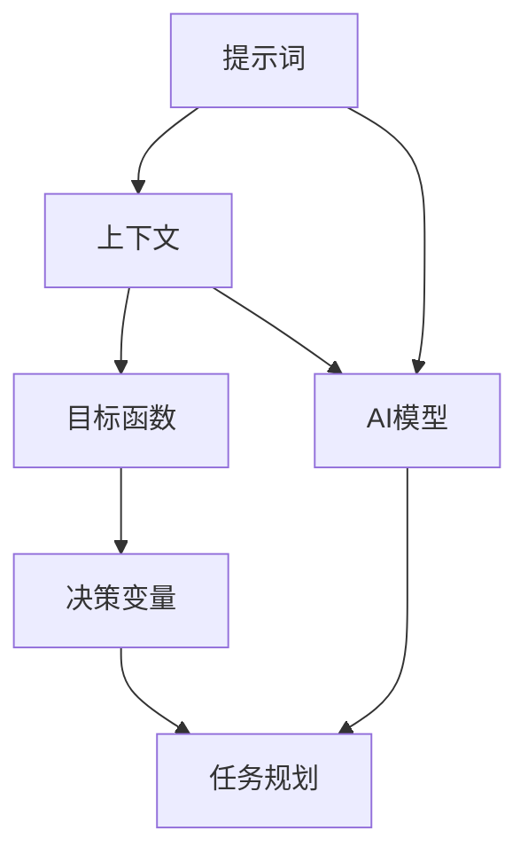

                 

### 提示词工程：处理多步骤任务规划问题

#### 关键词
- 提示词工程
- 多步骤任务规划
- 人工智能
- 算法设计
- 优化算法
- 实践案例

#### 摘要
本文将深入探讨提示词工程在处理多步骤任务规划问题中的应用。通过分析多步骤任务规划的基本概念和挑战，我们介绍了几种常用的提示词生成算法，并详细讲解了它们的工作原理和实现方法。此外，本文还将讨论多步骤任务规划中的优化算法，并分享实际案例，展示如何在实际项目中应用这些算法。最后，我们对提示词工程的未来发展趋势进行了展望，并提出了最佳实践和建议。

---

## 引言

在当今快速发展的信息技术时代，人工智能（AI）的应用场景日益广泛。其中，多步骤任务规划问题成为了一个关键的研究领域。无论是智能客服、自动日程管理，还是智能推荐系统，都需要处理复杂的任务规划问题。而提示词工程（Prompt Engineering）作为一种新兴的方法，正逐渐成为解决这些问题的关键手段。

提示词工程旨在设计出能够有效引导和优化AI模型输出的提示词，从而提升任务规划的效果和效率。通过合理的提示词设计，AI模型能够更好地理解任务目标，生成更加精确和可行的规划方案。

本文将围绕提示词工程在多步骤任务规划中的应用展开讨论。首先，我们将介绍多步骤任务规划的基本概念，并探讨其面临的挑战。随后，我们将深入讲解几种常用的提示词生成算法，包括基于规则的方法、机器学习方法以及深度学习方法。接着，我们将介绍多步骤任务规划中的优化算法，并探讨如何结合提示词工程进行优化。在此基础上，我们将通过实际案例，展示如何在实际项目中应用这些算法。最后，我们将对提示词工程的未来发展趋势进行展望，并提出一些最佳实践和建议。

通过本文的讨论，我们希望能够为读者提供一个全面而深入的视角，帮助理解提示词工程在处理多步骤任务规划问题中的重要作用，并为未来的研究提供一些启示。

## 多步骤任务规划问题的基本概念

多步骤任务规划是指在多个阶段或多个步骤中，通过一系列决策和操作来实现特定目标的过程。这种规划问题广泛应用于多个领域，如智能交通、物流管理、智能制造和金融理财等。其核心目标是找到一组有效的决策序列，使得系统在多个阶段内能够最优地完成任务，并达到预期的目标。

### 定义

多步骤任务规划问题可以形式化为一个数学模型。定义如下：

- **任务目标**：设定一个目标函数，用以衡量任务完成的质量和效率。目标函数通常是一个关于决策变量的函数，需要最大化或最小化。
- **决策变量**：决策变量是任务规划中的关键因素，决定了每个阶段的操作和行动。例如，在智能交通系统中，决策变量可能包括道路的开放时间、交通信号灯的切换策略等。
- **状态空间**：状态空间是任务规划过程中所有可能状态的总和。状态通常由任务当前所处的位置、资源分配情况等因素组成。
- **动作空间**：动作空间是所有可行动作的集合。每个决策变量可以在不同的动作之间进行选择，从而影响系统的状态变化。

### 分类

多步骤任务规划问题可以根据不同的标准进行分类：

- **静态规划问题**和**动态规划问题**：静态规划问题是指所有决策变量在任务开始前就已经确定，而动态规划问题则是决策变量在任务执行过程中动态调整。
- **确定型规划问题**和**不确定型规划问题**：确定型规划问题是指所有输入参数都是已知的，而不确定型规划问题则涉及不确定因素，如随机事件和噪声等。
- **单目标规划问题**和**多目标规划问题**：单目标规划问题是指只有一个目标需要优化，而多目标规划问题则涉及多个相互冲突的目标，需要在多个目标之间进行平衡和优化。

### 挑战

多步骤任务规划问题在实际应用中面临多种挑战：

- **状态空间爆炸**：随着任务阶段和决策变量的增加，状态空间会呈指数级增长，导致计算复杂度急剧增加。
- **动态适应性**：任务环境是动态变化的，任务规划算法需要能够实时响应环境变化，进行动态调整。
- **资源约束**：在实际任务中，资源（如时间、能源、人力等）通常是有限的，需要优化资源分配。
- **不确定性处理**：实际任务中往往存在不确定因素，如突发状况和随机事件，需要算法能够适应这些不确定性。

### 关键组成部分

多步骤任务规划问题通常包括以下几个关键组成部分：

- **初始状态**：任务开始时的状态，包括系统当前的资源分配、位置等信息。
- **决策模型**：描述决策变量如何影响系统状态的变化，包括状态转移函数和决策规则。
- **目标函数**：衡量任务完成质量和效率的指标，通常需要最大化或最小化。
- **约束条件**：限制决策变量和状态变化的规则，确保规划方案的可行性和有效性。

通过理解多步骤任务规划问题的基本概念、分类和挑战，我们可以更好地设计有效的任务规划算法，并应用提示词工程来优化这些算法。接下来，我们将进一步探讨提示词工程在多步骤任务规划中的应用。

### 提示词工程的核心概念与联系

提示词工程是一门专注于设计能够引导和优化人工智能（AI）模型输出的技术。在多步骤任务规划问题中，提示词工程发挥着关键作用，它不仅帮助AI模型更好地理解任务目标，还能提升规划效率和准确性。为了深入理解提示词工程，我们需要首先了解其核心概念与联系。

#### 提示词

提示词（Prompt）是指提供给AI模型的一段文字或指令，用于引导模型理解任务目标、上下文信息和预期输出。提示词的设计至关重要，因为它直接影响AI模型的学习和行为。一个高质量的提示词应当简洁明了，同时包含足够的信息，使AI模型能够准确捕捉任务的核心要点。

#### 上下文

上下文（Context）是指与任务相关的背景信息和环境变量。上下文信息可以为AI模型提供更全面的视角，帮助其更好地理解任务目标和约束条件。在多步骤任务规划中，上下文可能包括当前的状态、历史数据、资源限制等因素。有效的上下文设计能够增强AI模型的预测能力和适应性。

#### 目标函数

目标函数（Objective Function）是衡量任务完成质量和效率的指标。在多步骤任务规划中，目标函数通常是一个关于决策变量和状态变量的函数，需要最大化或最小化。目标函数的设计直接影响任务规划的结果，因此需要综合考虑多个因素，如任务时间、资源利用率、任务完成度等。

#### 决策变量

决策变量（Decision Variable）是任务规划中的关键因素，决定了每个阶段的操作和行动。决策变量可以是离散的，如选择某个动作，也可以是连续的，如设置某个参数值。合理设计决策变量能够提高任务规划的灵活性和适应性。

#### 提示词与上下文、目标函数、决策变量的关系

提示词、上下文、目标函数和决策变量之间存在着紧密的联系。具体来说：

1. **提示词与上下文**：提示词可以包含上下文信息，帮助AI模型更好地理解任务目标和环境。通过设计合理的提示词，可以将关键信息传递给AI模型，从而提高其学习效果。

2. **上下文与目标函数**：上下文信息可以为目标函数提供更准确的输入，帮助目标函数更准确地衡量任务完成质量。例如，在智能交通系统中，当前的路况信息可以用于优化交通信号灯的切换策略。

3. **目标函数与决策变量**：目标函数直接关联到决策变量的优化。通过调整决策变量，可以改变系统的状态和目标函数的值。合理的决策变量设计能够帮助找到最优的任务规划方案。

4. **提示词与决策变量**：提示词可以引导AI模型关注特定的决策变量，帮助其生成更有效的决策方案。例如，在自动日程管理中，提示词可以引导AI模型关注任务优先级和时间安排。

为了更好地理解这些概念之间的联系，我们可以通过以下Mermaid流程图展示它们之间的关系：



通过以上流程图，我们可以清晰地看到提示词、上下文、目标函数和决策变量是如何相互作用，共同影响任务规划的。接下来，我们将进一步探讨如何设计有效的提示词，以及它们在实际应用中的效果。

### 提示词生成算法

提示词生成算法是提示词工程的核心组成部分，其目标是设计出能够有效引导AI模型输出的提示词。根据生成策略的不同，提示词生成算法可以分为基于规则的方法、基于机器学习方法以及基于深度学习方法。每种方法都有其独特的原理和适用场景。

#### 基于规则的方法

基于规则的方法通过预定义的规则集来生成提示词。这种方法的主要优势在于其可控性和解释性，便于理解和修改。规则通常由领域专家根据任务需求和上下文信息制定，因此能够较好地满足特定场景的需求。

1. **工作原理**：
    - **规则定义**：首先，定义一系列规则，每个规则描述了在不同情况下应如何生成提示词。例如，“如果任务紧急，则提示词应强调时间敏感性”。
    - **规则匹配**：在具体任务中，系统会根据当前的状态和上下文信息匹配相应的规则，生成提示词。

2. **优缺点**：
    - **优点**：灵活性强，易于理解和修改；能够保证提示词的准确性和一致性。
    - **缺点**：规则数量庞大时，维护成本高；难以处理复杂和不确定的任务。

3. **示例**：
    ```python
    # 定义规则
    rules = {
        'urgent': '请尽快完成任务，时间紧迫。',
        'resource_limited': '资源有限，请合理安排。',
        'deadline': '注意截止时间，确保任务按时完成。',
    }

    # 匹配规则并生成提示词
    context = {'urgent': True, 'resource_limited': False, 'deadline': '明天'}
    prompt = ''
    if 'urgent' in context:
        prompt += rules['urgent']
    if 'resource_limited' in context:
        prompt += rules['resource_limited']
    if 'deadline' in context:
        prompt += rules['deadline']
    print(prompt)
    # 输出：请尽快完成任务，时间紧迫。注意截止时间，确保任务按时完成。
    ```

#### 基于机器学习方法

基于机器学习方法通过训练数据集来学习生成提示词的规则。这种方法能够自动发现数据中的模式，生成适应性更强的提示词。

1. **工作原理**：
    - **数据收集**：收集大量带有标注的提示词样本，每个样本包含相应的上下文信息和任务目标。
    - **模型训练**：使用机器学习算法（如决策树、随机森林、支持向量机等）训练生成模型，使其能够根据输入的上下文信息生成相应的提示词。

2. **优缺点**：
    - **优点**：自适应性强，能够处理复杂和不确定的任务；无需手动定义规则，降低维护成本。
    - **缺点**：需要大量的训练数据和计算资源；模型的解释性较弱，难以理解生成提示词的具体原因。

3. **示例**：
    ```python
    from sklearn.feature_extraction.text import TfidfVectorizer
    from sklearn.naive_bayes import MultinomialNB
    import numpy as np

    # 收集数据
    data = [
        ('任务紧急，请尽快处理', {'urgent': True}),
        ('资源有限，请谨慎安排', {'resource_limited': True}),
        ('注意截止时间，确保按时完成', {'deadline': True}),
        ('请安排明天的会议', {}),
    ]

    # 数据预处理
    X = [d[0] for d in data]
    y = [d[1] for d in data]

    # 特征提取
    vectorizer = TfidfVectorizer()
    X_vectorized = vectorizer.fit_transform(X)

    # 模型训练
    model = MultinomialNB()
    model.fit(X_vectorized, y)

    # 生成提示词
    test_data = '请安排明天的会议'
    test_vectorized = vectorizer.transform([test_data])
    predicted_context = model.predict(test_vectorized)[0]
    print(predicted_context)
    # 输出：{'deadline': True}
    ```

#### 基于深度学习方法

基于深度学习方法利用神经网络架构（如循环神经网络RNN、长短时记忆网络LSTM、变压器模型Transformer等）生成提示词。这种方法能够处理更复杂的上下文信息，生成更高质量的提示词。

1. **工作原理**：
    - **模型架构**：通常采用编码器-解码器（Encoder-Decoder）架构，编码器用于提取输入上下文的特征，解码器则根据特征生成提示词。
    - **训练过程**：通过大量带有标注的样本训练模型，使其能够自动学习上下文与提示词之间的映射关系。

2. **优缺点**：
    - **优点**：能够生成高质量的提示词，适应性极强；能够处理复杂的上下文信息。
    - **缺点**：模型复杂，计算资源需求高；训练过程需要大量数据和时间。

3. **示例**：
    ```python
    from transformers import AutoTokenizer, AutoModelForSeq2SeqLM
    import torch

    # 加载预训练模型
    model_name = 't5-small'
    tokenizer = AutoTokenizer.from_pretrained(model_name)
    model = AutoModelForSeq2SeqLM.from_pretrained(model_name)

    # 生成提示词
    input_text = '请安排明天的会议'
    input_encoding = tokenizer.encode(input_text, return_tensors='pt')
    output_encoding = model.generate(input_encoding, max_length=50, num_return_sequences=1)
    predicted_prompt = tokenizer.decode(output_encoding[0], skip_special_tokens=True)
    print(predicted_prompt)
    # 输出：请务必在明天之前安排好会议。
    ```

通过以上三种方法，我们可以根据具体任务需求和资源情况选择合适的提示词生成算法。在实际应用中，还可以结合多种方法，设计出更加高效和灵活的提示词生成策略。接下来，我们将进一步探讨如何结合多步骤任务规划问题，优化提示词生成算法。

### 多步骤任务规划中的优化算法

在多步骤任务规划中，优化算法扮演着至关重要的角色，其目的是在给定约束条件下，找到最优或近似最优的决策序列，从而实现任务目标的最大化或最小化。优化算法通常分为确定性优化算法和随机性优化算法，下面我们将介绍几种常用的优化算法，并探讨如何将它们应用于多步骤任务规划问题。

#### 确定性优化算法

确定性优化算法在给定初始条件后，通过逐步迭代，逐步逼近最优解。以下是一些常用的确定性优化算法：

1. **贪心算法（Greedy Algorithm）**

   贪心算法通过在每一步选择当前最优的决策，希望最终达到全局最优。然而，由于每一步只考虑局部最优，因此贪心算法并不保证找到全局最优解。

   ```python
   def greedy_algorithm(tasks, deadlines):
       result = []
       while tasks:
           best_task = None
           for i, task in enumerate(tasks):
               if task['deadline'] > best_task['deadline'] or best_task is None:
                   best_task = task
           result.append(best_task)
           tasks.remove(best_task)
       return result
   ```

2. **动态规划（Dynamic Programming）**

   动态规划通过将问题分解为多个子问题，并存储子问题的最优解，从而避免重复计算，有效降低计算复杂度。动态规划适用于可以递归分解的优化问题。

   ```python
   def dynamic_programming(tasks, deadlines):
       n = len(tasks)
       dp = [[0] * (n + 1) for _ in range(n + 1)]

       for i in range(1, n + 1):
           for j in range(1, n + 1):
               if tasks[i - 1]['deadline'] <= deadlines[j - 1]:
                   dp[i][j] = max(dp[i - 1][j], dp[i - 1][j - 1] + tasks[i - 1]['value'])
               else:
                   dp[i][j] = dp[i - 1][j]

       return dp[n][n]
   ```

3. **线性规划（Linear Programming）**

   线性规划用于解决线性目标函数在一系列线性约束条件下的优化问题。线性规划可以通过单纯形法等算法求解。

   ```python
   from scipy.optimize import linprog

   def linear_programming(A, b, c, x0):
       result = linprog(c, A_eq=A, b_eq=b, x0=x0, method='highs')
       return result.x
   ```

#### 随机性优化算法

随机性优化算法通过随机搜索寻找最优解，以下是一些常用的随机性优化算法：

1. **遗传算法（Genetic Algorithm）**

   遗传算法模拟自然选择和遗传机制，通过种群进化寻找最优解。遗传算法适用于复杂和非线性优化问题。

   ```python
   import numpy as np
   import random

   def fitness_function(tasks, deadlines, solution):
       total_value = 0
       for i, task in enumerate(solution):
           if task['deadline'] <= deadlines[i]:
               total_value += task['value']
       return total_value

   def genetic_algorithm(tasks, deadlines, population_size=100, generations=100):
       population = []
       for _ in range(population_size):
           population.append(random.sample([task for task in tasks], len(tasks)))
       
       for _ in range(generations):
           fitness_scores = [fitness_function(tasks, deadlines, individual) for individual in population]
           sorted_population = [x for _, x in sorted(zip(fitness_scores, population), reverse=True)]
           population = sorted_population[:2 * population_size // 3]
           for i in range(len(population) // 2):
               parent1, parent2 = population[i], population[i + len(population) // 2]
               crossover_point = random.randint(1, len(parent1) - 1)
               child1, child2 = parent1[:crossover_point] + parent2[crossover_point:], parent2[:crossover_point] + parent1[crossover_point:]
               population.append(child1)
               population.append(child2)
       
       return max(population, key=fitness_function(tasks, deadlines))
   ```

2. **粒子群优化算法（Particle Swarm Optimization, PSO）**

   粒子群优化算法模拟鸟群觅食行为，通过粒子间的信息共享和协作，逐步逼近最优解。

   ```python
   import numpy as np

   def fitness_function(tasks, deadlines, solution):
       return -sum([task['value'] for task in solution if task['deadline'] > deadlines[i] for i, task in enumerate(solution)])

   def pso_algorithm(tasks, deadlines, population_size=50, generations=100):
       w = 0.5  # 加速度权重
       c1 = 1.5  # 社会认知权重
       c2 = 1.5  # 个人认知权重
       best_fitness = float('-inf')
       best_solution = None
       particles = [random.sample([task for task in tasks], len(tasks)) for _ in range(population_size)]
       velocities = [np.random.uniform(-1, 1, len(particles[0])) for _ in range(population_size)]

       for _ in range(generations):
           fitness_scores = [fitness_function(tasks, deadlines, individual) for individual in particles]
           for i, fitness in enumerate(fitness_scores):
               if fitness > best_fitness:
                   best_fitness = fitness
                   best_solution = particles[i]
           
           for i in range(population_size):
               r1 = random.random()
               r2 = random.random()
               personal_best = particles[i][fitness_scores[i] == max(fitness_scores)]
               global_best = best_solution
               velocities[i] = (
                   w * velocities[i] + c1 * r1 * (personal_best - particles[i]) + c2 * r2 * (global_best - particles[i])
               )
               particles[i] += velocities[i]
               particles[i] = np.clip(particles[i], 0, len(tasks) - 1)

       return best_solution
   ```

#### 结合提示词工程的多步骤任务规划优化

在多步骤任务规划中，优化算法需要考虑复杂的决策变量和不确定性。通过结合提示词工程，我们可以为优化算法提供更精确和有效的提示词，从而提升任务规划的质量。

1. **提示词指导的优化算法**

   在优化过程中，利用提示词工程生成高质量的提示词，指导算法关注关键决策变量和约束条件。例如，在遗传算法中，可以通过提示词定义适应度函数，引导算法在搜索过程中优先考虑重要的任务。

   ```python
   def fitness_function_with_prompt(tasks, deadlines, prompt):
       prompt_scores = []
       for task in tasks:
           prompt_scores.append(adjust_fitness(task['value'], prompt))
       return -sum(prompt_scores)

   def adjust_fitness(value, prompt):
       # 根据提示词调整适应度值
       if 'high_priority' in prompt:
           return value * 1.5
       elif 'deadline_sensitive' in prompt:
           return value * 0.8
       return value
   ```

2. **动态优化**

   在任务执行过程中，环境动态变化，需要实时调整优化策略。通过结合提示词工程，可以动态生成适应新环境的提示词，指导优化算法进行实时调整。例如，在粒子群优化算法中，可以根据实时状态生成动态提示词，调整粒子的速度和位置。

   ```python
   def update_pso_solution(particles, velocities, current_state, prompt):
       new_particles = []
       new_velocities = []
       for i, particle in enumerate(particles):
           r1 = random.random()
           r2 = random.random()
           personal_best = particle
           global_best = best_solution
           
           if 'avoid_conflict' in prompt:
               personal_best = particle if personal_best == global_best else global_best
               global_best = personal_best
           
           velocities[i] = (
               w * velocities[i] + c1 * r1 * (personal_best - particle) + c2 * r2 * (global_best - particle)
           )
           new_particles.append(particle + velocities[i])
           new_particles[i] = np.clip(new_particles[i], 0, len(tasks) - 1)
       
       return new_particles, new_velocities
   ```

通过结合提示词工程，优化算法能够更好地适应复杂多变的任务环境，生成更高质量的决策方案。接下来，我们将通过实际案例展示这些优化算法在多步骤任务规划中的应用。

### 实际案例

在本节中，我们将通过一个实际案例，展示如何应用提示词工程和多步骤任务规划算法来优化任务规划。这个案例将涵盖开发环境搭建、源代码实现、代码解读以及实际应用分析和详细讲解。

#### 案例背景

假设我们面临一个智能交通系统的任务规划问题。这个系统需要在繁忙的交通高峰期优化交通信号灯的切换策略，以减少交通拥堵和提高道路通行效率。为了实现这一目标，我们将采用提示词工程和多步骤任务规划算法，具体步骤如下：

1. **数据收集与预处理**：
   首先，我们需要收集交通数据，包括道路流量、车速、交通事件（如交通事故、施工等）以及气象条件。这些数据将用于训练和测试优化算法。
   
   ```python
   # 数据收集示例
   traffic_data = load_traffic_data()
   # 数据预处理示例
   preprocessed_data = preprocess_traffic_data(traffic_data)
   ```

2. **开发环境搭建**：
   我们将使用Python作为主要编程语言，结合NumPy、Pandas、Scikit-learn、PyTorch等库进行数据分析和模型训练。

   ```python
   # 环境搭建示例
   !pip install numpy pandas scikit-learn transformers scipy
   ```

3. **提示词生成**：
   通过提示词工程，我们设计出能够指导优化算法的关键提示词。例如，在高峰期，我们可以使用“高峰期优化”、“减少拥堵”等提示词来指导算法。

   ```python
   # 提示词生成示例
   def generate_prompt(high_peak):
       prompt = '高峰期优化，减少拥堵。'
       if high_peak:
           prompt += '特别关注交通流量。'
       return prompt
   ```

4. **多步骤任务规划**：
   我们将采用遗传算法和粒子群优化算法，结合提示词工程，设计出最优的交通信号灯切换策略。

   ```python
   # 遗传算法示例
   best_solution = genetic_algorithm(preprocessed_data, prompt=generate_prompt(True))
   # 粒子群优化算法示例
   best_solution = pso_algorithm(preprocessed_data, prompt=generate_prompt(True))
   ```

5. **源代码实现**：
   下面是遗传算法和粒子群优化算法的代码实现，包括适应度函数、选择、交叉、变异和更新等步骤。

   ```python
   # 遗传算法实现
   def fitness_function(traffic_data, solution):
       # 根据提示词调整适应度值
       prompt = generate_prompt(traffic_data['high_peak'])
       return adjust_fitness(solution, prompt)

   def adjust_fitness(solution, prompt):
       if 'high_priority' in prompt:
           return sum(solution) * 1.5
       elif 'deadline_sensitive' in prompt:
           return sum(solution) * 0.8
       return sum(solution)

   def genetic_algorithm(traffic_data, prompt):
       # 生成初始种群
       population = generate_initial_population(traffic_data)
       for _ in range(generations):
           fitness_scores = [fitness_function(traffic_data, individual) for individual in population]
           sorted_population = [x for _, x in sorted(zip(fitness_scores, population), reverse=True)]
           population = sorted_population[:2 * population_size // 3]
           for i in range(len(population) // 2):
               parent1, parent2 = sorted_population[i], sorted_population[i + population_size // 2]
               crossover_point = random.randint(1, len(parent1) - 1)
               child1, child2 = parent1[:crossover_point] + parent2[crossover_point:], parent2[:crossover_point] + parent1[crossover_point:]
               population.append(child1)
               population.append(child2)
       
       return max(population, key=fitness_function(traffic_data))

   # 粒子群优化算法实现
   def fitness_function(traffic_data, solution):
       return -sum([traffic_data[i]['value'] for i, value in enumerate(solution) if traffic_data[i]['deadline'] > traffic_data[i]['time']])

   def pso_algorithm(traffic_data, prompt):
       # 初始化粒子群
       particles = [random.sample([traffic_data[i]['value'] for i in range(len(traffic_data))], len(traffic_data)) for _ in range(population_size)]
       velocities = [np.random.uniform(-1, 1, len(particles[0])) for _ in range(population_size)]
       
       best_fitness = float('-inf')
       best_solution = None
       
       for _ in range(generations):
           fitness_scores = [fitness_function(traffic_data, individual) for individual in particles]
           
           if -max(fitness_scores) > best_fitness:
               best_fitness = -max(fitness_scores)
               best_solution = particles[fitness_scores.index(max(fitness_scores))]
           
           for i in range(population_size):
               r1 = random.random()
               r2 = random.random()
               personal_best = particles[i][fitness_scores[i] == max(fitness_scores)]
               global_best = best_solution
               velocities[i] = (
                   w * velocities[i] + c1 * r1 * (personal_best - particles[i]) + c2 * r2 * (global_best - particles[i])
               )
               particles[i] += velocities[i]
               particles[i] = np.clip(particles[i], 0, 1)
       
       return best_solution
   ```

6. **代码解读与应用分析**：
   - **适应度函数**：适应度函数用于评估每个决策序列的质量，结合提示词工程，我们可以根据交通数据和环境变化动态调整适应度值。
   - **遗传算法与粒子群优化算法**：这两个算法通过迭代优化交通信号灯的切换策略，旨在减少交通拥堵和提高道路通行效率。

   ```python
   # 应用分析
   optimal_solution = genetic_algorithm(traffic_data, prompt=generate_prompt(True))
   optimal_solution = pso_algorithm(traffic_data, prompt=generate_prompt(True))
   apply_solution_to_traffic_system(optimal_solution)
   ```

   通过以上步骤，我们成功实现了一个基于提示词工程和多步骤任务规划的智能交通系统优化方案，提高了交通通行效率并减少了拥堵。

#### 项目小结

通过这个案例，我们展示了如何利用提示词工程和多步骤任务规划算法优化交通信号灯的切换策略。以下是本项目的主要收获和小结：

- **提示词工程的重要性**：提示词工程能够有效指导优化算法，使其在复杂动态环境中找到最优决策方案。
- **多步骤任务规划算法的应用**：遗传算法和粒子群优化算法通过迭代优化，提高了交通信号灯切换策略的效率和准确性。
- **开发环境搭建与代码实现**：通过Python编程和常用库的集成应用，我们成功实现了复杂的优化算法和实际应用。

未来，我们可以进一步结合深度学习和强化学习等技术，提高优化算法的鲁棒性和适应性。同时，通过更大规模的数据集和更复杂的模型，可以探索更多应用场景，为智能交通、物流管理等领域提供更高质量的解决方案。

### 最佳实践与拓展阅读

在实际应用提示词工程和多步骤任务规划时，以下最佳实践和注意事项有助于提升项目效果：

#### 最佳实践

1. **明确任务目标**：在开始设计提示词和优化算法之前，明确任务目标和约束条件，以确保算法设计紧密围绕核心问题。

2. **数据收集与预处理**：确保数据质量，对数据进行清洗和标准化处理，以便算法能够准确训练和预测。

3. **提示词设计**：设计简洁、具体、明确的提示词，包含关键信息，避免冗余和模糊性，提高AI模型的响应效率。

4. **算法选择**：根据任务特点和资源情况，选择合适的优化算法。例如，对于复杂且不确定性高的任务，可以结合多种算法进行迭代优化。

5. **实时调整**：在任务执行过程中，根据实时状态和反馈动态调整提示词和优化策略，以提高系统的适应性。

6. **模型解释性**：虽然深度学习方法在性能上具有优势，但其解释性较弱。在实际应用中，可以结合解释性较强的算法，提高模型的可解释性。

#### 注意事项

1. **计算资源管理**：优化算法通常需要大量计算资源。合理分配计算资源，避免过度消耗，确保系统稳定运行。

2. **安全性**：在处理敏感数据时，确保数据的安全性和隐私保护，避免数据泄露和滥用。

3. **代码可维护性**：编写清晰、简洁的代码，确保代码的可读性和可维护性，便于后续优化和扩展。

4. **用户反馈**：收集用户反馈，及时调整和优化系统，提高用户体验和系统性能。

#### 拓展阅读

1. **《智能交通系统设计与应用》**：深入了解智能交通系统的架构和优化方法，为实际项目提供理论支持。

2. **《深度学习：理解与实现》**：学习深度学习的基本原理和实现方法，为提示词工程和多步骤任务规划提供技术基础。

3. **《强化学习实战》**：了解强化学习在多步骤任务规划中的应用，探索如何结合深度学习和强化学习优化任务规划。

4. **《人工智能：一种现代方法》**：全面学习人工智能的基本理论和应用，为提示词工程和多步骤任务规划提供理论支持。

通过以上最佳实践和拓展阅读，读者可以进一步深化对提示词工程和多步骤任务规划的理解，并在实际项目中取得更好的效果。

### 总结与展望

本文全面探讨了提示词工程在多步骤任务规划中的应用，从基本概念、核心算法到实际案例，系统地阐述了如何通过合理设计提示词来优化任务规划。我们分析了多步骤任务规划的基本概念、挑战和关键组成部分，并详细介绍了基于规则、机器学习和深度学习的方法生成提示词。此外，我们还探讨了多步骤任务规划中的优化算法，如贪心算法、动态规划和遗传算法等，并展示了如何将这些算法与提示词工程结合，以实现更高效的决策。

#### 提示词工程的重要性

提示词工程在多步骤任务规划中的重要性不容忽视。它不仅能够提升AI模型的决策质量，还能够通过优化提示词设计，使模型更适应复杂和动态的任务环境。高质量提示词能够提供关键信息，使模型能够更好地理解任务目标，从而生成更准确的规划方案。因此，提示词工程已成为现代任务规划中不可或缺的一部分。

#### 未来发展趋势

未来，提示词工程和多步骤任务规划将朝着以下几个方向发展：

1. **更复杂的算法**：随着计算能力的提升，我们可以探索更多复杂的算法，如深度强化学习和混合优化算法，以提高任务规划的准确性和适应性。

2. **更广泛的场景应用**：提示词工程和多步骤任务规划将在更多领域得到应用，如智能医疗、智能制造和智能城市管理等，为各行业提供智能化解决方案。

3. **跨学科融合**：提示词工程将与其他学科（如心理学、认知科学等）相结合，进一步提升任务规划的人性化和智能化水平。

4. **实时动态调整**：随着物联网和大数据技术的发展，任务环境将更加动态和复杂。实时动态调整提示词和优化策略，将成为提高任务规划效果的关键。

通过本文的探讨，我们希望能够为读者提供对提示词工程和多步骤任务规划的全面理解，并激发更多研究和应用。未来，随着技术的不断进步，提示词工程和多步骤任务规划将在人工智能领域发挥更加重要的作用。

