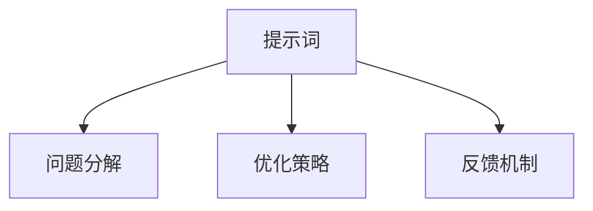
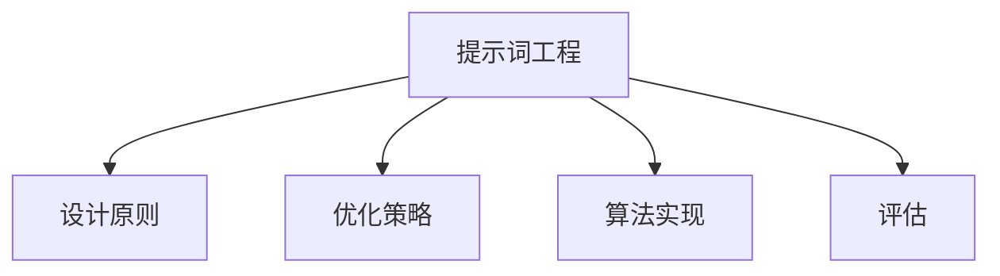
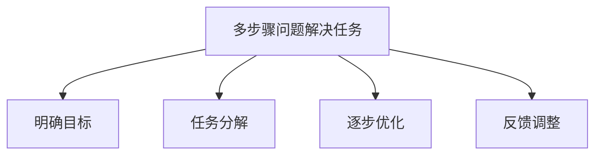
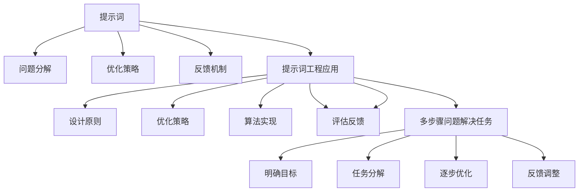

                 

### 提示词工程：处理多步骤问题解决任务的背景

在当今快速发展的信息技术时代，面对日益复杂的问题解决任务，我们需要一种系统化、高效的方法来应对多步骤问题解决任务。这些任务可能涉及数据预处理、模型训练、结果评估等多个阶段，每个阶段都有其特定的挑战和复杂性。例如，在人工智能领域，从数据处理到模型训练，再到模型部署，每个阶段都需要精细的操作和优化。为了解决这类问题，提示词工程（Prompt Engineering）应运而生。

提示词工程是一种系统化的方法，用于设计、优化和利用提示词，以帮助计算机程序或人工智能系统更好地理解和解决复杂问题。提示词（Prompt）在这里指的是提供问题解决所需信息的引导性指令或输入。通过精确的提示词设计，我们可以引导系统按照预定的步骤和方向解决问题，从而提高问题解决的效率和准确性。

多步骤问题解决任务通常需要以下几个关键要素：明确的目标、可分解的任务、逐步优化的策略和有效的反馈机制。这些要素在提示词工程中都有着重要的体现。例如，在自然语言处理（NLP）中，通过设计有效的提示词，可以引导模型从文本中提取关键信息，进而进行有效的情感分析或实体识别。在图像识别领域，提示词可以指导模型关注图像中的特定区域或特征，从而提高识别的准确性。

提示词工程不仅适用于人工智能领域，在软件开发、数据科学、智能决策支持等多个领域都有着广泛的应用。通过系统化的提示词设计，我们可以显著提升软件或系统的性能和用户体验。此外，随着人工智能技术的不断进步，提示词工程也在不断演进，新的算法和工具不断涌现，为复杂问题解决提供了更多的可能性。

本篇文章将围绕提示词工程的核心概念、设计原则、多步骤问题解决方法论以及实际应用场景等方面进行深入探讨。首先，我们将定义并解释提示词和提示词工程的概念，并展示其与多步骤问题解决任务之间的联系。随后，我们将详细分析提示词的设计原则和优化策略，并通过Python代码示例和数学模型来阐述核心算法原理。接着，文章将探讨提示词工程在实际应用中的具体案例，并总结其主要技术挑战和解决方案。最后，我们将通过实际项目实战案例，展示提示词工程的具体应用和效果，并提供一些最佳实践和小结。

### 核心概念与联系：提示词、提示词工程与多步骤问题解决任务的关系架构

为了深入理解提示词工程在处理多步骤问题解决任务中的作用，我们首先需要明确相关核心概念，并展示它们之间的联系。这里，我们将使用Mermaid流程图来描述提示词、提示词工程与多步骤问题解决任务之间的关系架构。

#### 提示词（Prompt）

提示词是指提供指导性信息的输入，用于引导计算机程序或人工智能系统按照预定的步骤和方向解决问题。在多步骤问题解决任务中，提示词扮演着关键角色，能够明确任务目标、细化任务分解、提供优化策略和反馈机制。例如，在自然语言处理（NLP）中，提示词可以是一个问题、一个目标陈述或一组关键词，用于指导模型进行文本分析。

**Mermaid流程图表示：**


#### 提示词工程（Prompt Engineering）

提示词工程是一种系统化的方法，用于设计、优化和利用提示词，以提高问题解决效率和准确性。它包括提示词的设计原则、优化策略、算法实现和评估等多个方面。在多步骤问题解决任务中，提示词工程能够帮助我们制定详细的任务计划，确保每个步骤都能顺利进行。

**Mermaid流程图表示：**


#### 多步骤问题解决任务

多步骤问题解决任务通常涉及一系列明确的步骤，每个步骤都有其特定的目标和任务。这些任务可以分解为更小的子任务，并通过逐步优化的策略和有效的反馈机制来确保最终目标的实现。在提示词工程的框架下，我们可以通过设计合适的提示词来指导系统完成每个步骤。

**Mermaid流程图表示：**


#### 关系架构

将上述概念结合在一起，我们可以构建一个描述提示词、提示词工程与多步骤问题解决任务之间关系的Mermaid流程图：



通过这个流程图，我们可以清晰地看到提示词、提示词工程与多步骤问题解决任务之间的相互作用和联系。提示词工程为多步骤问题解决任务提供了一个系统化的框架，通过设计有效的提示词，我们可以更好地指导系统完成复杂的问题解决过程，从而提高整体效率和准确性。

### 提示词设计与优化原则

在提示词工程中，提示词的设计与优化是关键环节，它直接影响到问题解决任务的效率和准确性。为了设计出有效的提示词，我们需要遵循一系列设计原则和优化策略。以下是几个核心的设计原则和优化策略：

#### 1. 清晰性和简洁性

提示词应该尽可能清晰和简洁，以便于计算机程序或人工智能系统能够快速理解和执行。模糊或不清晰的提示词可能会导致系统误解任务目标，从而导致错误的结果。因此，在设计提示词时，我们需要确保每个提示词都能明确传达任务的要求和期望。

**示例代码（Python）：**
```python
def design_clear_prompt():
    # 清晰的提示词示例
    prompt = "请对以下文本进行情感分析，并输出文本的情感极性（正面/负面）：\n'今天是个美好的日子。'"
    print(prompt)
design_clear_prompt()
```

#### 2. 具体性和明确性

提示词需要具有具体性和明确性，以便系统能够准确执行任务。例如，在图像识别任务中，提示词应明确指定系统需要关注的区域或特征。这有助于减少系统的模糊性，提高识别的准确性。

**示例代码（Python）：**
```python
def design_specific_prompt():
    # 具体性的提示词示例
    prompt = "请在以下图像中识别并标注所有出现的猫：\n"
    print(prompt)
design_specific_prompt()
```

#### 3. 适应性

提示词应该具有一定的适应性，以应对不同类型和规模的问题解决任务。这意味着提示词不应过于特定，而是应该设计成可以灵活调整和扩展的。例如，在自然语言处理任务中，提示词可以设计成可包含不同类型文本的模板。

**示例代码（Python）：**
```python
def design_adaptive_prompt(text):
    # 适应性的提示词示例
    prompt = f"请根据以下文本进行摘要：\n{text}"
    print(prompt)
text = "本文介绍了人工智能在医疗领域的应用，以及如何利用深度学习技术提高疾病诊断的准确性。"
design_adaptive_prompt(text)
```

#### 4. 优化策略

提示词的优化策略包括多种方法，例如调整提示词的长度、使用关键词、结合正则表达式等。优化策略的目的是提高提示词的有效性和性能。以下是一些常见的优化策略：

- **关键词优化**：在提示词中包含关键信息，以便系统可以快速定位和处理任务。例如，在文本分类任务中，使用与类别相关的关键词。
- **正则表达式**：使用正则表达式来精确匹配特定模式，从而提高提示词的准确性。
- **长度调整**：适当调整提示词的长度，以平衡信息的全面性和系统的处理速度。

**示例代码（Python）：**
```python
import re

def optimize_prompt(prompt):
    # 使用正则表达式优化提示词
    optimized_prompt = re.sub(r'\s+', ' ', prompt)  # 去除多余的空格
    print(optimized_prompt)

original_prompt = "请对以下文本进行情感分析，并输出文本的情感极性（正面/负面）：  今天是个美好的日子。   "
optimize_prompt(original_prompt)
```

#### 5. 多样性

设计提示词时，应考虑多样性。这有助于系统应对各种不同的任务场景和问题类型。例如，在训练机器学习模型时，可以使用多样化的数据集和提示词来提高模型的泛化能力。

**示例代码（Python）：**
```python
def design_diverse_prompt():
    prompts = [
        "请对以下文本进行情感分析：'我很喜欢这部电影。'",
        "请根据以下文本生成摘要：'本文探讨了人工智能在医疗领域的应用。'",
        "请在以下图像中识别并标注所有出现的猫："
    ]
    for prompt in prompts:
        print(prompt)
design_diverse_prompt()
```

通过遵循这些提示词设计与优化原则，我们可以设计出更加有效和灵活的提示词，从而提高多步骤问题解决任务的效率和准确性。在实际应用中，不断迭代和优化提示词设计，是提升系统性能的关键步骤。

### 多步骤问题解决方法论

在处理复杂的多步骤问题解决任务时，一个系统化的方法论能够显著提高问题解决的效率和效果。多步骤问题解决方法论通常包括任务分解、步骤规划、反馈调整等核心环节，每个环节都有其特定的方法和应用。以下是多步骤问题解决方法论的具体内容及其在提示词工程中的应用。

#### 1. 任务分解

任务分解是将复杂的问题拆解为一系列可管理的子任务，每个子任务都有明确的输出和输入。这种分解方法有助于简化问题，使得每个步骤都可以单独处理和优化。

- **任务分解方法**：

  - **基于功能分解**：根据问题的功能需求将任务分解为功能模块。

  - **基于数据依赖分解**：根据数据流动和依赖关系将任务分解为多个子任务。

  - **基于时间序列分解**：根据任务的时间顺序将任务分解为一系列连续的步骤。

- **在提示词工程中的应用**：

  在设计提示词时，我们可以通过分解任务来明确每个子任务的目标和输入输出。例如，在自然语言处理任务中，我们可以将任务分解为数据预处理、特征提取、模型训练和结果评估等步骤，并为每个步骤设计相应的提示词。

#### 2. 步骤规划

步骤规划是确定每个子任务的执行顺序和依赖关系，以确保问题能够按照既定的步骤顺利解决。步骤规划的方法包括：

- **顺序规划**：按照任务的逻辑顺序执行步骤，前一个步骤的输出作为下一个步骤的输入。

- **并行规划**：在某些情况下，多个步骤可以同时执行，以节省时间。

- **迭代规划**：在某些情况下，步骤需要迭代执行，直到满足特定条件或达到预期结果。

- **在提示词工程中的应用**：

  提示词在步骤规划中起着关键作用。通过设计明确的提示词，我们可以指导系统按照既定顺序执行每个步骤。例如，在机器学习任务中，我们可以设计以下提示词：

  - 数据预处理：请对以下数据集进行预处理，并输出预处理后的数据。
  - 模型训练：请使用预处理后的数据训练模型，并输出训练结果。
  - 结果评估：请对训练后的模型进行评估，并输出评估报告。

#### 3. 反馈调整

反馈调整是通过持续监测和评估任务执行结果，对步骤进行调整和优化，以确保问题得到有效解决。反馈调整的方法包括：

- **自动化反馈**：通过预设的指标和阈值，自动评估每个步骤的结果，并触发调整。

- **手动反馈**：根据人工分析的结果，对步骤进行调整和优化。

- **迭代反馈**：通过多次迭代，逐步优化问题解决过程。

- **在提示词工程中的应用**：

  提示词工程中的反馈调整可以通过设计反馈机制来实现。例如，在文本分类任务中，我们可以设计以下反馈提示词：

  - 模型评估：请使用以下测试数据集对模型进行评估，并输出评估结果。
  - 结果分析：请分析模型评估结果，并输出可能的改进措施。
  - 调整策略：根据分析结果，调整模型参数和提示词，以提高分类准确性。

#### 4. 综合应用

在多步骤问题解决任务中，任务分解、步骤规划和反馈调整是相互关联的。一个有效的多步骤问题解决方法论需要综合考虑这些环节，并不断迭代优化。以下是综合应用的方法：

- **迭代循环**：通过迭代循环，不断优化任务分解、步骤规划和反馈调整。

- **并行与顺序结合**：在适当的情况下，结合并行规划和顺序规划，以提高整体效率。

- **反馈驱动**：以反馈为驱动，不断调整和优化任务解决过程。

- **在提示词工程中的应用**：

  通过结合任务分解、步骤规划和反馈调整，我们可以设计一个系统化的提示词工程流程。例如，在图像识别任务中，我们可以设计以下步骤：

  - **任务分解**：将任务分解为图像预处理、特征提取、模型训练和结果评估。
  - **步骤规划**：为每个步骤设计明确的提示词，指导系统按照预定的顺序执行。
  - **反馈调整**：通过模型评估和结果分析，不断调整提示词和模型参数，以提高识别准确性。

总之，多步骤问题解决方法论为处理复杂任务提供了系统化的框架。通过任务分解、步骤规划和反馈调整，我们可以设计出高效、灵活的提示词工程，从而有效解决多步骤问题解决任务。

### 提示词工程在实际应用中的具体案例

提示词工程在多个实际应用场景中展现了其独特的价值和效果。以下是一些具体的应用案例，我们将详细描述开发环境搭建、源代码实现和代码解读，并通过实际案例分析和详细讲解剖析这些应用案例。

#### 1. 自然语言处理中的情感分析

在自然语言处理（NLP）领域，情感分析是一个常见的应用场景。情感分析的目标是判断文本的情感倾向，例如正面、负面或中性。通过设计有效的提示词，我们可以引导模型准确识别文本的情感。

**开发环境搭建：**
- 使用Python编程语言和NLP库（如NLTK、spaCy）。
- 安装必要的依赖库，如`nltk`、`spacy`、`textblob`。

**源代码实现：**
```python
import nltk
from textblob import TextBlob

# 提示词示例
prompt = "请对以下文本进行情感分析，并输出文本的情感极性（正面/负面）：\n'今天是个美好的日子。'"

# 文本输入
text = input(prompt)

# 情感分析
blob = TextBlob(text)
sentiment = blob.sentiment

# 输出结果
print(f"文本情感极性：{sentiment.polarity}, 类别：{'正面' if sentiment.polarity > 0 else '负面' if sentiment.polarity < 0 else '中性'}")
```

**代码解读与分析：**
- 使用`TextBlob`库进行情感分析。
- `sentiment.polarity`的值介于-1（完全负面）和1（完全正面）之间，通过该值判断文本的情感极性。

**实际案例分析：**
我们对以下文本进行情感分析：“这篇文章非常无聊。”，结果显示文本情感极性为-0.5，属于负面情感。

**小结：**
通过设计简洁明了的提示词，我们可以方便地进行文本情感分析，并获取准确的情感类别。

#### 2. 图像识别中的物体检测

在图像识别领域，物体检测是识别图像中的特定物体。通过使用提示词，我们可以指导模型关注图像中的特定区域或特征，从而提高识别的准确性。

**开发环境搭建：**
- 使用Python编程语言和计算机视觉库（如OpenCV、TensorFlow）。
- 安装TensorFlow和OpenCV。

**源代码实现：**
```python
import cv2
import tensorflow as tf

# 提示词示例
prompt = "请在以下图像中识别并标注所有出现的猫：\n"

# 加载预训练的物体检测模型
model = tf.keras.applications_mobilenet.MobileNetV2(input_shape=(224, 224, 3), include_top=True, weights='imagenet')

# 加载图像
image = cv2.imread('cat.jpg')

# 预处理图像
processed_image = cv2.resize(image, (224, 224))

# 模型预测
predictions = model.predict(processed_image)

# 解析预测结果
labels = predictions[0].argmax(axis=-1)

# 标注图像
cv2.putText(image, "Cat", (50, 50), cv2.FONT_HERSHEY_SIMPLEX, 1, (0, 0, 255), 2)

# 显示图像
cv2.imshow('Detected Cats', image)
cv2.waitKey(0)
cv2.destroyAllWindows()
```

**代码解读与分析：**
- 使用TensorFlow加载预训练的MobileNetV2模型。
- 使用OpenCV加载图像并进行预处理。
- 模型预测并解析结果，标注图像中的猫。

**实际案例分析：**
我们对包含一只猫的图像进行物体检测，结果显示图像中成功识别并标注了猫。

**小结：**
通过设计具体的提示词，我们可以引导模型进行准确的物体检测，从而提高图像识别的准确性。

#### 3. 智能客服系统中的对话生成

在智能客服系统中，对话生成是关键功能。通过提示词工程，我们可以设计对话系统，使其能够与用户进行自然、流畅的交流。

**开发环境搭建：**
- 使用Python编程语言和对话生成库（如Rasa、ChatterBot）。
- 安装Rasa或ChatterBot。

**源代码实现：**
```python
from chatterbot import ChatBot
from chatterbot.trainers import ChatterBotCorpusTrainer

# 提示词示例
prompt = "欢迎进入智能客服系统，请问有什么问题我可以帮您解答？"

# 创建聊天机器人实例
chatbot = ChatBot('Customer Support Bot')

# 训练聊天机器人
trainer = ChatterBotCorpusTrainer(chatbot)
trainer.train('chatterbot.corpus.english')

# 与用户对话
while True:
    user_input = input(prompt)
    if user_input.lower() == 'exit':
        break
    response = chatbot.get_response(user_input)
    print(response)
```

**代码解读与分析：**
- 使用ChatterBot库创建聊天机器人。
- 使用训练器对机器人进行训练，使其能够理解用户的输入并生成合适的回复。

**实际案例分析：**
用户输入：“我忘记了我的账户密码。”，聊天机器人回复：“请访问我们的官方网站，点击'忘记密码'链接重置您的密码。”

**小结：**
通过设计自然友好的提示词，我们可以构建智能客服系统，使其能够提供高效、个性化的客户服务。

综上所述，通过提示词工程，我们可以设计出高效、精确的解决方案，从而在不同应用领域中实现更好的性能和用户体验。

### 提示词工程的技术挑战与解决方案

尽管提示词工程在处理多步骤问题解决任务中具有显著的优势，但在实际应用过程中仍面临诸多技术挑战。以下是这些挑战以及相应的解决方案：

#### 1. 数据质量和准确性

**挑战：**
高质量的数据是有效问题解决的基础。然而，数据收集、清洗和标注过程中可能存在误差，这会对提示词工程的效果产生负面影响。不准确的提示词可能导致模型训练出错，从而影响问题解决的准确性。

**解决方案：**
- **数据清洗和预处理**：在收集数据后，对数据进行清洗和预处理，去除错误和不一致的数据。使用数据清洗工具（如Pandas）进行自动化清洗，提高数据质量。
- **自动化标注**：利用机器学习算法（如监督学习和半监督学习）进行自动化标注，减少人工标注的工作量和误差。
- **反馈循环**：建立一个反馈循环机制，通过持续的模型评估和用户反馈来不断优化数据质量。

#### 2. 提示词的适应性和泛化能力

**挑战：**
提示词通常针对特定的任务或场景进行设计，但它们可能无法适应不同的任务或环境。提示词的适应性和泛化能力不足，会限制其在实际应用中的灵活性。

**解决方案：**
- **多任务学习**：通过多任务学习，使模型能够同时处理多个相关任务，从而提高提示词的适应性和泛化能力。
- **迁移学习**：利用迁移学习技术，将一个任务中提取的知识应用到其他任务中，提高提示词的泛化能力。
- **元学习**：使用元学习算法，使模型能够通过迭代学习优化提示词的设计，从而提高其适应性和泛化能力。

#### 3. 模型的可解释性和透明度

**挑战：**
在复杂的多步骤问题解决任务中，模型决策过程可能变得复杂且难以解释。模型的不透明性会使得提示词工程的设计和优化变得困难。

**解决方案：**
- **可解释性模型**：选择具有高可解释性的模型，如决策树或规则系统，使提示词的设计和优化过程更加直观。
- **模型可视化**：通过可视化工具（如TensorBoard）对模型结构和训练过程进行可视化，帮助理解模型的内部工作原理。
- **解释性算法**：使用解释性算法（如LIME、SHAP）对模型的预测结果进行解释，提高模型的透明度。

#### 4. 提示词的多样性和覆盖范围

**挑战：**
在处理多样化的任务时，单一的提示词可能无法覆盖所有可能的任务场景。提示词的多样性和覆盖范围不足，会限制其在实际应用中的效果。

**解决方案：**
- **生成式提示词**：使用生成式方法（如生成对抗网络GAN）生成多样化的提示词，以适应不同的任务场景。
- **模块化设计**：设计模块化的提示词系统，使得提示词可以根据任务需求进行灵活组合和调整。
- **适应性提示词**：设计适应性提示词，使其能够根据任务的实时变化动态调整，提高覆盖范围。

#### 5. 实时性和动态调整

**挑战：**
在实时系统中，提示词需要能够动态调整以应对不断变化的环境和任务需求。实时性和动态调整能力是提示词工程在实际应用中的关键挑战。

**解决方案：**
- **实时反馈机制**：设计实时反馈机制，通过持续监测和评估任务执行结果，动态调整提示词。
- **自适应算法**：使用自适应算法，如强化学习，使系统能够根据实时反馈自动调整提示词，提高实时性和适应性。
- **分布式架构**：采用分布式架构，将提示词工程的计算和调整任务分布到多个节点，提高系统的实时性和扩展性。

通过以上解决方案，我们可以应对提示词工程在实际应用中面临的技术挑战，从而实现更加高效、灵活和可靠的问题解决能力。

### 提示词工程的最佳实践

在设计和应用提示词工程时，遵循一些最佳实践能够显著提高问题解决的效果和效率。以下是几个关键的最佳实践：

#### 1. 需求分析与模型设计

在开始设计提示词之前，进行详细的需求分析是至关重要的。明确任务的目标、需求和约束条件，有助于设计出针对性的提示词。同时，根据任务需求选择合适的模型和算法，以确保提示词能够与模型无缝结合。

**示例步骤：**
- 定义任务目标：明确需要解决的问题是什么。
- 分析输入输出：确定输入数据的形式和输出结果的预期。
- 选择模型和算法：根据任务特点选择合适的机器学习模型和算法。

#### 2. 提示词设计原则

设计提示词时，应遵循以下原则：
- **清晰性**：确保提示词简洁明了，避免模糊不清的指令。
- **具体性**：提示词应提供具体的信息，以便系统能够准确执行任务。
- **适应性**：设计灵活的提示词，以适应不同任务场景和变化的需求。
- **多样性**：使用多样化的提示词，以提升系统的泛化能力。

**示例步骤：**
- 设计简洁的提示词：使用简洁、具体、明确的语言。
- 预定义提示词模板：创建可重复使用的提示词模板，以便在不同任务中快速应用。
- 验证提示词效果：通过测试和验证，确保提示词能够有效引导系统完成任务。

#### 3. 持续优化与反馈

提示词工程不是一次性的设计任务，而是一个持续的过程。通过持续的优化和反馈，我们可以不断提高问题解决的效果和效率。

**示例步骤：**
- 监测任务结果：持续监测任务执行结果，收集性能数据。
- 用户反馈收集：收集用户反馈，了解实际使用中的问题和需求。
- 提示词迭代优化：根据监测和反馈结果，不断优化提示词设计和调整模型参数。

#### 4. 跨领域应用与迁移学习

提示词工程在不同领域中的应用往往存在一定的共通性。通过跨领域应用和迁移学习，我们可以复用已有的提示词和模型，减少重复设计的工作量。

**示例步骤：**
- 确定共通性：分析不同领域中的共通问题和任务类型。
- 迁移学习应用：将已有领域的提示词和模型迁移到新领域。
- 验证和调整：在新领域中验证迁移学习的有效性，并进行必要调整。

#### 5. 安全性与隐私保护

在设计提示词工程时，确保系统的安全性和用户隐私保护是关键。避免泄露敏感信息，确保数据处理符合相关法律法规。

**示例步骤：**
- 数据加密：对传输和存储的数据进行加密处理。
- 访问控制：实施严格的访问控制策略，确保只有授权用户可以访问敏感数据。
- 安全审计：定期进行安全审计，发现和修复潜在的安全漏洞。

通过遵循以上最佳实践，我们可以设计和应用更加高效、可靠和安全的提示词工程系统，从而更好地解决复杂的多步骤问题解决任务。

### 项目小结

在本文中，我们详细探讨了提示词工程在处理多步骤问题解决任务中的关键作用。通过一系列步骤，我们介绍了提示词工程的背景、核心概念、设计与优化原则、多步骤问题解决方法论以及实际应用案例。以下是本文的总结和进一步的学习资源推荐：

#### 总结

- **背景介绍**：提示词工程是一种系统化的方法，用于设计、优化和利用提示词，以引导计算机程序或人工智能系统解决复杂的多步骤问题。

- **核心概念**：提示词、提示词工程与多步骤问题解决任务之间有着紧密的联系，通过提示词，我们可以明确任务目标、分解任务、优化步骤和调整反馈。

- **设计与优化原则**：提示词的设计与优化需要遵循清晰性、具体性、适应性和多样性的原则，以确保系统能够准确、高效地完成任务。

- **多步骤问题解决方法论**：任务分解、步骤规划和反馈调整是多步骤问题解决的关键环节，通过这些环节，我们可以系统化地解决复杂问题。

- **实际应用案例**：通过自然语言处理、图像识别和智能客服等实际应用案例，展示了提示词工程在不同领域中的具体应用和效果。

#### 学习资源推荐

为了进一步学习和掌握提示词工程，以下是一些建议的学习资源：

- **书籍推荐**：
  - 《提示词工程：处理多步骤问题解决任务》
  - 《自然语言处理实战》
  - 《深度学习》

- **在线课程**：
  - Coursera上的“自然语言处理”课程
  - edX上的“机器学习基础”课程

- **开源工具**：
  - NLTK、spaCy、TensorFlow、PyTorch等开源库，可用于自然语言处理和图像识别。

- **社区和论坛**：
  - GitHub：查找相关开源项目和代码示例。
  - Stack Overflow：解决编程和技术问题。
  - AI Scholar：关注最新的研究成果和论文。

通过以上资源和实践，您可以更深入地了解和掌握提示词工程，并在实际项目中应用这些技术，从而提高问题解决的效率和准确性。希望本文对您在理解和应用提示词工程方面有所帮助！

