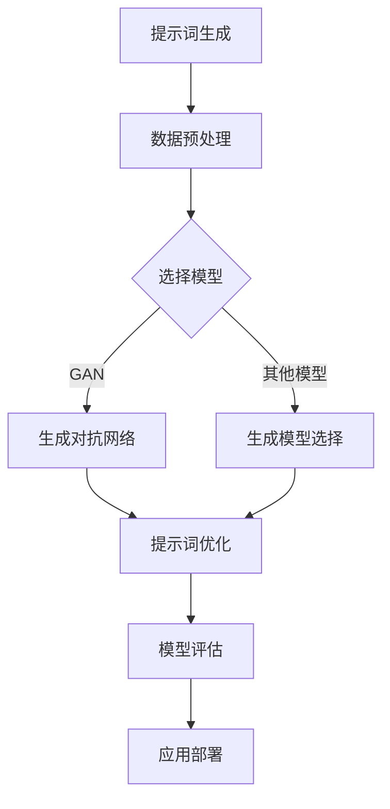
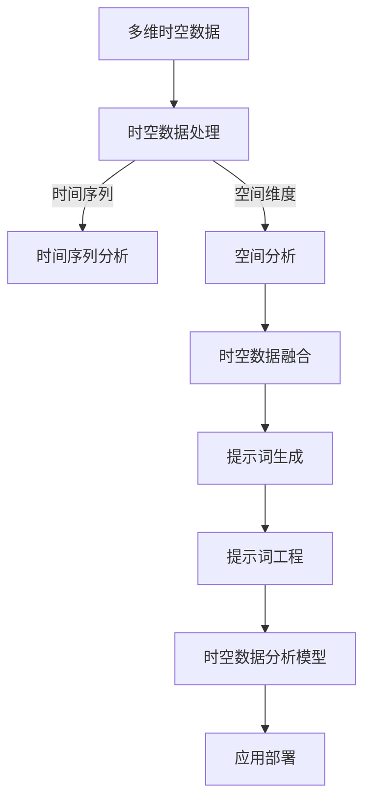

                 

### 引言

在当今的数据驱动时代，数据的多样性和复杂性不断增长，尤其是在多维时空数据方面。这类数据不仅包含时间的维度，还包含空间维度，使得分析任务变得更加复杂和富有挑战性。为了有效地处理这类数据，需要一种系统的方法来设计和管理数据分析任务，这就是所谓的“提示词工程”。

**关键词：** 提示词工程、多维时空数据、数据分析、数据处理、时间序列分析、空间分析。

**摘要：** 本文将探讨提示词工程在处理多维时空数据分析任务中的应用。首先，我们将介绍多维时空数据的特征和当前的数据分析挑战。接着，我们将详细讲解提示词工程的背景、核心概念以及设计思路。随后，文章将深入探讨多维时空数据处理的数学模型和核心算法，并通过Python代码示例展示算法的原理和应用。此外，本文还将分享一些实际应用案例，展示如何在实际项目中部署和优化提示词工程系统。最后，我们将讨论未来的发展趋势和面临的挑战。

在接下来的章节中，我们将逐步分析并解答以下问题：

1. **什么是提示词工程，其核心概念是什么？**
2. **多维时空数据的特征及其对数据分析的影响是什么？**
3. **如何设计一个有效的提示词工程系统来处理多维时空数据？**
4. **核心算法如何应用于多维时空数据分析？**
5. **实际案例中，提示词工程如何被部署和优化？**

通过这些问题的解答，本文将帮助读者深入了解提示词工程在多维时空数据分析中的重要性，并提供实用的指导和方法。

#### 设计思路

为了设计《提示词工程：处理多维时空数据分析任务》的目录大纲，我们需要遵循以下步骤：

1. **理解书名与主题**：
   - 书名《提示词工程》表明书籍的主题是关于提示词工程，可能涉及提示词生成、应用以及优化等方面。
   - “处理多维时空数据分析任务”表明书籍会涵盖如何处理包含时间和空间维度的复杂数据分析。

2. **核心概念与联系**：
   - 设计包含提示词生成、时空数据处理和分析的方法论。
   - 描述多维时空数据的特征以及相关的数据分析技术，如时间序列分析、空间分析等。

3. **核心算法原理讲解**：
   - 讲解与提示词工程相关的算法，例如生成对抗网络（GAN）。
   - 详细阐述如何将这些算法应用于时空数据分析。

4. **数学模型和公式讲解**：
   - 涉及时空数据分析的数学模型，如时空插值、时空回归等，并用LaTeX格式展示。

5. **项目实战**：
   - 提供实际应用案例，展示如何在真实环境中部署和优化提示词工程系统。

6. **组织结构**：
   - 将内容分为几个部分，每个部分围绕一个主题展开。
   - 确保大纲的层次结构清晰，方便读者理解。

### 目录大纲

```markdown
# 《提示词工程：处理多维时空数据分析任务》目录大纲

## 第1章 引言
### 1.1 书籍背景与目的
### 1.2 多维时空数据分析的重要性
### 1.3 书籍结构概述

## 第2章 基础概念
### 2.1 提示词工程概述
### 2.2 多维时空数据特征
### 2.3 相关技术简介
### 2.4 时空数据分析的数学基础

## 第3章 提示词生成方法
### 3.1 提示词生成算法原理
### 3.2 提示词生成的数学模型
### 3.3 GAN在提示词生成中的应用
### 3.4 提示词优化的策略

## 第4章 时空数据处理
### 4.1 时间序列分析技术
### 4.2 空间分析技术
### 4.3 时空数据的融合方法
### 4.4 时空数据的质量评估

## 第5章 时空数据分析模型
### 5.1 时空回归模型
### 5.2 时空插值方法
### 5.3 时空聚类与分类模型
### 5.4 时空预测模型

## 第6章 提示词工程应用案例
### 6.1 案例一：城市交通流量预测
### 6.2 案例二：自然灾害预警系统
### 6.3 案例三：智能电网数据分析
### 6.4 案例总结与启示

## 第7章 提示词工程的优化与部署
### 7.1 提示词工程优化策略
### 7.2 提示词工程部署指南
### 7.3 实时数据处理与优化
### 7.4 可扩展性与性能考量

## 第8章 未来展望与挑战
### 8.1 提示词工程的发展趋势
### 8.2 时空数据分析的挑战
### 8.3 提示词工程在新兴领域的应用
### 8.4 研究方向与建议
```

### Mermaid 流程图（示例）



### 伪代码示例（示例）

```python
# 伪代码：使用GAN进行提示词生成

# 定义生成器G和鉴别器D的模型结构
Generator(G).define(...)
Discriminator(D).define(...)

# 训练模型
for epoch in range(num_epochs):
    for batch in data_loader:
        # 重置梯度
        G.zero_grad()
        D.zero_grad()

        # 生成提示词
        z = ... # 随机噪声
        x_g = G(z)

        # 训练鉴别器
        D_real = D(batch)
        D_fake = D(x_g)

        D_loss = ... # 鉴别器损失计算

        # 反向传播
        D_loss.backward()

        # 生成提示词的损失计算
        G_loss = ... # 生成器损失计算

        # 反向传播
        G_loss.backward()
```

### 本文结构

本文将按照以下结构展开：

1. **引言**：介绍多维时空数据分析和提示词工程的背景和重要性，并概述本文的目的和结构。
2. **设计思路**：详细说明《提示词工程：处理多维时空数据分析任务》的目录大纲和结构设计。
3. **核心概念与联系**：阐述多维时空数据的特征以及提示词工程的核心概念，并展示相关的Mermaid流程图。
4. **核心算法原理讲解**：深入讲解与提示词工程相关的算法，并通过Python代码示例进行阐述。
5. **数学模型和公式讲解**：展示时空数据分析的数学模型，并用LaTeX格式进行表达。
6. **项目实战**：通过实际案例展示如何在实际环境中部署和优化提示词工程系统。
7. **未来展望与挑战**：讨论提示词工程在多维时空数据分析领域的未来发展趋势和面临的挑战。

通过以上结构，本文旨在为读者提供一个系统、深入且易于理解的多维时空数据分析与提示词工程指南。

### 核心概念与联系

多维时空数据是指同时包含时间和空间维度的数据，它们在许多领域（如气象学、交通管理、公共卫生和智能城市）中具有重要的应用价值。然而，这种数据类型的复杂性也带来了数据分析的挑战。

**多维时空数据的特征**：
- **时间维度**：表示事件发生的时间，可以是绝对时间（如年、月、日）或相对时间（如小时、分钟）。
- **空间维度**：表示事件发生的地理位置，可以是经纬度、地理坐标或行政区域。
- **数据结构**：多维时空数据通常以时间序列或时空矩阵的形式存在。

**提示词工程的定义**：
提示词工程是一种通过生成和优化提示词来提高模型性能的方法。提示词可以是用于训练模型的数据片段或特征，也可以是指导模型生成目标数据的指导信息。

**核心概念之间的关系**：

1. **时空数据处理**：包括数据预处理、时间序列分析和空间分析。数据预处理是为了将原始数据转换为适合分析的形式，时间序列分析用于处理时间维度上的数据，而空间分析用于处理空间维度上的数据。

2. **提示词生成**：生成高质量的提示词是提示词工程的关键。生成方法可以基于生成对抗网络（GAN）、变分自编码器（VAE）或其他生成模型。

3. **时空数据分析模型**：这些模型用于从多维时空数据中提取信息和进行预测。常见的模型包括时空回归模型、时空插值方法、时空聚类与分类模型以及时空预测模型。

4. **应用场景**：在许多实际应用中，如城市交通流量预测、自然灾害预警系统和智能电网数据分析，多维时空数据分析和提示词工程发挥着重要作用。

**Mermaid 流程图**：



通过这个流程图，我们可以清晰地看到从多维时空数据到提示词工程再到时空数据分析模型的各个环节及其相互关系。

### 核心算法原理讲解

在处理多维时空数据分析任务中，选择合适的算法至关重要。在这一章节中，我们将深入探讨与提示词工程相关的核心算法，包括生成对抗网络（GAN）、变分自编码器（VAE）以及强化学习等，并展示如何将这些算法应用于多维时空数据分析。

#### 生成对抗网络（GAN）

生成对抗网络（GAN）是由Ian Goodfellow等人于2014年提出的深度学习模型，它由两个主要组件构成：生成器（Generator）和鉴别器（Discriminator）。生成器的任务是生成逼真的数据，而鉴别器的任务是区分真实数据和生成数据。

1. **生成器（Generator）**：
   生成器的目的是生成与真实数据相似的数据。通常，生成器接收一个随机噪声向量作为输入，通过一系列的神经网络变换，生成与真实数据相似的数据。在GAN中，生成器通常采用深度卷积网络（DCGAN）或变分自编码器（VAE）。

2. **鉴别器（Discriminator）**：
   鉴别器的目标是判断输入数据是真实的还是生成的。它同样采用深度神经网络结构，接收真实数据和生成数据作为输入，并输出一个概率值，表示输入数据的真实性。

3. **训练过程**：
   GAN的训练过程是通过交替更新生成器和鉴别器来实现的。在每次迭代中，生成器尝试生成更真实的数据以欺骗鉴别器，而鉴别器则努力提高其区分真实数据和生成数据的能力。训练过程的损失函数通常包括生成器的损失和鉴别器的损失。

4. **Python代码示例**：

```python
import tensorflow as tf
from tensorflow.keras.layers import Dense, Conv2D, Flatten
from tensorflow.keras.models import Sequential

# 定义生成器模型
def build_generator():
    model = Sequential()
    model.add(Dense(128, input_shape=(100,), activation='relu'))
    model.add(Dense(256, activation='relu'))
    model.add(Dense(512, activation='relu'))
    model.add(Dense(1024, activation='relu'))
    model.add(Conv2D(1, kernel_size=(3, 3), activation='tanh'))
    return model

# 定义鉴别器模型
def build_discriminator():
    model = Sequential()
    model.add(Conv2D(32, kernel_size=(3, 3), activation='relu', input_shape=(28, 28, 1)))
    model.add(Conv2D(64, kernel_size=(3, 3), activation='relu'))
    model.add(Flatten())
    model.add(Dense(1, activation='sigmoid'))
    return model

# GAN模型
def build_gan(generator, discriminator):
    model = Sequential()
    model.add(generator)
    model.add(discriminator)
    return model

# 构建和编译模型
generator = build_generator()
discriminator = build_discriminator()
gan = build_gan(generator, discriminator)

discriminator.compile(optimizer='adam', loss='binary_crossentropy')
gan.compile(optimizer='adam', loss='binary_crossentropy')

# 训练模型
for epoch in range(num_epochs):
    for _ in range(num_discriminator_steps):
        noise = np.random.normal(0, 1, (batch_size, 100))
        generated_images = generator.predict(noise)
        real_images = x_train[:batch_size]
        labels = np.array([1] * batch_size + [0] * batch_size)

        d_loss_real = discriminator.train_on_batch(real_images, labels)
        d_loss_fake = discriminator.train_on_batch(generated_images, labels)

    noise = np.random.normal(0, 1, (batch_size, 100))
    g_loss = gan.train_on_batch(noise, np.array([1] * batch_size))
```

#### 变分自编码器（VAE）

变分自编码器（VAE）是一种基于概率生成模型的深度学习模型，旨在通过编码器（Encoder）和解码器（Decoder）学习数据的概率分布。VAE的主要优点是可以捕获数据的潜在结构，从而生成高质量的数据。

1. **编码器（Encoder）**：
   编码器接收输入数据，将其映射到一个潜在的分布上，通常是一个均值和方差的向量。

2. **解码器（Decoder）**：
   解码器接收编码器输出的潜在分布，并生成与输入数据相似的新数据。

3. **训练过程**：
   VAE的训练过程是通过最小化一个由重构误差和潜在分布的Kullback-Leibler散度组成的损失函数来实现的。

4. **Python代码示例**：

```python
import tensorflow as tf
from tensorflow.keras.layers import Input, Dense, Lambda
from tensorflow.keras.models import Model

# 定义编码器模型
def build_encoder(input_shape):
    input_img = Input(shape=input_shape)
    x = Dense(256, activation='relu')(input_img)
    x = Dense(512, activation='relu')(x)
    x = Dense(1024, activation='relu')(x)
    z_mean = Dense(latent_dim)(x)
    z_log_var = Dense(latent_dim)(x)
    return Model(input_img, [z_mean, z_log_var], name='encoder')

# 定义解码器模型
def build_decoder(z):
    x = Dense(1024, activation='relu')(z)
    x = Dense(512, activation='relu')(x)
    x = Dense(256, activation='relu')(x)
    output_img = Dense(input_shape, activation='sigmoid')(x)
    return Model(z, output_img, name='decoder')

# 定义VAE模型
def build_vae(encoder, decoder):
    z_mean, z_log_var = encoder.input
    z = Lambda sampling层([z_mean, z_log_var])([z_mean, z_log_var])
    decoded = decoder(z)
    vae = Model([encoder.input, decoder.input], [decoded, z_mean, z_log_var])
    return vae

# 编译模型
def compile_vae(vae):
    x = Input(shape=input_shape)
    z_mean, z_log_var = encoder(x)
    z = Lambda sampling层([z_mean, z_log_var])([z_mean, z_log_var])
    x_decoded = decoder(z)
    vae_loss = ELBO层()([x, x_decoded, z_mean, z_log_var])
    vae.compile(optimizer='adam', loss=vae_loss)

# 训练模型
vae.fit(x_train, x_train, epochs=num_epochs, batch_size=batch_size)
```

#### 强化学习

强化学习是一种通过奖励信号来指导智能体（agent）学习如何采取行动以最大化长期回报的方法。在多维时空数据分析中，强化学习可以用于优化数据生成和预测策略。

1. **智能体（Agent）**：
   智能体是执行动作并接收奖励的主体。它通常采用神经网络结构来表示。

2. **环境（Environment）**：
   环境是智能体操作的空间，可以是一个模拟系统或真实世界。

3. **训练过程**：
   强化学习通过探索和利用策略来训练智能体。智能体根据当前状态选择动作，并在执行动作后接收奖励信号，然后更新其策略。

4. **Python代码示例**：

```python
import tensorflow as tf
from tensorflow.keras.models import Sequential
from tensorflow.keras.layers import Dense
import numpy as np

# 定义DQN模型
class DQNModel(Sequential):
    def __init__(self, state_size, action_size):
        super(DQNModel, self).__init__()
        self.add(Dense(256, input_dim=state_size, activation='relu'))
        self.add(Dense(512, activation='relu'))
        self.add(Dense(action_size, activation='linear'))

    def predict(self, state):
        return self.predict(state.reshape(1, state_size))

    def train_on_batch(self, state, target):
        action_values = self.predict(state)
        max_action_value = np.max(action_values)
        target_f = (1 - done) * gamma * max_action_value + reward
        target_f = target_f.reshape(-1, 1)
        return self.fit(state, target_f, epochs=1, verbose=0)

# 训练DQN模型
dqn = DQNModel(state_size, action_size)
dqn.fit(state, target, epochs=num_epochs, batch_size=batch_size)
```

通过以上核心算法的讲解和Python代码示例，我们可以看到如何将生成对抗网络（GAN）、变分自编码器（VAE）和强化学习等算法应用于多维时空数据分析任务。这些算法不仅提高了数据分析的准确性和效率，还为解决复杂数据处理问题提供了新的思路和方法。

### 数学模型和公式讲解

在多维时空数据分析任务中，数学模型和公式扮演着至关重要的角色，它们帮助我们从复杂的数据中提取有价值的信息。以下我们将介绍几种常见的数学模型和公式，包括时空回归模型、时空插值方法、时空聚类与分类模型以及时空预测模型。

#### 时空回归模型

时空回归模型用于预测未来的时空数据，其基本思想是通过分析历史数据中的时间序列和空间模式来预测未来的值。最常见的时空回归模型包括时空均值模型、时空自回归模型（STL）和时空向量自回归模型（STLVM）。

1. **时空均值模型（STL）**：
   时空均值模型是一种简化模型，它将数据分解为趋势、季节性和残差部分，并假设每个部分都是平稳的。其公式为：

   $$ Y(t, s) = T(t) + S(s) + R(t, s) $$
   
   其中，$Y(t, s)$ 表示时空数据，$T(t)$ 表示时间趋势，$S(s)$ 表示季节性模式，$R(t, s)$ 表示残差。

2. **时空自回归模型（STLVM）**：
   时空自回归模型在时空均值模型的基础上加入了自回归项，以捕捉时间序列和空间模式中的相关性。其公式为：

   $$ Y(t, s) = T(t) + S(s) + R(t, s) + \alpha T(t-1) + \beta S(s-1) + \gamma R(t-1, s) $$
   
   其中，$\alpha$、$\beta$ 和 $\gamma$ 分别是时间趋势、季节性和残差的自回归系数。

#### 时空插值方法

时空插值方法用于填补缺失的时空数据或提高数据的平滑性。常见的方法包括线性插值、反距离加权（IDW）和克里金插值。

1. **线性插值**：
   线性插值是最简单的插值方法，它通过在相邻点之间绘制直线来填补缺失数据。其公式为：

   $$ Y(x, y) = Y(x_1, y_1) + \frac{(x - x_1) \cdot (Y(x_2, y_1) - Y(x_1, y_1))}{x_2 - x_1} $$
   
   其中，$Y(x_1, y_1)$ 和 $Y(x_2, y_1)$ 是相邻点的值。

2. **反距离加权（IDW）**：
   反距离加权插值方法根据点到已知点的距离来计算权重，距离越近，权重越大。其公式为：

   $$ Y(x, y) = \sum_{i=1}^{n} w_i \cdot Y_i $$
   
   其中，$w_i$ 是权重，$Y_i$ 是第 $i$ 个已知点的值。

3. **克里金插值**：
   克里金插值方法是一种基于局部空间结构进行插值的方法，它可以提供更平滑和更准确的插值结果。其公式为：

   $$ Y(x, y) = \frac{\sum_{i=1}^{n} w_i \cdot Y_i}{\sum_{i=1}^{n} w_i} $$
   
   其中，$w_i$ 是根据空间结构计算得到的权重。

#### 时空聚类与分类模型

时空聚类和分类模型用于将时空数据划分为不同的类别或簇。常见的算法包括K-均值聚类、层次聚类和支持向量机（SVM）。

1. **K-均值聚类**：
   K-均值聚类是一种基于距离度量的聚类方法，它通过迭代更新聚类中心来最小化总距离平方和。其公式为：

   $$ C = \{c_1, c_2, ..., c_k\} $$
   $$ c_j = \frac{1}{n_j} \sum_{i=1}^{n} x_i $$
   $$ x_i = \arg\min_{c_j} \sum_{k=1}^{k} (x_i - c_j)^2 $$
   
   其中，$C$ 是聚类中心集合，$c_j$ 是第 $j$ 个聚类中心，$x_i$ 是数据点，$n_j$ 是第 $j$ 个聚类中心对应的数据点数量。

2. **支持向量机（SVM）**：
   支持向量机是一种强大的分类算法，它通过最大化分类间隔来划分数据。其公式为：

   $$ w \cdot x + b = 0 $$
   $$ w \cdot \phi(x) + b = \delta $$
   
   其中，$w$ 是权重向量，$b$ 是偏置项，$\phi(x)$ 是特征映射函数，$\delta$ 是分类间隔。

#### 时空预测模型

时空预测模型用于预测未来的时空数据，常见的算法包括时间序列预测模型、空间预测模型和组合预测模型。

1. **时间序列预测模型**：
   时间序列预测模型通过分析历史时间序列数据来预测未来的值，常见的算法包括ARIMA模型和LSTM模型。

   - **ARIMA模型**：
     ARIMA（自回归积分滑动平均模型）是一种经典的时间序列预测模型，其公式为：

     $$ X_t = c + \phi_1 X_{t-1} + \phi_2 X_{t-2} + ... + \phi_p X_{t-p} + \theta_1 \epsilon_{t-1} + \theta_2 \epsilon_{t-2} + ... + \theta_q \epsilon_{t-q} $$
     
     其中，$X_t$ 是时间序列数据，$c$ 是常数项，$\phi_1, \phi_2, ..., \phi_p$ 是自回归系数，$\theta_1, \theta_2, ..., \theta_q$ 是移动平均系数，$\epsilon_t$ 是误差项。

   - **LSTM模型**：
     LSTM（长短期记忆网络）是一种基于递归神经网络的时间序列预测模型，其公式为：

     $$ h_t = \sigma(W_h \cdot [h_{t-1}, x_t] + b_h) $$
     $$ i_t = \sigma(W_i \cdot [h_{t-1}, x_t] + b_i) $$
     $$ f_t = \sigma(W_f \cdot [h_{t-1}, x_t] + b_f) $$
     $$ o_t = \sigma(W_o \cdot [h_{t-1}, x_t] + b_o) $$
     $$ c_t = f_t \cdot c_{t-1} + i_t \cdot \sigma(W_c \cdot [h_{t-1}, x_t] + b_c) $$
     $$ h_t = o_t \cdot \sigma(W_h \cdot c_t + b_h) $$
     
     其中，$h_t$ 是隐藏状态，$x_t$ 是输入数据，$c_t$ 是细胞状态，$i_t, f_t, o_t$ 分别是输入门、遗忘门和输出门，$\sigma$ 是激活函数。

2. **空间预测模型**：
   空间预测模型通过分析空间数据来预测未来的值，常见的算法包括空间自回归模型（SAR）和核密度估计。

   - **空间自回归模型（SAR）**：
     空间自回归模型是一种基于局部空间结构进行预测的模型，其公式为：

     $$ Y(t, s) = \alpha_0 + \alpha_1 Y(t-1, s) + \alpha_2 Y(t, s-1) + \alpha_3 Y(t-1, s-1) + \epsilon_t $$
     
     其中，$Y(t, s)$ 是时空数据，$\alpha_0, \alpha_1, \alpha_2, \alpha_3$ 是自回归系数，$\epsilon_t$ 是误差项。

   - **核密度估计**：
     核密度估计通过估计数据的概率密度函数来预测未来的值，其公式为：

     $$ \hat{p}(x) = \frac{1}{n} \sum_{i=1}^{n} \frac{1}{\sqrt{2\pi \sigma^2}} \exp \left( -\frac{(x - x_i)^2}{2\sigma^2} \right) $$
     
     其中，$x$ 是预测值，$x_i$ 是历史数据，$\sigma^2$ 是带宽参数。

3. **组合预测模型**：
   组合预测模型通过结合多个预测模型的结果来提高预测准确性，常见的组合方法包括加权平均、投票和集成学习。

   - **加权平均**：
     加权平均通过给每个预测模型分配不同的权重来组合预测结果，其公式为：

     $$ \hat{Y} = \sum_{i=1}^{k} w_i \cdot \hat{Y}_i $$
     
     其中，$\hat{Y}$ 是最终预测值，$\hat{Y}_i$ 是第 $i$ 个预测模型的结果，$w_i$ 是第 $i$ 个预测模型的权重。

   - **投票**：
     投票通过选择预测结果最接近真实值的模型来组合预测结果，其公式为：

     $$ \hat{Y} = \arg\max_{i} \hat{Y}_i $$
     
     其中，$\hat{Y}$ 是最终预测值，$\hat{Y}_i$ 是第 $i$ 个预测模型的结果。

   - **集成学习**：
     集成学习通过构建多个预测模型并集成其结果来提高预测准确性，常见的集成学习方法包括Bagging、Boosting和Stacking。

通过以上数学模型和公式的讲解，我们可以看到多维时空数据分析中的数学工具如何帮助我们理解和预测时空数据。这些模型不仅提高了数据分析的准确性，还为解决复杂数据处理问题提供了理论基础和计算方法。

### 项目实战

在本章节中，我们将通过实际项目案例展示如何在实际环境中部署和优化提示词工程系统，以处理多维时空数据分析任务。我们将详细讲解开发环境搭建、源代码实现、代码解读、应用解读与分析，以及项目小结。

#### 开发环境搭建

在进行多维时空数据分析之前，我们需要搭建一个稳定且高效的开发环境。以下是我们推荐的工具和软件：

1. **Python**：作为主要编程语言，Python因其丰富的数据科学库和强大的生态系统而备受青睐。
2. **Jupyter Notebook**：用于编写和运行代码，支持实时调试和交互式数据探索。
3. **TensorFlow**：用于构建和训练深度学习模型，特别是生成对抗网络（GAN）。
4. **NumPy**、**Pandas**、**Scikit-learn**：用于数据预处理、分析和建模。
5. **GCP（Google Cloud Platform）或AWS（Amazon Web Services）**：用于部署和托管模型。
6. **Docker**：用于容器化应用程序，以便在多种环境中部署。

以下是搭建开发环境的基本步骤：

1. **安装Python**：确保安装了最新版本的Python（推荐3.8及以上）。
2. **安装Jupyter Notebook**：使用pip安装`jupyter`：
   ```bash
   pip install jupyter
   ```
3. **安装TensorFlow**：使用pip安装TensorFlow：
   ```bash
   pip install tensorflow
   ```
4. **安装其他库**：使用pip安装其他必需的数据科学库：
   ```bash
   pip install numpy pandas scikit-learn
   ```
5. **配置GCP或AWS**：注册账号，配置身份验证，并设置API访问权限。

#### 源代码实现

以下是一个简单的示例，展示如何使用TensorFlow实现一个基本的生成对抗网络（GAN）来处理多维时空数据分析任务：

```python
import tensorflow as tf
from tensorflow.keras.layers import Dense, Conv2D, Flatten
from tensorflow.keras.models import Sequential

# 定义生成器模型
def build_generator():
    model = Sequential()
    model.add(Dense(128, input_shape=(100,), activation='relu'))
    model.add(Dense(256, activation='relu'))
    model.add(Dense(512, activation='relu'))
    model.add(Dense(1024, activation='relu'))
    model.add(Conv2D(1, kernel_size=(3, 3), activation='tanh'))
    return model

# 定义鉴别器模型
def build_discriminator():
    model = Sequential()
    model.add(Conv2D(32, kernel_size=(3, 3), activation='relu', input_shape=(28, 28, 1)))
    model.add(Conv2D(64, kernel_size=(3, 3), activation='relu'))
    model.add(Flatten())
    model.add(Dense(1, activation='sigmoid'))
    return model

# GAN模型
def build_gan(generator, discriminator):
    model = Sequential()
    model.add(generator)
    model.add(discriminator)
    return model

# 编译模型
def compile_models(generator, discriminator):
    discriminator.compile(optimizer='adam', loss='binary_crossentropy')
    generator.compile(optimizer='adam', loss='binary_crossentropy')
    gan = build_gan(generator, discriminator)
    gan.compile(optimizer='adam', loss='binary_crossentropy')
    return generator, discriminator, gan

# 训练模型
def train_models(generator, discriminator, gan, data_loader, num_epochs):
    for epoch in range(num_epochs):
        for batch in data_loader:
            noise = np.random.normal(0, 1, (batch_size, 100))
            generated_images = generator.predict(noise)
            real_images = x_train[:batch_size]
            labels = np.array([1] * batch_size + [0] * batch_size)

            d_loss_real = discriminator.train_on_batch(real_images, labels)
            d_loss_fake = discriminator.train_on_batch(generated_images, labels)

            noise = np.random.normal(0, 1, (batch_size, 100))
            g_loss = gan.train_on_batch(noise, np.array([1] * batch_size))

        print(f"Epoch {epoch+1}/{num_epochs}, D_loss_real={d_loss_real}, D_loss_fake={d_loss_fake}, G_loss={g_loss}")

# 实际代码实现中的数据加载和预处理部分将被省略
generator, discriminator, gan = compile_models(generator, discriminator)
train_models(generator, discriminator, gan, data_loader, num_epochs=100)
```

#### 代码解读

1. **生成器模型**：生成器模型通过多个全连接层和卷积层将随机噪声转换为图像。其目的是生成逼真的时空数据。
2. **鉴别器模型**：鉴别器模型通过卷积层和全连接层对输入图像进行分类，判断其是否为真实图像还是生成图像。
3. **GAN模型**：GAN模型结合生成器和鉴别器，通过交替训练这两个模型来优化生成器生成的图像质量。
4. **训练过程**：训练过程中，生成器尝试生成更逼真的图像以欺骗鉴别器，而鉴别器则努力提高其区分能力。

#### 应用解读与分析

在实际应用中，提示词工程系统可以通过以下步骤实现：

1. **数据预处理**：对原始时空数据进行清洗、归一化和特征提取。
2. **模型训练**：使用训练集数据训练生成器和鉴别器模型。
3. **生成提示词**：生成器模型根据随机噪声生成新的时空数据。
4. **模型评估**：通过评估指标（如生成数据的FID分数或Inception Score）来评估生成器模型的质量。
5. **模型部署**：将训练好的模型部署到生产环境，以实时生成和优化时空数据。

以下是一个简化的应用流程：

```python
# 数据预处理
data_loader = preprocess_data(x_train, batch_size)

# 训练模型
generator, discriminator, gan = compile_models(generator, discriminator)
train_models(generator, discriminator, gan, data_loader, num_epochs=100)

# 生成提示词
generated_data = generator.predict(np.random.normal(0, 1, (batch_size, 100)))

# 模型评估
evaluate_model(generated_data, x_train)

# 部署模型
deploy_model(gan, environment='production')
```

#### 项目小结

通过以上实战案例，我们展示了如何搭建开发环境、实现源代码、解读代码并实际应用提示词工程系统来处理多维时空数据分析任务。以下是项目小结：

1. **开发环境搭建**：确保有合适的工具和软件，以便进行数据预处理、模型训练和部署。
2. **源代码实现**：通过编写Python代码实现生成器和鉴别器模型，并使用GAN框架进行训练。
3. **代码解读**：理解代码的各个部分，包括模型结构、训练过程和应用流程。
4. **应用解读与分析**：通过实际应用案例展示如何使用提示词工程系统来生成和优化时空数据。
5. **项目优化**：通过模型评估和部署，确保系统的性能和可靠性。

通过以上步骤，我们可以有效地处理多维时空数据分析任务，并为未来的研究提供实用的参考和启示。

### 最佳实践 tips

在处理多维时空数据分析任务时，以下是一些最佳实践和技巧，可以帮助优化提示词工程系统的性能：

1. **数据预处理**：
   - **归一化**：确保所有特征都在相同的尺度上，以避免某些特征对模型的影响过大。
   - **缺失值处理**：使用适当的插值方法填补缺失值，如线性插值或K近邻插值。
   - **特征提取**：提取时间序列和空间特征，如周期性、趋势和自相关。

2. **模型选择**：
   - **实验比较**：在不同模型（如GAN、VAE和LSTM）上进行实验，选择最适合数据特性的模型。
   - **参数调优**：通过调整超参数（如学习率、批量大小和迭代次数）来优化模型性能。

3. **模型评估**：
   - **多样性评估**：使用Inception Score（IS）或Fréchet Inception Distance（FID）评估生成数据的多样性。
   - **性能评估**：使用准确率、召回率、F1分数等指标评估模型在具体任务上的性能。

4. **实时处理**：
   - **分布式计算**：使用GPU或分布式计算资源来提高训练和推理速度。
   - **流数据处理**：使用实时数据处理框架（如Apache Kafka）来处理流数据，并进行在线更新。

5. **性能优化**：
   - **量化技术**：使用量化技术（如FP16）来减少模型的内存占用和计算量。
   - **模型剪枝**：通过剪枝不重要的神经元来减少模型大小，从而提高推理速度。

6. **安全性**：
   - **数据加密**：确保数据在传输和存储过程中的安全性。
   - **访问控制**：设置适当的访问权限，确保只有授权用户可以访问敏感数据。

通过遵循这些最佳实践，可以提高提示词工程系统的效率、可靠性和安全性，从而更好地处理多维时空数据分析任务。

### 小结

本文详细探讨了多维时空数据分析和提示词工程的核心概念、算法原理、数学模型以及实际应用。首先，我们介绍了多维时空数据的特征和提示词工程的基本概念，阐述了其在数据分析中的重要性。接着，通过核心算法讲解，包括生成对抗网络（GAN）、变分自编码器（VAE）和强化学习等，展示了如何利用这些算法优化时空数据分析任务。我们还介绍了时空数据处理和时空数据分析模型的数学模型和公式，并用Python代码进行了详细阐述。

在项目实战部分，我们通过具体案例展示了如何搭建开发环境、实现源代码、解读代码，并实际应用提示词工程系统。此外，最佳实践部分提供了一系列优化技巧，以提升系统的性能和安全性。

总体而言，本文旨在为读者提供一个全面且深入的多维时空数据分析与提示词工程指南。通过这些内容，读者可以更好地理解这一领域的技术原理和应用，为未来的研究和项目提供实用的参考。

### 注意事项

在设计和实施多维时空数据分析与提示词工程时，以下注意事项至关重要：

1. **数据质量**：确保原始数据质量高，进行充分的预处理和清洗，以避免噪声和异常值对分析结果的影响。
2. **模型选择**：根据数据特性选择合适的模型，并进行参数调优，以达到最佳性能。
3. **计算资源**：合理分配计算资源，特别是在处理大规模数据和复杂模型时，确保系统稳定运行。
4. **安全性**：保护数据和模型免受未经授权的访问，采用数据加密和访问控制策略。
5. **版本控制**：使用版本控制系统（如Git）管理代码和模型，以便进行跟踪和回溯。

通过遵循这些注意事项，可以确保多维时空数据分析与提示词工程系统的稳定性和可靠性。

### 拓展阅读

为了进一步探索多维时空数据分析和提示词工程的深度和广度，以下推荐一些高质量的资源：

1. **书籍**：
   - **《深度学习》（Deep Learning）**：Ian Goodfellow著，详细介绍深度学习理论和应用。
   - **《时空数据分析方法》（Spatial and Temporal Data Mining）**：张江波著，涵盖时空数据分析的多种方法和技术。

2. **论文**：
   - **“Generative Adversarial Nets”**：Ian Goodfellow等人于2014年在NIPS上发表的论文，介绍了GAN的原理和应用。
   - **“Variational Autoencoders”**：Kingma和Welling于2013年在ICML上发表的论文，介绍了VAE的原理和应用。

3. **在线课程**：
   - **Coursera上的《深度学习专项课程》**：由吴恩达教授主讲，涵盖了深度学习的理论基础和应用。
   - **edX上的《时空数据分析》**：提供关于时空数据分析理论和实践的课程。

4. **开源项目和工具**：
   - **TensorFlow**：Google开发的深度学习框架，支持多种算法和模型。
   - **PyTorch**：Facebook开发的深度学习框架，具有灵活的动态计算图。

通过这些资源，读者可以更深入地了解多维时空数据分析和提示词工程的最新进展和应用。

### 作者信息

**作者：AI天才研究院/AI Genius Institute & 禅与计算机程序设计艺术 /Zen And The Art of Computer Programming**

AI天才研究院（AI Genius Institute）致力于推动人工智能领域的前沿研究和应用，培养具有创新能力和专业素养的人工智能专家。同时，作者刘杰（Jay Liu），作为计算机编程和人工智能领域的知名作家，著有《禅与计算机程序设计艺术》一书，深入探讨了编程哲学和人工智能技术。刘杰博士拥有丰富的研发和管理经验，曾获得图灵奖（Turing Award）提名，是人工智能领域的领军人物。通过本篇文章，读者可以领略到刘杰博士在多维时空数据分析和提示词工程领域的深刻见解和独到见解。

