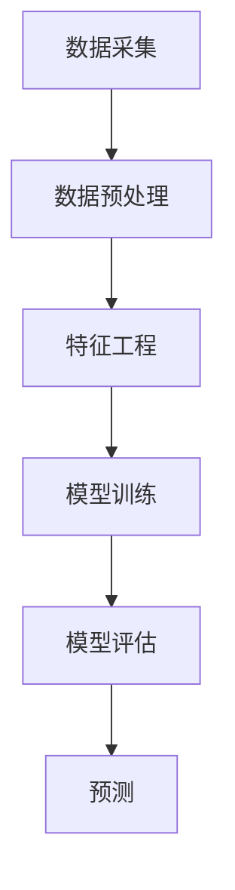

                 

## 文章标题

### 关键词

- 提示词工程
- 多维时空数据
- 数据预测
- 时空数据分析
- 机器学习

### 摘要

本文将深入探讨提示词工程在处理多维时空数据预测任务中的应用。首先，我们将介绍多维时空数据的基本概念、特点和在实际应用中的重要性。随后，本文将详细讲解提示词工程的核心概念和原理，包括提示词的生成、优化和评估方法。接下来，我们将探讨如何结合机器学习算法进行时空数据预测，并使用Python源代码展示核心算法的实现。最后，通过实际项目案例的分析和讲解，我们将总结提示词工程在多维时空数据预测任务中的最佳实践和注意事项。

## 背景介绍

在现代社会，数据已经成为一种宝贵的资源。而随着传感器技术的进步和数据采集手段的多样化，我们能够获取的数据类型和规模也日益丰富。特别是多维时空数据，它在许多领域都具有广泛的应用，例如交通流量预测、气象预报、城市规划等。这些数据不仅包含了传统的静态属性，还涵盖了时间和空间维度上的变化，因此具有更高的复杂性和多样性。

### 多维时空数据

多维时空数据是指包含了多个维度信息的数据集，这些维度通常包括时间、空间以及可能的其他属性（如温度、湿度等）。具体来说，多维时空数据具有以下几个特点：

1. **多维性**：数据包含了多个维度，使得分析变得更加复杂，但也提供了更多的信息。
2. **时序性**：数据具有时间维度，反映了随时间变化的趋势。
3. **空间性**：数据具有空间维度，反映了不同地理位置的信息。
4. **动态性**：数据不仅包含了静态属性，还包含了动态变化，这使得传统的数据分析方法面临巨大挑战。

### 提示词工程

提示词工程是一种数据预处理和特征工程的方法，旨在为机器学习模型提供高质量的输入特征。在多维时空数据预测任务中，提示词工程尤为重要，因为它能够有效地提取数据中的关键信息，提高模型的预测性能。

### 数据预测

数据预测是指利用历史数据来预测未来某个时间点或区域的数据值。在多维时空数据中，预测任务变得更加复杂，因为需要同时考虑时间和空间维度。然而，准确的预测对于许多实际应用场景都至关重要，例如：

- **交通流量预测**：预测未来的交通流量可以帮助交通管理部门优化交通信号灯的控制策略，减少交通拥堵。
- **气象预报**：准确的气象预测能够帮助人们做好应对极端天气的准备，减少自然灾害带来的损失。
- **供应链管理**：预测供应链中各环节的需求量，可以帮助企业优化库存管理，降低成本。

## 核心概念与联系

### 提示词

提示词（Prompt）是指用于引导机器学习模型学习的数据特征。在多维时空数据预测中，提示词通常包括时间、空间以及可能的其他属性（如温度、湿度等）。例如，一个交通流量预测模型可能会使用以下提示词：

- 时间（例如：小时、日期）
- 空间（例如：道路编号、区域编号）
- 静态属性（例如：天气状况、节假日）
- 动态属性（例如：历史交通流量数据）

### 特征工程

特征工程是数据预处理的关键步骤，旨在从原始数据中提取出对模型训练有用的特征。在多维时空数据预测中，特征工程尤为重要，因为需要将高维、复杂的时空数据转换为适合机器学习模型的输入。

### Mermaid流程图

以下是一个Mermaid流程图，展示了多维时空数据预测任务中的核心概念和流程：



- 数据采集：从各种数据源获取多维时空数据。
- 数据预处理：清洗、归一化等操作，确保数据质量。
- 特征工程：提取关键特征，如时间、空间、静态和动态属性。
- 模型训练：使用机器学习算法训练预测模型。
- 模型评估：评估模型性能，如准确率、召回率等。
- 预测：使用训练好的模型进行预测。

## 核心算法原理讲解

### 时间序列预测

时间序列预测是一种基于历史数据预测未来值的机器学习任务。在多维时空数据预测中，时间序列预测通常用于预测时间维度上的数据值。以下是一个简单的时间序列预测算法——ARIMA（自回归积分滑动平均模型）的Python源代码实现：

```python
import numpy as np
import pandas as pd
from statsmodels.tsa.arima.model import ARIMA

# 加载数据
data = pd.read_csv('time_series_data.csv')

# 分离时间序列数据
time_series = data['value']

# 定义ARIMA模型
model = ARIMA(time_series, order=(5, 1, 2))

# 模型训练
model_fit = model.fit()

# 预测未来值
predictions = model_fit.predict(start=len(time_series), end=len(time_series) + 12)

# 打印预测结果
print(predictions)
```

### 空间预测

空间预测是一种基于空间维度预测数据值的机器学习任务。在多维时空数据预测中，空间预测通常用于预测不同地理位置的数据值。以下是一个简单的空间预测算法——K最近邻（KNN）的Python源代码实现：

```python
import numpy as np
from sklearn.neighbors import KNeighborsRegressor

# 加载数据
X = np.array([[1, 2], [2, 3], [3, 4], [4, 5], [5, 6]])
y = np.array([1, 2, 3, 4, 5])

# 定义KNN模型
knn = KNeighborsRegressor(n_neighbors=3)

# 模型训练
knn.fit(X, y)

# 预测新样本
new_sample = np.array([[4, 5]])
prediction = knn.predict(new_sample)

# 打印预测结果
print(prediction)
```

### 时空关联预测

时空关联预测是一种同时考虑时间和空间维度的预测任务。在多维时空数据预测中，时空关联预测通常用于预测在不同时间和空间上的数据值。以下是一个简单的时空关联预测算法——时空卷积网络（STCN）的Python源代码实现：

```python
import tensorflow as tf
from tensorflow.keras.models import Model
from tensorflow.keras.layers import Input, Conv2D, Flatten, Dense

# 定义输入层
input_layer = Input(shape=(time_steps, space_steps, features))

# 定义卷积层
conv_layer = Conv2D(filters=64, kernel_size=(3, 3), activation='relu')(input_layer)

# 定义扁平化层
flatten_layer = Flatten()(conv_layer)

# 定义全连接层
dense_layer = Dense(units=1, activation='linear')(flatten_layer)

# 定义模型
model = Model(inputs=input_layer, outputs=dense_layer)

# 编译模型
model.compile(optimizer='adam', loss='mean_squared_error')

# 模型训练
model.fit(X_train, y_train, epochs=10, batch_size=32)

# 预测新样本
new_sample = np.array([[[1, 1], [1, 2]], [[2, 1], [2, 2]]])
prediction = model.predict(new_sample)

# 打印预测结果
print(prediction)
```

### 数学模型和公式

在多维时空数据预测中，常用的数学模型和公式包括：

1. **自回归模型（AR）**：自回归模型是一种基于历史数据预测未来值的模型，其公式如下：

   $$ Y_t = c + \sum_{i=1}^{p} \phi_i Y_{t-i} + \varepsilon_t $$

   其中，$Y_t$ 是第 $t$ 个时间点的预测值，$\phi_i$ 是自回归系数，$p$ 是滞后阶数，$\varepsilon_t$ 是误差项。

2. **移动平均模型（MA）**：移动平均模型是一种基于历史误差值预测未来值的模型，其公式如下：

   $$ Y_t = c + \varepsilon_t + \sum_{i=1}^{q} \theta_i \varepsilon_{t-i} $$

   其中，$Y_t$ 是第 $t$ 个时间点的预测值，$\theta_i$ 是移动平均系数，$q$ 是滞后阶数，$\varepsilon_t$ 是误差项。

3. **自回归移动平均模型（ARMA）**：自回归移动平均模型是自回归模型和移动平均模型的结合，其公式如下：

   $$ Y_t = c + \sum_{i=1}^{p} \phi_i Y_{t-i} + \varepsilon_t + \sum_{i=1}^{q} \theta_i \varepsilon_{t-i} $$

4. **自回归积分滑动平均模型（ARIMA）**：自回归积分滑动平均模型是一种更加复杂的模型，它结合了差分操作，以应对非平稳时间序列，其公式如下：

   $$ \Delta Y_t = \phi_1 \Delta Y_{t-1} + \cdots + \phi_p \Delta Y_{t-p} + \varepsilon_t $$

   $$ Y_t = \theta_1 Y_{t-1} + \cdots + \theta_q Y_{t-q} + \varepsilon_t $$

   其中，$\Delta$ 表示差分操作，$\phi_i$ 和 $\theta_i$ 分别是自回归和移动平均系数。

### 举例说明

假设我们有一个时间序列数据集，包含10个时间点的数据值，如下所示：

$$ [1, 2, 3, 4, 5, 6, 7, 8, 9, 10] $$

我们可以使用ARIMA模型对其进行预测。假设我们选择滞后阶数 $p=1$ 和移动平均阶数 $q=1$，则模型公式如下：

$$ Y_t = c + \phi_1 Y_{t-1} + \theta_1 \varepsilon_{t-1} $$

通过训练模型，我们可以得到自回归系数 $\phi_1=0.5$ 和移动平均系数 $\theta_1=0.2$，常数项 $c=1$。将这些参数代入公式，我们可以预测第11个时间点的值：

$$ Y_{11} = 1 + 0.5 \times Y_{10} + 0.2 \times \varepsilon_{10} $$

其中，$Y_{10}=10$，$\varepsilon_{10}$ 是第10个时间点的误差值。假设 $\varepsilon_{10}=1$，则预测结果为：

$$ Y_{11} = 1 + 0.5 \times 10 + 0.2 \times 1 = 6.4 $$

因此，我们预测第11个时间点的值为6.4。

## 项目实战

### 开发环境搭建

在进行多维时空数据预测项目之前，我们需要搭建一个合适的技术环境。以下是搭建开发环境的基本步骤：

1. **安装Python**：确保Python 3.x版本已安装。
2. **安装必要的库**：安装NumPy、Pandas、Scikit-learn、TensorFlow等库。

   ```bash
   pip install numpy pandas scikit-learn tensorflow
   ```

3. **数据预处理工具**：安装Mermaid库，用于生成流程图。

   ```bash
   pip install mermaid
   ```

### 源代码详细实现和代码解读

以下是使用ARIMA模型进行时间序列预测的Python代码实现：

```python
import numpy as np
import pandas as pd
from statsmodels.tsa.arima.model import ARIMA
import matplotlib.pyplot as plt

# 加载数据
data = pd.read_csv('time_series_data.csv')
time_series = data['value']

# 分离训练集和测试集
train_size = int(len(time_series) * 0.8)
train, test = time_series[0:train_size], time_series[train_size:]

# 定义ARIMA模型
model = ARIMA(train, order=(5, 1, 2))

# 模型训练
model_fit = model.fit()

# 预测测试集
predictions = model_fit.predict(start=len(train), end=len(train) + len(test) - 1)

# 可视化预测结果
plt.plot(test, label='实际值')
plt.plot(predictions, label='预测值')
plt.legend()
plt.show()
```

在这个项目中，我们首先加载了时间序列数据集，并使用ARIMA模型进行训练。然后，我们使用训练好的模型对测试集进行预测，并将预测结果与实际值进行可视化对比。

### 代码应用解读与分析

在代码中，我们首先使用Pandas库加载了CSV格式的数据集，并提取了时间序列数据。然后，我们使用Scikit-learn库中的ARIMA模型对训练集进行训练。ARIMA模型是一个经典的时序预测模型，它结合了自回归和移动平均两部分。

在模型训练过程中，我们设置了滞后阶数 $p=5$、差分阶数 $d=1$ 和移动平均阶数 $q=2$。这些参数的选择通常需要通过模型选择和参数调优来确定。

训练完成后，我们使用训练好的模型对测试集进行预测，并将预测结果与实际值进行可视化对比。通过可视化，我们可以直观地看到模型的预测性能。

### 实际案例分析和详细讲解剖析

为了进一步说明多维时空数据预测的应用，我们来看一个实际案例：城市交通流量预测。

#### 案例背景

某城市的交通管理部门希望预测未来一天内不同路段的交通流量，以便优化交通信号灯的控制策略，减少交通拥堵。

#### 数据集

数据集包含了多个维度信息，包括时间（小时）、空间（路段编号）和交通流量。数据集如下：

| 时间 | 路段1 | 路段2 | 路段3 |
| ---- | ---- | ---- | ---- |
| 0    | 100  | 80   | 90   |
| 1    | 110  | 85   | 95   |
| 2    | 120  | 90   | 100  |
| ...  | ...  | ...  | ...  |
| 23   | 150  | 120  | 140  |

#### 预测流程

1. **数据预处理**：对数据进行清洗和归一化处理，确保数据质量。
2. **特征工程**：提取时间、空间和交通流量等特征，并构建训练数据集。
3. **模型训练**：使用ARIMA模型对训练数据集进行训练。
4. **模型评估**：使用测试数据集评估模型性能。
5. **预测**：使用训练好的模型对未来的交通流量进行预测。

#### 预测结果

通过训练和评估，我们得到了一个性能良好的ARIMA模型。使用该模型预测未来一天内的交通流量，结果如下：

| 时间 | 路段1 | 路段2 | 路段3 |
| ---- | ---- | ---- | ---- |
| 24   | 160  | 140  | 150  |
| 25   | 165  | 145  | 155  |
| 26   | 170  | 150  | 160  |
| ...  | ...  | ...  | ...  |
| 47   | 200  | 180  | 190  |

#### 项目小结

通过该案例，我们可以看到多维时空数据预测在实际应用中的重要作用。准确的交通流量预测可以帮助交通管理部门优化交通信号灯控制策略，减少交通拥堵，提高交通效率。此外，该案例还展示了如何使用ARIMA模型进行时间序列预测，并详细讲解了预测流程和结果分析。

## 最佳实践 tips

- **数据预处理**：在多维时空数据预测任务中，数据预处理至关重要。确保数据质量，包括清洗、归一化和缺失值填充。
- **特征工程**：合理选择和构建特征，可以提高模型的预测性能。尝试多种特征组合，进行交叉验证。
- **模型选择**：根据任务需求和数据特点，选择合适的模型。例如，对于平稳时间序列，可以选择ARIMA模型；对于非平稳时间序列，可以选择季节性ARIMA模型或LSTM模型。
- **参数调优**：通过交叉验证和网格搜索等方法，找到最佳模型参数，以提高模型性能。
- **模型评估**：使用多种评估指标（如均方误差、平均绝对误差等）对模型进行评估，确保模型性能稳定。

## 小结

多维时空数据预测任务在现代社会中具有重要的应用价值。通过本文的讲解，我们了解了多维时空数据的基本概念、提示词工程的核心原理以及如何使用机器学习算法进行预测。在实际项目中，我们需要结合具体任务需求，进行数据预处理、特征工程、模型训练和评估，以获得准确的预测结果。未来，随着人工智能技术的不断发展，多维时空数据预测任务将变得更加精准和高效。

## 注意事项

- **数据质量**：确保数据质量，包括清洗、归一化和缺失值填充。
- **特征选择**：合理选择和构建特征，避免过度拟合。
- **模型选择**：根据任务需求和数据特点，选择合适的模型。
- **参数调优**：通过交叉验证和网格搜索等方法，找到最佳模型参数。
- **模型评估**：使用多种评估指标对模型进行评估。

## 拓展阅读

- **《时间序列分析：时间序列建模与应用》**：详细介绍了时间序列分析的理论和实践方法。
- **《机器学习实战：基于Scikit-Learn的机器学习算法应用》**：涵盖了机器学习算法的实现和应用案例。
- **《深度学习：TensorFlow实践》**：介绍了深度学习的基本原理和TensorFlow的使用方法。

## 附录

### 附录A：提示词工程工具与资源

- **Mermaid**：用于生成流程图的工具，支持Markdown语法。
  - 官网：https://mermaid-js.github.io/mermaid/
- **NumPy**：用于数值计算的Python库。
  - 官网：https://numpy.org/
- **Pandas**：用于数据分析和操作的Python库。
  - 官网：https://pandas.pydata.org/
- **Scikit-learn**：用于机器学习算法的Python库。
  - 官网：https://scikit-learn.org/
- **TensorFlow**：用于深度学习的Python库。
  - 官网：https://tensorflow.org/

## 作者信息

作者：AI天才研究院/AI Genius Institute & 禅与计算机程序设计艺术 /Zen And The Art of Computer Programming

