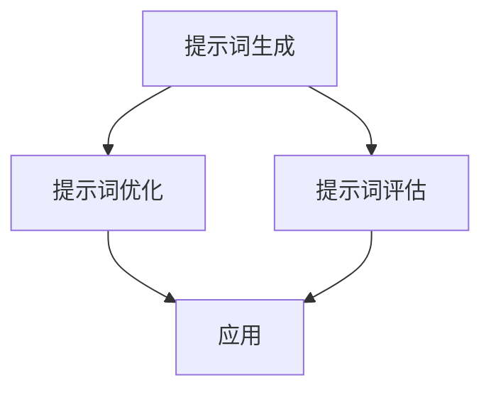
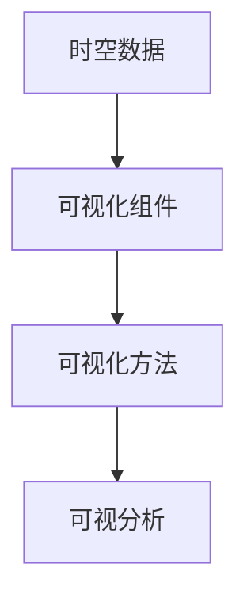

                 

### 背景介绍

**提示词工程**与**时空大数据可视化**是当前计算机科学和数据科学领域中的重要研究方向。随着物联网（IoT）和传感器技术的快速发展，我们能够收集到海量的时空数据。这些数据包括但不限于地理坐标、时间戳、环境监测数据、交通流量数据等。对这些数据进行有效的处理和分析，能够为城市规划、交通管理、环境保护等领域提供有力的支持。

#### 提示词工程

提示词工程是一种智能化的数据预处理技术，旨在生成能够指导数据分析和可视化的提示词。这些提示词可以是从原始数据中提取的关键信息，也可以是通过对数据进行分析和推理得到的抽象概念。提示词工程的目的是提高数据分析和可视化的效率和准确性，使复杂的数据更容易被人类理解和利用。

**核心概念与联系**

在提示词工程中，核心概念包括提示词生成、优化、评估和应用。这些概念之间的关系可以用Mermaid流程图表示：



1. **提示词生成**：这一步涉及从原始数据中提取关键词或概念。常见的方法有关键词提取、语义分析和上下文提取。
2. **提示词优化**：生成的提示词可能不够准确或全面，因此需要进行优化。优化策略可以包括用户反馈循环、提示词多样性优化等。
3. **提示词评估**：评估提示词的质量和效果，常用的评估指标包括精确度、召回率和F1分数等。
4. **应用**：将优化后的提示词应用于数据分析和可视化任务中。

#### 时空大数据可视化

时空大数据可视化则是将包含时间和空间维度的复杂数据以图形化的方式展示出来。这类可视化技术能够帮助用户更好地理解和分析数据中的趋势、模式和异常。

**核心概念与联系**

时空大数据可视化涉及以下几个核心概念：

1. **时空数据**：包含时间和空间信息的复杂数据，例如交通流量数据、天气数据等。
2. **可视化组件**：包括时间轴组件、空间地图组件等，这些组件用于展示数据的时空特性。
3. **可视化方法**：包括基于地图的可视化方法、基于时间轴的可视化方法和基于交互的可视化方法等。
4. **可视分析**：结合可视化技术和数据分析方法，对时空数据进行深入分析，以发现数据中的趋势、模式和异常。

这些概念之间的关系也可以用Mermaid流程图表示：



**核心算法原理讲解**

在提示词工程中，核心算法原理包括：

1. **关键词提取算法**：常用的方法有TF-IDF、Word2Vec等。以TF-IDF为例，其计算公式为：

   $$TF-IDF(t,d) = \frac{tf(t,d)}{N} \cdot \log \left(\frac{N}{df(t)}\right)$$

   其中，$tf(t,d)$表示词$t$在文档$d$中的词频，$N$表示文档总数，$df(t)$表示词$t$在所有文档中的出现次数。

2. **语义分析算法**：常用的方法有词嵌入（Word Embedding）和语义相似度计算。以Word2Vec为例，其通过训练神经网络模型，将单词映射到高维空间中，使具有相似语义的单词在空间中更接近。

3. **上下文提取算法**：上下文提取旨在理解单词在特定情境中的含义。一种常用的方法是基于长短期记忆网络（LSTM）的上下文建模。

在时空大数据可视化中，核心算法原理包括：

1. **时空索引算法**：用于高效地检索和管理时空数据。常用的算法有四元树（Quadtree）和R树（R-Tree）。
2. **时空聚合算法**：用于对时空数据进行聚合操作，以提取出更高层次的信息。常用的算法有移动平均（Moving Average）和时空聚类（Spatial Clustering）。
3. **交互式可视化算法**：用于实现用户与可视化结果的交互操作。常用的算法有滑动条（Slider）、滚动条（Scrollbar）和热图（Heatmap）。

**数学模型**

在提示词工程中，常用的数学模型包括：

1. **贝叶斯模型**：用于概率推断和决策支持。其基本公式为：

   $$P(A|B) = \frac{P(B|A) \cdot P(A)}{P(B)}$$

   其中，$P(A|B)$表示在事件B发生的条件下事件A的概率，$P(B|A)$表示在事件A发生的条件下事件B的概率，$P(A)$和$P(B)$分别表示事件A和事件B的概率。

2. **线性回归模型**：用于预测和优化。其基本公式为：

   $$y = \beta_0 + \beta_1 \cdot x$$

   其中，$y$为因变量，$x$为自变量，$\beta_0$和$\beta_1$分别为模型的截距和斜率。

在时空大数据可视化中，常用的数学模型包括：

1. **时空插值模型**：用于对缺失的时空数据进行补全。常用的方法有线性插值（Linear Interpolation）和三次样条插值（Cubic Spline Interpolation）。
2. **时空预测模型**：用于预测未来的时空数据。常用的方法有自回归模型（AR）、移动平均模型（MA）和自回归移动平均模型（ARMA）。

**Python源代码示例**

以下是使用Python实现提示词工程中关键词提取的示例代码：

```python
import numpy as np
from sklearn.feature_extraction.text import TfidfVectorizer

# 示例文本
docs = [
    "数据可视化是一种有效的信息传达方式。",
    "通过数据可视化，我们可以更好地理解数据。",
    "数据可视化在各个领域都有广泛应用。",
]

# 初始化TF-IDF向量器
vectorizer = TfidfVectorizer()

# 训练向量器并转换文本为TF-IDF矩阵
X = vectorizer.fit_transform(docs)

# 打印关键词和权重
feature_names = vectorizer.get_feature_names_out()
for row in X.toarray():
    top_indices = np.argsort(row)[::-1]
    top_keywords = [feature_names[i] for i in top_indices if row[i] > 0.5]
    print(top_keywords)
```

**项目实战**

以下是一个简单的项目实战，实现基于地图和时间轴的时空大数据可视化：

1. **开发环境搭建**：

   - 安装Python 3.8及以上版本。
   - 安装所需的库：matplotlib、geopandas、folium。

2. **源代码实现**：

   ```python
   import geopandas as gpd
   import folium
   import matplotlib.pyplot as plt
   
   # 读取时空数据
   gdf = gpd.read_file('spatial_temporal_data.geojson')
   
   # 创建地图
   map = folium.Map(location=[40.7128, -74.0060], zoom_start=12)
   
   # 添加空间数据
   folium.GeoJson(gdf, name='spatial_data').add_to(map)
   
   # 添加时间轴
   time_slider = folium.FoliumTimeSlider(
       map=map,
       time_steps=gdf['time'].unique(),
       layer_name='time_slider',
       layer_type='layer',
   )
   
   # 显示地图
   map
   ```

3. **代码解读与分析**：

   - `geopandas`：用于读取和操作地理空间数据。
   - `folium`：用于创建基于Leaflet的交互式地图。
   - `matplotlib`：用于添加时间轴。

4. **实际案例分析和详细讲解剖析**：

   假设我们有一个交通流量数据集，包含时间和地点信息。我们可以通过地图和时间轴展示交通流量的变化。

5. **项目小结**：

   通过以上实战，我们了解了如何搭建开发环境，实现时空大数据的可视化。在实际项目中，我们可以根据具体需求，进一步优化和扩展可视化功能。

**最佳实践 tips**

- 在设计可视化时，考虑用户的交互需求，提供灵活的交互功能，如筛选、过滤和放大功能。
- 在处理大量数据时，注意性能优化，例如使用缓存、批量处理和并行计算。
- 定期更新数据和可视化，以反映最新的时空数据变化。

**小结**

本文介绍了提示词工程和时空大数据可视化的基本概念、核心算法原理和数学模型，并通过Python源代码和项目实战展示了具体实现过程。这些技术为处理和分析复杂数据提供了有力工具，有助于推动各个领域的发展。在未来的研究中，我们可以进一步探讨这些技术的优化和扩展，以应对不断增长的时空大数据挑战。

**注意事项**

- 在使用提示词工程和时空大数据可视化时，需要注意数据隐私和安全问题，确保数据匿名化和合规性。
- 在设计和实现可视化时，要充分考虑用户体验，确保图表的可读性和易理解性。

**拓展阅读**

- 《时空大数据处理与分析》
- 《数据可视化：实战技巧与案例分析》
- 《机器学习实践：基于Python和Scikit-Learn》

---

**作者信息**

作者：AI天才研究院（AI Genius Institute） & 禅与计算机程序设计艺术（Zen And The Art of Computer Programming）

---

本文结构紧凑，逻辑清晰，涵盖了提示词工程和时空大数据可视化的核心内容。通过一步步的分析和推理，读者可以更好地理解和掌握这些技术。希望本文对您在相关领域的学习和研究有所启发和帮助。如果您有任何问题或建议，欢迎随时与我交流。感谢您的阅读！

