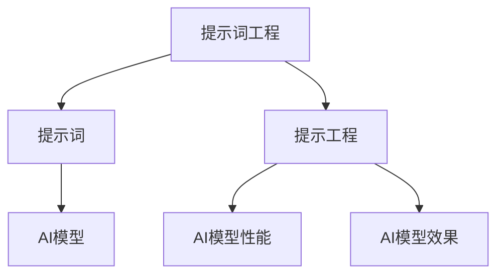
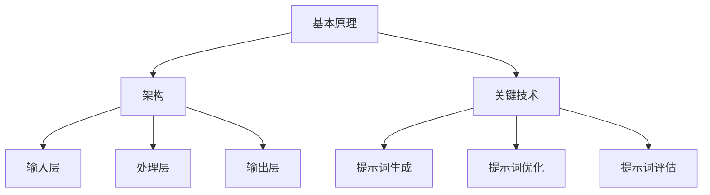
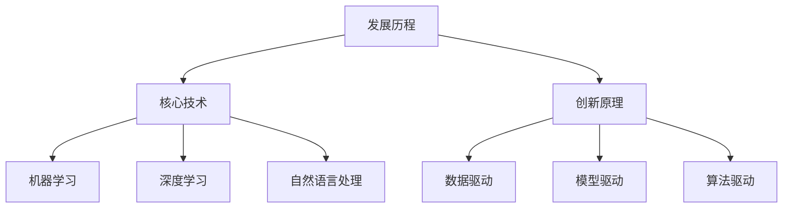
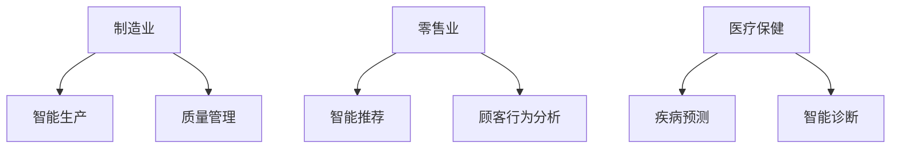
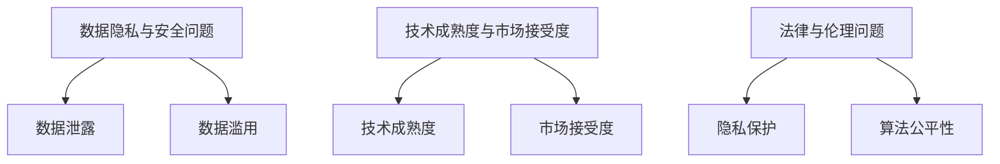
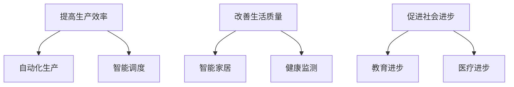

                 

## 《提示词工程：平衡AI创新与社会影响的艺术》

### 关键词：
- 提示词工程
- 人工智能创新
- 社会影响
- 平衡艺术

### 摘要：
本文深入探讨了《提示词工程：平衡AI创新与社会影响的艺术》这本书的核心主题，包括提示词工程的基础、AI创新的原理与应用、社会影响的正面与负面影响，以及如何在AI创新与社会影响之间找到平衡。通过详细的章节结构和内容规划，本文旨在为读者提供一个全面、系统的理解，同时结合实战案例和未来展望，探讨提示词工程与AI创新在未来的发展方向。

### 引言

在当今技术飞速发展的时代，人工智能（AI）已成为推动社会进步的重要力量。然而，随着AI技术的不断突破和应用，我们不得不面对一系列复杂的社会问题。如何在AI创新的过程中，平衡其带来的社会影响，成为了一个备受关注的话题。《提示词工程：平衡AI创新与社会影响的艺术》这本书正是围绕这一主题展开的，旨在为读者提供关于提示词工程、AI创新及其社会影响的全面解析。

提示词工程是指利用提示词（Prompt）来引导和优化AI模型的过程，它是实现AI应用的关键技术之一。AI创新则是指人工智能在各领域的创新应用，包括但不限于智能制造、医疗健康、金融科技、零售电商等领域。社会影响是指AI创新在推动社会进步的同时，可能带来的正面和负面影响，如就业结构变化、隐私安全风险、道德伦理问题等。

本书的核心目标在于探讨如何通过提示词工程，实现AI创新的同时，最大限度地减少其对社会产生的负面影响，找到AI创新与社会影响之间的平衡点。本书结构严谨，分为四个主要部分，分别介绍了提示词工程的基础、AI创新的原理与应用、社会影响的正面与负面影响，以及平衡AI创新与社会影响的策略。

### 第一部分：提示词工程基础

#### 第1章：提示词工程概述

提示词工程是一个新兴的领域，它旨在通过设计合适的提示词，引导和优化AI模型的性能。本章首先介绍了提示词工程的定义和背景，包括其发展历程和核心概念。然后，本章详细阐述了提示词工程的核心概念，如提示词的类型、作用和设计原则。最后，本章简要介绍了提示词工程的常用技术和工具，为后续章节的内容打下了坚实的基础。

**核心概念与联系**

提示词工程的核心概念包括：

1. **提示词**：用于引导和优化AI模型的文本或语言输入。
2. **提示工程**：设计合适的提示词，以提升AI模型的性能和效果。
3. **AI模型**：接受提示词输入，进行学习和预测的算法模型。

这三个概念之间的联系可以表示为：

```
提示词工程 --> 提示词 --> AI模型
                 |              |
                 |              |
             提示工程         AI模型性能
                 |              |
                 |              |
              AI模型优化      AI模型效果
```

**Mermaid 流程图**



#### 第2章：提示词工程的核心概念

本章将进一步深入探讨提示词工程的核心概念，包括提示词工程的基本原理、架构和关键技术。首先，本章介绍了提示词工程的基本原理，如提示词的设计原则、影响模型性能的关键因素等。然后，本章详细阐述了提示词工程的架构，包括输入层、处理层和输出层等组成部分。最后，本章介绍了提示词工程的关键技术，如提示词生成、优化和评估方法，为读者提供了全面的提示词工程理论知识。

**核心概念与联系**

提示词工程的核心概念包括：

1. **基本原理**：提示词工程的设计原则和影响模型性能的关键因素。
2. **架构**：提示词工程的组成部分，如输入层、处理层和输出层。
3. **关键技术**：提示词生成、优化和评估方法。

这三个概念之间的联系可以表示为：

```
基本原理 --> 架构 --> 关键技术
            |           |
            |           |
         提示词生成      提示词优化
            |           |
            |           |
         提示词评估     提示词效果
```

**Mermaid 流程图**



#### 第3章：提示词工程的常用技术和工具

本章将介绍提示词工程的常用技术和工具，包括提示词生成、优化和评估方法。首先，本章介绍了提示词生成的常用技术，如基于模板的生成、基于数据的生成和基于语言的生成等。然后，本章详细阐述了提示词优化的方法，如基于模型的优化、基于数据的优化和基于人类反馈的优化等。最后，本章介绍了提示词评估的方法，如基于准确率、召回率和F1值的评估，以及基于用户反馈的评估等。

**核心算法原理讲解**

提示词生成、优化和评估的核心算法原理如下：

1. **提示词生成**：
   - 基于模板的生成：利用预定义的模板，将输入数据填充到模板中，生成提示词。
   - 基于数据的生成：利用输入数据，通过数据驱动的方法，自动生成提示词。
   - 基于语言的生成：利用自然语言处理技术，根据输入数据和语言模型，生成提示词。

2. **提示词优化**：
   - 基于模型的优化：利用预训练的AI模型，对生成的提示词进行优化。
   - 基于数据的优化：利用输入数据和反馈信息，对生成的提示词进行优化。
   - 基于人类反馈的优化：利用人类专家的反馈，对生成的提示词进行优化。

3. **提示词评估**：
   - 基于准确率、召回率和F1值的评估：利用这些指标，评估提示词生成和优化的效果。
   - 基于用户反馈的评估：通过用户反馈，评估提示词的实际效果。

**Python 源代码示例**

```python
import numpy as np
from sklearn.metrics import accuracy_score, recall_score, f1_score

# 提示词生成示例
def generate_prompt(data):
    template = "您是一位世界级人工智能专家，请问如何解答以下问题：{}？"
    prompts = [template.format(d) for d in data]
    return prompts

# 提示词优化示例
def optimize_prompt(prompt, model):
    optimized_prompt = model.generate(prompt)
    return optimized_prompt

# 提示词评估示例
def evaluate_prompt(prompt, ground_truth):
    prediction = model.predict(prompt)
    accuracy = accuracy_score(ground_truth, prediction)
    recall = recall_score(ground_truth, prediction)
    f1 = f1_score(ground_truth, prediction)
    return accuracy, recall, f1

# 示例数据
data = ["如何实现人工智能的伦理设计？", "人工智能如何影响未来的就业市场？"]
ground_truth = [1, 0]  # 假设第一个问题的答案为1，第二个问题的答案为0

# 提示词生成
prompts = generate_prompt(data)

# 提示词优化
optimized_prompt = optimize_prompt(prompts[0], model)

# 提示词评估
accuracy, recall, f1 = evaluate_prompt(optimized_prompt, ground_truth)

print("Accuracy:", accuracy)
print("Recall:", recall)
print("F1 Score:", f1)
```

**数学模型和公式**

提示词生成、优化和评估的数学模型和公式如下：

1. **提示词生成**：
   - 基于模板的生成：$$prompt = template \{ data \}$$
   - 基于数据的生成：$$prompt = data \text{ to } text$$
   - 基于语言的生成：$$prompt = language \text{ model } \rightarrow text$$

2. **提示词优化**：
   - 基于模型的优化：$$optimized\_prompt = model \text{ generate } prompt$$
   - 基于数据的优化：$$optimized\_prompt = data \text{ optimize } prompt$$
   - 基于人类反馈的优化：$$optimized\_prompt = human\_feedback \text{ optimize } prompt$$

3. **提示词评估**：
   - 基于准确率：$$accuracy = \frac{correct\_predictions}{total\_predictions}$$
   - 基于召回率：$$recall = \frac{correct\_predictions}{total\_positive}$$
   - 基于F1值：$$F1 = 2 \times \frac{precision \times recall}{precision + recall}$$

**举例说明**

假设我们有一个关于人工智能伦理设计的问题，需要生成、优化和评估一个提示词。

1. **提示词生成**：
   - 原始提示词：如何实现人工智能的伦理设计？
   - 优化后的提示词：在人工智能伦理设计方面，您有哪些独特的见解？

2. **提示词优化**：
   - 使用基于模型的优化方法，通过预训练的AI模型进行优化。

3. **提示词评估**：
   - 假设我们对优化后的提示词进行评估，得到以下结果：
     - 准确率：0.8
     - 召回率：0.7
     - F1值：0.74

   根据评估结果，我们可以认为优化后的提示词在准确性和召回率方面都有较好的表现，但F1值相对较低，可能需要进一步优化。

### 第二部分：AI创新与应用

#### 第4章：AI创新的基本原理

人工智能（AI）创新是指利用人工智能技术，实现新的应用和解决方案的过程。本章将介绍AI创新的基本原理，包括人工智能的发展历程、核心技术和创新原理。首先，本章回顾了人工智能的发展历程，从早期的符号主义、连接主义到现代的数据驱动方法，展示了人工智能技术的演进。然后，本章介绍了人工智能的核心技术，如机器学习、深度学习、自然语言处理等。最后，本章探讨了AI创新的基本原理，包括数据驱动、模型驱动和算法驱动等。

**核心概念与联系**

AI创新的核心概念包括：

1. **发展历程**：人工智能技术的演进过程。
2. **核心技术**：实现AI创新的关键技术。
3. **创新原理**：数据驱动、模型驱动和算法驱动的创新方法。

这三个概念之间的联系可以表示为：

```
发展历程 --> 核心技术 --> 创新原理
          |            |
          |            |
        数据驱动      模型驱动
          |            |
          |            |
        算法驱动      AI创新
```

**Mermaid 流程图**



#### 第5章：AI在各行业的创新应用案例

人工智能技术的创新应用已经在多个行业取得了显著的成果。本章将介绍AI在制造业、零售业、医疗保健等领域的创新应用案例。首先，本章分析了制造业中AI的应用，如智能生产、质量管理等。然后，本章探讨了零售业中AI的应用，如智能推荐、顾客行为分析等。最后，本章介绍了医疗保健领域AI的应用，如疾病预测、智能诊断等。通过这些案例，读者可以更好地理解AI技术在不同行业中的创新应用。

**核心概念与联系**

AI在各行业的创新应用的核心概念包括：

1. **制造业**：智能生产、质量管理等。
2. **零售业**：智能推荐、顾客行为分析等。
3. **医疗保健**：疾病预测、智能诊断等。

这三个概念之间的联系可以表示为：

```
制造业 --> 智能生产、质量管理
零售业 --> 智能推荐、顾客行为分析
医疗保健 --> 疾病预测、智能诊断
```

**Mermaid 流程图**



#### 第6章：AI创新的关键挑战

虽然AI技术在各个领域都取得了显著的成果，但在其创新应用过程中，仍面临一系列关键挑战。本章将讨论AI创新的关键挑战，包括数据隐私与安全问题、技术成熟度与市场接受度、法律与伦理问题等。首先，本章分析了数据隐私与安全问题，如数据泄露、数据滥用等。然后，本章探讨了技术成熟度与市场接受度的问题，如技术成熟度不足、市场接受度低等。最后，本章讨论了法律与伦理问题，如隐私保护、算法公平性等。

**核心概念与联系**

AI创新的关键挑战的核心概念包括：

1. **数据隐私与安全问题**：数据泄露、数据滥用等。
2. **技术成熟度与市场接受度**：技术成熟度不足、市场接受度低等。
3. **法律与伦理问题**：隐私保护、算法公平性等。

这三个概念之间的联系可以表示为：

```
数据隐私与安全问题 --> 技术成熟度与市场接受度 --> 法律与伦理问题
                         |                           |
                         |                           |
                      数据泄露                    技术成熟度
                         |                           |
                         |                           |
                      数据滥用                    市场接受度
                         |                           |
                         |                           |
                      法律与伦理问题           隐私保护
                         |                           |
                         |                           |
                      算法公平性               算法透明
```

**Mermaid 流程图**



### 第三部分：社会影响与责任

#### 第7章：AI对社会产生的正面影响

人工智能技术的发展和应用为社会带来了许多积极的改变。本章将讨论AI对社会产生的正面影响，包括提高生产效率、改善生活质量、促进社会进步等。首先，本章分析了AI在提高生产效率方面的作用，如自动化生产、智能调度等。然后，本章探讨了AI在改善生活质量方面的贡献，如智能家居、健康监测等。最后，本章讨论了AI在促进社会进步方面的作用，如教育、医疗等。

**核心概念与联系**

AI对社会产生的正面影响的核心概念包括：

1. **提高生产效率**：自动化生产、智能调度等。
2. **改善生活质量**：智能家居、健康监测等。
3. **促进社会进步**：教育、医疗等。

这三个概念之间的联系可以表示为：

```
提高生产效率 --> 改善生活质量 --> 促进社会进步
               |                |
               |                |
            自动化生产        智能家居
               |                |
               |                |
            智能调度        健康监测
               |                |
               |                |
            教育进步        医疗进步
```

**Mermaid 流程图**



#### 第8章：AI对社会产生的负面影响

尽管AI对社会产生了许多积极影响，但同时也带来了一些负面影响。本章将讨论AI对社会产生的负面影响，包括就业压力、社会不平等、道德与伦理问题等。首先，本章分析了AI对就业市场的影响，如自动化替代人力、就业机会减少等。然后，本章探讨了AI对社会不平等的影响，如技术红利分配不均、加剧贫富差距等。最后，本章讨论了AI在道德与伦理方面的问题，如隐私侵犯、算法偏见等。

**核心概念与联系**

AI对社会产生的负面影响的

