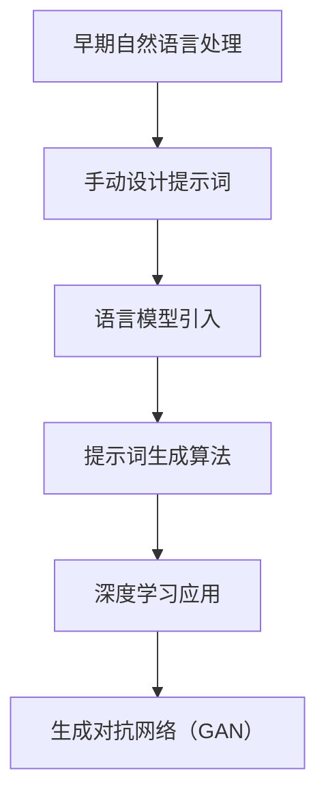

                 

# 《提示词工程：提升LLM性能的核心技术》

## 关键词
自然语言处理，语言模型，提示词生成，提示词优化，大型语言模型（LLM）

## 摘要
本文深入探讨了提示词工程在提升大型语言模型（LLM）性能方面的核心技术。首先，我们对提示词工程进行了概述，并介绍了其重要性。接着，我们详细讲解了提示词生成技术和提示词优化技术，包括提示词生成算法、优化策略和质量评估指标。随后，我们介绍了提示词工程工具与应用，包括自然语言处理、问答系统和智能推荐等应用场景。在实践部分，我们通过一个具体的提示词工程项目展示了从开发环境搭建到提示词生成与优化的全过程，并对项目进行了实验设计和分析。最后，我们分析了提示词工程的发展趋势和面临的挑战与机遇，为未来的研究和应用提供了方向。

## 第一部分 提示词工程基础

### 第1章 提示词工程概述

#### 1.1 提示词的定义与重要性

提示词（prompt words）是指用于引导语言模型生成文本的关键词或短语。在自然语言处理（NLP）领域中，提示词工程是提升大型语言模型（LLM）性能的重要技术之一。其重要性主要体现在以下几个方面：

1. **提高生成文本的质量**：通过精确的提示词，可以引导语言模型生成更加符合预期的高质量文本。
2. **增强交互体验**：在问答系统、聊天机器人等应用中，提示词可以帮助模型更好地理解用户意图，提供更自然的交互体验。
3. **优化训练过程**：有效的提示词可以提高训练数据的质量，减少冗余信息，从而加速训练过程。

#### 1.2 LLM性能提升的需求

随着深度学习和自然语言处理技术的不断发展，大型语言模型（LLM）在文本生成、翻译、摘要等任务中取得了显著的效果。然而，要进一步提升LLM的性能，仍面临以下挑战：

1. **数据质量**：大规模的语言模型需要高质量、丰富的训练数据，而现有的数据集往往存在标注不完整、噪声大等问题。
2. **模型理解**：LLM在生成文本时，往往无法完全理解上下文信息，导致生成的文本偏离期望。
3. **计算资源**：训练大型语言模型需要巨大的计算资源，如何优化资源利用成为关键问题。

#### 1.3 提示词工程的发展历程

提示词工程的历史可以追溯到早期的人工智能研究。在早期的自然语言处理系统中，提示词主要是手动设计的，依赖于领域专家的经验。随着语言模型的发展，提示词工程逐渐成为研究热点。近年来，随着深度学习和生成对抗网络（GAN）等技术的应用，提示词工程取得了显著的进展。

### Mermaid 流程图：提示词工程发展历程



### 第2章 提示词生成技术

#### 2.1 语言模型介绍

语言模型是自然语言处理的核心组成部分，用于预测下一个词或字符。常用的语言模型包括n元语法模型、神经网络语言模型（NNLM）和递归神经网络（RNN）等。在本章中，我们将重点介绍神经网络语言模型（NNLM）。

NNLM是一种基于神经网络的深度学习模型，通过学习大量的文本数据，预测下一个词或字符的概率分布。其基本原理如下：

1. **输入表示**：将输入的文本序列转换为向量表示。常用的方法包括词嵌入（Word Embedding）和字符嵌入（Character Embedding）。
2. **隐藏层**：通过多层神经网络对输入向量进行处理，提取特征信息。
3. **输出层**：将隐藏层的输出映射到下一个词或字符的概率分布。

#### 2.2 提示词生成算法

提示词生成算法是提示词工程的关键技术之一。其目标是通过给定的上下文，生成合适的提示词。常见的提示词生成算法包括基于规则的方法和基于机器学习的方法。

**基于规则的方法**：这种方法依赖于领域专家的经验，通过定义一系列规则来生成提示词。例如，在问答系统中，可以使用关键词提取技术来生成提示词。

**基于机器学习的方法**：这种方法通过学习大量的文本数据，自动生成提示词。常用的算法包括生成对抗网络（GAN）、变分自编码器（VAE）和自编码器（Autoencoder）等。

#### Python 源代码：生成对抗网络（GAN）实现

```python
import tensorflow as tf
from tensorflow.keras.layers import Dense, Flatten, Reshape
from tensorflow.keras.models import Sequential

# 定义生成器模型
def generator_model():
    model = Sequential()
    model.add(Dense(256, input_shape=(100,), activation='relu'))
    model.add(Dense(512, activation='relu'))
    model.add(Dense(1024, activation='relu'))
    model.add(Reshape((28, 28, 1)))
    return model

# 定义判别器模型
def discriminator_model():
    model = Sequential()
    model.add(Flatten(input_shape=(28, 28, 1)))
    model.add(Dense(512, activation='relu'))
    model.add(Dense(256, activation='relu'))
    model.add(Dense(1, activation='sigmoid'))
    return model

# 定义 GAN 模型
def GAN_model(generator, discriminator):
    model = Sequential()
    model.add(generator)
    model.add(discriminator)
    return model

# 构建模型
generator = generator_model()
discriminator = discriminator_model()
GAN = GAN_model(generator, discriminator)

# 编译模型
GAN.compile(optimizer=tf.keras.optimizers.Adam(0.0001), loss='binary_crossentropy')

# 模型总结
GAN.summary()
```

#### 2.3 提示词生成算法的比较

基于规则的方法和基于机器学习的方法各有优缺点。基于规则的方法优点在于简单易实现，但生成提示词的能力有限。基于机器学习的方法可以自动学习数据中的规律，生成更高质量的提示词，但实现复杂度较高。

在实际应用中，可以根据具体场景和需求选择合适的提示词生成算法。例如，在问答系统中，可以使用基于规则的方法生成初始提示词，然后结合基于机器学习的方法进行优化。

### 第3章 提示词优化技术

#### 3.1 提示词优化的意义

提示词优化是提升LLM性能的重要手段。其意义主要体现在以下几个方面：

1. **提高生成文本的质量**：优化后的提示词可以更好地引导语言模型生成高质量、符合预期的文本。
2. **增强模型适应性**：通过优化提示词，可以提高模型在不同场景下的适应性。
3. **降低训练成本**：优化后的提示词可以减少冗余信息，降低训练成本。

#### 3.2 提示词质量评估

提示词质量评估是提示词优化的重要环节。常用的评估指标包括：

1. **文本质量指标**：如文本流畅性、信息性、准确性等。
2. **交互指标**：如用户满意度、交互自然度等。
3. **模型性能指标**：如生成文本的准确性、生成速度等。

评估方法包括人工评估和自动评估。人工评估可以更直观地评估提示词的质量，但成本较高。自动评估可以大规模、高效地评估提示词质量，但结果可能存在偏差。

#### 3.3 提示词优化策略

提示词优化策略主要包括以下几个方面：

1. **规则优化**：根据反馈和评估结果，调整提示词的生成规则。
2. **数据增强**：通过增加训练数据、数据清洗和数据预处理等方法，提高数据质量。
3. **模型调整**：通过调整模型参数、网络结构等方法，提高模型性能。

在实际应用中，可以根据具体需求和场景选择合适的优化策略。例如，在问答系统中，可以使用规则优化和数据增强相结合的方法。

### 第4章 提示词工程工具与应用

#### 4.1 提示词工程工具介绍

提示词工程工具是实施提示词工程的重要工具。常用的提示词工程工具包括：

1. **提示词生成工具**：如OpenAI的GPT-3、Google的BERT等。
2. **提示词优化工具**：如TensorFlow、PyTorch等深度学习框架。
3. **文本处理工具**：如NLTK、spaCy等自然语言处理库。

这些工具提供了丰富的功能和接口，方便开发者进行提示词工程的研究和应用。

#### 4.2 提示词工程应用场景

提示词工程在多个应用场景中取得了显著的效果。以下是一些常见的应用场景：

1. **自然语言处理**：如文本分类、情感分析、命名实体识别等。
2. **问答系统**：如智能客服、智能问答机器人等。
3. **智能推荐**：如基于内容的推荐、协同过滤等。
4. **文本生成**：如自动摘要、自动写作等。

在这些应用场景中，提示词工程发挥着重要的作用，提升了系统的性能和用户体验。

### 第5章 提示词工程项目实战

#### 5.1 项目背景

在本章中，我们将通过一个实际的提示词工程项目，展示如何进行开发环境搭建、提示词生成与优化，并进行实验设计和分析。项目背景如下：

1. **项目目标**：构建一个基于GPT-3的问答系统，实现智能客服功能。
2. **数据来源**：使用公开的问答数据集，如SQuAD。
3. **技术栈**：使用Python和TensorFlow实现。

#### 5.2 开发环境搭建

开发环境搭建是项目成功的关键。以下是搭建开发环境的步骤：

1. **安装Python**：安装Python 3.7及以上版本。
2. **安装TensorFlow**：使用pip安装TensorFlow。
3. **配置GPU支持**：确保系统支持CUDA，并安装CUDA工具包。
4. **安装其他依赖库**：如NLTK、spaCy等。

#### 5.3 提示词生成与优化

提示词生成与优化是问答系统的核心。以下是具体步骤：

1. **数据预处理**：对问答数据集进行清洗和预处理，如去除无关信息、统一文本格式等。
2. **提示词生成**：使用GPT-3生成初始提示词。
3. **提示词优化**：根据问答系统的效果，调整提示词生成策略，提高提示词质量。

#### 5.4 实验设计与分析

实验设计与分析是验证项目效果的重要环节。以下是实验设计的步骤：

1. **实验目标**：验证提示词工程对问答系统性能的提升。
2. **实验方法**：对比实验，分别使用原始数据集和优化后的数据集进行问答测试。
3. **实验结果**：记录问答系统的准确率、响应速度等指标，进行分析和比较。

### 第6章 提示词工程案例分析

在本章中，我们将通过一个具体的案例，展示如何实施提示词工程，并进行详细的分析和讲解。案例背景如下：

1. **案例背景**：构建一个基于BERT的文本分类系统，实现新闻分类功能。
2. **数据来源**：使用公开的新闻数据集，如NYT。
3. **技术栈**：使用Python和PyTorch实现。

#### 6.1 案例实施

案例实施的步骤如下：

1. **数据预处理**：对新闻数据集进行清洗和预处理，如去除HTML标签、统一文本格式等。
2. **模型训练**：使用BERT模型对预处理后的数据集进行训练。
3. **提示词生成与优化**：使用生成的提示词对模型进行优化，提高分类准确率。
4. **模型评估**：使用验证集和测试集对模型进行评估，记录分类准确率、召回率等指标。

#### 6.2 案例效果评估

案例效果评估的步骤如下：

1. **实验设计**：设计一组对比实验，分别使用原始模型和优化后的模型进行分类测试。
2. **实验结果**：记录分类准确率、召回率等指标，进行分析和比较。
3. **结论**：根据实验结果，分析提示词工程对文本分类系统性能的提升。

### 第7章 提示词工程未来展望

#### 7.1 提示词工程的发展趋势

随着深度学习和自然语言处理技术的不断发展，提示词工程在未来将呈现以下趋势：

1. **模型复杂度提升**：随着计算能力的提高，将出现更复杂的语言模型，提示词工程需要适应新的模型结构。
2. **跨模态学习**：提示词工程将向跨模态学习方向发展，实现文本、图像、语音等多种数据类型的统一处理。
3. **自适应学习**：提示词工程将实现自适应学习，根据应用场景和需求，自动调整提示词策略。

#### 7.2 提示词工程的挑战与机遇

提示词工程在未来的发展中将面临以下挑战和机遇：

1. **数据质量问题**：如何获取高质量、丰富的训练数据是提示词工程的重要挑战。
2. **计算资源限制**：如何优化计算资源，提高提示词工程的效率，是另一个重要挑战。
3. **应用场景拓展**：随着应用领域的拓展，提示词工程将在更多场景中发挥重要作用，带来新的机遇。

### 附录A 提示词工程资源汇总

为了帮助读者进一步学习和实践提示词工程，我们推荐以下资源：

1. **研究论文**：相关论文和报告，如《自然语言处理中的提示词工程》。
2. **开源代码与工具集**：相关开源代码和工具集，如GPT-3、BERT等。
3. **在线教程与课程**：在线教程和课程，如《深度学习与自然语言处理》。

## 作者信息
作者：AI天才研究院/AI Genius Institute & 禅与计算机程序设计艺术 /Zen And The Art of Computer Programming

## 结语
本文系统地介绍了提示词工程的核心技术和应用，从基础理论到实践案例，再到未来展望，全面阐述了提示词工程在提升LLM性能方面的作用。通过本文的阅读，读者可以深入了解提示词工程的原理和方法，为实际应用提供指导。随着技术的不断进步，提示词工程将在自然语言处理领域发挥更大的作用，为人类带来更多的便利。

