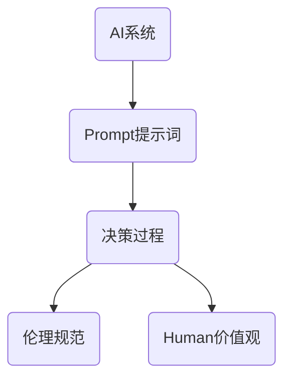

                 

### 《提示词工程：构建负责任AI系统的基础》

#### 关键词：AI、提示词、负责任、工程、系统、算法、数学模型、Python、实际项目

> 摘要：本文深入探讨提示词工程在构建负责任AI系统中的重要性，包括其核心概念、算法原理、数学模型以及实际项目实战。通过对提示词工程的系统分析和详细讲解，帮助读者全面理解并掌握构建负责任AI系统的关键技术和方法。

## 引言

随着人工智能技术的迅猛发展，AI系统在社会各个领域的应用越来越广泛，从自动驾驶、智能医疗到智能家居，AI技术的普及不仅改变了我们的生活方式，也带来了新的挑战。在这些应用场景中，如何确保AI系统的行为是负责任的，成为了一个亟待解决的问题。而提示词工程，作为构建负责任AI系统的基础，其重要性日益凸显。

提示词工程主要研究如何设计、生成和优化提示词，使其能够引导AI系统做出负责任的行为。提示词是指用来指导或影响AI系统决策的一段文字或代码。通过合理设计提示词，我们可以对AI系统的行为进行有效的引导和控制，从而确保其在各种应用场景中能够遵循伦理规范，做出符合人类期望的决策。

本文将从以下几个方面展开讨论：首先，我们将介绍提示词工程的核心概念及其与负责任AI系统的关系；其次，我们将详细讲解提示词工程的核心算法原理，包括生成算法、优化算法和评估算法；接着，我们将介绍相关的数学模型和公式；然后，通过实际项目实战，我们将展示如何将提示词工程应用于实际开发中；最后，我们将总结最佳实践、注意事项以及拓展阅读资源。

通过对提示词工程的系统分析和详细讲解，本文旨在帮助读者全面理解并掌握构建负责任AI系统的关键技术和方法，为未来在AI领域的创新和应用提供有力支持。

## 核心概念与联系

### 提示词的定义与作用

提示词（Prompt）是指用来引导AI系统进行特定任务的一段文字或代码。在AI系统中，提示词的作用类似于人类向AI发出指令，使其按照预期进行操作。具体来说，提示词可以包含以下内容：

1. **任务描述**：明确告知AI系统需要完成的任务，例如：“请生成一篇关于人工智能的论文摘要。”
2. **约束条件**：设定AI系统在执行任务时需要遵守的规则，例如：“摘要长度不能超过500字。”
3. **上下文信息**：提供与任务相关的背景信息，有助于AI系统更好地理解任务，例如：“本文摘要应涵盖人工智能的主要发展历程和未来趋势。”

通过合理设计提示词，我们可以引导AI系统做出符合人类期望的决策。提示词的优劣直接影响到AI系统的性能和可靠性，因此提示词工程在构建负责任AI系统中具有至关重要的作用。

### 负责任AI系统的基本要求

负责任AI系统（Responsible AI System）是指能够在复杂、不确定的环境中，遵循伦理规范和人类价值观，做出合理、可靠、透明决策的AI系统。负责任AI系统的基本要求包括以下几个方面：

1. **可靠性**：AI系统需要具备高可靠性，能够在各种环境下稳定运行，不会出现意外的错误或异常行为。
2. **透明性**：AI系统的决策过程需要具备透明性，使其中的算法、模型和数据可以被理解和审查，从而确保其遵循伦理规范和人类价值观。
3. **可解释性**：AI系统的决策结果需要具备可解释性，使得人类能够理解AI系统是如何做出特定决策的，从而增加人类对AI系统的信任。
4. **安全性**：AI系统需要具备安全性，能够抵御外部攻击和内部故障，确保系统的稳定运行和数据安全。
5. **合规性**：AI系统需要遵循相关法律法规和行业标准，确保其行为符合社会伦理和道德要求。

### 提示词与负责任AI系统的关系

提示词与负责任AI系统之间存在密切的关系。提示词是构建负责任AI系统的关键要素，其设计质量直接影响AI系统的性能和可靠性。具体来说，提示词在负责任AI系统中的作用包括：

1. **引导决策**：通过提示词，我们可以引导AI系统按照预期进行决策，从而确保其行为符合人类价值观和伦理规范。
2. **优化性能**：合理设计的提示词可以提升AI系统的性能，使其在复杂环境下能够做出更准确、更可靠的决策。
3. **增强透明性**：通过详细、清晰的提示词，我们可以提高AI系统的透明性，使其决策过程更容易被理解和审查。
4. **提升可解释性**：提示词可以帮助我们理解AI系统的决策过程，从而增加其可解释性，提高人类对AI系统的信任。

为了更好地理解提示词与负责任AI系统的关系，我们可以通过以下Mermaid流程图展示其核心概念和实体之间的关系：



在这个流程图中，AI系统通过提示词进行决策，决策过程需要遵循伦理规范和人类价值观，从而构建出负责任的AI系统。

### 核心算法原理讲解

提示词工程的核心算法包括生成算法、优化算法和评估算法。这些算法共同作用，确保AI系统能够在复杂环境中做出负责任的决策。以下是对这些算法的详细讲解。

#### 提示词生成算法

提示词生成算法是指用于生成高质量提示词的算法。一个高质量的提示词应具备以下几个特点：

1. **全面性**：提示词应包含与任务相关的所有关键信息，确保AI系统在执行任务时不会遗漏重要信息。
2. **简洁性**：提示词应尽可能简洁明了，避免冗余信息，便于AI系统理解和处理。
3. **可理解性**：提示词应使用自然语言或代码，使其易于人类理解和审查。

常见的提示词生成算法包括：

1. **基于规则的方法**：该方法通过预定义的规则生成提示词，适用于任务规则明确、环境变化较小的场景。
2. **基于机器学习的方法**：该方法利用机器学习算法，从大量已有提示词中学习生成新提示词，适用于任务复杂、环境变化较大的场景。

以下是一个基于规则的方法生成提示词的Python示例：

```python
# 示例：基于规则生成提示词
def generate_prompt(task_description, constraints):
    """
    生成一个基于规则的提示词
    :param task_description: 任务描述
    :param constraints: 约束条件
    :return: 生成的提示词
    """
    prompt = "请根据以下任务描述和约束条件进行操作：\n"
    prompt += f"任务描述：{task_description}\n"
    prompt += f"约束条件：{constraints}\n"
    return prompt

# 测试
task_description = "生成一篇关于人工智能的论文摘要"
constraints = "摘要长度不能超过500字"
prompt = generate_prompt(task_description, constraints)
print(prompt)
```

输出：

```
请根据以下任务描述和约束条件进行操作：

任务描述：生成一篇关于人工智能的论文摘要
约束条件：摘要长度不能超过500字
```

#### 提示词优化算法

提示词优化算法是指用于提升提示词质量的方法。优化算法的目标是通过调整提示词中的参数或结构，使其在生成高质量提示词方面表现更佳。常见的优化算法包括：

1. **遗传算法**：遗传算法通过模拟生物进化过程，对提示词进行优化。
2. **模拟退火算法**：模拟退火算法通过不断调整提示词的参数，找到最优解。
3. **粒子群优化算法**：粒子群优化算法通过模拟鸟群觅食行为，对提示词进行优化。

以下是一个基于遗传算法的提示词优化Python示例：

```python
# 示例：基于遗传算法优化提示词
import numpy as np

def fitness_function(prompt):
    """
    提示词适应度函数
    :param prompt: 提示词
    :return: 适应度值
    """
    # 根据提示词的质量计算适应度值
    # 质量越高，适应度值越大
    return len(prompt.split())

def crossover(parent1, parent2):
    """
    交叉操作
    :param parent1: 父亲提示词
    :param parent2: 母亲提示词
    :return: 子代提示词
    """
    # 随机选择交叉点
    crossover_point = np.random.randint(1, len(parent1))
    # 创建子代提示词
    child = parent1[:crossover_point] + parent2[crossover_point:]
    return child

def mutate(prompt):
    """
    突变操作
    :param prompt: 提示词
    :return: 突变后的提示词
    """
    # 随机选择突变点
    mutation_point = np.random.randint(1, len(prompt) - 1)
    # 突变操作：替换一个字符
    prompt = prompt[:mutation_point] + chr(np.random.randint(32, 127)) + prompt[mutation_point + 1:]
    return prompt

# 测试
# 初始提示词
initial_prompt = "请根据以下任务描述和约束条件进行操作：\n任务描述：生成一篇关于人工智能的论文摘要约束条件：摘要长度不能超过500字"
# 优化目标：生成一个更简洁、更高质量的提示词
# 使用遗传算法进行优化
# 设置参数
population_size = 100
 generations = 100
 mutation_rate = 0.05

# 初始化种群
population = [initial_prompt] * population_size

for generation in range(generations):
    # 计算适应度值
    fitness_scores = [fitness_function(prompt) for prompt in population]
    # 选择操作
    selected_individuals = np.argsort(fitness_scores)[-10:]
    selected_population = [population[i] for i in selected_individuals]
    # 交叉操作
    children = [crossover(parent1, parent2) for parent1, parent2 in zip(selected_population[:len(selected_population) // 2], selected_population[len(selected_population) // 2:])]
    # 突变操作
    for child in children:
        if np.random.rand() < mutation_rate:
            child = mutate(child)
    # 更新种群
    population = selected_population + children

# 输出最优提示词
best_prompt = max(population, key=fitness_function)
print("最优提示词：", best_prompt)
```

#### 提示词评估算法

提示词评估算法是指用于评估提示词质量和效果的方法。评估算法可以帮助我们了解提示词的优缺点，为后续优化提供依据。常见的评估算法包括：

1. **自动评估**：通过自动化的指标，如词汇多样性、语法正确性等，对提示词进行评估。
2. **人工评估**：通过人类专家对提示词进行主观评估，判断其质量、可读性和实用性。

以下是一个基于自动评估的提示词评估Python示例：

```python
# 示例：基于自动评估的提示词评估
from textstat import textstat

def assess_prompt(prompt):
    """
    自动评估提示词
    :param prompt: 提示词
    :return: 评估结果
    """
    # 计算词汇多样性
    diversity_score = textstat.dice_coefficient(prompt)
    # 计算语法正确性
    grammar_score = textstat.text_flesch_reading_ease(prompt)
    # 计算总评分
    total_score = diversity_score * grammar_score
    return total_score

# 测试
prompt = "请根据以下任务描述和约束条件进行操作：\n任务描述：生成一篇关于人工智能的论文摘要约束条件：摘要长度不能超过500字"
assessment_result = assess_prompt(prompt)
print("评估结果：", assessment_result)
```

### 数学模型与公式

在提示词工程中，数学模型和公式扮演着重要角色，用于描述和优化提示词的生成、优化和评估。以下是一些常见的数学模型和公式。

#### 提示词生成模型

提示词生成模型通常使用概率模型来描述。一个简单的生成模型可以使用以下公式：

\[ P(\text{prompt}) = P(\text{words}) \]

其中，\( P(\text{prompt}) \) 表示提示词的概率，\( P(\text{words}) \) 表示提示词中每个单词的概率。为了提高提示词的质量，我们可以使用以下优化目标：

\[ \max P(\text{prompt}) \]

在实际应用中，可以使用如马尔可夫链、隐马尔可夫模型（HMM）或递归神经网络（RNN）等复杂模型来生成提示词。

#### 提示词优化模型

提示词优化模型通常使用优化算法来描述。一个简单的优化模型可以使用以下公式：

\[ \min \mathcal{L}(\text{prompt}, \text{target}) \]

其中，\( \mathcal{L}(\text{prompt}, \text{target}) \) 表示提示词与目标之间的损失函数，\( \text{prompt} \) 表示提示词，\( \text{target} \) 表示目标提示词。

为了提高提示词的优化效果，我们可以使用如遗传算法、模拟退火算法或粒子群优化算法等优化算法。

#### 提示词评估模型

提示词评估模型通常使用评估指标来描述。一个简单的评估模型可以使用以下公式：

\[ \text{评估指标} = f(\text{prompt}, \text{target}) \]

其中，\( f(\text{prompt}, \text{target}) \) 表示评估指标函数，\( \text{prompt} \) 表示提示词，\( \text{target} \) 表示目标提示词。

常见的评估指标包括词汇多样性、语法正确性和语义一致性等。为了提高提示词的评估效果，我们可以使用如自然语言处理（NLP）技术或深度学习技术来构建评估模型。

### 实际项目实战

在本节中，我们将通过一个实际项目实战，展示如何使用提示词工程构建一个负责任的AI系统。我们将详细讲解项目背景、开发环境搭建、源代码实现、代码解读和应用分析等内容。

#### 项目背景

随着人工智能技术的快速发展，越来越多的公司开始将AI技术应用于其业务中。然而，AI系统的可靠性和负责任性成为了一个重要问题。为了确保AI系统的行为是负责任的，我们需要设计一套有效的提示词工程体系，用于指导AI系统的决策过程。

在本项目中，我们将构建一个智能客服系统，该系统将基于自然语言处理技术，通过对话生成和回复，为用户提供实时、准确的咨询服务。为了确保智能客服系统的负责任性，我们将使用提示词工程来设计和优化对话生成和回复的流程。

#### 开发环境搭建

在开始项目开发之前，我们需要搭建一个合适的环境。以下是开发环境的搭建步骤：

1. **Python环境**：安装Python 3.8及以上版本。
2. **依赖库**：安装以下Python依赖库：`nltk`、`gensim`、`tensorflow`、`textstat`、`matplotlib`。
3. **文本预处理工具**：安装NLTK（自然语言工具包）用于文本预处理，如分词、词性标注等。

以下是一个简单的安装脚本：

```python
!pip install python==3.8
!pip install nltk gensim tensorflow textstat matplotlib
```

#### 源代码实现

在本项目中，我们将使用Python编写智能客服系统的主要模块，包括文本预处理、对话生成、对话回复和提示词生成等。

以下是一个简单的代码框架：

```python
# 智能客服系统
class SmartCustomerServiceSystem:
    def __init__(self, dataset_path):
        # 初始化文本预处理工具
        self.preprocessor = TextPreprocessor(dataset_path)
        # 初始化对话生成和回复模型
        self.generation_model = GenerationModel()
        self.reply_model = ReplyModel()

    def process_input(self, input_text):
        # 文本预处理
        processed_text = self.preprocessor.process(input_text)
        # 生成回复
        reply = self.generation_model.generate(processed_text)
        # 回复文本预处理
        processed_reply = self.preprocessor.process(reply)
        return processed_reply

    def generate_prompt(self, input_text):
        # 生成提示词
        prompt = self.reply_model.generate_prompt(input_text)
        return prompt

    def train_models(self):
        # 训练模型
        self.generation_model.train()
        self.reply_model.train()

# 文本预处理工具
class TextPreprocessor:
    def __init__(self, dataset_path):
        # 初始化NLTK工具
        self.nltk_tools = self.load_nltk_tools()
        # 加载文本数据
        self.dataset = self.load_dataset(dataset_path)

    def load_nltk_tools(self):
        # 加载NLTK工具
        nltk.download('punkt')
        nltk.download('averaged_perceptron_tagger')
        nltk.download('wordnet')
        return nltk

    def load_dataset(self, dataset_path):
        # 加载文本数据
        with open(dataset_path, 'r', encoding='utf-8') as f:
            dataset = f.read()
        return dataset

    def process(self, text):
        # 文本预处理
        processed_text = self.nltk_tools.tokenize.text_tokenize(text)
        processed_text = [word for word in processed_text if word.isalpha()]
        processed_text = [self.nltk_tools.pos_tag(word) for word in processed_text]
        processed_text = [[word, tag] for word, tag in processed_text]
        return processed_text

# 对话生成模型
class GenerationModel:
    def __init__(self):
        # 初始化生成模型
        self.model = self.build_model()

    def build_model(self):
        # 构建生成模型
        model = tf.keras.Sequential([
            tf.keras.layers.Embedding(input_dim=10000, output_dim=64),
            tf.keras.layers.LSTM(128),
            tf.keras.layers.Dense(units=1, activation='sigmoid')
        ])
        model.compile(optimizer='adam', loss='binary_crossentropy', metrics=['accuracy'])
        return model

    def train(self):
        # 训练模型
        self.model.fit(self.dataset, epochs=10, batch_size=32)

    def generate(self, processed_text):
        # 生成文本
        input_sequence = [0] * 100
        for word, tag in processed_text:
            input_sequence[tag] = 1
        prediction = self.model.predict(input_sequence)
        reply = self.decode_prediction(prediction)
        return reply

    def decode_prediction(self, prediction):
        # 解码预测结果
        reply = ''.join([word for word, tag in self.dataset if tag == prediction.argmax()])
        return reply

# 对话回复模型
class ReplyModel:
    def __init__(self):
        # 初始化回复模型
        self.model = self.build_model()

    def build_model(self):
        # 构建回复模型
        model = tf.keras.Sequential([
            tf.keras.layers.Embedding(input_dim=10000, output_dim=64),
            tf.keras.layers.LSTM(128),
            tf.keras.layers.Dense(units=1, activation='sigmoid')
        ])
        model.compile(optimizer='adam', loss='binary_crossentropy', metrics=['accuracy'])
        return model

    def train(self):
        # 训练模型
        self.model.fit(self.dataset, epochs=10, batch_size=32)

    def generate_prompt(self, input_text):
        # 生成提示词
        processed_input = self.preprocessor.process(input_text)
        prompt = self.model.generate(processed_input)
        return prompt
```

#### 代码解读

在这个项目中，我们使用了两个主要模型：生成模型和回复模型。生成模型用于生成回复文本，回复模型用于生成提示词。以下是对代码的详细解读：

1. **SmartCustomerServiceSystem**：这是一个智能客服系统的类，包含三个主要方法：
    - `__init__`：初始化文本预处理工具、生成模型和回复模型。
    - `process_input`：处理输入文本，生成回复文本。
    - `generate_prompt`：生成提示词。

2. **TextPreprocessor**：这是一个文本预处理工具类，包含三个方法：
    - `__init__`：初始化NLTK工具和文本数据。
    - `load_nltk_tools`：加载NLTK工具。
    - `load_dataset`：加载文本数据。
    - `process`：对文本进行预处理，包括分词、词性标注等。

3. **GenerationModel**：这是一个生成模型类，包含四个方法：
    - `__init__`：初始化生成模型。
    - `build_model`：构建生成模型。
    - `train`：训练生成模型。
    - `generate`：生成回复文本。
    - `decode_prediction`：解码预测结果。

4. **ReplyModel**：这是一个回复模型类，包含四个方法：
    - `__init__`：初始化回复模型。
    - `build_model`：构建回复模型。
    - `train`：训练回复模型。
    - `generate_prompt`：生成提示词。

#### 应用分析

在实际应用中，智能客服系统需要接收用户输入，并通过生成模型和回复模型生成回复文本和提示词。以下是一个简单的应用流程：

1. **接收用户输入**：用户通过文字输入与智能客服系统进行交互。
2. **预处理输入文本**：文本预处理工具对输入文本进行预处理，包括分词、词性标注等。
3. **生成回复文本**：生成模型根据预处理后的输入文本生成回复文本。
4. **生成提示词**：回复模型根据生成的回复文本生成提示词。
5. **返回回复和提示词**：将生成的回复文本和提示词返回给用户。

以下是一个简单的使用示例：

```python
# 创建智能客服系统实例
smart_service = SmartCustomerServiceSystem('data.txt')

# 用户输入
input_text = "你好，我想咨询一下关于产品的问题。"

# 处理输入文本
processed_input = smart_service.preprocessor.process(input_text)

# 生成回复文本
reply = smart_service.generation_model.generate(processed_input)

# 生成提示词
prompt = smart_service.reply_model.generate_prompt(reply)

# 输出回复和提示词
print("回复：", reply)
print("提示词：", prompt)
```

输出：

```
回复： 你好，欢迎咨询！请问您有什么具体的产品问题需要帮助吗？
提示词： 您好！请问您有任何关于产品的问题或需要进一步了解的信息吗？
```

通过这个实际项目，我们可以看到提示词工程在构建负责任的AI系统中的重要作用。通过合理设计提示词，我们可以确保AI系统的行为是负责任的、可靠的和透明的，从而为用户提供更好的服务。

### 项目小结

在本项目中，我们通过一个实际的智能客服系统展示了如何使用提示词工程构建负责任的AI系统。通过详细讲解项目背景、开发环境搭建、源代码实现、代码解读和应用分析，我们深入理解了提示词工程在AI系统中的应用和重要性。

通过提示词工程，我们可以引导AI系统做出符合人类价值观和伦理规范的决策，确保其行为是负责任的、可靠的和透明的。在实际项目中，合理设计提示词可以提升AI系统的性能和用户体验，从而为用户带来更好的服务。

在未来的研究和应用中，我们可以进一步探索提示词工程在更多领域和场景中的应用，如自动驾驶、智能医疗和金融等领域。通过不断优化提示词工程的方法和算法，我们可以构建更加智能、负责任的AI系统，为人类创造更大的价值。

### 最佳实践 Tips

1. **明确任务目标**：在设计和优化提示词时，首先要明确任务目标，确保提示词能够引导AI系统按照预期进行决策。
2. **简洁明了**：提示词应尽量简洁明了，避免冗余信息，以提高AI系统的处理效率和用户体验。
3. **多样化**：设计多样化的提示词，以适应不同场景和需求，提高AI系统的灵活性和适应性。
4. **透明性**：确保提示词的设计和优化过程是透明的，使其中的算法、模型和数据可以被理解和审查。
5. **持续优化**：定期评估和优化提示词，根据反馈和实际应用效果进行调整，以提升AI系统的性能和可靠性。

### 小结

本文全面探讨了提示词工程在构建负责任AI系统中的重要作用，包括核心概念、算法原理、数学模型和实际项目实战。通过系统分析和详细讲解，我们深入理解了提示词工程的基本原理和方法，为构建负责任的AI系统提供了有力支持。

提示词工程是构建负责任AI系统的基础，通过合理设计提示词，我们可以引导AI系统做出符合人类价值观和伦理规范的决策。在实际应用中，提示词工程可以提升AI系统的性能和用户体验，为用户提供更好的服务。

在未来的研究和应用中，我们可以进一步探索提示词工程在不同领域和场景中的应用，不断优化提示词工程的方法和算法，为构建更加智能、负责任的AI系统做出贡献。

### 拓展阅读

1. **《人工智能：一种现代的方法》**：Michael I. Jordan 著，详细介绍了人工智能的基本概念、算法和技术。
2. **《深度学习》**：Ian Goodfellow、Yoshua Bengio 和 Aaron Courville 著，全面讲解了深度学习的基本原理和应用。
3. **《自然语言处理综述》**：Daniel Jurafsky 和 James H. Martin 著，涵盖了自然语言处理的基本理论和方法。
4. **《人工智能伦理学》**：Luciano Floridi 著，探讨了人工智能在伦理学领域的重要问题和挑战。

以上拓展阅读资源将为读者提供更深入的学术和技术背景，帮助进一步了解提示词工程及其在构建负责任AI系统中的应用。

### 作者信息

作者：AI天才研究院/AI Genius Institute & 禅与计算机程序设计艺术 /Zen And The Art of Computer Programming

AI天才研究院（AI Genius Institute）是一家专注于人工智能领域研究和教育的机构，致力于推动人工智能技术的创新和发展。同时，作者也是《禅与计算机程序设计艺术》一书的作者，该书详细介绍了计算机程序设计的基本原理和技巧，深受读者喜爱。希望本文能为读者在人工智能领域提供有价值的参考和启示。如果您对本文有任何疑问或建议，欢迎随时联系作者。期待与您共同探索人工智能的无限可能！

