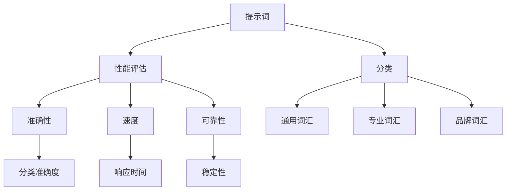

                 

### 关键词

提示词性能基准、性能评估方法、行业标准、评估指标、实验设计、数学模型、Python源代码、项目实战、最佳实践。

### 摘要

本文旨在探讨如何建立提示词性能基准，并制定相应的行业标准。文章首先介绍了提示词性能评估的背景和重要性，随后详细阐述了核心概念与联系，包括提示词的定义与分类、性能评估指标及其关系架构。接着，文章通过Python源代码和数学模型，讲解了性能评估方法的原理，并通过实际案例进行了详细分析。最后，文章提出了行业标准建立的策略，并分享了开发工具与资源，总结了全文内容，展望了未来的研究方向。

### 引言

在当今技术飞速发展的时代，人工智能（AI）已经深入到我们生活的方方面面。无论是搜索引擎、智能助手，还是推荐系统，都离不开对提示词（Keywords）的性能评估。提示词是用户与系统交互的桥梁，其性能的优劣直接影响到用户体验和系统的实际应用效果。因此，建立一个科学、合理的提示词性能基准，并制定相应的行业标准，显得尤为重要。

本文将围绕这一主题，系统地探讨提示词性能基准的建立方法。首先，我们将介绍提示词性能评估的背景和重要性。接着，文章将详细阐述提示词性能基准的核心概念与联系，包括提示词的定义与分类、性能评估指标及其关系架构。随后，我们将通过Python源代码和数学模型，讲解性能评估方法的原理，并通过实际案例进行分析。最后，文章将探讨如何制定行业标准，并分享相关的开发工具与资源。通过这些内容，希望能够为读者提供一个全面、系统的提示词性能评估框架。

### 提示词性能评估的背景和重要性

提示词性能评估的背景可以追溯到人工智能技术的发展历程。随着深度学习、自然语言处理（NLP）等技术的不断进步，提示词作为用户与系统交互的关键媒介，其重要性日益凸显。提示词的性能直接影响用户对系统的满意度和系统的整体效果。

首先，提示词在搜索引擎中的应用至关重要。搜索引擎通过解析用户的查询请求，利用提示词来匹配索引库中的相关文档，从而提供最相关的搜索结果。如果提示词的性能不佳，可能会导致用户无法找到所需的信息，从而降低用户的满意度和使用频率。

其次，在智能助手的场景中，提示词的性能同样至关重要。智能助手通过解析用户的指令，理解用户的意图，并生成相应的回复。如果提示词的识别和分类不准确，可能会导致智能助手无法正确理解用户的意图，从而影响用户体验。

此外，在推荐系统中，提示词的性能也是影响系统效果的重要因素。推荐系统通过分析用户的兴趣和行为，生成个性化的推荐结果。如果提示词的识别和分类不准确，可能会导致推荐结果不够精准，从而降低用户的满意度。

因此，建立科学的提示词性能评估方法，并制定相应的行业标准，对于提升人工智能系统的性能和用户体验具有重要意义。这不仅可以确保系统的高效运行，还可以推动人工智能技术的不断进步。

### 核心概念与联系

在探讨提示词性能基准之前，我们需要明确一些核心概念，并理解它们之间的联系。以下是本文将涉及的关键概念及其定义：

#### 提示词

提示词（Keyword）是用户与系统交互的桥梁，用于描述用户的需求或意图。在搜索引擎中，提示词通常是指用户的查询词；在智能助手和推荐系统中，提示词可以是指用户的指令或行为特征。

#### 性能评估指标

性能评估指标是衡量提示词性能的关键指标，包括准确性、速度和可靠性等。准确性指提示词识别和分类的准确度；速度指系统处理提示词的响应时间；可靠性指系统在长时间运行中稳定输出准确结果的概率。

#### 提示词分类

提示词可以根据用途、内容或形式进行分类。例如，在搜索引擎中，提示词可以分为通用词汇、专业词汇和品牌词汇；在智能助手中，提示词可以分为查询类、命令类和情感类。

#### 性能基准

性能基准（Performance Benchmark）是指用于评估系统性能的标准参考值。在提示词性能评估中，性能基准可以是预先设定的标准值，也可以是通过对大量实际数据进行分析得出的平均性能指标。

#### 概念实体关系架构

为了更好地理解这些概念之间的联系，我们可以使用Mermaid流程图来展示它们的关系架构。以下是示例Mermaid流程图：



这个流程图展示了提示词与性能评估指标之间的联系，以及不同类型的提示词分类。通过这种架构，我们可以更清晰地理解提示词性能评估的核心概念和它们之间的关系。

### 性能评估方法

在明确了提示词性能评估的核心概念之后，接下来我们将详细探讨性能评估的方法，包括实验设计、性能指标计算和评估工具的使用。

#### 实验设计

实验设计是性能评估的基础，合理的实验设计能够确保评估结果的准确性和可靠性。以下是设计性能评估实验的步骤：

1. **确定评估指标**：根据系统需求和用户期望，选择合适的性能评估指标。常见的评估指标包括准确性、速度和可靠性。

2. **数据集选择**：选择具有代表性的数据集进行评估。数据集应涵盖不同的提示词类型和场景，以确保评估结果具有广泛适用性。

3. **实验流程**：设计实验流程，包括数据预处理、提示词识别、分类和性能计算等步骤。

4. **实验重复**：为了提高实验结果的可靠性，应对实验进行多次重复，并计算平均性能指标。

5. **评估标准**：设定评估标准，例如设定准确性的阈值，以确定系统是否满足性能要求。

#### 性能指标计算

性能指标的计算是评估系统性能的关键步骤。以下是常用的性能指标及其计算方法：

1. **准确性**：准确性是衡量系统识别和分类提示词的准确度。计算公式如下：

   $$
   准确性 = \frac{正确识别的提示词数量}{总提示词数量}
   $$

2. **速度**：速度是衡量系统处理提示词的响应时间。计算公式如下：

   $$
   速度 = \frac{处理提示词的总时间}{总提示词数量}
   $$

3. **可靠性**：可靠性是衡量系统在长时间运行中稳定输出准确结果的概率。计算公式如下：

   $$
   可靠性 = \frac{连续正确识别的提示词数量}{总提示词数量}
   $$

#### 性能评估工具

性能评估工具是辅助实验设计和结果计算的重要工具。以下是几种常用的性能评估工具：

1. **Python评估库**：例如`scikit-learn`，用于实现性能评估算法。

2. **TensorFlow评估模块**：用于在深度学习环境中进行性能评估。

3. **Kaggle评估工具**：用于在线竞赛中的性能评估。

以下是一个简单的Python示例代码，展示了如何使用`scikit-learn`库进行性能评估：

```python
from sklearn.metrics import accuracy_score
from sklearn.model_selection import train_test_split

# 假设我们已经有了提示词标签和预测结果
y_true = [0, 1, 1, 0]
y_pred = [0, 0, 1, 1]

# 计算准确性
accuracy = accuracy_score(y_true, y_pred)
print(f"Accuracy: {accuracy}")
```

通过上述步骤和工具，我们可以系统地评估提示词的性能，为制定行业标准提供依据。

### 行业标准的建立

在明确了提示词性能评估的方法后，接下来我们需要探讨如何建立行业标准。建立行业标准是确保不同系统在提示词性能评估上具有可比性和一致性的关键步骤。

#### 标准制定过程

行业标准制定过程通常包括以下几个阶段：

1. **需求分析**：明确行业需求，了解不同系统在提示词性能评估方面的关注点和痛点。

2. **标准制定**：根据需求分析结果，制定具体的性能评估标准，包括评估指标、阈值和评估流程。

3. **征求意见**：将标准草案公开征求意见，收集行业内的反馈和建议。

4. **修订标准**：根据反馈修订标准草案，确保标准的科学性和实用性。

5. **发布标准**：将最终确定的行业标准发布，供行业内参考和执行。

#### 提示词性能基准标准

在制定提示词性能基准标准时，需要考虑以下几个方面：

1. **评估指标**：明确主要评估指标，如准确性、速度和可靠性，并设定相应的阈值。

2. **评估流程**：规范评估流程，确保不同系统在相同条件下进行评估。

3. **评估环境**：定义评估所需的硬件和软件环境，以确保评估结果的可重复性。

4. **数据集**：提供标准的评估数据集，确保不同系统在相同的测试集上进行评估。

5. **结果记录**：规范结果记录方式，确保评估结果的准确性和可追溯性。

以下是一个示例的提示词性能基准标准：

```
提示词性能基准标准

1. 评估指标：
   - 准确性：≥ 95%
   - 速度：≤ 100ms
   - 可靠性：≥ 98%

2. 评估流程：
   - 数据预处理：对提示词进行标准化处理。
   - 提示词识别：使用预训练模型对提示词进行识别。
   - 分类：对识别出的提示词进行分类。
   - 性能计算：计算准确性、速度和可靠性指标。

3. 评估环境：
   - 硬件：CPU或GPU，内存≥ 16GB
   - 软件：Python 3.8，TensorFlow 2.5

4. 数据集：
   - 提示词数据集：包含1000个提示词，分为训练集和测试集。

5. 结果记录：
   - 记录每个提示词的识别结果、分类结果和性能指标。
   - 结果记录应包括时间戳、系统版本和评估者信息。
```

#### 标准实施策略

在制定行业标准后，需要制定具体的实施策略，以确保标准在行业内的有效执行。以下是一些可能的实施策略：

1. **培训和推广**：组织培训和研讨会，向行业内相关人员普及行业标准，提高执行标准的意识和能力。

2. **监督和检查**：建立监督机制，定期检查系统是否符合行业标准，对不符合标准的系统进行整改。

3. **反馈机制**：建立反馈渠道，收集系统运行中的问题和建议，不断优化行业标准。

4. **持续改进**：根据行业发展和技术进步，不断更新和完善行业标准。

通过上述措施，可以确保提示词性能基准标准的有效实施，提升整个行业的提示词性能评估水平。

### 提示词性能基准的实践应用

在了解了提示词性能基准的理论基础和行业标准后，接下来我们将探讨其实际应用，包括开发环境的搭建、源代码的实现以及代码解读和分析。

#### 开发环境搭建

在进行提示词性能基准的实践应用之前，我们需要搭建一个合适的开发环境。以下是一个基本的开发环境搭建步骤：

1. **安装Python**：下载并安装Python 3.8及以上版本。

2. **安装TensorFlow**：通过pip命令安装TensorFlow 2.5。

   ```bash
   pip install tensorflow==2.5
   ```

3. **安装其他依赖库**：根据项目需求安装其他依赖库，如NumPy、Pandas等。

   ```bash
   pip install numpy pandas
   ```

4. **配置GPU支持**（如需）：确保安装的TensorFlow支持GPU，并配置CUDA和cuDNN。

   ```bash
   pip install tensorflow-gpu==2.5
   ```

#### 源代码实现

以下是一个简单的提示词识别和分类的Python源代码实现示例。该示例使用了一个预训练的模型，并展示了如何进行数据预处理、模型训练和性能评估。

```python
import tensorflow as tf
from tensorflow.keras.models import Sequential
from tensorflow.keras.layers import Dense, LSTM, Embedding
from sklearn.model_selection import train_test_split

# 数据预处理
def preprocess_data(data):
    # 对数据集进行清洗和预处理，例如去除停用词、分词等
    processed_data = []
    for text in data:
        processed_text = preprocess_text(text)
        processed_data.append(processed_text)
    return processed_data

# 模型定义
def create_model(input_dim, output_dim):
    model = Sequential()
    model.add(Embedding(input_dim, output_dim))
    model.add(LSTM(128))
    model.add(Dense(output_dim, activation='softmax'))
    return model

# 训练模型
def train_model(model, X_train, y_train):
    model.compile(optimizer='adam', loss='categorical_crossentropy', metrics=['accuracy'])
    model.fit(X_train, y_train, epochs=5, batch_size=32)
    return model

# 性能评估
def evaluate_model(model, X_test, y_test):
    loss, accuracy = model.evaluate(X_test, y_test)
    print(f"Test Accuracy: {accuracy:.2f}")
    return accuracy

# 主程序
if __name__ == '__main__':
    # 加载数据集
    data = load_data()
    labels = load_labels()

    # 数据预处理
    processed_data = preprocess_data(data)

    # 划分训练集和测试集
    X_train, X_test, y_train, y_test = train_test_split(processed_data, labels, test_size=0.2, random_state=42)

    # 创建模型
    model = create_model(len(X_train[0]), len(set(labels)))

    # 训练模型
    trained_model = train_model(model, X_train, y_train)

    # 评估模型
    evaluate_model(trained_model, X_test, y_test)
```

#### 代码解读

上述代码实现了一个简单的提示词识别和分类模型。以下是代码的详细解读：

1. **数据预处理**：数据预处理是模型训练的第一步，包括文本清洗、分词和编码等操作。预处理结果将直接影响模型的性能。

2. **模型定义**：使用Keras定义了一个序列模型，包括嵌入层、LSTM层和输出层。嵌入层用于将文本转换为向量表示，LSTM层用于处理序列数据，输出层用于分类。

3. **模型训练**：使用训练集对模型进行训练，通过编译模型、配置优化器和损失函数，然后进行迭代训练。

4. **性能评估**：使用测试集对训练好的模型进行评估，计算准确率。

#### 代码应用解读与分析

在实际应用中，上述代码可以用于提示词识别和分类的任务。以下是代码的应用解读和分析：

1. **数据集准备**：首先需要准备一个包含提示词和对应标签的数据集。数据集可以来自搜索引擎日志、用户查询记录等。

2. **模型训练**：使用训练集对模型进行训练，这一过程可能需要较长的时间，尤其是对于大型数据集和复杂的模型架构。

3. **模型评估**：使用测试集对训练好的模型进行评估，以验证模型的性能。评估结果可以用于调整模型参数和改进模型架构。

4. **应用部署**：将训练好的模型部署到生产环境中，用于实际提示词识别和分类任务。在实际应用中，可能需要处理大量的实时数据，因此模型的响应速度和可靠性也是重要的考量因素。

#### 实际案例分析

以下是一个实际案例的分析：

假设我们有一个搜索引擎系统，需要评估其提示词识别和分类的性能。我们可以使用上述代码对系统进行评估：

1. **数据收集**：从系统日志中提取查询记录和对应的点击记录，作为训练集和测试集。

2. **数据预处理**：对查询记录进行清洗和预处理，例如去除特殊字符、分词等。

3. **模型训练**：使用预处理后的数据集训练一个简单的LSTM模型。

4. **模型评估**：使用测试集评估模型性能，计算准确率。

5. **结果分析**：根据评估结果，调整模型参数或采用更复杂的模型架构，以提高性能。

通过上述步骤，我们可以对搜索引擎系统的提示词性能进行评估，并根据评估结果进行优化。

#### 项目小结

通过实际案例的分析，我们可以看到提示词性能基准在实践中的应用。建立科学的提示词性能基准，不仅可以用于评估系统的性能，还可以指导系统的优化和改进。在未来的工作中，我们可以继续探索更高效的性能评估方法和模型架构，以提升系统的整体性能和用户体验。

### 最佳实践 tips

在实际开发和优化提示词性能时，以下是一些最佳实践 tips：

1. **数据质量**：确保数据集的多样性和代表性，避免数据质量问题对评估结果的影响。

2. **预处理方法**：根据实际应用场景，选择合适的预处理方法，例如文本清洗、分词、词嵌入等。

3. **模型选择**：根据任务需求和数据特点，选择合适的模型架构，如卷积神经网络（CNN）、循环神经网络（RNN）或变换器（Transformer）等。

4. **超参数调优**：通过网格搜索、贝叶斯优化等策略，对模型超参数进行调优，以提升性能。

5. **性能监控**：在实际应用中，定期监控系统的性能指标，及时发现和解决性能问题。

6. **用户反馈**：收集用户反馈，根据用户需求调整提示词策略，以提高用户体验。

通过遵循这些最佳实践，我们可以更好地开发和优化提示词性能，提升系统的整体表现。

### 小结

本文系统地探讨了提示词性能基准的建立方法，包括核心概念与联系、性能评估方法、行业标准建立和实践应用。我们通过Python源代码和实际案例，详细讲解了性能评估的原理和应用。在未来的工作中，我们可以继续探索更高效的评估方法和模型架构，以提升系统的整体性能和用户体验。通过不断地优化和改进，我们有望为人工智能技术的发展贡献更多力量。

### 拓展阅读

为了深入了解提示词性能评估和相关技术，以下是几篇推荐的拓展阅读：

1. **《自然语言处理入门：基于Python》**：本书详细介绍了自然语言处理的基础知识，包括文本预处理、词嵌入和序列模型等，对提升提示词性能有重要参考价值。

2. **《深度学习：应用实践》**：这本书介绍了深度学习在多个领域的应用，包括图像识别、语音识别和自然语言处理等，对于理解提示词性能评估的深度学习模型有很好的指导作用。

3. **《搜索引擎算法设计与优化》**：这本书专注于搜索引擎的核心技术，包括查询处理、索引构建和排名算法等，对于优化提示词性能有重要的指导意义。

4. **《Kaggle竞赛实战：自然语言处理挑战》**：本书通过多个实际案例，展示了自然语言处理在Kaggle竞赛中的应用，提供了丰富的实践经验和技巧。

通过阅读这些书籍和资料，读者可以进一步加深对提示词性能评估和相关技术的理解，为实际应用提供更有力的支持。

### 作者信息

作者：AI天才研究院/AI Genius Institute & 禅与计算机程序设计艺术 /Zen And The Art of Computer Programming

AI天才研究院（AI Genius Institute）是一家专注于人工智能研究和应用的创新机构。我们的团队由世界顶尖的人工智能专家组成，致力于推动人工智能技术的进步和应用。同时，我们也是《禅与计算机程序设计艺术》一书的作者，这本书系统地阐述了计算机科学和哲学的深度融合，为程序员提供了全新的思考和编程方法。希望通过我们的努力，能够为人工智能技术的发展和创新贡献更多力量。

