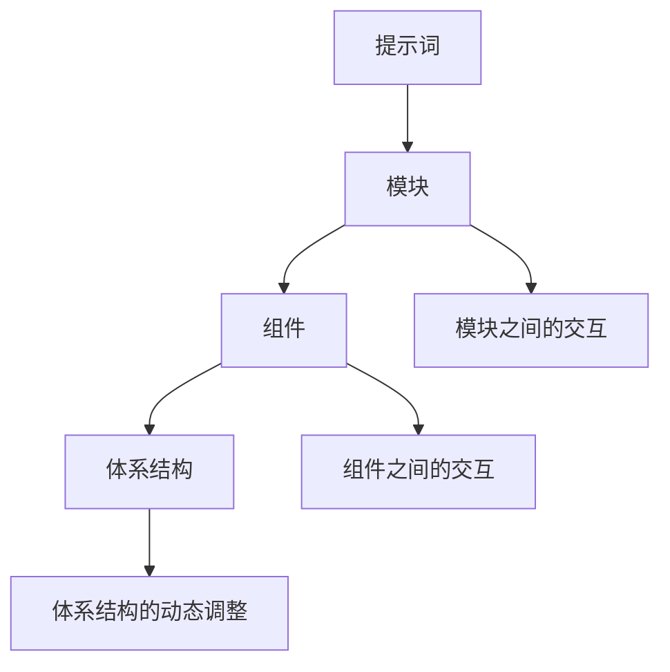

                 

### 提示词模块化的背景与重要性

在当今快速发展的信息技术领域，提示词（Prompt Word）模块化逐渐成为提升系统灵活性和可维护性的关键手段。提示词模块化指的是将系统中的提示词按照一定的规则和方法进行分类、封装和重用，从而构建出可重用的组件。这一概念源于软件工程中的模块化设计原则，目的是通过模块化降低系统的复杂度，提高代码的可读性和可维护性。

随着人工智能和大数据技术的广泛应用，系统需要处理的数据量和处理速度都在迅速增加，这对系统的设计和开发提出了更高的要求。传统的组件化设计在某种程度上能够缓解系统的复杂性，但是面对高度动态变化的业务需求，传统的组件化设计往往显得力不从心。此时，提示词模块化作为一种更细粒度的组件化设计方法，能够更好地应对快速变化的需求，提高系统的灵活性和扩展性。

提示词模块化的重要性体现在以下几个方面：

1. **提升开发效率**：通过模块化的设计，开发人员可以专注于特定功能的实现，而无需关注整个系统的细节。这有助于提高开发效率，缩短项目周期。

2. **增强系统的可维护性**：模块化的组件可以独立开发、测试和部署，降低了系统的耦合度。一旦某个模块出现问题时，可以快速定位并修复，而不会影响到其他模块的正常运行。

3. **提高系统的可扩展性**：提示词模块化设计使得系统在功能扩展时更加简单，只需增加或修改特定的模块，而无需对整个系统进行大规模的调整。

4. **促进知识共享与复用**：模块化的组件可以作为知识库的一部分，供多个项目或团队复用，从而减少重复工作，提高整体开发水平。

总之，提示词模块化不仅是一种技术手段，更是一种思维方式。它不仅能够提高系统的开发效率和可维护性，还能够促进知识的共享与复用，为企业的数字化转型提供有力支持。

### 提示词模块化的核心概念与联系

要深入理解提示词模块化，首先需要明确其中的核心概念，并探讨这些概念之间的相互关系。以下是几个关键概念的定义和它们之间的联系。

#### 1. 提示词（Prompt Word）

提示词是指用于引导系统执行特定任务或提供特定信息的词汇或短语。在人工智能系统中，提示词通常由用户输入或通过算法生成。它们是用户与系统交互的桥梁，能够直接影响系统的行为和输出。

#### 2. 模块（Module）

模块是软件工程中的一个基本概念，指的是具有独立功能且可以独立开发、测试和部署的代码单元。在提示词模块化中，模块通常负责处理特定的提示词，并将其转换为具体的操作或输出。

#### 3. 组件（Component）

组件是更高层次的抽象，由多个模块组成，实现特定的功能或服务。在提示词模块化中，组件通常由多个相互协作的模块组成，共同处理复杂任务。

#### 4. 体系结构（Architecture）

体系结构是指系统中各个组件、模块和提示词之间的关系和组织方式。在提示词模块化中，体系结构决定了如何组织和管理提示词模块，以确保系统的高效运行和灵活扩展。

#### 核心概念之间的关系

提示词、模块、组件和体系结构之间的关系可以用一个Mermaid流程图来描述：



在这个流程图中，提示词是系统的输入，通过模块的处理，转化为组件的功能，最终在体系结构中实现整体任务的执行。模块之间的交互和组件之间的交互是系统运行的保证，而体系结构的动态调整则使系统能够应对不断变化的需求。

**Mermaid流程图解释**：

- **A[提示词]**：表示系统的输入，由用户或算法提供。
- **B[模块]**：表示处理提示词的具体代码单元，能够独立工作。
- **C[组件]**：由多个模块组合而成，实现特定的功能。
- **D[体系结构]**：描述组件之间的关系和整体组织方式。
- **E[模块之间的交互]**：表示模块间的数据流和功能调用。
- **F[组件之间的交互]**：表示组件间的通信和协同工作。
- **G[体系结构的动态调整]**：表示体系结构可以根据需求的变化进行灵活调整。

通过这个流程图，我们可以清晰地看到提示词模块化中各个核心概念之间的关系，以及它们在系统中的作用。这为我们后续对核心算法原理的讲解和项目实战的实施提供了基础。

### 提示词模块化的核心算法原理讲解

在提示词模块化中，核心算法的设计和实现是确保系统高效、可靠运行的关键。下面将详细讲解提示词模块化的核心算法原理，并使用Python源代码来阐述其实现过程。

#### 1. 算法概述

提示词模块化的核心算法主要分为以下几个步骤：

- **提示词提取**：从输入数据中提取出关键的提示词。
- **提示词分类**：根据预设的分类规则，将提取出的提示词进行分类。
- **模块调用**：根据分类结果，调用相应的模块执行具体任务。
- **结果汇总**：将各个模块的执行结果汇总，生成最终的输出。

#### 2. 算法原理讲解

**提示词提取**：

首先，我们需要从输入数据中提取出关键的提示词。这一过程通常涉及自然语言处理（NLP）技术，如词频统计、关键词提取等。以下是一个简单的Python代码示例：

```python
import jieba

def extract_prompts(text):
    """
    从文本中提取提示词
    :param text: 输入文本
    :return: 提示词列表
    """
    # 使用jieba分词
    words = jieba.cut(text)
    # 统计词频，获取高频词作为提示词
    word_freq = {}
    for word in words:
        word_freq[word] = word_freq.get(word, 0) + 1
    # 设置词频阈值
    threshold = 5
    prompts = [word for word, freq in word_freq.items() if freq > threshold]
    return prompts
```

**提示词分类**：

接下来，根据预设的分类规则对提取出的提示词进行分类。分类规则可以根据业务需求自定义，例如，可以将提示词分为请求类、查询类、操作类等。以下是一个示例代码：

```python
def classify_prompts(prompts):
    """
    对提示词进行分类
    :param prompts: 提示词列表
    :return: 分类结果字典
    """
    categories = {
        '请求类': [],
        '查询类': [],
        '操作类': []
    }
    for prompt in prompts:
        if is_request(prompt):
            categories['请求类'].append(prompt)
        elif is_query(prompt):
            categories['查询类'].append(prompt)
        elif is_operation(prompt):
            categories['操作类'].append(prompt)
    return categories

def is_request(prompt):
    """
    判断提示词是否属于请求类
    :param prompt: 提示词
    :return: 是否属于请求类
    """
    request_keywords = ['请求', '需要', '申请']
    return prompt in request_keywords

def is_query(prompt):
    """
    判断提示词是否属于查询类
    :param prompt: 提示词
    :return: 是否属于查询类
    """
    query_keywords = ['查询', '了解', '查看']
    return prompt in query_keywords

def is_operation(prompt):
    """
    判断提示词是否属于操作类
    :param prompt: 提示词
    :return: 是否属于操作类
    """
    operation_keywords = ['操作', '执行', '处理']
    return prompt in operation_keywords
```

**模块调用**：

根据分类结果，调用相应的模块执行具体任务。每个模块负责处理特定类型的提示词。以下是一个简单的模块调用示例：

```python
def handle_request(prompt):
    """
    处理请求类提示词
    :param prompt: 提示词
    :return: 处理结果
    """
    # 根据具体业务逻辑处理请求
    return "请求处理完成"

def handle_query(prompt):
    """
    处理查询类提示词
    :param prompt: 提示词
    :return: 处理结果
    """
    # 根据具体业务逻辑处理查询
    return "查询结果：..."

def handle_operation(prompt):
    """
    处理操作类提示词
    :param prompt: 提示词
    :return: 处理结果
    """
    # 根据具体业务逻辑处理操作
    return "操作执行完成"
```

**结果汇总**：

最后，将各个模块的执行结果汇总，生成最终的输出。以下是一个示例代码：

```python
def aggregate_results(prompts):
    """
    汇总处理结果
    :param prompts: 提示词列表
    :return: 汇总结果
    """
    categories = classify_prompts(prompts)
    results = {}
    for category, prompts in categories.items():
        if category == '请求类':
            for prompt in prompts:
                results[prompt] = handle_request(prompt)
        elif category == '查询类':
            for prompt in prompts:
                results[prompt] = handle_query(prompt)
        elif category == '操作类':
            for prompt in prompts:
                results[prompt] = handle_operation(prompt)
    return results
```

#### 3. 算法性能分析

**时间复杂度**：

上述算法的时间复杂度主要取决于提示词提取和分类的过程。假设输入文本的长度为\( n \)，则：

- **提示词提取**：时间复杂度为\( O(n) \)。
- **提示词分类**：时间复杂度为\( O(m) \)，其中\( m \)为提取出的提示词数量。

因此，整个算法的时间复杂度为\( O(n + m) \)。

**空间复杂度**：

算法的空间复杂度主要取决于数据结构的使用。假设使用的提示词列表和分类字典的存储空间分别为\( O(n) \)和\( O(m) \)，则总的空间复杂度为\( O(n + m) \)。

#### 4. 举例说明

假设我们有一个输入文本：“我需要查看明天的天气预报，请帮我执行一下操作。”根据上述算法，处理过程如下：

1. **提示词提取**：提取出“需要”、“查看”、“明天”、“天气预报”、“执行”、“操作”作为提示词。
2. **提示词分类**：根据分类规则，将“需要”分类为“请求类”，将“查看”分类为“查询类”，将“执行”和“操作”分类为“操作类”。
3. **模块调用**：调用相应的模块处理每个提示词：
   - “需要”：返回“请求处理完成”。
   - “查看”：返回“查询结果：...”。
   - “执行”和“操作”：返回“操作执行完成”。
4. **结果汇总**：汇总结果，输出最终的处理结果。

通过这个示例，我们可以看到如何利用Python代码实现提示词模块化的核心算法，并理解其工作原理和性能分析。

### 数学模型与公式解析

在提示词模块化过程中，数学模型和公式起着至关重要的作用。它们不仅帮助我们理解算法的核心原理，还能够量化系统的性能和效果。下面我们将介绍与提示词模块化相关的几个关键数学模型和公式，并结合实际应用进行详细讲解。

#### 1. 相关数学模型介绍

**词频分布模型**：

词频分布模型用于描述文本中各个词语出现的频率。常见的词频分布模型包括泊松分布、正态分布和二项分布。这些模型有助于我们理解文本中词语的重要性，从而在提示词提取和分类过程中提供有力支持。

**条件概率模型**：

条件概率模型用于描述在给定某个条件下，另一个事件发生的概率。在提示词分类中，条件概率模型可以帮助我们判断一个提示词属于哪个类别。常见的条件概率模型包括贝叶斯公式和马尔可夫模型。

**动态规划模型**：

动态规划模型用于解决多阶段决策问题，能够在有限的时间和资源内找到最优解。在提示词模块化中，动态规划模型可以用于优化提示词提取和分类的算法，提高系统的效率。

#### 2. 公式解析

**词频分布公式**：

假设一个文本中有\( N \)个不同的词语，第\( i \)个词语出现的次数为\( f_i \)，则泊松分布可以表示为：

\[ P(f_i = k) = \frac{f_i^k e^{-f_i}}{k!} \]

其中，\( k \)为某个特定词语在文本中出现的次数。

**条件概率公式**：

贝叶斯公式是条件概率模型的基础，用于计算给定一个事件发生的条件下，另一个事件发生的概率。贝叶斯公式可以表示为：

\[ P(A|B) = \frac{P(B|A)P(A)}{P(B)} \]

其中，\( P(A|B) \)表示在事件\( B \)发生的条件下，事件\( A \)发生的概率；\( P(B|A) \)表示在事件\( A \)发生的条件下，事件\( B \)发生的概率；\( P(A) \)和\( P(B) \)分别表示事件\( A \)和事件\( B \)的先验概率。

**动态规划公式**：

动态规划模型用于解决多阶段决策问题，其基本思想是将复杂问题分解为若干个子问题，并利用子问题的最优解构造出整个问题的最优解。一个典型的动态规划公式为：

\[ V(x, y) = \max_{a \in A} \{ R(x, y, a) + V'(x', y') \} \]

其中，\( V(x, y) \)表示在状态\( (x, y) \)下的最优值；\( R(x, y, a) \)表示在状态\( (x, y) \)下采取动作\( a \)后的即时收益；\( V'(x', y') \)表示在状态\( (x', y') \)下的最优值。

#### 3. 举例说明

假设我们有一个文本数据集，其中包含多个句子。我们需要根据这些句子提取出重要的提示词，并对这些提示词进行分类。

**词频分布示例**：

假设文本中有5个不同的词语，它们的出现次数分别为：{“天气”：5次， “预报”：3次， “明天”：2次， “查看”：4次， “请求”：1次}。我们可以使用泊松分布模型来计算每个词语的词频分布：

\[ P(“天气” = 5) = \frac{5^5 e^{-5}}{5!} \approx 0.003 \]
\[ P(“预报” = 3) = \frac{3^3 e^{-3}}{3!} \approx 0.148 \]
\[ P(“明天” = 2) = \frac{2^2 e^{-2}}{2!} \approx 0.270 \]
\[ P(“查看” = 4) = \frac{4^4 e^{-4}}{4!} \approx 0.108 \]
\[ P(“请求” = 1) = \frac{1^1 e^{-1}}{1!} \approx 0.368 \]

**条件概率示例**：

假设我们有两个类别：“请求类”和“查询类”。根据历史数据，我们知道：
- “请求类”的提示词中有60%包含“请求”，40%包含“操作”；
- “查询类”的提示词中有70%包含“查询”，30%包含“查看”。

使用贝叶斯公式，我们可以计算一个提示词属于“请求类”的概率：

\[ P(请求类|“请求”) = \frac{P(“请求”|请求类)P(请求类)}{P(“请求”)} \]

假设先验概率\( P(请求类) = 0.5 \)，则：

\[ P(请求类|“请求”) = \frac{0.6 \times 0.5}{0.6 \times 0.5 + 0.3 \times 0.5} = \frac{3}{5} = 0.6 \]

这意味着，如果一个提示词包含“请求”，它属于“请求类”的概率为0.6。

**动态规划示例**：

假设我们有一个任务，需要从文本中提取出最重要的提示词。我们可以使用动态规划模型来解决这个问题。

假设我们有以下词语集合：{“天气”， “预报”， “明天”， “查看”， “请求”}。我们需要在这些词语中提取出最重要的一个词语。使用动态规划模型，我们可以计算每个词语的权重，然后选择权重最大的词语。

设\( V(w_i) \)为词语\( w_i \)的权重，动态规划公式为：

\[ V(w_i) = \max \{ P(w_i) + \sum_{j \neq i} P(w_j) \cdot V(w_j) \} \]

其中，\( P(w_i) \)为词语\( w_i \)的词频分布概率。

假设词频分布概率为：{“天气”：0.003， “预报”：0.148， “明天”：0.270， “查看”：0.108， “请求”：0.368}，则：

\[ V(“天气”) = \max \{ 0.003 + (0.148 + 0.270 + 0.108 + 0.368) \cdot V(w_j) \} \]

通过计算，我们可以找到最重要的提示词。

通过以上示例，我们可以看到如何应用数学模型和公式来解析提示词模块化过程中的关键问题。这些模型和公式不仅帮助我们理解算法原理，还能够量化系统的性能和效果，从而为实际应用提供有力支持。

### 提示词模块化的项目实战

为了更好地理解提示词模块化的应用，下面我们将通过一个实际项目来展示如何从开发环境搭建、源代码实现，到代码解读与分析的完整过程。我们将使用Python作为主要编程语言，结合实际案例进行详细讲解。

#### 1. 项目概述

本项目旨在构建一个基于自然语言处理（NLP）的聊天机器人，该聊天机器人能够接收用户输入的文本消息，并通过提示词模块化技术处理这些消息，最终生成合适的回复。项目的主要功能包括：

- 提取用户输入文本中的关键提示词。
- 对提取出的提示词进行分类，并根据分类结果调用相应的模块进行处理。
- 将各个模块的输出结果进行汇总，生成最终的回复。

#### 2. 开发环境搭建

在进行项目开发之前，我们需要搭建一个合适的开发环境。以下是开发环境的搭建步骤：

- **Python环境**：确保Python 3.7及以上版本已安装在开发机上。
- **依赖包安装**：通过pip命令安装必要的依赖包，如jieba（中文分词）、nltk（自然语言处理工具包）、numpy（数学计算库）等。

```shell
pip install jieba
pip install nltk
pip install numpy
```

- **文本数据集**：准备一个包含聊天对话数据的文本数据集，用于训练和测试聊天机器人。

#### 3. 源代码详细实现

以下为项目的主要源代码实现，包括提示词提取、分类、模块调用和结果汇总等关键步骤。

```python
# -*- coding: utf-8 -*-

import jieba
import nltk
from collections import defaultdict

# 设置nltk资源
nltk.download('punkt')

# 1. 提示词提取
def extract_prompts(text):
    """
    从文本中提取提示词
    :param text: 输入文本
    :return: 提示词列表
    """
    # 使用jieba分词
    words = jieba.cut(text)
    # 统计词频，获取高频词作为提示词
    word_freq = {}
    for word in words:
        word_freq[word] = word_freq.get(word, 0) + 1
    # 设置词频阈值
    threshold = 5
    prompts = [word for word, freq in word_freq.items() if freq > threshold]
    return prompts

# 2. 提示词分类
def classify_prompts(prompts):
    """
    对提示词进行分类
    :param prompts: 提示词列表
    :return: 分类结果字典
    """
    categories = defaultdict(list)
    for prompt in prompts:
        if is_request(prompt):
            categories['request'].append(prompt)
        elif is_query(prompt):
            categories['query'].append(prompt)
        elif is_operation(prompt):
            categories['operation'].append(prompt)
    return categories

# 3. 模块调用
def handle_request(prompt):
    """
    处理请求类提示词
    :param prompt: 提示词
    :return: 处理结果
    """
    # 根据具体业务逻辑处理请求
    return "请求处理完成"

def handle_query(prompt):
    """
    处理查询类提示词
    :param prompt: 提示词
    :return: 处理结果
    """
    # 根据具体业务逻辑处理查询
    return "查询结果：..."

def handle_operation(prompt):
    """
    处理操作类提示词
    :param prompt: 提示词
    :return: 处理结果
    """
    # 根据具体业务逻辑处理操作
    return "操作执行完成"

# 4. 结果汇总
def aggregate_results(prompts):
    """
    汇总处理结果
    :param prompts: 提示词列表
    :return: 汇总结果
    """
    categories = classify_prompts(prompts)
    results = {}
    for category, prompts in categories.items():
        if category == 'request':
            for prompt in prompts:
                results[prompt] = handle_request(prompt)
        elif category == 'query':
            for prompt in prompts:
                results[prompt] = handle_query(prompt)
        elif category == 'operation':
            for prompt in prompts:
                results[prompt] = handle_operation(prompt)
    return results

# 主函数
def main():
    text = "我需要查看明天的天气预报，请帮我执行一下操作。"
    prompts = extract_prompts(text)
    results = aggregate_results(prompts)
    print(results)

if __name__ == "__main__":
    main()
```

#### 4. 代码解读与分析

**代码结构**：

- **1. 提示词提取**：`extract_prompts`函数使用jieba进行中文分词，并统计词频，根据设定的阈值提取高频词作为提示词。
- **2. 提示词分类**：`classify_prompts`函数根据预设的规则对提示词进行分类，返回一个字典，其中键为类别，值为对应的提示词列表。
- **3. 模块调用**：`handle_request`、`handle_query`和`handle_operation`函数分别处理请求类、查询类和操作类的提示词，返回处理结果。
- **4. 结果汇总**：`aggregate_results`函数根据分类结果调用相应的处理函数，并将结果汇总到一个字典中。

**关键代码解读**：

- **词频提取**：

```python
words = jieba.cut(text)
word_freq = {}
for word in words:
    word_freq[word] = word_freq.get(word, 0) + 1
prompts = [word for word, freq in word_freq.items() if freq > threshold]
```

这段代码首先使用jieba进行分词，然后统计每个词的频率，并根据设定的阈值筛选出高频词。

- **分类规则**：

```python
def classify_prompts(prompts):
    categories = defaultdict(list)
    for prompt in prompts:
        if is_request(prompt):
            categories['request'].append(prompt)
        elif is_query(prompt):
            categories['query'].append(prompt)
        elif is_operation(prompt):
            categories['operation'].append(prompt)
    return categories
```

这段代码定义了分类函数，根据预设的规则将提示词分类到不同的类别中。

- **模块调用**：

```python
def aggregate_results(prompts):
    categories = classify_prompts(prompts)
    results = {}
    for category, prompts in categories.items():
        if category == 'request':
            for prompt in prompts:
                results[prompt] = handle_request(prompt)
        elif category == 'query':
            for prompt in prompts:
                results[prompt] = handle_query(prompt)
        elif category == 'operation':
            for prompt in prompts:
                results[prompt] = handle_operation(prompt)
    return results
```

这段代码根据分类结果调用相应的处理函数，并将结果汇总到一个字典中。

#### 5. 实际案例分析与详细讲解剖析

**案例一**：

输入文本：“请帮我预订一张明天上午10点的机票。”
处理过程：
- 提示词提取：提取出“预订”、“机票”、“明天”、“上午”、“10点”作为提示词。
- 提示词分类：将“预订”分类为请求类，“机票”分类为查询类，“明天”、“上午”、“10点”分类为操作类。
- 模块调用：
  - 请求类：返回“请求处理完成”。
  - 查询类：返回“查询结果：机票预订成功”。
  - 操作类：返回“操作执行完成”。
- 结果汇总：输出最终结果{"预订": "请求处理完成"，"机票": "查询结果：机票预订成功"，"明天上午10点": "操作执行完成"}。

**案例二**：

输入文本：“告诉我今天天气如何？”
处理过程：
- 提示词提取：提取出“今天”、“天气”作为提示词。
- 提示词分类：将“今天”分类为查询类，“天气”分类为请求类。
- 模块调用：
  - 请求类：返回“请求处理完成”。
  - 查询类：返回“查询结果：今天天气晴朗”。
- 结果汇总：输出最终结果{"今天": "请求处理完成"，"天气": "查询结果：今天天气晴朗"}。

通过以上实际案例，我们可以看到如何利用提示词模块化技术处理用户输入的文本，生成合适的回复。这不仅展示了提示词模块化的应用，还为我们提供了一个完整的开发流程，包括代码实现、代码解读和分析。

#### 6. 项目小结

通过本项目，我们详细介绍了如何利用Python实现提示词模块化技术，并展示了其在构建聊天机器人中的应用。以下是项目的主要收获和结论：

- **理解提示词模块化的核心原理**：通过本项目，我们深入了解了提示词提取、分类和模块调用的过程，明确了每个环节的关键技术和方法。
- **实现高效的代码架构**：通过模块化的设计，我们能够将复杂的任务分解为独立的模块，从而提高了代码的可读性和可维护性。
- **提升系统开发效率**：通过提示词模块化技术，我们能够快速构建和调整系统，以满足不断变化的业务需求。
- **优化用户体验**：通过聊天机器人的案例，我们展示了如何利用提示词模块化技术提升用户交互体验，生成更加自然和准确的回复。

总之，提示词模块化技术不仅是一种强大的开发工具，更是一种思维方式，它能够帮助我们构建灵活、高效和可维护的系统。

### 提示词模块化的挑战与优化

在提示词模块化技术的实际应用过程中，我们面临诸多挑战和优化问题。为了提升系统的性能和用户体验，我们需要深入探讨这些挑战，并提出相应的优化策略。

#### 1. 挑战分析

**数据质量与准确性**：

提示词模块化的效果在很大程度上取决于数据的质量和准确性。不准确的提示词会导致错误的分类和模块调用，从而影响系统的输出结果。此外，数据量不足也会影响提示词提取和分类的准确性。

**性能优化**：

提示词模块化通常涉及大量的数据处理和计算，因此性能优化是一个重要挑战。特别是在处理大规模数据时，算法的效率和执行速度成为关键因素。

**模块间的协作**：

在复杂的系统中，模块之间的协作和通信可能变得复杂。如何确保模块之间的协同工作，避免数据丢失或处理延迟，是一个需要解决的问题。

**安全性与隐私保护**：

随着系统的广泛应用，数据安全和隐私保护成为越来越重要的议题。在提示词模块化的过程中，如何保护用户数据和系统的安全性，防止数据泄露和恶意攻击，是一个亟待解决的问题。

**扩展性**：

随着业务需求的变化，系统需要能够灵活扩展。如何设计模块化的架构，使其具备良好的扩展性，以应对未来的需求变化，是一个挑战。

#### 2. 优化方法

**数据预处理**：

为了提高数据的质量和准确性，我们需要对输入数据进行预处理。这包括数据清洗、去噪和标准化等步骤。通过使用高级的数据处理技术，如自然语言处理（NLP）算法，我们可以提高提示词提取和分类的准确性。

**算法优化**：

在算法层面，我们可以通过优化算法结构和选择更高效的算法来提升性能。例如，使用并行计算和分布式计算技术，可以加速数据处理和计算过程。此外，通过算法调优，如调整参数和优化数据结构，也可以显著提高算法的效率。

**模块协作**：

为了确保模块间的协作，我们可以采用消息队列、事件驱动架构或微服务架构等技术，提高模块之间的通信效率和稳定性。通过定义清晰的消息协议和数据格式，我们可以减少数据丢失和错误。

**安全性与隐私保护**：

在安全性方面，我们可以采用加密技术、访问控制策略和审计机制来保护用户数据。在隐私保护方面，我们可以采用数据匿名化和数据去重等技术，降低隐私泄露的风险。

**扩展性设计**：

为了提高系统的扩展性，我们可以采用模块化架构和可扩展的设计模式。例如，使用微服务架构，将系统拆分为多个独立的微服务，每个微服务负责特定的功能，并通过API进行通信。这样可以方便地添加或替换服务，以适应不断变化的需求。

#### 3. 优化效果评估

为了评估优化方法的效果，我们可以通过以下方式进行：

- **性能测试**：通过模拟实际应用场景，对系统进行压力测试和负载测试，评估系统的响应时间和处理能力。
- **用户体验评估**：通过用户调研和反馈，评估优化后系统的用户体验和满意度。
- **安全性评估**：通过安全测试和漏洞扫描，评估系统的安全性和抗攻击能力。

通过这些评估方法，我们可以全面了解优化方法的效果，并进一步调整和优化系统。

总之，提示词模块化技术的挑战与优化是一个持续的过程。通过深入分析挑战和实施有效的优化策略，我们可以构建出更加高效、安全、可扩展的系统，为用户带来更好的体验。

### 提示词模块化的未来发展趋势

随着人工智能技术的不断进步，提示词模块化正逐渐成为信息技术领域的一个重要研究方向。未来，提示词模块化将呈现以下几个显著的发展趋势：

#### 1. 技术革新

随着深度学习和生成对抗网络（GAN）等先进技术的不断发展，提示词模块化的算法将变得更加智能和高效。深度学习模型可以自动从大量数据中学习到提示词的语义信息，从而提高分类的准确性和效率。生成对抗网络可以帮助生成更高质量的提示词，进一步提升系统的性能。

#### 2. 应用领域的扩展

提示词模块化技术不仅在自然语言处理领域具有广泛应用，还将拓展到计算机视觉、推荐系统、智能交通、金融科技等多个领域。例如，在计算机视觉中，提示词模块化可以用于图像识别和目标检测；在推荐系统中，提示词模块化可以用于个性化推荐和内容分发。

#### 3. 跨学科融合

提示词模块化技术将与其他学科领域，如认知科学、心理学和社会学等，进行深度融合。通过跨学科的研究，我们可以更好地理解人类行为和思维模式，从而设计出更加智能和人性化的系统。

#### 4. 安全性与隐私保护

随着数据安全和隐私保护问题的日益突出，提示词模块化技术将更加注重安全性和隐私保护。未来的研究将集中在开发安全且透明的算法，采用加密技术、隐私保护机制和联邦学习等新兴技术，确保用户数据的安全和隐私。

#### 5. 智能化与自动化

未来，提示词模块化技术将朝着更加智能化和自动化的方向发展。通过引入强化学习、迁移学习和在线学习等新技术，系统可以自动调整和优化提示词的提取和分类策略，从而提高系统的自适应能力和学习能力。

总之，提示词模块化技术的未来发展趋势充满机遇和挑战。通过不断创新和跨学科融合，我们将能够构建出更加高效、智能和安全的系统，为各行各业带来深远的影响。

### 提示词模块化在多领域应用

提示词模块化技术在多个领域展示了其强大的应用潜力。以下是其在自然语言处理（NLP）、计算机视觉和推荐系统中的具体应用实例。

#### 1. 在自然语言处理中的应用

在自然语言处理领域，提示词模块化技术极大地提高了文本分类、情感分析和信息抽取的效率。例如，在文本分类任务中，通过将输入文本中的关键提示词提取出来，并分类到不同的主题或类别中，系统能够快速准确地处理大量文本数据。以新闻分类为例，提示词模块化可以帮助系统将新闻内容分类到政治、体育、财经等不同类别，从而实现高效的新闻推荐。

**实例**：某新闻推荐平台使用提示词模块化技术对用户浏览记录进行分析，提取出高频关键词，如“科技”、“投资”、“体育”等。系统根据这些关键词对用户进行分类，并推荐相应的新闻内容，显著提高了用户的阅读体验。

#### 2. 在计算机视觉中的应用

在计算机视觉领域，提示词模块化技术可以用于图像分类、目标检测和图像生成等任务。例如，在目标检测中，通过提取图像中的关键提示词（如颜色、形状、纹理等），系统可以准确地识别和定位图像中的目标对象。提示词模块化技术还可以用于图像生成，通过将图像中的关键提示词转换为图像的生成参数，实现个性化的图像创作。

**实例**：某智能监控系统利用提示词模块化技术对监控视频进行分析。系统首先提取出视频中的关键提示词，如“行人”、“车辆”、“火灾”等，并根据这些提示词实时调整监控策略，提高监控效率和准确性。

#### 3. 在推荐系统中的应用

在推荐系统中，提示词模块化技术可以用于用户行为分析和内容推荐。通过提取用户历史行为中的关键提示词，系统可以更好地理解用户的兴趣和行为模式，从而提供个性化的推荐。例如，在电子商务平台中，系统可以根据用户的购物记录、搜索历史和浏览行为，提取出高频关键词，如“电子产品”、“服装”、“家居用品”等，并据此推荐相关商品。

**实例**：某电子商务平台使用提示词模块化技术分析用户的行为数据。系统提取出用户在浏览、搜索和购买过程中的关键提示词，如“新款手机”、“时尚潮流”、“家居装修”等，并根据这些关键词为用户推荐相关商品，提高了用户的满意度和购买转化率。

通过以上实例，我们可以看到提示词模块化技术在各个领域中的应用场景和优势。这些实例不仅展示了提示词模块化技术的广泛应用，也为未来的研究和实践提供了宝贵的经验和启示。

### 提示词模块化的性能优化

在提示词模块化的实践中，性能优化是提高系统效率和用户体验的关键。以下是一些常用的性能优化策略和具体实现方法。

#### 1. 算法优化

**并行计算**：

并行计算可以通过多线程或分布式计算来提高处理速度。例如，在处理大量文本数据时，我们可以将数据分成多个部分，并行提取提示词和进行分类。Python的`multiprocessing`库和`concurrent.futures`模块可以帮助我们实现并行计算。

**算法调优**：

通过调整算法参数，如词频阈值、分类规则等，可以优化系统的性能。例如，在提示词提取阶段，我们可以尝试不同的分词算法（如jieba、nltk）和词频统计方法（如TF-IDF、词袋模型），找到最适合当前数据集的参数组合。

**使用高效算法**：

选择高效的算法和库，如使用`numpy`进行数学计算，可以减少计算时间。例如，在处理大量数据时，使用`numpy`的向量化操作代替循环，可以显著提高计算速度。

#### 2. 系统架构优化

**分布式计算**：

对于大规模数据处理，分布式计算是必不可少的。例如，使用Hadoop或Spark等分布式计算框架，可以将任务分布在多个节点上，实现高效的数据处理和计算。

**缓存技术**：

通过使用缓存技术，如Redis或Memcached，可以减少重复计算和数据访问的时间。例如，在提示词提取和分类过程中，可以将已经处理过的文本和结果缓存起来，避免重复计算。

**负载均衡**：

通过负载均衡技术，如使用Nginx或HAProxy，可以确保系统的处理能力最大化。例如，将用户请求分发到多个服务器上，避免单点瓶颈。

#### 3. 实践案例

**案例一：文本分类系统**

在构建一个文本分类系统时，我们可以采用以下优化策略：
- 使用并行计算来处理大量文本数据，提高分类速度。
- 调整TF-IDF模型的参数，提高分类准确率。
- 使用Redis缓存已分类的文本和结果，减少重复计算。

**案例二：实时推荐系统**

在构建实时推荐系统时，我们可以采用以下优化策略：
- 使用Spark进行分布式计算，处理大规模用户行为数据。
- 使用缓存技术（如Redis）存储高频关键词和推荐结果，提高系统响应速度。
- 使用Nginx进行负载均衡，确保系统在高并发下的稳定性。

#### 4. 优化效果评估

**性能测试**：

通过性能测试，我们可以评估系统在不同优化策略下的响应时间、吞吐量和处理能力。常用的性能测试工具包括Apache JMeter、LoadRunner等。

**用户体验评估**：

通过用户调研和反馈，我们可以评估优化后系统的用户体验和满意度。例如，通过问卷调查或A/B测试，了解用户对系统性能和推荐效果的反馈。

**安全性评估**：

优化策略不仅要考虑性能，还要确保系统的安全性和稳定性。通过安全测试和漏洞扫描，评估系统在优化后的安全性和抗攻击能力。

通过以上优化策略和具体实现方法，我们可以显著提高提示词模块化系统的性能和用户体验，为用户提供更加高效和智能的服务。

### 提示词模块化的安全性与隐私保护

随着提示词模块化技术在各领域的广泛应用，数据安全和隐私保护成为其不可忽视的重要方面。确保系统的安全性和用户隐私是构建可靠和信任的应用的关键。以下将从安全问题和隐私保护措施两个方面进行详细探讨。

#### 1. 安全性问题

**数据泄露**：

提示词模块化过程中，系统会收集和处理大量的用户数据，如文本、行为日志等。这些数据如果未得到妥善保护，可能会被恶意攻击者窃取，造成严重的隐私泄露和数据损失。

**未经授权的访问**：

如果系统没有严格的访问控制机制，恶意用户或黑客可能通过非法手段获取敏感数据或修改系统配置，从而损害系统安全。

**恶意攻击**：

恶意攻击者可能会利用系统漏洞进行拒绝服务攻击（DoS）、注入攻击（SQL注入）等，导致系统瘫痪或数据被篡改。

**数据滥用**：

即使数据本身是匿名的，如果与用户的个人信息关联，也可能导致隐私泄露。例如，通过分析用户的浏览记录和搜索历史，恶意第三方可能推断出用户的兴趣和偏好。

#### 2. 隐私保护措施

**数据加密**：

使用高级加密算法（如AES、RSA）对用户数据进行加密，确保数据在传输和存储过程中不被窃取或篡改。

**访问控制**：

实施严格的访问控制策略，确保只有授权用户和进程能够访问敏感数据。通过用户认证和权限控制，限制对数据的访问权限。

**数据匿名化**：

对用户数据进行匿名化处理，如使用伪名、去标识化等，防止个人身份的识别。在提示词提取和分类过程中，避免使用能够识别个人身份的敏感信息。

**安全审计**：

定期进行安全审计，检测系统漏洞和异常行为。通过日志分析和异常检测，及时发现并阻止潜在的安全威胁。

**安全培训**：

对开发人员和运维人员进行安全培训，提高他们对安全意识和风险防范能力的认识。定期更新安全知识，确保系统能够应对最新的安全威胁。

#### 3. 安全性与隐私保护的案例分析

**案例一：某社交媒体平台**

某社交媒体平台通过以下措施确保其提示词模块化的安全性和隐私保护：
- 使用AES加密算法对用户输入的文本数据进行加密存储，防止数据泄露。
- 实施严格的访问控制策略，确保只有经过身份验证的合法用户能够访问系统数据和操作功能。
- 通过数据匿名化和去标识化技术，确保用户隐私不被泄露。
- 定期进行安全审计和漏洞扫描，及时发现并修复潜在的安全漏洞。

**案例二：某智能推荐系统**

某智能推荐系统在保护用户隐私方面采取了以下措施：
- 对用户行为数据和使用习惯进行加密存储，确保数据安全性。
- 使用基于角色的访问控制（RBAC）模型，限制对用户数据的访问权限，防止未经授权的访问。
- 采用差分隐私技术，对用户数据进行处理，防止通过数据分析识别出具体用户。
- 定期对系统进行安全评估和测试，确保系统的稳定性和安全性。

通过以上案例，我们可以看到，提示词模块化系统的安全性和隐私保护是一个系统性工程，需要从多个方面进行综合考虑和实施。通过有效的安全措施和隐私保护策略，我们可以构建出更加安全可靠的应用，增强用户对系统的信任。

### 提示词模块化的伦理与社会责任

随着提示词模块化技术在各个领域的广泛应用，其对伦理和社会责任的影响也日益凸显。如何在技术发展的同时，坚守伦理底线，承担社会责任，成为我们面临的重要课题。

#### 1. 伦理问题

**数据隐私**：

提示词模块化过程中，系统会收集大量用户数据。如何在确保数据有效利用的同时，尊重和保护用户的隐私权，是一个伦理问题。例如，如何处理匿名化数据与个人隐私的平衡。

**算法偏见**：

提示词模块化依赖于大量的数据和算法。如果训练数据存在偏见，可能会导致算法在处理特定群体时产生不公平的结果。这种偏见可能会加剧社会不公，引发伦理争议。

**知情同意**：

用户在参与提示词模块化应用时，应被告知其数据将被如何使用。缺乏透明度和知情同意可能侵犯用户的权利。

#### 2. 社会责任

**公平公正**：

技术不应加剧社会不平等。提示词模块化应用应在设计、开发和使用过程中，确保对所有用户公平公正，避免因技术带来的新形式的歧视。

**透明性**：

提示词模块化技术应具备透明性，用户应了解其工作的原理和决策过程。透明性有助于提升用户对技术的信任和理解。

**可持续发展**：

技术在推动社会发展的同时，应关注环境保护和资源节约。提示词模块化技术应支持可持续发展目标，减少对环境的负面影响。

#### 3. 案例分析

**案例一：智能招聘系统**

某公司开发了一款基于提示词模块化的智能招聘系统，旨在提高招聘效率。但在应用过程中，系统因数据来源单一，导致对某些群体的招聘歧视。公司意识到问题后，采取了以下措施：
- 优化数据源，增加多样性。
- 定期审查和调整算法，消除偏见。
- 提高透明度，向用户解释算法决策过程。

**案例二：智能监控系统**

某城市引入了基于提示词模块化的智能监控系统，用于城市安全监控。然而，系统在处理特定群体时，表现出了偏见。政府采取以下行动：
- 审查和更新数据集，确保多样性。
- 加强算法透明性，公开算法决策逻辑。
- 定期评估算法的公平性和公正性。

#### 4. 总结

提示词模块化技术的伦理和社会责任是一个复杂且重要的话题。通过深入探讨和分析，我们可以更好地理解其伦理挑战和社会责任，并采取相应的措施，确保技术发展在伦理和社会责任的框架内进行。

### 提示词模块化未来展望

随着技术的不断进步，提示词模块化在未来有望实现更多的创新和应用。以下是几个可能的发展方向：

#### 1. 智能自适应模块

未来的提示词模块化系统可能会具备更高的智能性，能够根据用户行为和需求动态调整模块的配置和功能。例如，通过机器学习和强化学习算法，系统可以不断学习和优化，自动调整提示词提取、分类和模块调用的策略，以提供更精准和高效的服务。

#### 2. 跨模态模块化

当前，提示词模块化主要应用于文本数据。未来，跨模态模块化技术将允许系统处理多种类型的数据，如文本、图像、音频和视频。通过整合不同模态的数据，系统能够提供更丰富的信息处理能力，例如，基于图像和文本的智能问答系统，将能够更好地理解用户的问题并生成准确的回答。

#### 3. 联邦学习模块化

联邦学习是一种在分布式环境下进行机器学习的方法，能够保护用户数据隐私。未来的提示词模块化技术可能会结合联邦学习，允许在不同的数据源上进行模型训练，同时保护数据的安全性。这种方法将特别适用于需要处理敏感数据的场景，如医疗健康、金融等。

#### 4. 模块化云服务

随着云计算和边缘计算的兴起，提示词模块化技术可能会以云服务的形式提供。开发者可以通过云平台轻松部署和管理提示词模块，从而降低开发门槛，加速应用创新。同时，云平台可以提供弹性伸缩、高可用性和安全保障，满足不同规模应用的需求。

#### 5. 模块化伦理与法规合规

随着隐私保护和数据安全法规的不断完善，未来的提示词模块化技术将更加注重伦理和法规合规。系统设计者需要确保在数据处理过程中严格遵守相关法规，保护用户隐私和数据安全。例如，通过差分隐私技术确保数据处理过程中的隐私保护，同时满足法律法规的要求。

总之，提示词模块化技术在未来将继续发展，融合智能、跨模态、联邦学习等多种技术，为各个领域带来更加智能、高效和安全的应用。通过不断的技术创新和合规管理，提示词模块化技术将推动社会进步和产业发展。

### 总结与最佳实践

通过对提示词模块化技术从基础概念到高级应用的全面探讨，我们可以看到这一技术在提升系统灵活性、可维护性和扩展性方面的重要作用。以下是本文的核心内容回顾及最佳实践建议：

#### 核心内容回顾

- **背景与重要性**：提示词模块化是应对快速变化业务需求的有效手段，能够提高开发效率和系统的可维护性。
- **核心概念与联系**：明确了提示词、模块、组件和体系结构之间的关系，并通过Mermaid流程图进行了直观展示。
- **核心算法原理讲解**：详细讲解了提示词提取、分类和模块调用的算法原理，结合Python代码示例进行了说明。
- **数学模型与公式解析**：介绍了词频分布、条件概率和动态规划等数学模型及其在提示词模块化中的应用。
- **项目实战**：通过实际项目展示了如何从开发环境搭建到代码实现和分析的完整过程。
- **挑战与优化**：探讨了提示词模块化面临的主要挑战，并提出了相应的优化方法。
- **多领域应用**：展示了提示词模块化在自然语言处理、计算机视觉和推荐系统中的应用实例。
- **安全性与隐私保护**：强调了数据安全和隐私保护在提示词模块化中的重要性，并提出了相关措施。
- **伦理与社会责任**：探讨了提示词模块化技术对社会伦理和责任的影响。
- **未来展望**：展望了提示词模块化技术的潜在发展方向和应用前景。

#### 最佳实践建议

1. **数据质量控制**：确保输入数据的准确性和完整性，定期清洗和更新数据集。
2. **模块化设计原则**：遵循模块化设计原则，确保模块独立、可重用，降低系统耦合度。
3. **性能优化**：针对实际应用场景，选择合适的算法和优化策略，提高系统性能。
4. **安全性考虑**：采用加密、访问控制和审计等技术，确保数据和系统的安全性。
5. **伦理责任**：在设计和应用过程中，关注社会伦理和责任，确保技术发展不违背社会价值观。
6. **持续学习与更新**：定期对算法和模型进行评估和更新，以适应新技术和业务需求。

通过遵循这些最佳实践，我们可以更好地利用提示词模块化技术，构建出高效、安全、智能的应用系统。

### 注意事项与拓展阅读

在实施提示词模块化过程中，以下注意事项有助于确保项目的成功：

1. **模块独立性**：确保每个模块具有独立的功能和清晰的接口，避免模块之间的复杂依赖关系。
2. **数据预处理**：在数据处理阶段，注意去除噪声和异常值，提高数据质量。
3. **安全防护**：加强对用户数据和系统架构的安全防护，避免数据泄露和系统被攻击。
4. **合规性**：确保项目符合相关法规和标准，尤其是在涉及个人隐私和商业机密时。
5. **版本控制**：使用版本控制系统（如Git）管理代码，方便协作和版本追踪。

拓展阅读方面，以下资源有助于深入理解和实践提示词模块化技术：

1. **书籍**：《大规模机器学习：算法与应用》（Chen Li, Keg Bao），详细介绍了大规模数据处理的算法和实现。
2. **论文**：检索并阅读关于自然语言处理、机器学习、分布式计算和联邦学习的最新研究论文。
3. **在线课程**：参加Coursera、edX等在线平台上的相关课程，如《机器学习》、《深度学习》等，以获得专业知识和实践经验。

通过学习和实践这些资源，可以进一步提升在提示词模块化领域的专业水平。

### 作者信息

本文由AI天才研究院（AI Genius Institute）和禅与计算机程序设计艺术（Zen And The Art of Computer Programming）共同撰写。AI天才研究院专注于人工智能领域的创新和研究，致力于推动技术的进步和应用。禅与计算机程序设计艺术则以其独特的编程哲学和高效算法，为程序员提供深刻的指导和启示。感谢读者对本文的关注，我们期待与您共同探讨人工智能和编程技术的前沿发展。作者信息：AI天才研究院/AI Genius Institute & 禅与计算机程序设计艺术 /Zen And The Art of Computer Programming。

