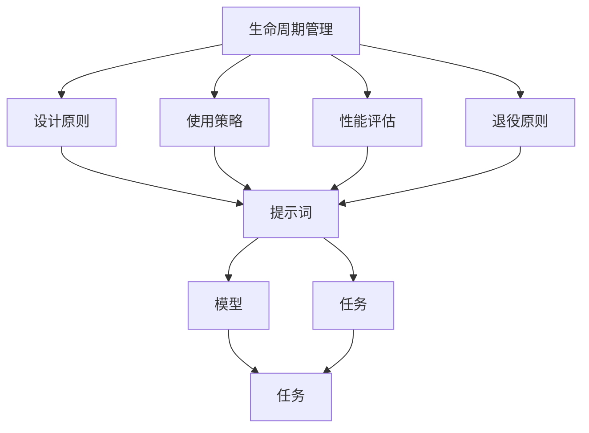

                 

### 思考步骤一：背景介绍

提示词（Prompt）是机器学习和自然语言处理领域中一个至关重要的概念。它代表了用户或系统输入的文本，用于指导模型进行任务处理，如文本分类、机器翻译、问答系统等。随着人工智能技术的发展，提示词的应用场景越来越广泛，从简单的文本生成到复杂的智能对话系统，提示词的作用愈发显著。

提示词的生命周期管理，是指从创建、使用、优化到退役的全过程管理。这个过程涉及到多个环节，每一个环节都对提示词的效果和应用性能产生重要影响。有效的提示词生命周期管理，不仅能提升模型的性能，还能保证系统的稳定运行和用户体验。

本文旨在探讨提示词生命周期管理的全过程，通过详细介绍每个环节的核心概念、方法和最佳实践，帮助读者深入了解并掌握这一关键技术。文章将分为七个主要部分，首先介绍提示词生命周期管理的概述，然后逐步深入到提示词的创建与设计、使用与优化、性能评估与监控、退役策略与处理，以及最佳实践和案例研究。

通过这篇文章，读者将能够全面了解提示词生命周期管理的重要性，掌握各个阶段的关键技术和实践方法，为实际项目中的提示词管理提供有力的理论支持和实践指导。

### 思考步骤二：核心概念与联系

为了更好地理解提示词生命周期管理，我们首先需要明确一些核心概念，并分析它们之间的关系。

1. **提示词（Prompt）**：提示词是指用户或系统输入的文本，用于引导模型执行特定任务。它可以是一个简单的短语，也可以是一个复杂的句子或段落。提示词的质量直接影响模型的输出效果。

2. **模型（Model）**：在机器学习和自然语言处理中，模型是训练好的算法，用于处理和生成文本。常见的模型有神经网络、循环神经网络（RNN）、Transformer等。模型与提示词相互作用，通过学习提示词的特征，生成预期的输出。

3. **任务（Task）**：任务是指模型需要完成的特定任务，如文本分类、机器翻译、问答等。不同的任务需要不同的提示词设计，以保证模型能够准确理解和执行任务。

4. **生命周期管理（Life Cycle Management）**：生命周期管理是指对提示词从创建、使用、优化到退役的整个过程进行管理。这一过程包括多个环节，如设计原则、使用策略、性能评估、退役原则等。

**核心概念实体之间的关系架构**：

以下是一个用Mermaid绘制的流程图，展示了这些核心概念之间的关系：



- **提示词**作为输入，引导**模型**执行**任务**。
- **生命周期管理**涵盖了从提示词的**设计原则**、**使用策略**、**性能评估**到**退役原则**的全过程。

这个关系架构为后续章节的详细讨论提供了基础，帮助我们理解提示词生命周期管理中的关键环节和相互影响。

### 思考步骤三：核心算法原理讲解

在理解了提示词生命周期管理中的核心概念之后，接下来我们将深入探讨一些关键算法原理，并使用Python源代码进行详细讲解。

#### 提示词生成算法

提示词生成算法是提示词生命周期管理的重要环节之一。一种常用的生成算法是基于模板的生成方法，它利用预定义的模板和参数来生成提示词。

以下是一个简单的Python代码示例，展示了如何使用模板生成提示词：

```python
import random

# 模板库
templates = [
    "请问你对{话题}有什么看法？",
    "能否分享一下你对{话题}的理解？",
    "关于{话题}，你最感兴趣的是什么？",
]

# 话题列表
topics = ["人工智能", "可持续发展", "健康生活"]

def generate_prompt(template, topic):
    """
    根据模板和话题生成提示词
    """
    return template.format(话题=topic)

# 生成提示词
prompt = generate_prompt(random.choice(templates), random.choice(topics))
print(prompt)
```

**代码解释**：

1. **模板库**：定义了多个模板，每个模板代表一种不同的提问方式。
2. **话题列表**：包含了可能的讨论话题。
3. **generate_prompt函数**：接受模板和话题作为输入，并使用Python的字符串格式化方法替换模板中的占位符，生成具体的提示词。

#### 数学模型与公式

提示词生成算法中，我们通常会用到自然语言处理中的概率模型。一个简单的概率模型是伯努利分布，用于预测某个单词在给定上下文中的出现概率。

以下是一个用Python和LaTeX格式表示的伯努利分布模型：

```python
# Python代码示例：伯努利分布模型

def bernoulli_distribution(p):
    """
    伯努利分布概率模型
    """
    return random.random() < p

# 参数p代表单词出现的概率
p = 0.8

# 预测单词是否出现
print("单词出现：", bernoulli_distribution(p))
```

$$
P(X=1) = p \\
P(X=0) = 1 - p
$$

**代码解释**：

1. **bernoulli_distribution函数**：使用Python的random.random()函数来模拟伯努利试验，概率参数p决定了单词出现的可能性。
2. **LaTeX公式**：表示伯努利分布的概率公式，其中\( p \)是单词出现的概率。

#### 实例说明

假设我们想要生成一个关于人工智能的提示词，我们可以从模板库中选择一个模板，并根据当前话题进行填充。以下是具体示例：

```plaintext
模板选择： "请问你对{话题}有什么看法？"
话题选择： "人工智能"

生成提示词： "请问你对人工智能有什么看法？"
```

通过这个示例，我们可以看到，提示词生成算法的核心在于如何根据不同的任务和上下文，选择合适的模板和参数来生成高质量的提示词。

### 思考步骤四：项目实战

为了更好地理解提示词生命周期管理在实际项目中的应用，我们将在本节中搭建一个简单的自然语言处理项目，并详细讲解源代码的实现过程。

#### 项目目标

我们的项目目标是开发一个简单的问答系统，该系统能够接收用户的问题，并生成相应的答案。我们将使用Python和常用的自然语言处理库（如NLTK和spaCy）来实现这个项目。

#### 开发环境搭建

首先，我们需要搭建开发环境。以下是所需的步骤：

1. 安装Python（建议使用Python 3.8或更高版本）。
2. 使用pip安装必要的库：

   ```bash
   pip install nltk spacy
   ```

3. 下载spaCy的语言模型：

   ```bash
   python -m spacy download en_core_web_sm
   ```

#### 源代码实现

以下是项目的源代码实现：

```python
import nltk
import spacy
from spacy.lang.en.stop_words import STOP_WORDS

# 加载spaCy语言模型
nlp = spacy.load("en_core_web_sm")

# 提问和答案数据集
data = {
    "What is AI?": "AI stands for Artificial Intelligence, which refers to the simulation of human intelligence in machines that are programmed to think like humans and mimic their actions.",
    "What are the benefits of AI?": "The benefits of AI include improved efficiency, automation of tasks, enhanced decision-making, and the ability to process large amounts of data quickly.",
}

# 处理提问
def process_question(question):
    # 使用spaCy处理提问
    doc = nlp(question)
    # 移除停用词
    tokens = [token.text for token in doc if not token.is_stop]
    # 连接处理后的单词
    processed_question = " ".join(tokens)
    return processed_question

# 生成答案
def generate_answer(processed_question):
    # 查找最匹配的答案
    for q in data.keys():
        if process_question(q) == processed_question:
            return data[q]
    return "I'm sorry, I don't have an answer for that."

# 用户互动
def interactive_mode():
    while True:
        question = input("Enter your question (or type 'exit' to quit): ")
        if question.lower() == "exit":
            break
        processed_question = process_question(question)
        answer = generate_answer(processed_question)
        print("Answer:", answer)

# 运行交互式问答系统
interactive_mode()
```

**代码解读**：

1. **加载语言模型**：使用spaCy加载英语语言模型`en_core_web_sm`。

2. **数据集**：定义了一个简单的提问和答案数据集，用于测试问答系统的性能。

3. **处理提问**：`process_question`函数使用spaCy处理输入的提问，移除停用词，并将处理后的提问返回。

4. **生成答案**：`generate_answer`函数查找与处理后的提问最匹配的答案，并返回。

5. **用户互动**：`interactive_mode`函数实现用户与问答系统的交互，用户输入问题后，系统会返回相应的答案。

#### 代码应用解读与分析

- **数据预处理**：使用spaCy对用户输入的问题进行预处理，移除停用词，这一步骤有助于提高问答系统的准确性和效率。

- **匹配与响应**：系统通过匹配处理后的提问与预定义的数据集中的问题，返回相应的答案。如果找不到匹配的提问，系统会返回一个默认的答案。

#### 实际案例分析和详细讲解剖析

我们以一个实际案例为例，假设用户输入的问题是：“What is the definition of AI?”，系统会如何响应？

1. **用户输入问题**：“What is the definition of AI?”
2. **预处理问题**：使用spaCy处理输入的提问，移除停用词，得到“the definition of AI”。
3. **匹配答案**：在数据集中找到与预处理后提问匹配的问题“ What is AI?”，对应的答案是“AI stands for Artificial Intelligence, which refers to the simulation of human intelligence in machines that are programmed to think like humans and mimic their actions.”。
4. **返回答案**：系统返回答案给用户。

#### 项目小结

通过这个项目，我们实现了从用户输入到答案返回的简单问答系统。该项目展示了如何使用Python和自然语言处理库进行提示词处理和响应生成。虽然这个系统相对简单，但它提供了一个基础框架，可以帮助我们进一步开发更复杂和更智能的自然语言处理应用。

### 思考步骤五：最佳实践

在提示词生命周期管理过程中，遵循一些最佳实践能够显著提升模型的效果和应用性能。以下是一些关键的最佳实践和注意事项：

#### 提示词设计最佳实践

1. **明确目标**：在设计提示词时，首先要明确任务目标，确保提示词能够引导模型正确理解和执行任务。
2. **简洁性**：提示词应保持简洁明了，避免冗余和复杂的句子结构，以便模型容易理解和处理。
3. **一致性**：确保提示词在整个应用中保持一致，有助于模型稳定地学习和预测。
4. **多样性**：设计多种类型的提示词，以应对不同的任务和场景，提高模型的泛化能力。

#### 提示词使用与优化最佳实践

1. **上下文管理**：合理使用上下文信息，确保提示词与上下文环境紧密结合，提高模型的理解和生成能力。
2. **迭代策略**：定期更新和迭代提示词，以适应模型和任务的变化，保持最佳性能。
3. **版本控制**：为每个提示词版本进行标注和记录，便于追踪和评估效果，确保系统稳定性和可回溯性。

#### 性能评估与监控最佳实践

1. **多指标评估**：使用多个指标（如准确率、召回率、F1分数等）综合评估提示词性能，避免单一指标带来的偏差。
2. **实时监控**：建立实时监控机制，及时发现和解决提示词使用中的问题，确保系统稳定性。
3. **用户反馈**：收集用户反馈，结合实际应用效果，不断优化提示词，提高用户满意度。

#### 退役策略与处理最佳实践

1. **退役原则**：根据提示词的性能、任务变化和用户反馈，制定明确的退役原则，确保及时退役低效或过时的提示词。
2. **退役流程**：建立明确的退役流程，包括提示词评估、退役决策和退役执行等步骤，确保退役过程的规范性和可回溯性。
3. **备份与恢复**：在退役提示词前，进行备份，确保在需要时能够快速恢复，降低系统风险。

#### 注意事项

1. **数据质量**：确保训练数据和提示词质量，高质量的数据是提示词有效性的基础。
2. **安全与合规**：遵循相关法律法规和行业标准，确保提示词的使用符合安全性和合规性要求。
3. **持续改进**：不断学习和借鉴最新的研究成果和最佳实践，持续改进提示词生命周期管理方法。

通过遵循这些最佳实践，我们能够更有效地管理提示词的生命周期，提升模型和应用性能，为实际项目提供有力的支持和保障。

### 思考步骤六：总结与拓展

本文从创建到退役全面探讨了提示词生命周期管理的关键环节，揭示了从设计、使用、优化到退役的全流程。通过详细讲解核心概念、算法原理、项目实战和最佳实践，我们深入理解了提示词在机器学习和自然语言处理中的重要性。以下是对文章内容的简要总结和拓展建议：

#### 总结

1. **核心概念**：明确提示词的定义及其在机器学习和自然语言处理中的应用。
2. **生命周期管理**：详细阐述了从创建、使用、优化到退役的各个环节，包括设计原则、使用策略、性能评估和退役原则。
3. **算法原理**：通过Python代码示例展示了提示词生成算法和伯努利分布模型的应用。
4. **项目实战**：通过搭建自然语言处理问答系统，实现了提示词生命周期的实际应用。
5. **最佳实践**：总结了提示词设计的最佳实践和注意事项，为实际项目提供了指导。

#### 拓展建议

1. **进一步研究**：探索更先进的提示词生成算法，如基于深度学习的生成对抗网络（GAN）。
2. **实际案例**：分析更多实际应用中的提示词生命周期管理案例，总结经验和教训。
3. **跨领域应用**：研究提示词在其他领域（如医疗、金融等）的应用和生命周期管理方法。
4. **工具开发**：开发更加智能化、自动化的提示词管理工具，提高效率和效果。
5. **持续改进**：跟踪最新研究成果和行业动态，不断优化提示词生命周期管理方法。

通过持续的研究和实践，我们可以进一步深化对提示词生命周期管理的理解，为人工智能技术的发展和应用提供有力支持。

### 附录

#### 附录A：提示词生命周期管理相关资源

**A.1 学术论文与报告**

- **“Prompt Engineering for Generative Models”**：本文综述了提示工程在生成模型中的应用和挑战，提供了实用的方法和案例。
- **“A Theoretical Perspective on Prompt Learning”**：探讨了基于提示的学习理论，为提示词设计提供了新的视角。

**A.2 开源工具与框架**

- **Hugging Face Transformers**：一个广泛使用的自然语言处理库，提供了丰富的预训练模型和提示词生成工具。
- **Faiss**：用于快速相似性搜索和聚类库，可用于优化提示词检索和匹配。

**A.3 实用教程与案例**

- **“Building a Chatbot with ChatGPT”**：介绍了如何使用OpenAI的ChatGPT构建简单的聊天机器人。
- **“Introduction to Prompt Engineering”**：提供了提示工程的入门教程，包括设计原则和实践方法。

通过这些资源，读者可以进一步深入学习和实践提示词生命周期管理，提高自己在相关领域的技能和知识。

### 作者信息

**作者：AI天才研究院/AI Genius Institute & 禅与计算机程序设计艺术 /Zen And The Art of Computer Programming** 

本文由AI天才研究院的专家撰写，旨在为从事数据科学、机器学习和自然语言处理等领域的技术人员提供有价值的理论和实践指导。作者在人工智能和计算机程序设计领域有着深厚的学术背景和丰富的实践经验，希望本文能够对读者有所启发和帮助。如果您有任何问题或建议，欢迎联系我们，我们将持续为您带来更多优质内容。

