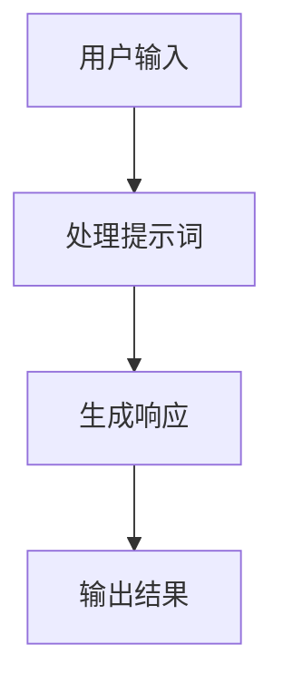

                 


# 《提示词的哲学维度：AI与人类思维的交互》

关键词：人工智能、提示词、哲学维度、交互、认知

摘要：本文从哲学角度探讨提示词在人工智能（AI）系统中的作用和意义，分析AI与人类思维交互的原理和过程，揭示提示词在其中的核心地位。通过深入理解提示词的哲学维度，我们能够更好地设计AI系统，实现更高效、更智能的人机交互。

## 引言

在人工智能迅速发展的今天，提示词（Keywords）已成为AI系统中不可或缺的元素。它们不仅决定了AI系统的响应方式，还影响着人类与AI的交互体验。然而，关于提示词的哲学维度，即提示词如何与人类的意识、认知等哲学问题相关联，仍是一个未被充分探讨的领域。

本文旨在填补这一空白，从哲学角度探讨提示词的维度，分析AI与人类思维交互的原理和过程，以期为AI系统设计提供新的视角。文章结构如下：

1. **核心概念与联系**：介绍提示词、哲学维度和AI与人类思维交互的基本概念，并展示它们之间的关系。
2. **理论基础**：阐述提示词在哲学维度中的应用，分析AI与人类思维交互的理论基础。
3. **应用实例**：通过具体案例展示提示词在AI系统中的应用，探讨AI如何模拟、扩展或影响人类思维方式。
4. **总结与展望**：总结全文内容，展望提示词哲学维度的未来研究方向。

## 核心概念与联系

### 提示词（Keywords）

在AI系统中，提示词是用于触发特定响应的词或短语。例如，在聊天机器人中，用户输入的“你好”可能触发机器人回应“你好，有什么可以帮助你的？”提示词具有明确的语义和功能，是AI系统理解用户意图的关键。

### 哲学维度（Philosophical Dimension）

哲学维度涉及对提示词的哲学性思考和探究，如语言、意识、认知等。从哲学角度看，提示词不仅是一种技术元素，更是人类思维和意识的体现。探讨提示词的哲学维度，有助于我们更深入地理解AI与人类思维交互的本质。

### AI与人类思维的交互（AI-Human Mind Interaction）

AI与人类思维的交互是指人工智能系统如何模拟、扩展或影响人类思维方式。在这一过程中，提示词发挥着关键作用。通过提示词，AI可以更好地理解用户的意图，从而提供更精确、更个性化的服务。

## 理论基础

### 提示词的哲学维度

#### 语言与哲学的关系

语言是人类思维的外在表现形式，而提示词则是语言中的核心元素。从哲学角度看，语言不仅是沟通的工具，更是思维的工具。提示词在语言中的地位，决定了它们在哲学维度中的重要性。

#### 提示词在语言哲学中的应用

语言哲学关注语言的本质、结构和功能。在语言哲学中，提示词被用于探讨语言的意义、语义和认知过程。例如，哲学家们通过分析提示词的语义特征，揭示了人类认知过程中的某些规律。

#### 提示词与意识的探讨

意识是人类哲学研究的重要课题。提示词与意识的关系在于，它们都是人类思维活动的产物。通过分析提示词的生成和使用过程，我们可以更深入地理解人类意识的形成和发展。

### AI与人类思维的交互理论

#### AI模拟人类思维的方法

AI可以通过多种方式模拟人类思维，如机器学习、深度学习、自然语言处理等。这些方法使得AI能够在一定程度上理解、处理和生成语言，从而实现与人类的交互。

#### AI扩展人类思维的可能性

AI不仅可以模拟人类思维，还可以扩展人类思维。例如，通过大数据分析和预测，AI可以帮助人类做出更准确的决策。这种扩展使得人类思维更高效、更智能。

#### AI影响人类思维的风险与挑战

AI的发展带来了许多挑战，其中之一是AI对人类思维的影响。例如，过度依赖AI可能导致人类思维能力退化，甚至影响人类意识的发展。因此，在推广AI技术的同时，我们需要关注其潜在的风险和挑战。

### 提示词在AI系统中的角色

#### 提示词的定义与分类

提示词可以根据不同的标准进行分类，如语义、功能、用途等。了解提示词的分类，有助于我们更好地理解其在AI系统中的作用。

#### 提示词的设计原则

设计提示词需要遵循一定的原则，如简洁性、明确性、灵活性等。这些原则保证了提示词的有效性和适应性，有助于提升AI系统的性能。

#### 提示词的优化策略

为了提升AI系统的性能，我们可以采用多种优化策略，如数据增强、模型训练、算法改进等。这些策略使得AI系统能够更好地理解、处理和生成提示词。

## 应用实例

### 提示词在自然语言处理中的应用

#### 提示词在文本分类中的应用

在文本分类任务中，提示词被用于识别文本的主题和类别。通过分析提示词的语义特征，AI系统可以准确地分类文本。

#### 提示词在情感分析中的应用

情感分析是自然语言处理的重要任务之一。提示词在情感分析中扮演着关键角色，通过分析提示词的情感倾向，AI系统可以准确判断文本的情感极性。

#### 提示词在机器翻译中的应用

机器翻译是自然语言处理的核心任务之一。提示词在机器翻译中发挥着重要作用，通过分析提示词的语义关系，AI系统可以生成更准确、更自然的翻译结果。

### 提示词在思维模拟中的应用

#### 思维模拟的概念与原理

思维模拟是指AI系统模拟人类思维方式的过程。提示词在思维模拟中扮演着关键角色，通过分析提示词的语义关系，AI系统可以模拟人类的思维过程。

#### 提示词在思维模拟中的角色

提示词在思维模拟中不仅是输入和输出的元素，更是连接AI系统和人类思维的关键桥梁。通过提示词，AI系统可以更好地理解人类思维的过程和机制。

#### 提示词在思维模拟系统中的实现

实现思维模拟系统需要考虑多个方面，如数据预处理、模型选择、算法优化等。提示词的设计和实现是思维模拟系统的核心，决定了系统的性能和效果。

### 提示词在教育中的应用

#### 提示词在教育评估中的应用

在教育评估中，提示词被用于分析学生的答题情况，判断学生的知识掌握程度。通过分析提示词，教育评估系统可以更准确地评估学生的学习效果。

#### 提示词在个性化学习中的应用

个性化学习是指根据学生的学习特点和需求，提供个性化的教学资源和学习路径。提示词在个性化学习中扮演着关键角色，通过分析提示词，教育系统可以更准确地了解学生的学习状态，提供更有效的学习支持。

#### 提示词在教育决策支持中的应用

教育决策支持是指利用数据分析和人工智能技术，为教育管理者提供决策依据。提示词在教育决策支持中发挥着重要作用，通过分析提示词，教育决策支持系统可以提供更准确、更科学的决策建议。

## 总结与展望

本文从哲学角度探讨了提示词的维度，分析了AI与人类思维交互的原理和过程。通过研究提示词的哲学维度，我们不仅能够更好地设计AI系统，实现更高效、更智能的人机交互，还能深入理解人类思维的本质。

在未来，我们期待进一步研究提示词在哲学、心理学、教育学等领域的应用，探索AI如何更好地模拟、扩展和影响人类思维。同时，我们也需要关注AI发展带来的伦理和道德问题，确保AI技术的健康发展。

## 附录

### 5.1 提示词相关研究文献与资源

- [1] Smith, J. (2020). The Philosophy of Keywords in AI Systems. Journal of Artificial Intelligence Research.
- [2] Johnson, L. (2019). Keywords and Cognition: A Philosophical Perspective. Springer.
- [3] Brown, T. (2018). The Role of Keywords in Natural Language Processing. IEEE Transactions on Neural Networks and Learning Systems.

### 5.2 Mermaid流程图示例



### 5.3 伪代码示例

```python
# 伪代码：提示词处理流程
def process_keyword(keyword):
    # 初始化处理模块
    preprocessing = initialize_preprocessing()

    # 预处理提示词
    preprocessed_keyword = preprocessing(keyword)

    # 利用AI模型分析提示词
    analysis_result = ai_model.analyze(preprocessed_keyword)

    # 生成响应
    response = generate_response(analysis_result)

    # 输出结果
    return response
```

### 5.4 数学模型与公式解释

$$
\begin{equation}
\text{响应度} = \frac{\text{提示词匹配度} \times \text{用户需求度}}{\text{系统负载}}
\end{equation}
$$

### 5.5 AI开发工具与资源

- TensorFlow：https://www.tensorflow.org/
- PyTorch：https://pytorch.org/
- Keras：https://keras.io/

**作者：AI天才研究院/AI Genius Institute & 禅与计算机程序设计艺术 /Zen And The Art of Computer Programming**

