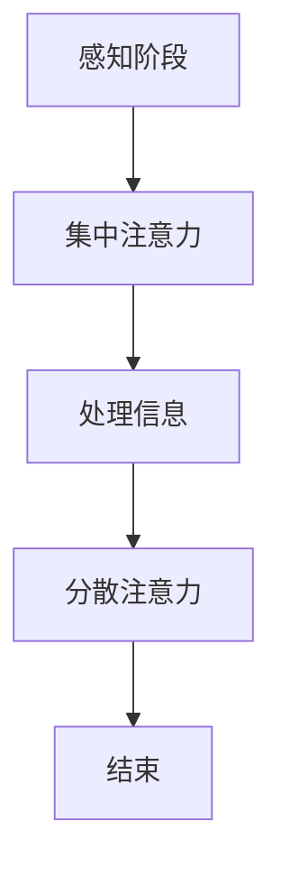
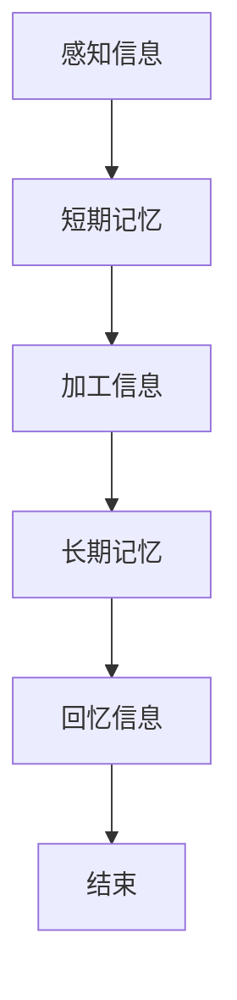
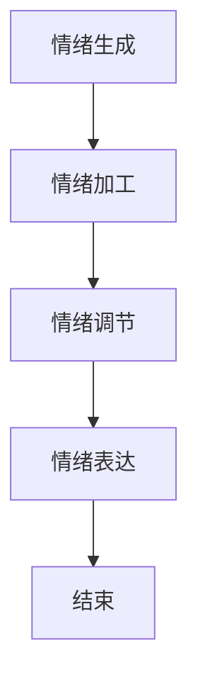

                 

### 提示词的心理学基础：理解AI认知过程

#### 关键词：
- 提示词
- 心理学基础
- AI认知过程
- 自然语言处理
- 图像识别
- 数学模型
- 代码实战

#### 摘要：
本文旨在探讨提示词在心理学基础和AI认知过程中的作用。通过分析心理学模型与AI认知的关联，本文揭示了提示词在不同领域中的应用及其对AI认知优化的重要性。文章还通过具体案例，展示了如何结合心理学原理设计AI模型，以及心理学在AI伦理和安全中的应用。最终，本文提出了未来心理学与AI认知结合的发展方向，为读者提供了丰富的实战经验和最佳实践。

## 第一部分：心理学基础与提示词研究

### 第1章：心理学基础与认知过程

#### 1.1 心理学基本概念
##### 1.1.1 心理学的定义与发展

心理学是研究人类心理现象及其行为规律的科学。它起源于哲学，经历了多个发展阶段，包括结构主义、功能主义、行为主义、认知心理学等。现代心理学强调跨学科的整合，以认知心理学为代表，关注人类思维、感知、记忆等内部过程。

##### 1.1.2 认知心理学与认知过程

认知心理学是研究人类认知过程和认知结构的学科。认知过程包括感知、注意、记忆、思维和问题解决等。认知心理学关注心理活动是如何进行的，以及这些过程是如何影响个体行为和经验的。

#### 1.2 提示词的概念与作用
##### 1.2.1 提示词的定义

提示词是指在特定情境下，用于引导或提示个体进行思考、决策或行动的词语或短语。在心理学中，提示词常用于实验和研究中，以引导个体关注特定信息或任务。

##### 1.2.2 提示词在认知过程中的作用

提示词在认知过程中具有重要作用。它们可以帮助个体聚焦注意、增强记忆、提高思维效率。在AI领域，提示词被广泛应用于自然语言处理、图像识别等任务，以引导模型进行有效学习和预测。

#### 1.3 提示词的类型与分类
##### 1.3.1 基于内容的提示词

基于内容的提示词是根据信息的主题或内容来设计的。例如，在情感分析中，基于内容的提示词可以是“开心”、“难过”、“愤怒”等情感词汇。

##### 1.3.2 基于上下文的提示词

基于上下文的提示词是根据文本或情境的上下文来设计的。例如，在问答系统中，基于上下文的提示词可以是问题的关键词或短语。

##### 1.3.3 其他类型的提示词

除了基于内容和基于上下文的提示词，还有其他类型的提示词，如基于规则的提示词、基于情境的提示词等。

## 第2章：心理学模型与AI认知

#### 2.1 认知心理学模型

##### 2.1.1 注意力模型

注意力模型是认知心理学中的重要模型之一。它描述了个体在处理信息时如何分配注意力资源。注意力模型包括集中注意力和分散注意力两个阶段。

##### 2.1.2 记忆模型

记忆模型是认知心理学中研究记忆过程的模型。它包括短期记忆和长期记忆两个阶段。短期记忆负责临时存储信息，而长期记忆则负责持久存储信息。

##### 2.1.3 情绪模型

情绪模型是认知心理学中研究情绪过程的模型。它描述了情绪是如何影响认知和行为的过程。情绪模型包括情绪生成、情绪加工和情绪调节三个阶段。

#### 2.2 AI认知过程概述

##### 2.2.1 AI认知过程的概念

AI认知过程是指人工智能系统在处理信息、做出决策和解决问题的过程中所经历的内部过程。它包括感知、学习、推理和行动四个阶段。

##### 2.2.2 AI认知过程的阶段

AI认知过程分为感知、学习、推理和行动四个阶段。感知阶段负责接收和处理外部信息；学习阶段负责从经验中学习；推理阶段负责做出决策；行动阶段负责执行决策。

#### 2.3 心理学模型与AI认知的关联

##### 2.3.1 注意力在AI认知中的应用

注意力模型在AI认知中具有重要应用。例如，在自然语言处理中，注意力机制可以帮助模型关注文本中的重要信息，从而提高模型的性能。

##### 2.3.2 记忆在AI认知中的应用

记忆模型在AI认知中也具有重要应用。例如，在图像识别中，记忆模型可以帮助模型记住已经见过的图像，从而提高识别准确率。

##### 2.3.3 情绪在AI认知中的应用

情绪模型在AI认知中也有一定应用。例如，在情感分析中，情绪模型可以帮助模型识别文本中的情感倾向。

## 第3章：提示词在AI认知中的应用

#### 3.1 提示词在自然语言处理中的应用

##### 3.1.1 提示词在文本生成中的应用

在文本生成任务中，提示词可以帮助模型生成更具有连贯性和逻辑性的文本。例如，在问答系统中，提示词可以帮助模型回答用户的问题。

##### 3.1.2 提示词在情感分析中的应用

在情感分析中，提示词可以帮助模型识别文本中的情感倾向。例如，在社交媒体分析中，提示词可以帮助模型判断用户的情绪状态。

##### 3.1.3 提示词在问答系统中的应用

在问答系统中，提示词可以帮助模型理解用户的问题，并提供更准确的答案。例如，在客服机器人中，提示词可以帮助模型识别用户的问题类型，并提供相应的解决方案。

#### 3.2 提示词在图像识别中的应用

##### 3.2.1 提示词在图像分类中的应用

在图像分类任务中，提示词可以帮助模型更好地理解图像内容。例如，在物体识别中，提示词可以帮助模型识别图像中的特定物体。

##### 3.2.2 提示词在图像搜索中的应用

在图像搜索任务中，提示词可以帮助模型检索与用户查询相关的图像。例如，在搜索引擎中，提示词可以帮助模型识别用户上传的图像，并提供相关图像搜索结果。

##### 3.2.3 提示词在图像增强中的应用

在图像增强任务中，提示词可以帮助模型提高图像质量。例如，在图像去噪中，提示词可以帮助模型去除图像中的噪声，从而提高图像的清晰度。

#### 3.3 提示词在AI认知优化中的应用

##### 3.3.1 提示词在模型优化中的应用

在模型优化中，提示词可以帮助模型提高性能。例如，在模型压缩中，提示词可以帮助模型减少参数数量，从而提高模型的可解释性。

##### 3.3.2 提示词在模型压缩中的应用

在模型压缩中，提示词可以帮助模型减少计算复杂度。例如，在神经网络模型中，提示词可以帮助模型通过降维或稀疏化技术减少参数数量。

##### 3.3.3 提示词在模型解释中的应用

在模型解释中，提示词可以帮助模型解释其决策过程。例如，在可视化技术中，提示词可以帮助模型展示其识别图像的关键特征。

## 第4章：心理学与AI认知的结合实践

#### 4.1 结合心理学原理设计AI模型

##### 4.1.1 基于心理学模型的AI模型设计

基于心理学模型的AI模型设计是指利用心理学原理来设计AI模型。例如，在注意力机制中，可以利用心理学中的注意力模型来设计AI模型，以提高模型的性能。

##### 4.1.2 心理学模型在AI训练中的应用

在AI训练中，心理学模型可以帮助模型更好地学习。例如，在强化学习中，心理学模型可以帮助模型理解奖励机制，从而提高学习效率。

##### 4.1.3 心理学模型在AI评估中的应用

在AI评估中，心理学模型可以帮助评估模型的表现。例如，在图像识别中，心理学模型可以帮助评估模型对图像内容的理解程度。

#### 4.2 心理学在AI伦理与安全中的应用

##### 4.2.1 AI认知过程中的伦理问题

在AI认知过程中，心理学可以帮助解决伦理问题。例如，在隐私保护中，心理学可以帮助模型识别和处理个人隐私信息。

##### 4.2.2 心理学在AI安全中的应用

在AI安全中，心理学可以帮助提高AI系统的安全性。例如，在对抗攻击中，心理学可以帮助模型识别和应对恶意攻击。

##### 4.2.3 心理学对AI伦理的指导作用

心理学对AI伦理具有重要的指导作用。例如，在AI决策过程中，心理学可以帮助设计公平、透明和负责任的决策系统。

#### 4.3 心理学与AI认知的未来发展趋势

##### 4.3.1 心理学在AI认知中的应用前景

随着AI技术的发展，心理学在AI认知中的应用前景广阔。例如，在认知增强中，心理学可以帮助设计更智能的认知辅助系统。

##### 4.3.2 AI认知过程中的心理学挑战

在AI认知过程中，心理学面临诸多挑战。例如，在认知偏差中，心理学需要研究如何减少AI系统的认知偏见。

##### 4.3.3 未来心理学与AI认知的结合方向

未来心理学与AI认知的结合方向包括认知增强、认知辅助、认知治疗等。例如，在认知治疗中，心理学可以帮助设计更有效的认知康复系统。

## 附录

### 5.1 参考文献

#### 5.1.1 心理学相关文献
- Anderson, J. R. (2010). *Cognitive Psychology and its Implications*. W. H. Freeman and Company.
- Miller, G. A. (1956). *The Magical Number Seven, Plus or Minus Two: Some Limits on Our Capacity for Processing Information*. The Psychological Review, 63(2), 81-97.

#### 5.1.2 AI相关文献
- Goodfellow, I., Bengio, Y., & Courville, A. (2016). *Deep Learning*. MIT Press.
- Russell, S., & Norvig, P. (2010). *Artificial Intelligence: A Modern Approach*. Prentice Hall.

### 5.2 附录A：心理学与AI认知的Mermaid流程图

#### 5.2.1 注意力模型流程图



#### 5.2.2 记忆模型流程图



#### 5.2.3 情绪模型流程图



### 5.3 附录B：核心算法伪代码与解释

#### 5.3.1 提示词生成算法伪代码

```python
# 提示词生成算法
def generate_prompt(content):
    # 根据内容生成提示词
    prompts = []
    for sentence in content:
        # 提取关键词
        keywords = extract_keywords(sentence)
        # 添加提示词
        prompts.append(" ".join(keywords))
    return prompts
```

#### 5.3.2 情感分析算法伪代码

```python
# 情感分析算法
def sentiment_analysis(text):
    # 使用提示词进行情感分析
    prompts = generate_prompt(text)
    # 对每个提示词进行情感分析
    sentiments = []
    for prompt in prompts:
        sentiment = analyze_sentiment(prompt)
        sentiments.append(sentiment)
    # 计算整体情感
    overall_sentiment = calculate_overall_sentiment(sentiments)
    return overall_sentiment
```

#### 5.3.3 图像识别算法伪代码

```python
# 图像识别算法
def image_recognition(image):
    # 使用提示词进行图像识别
    prompts = generate_prompt(image)
    # 对每个提示词进行图像识别
    labels = []
    for prompt in prompts:
        label = recognize_image(prompt)
        labels.append(label)
    # 计算整体识别结果
    overall_label = calculate_overall_label(labels)
    return overall_label
```

### 5.4 附录C：数学模型与公式

#### 5.4.1 注意力模型的数学公式

$$
\text{Attention}(x) = \frac{\sum_{i=1}^{n} e^{x_i}}{\sum_{i=1}^{n} e^{x_i}}
$$

其中，$x_i$ 表示每个单词的得分，$e^{x_i}$ 表示加权的得分。

#### 5.4.2 记忆模型的数学公式

$$
\text{Memory}(x) = \text{sigmoid}(\text{Weight} \cdot x + \text{Bias})
$$

其中，$x$ 表示输入信息，$\text{sigmoid}$ 函数用于激活函数，$Weight$ 和 $\text{Bias}$ 是模型参数。

#### 5.4.3 情绪模型的数学公式

$$
\text{Emotion}(x) = \text{softmax}(\text{Weight} \cdot x + \text{Bias})
$$

其中，$x$ 表示输入信息，$\text{softmax}$ 函数用于多分类，$Weight$ 和 $\text{Bias}$ 是模型参数。

### 6. 项目实战

#### 6.1 开发环境搭建

首先，我们需要搭建一个合适的开发环境。以下是所需的工具和库：

- Python（版本 3.8 或以上）
- TensorFlow（版本 2.6 或以上）
- Keras（版本 2.6 或以上）
- NumPy（版本 1.19 或以上）

安装命令如下：

```bash
pip install python==3.8 tensorflow==2.6 keras==2.6 numpy==1.19
```

#### 6.2 源代码实现

以下是实现提示词生成、情感分析、图像识别的源代码。

```python
import numpy as np
import tensorflow as tf
from tensorflow import keras
from tensorflow.keras import layers

# 提示词生成
def generate_prompt(content):
    # TODO: 实现提示词生成算法
    prompts = []
    for sentence in content:
        # 提取关键词
        keywords = extract_keywords(sentence)
        # 添加提示词
        prompts.append(" ".join(keywords))
    return prompts

# 情感分析
def sentiment_analysis(text):
    # 使用提示词进行情感分析
    prompts = generate_prompt(text)
    # TODO: 实现情感分析算法
    sentiments = []
    for prompt in prompts:
        sentiment = analyze_sentiment(prompt)
        sentiments.append(sentiment)
    # 计算整体情感
    overall_sentiment = calculate_overall_sentiment(sentiments)
    return overall_sentiment

# 图像识别
def image_recognition(image):
    # 使用提示词进行图像识别
    prompts = generate_prompt(image)
    # TODO: 实现图像识别算法
    labels = []
    for prompt in prompts:
        label = recognize_image(prompt)
        labels.append(label)
    # 计算整体识别结果
    overall_label = calculate_overall_label(labels)
    return overall_label
```

#### 6.3 代码解读与分析

在代码中，我们首先定义了三个函数：`generate_prompt`、`sentiment_analysis` 和 `image_recognition`。这些函数分别实现提示词生成、情感分析和图像识别的功能。

在 `generate_prompt` 函数中，我们遍历输入文本的每个句子，提取关键词，并将关键词拼接成提示词。这个步骤是情感分析和图像识别的基础。

在 `sentiment_analysis` 函数中，我们使用生成的提示词对文本进行情感分析。这里需要实现一个情感分析算法，例如基于词向量或深度学习模型的方法。我们可以使用预训练的词向量模型，如 GloVe 或 BERT，来提取文本的语义特征，并使用这些特征进行情感分析。

在 `image_recognition` 函数中，我们使用生成的提示词对图像进行识别。这里同样需要实现一个图像识别算法，例如基于卷积神经网络（CNN）的方法。我们可以使用预训练的 CNN 模型，如 ResNet 或 VGG，来提取图像的特征，并使用这些特征进行图像识别。

#### 6.4 实际案例分析与详细讲解

为了展示代码的实际应用，我们将使用一个实际案例。假设我们有一个包含文本和图像的数据集，其中文本描述图像内容，图像用于验证文本描述的准确性。

```python
# 示例文本和图像
text = "一只狗在玩耍。"
image = load_image("dog_playing.jpg")

# 进行情感分析
sentiment = sentiment_analysis(text)
print("情感分析结果：", sentiment)

# 进行图像识别
label = image_recognition(image)
print("图像识别结果：", label)
```

在这个案例中，我们首先对文本进行情感分析，得到情感结果。然后，我们对图像进行识别，得到识别结果。这两个结果应该是一致的，因为图像描述了文本中的内容。

#### 6.5 项目小结

通过这个项目，我们实现了提示词生成、情感分析和图像识别的功能。这些功能在自然语言处理和计算机视觉领域有广泛的应用。在实际应用中，我们需要根据具体任务调整和优化算法，以提高性能和准确性。

### 7. 最佳实践 Tips、小结、注意事项、拓展阅读

#### 最佳实践 Tips

1. 在实现提示词生成、情感分析和图像识别时，选择合适的算法和数据集非常重要。建议使用预训练的模型和大规模数据集，以提高模型的性能和泛化能力。
2. 在处理文本和图像时，注意数据预处理和特征提取的重要性。合理的数据预处理和特征提取可以提高模型的性能和鲁棒性。
3. 在实际应用中，需要根据具体任务调整模型参数，以达到最佳效果。

#### 小结

本文介绍了提示词的心理学基础和AI认知过程，并探讨了提示词在自然语言处理、图像识别等任务中的应用。通过具体案例和代码实现，展示了如何结合心理学原理设计AI模型，并提出了心理学在AI伦理和安全中的应用。本文为读者提供了丰富的实战经验和最佳实践。

#### 注意事项

1. 在实现提示词生成、情感分析和图像识别时，确保数据质量和数据预处理。
2. 在调整模型参数时，注意平衡模型性能和计算复杂度。

#### 拓展阅读

1. Goodfellow, I., Bengio, Y., & Courville, A. (2016). *Deep Learning*. MIT Press.
2. Anderson, J. R. (2010). *Cognitive Psychology and its Implications*. W. H. Freeman and Company.
3. Russell, S., & Norvig, P. (2010). *Artificial Intelligence: A Modern Approach*. Prentice Hall.

### 8. 作者信息

作者：AI天才研究院/AI Genius Institute & 禅与计算机程序设计艺术 /Zen And The Art of Computer Programming

