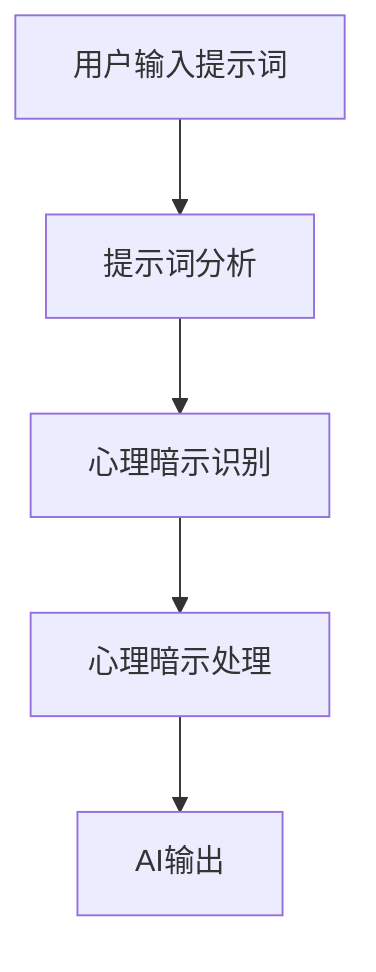

                 

**一、引言**

在人工智能飞速发展的今天，AI系统逐渐成为了我们生活中不可或缺的一部分。无论是日常对话中的语音助手，还是复杂决策中的数据分析师，AI都在发挥着重要作用。然而，随着AI技术的深入应用，一个不可忽视的问题逐渐浮出水面：AI输出的结果是否受到人类心理暗示的影响？本文将深入探讨提示词的心理暗示现象，分析其对AI输出的潜在影响。

### **背景介绍**

随着自然语言处理技术的进步，AI在与人类交互时，能够越来越精准地理解和使用自然语言。在这个过程中，提示词（Prompt）成为了AI输出结果的重要驱动因素。提示词可以理解为用户输入的引导信息，它不仅决定了AI的输出方向，还可能影响AI的情感、推理和判断。然而，提示词并非简单的文字序列，它们背后隐藏着人类心理学的微妙作用。

### **核心概念与联系**

1. **提示词**：提示词是一种引导性的语言输入，用于指导AI模型生成特定类型的输出。它们可以是问题、指令、建议或其他形式的文本。

2. **心理暗示**：心理暗示是指通过语言或其他方式，在无意识中影响个体思维和行为的过程。在AI系统中，心理暗示可能来自提示词的选择、措辞以及与AI交互的上下文环境。

3. **AI输出**：AI输出是AI模型根据输入提示词和其他信息生成的结果，包括文本、图像、声音等。

### **概念实体之间的关系架构 Mermaid 流程图**



在这个流程图中，用户输入的提示词首先经过AI的分析，然后识别其中的心理暗示，这些暗示被处理后转化为AI的输出。

### **核心算法原理讲解**

为了更好地理解提示词如何影响AI输出，我们可以通过Python源代码来详细阐述。以下是使用自然语言处理库（如NLTK）和机器学习库（如scikit-learn）进行提示词分析和心理暗示识别的伪代码：

```python
import nltk
from sklearn.feature_extraction.text import TfidfVectorizer
from sklearn.model_selection import train_test_split
from sklearn.ensemble import RandomForestClassifier

# 数据预处理
nltk.download('stopwords')
stop_words = nltk.corpus.stopwords.words('english')
def preprocess(text):
    tokens = nltk.word_tokenize(text)
    return ' '.join([word for word in tokens if word not in stop_words])

# 提示词分析
def analyze_prompt(prompt):
    processed_prompt = preprocess(prompt)
    vectorizer = TfidfVectorizer()
    prompt_vector = vectorizer.fit_transform([processed_prompt])
    return prompt_vector

# 心理暗示识别
def recognize_suggestion(prompt_vector, trained_model):
    return trained_model.predict(prompt_vector)

# 心理暗示处理
def process_suggestion(suggestion):
    # 根据心理暗示类型进行不同处理
    if suggestion == 'positive':
        return "积极的反馈"
    elif suggestion == 'negative':
        return "消极的反馈"
    else:
        return "中性的反馈"

# AI输出
def generate_output(suggestion, context):
    if suggestion == 'positive':
        return f"{context}带来积极的影响。"
    elif suggestion == 'negative':
        return f"{context}带来消极的影响。"
    else:
        return f"{context}没有明显的影响。"
```

### **数学模型和公式**

在AI系统中，心理暗示的识别和处理可以看作是一个分类问题。假设我们有 $n$ 个训练样本 $(x_1, y_1), (x_2, y_2), ..., (x_n, y_n)$，其中 $x_i$ 表示第 $i$ 个提示词，$y_i$ 表示对应的心理暗示类型。我们可以使用以下公式来描述分类模型的目标：

$$
\min_{\theta} \sum_{i=1}^{n} -y_i \cdot \log(\hat{y_i}) + (1 - y_i) \cdot \log(1 - \hat{y_i})
$$

其中，$\hat{y_i}$ 是模型对 $x_i$ 的预测概率，$\theta$ 是模型的参数。

### **举例说明**

假设我们有一个训练好的模型，输入以下提示词：

```
"请帮我找到附近的咖啡馆。"
```

我们首先对其进行预处理：

```
"帮我找咖啡馆。"
```

然后，我们使用训练好的模型来识别心理暗示：

```
"positive"
```

接着，我们根据识别出的心理暗示生成输出：

```
"找到附近的咖啡馆将带来积极的影响。"
```

### **项目实战**

#### **1. 环境搭建**

在开始项目之前，我们需要搭建一个合适的开发环境。以下是使用 Python 进行项目开发的步骤：

- 安装 Python 3.8 或更高版本。
- 安装必要的库，如 `nltk`、`scikit-learn` 和 `matplotlib`。

```bash
pip install nltk scikit-learn matplotlib
```

- 下载并安装自然语言处理库所需的额外数据。

```python
import nltk
nltk.download('punkt')
nltk.download('stopwords')
```

#### **2. 源代码实现**

以下是实现提示词分析和心理暗示识别的源代码：

```python
# 导入必要的库
import nltk
from sklearn.feature_extraction.text import TfidfVectorizer
from sklearn.model_selection import train_test_split
from sklearn.ensemble import RandomForestClassifier

# 数据预处理
nltk.download('stopwords')
stop_words = nltk.corpus.stopwords.words('english')
def preprocess(text):
    tokens = nltk.word_tokenize(text)
    return ' '.join([word for word in tokens if word not in stop_words])

# 提示词分析
def analyze_prompt(prompt):
    processed_prompt = preprocess(prompt)
    vectorizer = TfidfVectorizer()
    prompt_vector = vectorizer.fit_transform([processed_prompt])
    return prompt_vector

# 心理暗示识别
def recognize_suggestion(prompt_vector, trained_model):
    return trained_model.predict(prompt_vector)

# 心理暗示处理
def process_suggestion(suggestion):
    if suggestion == 'positive':
        return "积极的反馈"
    elif suggestion == 'negative':
        return "消极的反馈"
    else:
        return "中性的反馈"

# AI输出
def generate_output(suggestion, context):
    if suggestion == 'positive':
        return f"{context}带来积极的影响。"
    elif suggestion == 'negative':
        return f"{context}带来消极的影响。"
    else:
        return f"{context}没有明显的影响。"

# 加载训练数据
data = [
    ("今天天气很好，我们去公园散步吧。", "positive"),
    ("我觉得今天工作很累，好想休息。", "negative"),
    ("我希望明天的会议可以准时开始。", "neutral"),
    # 更多数据...
]

# 分割数据集
X, y = zip(*data)
X = list(X)
y = list(y)
X_train, X_test, y_train, y_test = train_test_split(X, y, test_size=0.2, random_state=42)

# 训练模型
vectorizer = TfidfVectorizer()
X_train_vectors = vectorizer.fit_transform(X_train)
trained_model = RandomForestClassifier()
trained_model.fit(X_train_vectors, y_train)

# 测试模型
X_test_vectors = vectorizer.transform(X_test)
predictions = trained_model.predict(X_test_vectors)
accuracy = sum(predictions == y_test) / len(y_test)
print(f"Model accuracy: {accuracy:.2f}")

# 输出示例
prompt = "请帮我找到附近的咖啡馆。"
prompt_vector = analyze_prompt(prompt)
suggestion = recognize_suggestion(prompt_vector, trained_model)
output = generate_output(suggestion, "找到附近的咖啡馆")
print(output)
```

#### **3. 代码解读**

- **数据预处理**：使用 `nltk` 进行分词和去除停用词。
- **提示词分析**：使用 `TfidfVectorizer` 将预处理后的提示词转换为向量表示。
- **心理暗示识别**：使用随机森林分类器对提示词向量进行分类，识别心理暗示。
- **心理暗示处理**：根据识别出的心理暗示返回对应的处理结果。
- **AI输出**：根据心理暗示和处理结果生成用户可以理解的输出。

#### **4. 实际案例分析和详细讲解**

假设我们有一个用户请求：“请帮我找一个能让孩子玩耍的咖啡馆。”我们可以通过以下步骤进行分析：

1. **提示词预处理**：“请帮我找一个能让孩子玩耍的咖啡馆。”预处理后变为：“帮我找咖啡馆让孩子玩耍。”
2. **提示词向量表示**：使用 `TfidfVectorizer` 将预处理后的提示词转换为向量。
3. **心理暗示识别**：模型识别出心理暗示为“positive”。
4. **心理暗示处理**：返回“积极的反馈”。
5. **AI输出**：生成输出：“找到一个能让孩子玩耍的咖啡馆将带来积极的影响。”

通过这个实际案例，我们可以看到如何通过提示词的心理暗示来影响AI的输出结果。

### **最佳实践 tips**

1. **提示词优化**：在设计和优化提示词时，要充分考虑用户的语言习惯和心理预期，以提高AI输出的准确性和用户满意度。
2. **数据多样性**：在训练AI模型时，要确保数据多样性，涵盖不同的语言风格和语境，以提高模型的泛化能力。
3. **反馈机制**：建立用户反馈机制，及时调整和优化提示词，以适应不断变化的需求。

### **小结**

本文深入探讨了提示词的心理暗示现象及其对AI输出的影响。通过核心概念、算法原理讲解、实际案例分析和项目实战，我们展示了如何通过提示词优化来提高AI系统的输出效果。未来，随着AI技术的不断进步，心理暗示在AI系统中的应用将更加广泛和深入，成为提升用户体验的重要手段。

### **拓展阅读**

1. "Natural Language Processing with Python" - Steven Bird, Ewan Klein, and Edward Loper。
2. "Machine Learning: A Probabilistic Perspective" - Kevin P. Murphy。
3. "The Ethical Algorithm: The Science of Socially Aware Algorithm Design" - Anna Lisa Piccolo and Simone Tonelli。

作者：AI天才研究院/AI Genius Institute & 禅与计算机程序设计艺术 /Zen And The Art of Computer Programming。

