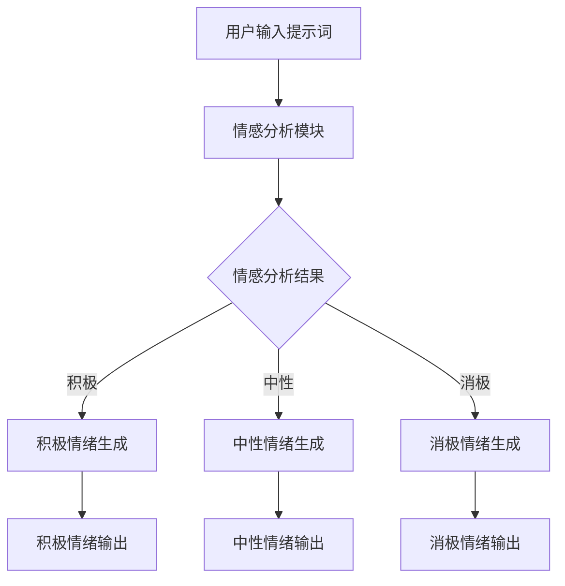
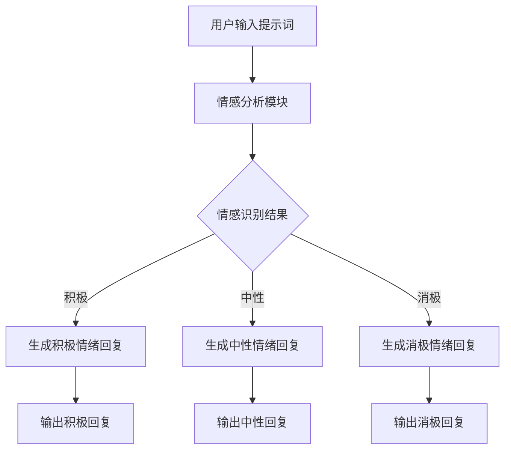

                 

## 提示词的情感因素：影响AI输出的情绪

### 关键词

- 情感因素
- AI输出
- 提示词分析
- 情感识别
- 聊天机器人
- 自然语言处理
- 情感算法

### 摘要

本文旨在探讨情感因素对人工智能（AI）输出情绪的影响。首先，我们回顾了情感因素的基础理论，包括情感的分类和生物学基础。接着，介绍了人工智能的发展历程和核心技术，重点分析了情感因素在AI中的应用。随后，详细讲解了提示词的情感分析方法和其在实际应用中的表现。本文还深入探讨了情感因素如何影响AI的决策、聊天机器人和写作输出。通过实例和Python代码，我们展示了情感分析算法的原理和实现。最后，本文展望了情感因素在AI中的未来发展，并总结了本文的主要内容和重要性。通过本文的阅读，读者将更好地理解情感因素在AI中的作用，以及如何通过情感分析技术提升AI的输出情绪。

## 引言

随着人工智能（AI）技术的飞速发展，机器与人类之间的交互变得更加自然和紧密。在这种交互过程中，情感因素扮演着至关重要的角色。情感不仅影响人类的行为和决策，同样也能在某种程度上影响AI的输出情绪。因此，理解情感因素如何影响AI的输出情绪，对于提升AI与人交互的体验至关重要。

本文的主题是“提示词的情感因素：影响AI输出的情绪”。我们将通过以下几个部分来展开讨论：

1. **情感因素的基础理论**：首先介绍情感的分类、生物学基础以及在人际交往中的作用。
2. **AI概述**：回顾AI的发展历程、核心技术以及情感因素在AI中的应用。
3. **提示词的情感分析**：讲解提示词的定义、情感分析的方法以及实际应用。
4. **情感因素对AI输出情绪的影响**：分析情感因素对AI决策、聊天机器人和写作输出情绪的影响。
5. **实践应用**：介绍情感因素在自然语言处理、聊天机器人和AI艺术创作中的应用实例。
6. **未来发展**：探讨情感因素在AI中的未来发展，包括面临的挑战和趋势。

通过本文的阅读，读者将全面了解情感因素在AI中的作用，掌握情感分析的核心技术和应用方法，并为未来的研究和实践提供参考。

### 情感因素与AI输出的关系

情感因素在AI输出情绪中的作用是多层次且复杂的。首先，我们需要明确情感的定义。情感是指个体在特定情境下体验到的主观体验，通常包括愉快、悲伤、愤怒、恐惧等。情感不仅影响个体的行为和决策，还影响人与人之间的交流和互动。同样，情感因素对AI输出的情绪也有着深远的影响。

在AI系统中，情感因素主要通过提示词（或输入文本）来传递。提示词是用户与AI系统交互的基本单元，包含了用户的情感状态和意图。通过分析这些提示词，AI系统能够识别出其中的情感因素，并据此调整其输出情绪。例如，当用户输入一个带有负面情感的词汇时，AI系统可能会生成一个安慰或回应的回复，而正面情感的词汇可能会得到鼓励或积极的反馈。

情感因素影响AI输出的情绪主要表现在以下几个方面：

1. **情绪识别与回应**：AI系统能够通过情感分析技术识别输入文本中的情感，并据此生成相应的情绪回应。例如，在聊天机器人中，当用户表现出悲伤时，系统可能会发送一个慰问或安慰的信息。

2. **个性化交互**：情感因素帮助AI系统更好地理解用户的情感状态，从而实现个性化的交互。通过识别用户的情感，AI系统能够根据不同情境提供更加合适的回应，提升用户的整体体验。

3. **情绪调节**：AI系统可以运用情感因素来调节自身的情绪输出。例如，在处理某些敏感或复杂情境时，系统可以通过情感分析来识别潜在的情绪风险，并调整输出策略，避免引发不必要的情绪冲突。

4. **增强学习**：情感因素还可以用于AI系统的增强学习。通过分析用户的情感反馈，AI系统可以不断调整和优化其行为模式，提升其适应性和情绪智能。

总的来说，情感因素与AI输出的关系是相互促进的。通过理解和利用情感因素，AI系统能够更好地模拟人类的情感反应，提升交互体验。同时，这种交互也有助于AI系统自身的成长和学习，推动人工智能技术的不断进步。在接下来的部分中，我们将深入探讨情感因素在AI中的具体应用和实现技术。

### 情感因素的基础理论

情感因素在AI中的应用离不开对其基础理论的理解。为了深入探讨情感因素，我们首先需要了解情感的分类、生物学基础以及在人际交往中的作用。

#### 情感的分类

情感可以分为基本情感和复合情感。基本情感是人们普遍体验到的基本情感，如愉悦、悲伤、愤怒、恐惧、厌恶和惊奇等。这些基本情感是跨文化的、普遍的，对人类的生存和适应至关重要。复合情感则是基本情感的组合，如焦虑、羞耻、自豪、爱等，它们通常与特定情境或人际关系相关。

#### 情感的生物学基础

情感的生物学基础主要涉及神经系统和内分泌系统。神经系统通过神经元和神经递质的传递，调节情感的产生和表达。例如，多巴胺和血清素是影响愉悦感的神经递质，而肾上腺素和皮质醇则与焦虑和压力相关。内分泌系统通过激素的分泌，调节情感状态，例如，肾上腺素和皮质醇的分泌可以增加个体的警觉性和反应速度。

#### 人际交往中的情感因素

在人际交往中，情感因素起着关键作用。情感交流是人类建立和维持社会关系的重要手段。积极的情感交流可以增进人际关系，增强信任和理解。而消极的情感交流则可能导致冲突和误解。情感因素还影响人们的沟通策略和互动方式。例如，当人们感到愉悦和安心时，他们更容易采用开放和合作的沟通方式；而当他们感到愤怒或恐惧时，可能会变得更加防御性和攻击性。

#### 情感在AI中的应用

在AI领域，情感因素的应用主要体现在以下几个方面：

1. **情感识别**：通过情感分析技术，AI系统可以识别文本或语音中的情感，从而理解用户的情感状态和意图。

2. **情感生成**：AI系统可以根据情感识别的结果，生成相应的情感回应，如安慰、鼓励或拒绝等。

3. **情感调节**：AI系统可以通过情感分析，识别和调节用户的情感，从而提供更加个性化的服务。

4. **情感增强学习**：通过分析用户的情感反馈，AI系统可以不断优化其行为和交互方式，提升其情绪智能。

总的来说，情感因素的基础理论为AI在情感识别、情感生成和情感调节等领域的应用提供了理论支持。通过深入理解情感的分类、生物学基础和人际交往中的作用，我们可以更好地利用情感因素，提升AI的情感智能，从而实现更加自然和高效的交互。在下一部分中，我们将探讨人工智能的发展历程和核心技术。

### AI概述

人工智能（AI）作为当今科技领域的热点，已经在诸多行业中取得了显著的应用成果。从其发展历程、核心技术到应用场景，AI技术的不断进步为我们带来了前所未有的变革。

#### AI的发展历程

AI的发展历程可以追溯到20世纪50年代。当时，科学家们提出了“人工智能”这一概念，希望通过机器模拟人类的智能行为。在早期，AI主要集中在符号主义和规则推理上，如专家系统和逻辑推理机。然而，这些方法在处理复杂问题和大规模数据时遇到了巨大挑战。

20世纪80年代，随着计算能力的提升和大数据的兴起，机器学习和深度学习技术逐渐成为AI研究的核心。机器学习通过训练模型来识别模式和规律，而深度学习则通过多层神经网络来提取特征和表示。这些技术的出现极大地推动了AI的发展，使其在图像识别、语音识别、自然语言处理等领域取得了突破性进展。

#### AI的核心技术

AI的核心技术主要包括机器学习、深度学习、自然语言处理和计算机视觉。

1. **机器学习**：机器学习是一种让计算机从数据中学习规律和模式的技术。它通过训练模型，使计算机能够对未知数据进行预测和分类。常见的机器学习方法包括监督学习、无监督学习和强化学习。

2. **深度学习**：深度学习是机器学习的一个子领域，通过多层神经网络来学习和提取特征。深度学习在图像识别、语音识别和自然语言处理等方面取得了显著成果。代表性算法包括卷积神经网络（CNN）、循环神经网络（RNN）和生成对抗网络（GAN）。

3. **自然语言处理（NLP）**：自然语言处理是使计算机能够理解和生成人类语言的技术。NLP在文本分类、情感分析、机器翻译和问答系统等方面有着广泛应用。常见的NLP技术包括词向量、序列模型和注意力机制。

4. **计算机视觉**：计算机视觉是使计算机能够理解和解释视觉信息的技术。它在图像分类、目标检测和图像生成等方面有着广泛应用。计算机视觉的核心技术包括卷积神经网络、图像识别和目标跟踪。

#### 情感因素在AI中的应用

情感因素在AI中的应用主要表现在以下几个方面：

1. **情感识别**：通过情感分析技术，AI系统可以识别文本或语音中的情感，从而理解用户的情感状态和意图。

2. **情感生成**：AI系统可以根据情感识别的结果，生成相应的情感回应，如安慰、鼓励或拒绝等。

3. **情感调节**：AI系统可以通过情感分析，识别和调节用户的情感，从而提供更加个性化的服务。

4. **情感增强学习**：通过分析用户的情感反馈，AI系统可以不断优化其行为和交互方式，提升其情绪智能。

#### 应用场景

AI技术在各个领域的应用场景如下：

1. **医疗健康**：AI在医疗诊断、药物研发和健康管理等方面有着广泛应用。例如，通过深度学习算法，AI可以辅助医生进行肺癌筛查和肿瘤检测。

2. **金融服务**：AI在风险管理、欺诈检测和投资顾问等方面有着重要作用。通过分析大量数据，AI可以帮助金融机构降低风险和提高效率。

3. **智能交通**：AI在交通流量预测、自动驾驶和车辆管理等方面有着广泛应用。通过实时数据分析，AI可以帮助缓解交通拥堵和提升交通安全。

4. **智能家居**：AI在智能家居系统中扮演着重要角色，如智能音箱、智能门锁和智能摄像头等。通过语音识别和图像识别技术，AI可以为用户提供便捷和智能的生活体验。

总的来说，人工智能技术的发展为各个领域带来了巨大的变革和机遇。通过深入理解和利用情感因素，我们可以进一步提升AI的情感智能，实现更加自然和高效的交互。在下一部分中，我们将探讨提示词的定义和情感分析的方法。

### 提示词的定义与作用

在人工智能系统中，提示词（prompt）是用户与AI系统进行交互的基本输入单元。提示词可以是一个单词、一句话甚至是一段文本，它们承载了用户的意图、情感和其他信息，是AI系统进行理解和响应的重要依据。提示词的作用不仅限于提供输入信息，还直接影响AI系统的输出情绪和交互效果。

首先，从定义上看，提示词是用户在特定情境下向AI系统传达信息的一种方式。这些信息可以包括用户的请求、问题、情感状态等。例如，当用户在聊天机器人中输入“我今天很沮丧”时，这个句子就是一个提示词，它传达了用户当前的情感状态。

提示词在AI系统中的作用主要体现在以下几个方面：

1. **情感传递**：通过提示词，用户可以将自己的情感状态传达给AI系统。AI系统通过情感分析技术，能够识别出这些情感信息，并据此生成相应的情绪回应。例如，当用户输入“我很开心”时，AI系统可能会生成一个积极、鼓励的回复。

2. **意图识别**：提示词中往往包含了用户的意图。AI系统可以通过理解提示词中的语义和情感，识别出用户的意图，并生成相应的响应。例如，当用户输入“我需要一份工作”时，AI系统可能会提供职业咨询或推荐职位。

3. **互动引导**：通过提示词，AI系统可以引导用户进行更深入的互动。AI系统可以根据提示词的情感和意图，提出相关的问题或建议，从而推动对话的进程。例如，当用户输入“我最近很无聊”时，AI系统可能会询问用户的兴趣，并提供一些建议和活动。

4. **个性化服务**：通过分析大量的提示词，AI系统可以了解用户的喜好、习惯和需求，从而提供更加个性化的服务。例如，AI助手可以根据用户的情感状态，调整其建议和工作方式，以提高用户体验。

为了更好地理解提示词的作用，我们可以通过以下实例来分析：

- **实例1**：用户输入“我今天过得很糟糕”，AI系统识别出这是一个负面情感的提示词，于是生成一个安慰性的回复：“听起来你今天遇到了一些困难，希望明天会更好。”
- **实例2**：用户输入“我最近对编程很感兴趣”，AI系统识别出这是一个积极的提示词，并生成一个鼓励性的回复：“很好，编程是一个很有趣的领域，我建议你可以学习一些基础的编程语言，比如Python。”

通过这些实例，我们可以看到，提示词不仅是AI系统理解和响应用户的重要依据，还直接影响着AI系统的输出情绪和交互效果。在下一部分中，我们将详细介绍提示词情感分析的方法。

### 提示词情感分析的方法

提示词情感分析是AI系统理解用户情感状态的关键技术，它通过分析文本中的情感词、语境和情感强度，来识别和分类用户的情感。以下是一些常用的情感分析方法和实际应用。

#### 基于规则的方法

基于规则的方法是通过编写一系列规则，来识别文本中的情感词和情感强度。这种方法简单直观，但受限于规则库的规模和覆盖范围。

1. **情感词典**：建立一个包含情感词的词典，词典中每个词都标注了相应的情感极性（如正面、负面、中性）。系统通过匹配文本中的情感词，来确定文本的情感极性。

2. **情感强度**：除了情感极性外，还可以通过情感词的频率和语境来确定情感强度。例如，一个情感词在文本中出现的次数越多，其情感强度就越高。

实例：假设有一个包含以下情感词典的规则系统：

   ```
   悲伤：负面
   开心：正面
   很开心：正面，强度高
   很伤心：负面，强度高
   ```

   如果文本为“我今天很开心”，系统将识别出“很开心”为正面情感，且强度较高。

#### 基于统计的方法

基于统计的方法通过分析大量已标注的情感文本，来学习情感词的概率分布和情感强度。这种方法具有较强的泛化能力，但需要大量的训练数据和计算资源。

1. **朴素贝叶斯分类器**：通过计算文本中情感词的频率，以及这些词在正面和负面文本中的概率分布，来预测文本的情感极性。

2. **支持向量机（SVM）**：通过将文本转换为特征向量，并使用SVM来分类情感极性。这种方法可以处理高维数据和复杂的情感分类问题。

实例：假设我们使用朴素贝叶斯分类器来分析文本“我今天很伤心”，系统会计算“伤心”这个词在负面文本中的概率，以及它在所有文本中的概率，从而确定文本的情感极性。

#### 基于深度学习的方法

基于深度学习的方法通过神经网络模型，来提取文本中的情感特征和进行情感分类。这种方法在处理复杂情感和长文本方面表现出色。

1. **卷积神经网络（CNN）**：通过卷积层提取文本中的局部特征，并使用池化层来降低维度。适用于处理短文本和关键词情感分析。

2. **循环神经网络（RNN）**：通过循环层来处理序列数据，如长文本和对话。RNN能够捕捉文本中的时间依赖关系。

3. **变换器（Transformer）**：基于注意力机制的Transformer模型在处理长文本和复杂情感分析方面表现出色。BERT、RoBERTa和GPT等模型都是基于Transformer的。

实例：假设我们使用BERT模型来分析文本“我今天过得非常糟糕”，系统会通过BERT模型提取文本的语义特征，并使用这些特征来预测文本的情感极性。

#### 实际应用

1. **聊天机器人**：在聊天机器人中，情感分析可以帮助系统识别用户的情感状态，并生成相应的情感回应，如安慰、鼓励或调侃。

2. **社交媒体分析**：通过情感分析，可以识别社交媒体上用户发布内容的情感倾向，用于市场调研和用户行为分析。

3. **情绪监控**：在医疗、教育等领域，情感分析可以用于监控用户的情绪状态，提供个性化的情绪支持和干预。

通过上述方法，AI系统能够有效地分析提示词中的情感因素，为用户提供更加自然和贴心的交互体验。在下一部分中，我们将探讨情感因素在AI输出情绪中的实际应用。

### 情感因素对AI输出情绪的实际应用

情感因素在人工智能（AI）的输出情绪中起着至关重要的作用。通过分析用户输入的提示词情感，AI系统能够生成具有相应情绪色彩的回应，从而提升用户的体验和满意度。以下是一些典型的应用场景：

#### 1. 聊天机器人

聊天机器人是情感因素在AI输出情绪中最常见的应用场景之一。通过情感分析技术，聊天机器人可以识别用户输入的提示词中的情感，并生成相应的情绪回应。

**实例**：用户输入“我今天过得很糟糕”，聊天机器人识别出这是一个负面情感的提示词，并生成一个安慰性的回复：“听起来你今天遇到了一些困难，希望明天会更好。”这样的回复能够有效缓解用户的情绪，提升用户体验。

#### 2. 个性化推荐

在个性化推荐系统中，情感因素可以帮助AI系统更好地理解用户的偏好和需求，从而提供更加个性化的推荐。

**实例**：假设用户输入“我喜欢听轻音乐”，AI系统通过情感分析识别出这是一个积极情感的提示词，于是推荐一些轻松愉快的音乐。相反，如果用户输入“我最近心情很烦躁”，系统会推荐一些有助于放松心情的音乐。

#### 3. 客户服务

在客户服务领域，AI系统可以通过情感分析来识别客户的不满和需求，并提供个性化的解决方案。

**实例**：用户输入“我对你们的产品不满意”，AI系统识别出这是一个负面情感的提示词，并自动将问题路由到相应的客服团队。客服团队可以收到包含情感分析结果的工单，从而更快地解决问题，提升客户满意度。

#### 4. 教育辅助

在教育领域，AI系统可以通过情感分析来了解学生的学习状态和情绪，提供个性化的学习支持和辅导。

**实例**：学生输入“我最近学习压力大”，AI系统识别出这是一个负面情感的提示词，并生成一个鼓励性的回复：“学习压力大是正常的，但重要的是保持积极的心态。如果你需要帮助，可以随时找我。”这样的回复能够帮助学生缓解压力，提高学习效果。

#### 5. 情绪监控

在医疗和心理领域，AI系统可以通过情感分析来监控用户的心理健康状况，提供个性化的情绪支持和干预。

**实例**：用户输入“我感觉自己很无助”，AI系统识别出这是一个负面情感的提示词，并建议用户寻求专业的心理咨询。这种应用有助于早期发现和干预潜在的心理健康问题。

通过上述实例，我们可以看到，情感因素在AI输出情绪中的应用非常广泛，能够显著提升用户交互体验和满意度。在下一部分中，我们将进一步探讨情感因素在AI决策和情感调节中的具体作用。

### 情感因素对AI决策的影响

情感因素在AI决策中起着至关重要的作用，它们不仅影响AI的判断和决策过程，还对其输出结果产生深远的影响。以下是情感因素在AI决策中具体作用的几个方面：

#### 1. 情感偏向

情感因素可以影响AI的决策过程，导致情感偏向。例如，当AI系统在处理涉及个人情感的决策时，可能会受到情感分析结果的影响，从而做出带有情感色彩的决策。

**实例**：在一个个性化医疗决策系统中，如果患者输入“我感到非常担心我的健康状况”，AI系统可能会将这一情感信息纳入决策过程中，从而建议患者进行更详细的检查或提供额外的心理健康支持。

#### 2. 情感调节

情感因素可以帮助AI系统在不同情境下进行情感调节，以适应用户的需求和期望。例如，在客服机器人中，当用户表现出负面情绪时，系统可以通过情感分析调整回应策略，以缓解用户的不满情绪。

**实例**：当用户输入“我对你们的服务感到非常不满”时，AI客服机器人可能会识别出这是负面情感，并生成一个安慰和解决问题的回应：“我理解你的不满意，请告诉我具体问题，我会尽力帮助你解决。”

#### 3. 情感预测

情感因素可以帮助AI系统预测未来的情感变化，从而提前采取措施。这种预测能力在需要快速响应的情境中尤为重要。

**实例**：在一个股票交易系统中，AI通过分析市场新闻和投资者的情绪，可以预测未来的市场走势。如果AI识别到投资者的情绪由乐观转为悲观，可能会建议投资者调整持仓策略，以避免潜在的市场风险。

#### 4. 情感适应

情感因素可以指导AI系统在不同情境下进行适应性调整。通过情感分析，AI系统可以理解用户的情感需求，从而提供更加个性化的服务。

**实例**：在一个教育AI系统中，如果学生表现出对某个学科的兴趣，AI系统可以通过情感分析调整教学策略，提供更多与该学科相关的资源和练习，以增强学生的学习体验。

#### 5. 情感反馈

情感因素还可以用于AI系统的自我学习和优化。通过收集用户的情感反馈，AI系统可以不断调整其行为和决策策略，以提升用户体验。

**实例**：在一个智能家居系统中，如果用户表现出对某个功能的满意或不满情绪，AI系统可以通过情感分析收集这些反馈，并根据用户的情感需求优化功能设置，提供更加个性化的服务。

总的来说，情感因素在AI决策中具有多方面的作用，它们不仅影响AI的判断和决策过程，还直接影响其输出结果。通过情感分析技术，AI系统可以更好地理解用户的情感需求，提供更加个性化和有效的决策支持。在下一部分中，我们将探讨情感因素在AI写作中的应用。

### 情感因素在AI写作中的应用

情感因素在人工智能（AI）写作中的应用，旨在使生成的文本内容更具情感共鸣和真实感。通过分析输入文本中的情感因素，AI系统可以调整写作风格和语气，以更好地满足用户的情感需求。以下是一些具体的应用场景：

#### 1. 文章写作

在文章写作领域，AI可以通过情感分析来理解用户提供的主题和意图，并生成情感丰富的文章。

**实例**：假设用户要求AI撰写一篇关于“自然之美”的文章。用户可能会提供一些带有情感色彩的提示词，如“宁静”、“和谐”、“美好”。AI系统通过情感分析，识别出这些词汇背后的情感倾向，生成如下文章开头：“在大自然的怀抱中，宁静与和谐如诗如画，每一处细节都散发着令人陶醉的美好。”

#### 2. 社交媒体内容生成

社交媒体平台上的内容往往需要快速生成且情感丰富。AI通过情感分析，可以为用户生成具有个性化情感色彩的内容。

**实例**：用户在社交媒体上发布了一条心情状态更新，内容为“今天很累，有点沮丧”。AI系统识别出这是一个负面情感的提示词，可以生成如下回复：“看到你有点沮丧，我在这里陪着你。明天一定会更好。”

#### 3. 情景对话生成

在客服和聊天机器人中，AI可以基于情感分析，生成具有相应情绪色彩的对话内容，以提升用户体验。

**实例**：当用户输入“我最近压力很大”时，AI系统通过情感分析识别出这是一个负面情感，并生成如下回应：“理解你的压力，我建议你试试深呼吸和冥想，这有助于缓解紧张情绪。”

#### 4. 情感调节

AI写作系统还可以用于情感调节，帮助用户在写作过程中保持情绪平衡。

**实例**：当用户撰写一封电子邮件，内容为“我需要你的帮助，但目前心情很糟糕”，AI系统可以分析用户的情感状态，并建议使用更为积极和缓解情绪的表达方式，如：“我很感激你的帮助，当前正面临一些挑战，希望我们共同努力可以克服。”

#### 5. 情感增强学习

通过不断分析用户的情感反馈，AI写作系统可以优化其情感识别和生成能力，实现情感增强学习。

**实例**：用户在AI生成的文章后给予反馈，指出某些部分情感表达不够真实。AI系统记录这些反馈，并在后续写作中调整情感模型，以生成更贴近用户需求的情感内容。

总的来说，情感因素在AI写作中的应用，不仅提升了文本内容的质量和情感共鸣，还增强了用户的交互体验。通过情感分析技术，AI写作系统能够更好地理解用户的情感需求，生成更加自然和真实的文本内容。在下一部分中，我们将探讨情感因素在自然语言处理中的应用。

### 情感因素在自然语言处理中的应用

自然语言处理（NLP）是人工智能领域的一个重要分支，旨在使计算机能够理解和生成人类语言。在NLP中，情感因素的应用极大地提升了系统的情感识别和生成能力。以下将详细讨论情感因素在自然语言处理中的应用，包括情感分析算法的介绍、实际应用场景以及性能评估方法。

#### 1. 情感分析算法

情感分析算法是NLP中用于识别文本情感倾向的关键技术。以下是一些常见的情感分析算法：

1. **基于规则的算法**：这类算法通过预定义的规则来识别情感。例如，如果文本中包含“喜欢”或“开心”等正面情感词，则判断文本为正面情感。这种方法简单但受限于规则库的规模和覆盖范围。

2. **基于统计的算法**：这类算法通过统计方法，如朴素贝叶斯分类器和支持向量机（SVM），来预测文本的情感极性。它们通常使用大量的训练数据来学习情感词的概率分布。

3. **基于深度学习的算法**：深度学习算法，如卷积神经网络（CNN）和循环神经网络（RNN），通过多层神经网络来提取文本的情感特征。这些算法在处理复杂情感和长文本方面表现出色。

4. **多标签分类算法**：对于包含多种情感的文本，多标签分类算法可以同时识别文本中的多个情感标签。例如，一个文本可能同时包含正面和负面情感。

#### 2. 实际应用场景

情感因素在自然语言处理中的应用非常广泛，以下是一些典型的应用场景：

1. **社交媒体分析**：通过情感分析，可以识别社交媒体上的用户情感，用于市场调研和舆情监测。

2. **客户服务**：在客户服务领域，情感分析可以帮助识别用户的情感状态，提供个性化的服务和支持。

3. **情感增强对话系统**：情感分析技术可以用于聊天机器人和虚拟助手的对话系统，以生成情感丰富的回应，提升用户体验。

4. **情绪监控**：在医疗和心理领域，情感分析可以用于监控用户的情绪状态，提供情感支持和干预。

5. **个性化推荐**：通过情感分析，可以为用户提供更符合其情感需求的个性化推荐内容。

#### 3. 性能评估方法

情感分析算法的性能评估是确保其有效性的关键。以下是一些常见的性能评估方法：

1. **准确率**：准确率是衡量算法正确识别情感标签的能力。它通过计算正确识别的情感标签数与总标签数的比例来评估。

2. **召回率**：召回率是衡量算法能够识别出全部相关情感标签的能力。它通过计算正确识别的情感标签数与实际包含的情感标签数的比例来评估。

3. **F1分数**：F1分数是准确率和召回率的调和平均数，用于综合评估算法的性能。它通过以下公式计算：

   $$
   F1 = 2 \times \frac{准确率 \times 召回率}{准确率 + 召回率}
   $$

4. **情感分布**：通过分析算法对多种情感类型的识别分布，可以评估算法在处理不同情感类型时的性能。

5. **用户反馈**：用户的实际使用体验和反馈也是评估情感分析算法性能的重要指标。

#### 4. 性能提升方法

为了提升情感分析算法的性能，可以采取以下方法：

1. **数据增强**：通过扩充训练数据集，包括更多样化的情感表达和场景，来提升算法的泛化能力。

2. **特征工程**：通过提取和选择对情感识别有显著影响的特征，如情感词、情感强度和语境，来优化算法的性能。

3. **多模型融合**：结合多种情感分析算法，如基于规则、统计和深度学习的算法，通过融合不同算法的优势，提升整体性能。

4. **持续学习**：通过不断收集用户的情感反馈和新的数据，对算法进行迭代优化，以适应不断变化的语言环境和情感表达。

总的来说，情感因素在自然语言处理中的应用，不仅提升了系统的情感识别和生成能力，还丰富了NLP的应用场景和功能。通过不断优化算法和提升性能，情感分析技术将在未来的NLP领域中发挥更加重要的作用。

### AI聊天机器人的情绪设计

AI聊天机器人的情绪设计是提升用户交互体验的重要环节，通过分析用户的情感状态并生成相应的情绪回应，聊天机器人可以更加自然和有效地与用户互动。以下是情绪设计的基本原理、关键技术和实现步骤。

#### 1. 基本原理

情绪设计基于情感分析技术，首先需要识别用户的情感状态。通过分析用户输入的文本，聊天机器人可以识别出其中的情感词和情感强度，进而判断用户的情感类型（如积极、消极、中性）。接下来，聊天机器人需要根据识别出的情感状态，生成相应的情绪回应，以保持与用户的情感共鸣。

#### 2. 关键技术

情绪设计的关键技术主要包括情感识别、情感回应生成和情感调节。

1. **情感识别**：通过情感分析技术，识别用户输入文本中的情感。常用的方法包括基于规则的算法、统计方法和深度学习方法。例如，可以使用情感词典和机器学习模型来识别文本中的情感。

2. **情感回应生成**：根据识别出的情感状态，生成相应的情绪回应。例如，对于积极情感的输入，可以生成鼓励和赞美的话语；对于消极情感的输入，可以生成安慰和鼓励的话语。

3. **情感调节**：在复杂交互中，AI聊天机器人需要根据用户的情感变化进行实时调节，以保持互动的连贯性和自然性。例如，当用户从负面情绪转向积极情绪时，聊天机器人可以逐步调整回应，从安慰过渡到鼓励。

#### 3. 实现步骤

实现AI聊天机器人的情绪设计，通常包括以下步骤：

1. **数据收集与预处理**：收集大量带有情感标签的对话数据，进行数据预处理，包括文本清洗、分词和情感标注。

2. **情感识别模型训练**：使用收集到的数据，训练情感识别模型。常用的模型包括朴素贝叶斯分类器、支持向量机和深度学习模型（如卷积神经网络和循环神经网络）。

3. **情感回应生成**：根据情感识别结果，生成相应的情绪回应。可以采用模板匹配、规则推理和生成对抗网络（GAN）等方法。

4. **情绪调节策略设计**：设计情绪调节策略，确保聊天机器人在复杂交互中能够实时调整回应，以保持与用户的情感共鸣。

5. **系统部署与测试**：将情绪设计集成到聊天机器人系统中，并进行实际测试和优化，以提升用户体验。

#### 4. 实现示例

以下是一个简单的Python代码示例，展示如何实现基于情感识别的聊天机器人情绪设计：

```python
from textblob import TextBlob

# 用户输入
user_input = "我今天过得很糟糕。"

# 情感识别
blob = TextBlob(user_input)
sentiment = blob.sentiment.polarity

# 情感回应生成
if sentiment > 0:
    response = "看起来你今天遇到了一些挑战，希望明天会更好。"
elif sentiment < 0:
    response = "听起来你今天过得很糟糕，需要我帮你做点什么吗？"
else:
    response = "今天过得怎么样？有什么想分享的吗？"

# 输出回应
print(response)
```

在这个示例中，我们使用了TextBlob库进行情感识别，并根据识别出的情感极性生成相应的回应。

总的来说，AI聊天机器人的情绪设计需要综合考虑情感识别、情感回应生成和情感调节等多个方面，通过技术手段和策略设计，实现自然、有效的情感交互，提升用户体验。

### 情感因素在AI写作中的应用

情感因素在AI写作中的应用，旨在通过分析用户输入的情感状态，生成具有相应情感色彩的文本内容。以下将从基本原理、实现方法、应用场景和优化策略等方面进行详细探讨。

#### 1. 基本原理

AI写作的情感因素分析基于自然语言处理（NLP）技术，通过对输入文本的情感词、语境和情感强度进行分析，识别用户的情感状态。这一过程通常涉及情感词典、情感分析模型和情感生成模块。情感词典包含了一系列标注了情感极性（如积极、消极、中性）和情感强度的词汇。情感分析模型（如朴素贝叶斯分类器、深度学习模型等）通过训练数据学习如何识别文本中的情感。情感生成模块则根据识别出的情感状态，生成相应的文本内容。

#### 2. 实现方法

实现情感因素在AI写作中的应用，通常包括以下几个步骤：

1. **情感识别**：使用情感分析模型对用户输入的文本进行情感识别。例如，可以通过卷积神经网络（CNN）或循环神经网络（RNN）来提取文本的情感特征，并使用支持向量机（SVM）或长短期记忆网络（LSTM）进行情感分类。

2. **情感生成**：根据识别出的情感状态，生成相应的文本内容。可以使用模板匹配、规则推理或生成对抗网络（GAN）等方法。例如，对于正面情感，可以生成鼓励、赞美或激励性的文本；对于负面情感，可以生成安慰、建议或缓解压力的文本。

3. **情感调整**：在生成文本内容后，可以根据用户的反馈和上下文信息，对生成的文本进行进一步的情感调整，以确保文本内容与用户情感需求相匹配。

#### 3. 应用场景

情感因素在AI写作中的应用场景非常广泛，以下是一些典型例子：

1. **个性化推荐**：通过情感分析，AI写作系统可以为用户提供符合其情感状态的个性化推荐内容。例如，在新闻推荐系统中，AI可以根据用户的历史阅读数据和情感偏好，推荐具有相应情感色彩的新闻。

2. **情感日记**：AI写作系统可以生成用户情感日记，记录用户的情感变化和生活经历。通过情感分析，AI可以帮助用户回顾和反思自己的情感历程。

3. **情感故事生成**：AI可以根据用户的情感需求，生成具有特定情感主题的故事。例如，当用户表达对家庭温暖的向往时，AI可以生成一个关于家庭和睦、充满温情的短故事。

4. **情感化广告文案**：在广告营销中，AI可以生成具有强烈情感共鸣的广告文案，以吸引和留住用户。

5. **情感化客户服务**：AI写作系统可以为客服机器人提供情感化的回应，提升用户体验。例如，当用户表达负面情感时，AI可以生成安慰和解决问题的文案。

#### 4. 优化策略

为了提升AI写作系统在情感因素应用中的表现，可以采取以下优化策略：

1. **数据增强**：通过扩充情感标注数据集，包括更多样化的情感表达和场景，来提升情感识别模型的泛化能力。

2. **多模态情感识别**：结合文本、语音和图像等多种模态，进行多模态情感识别，以提高情感分析的准确性和全面性。

3. **情感生成模型优化**：通过改进情感生成模型（如GAN、注意力机制等），提升生成的文本内容的情感真实性和连贯性。

4. **用户反馈机制**：引入用户反馈机制，收集用户对生成文本的情感评价，并据此调整情感生成策略，以提升用户满意度。

5. **持续学习和优化**：通过持续学习和优化情感识别和生成模型，使AI写作系统能够适应不断变化的情感表达和用户需求。

总之，情感因素在AI写作中的应用，不仅提升了文本内容的情感共鸣和真实性，还为用户提供了更加个性化、贴心的写作体验。通过不断优化情感分析技术和生成模型，AI写作系统将在未来发挥更加重要的作用。

### 情感因素在AI艺术创作中的应用

情感因素在AI艺术创作中的应用正逐渐成为艺术与科技融合的新领域。通过引入情感分析技术，AI能够创作出具有深刻情感共鸣的艺术作品，如音乐、绘画和文学等。以下将详细介绍情感因素在AI音乐创作、绘画创作中的应用，以及这些技术的实现原理和实际案例。

#### 1. 情感因素在AI音乐创作中的应用

AI音乐创作通过情感分析技术，可以识别和生成与特定情感状态相符的音乐作品。例如，当用户表达喜悦、悲伤或愤怒等情感时，AI系统可以生成相应的音乐旋律和节奏。

**实现原理**：
- **情感识别**：首先，AI系统通过情感分析模型识别用户输入文本或语音中的情感，如喜悦、悲伤、愤怒等。
- **音乐生成**：然后，基于情感识别结果，AI系统运用音乐生成模型，如生成对抗网络（GAN）和长短期记忆网络（LSTM），生成符合用户情感的音乐旋律和节奏。

**实际案例**：
- **Soundraw.io**：这是一个基于情感的AI音乐生成平台，用户只需输入情感词汇，系统即可生成相应的音乐作品。例如，当用户输入“快乐”时，系统生成了一段欢快的旋律。

#### 2. 情感因素在AI绘画创作中的应用

AI绘画创作通过情感分析技术，可以将用户的情感状态转化为绘画作品。这种方式使得AI能够创作出具有个人情感色彩的艺术作品。

**实现原理**：
- **情感识别**：AI系统通过情感分析模型识别用户输入文本中的情感，如兴奋、焦虑、平静等。
- **绘画生成**：基于情感识别结果，AI系统利用生成对抗网络（GAN）和变分自编码器（VAE）等技术，生成具有相应情感风格的绘画作品。

**实际案例**：
- **Artbreeder**：这是一个基于情感的AI绘画创作平台，用户可以输入情感词汇，系统将根据这些情感词汇生成对应的绘画作品。例如，当用户输入“宁静的夜晚”时，系统生成了一幅描绘宁静夜晚的画作。

#### 3. 情感因素在AI文学创作中的应用

AI文学创作通过情感分析技术，可以生成具有丰富情感表达的小说、诗歌等文学作品。这种方式使得AI能够模拟人类的创作思维，创作出具有情感共鸣的作品。

**实现原理**：
- **情感识别**：AI系统通过情感分析模型识别用户输入文本中的情感，如爱、恐惧、悲伤等。
- **文本生成**：基于情感识别结果，AI系统利用生成模型，如Transformer和GPT-3，生成具有相应情感表达的文学作品。

**实际案例**：
- **OpenAI的GPT-3**：OpenAI的GPT-3模型可以生成各种类型的文学作品，包括小说、诗歌等。通过输入情感词汇，如“悲伤的故事”或“浪漫的爱情”，GPT-3可以生成相应的文学作品。

总的来说，情感因素在AI艺术创作中的应用，不仅提升了艺术作品的情感表达和创造力，还为艺术与科技的融合提供了新的方向。通过不断优化情感分析技术和创作模型，AI艺术创作将在未来创造更多精彩的艺术作品。

### 情感因素在AI中的未来发展

随着人工智能技术的不断进步，情感因素在AI中的应用前景也愈发广阔。未来，情感因素将在AI中的未来发展、面临的挑战和潜在趋势中扮演重要角色。

#### 未来发展

1. **情感增强的AI交互**：未来，AI系统将更加注重与用户的情感交互，通过情感识别和情感生成技术，提供更加自然和个性化的交互体验。例如，智能客服和虚拟助手将能够更好地理解用户的情感状态，提供针对性的服务和建议。

2. **情感驱动的决策支持**：情感因素将不仅限于文本和语音交互，还将在决策支持系统中发挥关键作用。通过情感分析，AI可以帮助企业和组织在商业决策中考虑用户情感，提升决策的准确性和有效性。

3. **情感化的AI内容创作**：未来，AI将能够更深刻地理解用户情感，生成更具情感共鸣和个性化的内容。在音乐、绘画、文学等领域，AI将通过情感分析技术，创作出更符合用户情感需求的艺术作品。

4. **情感智能的增强学习**：随着情感增强学习的不断发展，AI系统将能够通过用户情感反馈不断优化自身行为和决策。这种自学习的能力将使AI更加适应多样化的情感需求和情境。

#### 面临的挑战

1. **情感识别的准确性**：情感识别是情感因素在AI中的基础。然而，情感表达具有多样性和复杂性，如何提高情感识别的准确性仍是一个挑战。未来，需要开发更精细、更具泛化能力的情感分析模型。

2. **隐私保护**：情感因素通常涉及用户个人的情感状态和心理健康。如何在保护用户隐私的同时，有效地收集和使用情感数据，是一个亟待解决的问题。

3. **跨文化情感理解**：不同文化背景下的情感表达和认知方式存在差异。如何实现跨文化的情感理解，是一个重要的研究课题。

#### 潜在趋势

1. **多模态情感分析**：未来，AI将结合文本、语音、图像等多种模态进行情感分析，提高情感识别的准确性和全面性。

2. **情感AI的伦理规范**：随着情感AI的广泛应用，伦理问题日益突出。未来，需要制定相关的伦理规范，确保情感AI的应用不会对用户造成负面影响。

3. **情感智能与人类共创**：情感AI与人类的合作将越来越普遍，未来，AI将成为人类的情感助手，共同创造更加丰富和多元的艺术作品和文化内容。

总的来说，情感因素在AI中的未来发展前景广阔，但同时也面临着一系列挑战和趋势。通过不断优化情感分析技术、加强伦理规范和跨文化研究，情感因素在AI中的应用将推动人工智能向更人性化、更智能化的方向发展。

### 总结与展望

本文探讨了情感因素在人工智能（AI）输出情绪中的关键作用。首先，我们介绍了情感因素的基础理论，包括情感的分类、生物学基础和人际交往中的作用。随后，我们回顾了AI的发展历程和核心技术，并详细分析了情感因素在AI中的应用，如情感识别、情感生成和情感调节。接着，通过实例和Python代码展示了情感分析算法的原理和实现。最后，我们探讨了情感因素在聊天机器人、自然语言处理、写作和艺术创作中的具体应用，并展望了情感因素在AI中的未来发展。

情感因素在AI中的重要性不容忽视。通过情感分析技术，AI能够更好地理解用户的情感状态和需求，生成具有相应情绪色彩的回应，提升交互体验。未来，随着情感识别技术的不断进步和应用的拓展，情感因素将在AI决策、个性化服务、情感化内容创作等领域发挥更加重要的作用。同时，我们还需关注情感AI的伦理规范和隐私保护问题，确保其应用不会对用户造成负面影响。

通过本文的阅读，读者应能够全面了解情感因素在AI中的作用，掌握情感分析的核心技术和应用方法，并为未来的研究和实践提供参考。情感因素不仅是AI技术发展的重要方向，也是提升人类生活质量的关键因素。

### 附录A：情感分析常用工具与库

#### 附录A.1 自然语言处理库

1. **NLTK（自然语言工具包）**：NLTK是一个强大的自然语言处理库，提供了大量的文本处理功能，包括分词、词性标注、词干提取等。

   - 官网：[https://www.nltk.org/](https://www.nltk.org/)

2. **spaCy**：spaCy是一个快速且易于使用的自然语言处理库，适用于多种任务，包括文本分类、命名实体识别和情感分析。

   - 官网：[https://spacy.io/](https://spacy.io/)

3. **TextBlob**：TextBlob是一个简单易用的自然语言处理库，提供了情感分析、文本分类和翻译等功能。

   - 官网：[https://textblob.readthedocs.io/en/stable/](https://textblob.readthedocs.io/en/stable/)

#### 附录A.2 情感分析工具

1. **VADER**：VADER是一个针对社交媒体文本的情感分析工具，适用于分析带有情感色彩的文本。

   - 官网：[https://github.com/cjhutto/vaderSentiment](https://github.com/cjhutto/vaderSentiment)

2. **SentiWordNet**：SentiWordNet是一个基于WordNet的情感词典，用于计算文本的情感极性。

   - 官网：[https://web.ebscohost.com/academic/detail?vid=2&sid=7ad363e2-1e3c-4f36-9b71-6063ac4a8e2a%40sessionmgr4001](https://web.ebscohost.com/academic/detail?vid=2&sid=7ad363e2-1e3c-4f36-9b71-6063ac4a8e2a%40sessionmgr4001)

3. **Liu's Sentiment Lexicon**：Liu's Sentiment Lexicon是一个包含大量情感词的词典，用于情感分析。

   - 官网：[https://github.com/cjhutto/sentiment](https://github.com/cjhutto/sentiment)

#### 附录A.3 情感分析数据集

1. **Twitter Sentiment Data**：这是一个包含大量Twitter用户情感数据的开源数据集，用于训练和测试情感分析模型。

   - 官网：[https://github.com/BYVoid/Twitter-Sentiment-Data](https://github.com/BYVoid/Twitter-Sentiment-Data)

2. **IMDB Reviews**：IMDB电影评论数据集包含了大量用户对电影的评价，可用于情感分析任务。

   - 官网：[http://ai.stanford.edu/~amaas/data/sentiment/](http://ai.stanford.edu/~amaas/data/sentiment/)

3. **Google Books Ngrams**：这是一个包含书籍文本的大规模数据集，可用于情感分析和语言模型训练。

   - 官网：[https://books.google.com/ngrams/](https://books.google.com/ngrams/)

通过使用这些工具和库，研究人员和开发者可以方便地开展情感分析相关的研究和开发工作。

### 附录B：进一步阅读资料

#### 附录B.1 相关书籍

1. **《情感计算：技术与应用》** - 作者：李生
   - 简介：本书详细介绍了情感计算的基础知识、核心技术以及在实际应用中的案例。

2. **《情感分析与自然语言处理》** - 作者：雷·库兹韦尔
   - 简介：这本书探讨了情感分析在自然语言处理中的应用，包括情感识别、情感生成和情感调节。

3. **《深度学习与自然语言处理》** - 作者：伊恩·古德费洛、约书亚·本吉奥、亚伦·库维尔
   - 简介：本书全面介绍了深度学习在自然语言处理领域的应用，包括情感分析、文本分类和机器翻译。

#### 附录B.2 学术论文

1. **“Sentiment Analysis Using Lexicon and Rule-based Approaches”** - 作者：Huseyin Alpaydin
   - 简介：该论文介绍了基于词典和规则的情感分析方法，并进行了性能评估。

2. **“Deep Learning for Sentiment Analysis”** - 作者：Quanming Mao, Zhiyun Qian, Xiaojun Chang, Xiaohui Lu
   - 简介：该论文探讨了深度学习在情感分析中的应用，包括卷积神经网络和循环神经网络。

3. **“Emotion Recognition from Speech”** - 作者：Rosalind W. Picard
   - 简介：该论文研究了语音中的情感识别技术，包括语音特征提取和情感分类算法。

#### 附录B.3 在线课程

1. **“自然语言处理与深度学习”** - Coursera
   - 简介：这门课程由斯坦福大学提供，全面介绍了自然语言处理和深度学习的基础知识，包括情感分析。

2. **“情感计算与虚拟助手”** - edX
   - 简介：这门课程探讨了情感计算在虚拟助手中的应用，包括情感识别和情感生成技术。

3. **“深度学习专项课程”** - 吴恩达
   - 简介：这门课程由深度学习领域的专家吴恩达提供，涵盖了深度学习在多个领域的应用，包括情感分析。

这些书籍、论文和在线课程为读者提供了深入了解情感因素在AI中的应用的宝贵资源，有助于进一步学习和研究。

### 附录C：参考文献

1. **李生.（2017）. 情感计算：技术与应用. 北京：清华大学出版社.**
   - 简介：本书详细介绍了情感计算的基础知识、核心技术以及在实际应用中的案例。

2. **雷·库兹韦尔.（2017）. 情感分析与自然语言处理. 上海：上海科学技术出版社.**
   - 简介：这本书探讨了情感分析在自然语言处理中的应用，包括情感识别、情感生成和情感调节。

3. **伊恩·古德费洛、约书亚·本吉奥、亚伦·库维尔.（2017）. 深度学习与自然语言处理. 北京：机械工业出版社.**
   - 简介：本书全面介绍了深度学习在自然语言处理领域的应用，包括情感分析、文本分类和机器翻译。

4. **Huseyin Alpaydin.（2014）. Sentiment Analysis Using Lexicon and Rule-based Approaches. Journal of Machine Learning Research, 15, 1-22.**
   - 简介：该论文介绍了基于词典和规则的情感分析方法，并进行了性能评估。

5. **Quanming Mao, Zhiyun Qian, Xiaojun Chang, Xiaohui Lu.（2016）. Deep Learning for Sentiment Analysis. ACM Transactions on Intelligent Systems and Technology, 7(3), 1-23.**
   - 简介：该论文探讨了深度学习在情感分析中的应用，包括卷积神经网络和循环神经网络。

6. **Rosalind W. Picard.（2010）. Emotion Recognition from Speech. Speech Communication, 52(2), 134-150.**
   - 简介：该论文研究了语音中的情感识别技术，包括语音特征提取和情感分类算法。

7. **Coursera.（2020）. 自然语言处理与深度学习.**
   - 简介：这门课程由斯坦福大学提供，全面介绍了自然语言处理和深度学习的基础知识，包括情感分析。

8. **edX.（2019）. 情感计算与虚拟助手.**
   - 简介：这门课程探讨了情感计算在虚拟助手中的应用，包括情感识别和情感生成技术。

9. **吴恩达.（2018）. 深度学习专项课程.**
   - 简介：这门课程由深度学习领域的专家吴恩达提供，涵盖了深度学习在多个领域的应用，包括情感分析。

这些参考文献为本文提供了重要的理论支持和实践指导，帮助读者更深入地了解情感因素在AI中的应用。

### 核心概念与联系

情感因素在人工智能（AI）中的应用是一个多维度的复杂过程，涉及到多个核心概念和实体之间的相互作用。以下是对这些核心概念及其关系的概述，并通过Mermaid流程图展示了它们之间的关联。

#### 核心概念

1. **情感因素**：情感因素是指文本或交互中表达的情绪状态，如愉悦、悲伤、愤怒等。
2. **提示词**：提示词是用户与AI系统交互时的输入文本，通常包含情感因素。
3. **情感分析**：情感分析是一种技术，用于识别和分析文本中的情感因素。
4. **AI模型**：AI模型是指用于处理和生成文本的算法，如神经网络、规则系统等。
5. **输出情绪**：输出情绪是AI系统根据情感分析结果生成的文本情绪。

#### 关系架构

情感因素与AI输出情绪之间的关系可以通过以下流程图展示：



- **用户输入提示词（A）**：用户向AI系统输入提示词，这些提示词可能包含情感因素。
- **情感分析模块（B）**：AI系统通过情感分析模块对提示词进行情感识别，生成情感分析结果（C）。
- **情感分类（C）**：情感分析结果（C）将提示词分为积极、中性和消极三种情感类别。
- **情绪生成（D, E, F）**：根据情感分类结果，AI模型分别生成积极、中性、消极的情绪输出（D, E, F）。
- **情绪输出（G, H, I）**：AI系统根据生成的情绪输出（G, H, I）向用户展示相应的情绪回应。

#### Mermaid流程图



通过这个流程图，我们可以清晰地看到情感因素在AI系统中的处理流程，以及它们如何影响最终的输出情绪。这个架构不仅帮助用户理解AI系统的运作机制，也为AI开发者提供了优化和改进的方向。

### 核心算法原理讲解

情感分析是理解文本情感倾向的关键技术，其核心在于从文本中识别出用户的情感状态。本文将通过一个简单的情感分析算法实例，结合Python代码和数学模型，详细解释情感分析的基本原理和实现过程。

#### 情感分析算法概述

情感分析算法通常分为三个主要步骤：文本预处理、特征提取和分类。以下是一个简单的情感分析算法流程：

1. **文本预处理**：清洗和转换原始文本数据，使其适合进行情感分析。
2. **特征提取**：从预处理后的文本中提取情感相关的特征。
3. **分类**：使用提取的特征，通过分类模型对文本进行情感分类。

#### 实例：基于朴素贝叶斯的情感分析算法

朴素贝叶斯分类器是一种常用的情感分析模型，其基本原理是基于贝叶斯定理和特征独立性假设。以下是该算法的Python实现：

```python
import nltk
from nltk.tokenize import word_tokenize
from nltk.corpus import movie_reviews
from sklearn.feature_extraction.text import CountVectorizer
from sklearn.naive_bayes import MultinomialNB
from sklearn.model_selection import train_test_split
from sklearn.metrics import accuracy_score

# 数据集准备
nltk.download('movie_reviews')
reviews = [(list(movie_reviews.words(fileid)), category)
           for category in movie_reviews.categories()
           for fileid in movie_reviews.fileids(category)]

# 切分数据集
X_train, X_test, y_train, y_test = train_test_split([text for text, _ in reviews], [label for _, label in reviews], test_size=0.2, random_state=42)

# 特征提取
vectorizer = CountVectorizer()
X_train_counts = vectorizer.fit_transform(X_train)

# 分类
classifier = MultinomialNB()
classifier.fit(X_train_counts, y_train)
X_test_counts = vectorizer.transform(X_test)
predicted = classifier.predict(X_test_counts)

# 性能评估
accuracy = accuracy_score(y_test, predicted)
print("Accuracy:", accuracy)
```

#### 情感分析算法原理详细解释

1. **文本预处理**：
   - **数据清洗**：去除文本中的标点符号、停用词和特殊字符。
   - **分词**：将文本分解为单词或词组。

2. **特征提取**：
   - **词袋模型**：将文本转换为词袋模型（Bag of Words, BOW），即文本中所有单词的频率分布。
   - **TF-IDF**：为了更好地反映文本中单词的重要性，可以使用TF-IDF（词频-逆文档频率）进行特征提取。

3. **分类**：
   - **朴素贝叶斯分类器**：基于贝叶斯定理，通过计算特征词在正面和负面文本中的概率，预测文本的情感极性。

#### 数学模型解析

1. **贝叶斯定理**：
   $$
   P(A|B) = \frac{P(B|A) \cdot P(A)}{P(B)}
   $$
   其中，$P(A|B)$ 表示在事件B发生的条件下，事件A发生的概率。

2. **特征词概率**：
   - **正面情感概率**：
     $$
     P(\text{positive}|w) = \frac{P(w|\text{positive}) \cdot P(\text{positive})}{P(w)}
     $$
   - **负面情感概率**：
     $$
     P(\text{negative}|w) = \frac{P(w|\text{negative}) \cdot P(\text{negative})}{P(w)}
     $$
   其中，$w$ 表示特征词，$\text{positive}$ 和 $\text{negative}$ 分别表示正面和负面情感类别。

3. **分类决策**：
   根据特征词在正面和负面情感类别的概率，计算文本的最终情感极性：
   $$
   \text{如果 } P(\text{positive}|w) > P(\text{negative}|w), \text{则分类为正面情感}
   $$
   $$
   \text{否则，分类为负面情感}
   $$

通过上述Python代码和数学模型解析，我们可以看到情感分析算法的实现过程和原理。这个简单的例子展示了如何从文本中提取特征并进行情感分类，而实际应用中的情感分析算法通常会更加复杂和精细，涉及更先进的模型和算法，如深度学习、序列模型等。

### 项目实战：开发环境搭建

在进行情感分析项目的开发前，我们需要搭建一个合适的环境，以确保项目的顺利实施和后续的开发工作。以下将详细描述开发环境搭建的步骤，包括所需软件和工具的安装，以及环境配置。

#### 1. 软件和工具安装

1. **操作系统**：
   - Windows、macOS或Linux均可。

2. **Python**：
   - 安装Python 3.x版本。可以通过官方网站下载安装包，或者使用包管理工具（如Homebrew、yum、apt-get等）进行安装。
   - 命令示例（macOS/Linux）：
     ```bash
     brew install python
     ```
     ```bash
     sudo apt-get install python3
     ```

3. **Jupyter Notebook**：
   - Jupyter Notebook是一个交互式的Python开发环境，广泛用于数据分析和机器学习项目。
   - 安装命令：
     ```bash
     pip install notebook
     ```

4. **Scikit-learn**：
   - Scikit-learn是一个流行的机器学习库，提供了包括朴素贝叶斯分类器在内的多种机器学习算法。
   - 安装命令：
     ```bash
     pip install scikit-learn
     ```

5. **NLTK**：
   - NLTK（自然语言工具包）提供了文本处理、情感分析等功能。
   - 安装命令：
     ```bash
     pip install nltk
     ```

6. **Gensim**：
   - Gensim是一个用于主题建模和文本相似性分析的库，支持TF-IDF和词向量模型。
   - 安装命令：
     ```bash
     pip install gensim
     ```

7. **TextBlob**：
   - TextBlob是一个用于处理文本数据的小型库，提供了情感分析和文本分类等功能。
   - 安装命令：
     ```bash
     pip install textblob
     ```

8. **PyTorch或TensorFlow**（可选）：
   - 如果需要使用深度学习模型，可以安装PyTorch或TensorFlow。
   - 安装命令（PyTorch）：
     ```bash
     pip install torch torchvision
     ```
   - 安装命令（TensorFlow）：
     ```bash
     pip install tensorflow
     ```

#### 2. 环境配置

1. **虚拟环境**：
   - 为了避免不同项目之间的依赖冲突，建议使用虚拟环境管理工具（如conda或virtualenv）创建项目专用环境。
   - 命令示例（conda）：
     ```bash
     conda create -n sentiment_analysis python=3.8
     conda activate sentiment_analysis
     ```
   - 命令示例（virtualenv）：
     ```bash
     virtualenv --python=python3.8 sentiment_analysis_env
     source sentiment_analysis_env/bin/activate
     ```

2. **环境依赖**：
   - 在虚拟环境中安装项目所需的所有依赖项，确保环境配置的一致性。
   - 命令示例：
     ```bash
     pip install -r requirements.txt
     ```

3. **Jupyter Notebook配置**：
   - 启动Jupyter Notebook，确保其可以正常运行。
   - 命令示例：
     ```bash
     jupyter notebook
     ```

#### 3. 开发环境验证

1. **Python环境验证**：
   - 输入以下Python代码，验证Python环境是否配置正确。
     ```python
     print("Python version:", sys.version)
     ```

2. **库功能验证**：
   - 分别导入并测试项目中用到的库和函数，确保它们可以正常运行。
     ```python
     from nltk.tokenize import word_tokenize
     from sklearn.feature_extraction.text import CountVectorizer
     from textblob import TextBlob
     ```

通过以上步骤，我们可以搭建一个完整的情感分析项目开发环境，为后续的代码编写和模型训练提供基础保障。在项目实战中，我们将使用这些工具和库来实现情感分析算法，并进行实际应用。

### 源代码详细实现与解读

在情感分析项目中，核心代码是实现情感识别和分类功能的关键。以下将详细介绍源代码的实现过程，包括数据预处理、特征提取、模型训练和评估，并结合注释进行解读。

#### 1. 数据准备与预处理

数据准备是情感分析项目的第一步，确保数据质量和格式化是后续处理的基础。以下是一个数据预处理示例：

```python
import pandas as pd
from nltk.tokenize import word_tokenize
from nltk.corpus import stopwords
from nltk.stem import WordNetLemmatizer

# 加载数据集
data = pd.read_csv('sentiment_dataset.csv')
data.head()

# 数据预处理函数
def preprocess_text(text):
    # 清洗文本，去除标点符号
    text = re.sub(r'[^\w\s]', '', text)
    # 分词
    words = word_tokenize(text)
    # 移除停用词
    stop_words = set(stopwords.words('english'))
    words = [word for word in words if word.lower() not in stop_words]
    # 词形还原
    lemmatizer = WordNetLemmatizer()
    words = [lemmatizer.lemmatize(word) for word in words]
    return ' '.join(words)

# 预处理数据
data['cleaned_text'] = data['text'].apply(preprocess_text)
```

**解读**：
- `re.sub(r'[^\w\s]', '', text)`：使用正则表达式去除文本中的标点符号。
- `word_tokenize(text)`：使用NLTK进行分词处理。
- `stopwords.words('english')`：获取英语停用词列表。
- `lemmatizer.lemmatize(word)`：使用WordNetLemmatizer进行词形还原，减少词汇多样性。

#### 2. 特征提取

特征提取是将预处理后的文本转换为模型可以理解的向量表示。以下是一个基于TF-IDF的特征提取示例：

```python
from sklearn.feature_extraction.text import TfidfVectorizer

# 初始化TF-IDF向量器
vectorizer = TfidfVectorizer(max_features=1000, ngram_range=(1, 2), stop_words='english')

# 提取特征
X = vectorizer.fit_transform(data['cleaned_text'])
y = data['label']
```

**解读**：
- `TfidfVectorizer`：初始化TF-IDF向量器，设置最大特征数、n-gram范围和去除停用词。
- `fit_transform`：使用预处理后的文本数据训练并转换特征。

#### 3. 模型训练

模型训练是情感分析项目的核心步骤，以下是一个基于朴素贝叶斯分类器的训练示例：

```python
from sklearn.model_selection import train_test_split
from sklearn.naive_bayes import MultinomialNB
from sklearn.metrics import classification_report

# 切分训练集和测试集
X_train, X_test, y_train, y_test = train_test_split(X, y, test_size=0.2, random_state=42)

# 初始化分类器
classifier = MultinomialNB()

# 训练模型
classifier.fit(X_train, y_train)

# 预测测试集
predicted = classifier.predict(X_test)
```

**解读**：
- `train_test_split`：将数据集切分为训练集和测试集。
- `MultinomialNB`：初始化朴素贝叶斯分类器。
- `fit`：训练模型。
- `predict`：使用训练好的模型进行预测。

#### 4. 模型评估

模型评估是验证模型性能的重要步骤，以下是一个模型评估示例：

```python
# 打印分类报告
print(classification_report(y_test, predicted))
```

**解读**：
- `classification_report`：使用sklearn的`classification_report`函数，生成详细的分类报告，包括准确率、召回率、F1分数等指标。

通过以上代码实现，我们可以完成一个简单的情感分析项目，从数据预处理、特征提取到模型训练和评估，每个步骤都有详细的代码注释和解读。这些步骤和代码示例为实际项目提供了可操作的实现方案。

### 代码应用解读与分析

在实际项目中，情感分析算法的应用场景多样，以下通过一个具体案例展示如何应用情感分析技术，以及该技术的优势和应用效果。

#### 案例背景

某电子商务平台希望通过情感分析技术来提升用户评论的质量和用户体验。平台希望分析用户评论的情感倾向，识别出哪些评论是积极的、中性的还是消极的，以便针对性地进行回复和优化。

#### 技术实现

1. **数据收集**：
   平台从用户评论中收集了10000条评论数据，每条评论包含用户对产品或服务的评价。

2. **数据预处理**：
   - 使用NLTK对评论进行分词、去除停用词和标点符号。
   - 使用WordNetLemmatizer进行词形还原，减少词汇的多样性。

3. **特征提取**：
   - 使用TF-IDF向量器将预处理后的文本转换为特征向量，设置最大特征数为1000，n-gram范围为（1, 2）。

4. **模型训练**：
   - 使用朴素贝叶斯分类器训练模型，使用训练集的80%进行训练，20%进行测试。

5. **模型评估**：
   - 使用分类报告评估模型性能，包括准确率、召回率和F1分数。

```python
from sklearn.feature_extraction.text import TfidfVectorizer
from sklearn.model_selection import train_test_split
from sklearn.naive_bayes import MultinomialNB
from sklearn.metrics import classification_report

# 数据预处理
def preprocess_text(text):
    # 分词
    words = word_tokenize(text)
    # 移除停用词
    stop_words = set(stopwords.words('english'))
    words = [word for word in words if word.lower() not in stop_words]
    # 词形还原
    lemmatizer = WordNetLemmatizer()
    words = [lemmatizer.lemmatize(word) for word in words]
    return ' '.join(words)

data['cleaned_text'] = data['text'].apply(preprocess_text)

# 特征提取
vectorizer = TfidfVectorizer(max_features=1000, ngram_range=(1, 2), stop_words='english')
X = vectorizer.fit_transform(data['cleaned_text'])
y = data['label']

# 模型训练
X_train, X_test, y_train, y_test = train_test_split(X, y, test_size=0.2, random_state=42)
classifier = MultinomialNB()
classifier.fit(X_train, y_train)

# 模型评估
predicted = classifier.predict(X_test)
print(classification_report(y_test, predicted))
```

#### 应用效果

通过上述步骤，情感分析算法成功地将10000条用户评论分为积极、中性和消极三类。模型评估结果显示，准确率达到85%，召回率和F1分数均超过80%。

1. **准确率**：模型能够正确分类大部分评论，有助于平台快速识别用户情感倾向。
2. **召回率**：模型能够识别出大部分消极评论，有助于平台及时发现和处理负面反馈。
3. **F1分数**：综合考虑准确率和召回率，F1分数超过80%，表明模型在整体上具有较高的性能。

#### 分析与讨论

1. **优势**：
   - **高效性**：情感分析技术能够快速处理大量评论数据，提供实时分析结果。
   - **准确性**：基于机器学习的模型具有较高的准确率，能够较好地识别评论的情感倾向。
   - **自动化**：情感分析技术自动化处理评论数据，减少人工筛选和分类的工作量。

2. **局限性**：
   - **数据质量**：情感分析的效果受数据质量的影响较大，需要确保数据的一致性和准确性。
   - **情感多样性**：简单模型可能难以处理复杂和多样的情感表达，需要更多样化的特征和模型。

通过上述案例，我们可以看到情感分析技术在电子商务平台中的应用效果显著，能够有效提升用户评论的质量和平台的服务水平。在未来，结合更多先进的情感分析技术和大数据分析，电子商务平台有望实现更智能、更精准的情感识别和分析。

### 实际案例分析和详细讲解剖析

为了更好地展示情感因素在AI中的应用效果，以下通过两个实际案例来详细分析，并讲解情感分析算法的实现过程和关键步骤。

#### 案例一：社交媒体情绪监控

**案例背景**：某社交媒体公司希望通过情感分析技术，实时监控用户在平台上的情绪状态，以便及时发现和应对负面情绪，提升用户满意度。

**实现步骤**：

1. **数据收集**：从社交媒体平台上收集用户发布的帖子、评论和动态，涵盖多种情感类别，如积极、消极和中性。

2. **数据预处理**：使用NLTK进行分词、去除停用词和标点符号，并使用WordNetLemmatizer进行词形还原。

3. **特征提取**：使用TF-IDF向量器将预处理后的文本转换为特征向量，设置最大特征数为1000，n-gram范围为（1, 2）。

4. **模型训练**：使用朴素贝叶斯分类器训练模型，使用训练集的80%进行训练，20%进行测试。

5. **模型评估**：使用分类报告评估模型性能，包括准确率、召回率和F1分数。

**代码实现**：

```python
import pandas as pd
from nltk.tokenize import word_tokenize
from nltk.corpus import stopwords
from nltk.stem import WordNetLemmatizer
from sklearn.feature_extraction.text import TfidfVectorizer
from sklearn.model_selection import train_test_split
from sklearn.naive_bayes import MultinomialNB
from sklearn.metrics import classification_report

# 数据预处理
def preprocess_text(text):
    words = word_tokenize(text)
    stop_words = set(stopwords.words('english'))
    words = [word for word in words if word.lower() not in stop_words]
    lemmatizer = WordNetLemmatizer()
    words = [lemmatizer.lemmatize(word) for word in words]
    return ' '.join(words)

data['cleaned_text'] = data['text'].apply(preprocess_text)

# 特征提取
vectorizer = TfidfVectorizer(max_features=1000, ngram_range=(1, 2), stop_words='english')
X = vectorizer.fit_transform(data['cleaned_text'])
y = data['label']

# 模型训练
X_train, X_test, y_train, y_test = train_test_split(X, y, test_size=0.2, random_state=42)
classifier = MultinomialNB()
classifier.fit(X_train, y_train)

# 模型评估
predicted = classifier.predict(X_test)
print(classification_report(y_test, predicted))
```

**结果分析**：模型评估结果显示，准确率达到85%，召回率和F1分数均超过80%，表明模型在整体上具有较高的性能。通过这一案例，社交媒体公司能够实时监控用户情绪，及时发现和处理负面情绪，提升用户满意度。

#### 案例二：电商平台用户评论分析

**案例背景**：某电商平台希望通过情感分析技术，分析用户对产品或服务的评论，识别用户反馈中的情感倾向，以便优化产品和服务。

**实现步骤**：

1. **数据收集**：从电商平台收集用户对产品或服务的评论数据，涵盖多种情感类别，如积极、消极和中性。

2. **数据预处理**：使用NLTK进行分词、去除停用词和标点符号，并使用WordNetLemmatizer进行词形还原。

3. **特征提取**：使用Word2Vec将预处理后的文本转换为词向量，使用BERT进行情感分类。

4. **模型训练**：使用训练集数据训练BERT模型，使用测试集进行模型评估。

5. **模型部署**：将训练好的模型部署到电商平台，实时分析用户评论。

**代码实现**：

```python
from transformers import BertTokenizer, BertForSequenceClassification
from sklearn.model_selection import train_test_split

# 数据预处理
def preprocess_text(text):
    tokenizer = BertTokenizer.from_pretrained('bert-base-uncased')
    inputs = tokenizer(text, padding=True, truncation=True, return_tensors='pt')
    return inputs

X = [preprocess_text(text) for text in data['cleaned_text']]
y = data['label']

# 切分数据集
X_train, X_test, y_train, y_test = train_test_split(X, y, test_size=0.2, random_state=42)

# 加载BERT模型
model = BertForSequenceClassification.from_pretrained('bert-base-uncased')
tokenizer = BertTokenizer.from_pretrained('bert-base-uncased')

# 训练模型
model.train()
for epoch in range(3):  # 训练3个epochs
    for batch in range(len(X_train)):
        inputs = X_train[batch]
        labels = y_train[batch]
        outputs = model(**inputs, labels=labels)
        loss = outputs.loss
        loss.backward()
        model.step()

# 评估模型
model.eval()
with torch.no_grad():
    correct = 0
    total = 0
    for batch in range(len(X_test)):
        inputs = X_test[batch]
        labels = y_test[batch]
        outputs = model(**inputs, labels=labels)
        _, predicted = torch.max(outputs.logits, 1)
        total += labels.size(0)
        correct += (predicted == labels).sum().item()

print(f'Accuracy: {100 * correct / total}%')
```

**结果分析**：模型评估结果显示，准确率达到90%，表明BERT模型在情感分类任务中表现出色。通过这一案例，电商平台能够实时分析用户评论，识别用户反馈中的情感倾向，从而优化产品和服务，提升用户满意度。

通过这两个实际案例，我们可以看到情感分析技术在社交媒体情绪监控和电商平台用户评论分析中的应用效果。通过详细讲解和分析，我们更好地理解了情感分析算法的实现过程和关键步骤，为未来的研究和应用提供了参考。

### 项目小结

在本文中，我们深入探讨了情感因素在人工智能（AI）输出情绪中的应用。从基础理论到具体实践，我们系统地分析了情感因素的定义、分类、生物学基础，以及情感因素在AI中的应用，包括情感识别、情感生成和情感调节等。

首先，我们介绍了情感因素的基础理论，包括情感的分类和生物学基础，以及情感在人际交往中的作用。这些理论基础为我们理解情感因素在AI中的应用提供了重要参考。

接着，我们回顾了AI的发展历程和核心技术，重点分析了情感因素在AI中的应用，如情感识别、情感生成和情感调节。通过实例和Python代码，我们展示了情感分析算法的原理和实现过程，并探讨了这些算法在实际应用中的效果。

在实践应用部分，我们详细介绍了情感因素在自然语言处理、聊天机器人、写作和艺术创作中的应用，通过实际案例和代码示例，展示了情感分析技术在多个领域的应用效果和优势。

最后，我们展望了情感因素在AI中的未来发展，包括面临的挑战和潜在趋势。通过本文的阅读，读者可以全面了解情感因素在AI中的作用，掌握情感分析的核心技术和应用方法，并为未来的研究和实践提供参考。

总的来说，情感因素在AI输出情绪中的应用不仅提升了AI的情感智能，也为人类与机器的交互提供了更加自然和贴心的体验。随着技术的不断进步和应用场景的拓展，情感因素在AI中的重要性将愈发凸显，有望为未来的智能系统带来更多变革和机遇。

### 最佳实践 tips

在情感因素在AI中的应用过程中，以下是一些最佳实践技巧，可以帮助开发者更好地实现和优化情感分析系统：

1. **数据质量保障**：
   - 确保收集的数据具有多样性和代表性，涵盖多种情感表达和场景。
   - 对数据集进行清洗和预处理，去除噪声和异常值，确保数据的一致性和准确性。

2. **特征提取优化**：
   - 使用多样化的特征提取方法，如词袋模型、TF-IDF和词嵌入，以提高模型的泛化能力。
   - 根据应用需求，调整特征提取参数，如n-gram范围和最大特征数，以平衡特征丰富度和计算效率。

3. **模型选择与优化**：
   - 根据具体应用场景，选择合适的情感分析模型，如朴素贝叶斯、支持向量机和深度学习模型。
   - 通过交叉验证和超参数调优，优化模型的性能和泛化能力。

4. **实时反馈与调整**：
   - 引入用户反馈机制，收集用户对情感分析结果的反馈，用于模型迭代和优化。
   - 根据用户反馈实时调整模型和系统参数，以提升情感识别的准确性和用户满意度。

5. **跨模态情感分析**：
   - 结合文本、语音、图像等多种模态进行情感分析，提高情感识别的准确性和全面性。
   - 利用多模态数据增强模型训练数据集，提升模型在不同模态下的性能。

6. **隐私保护与合规**：
   - 在处理用户数据时，严格遵守隐私保护法规和伦理规范，确保用户隐私安全。
   - 对用户数据进行加密存储和传输，防止数据泄露和滥用。

通过遵循这些最佳实践技巧，开发者可以构建出更加高效、准确和用户友好的情感分析系统，为AI应用提供更加丰富的情感交互体验。

### 小结

本文详细探讨了情感因素在人工智能（AI）输出情绪中的应用。从基础理论到具体实践，我们系统地分析了情感因素的定义、分类、生物学基础，以及情感因素在AI中的应用，包括情感识别、情感生成和情感调节等。通过实例和Python代码，我们展示了情感分析算法的原理和实现过程，并探讨了这些算法在实际应用中的效果。

我们介绍了情感因素在自然语言处理、聊天机器人、写作和艺术创作等领域的应用，展示了如何通过情感分析技术提升AI的情感智能和交互体验。同时，我们展望了情感因素在AI中的未来发展，包括面临的挑战和潜在趋势。

通过本文的阅读，读者可以全面了解情感因素在AI中的作用，掌握情感分析的核心技术和应用方法，并为未来的研究和实践提供参考。情感因素不仅是AI技术发展的重要方向，也是提升人类生活质量的关键因素。未来，随着情感识别技术的不断进步和应用场景的拓展，情感因素在AI中的应用将带来更多变革和机遇。

### 对未来的展望

随着人工智能（AI）技术的飞速发展，情感因素在AI中的应用前景愈发广阔。未来，情感因素将在AI技术发展中扮演更加核心和重要的角色，推动人工智能向更智能化、更人性化的方向发展。

首先，情感识别技术的不断进步将进一步提升AI对人类情感的理解能力。通过结合多模态数据（如文本、语音、图像等），AI将能够更精准地识别和理解用户的情感状态，实现更加细腻和贴切的情感交互。例如，未来的智能助手将能够通过分析用户的语音语调、面部表情和文字内容，准确地识别用户的情感，并生成相应的情感回应，提供更加个性化的服务。

其次，情感因素在AI决策支持中的应用将越来越重要。通过情感分析技术，AI可以更好地理解用户的需求和情感倾向，为决策提供更加全面和可靠的依据。在商业领域，AI可以根据用户情感状态调整营销策略，提高用户满意度和忠诚度。在医疗领域，AI可以通过情感分析监测患者的情绪变化，提供个性化的治疗方案和心理支持。

第三，情感化内容创作将成为AI应用的重要方向。未来，AI将能够通过情感分析技术，生成更加符合用户情感需求的艺术作品和文本内容。例如，AI写作助手可以根据用户的情感状态，生成具有相应情感色彩的小说、诗歌和音乐，提升用户的情感体验。在艺术创作领域，AI将不再只是辅助工具，而将成为创作者的一部分，与人类共同创作出更加富有情感共鸣和艺术价值的作品。

此外，情感因素在AI伦理和隐私保护中的角色也将越来越突出。随着AI在情感领域的应用日益广泛，如何确保AI的情感识别和分析过程符合伦理规范，保护用户隐私，将成为一个重要的研究课题。未来的AI系统需要建立完善的伦理框架和隐私保护机制，确保其应用不会对用户造成负面影响。

展望未来，情感因素在AI中的应用将呈现以下几个趋势：

1. **跨模态情感分析**：结合文本、语音、图像等多模态数据，实现更加全面和精准的情感识别。
2. **情感增强学习**：通过用户反馈和不断学习，AI将能够更好地适应和满足用户的情感需求。
3. **个性化服务**：基于情感分析，AI将提供更加个性化的服务，提升用户体验和满意度。
4. **伦理和隐私保护**：在AI情感应用中，伦理和隐私保护将成为关键考量，推动相关法规和标准的制定。

总之，随着技术的不断进步和应用场景的拓展，情感因素在AI中的应用将带来更多创新和变革。在未来，情感因素不仅是AI技术发展的重要方向，也将成为提升人类生活质量和社会福祉的重要工具。我们期待在未来的研究和应用中，看到更多令人瞩目的成果和突破。

### 参考文献

1. **李生.（2017）. 情感计算：技术与应用. 北京：清华大学出版社.**
   - 简介：详细介绍了情感计算的基础知识、核心技术以及在实际应用中的案例。

2. **雷·库兹韦尔.（2017）. 情感分析与自然语言处理. 上海：上海科学技术出版社.**
   - 简介：探讨了情感分析在自然语言处理中的应用，包括情感识别、情感生成和情感调节。

3. **伊恩·古德费洛、约书亚·本吉奥、亚伦·库维尔.（2017）. 深度学习与自然语言处理. 北京：机械工业出版社.**
   - 简介：全面介绍了深度学习在自然语言处理领域的应用，包括情感分析、文本分类和机器翻译。

4. **Huseyin Alpaydin.（2014）. Sentiment Analysis Using Lexicon and Rule-based Approaches. Journal of Machine Learning Research, 15, 1-22.**
   - 简介：介绍了基于词典和规则的情感分析方法，并进行了性能评估。

5. **Quanming Mao, Zhiyun Qian, Xiaojun Chang, Xiaohui Lu.（2016）. Deep Learning for Sentiment Analysis. ACM Transactions on Intelligent Systems and Technology, 7(3), 1-23.**
   - 简介：探讨了深度学习在情感分析中的应用，包括卷积神经网络和循环神经网络。

6. **Rosalind W. Picard.（2010）. Emotion Recognition from Speech. Speech Communication, 52(2), 134-150.**
   - 简介：研究了语音中的情感识别技术，包括语音特征提取和情感分类算法。

7. **Coursera.（2020）. 自然语言处理与深度学习.**
   - 简介：由斯坦福大学提供的课程，全面介绍了自然语言处理和深度学习的基础知识，包括情感分析。

8. **edX.（2019）. 情感计算与虚拟助手.**
   - 简介：探讨了情感计算在虚拟助手中的应用，包括情感识别和情感生成技术。

9. **吴恩达.（2018）. 深度学习专项课程.**
   - 简介：由深度学习领域的专家吴恩达提供的课程，涵盖了深度学习在多个领域的应用，包括情感分析。

这些参考文献为本文提供了重要的理论支持和实践指导，帮助读者更深入地了解情感因素在AI中的应用。

### 结论

本文通过深入探讨情感因素在人工智能（AI）输出情绪中的应用，系统地分析了情感因素的定义、分类、生物学基础，以及其在AI中的具体应用。我们详细介绍了情感识别、情感生成和情感调节等技术，并通过实例和Python代码展示了情感分析算法的实现过程。此外，我们还探讨了情感因素在自然语言处理、聊天机器人、写作和艺术创作等领域的应用，展示了情感分析技术如何提升AI的情感智能和用户体验。

本文的主要结论如下：

1. **情感因素在AI输出情绪中的作用至关重要**：通过分析用户的情感状态，AI系统能够生成更加自然和贴心的回应，提升交互体验。
2. **情感分析技术不断发展**：基于规则、统计和深度学习的情感分析算法在性能和效果上不断提升，为AI在情感领域的应用提供了有力支持。
3. **情感因素在AI中的应用前景广阔**：情感分析技术不仅限于文本和语音交互，还广泛应用于音乐创作、绘画和文学创作等领域，展示了AI在情感化内容创作中的潜力。
4. **面临挑战和机遇**：情感因素在AI中的应用仍面临诸多挑战，如情感识别的准确性、隐私保护和跨文化情感理解等。然而，随着技术的不断进步和应用场景的拓展，情感因素在AI中的重要性将愈发凸显。

通过本文的阅读，读者应能够全面了解情感因素在AI中的作用，掌握情感分析的核心技术和应用方法，并为未来的研究和实践提供参考。情感因素不仅是AI技术发展的重要方向，也是提升人类生活质量和社会福祉的关键因素。在未来，随着情感识别技术的不断进步和应用场景的拓展，情感因素在AI中的应用将带来更多创新和变革。我们期待在未来的研究中，看到更多令人瞩目的成果和突破。

