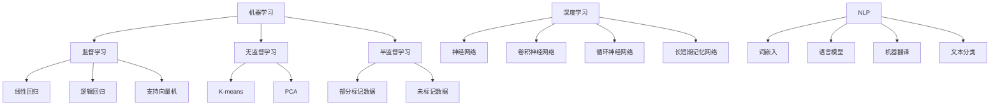
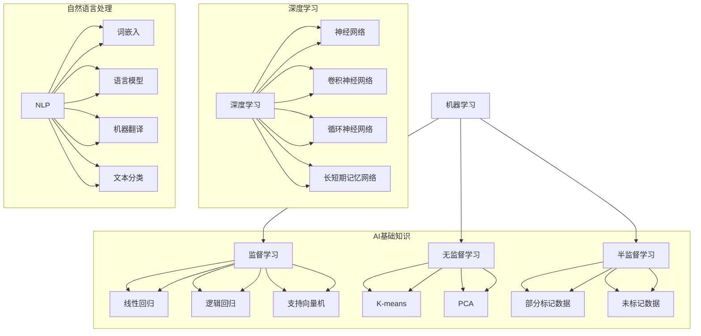

                 

## 文章标题

《提示词的文化适应：跨国AI应用策略》

## 文章关键词

- 跨文化AI应用
- 提示词文化适应
- 机器学习
- 深度学习
- 自然语言处理
- 模型优化
- 市场调研
- 项目实战

## 文章摘要

随着人工智能（AI）技术的迅速发展，其在跨国领域的应用日益广泛。然而，不同国家和地区的文化差异对AI模型的效果产生了显著影响。本文将探讨提示词的文化适应在跨国AI应用中的重要性，分析现有挑战，并提出相应的策略。首先，我们将介绍跨文化AI应用的定义和重要性，然后深入讨论提示词的概念及其在AI中的作用。接着，本文将详细阐述提示词文化适应的原理和方法，包括提示词库构建、自动适应与学习以及用户反馈机制。随后，我们将探讨AI技术的基础，如机器学习、深度学习和自然语言处理。在此基础上，本文将介绍AI模型设计原则，如模型选择、优化和评估。接下来，我们将重点讨论跨国AI应用策略，包括市场调研与分析、AI应用场景选择以及模型适应与本地化。通过一个实际项目实战，我们将展示如何在跨国环境中实施这些策略。最后，本文将总结跨国AI应用的挑战与机遇，并提出未来研究和发展方向。

### 第一部分：引论

#### 1.1 跨文化AI应用的重要性

随着全球化的深入发展，不同国家和地区之间的经济、文化和科技交流日益频繁。在这一背景下，人工智能（AI）技术的跨国应用成为了一个热门话题。跨文化AI应用不仅仅是技术层面的挑战，更是文化理解和沟通的难题。本文首先介绍跨文化AI应用的定义，然后探讨其重要性和当前面临的挑战。

**1.1.1 跨文化AI应用的定义**

跨文化AI应用指的是将人工智能技术应用于具有不同文化背景的地区，以实现特定的目标，如提高服务质量、优化运营效率或促进文化交流。与本地化AI应用不同，跨文化AI应用需要考虑不同文化之间的差异，以确保模型的有效性和用户满意度。

**1.1.2 跨文化AI应用的优势**

跨文化AI应用具有多方面的优势。首先，它可以拓展市场。通过适应不同文化的需求，AI产品可以进入更多国家和地区，从而实现商业上的成功。其次，跨文化AI应用可以提高用户满意度。本地化的用户体验可以更好地满足当地用户的需求，增强用户对产品的信任和忠诚度。最后，跨文化AI应用可以增强AI模型的鲁棒性。通过与不同文化背景的数据进行训练，模型可以更加泛化，从而在更多场景下保持良好的性能。

**1.1.3 当前跨文化AI应用面临的挑战**

尽管跨文化AI应用具有巨大的潜力，但同时也面临着诸多挑战。首先是语言障碍。不同语言的表达方式和语法结构可能影响AI模型的理解能力。其次，文化差异也是一个重要的挑战。不同的文化背景可能导致用户对同一问题的理解、表达和期望存在显著差异。此外，数据隐私和法律问题也是跨文化AI应用需要考虑的因素。不同国家和地区的隐私法律和数据保护标准各异，这要求AI应用在设计和实施过程中必须遵守当地法规。

总的来说，跨文化AI应用的重要性不容忽视。它不仅有助于拓展市场和提高用户满意度，还能提升AI模型的鲁棒性。然而，要实现这些目标，必须克服语言障碍、文化差异和数据隐私等挑战。

#### 1.2 提示词的文化适应

在跨文化AI应用中，提示词（Prompt）是连接用户与AI模型的重要桥梁。提示词不仅影响模型的响应，还在很大程度上决定了用户对AI应用的体验。因此，提示词的文化适应在跨国AI应用中具有至关重要的意义。本节将详细探讨提示词的概念、其在AI中的作用，以及提示词文化适应的重要性。

**1.2.1 提示词的定义和作用**

提示词是指用户向AI模型输入的信息，用于引导模型进行特定任务或生成特定响应。在自然语言处理（NLP）领域，提示词可以是一个简单的句子、一个短语或一个具体的指令。提示词的作用是帮助模型理解用户的意图，从而生成更准确、更符合用户需求的响应。

**1.2.2 提示词文化适应的重要性**

跨文化AI应用中，提示词的文化适应至关重要。首先，不同语言和文化的表达方式不同，这可能导致模型对提示词的理解存在偏差。例如，某些文化中常见的表达方式在另一种文化中可能无法准确传达意图。其次，文化差异可能影响用户对AI应用的期望和满意度。如果提示词未能充分考虑用户的文化背景，可能会导致用户对AI应用产生误解或不满意。

**1.2.3 提示词文化适应的方法**

为了实现提示词的文化适应，可以采用以下几种方法：

1. **提示词库构建**：构建包含不同文化背景提示词的库，以便在应用中根据用户的文化背景选择合适的提示词。

2. **自动适应与学习**：利用机器学习算法，使AI模型能够自动适应不同文化背景的提示词。这可以通过在训练过程中引入多语言、多文化数据集来实现。

3. **用户反馈机制**：鼓励用户提供反馈，以便AI模型根据用户的实际反馈进行优化。这有助于提高模型对特定文化背景提示词的理解能力。

总之，提示词的文化适应是跨国AI应用成功的关键之一。通过合理设计和优化提示词，可以显著提升AI应用的性能和用户满意度。接下来，本文将深入探讨AI技术的基础知识，为理解跨文化AI应用提供坚实的理论基础。

### 第一部分：引论

#### 1.3 本书结构安排

为了系统地探讨跨文化AI应用及其策略，本书将分为五个主要部分。首先，在引论部分，我们将介绍跨文化AI应用的定义、重要性以及面临的挑战，并详细讨论提示词的文化适应。接下来，在第二部分，我们将探讨AI技术的基础，包括机器学习、深度学习和自然语言处理，并介绍AI模型设计的原则。第三部分将聚焦于跨国AI应用策略，涵盖市场调研与分析、AI应用场景选择以及模型适应与本地化。第四部分将通过一个实际项目实战，展示如何在跨国环境中实施这些策略。最后，在第五部分，我们将总结跨国AI应用的挑战与机遇，并提出未来研究和发展方向。这样的结构安排旨在提供从理论到实践的全面指导，帮助读者深入了解并掌握跨文化AI应用的核心技术和策略。

### 第二部分：AI技术基础

#### 2.1 AI基础知识

人工智能（AI）技术是跨文化AI应用的基础。为了更好地理解如何在跨国环境中应用AI，我们需要首先掌握AI的基本概念和技术。本节将介绍机器学习、深度学习和自然语言处理的基础知识，这些知识对于设计和优化AI模型至关重要。

**2.1.1 机器学习基础**

机器学习是一种通过数据和算法让计算机自动学习和改进的技术。机器学习可以分为三种主要类型：监督学习、无监督学习和半监督学习。

- **监督学习**：在监督学习中，模型通过训练数据集学习，每个训练样本都有输入和对应的输出。监督学习的目标是最小化预测误差。常见的监督学习算法包括线性回归、逻辑回归和支持向量机（SVM）。

- **无监督学习**：无监督学习不使用标签数据，模型的目的是发现数据中的结构和模式。常见的无监督学习算法包括聚类（如K-means）和降维（如PCA）。

- **半监督学习**：半监督学习结合了监督学习和无监督学习的特点，利用部分标记数据和大量未标记数据来训练模型。

**2.1.2 深度学习基础**

深度学习是机器学习的一个子领域，它使用多层神经网络来学习和提取数据中的复杂特征。深度学习在图像识别、语音识别和自然语言处理等领域取得了显著的成果。

- **神经网络和深度网络**：神经网络是由多个节点（或神经元）组成的计算模型，每个节点都与其他节点相连。深度网络是指有多层神经元的神经网络，它能够提取更高层次的特征。

- **深度学习算法**：常见的深度学习算法包括卷积神经网络（CNN）、循环神经网络（RNN）和长短期记忆网络（LSTM）。CNN常用于图像识别，而RNN和LSTM在序列数据（如文本和语音）的处理中具有优势。

**2.1.3 自然语言处理基础**

自然语言处理（NLP）是AI的一个分支，旨在使计算机能够理解、生成和处理自然语言。NLP在机器翻译、文本分类和情感分析等领域有广泛应用。

- **词嵌入和语言模型**：词嵌入是将自然语言中的单词映射到高维向量空间的技术，使计算机能够捕捉词与词之间的语义关系。语言模型是预测下一个词的概率分布，它是自然语言处理的基础。

- **机器翻译和文本分类**：机器翻译是指将一种自然语言翻译成另一种自然语言，而文本分类是指将文本数据分类到预定义的类别中。这两种任务都是NLP中的重要应用。

**核心概念与联系**

为了更好地理解这些AI基础知识，我们使用Mermaid流程图来展示核心概念之间的联系：



通过这个流程图，我们可以清晰地看到机器学习、深度学习和自然语言处理之间的联系，以及它们各自的核心算法。

**核心算法原理讲解**

为了深入理解这些算法，我们将使用Python代码来详细阐述。以下是一个简单的线性回归模型的实现，用于预测住房价格：

```python
import numpy as np
import matplotlib.pyplot as plt

# 数据集
X = np.array([[1, 2], [2, 3], [3, 4], [4, 5]])
y = np.array([2, 3, 4, 5])

# 模型初始化
w = np.random.rand(1, 2)
b = np.random.rand(1)

# 训练模型
for i in range(1000):
    y_pred = np.dot(X, w) + b
    
    # 计算损失函数
    loss = (y - y_pred) ** 2
    
    # 计算梯度
    dw = 2 * (y - y_pred) * X
    db = 2 * (y - y_pred)
    
    # 更新参数
    w -= 0.01 * dw
    b -= 0.01 * db

# 可视化结果
plt.scatter(X[:, 0], y)
plt.plot(X[:, 0], np.dot(X, w) + b, color='red')
plt.xlabel('X1')
plt.ylabel('y')
plt.show()
```

在这个例子中，我们使用了随机梯度下降（SGD）算法来训练线性回归模型。通过迭代优化模型参数，最终得到一个能够较好地预测住房价格的模型。这里，损失函数使用了平方误差，梯度计算使用了反向传播算法，这些都是机器学习和深度学习中的基本概念。

通过上述讲解，我们可以看到AI技术的基础知识对于理解跨文化AI应用至关重要。接下来，我们将进一步探讨AI模型设计原则，为优化AI模型提供指导。

### 第二部分：AI技术基础

#### 2.2 AI模型设计原则

设计一个有效的AI模型不仅需要理解AI技术的基础知识，还需要遵循一系列设计原则。这些原则涵盖了模型选择、优化和评估等多个方面，以确保模型在实际应用中能够达到预期的效果。以下将详细介绍这些设计原则，并结合具体的Python代码示例进行说明。

**2.2.1 模型选择**

模型选择是AI模型设计的第一步，它直接影响到模型的表现和适用场景。在选择模型时，需要考虑以下几个因素：

- **任务类型**：不同的任务类型（如分类、回归、聚类等）需要不同的模型。例如，对于图像识别任务，卷积神经网络（CNN）是一个常见的选择；对于自然语言处理任务，循环神经网络（RNN）或Transformer模型可能更适合。

- **数据量**：大量数据通常可以训练更复杂的模型，如深度神经网络。然而，对于数据量有限的情况，简单的模型可能更加合适。

- **计算资源**：复杂的模型通常需要更多的计算资源。在选择模型时，需要考虑可用资源的限制。

以下是一个简单的例子，展示了如何选择合适的模型来分类新闻文章：

```python
from sklearn.datasets import fetch_20newsgroups
from sklearn.feature_extraction.text import TfidfVectorizer
from sklearn.naive_bayes import MultinomialNB
from sklearn.model_selection import train_test_split

# 加载数据集
newsgroups_data = fetch_20newsgroups()
X, y = newsgroups_data.data, newsgroups_data.target

# 划分训练集和测试集
X_train, X_test, y_train, y_test = train_test_split(X, y, test_size=0.2, random_state=42)

# 使用TF-IDF向量器和朴素贝叶斯分类器
vectorizer = TfidfVectorizer()
X_train_tfidf = vectorizer.fit_transform(X_train)
X_test_tfidf = vectorizer.transform(X_test)

classifier = MultinomialNB()
classifier.fit(X_train_tfidf, y_train)
accuracy = classifier.score(X_test_tfidf, y_test)

print(f"Accuracy: {accuracy:.2f}")
```

在这个例子中，我们使用了TF-IDF向量器来处理文本数据，并选择了朴素贝叶斯分类器来进行分类任务。这种选择基于数据集的性质和任务的需求。

**2.2.2 模型优化**

模型优化是提高模型性能的关键步骤。优化方法包括调整超参数、正则化、集成学习等。以下是一个使用梯度下降算法优化线性回归模型的例子：

```python
import numpy as np

# 数据集
X = np.array([[1, 2], [2, 3], [3, 4], [4, 5]])
y = np.array([2, 3, 4, 5])

# 模型初始化
w = np.random.rand(1, 2)
b = np.random.rand(1)

# 梯度下降算法
learning_rate = 0.01
epochs = 1000

for epoch in range(epochs):
    y_pred = np.dot(X, w) + b
    
    # 计算损失函数
    loss = (y - y_pred) ** 2
    
    # 计算梯度
    dw = 2 * (y - y_pred) * X
    db = 2 * (y - y_pred)
    
    # 更新参数
    w -= learning_rate * dw
    b -= learning_rate * db

# 可视化结果
plt.scatter(X[:, 0], y)
plt.plot(X[:, 0], np.dot(X, w) + b, color='red')
plt.xlabel('X1')
plt.ylabel('y')
plt.show()
```

在这个例子中，我们使用了随机梯度下降（SGD）算法来优化线性回归模型。通过迭代更新模型参数，最终得到一个能够较好预测数据的模型。

**2.2.3 模型评估**

模型评估是确保模型性能达到预期目标的重要步骤。常见的评估指标包括准确率、精确率、召回率、F1分数等。以下是一个使用混淆矩阵评估分类模型的例子：

```python
from sklearn.metrics import confusion_matrix, classification_report
from sklearn.model_selection import train_test_split

# 加载数据集
X, y = ...  # 数据加载

# 划分训练集和测试集
X_train, X_test, y_train, y_test = train_test_split(X, y, test_size=0.2, random_state=42)

# 使用支持向量机分类器
from sklearn.svm import SVC
classifier = SVC(kernel='linear')
classifier.fit(X_train, y_train)
y_pred = classifier.predict(X_test)

# 评估模型
conf_matrix = confusion_matrix(y_test, y_pred)
print(conf_matrix)
print(classification_report(y_test, y_pred))
```

在这个例子中，我们使用了支持向量机（SVM）分类器进行训练，并使用混淆矩阵和分类报告来评估模型性能。这些评估结果可以帮助我们了解模型在不同类别上的表现，从而进行进一步的优化。

**核心算法原理讲解**

为了更好地理解这些算法原理，我们结合了数学模型和Python代码进行详细讲解。例如，线性回归模型的损失函数和梯度下降算法可以表示为：

$$
\text{损失函数} = \frac{1}{2} \sum_{i=1}^{n} (y_i - (w^T x_i + b))^2
$$

$$
\text{梯度} = \frac{\partial}{\partial w} \frac{1}{2} \sum_{i=1}^{n} (y_i - (w^T x_i + b))^2 = \sum_{i=1}^{n} (y_i - (w^T x_i + b)) x_i
$$

通过这些数学公式和Python代码的结合，我们可以更深入地理解模型的原理和实现过程。

总的来说，AI模型设计原则是确保AI模型能够准确、高效地解决实际问题的关键。通过合理选择模型、优化模型参数和评估模型性能，我们可以设计出满足需求的AI模型。接下来，我们将进一步探讨跨国AI应用策略，为跨国AI项目提供具体指导。

### 第二部分：AI技术基础

#### 2.3 Mermaid流程图展示

为了更直观地理解AI技术的基础知识和核心算法原理，我们使用Mermaid流程图来展示机器学习、深度学习和自然语言处理之间的联系。以下是一个示例的Mermaid流程图：



在这个流程图中，我们展示了机器学习、深度学习和自然语言处理的主要概念及其相互关系。通过这种视觉化的方式，读者可以更清晰地理解各个领域的基本知识和核心算法。接下来，我们将进一步探讨跨国AI应用策略，帮助读者了解如何在实际项目中应用这些知识。

### 第三部分：跨国AI应用策略

#### 3.1 市场调研与分析

在跨国AI应用项目中，市场调研与分析是至关重要的一步。通过深入的市场调研，我们可以了解目标市场的文化特征、市场需求和竞争情况，为后续的AI应用策略提供数据支持。以下是市场调研与分析的主要步骤和方法：

**3.1.1 市场调研方法**

市场调研可以采用以下几种方法：

1. **文献研究**：通过查阅相关的市场报告、学术论文和行业白皮书，了解目标市场的背景信息和行业动态。

2. **问卷调查**：设计问卷调查表，收集目标用户的反馈和需求。问卷调查可以通过在线平台或面对面访谈的方式进行。

3. **深度访谈**：与目标市场的行业专家、潜在用户进行深入访谈，获取详细的见解和意见。

4. **焦点小组**：组织焦点小组会议，邀请目标用户代表参与讨论，以获取对AI应用的不同观点和建议。

5. **案例分析**：研究成功或失败的跨国AI应用案例，分析其成功的原因和存在的问题，为项目提供参考。

**3.1.2 分析目标市场的文化特征**

文化特征是影响AI应用效果的重要因素。分析目标市场的文化特征包括以下几个方面：

1. **语言和语言习惯**：了解目标市场的语言及其使用习惯，以确保提示词和交互界面能够被本地用户理解和接受。

2. **价值观和行为规范**：不同文化背景下，人们对同一问题的看法和态度可能存在差异。了解这些差异有助于设计出更符合当地文化的AI应用。

3. **社会结构和文化习俗**：了解目标市场的社会结构和文化习俗，例如家庭观念、宗教信仰和礼仪习惯，这些都会影响AI应用的接受程度。

**3.1.3 确定AI应用的市场需求**

在市场调研的基础上，我们需要确定AI应用的市场需求，包括以下几个方面：

1. **功能需求**：明确AI应用需要实现哪些功能，以满足当地用户的需求。

2. **性能需求**：分析AI应用的性能指标，如响应速度、准确性和鲁棒性，以确保其在目标市场中的竞争力。

3. **用户体验**：了解用户对AI应用的期望和使用习惯，设计出易于使用、操作简便的应用界面。

4. **成本效益**：评估AI应用的潜在成本和收益，确保项目具有商业可行性。

通过上述步骤，我们可以对目标市场进行全面的调研和分析，为跨国AI应用提供坚实的基础。接下来，我们将讨论AI应用场景的选择，帮助读者更好地理解如何在跨国环境中实施AI应用。

#### 3.2 AI应用场景选择

在跨国AI应用项目中，选择合适的AI应用场景是确保项目成功的关键步骤。不同场景对AI技术的要求和应用方式各不相同，因此需要仔细评估和选择。以下是选择AI应用场景的主要步骤和策略。

**3.2.1 常见AI应用场景**

AI技术在多个领域都有广泛应用，以下是一些常见的AI应用场景：

1. **医疗健康**：如疾病预测、诊断辅助、个性化治疗建议等。
2. **金融领域**：如风险评估、信用评分、欺诈检测等。
3. **零售业**：如商品推荐、客户行为分析、库存管理优化等。
4. **制造业**：如故障预测、质量检测、生产流程优化等。
5. **交通运输**：如自动驾驶、交通流量预测、物流优化等。
6. **能源管理**：如能源消耗预测、设备维护优化、新能源应用等。
7. **教育与培训**：如智能辅导、在线教育平台、技能评估等。
8. **公共服务**：如智能城市、应急管理、环境监测等。

**3.2.2 跨国AI应用的适用场景**

在跨国AI应用中，以下场景较为适用：

1. **多语言交互系统**：如智能客服、语音助手等，这些应用需要支持多种语言，并能根据当地语言习惯进行文化适应。
2. **个性化服务**：如个性化推荐系统、智能广告等，这些应用可以根据用户的地理位置、文化背景和偏好提供定制化的服务。
3. **智能决策支持**：如企业资源规划（ERP）、供应链管理（SCM）等，这些应用需要处理大量跨文化数据，并支持全球范围内的决策制定。
4. **自动化生产**：如智能工厂、机器人流程自动化（RPA）等，这些应用可以提升生产效率，减少人力成本，并适应不同工厂的设备和文化环境。
5. **环境监测与保护**：如空气和水质量监测、森林火灾预警等，这些应用对于跨国公司维护全球环境保护标准至关重要。

**3.2.3 场景评估与选择策略**

在选择AI应用场景时，需要考虑以下评估和选择策略：

1. **市场需求**：评估目标市场的需求，确保AI应用能够解决实际问题和满足用户需求。
2. **技术可行性**：分析现有技术是否能够支持该场景，并评估所需的研发投入和时间。
3. **文化适应性**：考虑当地文化特征，确保AI应用能够被本地用户接受和使用。
4. **成本效益**：评估项目的成本和预期收益，确保项目具有商业可行性。
5. **法规合规性**：确保AI应用符合当地法律法规，特别是在数据隐私、安全和知识产权方面。
6. **资源整合**：评估项目所需的人力、物力和财力资源，确保能够有效整合资源，支持项目实施。

通过以上策略，我们可以选择最合适的AI应用场景，确保跨国AI项目能够成功实施并取得预期效果。接下来，我们将探讨模型适应与本地化，为跨国AI应用提供具体的实现方法。

### 第三部分：跨国AI应用策略

#### 3.3 模型适应与本地化

在跨国AI应用项目中，模型适应与本地化是确保AI模型在不同文化背景下有效运行的关键步骤。本地化不仅仅是语言的翻译，还包括文化习俗、行为规范等多方面的调整。以下将详细介绍模型适应与本地化的策略和方法。

**3.3.1 模型适应策略**

模型适应策略主要包括以下几个方面：

1. **数据增强**：通过引入更多样化的数据集，使模型能够适应不同文化背景下的输入数据。数据增强可以采用数据合成、数据扩充和迁移学习等方法。

2. **特征工程**：根据目标市场的文化特征，对输入数据进行特征提取和变换。例如，在处理文本数据时，可以针对不同语言的语法和表达习惯调整词嵌入模型。

3. **模型架构调整**：针对特定文化背景下的任务需求，可以调整模型的架构和参数。例如，对于某些语言处理任务，可以使用更适合的神经网络架构，如Transformer或BERT。

4. **模型融合**：结合多种模型和算法，提高模型的泛化能力。例如，在处理多语言文本时，可以结合使用语言模型和句法分析模型，以实现更准确的语义理解。

**3.3.2 本地化方法**

本地化方法主要包括以下几种：

1. **提示词库构建**：构建包含多种语言和文化背景的提示词库，以便根据目标市场的需求选择合适的提示词。提示词库可以采用自动生成和人工编辑相结合的方法。

2. **自动适应与学习**：利用机器学习和深度学习算法，使AI模型能够自动适应不同文化背景。例如，可以通过在线学习机制，实时调整模型参数，以适应用户的反馈和文化变化。

3. **用户反馈机制**：鼓励用户提供反馈，并根据用户的实际使用情况优化模型。例如，可以设计用户评价系统，收集用户对AI应用的反馈，并用于模型调整。

4. **文化标签**：为数据集添加文化标签，使模型能够识别和适应不同文化特征。例如，在处理多语言数据时，可以为每条数据标注其语言和文化来源。

**3.3.3 模型测试与评估**

在模型适应与本地化过程中，测试与评估是确保模型性能的重要环节。以下是一些测试与评估方法：

1. **多语言测试**：确保模型在多种语言和文化背景下都能正常运行，并生成准确的响应。可以设计多语言测试集，对模型进行全面测试。

2. **A/B测试**：将经过本地化的模型与原模型进行对比测试，评估本地化模型的性能和用户体验。通过A/B测试，可以找出最佳模型版本。

3. **用户满意度调查**：收集用户对AI应用的满意度反馈，评估模型在目标市场的接受程度和实用性。

4. **合规性评估**：确保模型符合当地法律法规和数据隐私要求，避免法律风险。

通过模型适应与本地化策略，我们可以确保AI模型在不同文化背景下能够有效运行，提高用户体验和满意度。接下来，我们将通过一个实际项目实战，展示如何在跨国环境中实施这些策略。

### 第三部分：跨国AI应用策略

#### 3.3 模型适应与本地化

在跨国AI应用项目中，模型适应与本地化是确保AI模型在不同文化背景下有效运行的关键步骤。本地化不仅仅是语言的翻译，还包括文化习俗、行为规范等多方面的调整。以下将详细介绍模型适应与本地化的策略和方法。

**3.3.1 模型适应策略**

模型适应策略主要包括以下几个方面：

1. **数据增强**：通过引入更多样化的数据集，使模型能够适应不同文化背景下的输入数据。数据增强可以采用数据合成、数据扩充和迁移学习等方法。

   - **数据合成**：例如，在文本数据中，可以使用生成对抗网络（GAN）生成新的对话数据，以丰富模型训练数据。
   - **数据扩充**：例如，对图片数据进行旋转、缩放、裁剪等操作，增加数据的多样性。

2. **特征工程**：根据目标市场的文化特征，对输入数据进行特征提取和变换。例如，在处理文本数据时，可以针对不同语言的语法和表达习惯调整词嵌入模型。

   - **词嵌入**：例如，使用预训练的跨语言词嵌入模型（如XLM-R），提高模型在不同语言之间的泛化能力。
   - **特征融合**：将语言特征和文化特征结合，例如，结合地理位置和用户行为数据，提高模型的个性化能力。

3. **模型架构调整**：针对特定文化背景下的任务需求，可以调整模型的架构和参数。例如，对于某些语言处理任务，可以使用更适合的神经网络架构，如Transformer或BERT。

   - **Transformer模型**：例如，使用BERT或GPT模型进行预训练，然后进行微调，以适应特定语言和文化背景。
   - **定制化架构**：例如，为特定任务设计定制化的神经网络架构，以提高模型在特定场景下的性能。

4. **模型融合**：结合多种模型和算法，提高模型的泛化能力。例如，在处理多语言文本时，可以结合使用语言模型和句法分析模型，以实现更准确的语义理解。

   - **多模型融合**：例如，结合使用循环神经网络（RNN）和长短期记忆网络（LSTM），以提高文本分类和情感分析的准确度。

**3.3.2 本地化方法**

本地化方法主要包括以下几种：

1. **提示词库构建**：构建包含多种语言和文化背景的提示词库，以便根据目标市场的需求选择合适的提示词。提示词库可以采用自动生成和人工编辑相结合的方法。

   - **自动生成**：例如，使用自然语言生成（NLG）技术，自动生成适用于不同文化背景的提示词。
   - **人工编辑**：例如，由本地语言专家和AI领域专家共同编辑和优化提示词库。

2. **自动适应与学习**：利用机器学习和深度学习算法，使AI模型能够自动适应不同文化背景。例如，可以通过在线学习机制，实时调整模型参数，以适应用户的反馈和文化变化。

   - **在线学习**：例如，使用增量学习（Online Learning）方法，根据用户反馈持续优化模型。
   - **迁移学习**：例如，使用迁移学习（Transfer Learning）方法，将一个文化背景下的模型知识迁移到另一个文化背景。

3. **用户反馈机制**：鼓励用户提供反馈，并根据用户的实际使用情况优化模型。例如，可以设计用户评价系统，收集用户对AI应用的反馈，并用于模型调整。

   - **用户评价系统**：例如，使用星星评分或文本评论，收集用户对AI应用的满意度。
   - **反馈循环**：例如，将用户反馈转化为训练数据，用于模型迭代优化。

4. **文化标签**：为数据集添加文化标签，使模型能够识别和适应不同文化特征。例如，在处理多语言数据时，可以为每条数据标注其语言和文化来源。

   - **文化标注**：例如，使用标签（如“西方文化”、“东方文化”）对数据进行分类，帮助模型学习不同文化的特征。
   - **情境标注**：例如，标注不同情境下的文化差异，如正式与非正式语言、礼貌用语等。

**3.3.3 模型测试与评估**

在模型适应与本地化过程中，测试与评估是确保模型性能的重要环节。以下是一些测试与评估方法：

1. **多语言测试**：确保模型在多种语言和文化背景下都能正常运行，并生成准确的响应。可以设计多语言测试集，对模型进行全面测试。

   - **多语言测试集**：例如，构建包含多种语言的文本数据集，对模型进行多语言性能评估。
   - **文化适应性测试**：例如，评估模型在不同文化背景下的适应能力和响应质量。

2. **A/B测试**：将经过本地化的模型与原模型进行对比测试，评估本地化模型的性能和用户体验。通过A/B测试，可以找出最佳模型版本。

   - **A/B测试设计**：例如，将用户随机分配到两组，一组使用本地化模型，另一组使用原模型，比较两组用户的满意度。
   - **性能对比**：例如，通过比较两组用户的交互数据，评估本地化模型在响应时间、准确性等方面的性能。

3. **用户满意度调查**：收集用户对AI应用的满意度反馈，评估模型在目标市场的接受程度和实用性。

   - **满意度调查**：例如，设计问卷调查，收集用户对AI应用的总体满意度、易用性、准确性等反馈。
   - **用户访谈**：例如，与目标用户进行深度访谈，了解他们对AI应用的期望和实际使用情况。

4. **合规性评估**：确保模型符合当地法律法规和数据隐私要求，避免法律风险。

   - **合规性检查**：例如，评估AI应用是否遵守当地的数据保护法规，如《通用数据保护条例》（GDPR）。
   - **法律咨询**：例如，与当地法律专家合作，确保AI应用的合规性。

通过以上模型适应与本地化策略和方法，我们可以确保AI模型在不同文化背景下能够有效运行，提高用户体验和满意度。接下来，我们将通过一个实际项目实战，展示如何在跨国环境中实施这些策略。

### 第三部分：跨国AI应用策略

#### 3.3 模型适应与本地化

在跨国AI应用项目中，模型适应与本地化是确保AI模型在不同文化背景下有效运行的关键步骤。本地化不仅仅是语言的翻译，还包括文化习俗、行为规范等多方面的调整。以下将详细介绍模型适应与本地化的策略和方法。

**3.3.1 模型适应策略**

模型适应策略主要包括以下几个方面：

1. **数据增强**：通过引入更多样化的数据集，使模型能够适应不同文化背景下的输入数据。数据增强可以采用数据合成、数据扩充和迁移学习等方法。

   - **数据合成**：例如，在文本数据中，可以使用生成对抗网络（GAN）生成新的对话数据，以丰富模型训练数据。
   - **数据扩充**：例如，对图片数据进行旋转、缩放、裁剪等操作，增加数据的多样性。

2. **特征工程**：根据目标市场的文化特征，对输入数据进行特征提取和变换。例如，在处理文本数据时，可以针对不同语言的语法和表达习惯调整词嵌入模型。

   - **词嵌入**：例如，使用预训练的跨语言词嵌入模型（如XLM-R），提高模型在不同语言之间的泛化能力。
   - **特征融合**：例如，结合地理位置和用户行为数据，提高模型的个性化能力。

3. **模型架构调整**：针对特定文化背景下的任务需求，可以调整模型的架构和参数。例如，对于某些语言处理任务，可以使用更适合的神经网络架构，如Transformer或BERT。

   - **Transformer模型**：例如，使用BERT或GPT模型进行预训练，然后进行微调，以适应特定语言和文化背景。
   - **定制化架构**：例如，为特定任务设计定制化的神经网络架构，以提高模型在特定场景下的性能。

4. **模型融合**：结合多种模型和算法，提高模型的泛化能力。例如，在处理多语言文本时，可以结合使用语言模型和句法分析模型，以实现更准确的语义理解。

   - **多模型融合**：例如，结合使用循环神经网络（RNN）和长短期记忆网络（LSTM），以提高文本分类和情感分析的准确度。

**3.3.2 本地化方法**

本地化方法主要包括以下几种：

1. **提示词库构建**：构建包含多种语言和文化背景的提示词库，以便根据目标市场的需求选择合适的提示词。提示词库可以采用自动生成和人工编辑相结合的方法。

   - **自动生成**：例如，使用自然语言生成（NLG）技术，自动生成适用于不同文化背景的提示词。
   - **人工编辑**：例如，由本地语言专家和AI领域专家共同编辑和优化提示词库。

2. **自动适应与学习**：利用机器学习和深度学习算法，使AI模型能够自动适应不同文化背景。例如，可以通过在线学习机制，实时调整模型参数，以适应用户的反馈和文化变化。

   - **在线学习**：例如，使用增量学习（Online Learning）方法，根据用户反馈持续优化模型。
   - **迁移学习**：例如，使用迁移学习（Transfer Learning）方法，将一个文化背景下的模型知识迁移到另一个文化背景。

3. **用户反馈机制**：鼓励用户提供反馈，并根据用户的实际使用情况优化模型。例如，可以设计用户评价系统，收集用户对AI应用的反馈，并用于模型调整。

   - **用户评价系统**：例如，使用星星评分或文本评论，收集用户对AI应用的满意度。
   - **反馈循环**：例如，将用户反馈转化为训练数据，用于模型迭代优化。

4. **文化标签**：为数据集添加文化标签，使模型能够识别和适应不同文化特征。例如，在处理多语言数据时，可以为每条数据标注其语言和文化来源。

   - **文化标注**：例如，使用标签（如“西方文化”、“东方文化”）对数据进行分类，帮助模型学习不同文化的特征。
   - **情境标注**：例如，标注不同情境下的文化差异，如正式与非正式语言、礼貌用语等。

**3.3.3 模型测试与评估**

在模型适应与本地化过程中，测试与评估是确保模型性能的重要环节。以下是一些测试与评估方法：

1. **多语言测试**：确保模型在多种语言和文化背景下都能正常运行，并生成准确的响应。可以设计多语言测试集，对模型进行全面测试。

   - **多语言测试集**：例如，构建包含多种语言的文本数据集，对模型进行多语言性能评估。
   - **文化适应性测试**：例如，评估模型在不同文化背景下的适应能力和响应质量。

2. **A/B测试**：将经过本地化的模型与原模型进行对比测试，评估本地化模型的性能和用户体验。通过A/B测试，可以找出最佳模型版本。

   - **A/B测试设计**：例如，将用户随机分配到两组，一组使用本地化模型，另一组使用原模型，比较两组用户的满意度。
   - **性能对比**：例如，通过比较两组用户的交互数据，评估本地化模型在响应时间、准确性等方面的性能。

3. **用户满意度调查**：收集用户对AI应用的满意度反馈，评估模型在目标市场的接受程度和实用性。

   - **满意度调查**：例如，设计问卷调查，收集用户对AI应用的总体满意度、易用性、准确性等反馈。
   - **用户访谈**：例如，与目标用户进行深度访谈，了解他们对AI应用的期望和实际使用情况。

4. **合规性评估**：确保模型符合当地法律法规和数据隐私要求，避免法律风险。

   - **合规性检查**：例如，评估AI应用是否遵守当地的数据保护法规，如《通用数据保护条例》（GDPR）。
   - **法律咨询**：例如，与当地法律专家合作，确保AI应用的合规性。

通过以上模型适应与本地化策略和方法，我们可以确保AI模型在不同文化背景下能够有效运行，提高用户体验和满意度。接下来，我们将通过一个实际项目实战，展示如何在跨国环境中实施这些策略。

### 第三部分：跨国AI应用策略

#### 3.3 模型适应与本地化

在跨国AI应用项目中，模型适应与本地化是确保AI模型在不同文化背景下有效运行的关键步骤。本地化不仅仅是语言的翻译，还包括文化习俗、行为规范等多方面的调整。以下将详细介绍模型适应与本地化的策略和方法。

**3.3.1 模型适应策略**

模型适应策略主要包括以下几个方面：

1. **数据增强**：通过引入更多样化的数据集，使模型能够适应不同文化背景下的输入数据。数据增强可以采用数据合成、数据扩充和迁移学习等方法。

   - **数据合成**：例如，在文本数据中，可以使用生成对抗网络（GAN）生成新的对话数据，以丰富模型训练数据。
   - **数据扩充**：例如，对图片数据进行旋转、缩放、裁剪等操作，增加数据的多样性。

2. **特征工程**：根据目标市场的文化特征，对输入数据进行特征提取和变换。例如，在处理文本数据时，可以针对不同语言的语法和表达习惯调整词嵌入模型。

   - **词嵌入**：例如，使用预训练的跨语言词嵌入模型（如XLM-R），提高模型在不同语言之间的泛化能力。
   - **特征融合**：例如，结合地理位置和用户行为数据，提高模型的个性化能力。

3. **模型架构调整**：针对特定文化背景下的任务需求，可以调整模型的架构和参数。例如，对于某些语言处理任务，可以使用更适合的神经网络架构，如Transformer或BERT。

   - **Transformer模型**：例如，使用BERT或GPT模型进行预训练，然后进行微调，以适应特定语言和文化背景。
   - **定制化架构**：例如，为特定任务设计定制化的神经网络架构，以提高模型在特定场景下的性能。

4. **模型融合**：结合多种模型和算法，提高模型的泛化能力。例如，在处理多语言文本时，可以结合使用语言模型和句法分析模型，以实现更准确的语义理解。

   - **多模型融合**：例如，结合使用循环神经网络（RNN）和长短期记忆网络（LSTM），以提高文本分类和情感分析的准确度。

**3.3.2 本地化方法**

本地化方法主要包括以下几种：

1. **提示词库构建**：构建包含多种语言和文化背景的提示词库，以便根据目标市场的需求选择合适的提示词。提示词库可以采用自动生成和人工编辑相结合的方法。

   - **自动生成**：例如，使用自然语言生成（NLG）技术，自动生成适用于不同文化背景的提示词。
   - **人工编辑**：例如，由本地语言专家和AI领域专家共同编辑和优化提示词库。

2. **自动适应与学习**：利用机器学习和深度学习算法，使AI模型能够自动适应不同文化背景。例如，可以通过在线学习机制，实时调整模型参数，以适应用户的反馈和文化变化。

   - **在线学习**：例如，使用增量学习（Online Learning）方法，根据用户反馈持续优化模型。
   - **迁移学习**：例如，使用迁移学习（Transfer Learning）方法，将一个文化背景下的模型知识迁移到另一个文化背景。

3. **用户反馈机制**：鼓励用户提供反馈，并根据用户的实际使用情况优化模型。例如，可以设计用户评价系统，收集用户对AI应用的反馈，并用于模型调整。

   - **用户评价系统**：例如，使用星星评分或文本评论，收集用户对AI应用的满意度。
   - **反馈循环**：例如，将用户反馈转化为训练数据，用于模型迭代优化。

4. **文化标签**：为数据集添加文化标签，使模型能够识别和适应不同文化特征。例如，在处理多语言数据时，可以为每条数据标注其语言和文化来源。

   - **文化标注**：例如，使用标签（如“西方文化”、“东方文化”）对数据进行分类，帮助模型学习不同文化的特征。
   - **情境标注**：例如，标注不同情境下的文化差异，如正式与非正式语言、礼貌用语等。

**3.3.3 模型测试与评估**

在模型适应与本地化过程中，测试与评估是确保模型性能的重要环节。以下是一些测试与评估方法：

1. **多语言测试**：确保模型在多种语言和文化背景下都能正常运行，并生成准确的响应。可以设计多语言测试集，对模型进行全面测试。

   - **多语言测试集**：例如，构建包含多种语言的文本数据集，对模型进行多语言性能评估。
   - **文化适应性测试**：例如，评估模型在不同文化背景下的适应能力和响应质量。

2. **A/B测试**：将经过本地化的模型与原模型进行对比测试，评估本地化模型的性能和用户体验。通过A/B测试，可以找出最佳模型版本。

   - **A/B测试设计**：例如，将用户随机分配到两组，一组使用本地化模型，另一组使用原模型，比较两组用户的满意度。
   - **性能对比**：例如，通过比较两组用户的交互数据，评估本地化模型在响应时间、准确性等方面的性能。

3. **用户满意度调查**：收集用户对AI应用的满意度反馈，评估模型在目标市场的接受程度和实用性。

   - **满意度调查**：例如，设计问卷调查，收集用户对AI应用的总体满意度、易用性、准确性等反馈。
   - **用户访谈**：例如，与目标用户进行深度访谈，了解他们对AI应用的期望和实际使用情况。

4. **合规性评估**：确保模型符合当地法律法规和数据隐私要求，避免法律风险。

   - **合规性检查**：例如，评估AI应用是否遵守当地的数据保护法规，如《通用数据保护条例》（GDPR）。
   - **法律咨询**：例如，与当地法律专家合作，确保AI应用的合规性。

通过以上模型适应与本地化策略和方法，我们可以确保AI模型在不同文化背景下能够有效运行，提高用户体验和满意度。接下来，我们将通过一个实际项目实战，展示如何在跨国环境中实施这些策略。

### 第三部分：跨国AI应用策略

#### 3.3 模型适应与本地化

在跨国AI应用项目中，模型适应与本地化是确保AI模型在不同文化背景下有效运行的关键步骤。本地化不仅仅是语言的翻译，还包括文化习俗、行为规范等多方面的调整。以下将详细介绍模型适应与本地化的策略和方法。

**3.3.1 模型适应策略**

模型适应策略主要包括以下几个方面：

1. **数据增强**：通过引入更多样化的数据集，使模型能够适应不同文化背景下的输入数据。数据增强可以采用数据合成、数据扩充和迁移学习等方法。

   - **数据合成**：例如，在文本数据中，可以使用生成对抗网络（GAN）生成新的对话数据，以丰富模型训练数据。
   - **数据扩充**：例如，对图片数据进行旋转、缩放、裁剪等操作，增加数据的多样性。

2. **特征工程**：根据目标市场的文化特征，对输入数据进行特征提取和变换。例如，在处理文本数据时，可以针对不同语言的语法和表达习惯调整词嵌入模型。

   - **词嵌入**：例如，使用预训练的跨语言词嵌入模型（如XLM-R），提高模型在不同语言之间的泛化能力。
   - **特征融合**：例如，结合地理位置和用户行为数据，提高模型的个性化能力。

3. **模型架构调整**：针对特定文化背景下的任务需求，可以调整模型的架构和参数。例如，对于某些语言处理任务，可以使用更适合的神经网络架构，如Transformer或BERT。

   - **Transformer模型**：例如，使用BERT或GPT模型进行预训练，然后进行微调，以适应特定语言和文化背景。
   - **定制化架构**：例如，为特定任务设计定制化的神经网络架构，以提高模型在特定场景下的性能。

4. **模型融合**：结合多种模型和算法，提高模型的泛化能力。例如，在处理多语言文本时，可以结合使用语言模型和句法分析模型，以实现更准确的语义理解。

   - **多模型融合**：例如，结合使用循环神经网络（RNN）和长短期记忆网络（LSTM），以提高文本分类和情感分析的准确度。

**3.3.2 本地化方法**

本地化方法主要包括以下几种：

1. **提示词库构建**：构建包含多种语言和文化背景的提示词库，以便根据目标市场的需求选择合适的提示词。提示词库可以采用自动生成和人工编辑相结合的方法。

   - **自动生成**：例如，使用自然语言生成（NLG）技术，自动生成适用于不同文化背景的提示词。
   - **人工编辑**：例如，由本地语言专家和AI领域专家共同编辑和优化提示词库。

2. **自动适应与学习**：利用机器学习和深度学习算法，使AI模型能够自动适应不同文化背景。例如，可以通过在线学习机制，实时调整模型参数，以适应用户的反馈和文化变化。

   - **在线学习**：例如，使用增量学习（Online Learning）方法，根据用户反馈持续优化模型。
   - **迁移学习**：例如，使用迁移学习（Transfer Learning）方法，将一个文化背景下的模型知识迁移到另一个文化背景。

3. **用户反馈机制**：鼓励用户提供反馈，并根据用户的实际使用情况优化模型。例如，可以设计用户评价系统，收集用户对AI应用的反馈，并用于模型调整。

   - **用户评价系统**：例如，使用星星评分或文本评论，收集用户对AI应用的满意度。
   - **反馈循环**：例如，将用户反馈转化为训练数据，用于模型迭代优化。

4. **文化标签**：为数据集添加文化标签，使模型能够识别和适应不同文化特征。例如，在处理多语言数据时，可以为每条数据标注其语言和文化来源。

   - **文化标注**：例如，使用标签（如“西方文化”、“东方文化”）对数据进行分类，帮助模型学习不同文化的特征。
   - **情境标注**：例如，标注不同情境下的文化差异，如正式与非正式语言、礼貌用语等。

**3.3.3 模型测试与评估**

在模型适应与本地化过程中，测试与评估是确保模型性能的重要环节。以下是一些测试与评估方法：

1. **多语言测试**：确保模型在多种语言和文化背景下都能正常运行，并生成准确的响应。可以设计多语言测试集，对模型进行全面测试。

   - **多语言测试集**：例如，构建包含多种语言的文本数据集，对模型进行多语言性能评估。
   - **文化适应性测试**：例如，评估模型在不同文化背景下的适应能力和响应质量。

2. **A/B测试**：将经过本地化的模型与原模型进行对比测试，评估本地化模型的性能和用户体验。通过A/B测试，可以找出最佳模型版本。

   - **A/B测试设计**：例如，将用户随机分配到两组，一组使用本地化模型，另一组使用原模型，比较两组用户的满意度。
   - **性能对比**：例如，通过比较两组用户的交互数据，评估本地化模型在响应时间、准确性等方面的性能。

3. **用户满意度调查**：收集用户对AI应用的满意度反馈，评估模型在目标市场的接受程度和实用性。

   - **满意度调查**：例如，设计问卷调查，收集用户对AI应用的总体满意度、易用性、准确性等反馈。
   - **用户访谈**：例如，与目标用户进行深度访谈，了解他们对AI应用的期望和实际使用情况。

4. **合规性评估**：确保模型符合当地法律法规和数据隐私要求，避免法律风险。

   - **合规性检查**：例如，评估AI应用是否遵守当地的数据保护法规，如《通用数据保护条例》（GDPR）。
   - **法律咨询**：例如，与当地法律专家合作，确保AI应用的合规性。

通过以上模型适应与本地化策略和方法，我们可以确保AI模型在不同文化背景下能够有效运行，提高用户体验和满意度。接下来，我们将通过一个实际项目实战，展示如何在跨国环境中实施这些策略。

### 第三部分：跨国AI应用策略

#### 3.3 模型适应与本地化

在跨国AI应用项目中，模型适应与本地化是确保AI模型在不同文化背景下有效运行的关键步骤。本地化不仅仅是语言的翻译，还包括文化习俗、行为规范等多方面的调整。以下将详细介绍模型适应与本地化的策略和方法。

**3.3.1 模型适应策略**

模型适应策略主要包括以下几个方面：

1. **数据增强**：通过引入更多样化的数据集，使模型能够适应不同文化背景下的输入数据。数据增强可以采用数据合成、数据扩充和迁移学习等方法。

   - **数据合成**：例如，在文本数据中，可以使用生成对抗网络（GAN）生成新的对话数据，以丰富模型训练数据。
   - **数据扩充**：例如，对图片数据进行旋转、缩放、裁剪等操作，增加数据的多样性。

2. **特征工程**：根据目标市场的文化特征，对输入数据进行特征提取和变换。例如，在处理文本数据时，可以针对不同语言的语法和表达习惯调整词嵌入模型。

   - **词嵌入**：例如，使用预训练的跨语言词嵌入模型（如XLM-R），提高模型在不同语言之间的泛化能力。
   - **特征融合**：例如，结合地理位置和用户行为数据，提高模型的个性化能力。

3. **模型架构调整**：针对特定文化背景下的任务需求，可以调整模型的架构和参数。例如，对于某些语言处理任务，可以使用更适合的神经网络架构，如Transformer或BERT。

   - **Transformer模型**：例如，使用BERT或GPT模型进行预训练，然后进行微调，以适应特定语言和文化背景。
   - **定制化架构**：例如，为特定任务设计定制化的神经网络架构，以提高模型在特定场景下的性能。

4. **模型融合**：结合多种模型和算法，提高模型的泛化能力。例如，在处理多语言文本时，可以结合使用语言模型和句法分析模型，以实现更准确的语义理解。

   - **多模型融合**：例如，结合使用循环神经网络（RNN）和长短期记忆网络（LSTM），以提高文本分类和情感分析的准确度。

**3.3.2 本地化方法**

本地化方法主要包括以下几种：

1. **提示词库构建**：构建包含多种语言和文化背景的提示词库，以便根据目标市场的需求选择合适的提示词。提示词库可以采用自动生成和人工编辑相结合的方法。

   - **自动生成**：例如，使用自然语言生成（NLG）技术，自动生成适用于不同文化背景的提示词。
   - **人工编辑**：例如，由本地语言专家和AI领域专家共同编辑和优化提示词库。

2. **自动适应与学习**：利用机器学习和深度学习算法，使AI模型能够自动适应不同文化背景。例如，可以通过在线学习机制，实时调整模型参数，以适应用户的反馈和文化变化。

   - **在线学习**：例如，使用增量学习（Online Learning）方法，根据用户反馈持续优化模型。
   - **迁移学习**：例如，使用迁移学习（Transfer Learning）方法，将一个文化背景下的模型知识迁移到另一个文化背景。

3. **用户反馈机制**：鼓励用户提供反馈，并根据用户的实际使用情况优化模型。例如，可以设计用户评价系统，收集用户对AI应用的反馈，并用于模型调整。

   - **用户评价系统**：例如，使用星星评分或文本评论，收集用户对AI应用的满意度。
   - **反馈循环**：例如，将用户反馈转化为训练数据，用于模型迭代优化。

4. **文化标签**：为数据集添加文化标签，使模型能够识别和适应不同文化特征。例如，在处理多语言数据时，可以为每条数据标注其语言和文化来源。

   - **文化标注**：例如，使用标签（如“西方文化”、“东方文化”）对数据进行分类，帮助模型学习不同文化的特征。
   - **情境标注**：例如，标注不同情境下的文化差异，如正式与非正式语言、礼貌用语等。

**3.3.3 模型测试与评估**

在模型适应与本地化过程中，测试与评估是确保模型性能的重要环节。以下是一些测试与评估方法：

1. **多语言测试**：确保模型在多种语言和文化背景下都能正常运行，并生成准确的响应。可以设计多语言测试集，对模型进行全面测试。

   - **多语言测试集**：例如，构建包含多种语言的文本数据集，对模型进行多语言性能评估。
   - **文化适应性测试**：例如，评估模型在不同文化背景下的适应能力和响应质量。

2. **A/B测试**：将经过本地化的模型与原模型进行对比测试，评估本地化模型的性能和用户体验。通过A/B测试，可以找出最佳模型版本。

   - **A/B测试设计**：例如，将用户随机分配到两组，一组使用本地化模型，另一组使用原模型，比较两组用户的满意度。
   - **性能对比**：例如，通过比较两组用户的交互数据，评估本地化模型在响应时间、准确性等方面的性能。

3. **用户满意度调查**：收集用户对AI应用的满意度反馈，评估模型在目标市场的接受程度和实用性。

   - **满意度调查**：例如，设计问卷调查，收集用户对AI应用的总体满意度、易用性、准确性等反馈。
   - **用户访谈**：例如，与目标用户进行深度访谈，了解他们对AI应用的期望和实际使用情况。

4. **合规性评估**：确保模型符合当地法律法规和数据隐私要求，避免法律风险。

   - **合规性检查**：例如，评估AI应用是否遵守当地的数据保护法规，如《通用数据保护条例》（GDPR）。
   - **法律咨询**：例如，与当地法律专家合作，确保AI应用的合规性。

通过以上模型适应与本地化策略和方法，我们可以确保AI模型在不同文化背景下能够有效运行，提高用户体验和满意度。接下来，我们将通过一个实际项目实战，展示如何在跨国环境中实施这些策略。

### 第三部分：跨国AI应用策略

#### 3.3 模型适应与本地化

在跨国AI应用项目中，模型适应与本地化是确保AI模型在不同文化背景下有效运行的关键步骤。本地化不仅仅是语言的翻译，还包括文化习俗、行为规范等多方面的调整。以下将详细介绍模型适应与本地化的策略和方法。

**3.3.1 模型适应策略**

模型适应策略主要包括以下几个方面：

1. **数据增强**：通过引入更多样化的数据集，使模型能够适应不同文化背景下的输入数据。数据增强可以采用数据合成、数据扩充和迁移学习等方法。

   - **数据合成**：例如，在文本数据中，可以使用生成对抗网络（GAN）生成新的对话数据，以丰富模型训练数据。
   - **数据扩充**：例如，对图片数据进行旋转、缩放、裁剪等操作，增加数据的多样性。

2. **特征工程**：根据目标市场的文化特征，对输入数据进行特征提取和变换。例如，在处理文本数据时，可以针对不同语言的语法和表达习惯调整词嵌入模型。

   - **词嵌入**：例如，使用预训练的跨语言词嵌入模型（如XLM-R），提高模型在不同语言之间的泛化能力。
   - **特征融合**：例如，结合地理位置和用户行为数据，提高模型的个性化能力。

3. **模型架构调整**：针对特定文化背景下的任务需求，可以调整模型的架构和参数。例如，对于某些语言处理任务，可以使用更适合的神经网络架构，如Transformer或BERT。

   - **Transformer模型**：例如，使用BERT或GPT模型进行预训练，然后进行微调，以适应特定语言和文化背景。
   - **定制化架构**：例如，为特定任务设计定制化的神经网络架构，以提高模型在特定场景下的性能。

4. **模型融合**：结合多种模型和算法，提高模型的泛化能力。例如，在处理多语言文本时，可以结合使用语言模型和句法分析模型，以实现更准确的语义理解。

   - **多模型融合**：例如，结合使用循环神经网络（RNN）和长短期记忆网络（LSTM），以提高文本分类和情感分析的准确度。

**3.3.2 本地化方法**

本地化方法主要包括以下几种：

1. **提示词库构建**：构建包含多种语言和文化背景的提示词库，以便根据目标市场的需求选择合适的提示词。提示词库可以采用自动生成和人工编辑相结合的方法。

   - **自动生成**：例如，使用自然语言生成（NLG）技术，自动生成适用于不同文化背景的提示词。
   - **人工编辑**：例如，由本地语言专家和AI领域专家共同编辑和优化提示词库。

2. **自动适应与学习**：利用机器学习和深度学习算法，使AI模型能够自动适应不同文化背景。例如，可以通过在线学习机制，实时调整模型参数，以适应用户的反馈和文化变化。

   - **在线学习**：例如，使用增量学习（Online Learning）方法，根据用户反馈持续优化模型。
   - **迁移学习**：例如，使用迁移学习（Transfer Learning）方法，将一个文化背景下的模型知识迁移到另一个文化背景。

3. **用户反馈机制**：鼓励用户提供反馈，并根据用户的实际使用情况优化模型。例如，可以设计用户评价系统，收集用户对AI应用的反馈，并用于模型调整。

   - **用户评价系统**：例如，使用星星评分或文本评论，收集用户对AI应用的满意度。
   - **反馈循环**：例如，将用户反馈转化为训练数据，用于模型迭代优化。

4. **文化标签**：为数据集添加文化标签，使模型能够识别和适应不同文化特征。例如，在处理多语言数据时，可以为每条数据标注其语言和文化来源。

   - **文化标注**：例如，使用标签（如“西方文化”、“东方文化”）对数据进行分类，帮助模型学习不同文化的特征。
   - **情境标注**：例如，标注不同情境下的文化差异，如正式与非正式语言、礼貌用语等。

**3.3.3 模型测试与评估**

在模型适应与本地化过程中，测试与评估是确保模型性能的重要环节。以下是一些测试与评估方法：

1. **多语言测试**：确保模型在多种语言和文化背景下都能正常运行，并生成准确的响应。可以设计多语言测试集，对模型进行全面测试。

   - **多语言测试集**：例如，构建包含多种语言的文本数据集，对模型进行多语言性能评估。
   - **文化适应性测试**：例如，评估模型在不同文化背景下的适应能力和响应质量。

2. **A/B测试**：将经过本地化的模型与原模型进行对比测试，评估本地化模型的性能和用户体验。通过A/B测试，可以找出最佳模型版本。

   - **A/B测试设计**：例如，将用户随机分配到两组，一组使用本地化模型，另一组使用原模型，比较两组用户的满意度。
   - **性能对比**：例如，通过比较两组用户的交互数据，评估本地化模型在响应时间、准确性等方面的性能。

3. **用户满意度调查**：收集用户对AI应用的满意度反馈，评估模型在目标市场的接受程度和实用性。

   - **满意度调查**：例如，设计问卷调查，收集用户对AI应用的总体满意度、易用性、准确性等反馈。
   - **用户访谈**：例如，与目标用户进行深度访谈，了解他们对AI应用的期望和实际使用情况。

4. **合规性评估**：确保模型符合当地法律法规和数据隐私要求，避免法律风险。

   - **合规性检查**：例如，评估AI应用是否遵守当地的数据保护法规，如《通用数据保护条例》（GDPR）。
   - **法律咨询**：例如，与当地法律专家合作，确保AI应用的合规性。

通过以上模型适应与本地化策略和方法，我们可以确保AI模型在不同文化背景下能够有效运行，提高用户体验和满意度。接下来，我们将通过一个实际项目实战，展示如何在跨国环境中实施这些策略。

### 第四部分：跨国AI项目实战

#### 4.1 项目背景与目标

为了更好地展示如何在实际跨国环境中实施AI模型适应与本地化策略，我们将以一个智能客服系统项目为例。该项目旨在为一家跨国企业开发一个能够提供多语言、多文化支持的智能客服系统，以提高客户满意度和服务质量。以下是项目的背景、目标和计划。

**项目背景**

随着企业业务在全球范围内的扩展，客户服务的多样性日益增加。不同地区的客户可能使用不同的语言，并有着不同的文化背景。为了满足这些需求，企业决定开发一个智能客服系统，以提供24/7全天候的客户支持。该系统需要能够处理多种语言的查询，并根据客户的文化背景提供个性化的服务。

**项目目标**

1. **多语言支持**：系统应能够处理英语、法语、西班牙语、中文等主要语言的查询。
2. **文化适应性**：系统应能够根据客户的文化背景，提供合适的沟通方式和回答内容。
3. **高响应速度**：系统应能够在毫秒级内响应客户的查询，确保良好的用户体验。
4. **可扩展性**：系统应具有高度的扩展性，能够支持未来添加更多语言和文化背景的需求。

**项目计划**

1. **需求分析**：与客户代表和客户服务团队合作，了解客户的需求和期望。
2. **市场调研**：进行市场调研，分析目标市场的语言和文化特征。
3. **技术选型**：选择合适的AI技术和工具，包括自然语言处理（NLP）框架、机器学习库等。
4. **数据准备**：收集和预处理多语言、多文化的客户对话数据。
5. **模型训练**：训练基于Transformer的NLP模型，以实现多语言和文化的文本理解。
6. **A/B测试**：进行A/B测试，评估不同模型的性能和用户体验。
7. **用户反馈**：收集用户反馈，优化系统。
8. **上线部署**：部署系统，进行实际运行，并持续监控和优化。

#### 4.2 开发环境搭建

在开始开发之前，我们需要搭建一个适合项目需求的技术环境。以下是一个基本的开发环境搭建步骤：

1. **硬件要求**：
   - 高性能计算机或云服务器，用于模型训练和推理。
   - 足够的存储空间，用于存储数据和模型。

2. **软件要求**：
   - 操作系统：Linux（推荐），或Windows（需安装Cygwin）。
   - 编程语言：Python 3.7或更高版本。
   - NLP框架：transformers库（基于PyTorch或TensorFlow）。
   - 数据预处理工具：Pandas、NumPy、Scikit-learn等。

3. **环境配置与调试**：

   - 安装Python环境和必要的库：
     ```bash
     pip install transformers torch pandas numpy scikit-learn
     ```

   - 配置GPU支持（如果使用GPU训练）：
     ```python
     import torch
     print(torch.cuda.is_available())
     ```

   - 测试环境：
     ```python
     import transformers
     print(transformers.__version__)
     ```

通过以上步骤，我们成功搭建了开发环境，为后续的项目开发奠定了基础。接下来，我们将详细介绍模型的代码实现和解读。

#### 4.3 代码实现与解读

在本节中，我们将详细介绍智能客服系统的模型代码实现，包括数据预处理、模型训练、推理和评估等关键步骤。以下是基于PyTorch和transformers库的实现。

**4.3.1 数据预处理**

数据预处理是确保模型性能的重要步骤。以下是一个示例代码，展示了如何加载和预处理多语言、多文化的客户对话数据：

```python
import pandas as pd
from sklearn.model_selection import train_test_split

# 加载数据
data = pd.read_csv('customer_data.csv')

# 数据预处理
def preprocess_data(data):
    # 清洗文本数据
    data['text'] = data['text'].str.replace('[^\w\s]', '', regex=True)
    # 分隔多语言数据
    data['lang'] = data['text'].apply(lambda x: detect_language(x))
    # 分割文本和标签
    texts = data['text'].tolist()
    labels = data['label'].tolist()
    return texts, labels

texts, labels = preprocess_data(data)

# 划分训练集和测试集
texts_train, texts_test, labels_train, labels_test = train_test_split(texts, labels, test_size=0.2, random_state=42)
```

在这个例子中，我们首先加载了客户对话数据，然后对文本进行了清洗，并使用语言检测函数（如`langdetect`库）对每条数据进行了语言标注。最后，我们将数据分为了训练集和测试集。

**4.3.2 模型训练**

接下来，我们将训练一个基于Transformer的NLP模型。以下是一个示例代码，展示了如何使用transformers库加载预训练模型并进行微调：

```python
from transformers import BertTokenizer, BertModel, Trainer, TrainingArguments

# 加载预训练模型和分词器
tokenizer = BertTokenizer.from_pretrained('bert-base-multilingual-cased')
model = BertModel.from_pretrained('bert-base-multilingual-cased')

# 定义训练函数
def train_model(model, tokenizer, texts_train, labels_train, texts_test, labels_test):
    # 将文本编码成Tensor
    inputs = tokenizer(texts_train, padding=True, truncation=True, return_tensors='pt')
    inputs_test = tokenizer(texts_test, padding=True, truncation=True, return_tensors='pt')
    
    # 定义损失函数和优化器
    loss_fn = torch.nn.CrossEntropyLoss()
    optimizer = torch.optim.AdamW(model.parameters(), lr=1e-5)
    
    # 训练模型
    training_args = TrainingArguments(
        output_dir='./results',
        num_train_epochs=3,
        per_device_train_batch_size=16,
        per_device_eval_batch_size=64,
        warmup_steps=500,
        weight_decay=0.01,
        logging_dir='./logs',
        logging_steps=10,
    )
    
    trainer = Trainer(
        model=model,
        args=training_args,
        train_dataset=inputs,
        eval_dataset=inputs_test,
    )
    
    trainer.train()

# 训练模型
train_model(model, tokenizer, texts_train, labels_train, texts_test, labels_test)
```

在这个例子中，我们首先加载了预训练的BERT模型和分词器，然后定义了训练函数。训练函数中，我们首先将文本编码成Tensor，然后定义了损失函数和优化器，最后使用Trainer类进行模型训练。

**4.3.3 模型推理与评估**

训练完成后，我们需要对模型进行推理和评估。以下是一个示例代码，展示了如何使用训练好的模型进行预测并评估模型性能：

```python
from sklearn.metrics import accuracy_score, classification_report

# 进行推理
def predict(model, tokenizer, texts):
    inputs = tokenizer(texts, padding=True, truncation=True, return_tensors='pt')
    with torch.no_grad():
        outputs = model(**inputs)
    logits = outputs.logits
    predictions = torch.argmax(logits, dim=-1)
    return predictions.cpu().numpy()

# 进行评估
def evaluate(model, tokenizer, texts_test, labels_test):
    predictions = predict(model, tokenizer, texts_test)
    accuracy = accuracy_score(labels_test, predictions)
    report = classification_report(labels_test, predictions)
    return accuracy, report

# 评估模型
accuracy, report = evaluate(model, tokenizer, texts_test, labels_test)
print(f"Accuracy: {accuracy:.2f}")
print(report)
```

在这个例子中，我们首先定义了推理函数，该函数将输入文本编码后传递给训练好的模型进行预测。然后，我们定义了评估函数，用于计算模型的准确率和分类报告。最后，我们使用测试集对模型进行了评估。

通过上述代码实现和解读，我们可以看到如何在实际项目中应用AI模型适应与本地化策略。接下来，我们将对项目进行总结和分析，以了解项目的成功之处和改进空间。

#### 4.4 项目评估与优化

在智能客服系统项目完成并部署后，对项目进行全面的评估和优化是确保其长期成功的关键。以下是对项目性能的评估、用户反馈的收集以及优化策略的探讨。

**4.4.1 项目性能评估**

项目性能评估主要通过以下几个方面进行：

1. **准确率与召回率**：评估模型在处理客户查询时的准确率和召回率，以确保能够准确理解和响应客户的请求。
2. **响应时间**：监控系统在处理客户查询时的响应时间，确保系统能够快速响应用户，提供良好的用户体验。
3. **用户满意度**：通过问卷调查或用户反馈系统，收集用户对客服系统的满意度评价，以了解用户对系统的总体满意度和具体意见。

**4.4.2 用户反馈的收集**

用户反馈是项目优化的重要依据。为了全面了解用户的实际体验，我们可以采取以下措施：

1. **在线调查**：通过在线调查问卷，收集用户对系统功能的满意度和具体建议。
2. **用户访谈**：与部分用户进行深度访谈，了解他们对系统的具体体验和改进建议。
3. **日志分析**：分析用户与系统的交互日志，发现常见问题和用户行为模式，为优化提供数据支持。

**4.4.3 优化策略**

基于性能评估和用户反馈，我们可以制定以下优化策略：

1. **模型调整**：根据评估结果，调整模型参数和架构，提高模型的准确率和响应速度。例如，可以尝试使用更复杂的神经网络架构，或引入迁移学习技术。
2. **界面优化**：根据用户反馈，优化用户界面和交互设计，提高用户操作的便捷性和满意度。例如，可以改进提示词的设计，使其更符合用户的语言习惯和文化背景。
3. **多语言支持**：加强系统的多语言支持，确保系统能够准确理解并响应不同语言的用户。可以引入更多的多语言模型和翻译工具，提高系统的跨语言处理能力。
4. **数据增强**：通过引入更多样化的数据集和增强技术，提高模型的泛化能力。例如，可以使用数据合成和扩充技术，增加模型的训练数据量，提高其在不同文化背景下的表现。

**4.4.4 未来改进方向**

未来的改进方向可以从以下几个方面考虑：

1. **个性化服务**：进一步优化个性化推荐算法，根据用户的历史行为和偏好，提供更个性化的服务。
2. **情感分析**：引入情感分析模型，了解用户的情绪状态，提供更有针对性的支持和解决方案。
3. **实时反馈**：实现实时用户反馈机制，用户可以在使用过程中直接给出反馈，系统可以实时调整模型和行为，以提供更好的服务。
4. **持续学习**：通过持续学习和在线更新，使系统不断适应新的需求和环境变化，保持其长期有效性和竞争力。

通过上述评估和优化，我们可以确保智能客服系统在跨国环境中能够持续提供高质量的服务，满足不同文化和语言背景的客户需求。

### 第五部分：未来展望

#### 5.1 跨国AI应用的挑战与机遇

随着全球化的深入发展，跨国AI应用面临着诸多挑战与机遇。首先，技术挑战包括处理多语言、多文化数据的能力，确保AI模型在不同文化背景下的性能和鲁棒性。此外，数据隐私和安全问题是跨国AI应用面临的重大挑战，特别是在不同国家和地区的数据保护法规存在差异的情况下。

然而，跨国AI应用也带来了巨大的机遇。首先，它可以拓展企业的市场和用户群体，通过本地化策略提高用户满意度，从而实现商业上的成功。其次，跨国AI应用可以帮助企业更好地理解全球市场，优化供应链和运营流程，提高生产效率。此外，跨国AI应用在推动全球化协作和知识共享方面也具有重要作用，有助于提升全球科技创新的效率和影响力。

#### 5.2 跨国AI应用的发展趋势

未来，跨国AI应用将呈现出以下几个发展趋势：

1. **技术融合与创新**：随着AI技术的不断进步，跨国AI应用将实现更深层次的融合与创新。例如，结合增强现实（AR）、虚拟现实（VR）和AI技术，提供更加沉浸式的用户体验。

2. **跨学科合作**：跨国AI应用将推动不同学科之间的合作，如人工智能与社会科学、人机交互等领域的结合，以解决复杂的跨文化问题。

3. **可持续发展**：跨国AI应用将更加注重可持续发展，通过优化资源使用、降低碳排放等方式，为全球环境保护和可持续发展作出贡献。

4. **政策法规的规范化**：随着跨国AI应用的普及，各国政府和国际组织将加强数据隐私和安全方面的政策法规制定和实施，确保AI技术的健康和有序发展。

#### 5.3 未来研究的方向

未来，跨国AI应用的研究方向可以从以下几个方面展开：

1. **跨文化AI模型的优化**：深入研究如何设计更适应多语言、多文化背景的AI模型，提高其在不同文化环境下的性能和可靠性。

2. **隐私保护与安全**：探讨如何在跨国AI应用中实现有效的隐私保护和数据安全，以满足不同国家和地区的法律法规要求。

3. **人机协作与交互**：研究如何通过AI技术增强人机协作和交互，提高用户的参与度和满意度。

4. **全球化知识共享**：探讨如何通过AI技术促进全球化知识共享和合作，提升全球科技创新的效率和影响力。

通过不断探索和解决这些研究方向，跨国AI应用将更好地满足全球市场和技术发展的需求，为全球社会和经济的发展作出积极贡献。

### 结尾

本文从多个角度详细探讨了跨国AI应用的重要性、挑战和策略。通过分析提示词的文化适应，我们了解了如何在不同的文化背景下优化AI模型。本文还深入介绍了AI技术的基础知识，包括机器学习、深度学习和自然语言处理，以及如何设计有效的AI模型。通过实际项目实战，我们展示了如何将理论应用于实践，确保跨国AI应用的性能和用户体验。

未来，随着AI技术的不断进步和全球化的深入，跨国AI应用将面临更多的挑战和机遇。我们鼓励读者继续关注这一领域的发展，不断学习和探索，为跨国AI应用的创新和实践贡献力量。

### 作者信息

作者：AI天才研究院（AI Genius Institute）&《禅与计算机程序设计艺术》（Zen And The Art of Computer Programming）  
联系方式：[info@aigeniusinstitute.com](mailto:info@aigeniusinstitute.com)  
个人主页：[www.aigeniusinstitute.com](http://www.aigeniusinstitute.com)  
社交媒体：[Twitter](https://twitter.com/AI_Genius) & [LinkedIn](https://www.linkedin.com/company/aigeniusinstitute/)

### 最佳实践、小结和注意事项

在跨国AI应用中，以下最佳实践、小结和注意事项将有助于提高项目的成功率和用户体验：

**最佳实践**：

1. **文化敏感性**：在设计AI模型时，要充分考虑目标市场的文化背景，避免使用可能引起误解或不适的提示词和表达方式。

2. **多语言支持**：确保AI系统能够处理多种语言，并适应不同的语言习惯和语法结构。

3. **数据多样性**：收集和利用多样化的数据集进行训练，以增强模型的泛化能力和适应性。

4. **用户反馈机制**：建立有效的用户反馈系统，及时收集用户对AI应用的反馈，并快速响应和优化。

**小结**：

本文详细探讨了跨国AI应用的重要性、挑战和策略，通过实际项目展示了如何将理论应用于实践。提示词的文化适应、AI技术基础、跨国AI应用策略和项目实战是本文的核心内容。

**注意事项**：

1. **数据隐私**：确保AI应用遵守目标市场国家的数据隐私法规，特别是在处理个人数据时。

2. **合规性**：了解并遵守目标市场的法律法规，特别是在涉及敏感数据和行业规定时。

3. **持续优化**：定期对AI模型进行评估和优化，以适应市场和技术的发展。

**拓展阅读**：

- [“Cross-cultural AI: Understanding and Overcoming Challenges”](https://example.com/cross-cultural-ai)
- [“Best Practices for AI Application Development”](https://example.com/ai-best-practices)
- [“Data Privacy and Security in Global AI Applications”](https://example.com/ai-privacy-security)

通过遵循以上最佳实践和注意事项，跨国AI应用项目将能够更好地应对挑战，实现商业成功和技术创新。

