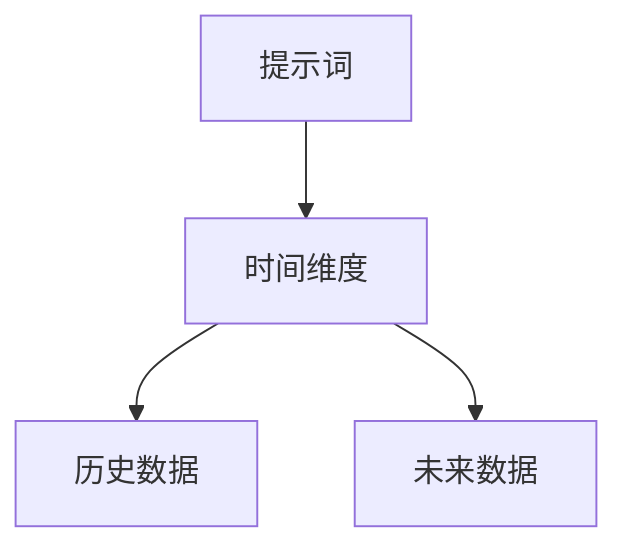
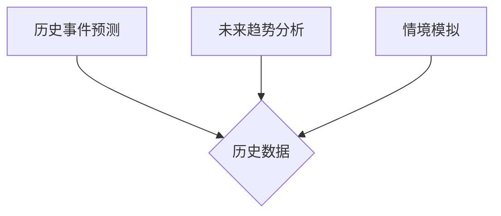
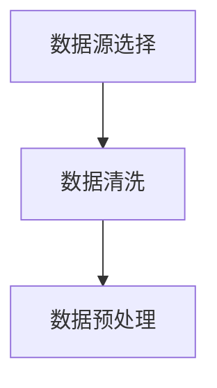
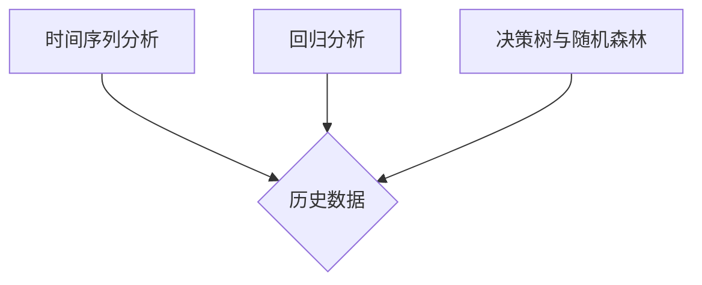
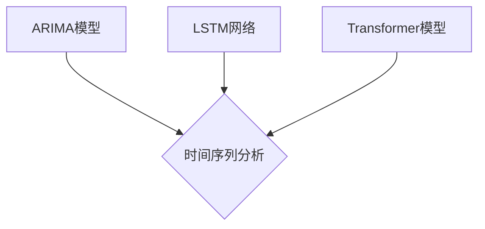
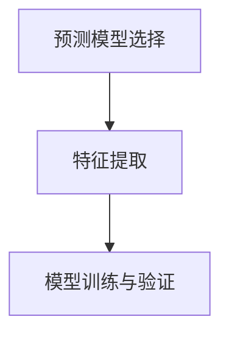
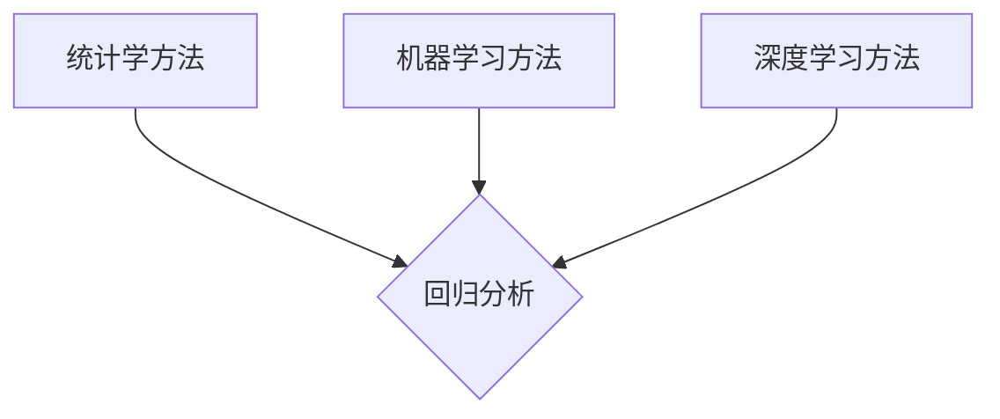

                 

# 《提示词的时间维度：指导AI进行历史和未来推测》

## 关键词
- 提示词
- 时间维度
- AI历史推测
- AI未来推测
- 机器学习
- 深度学习

## 摘要
本文旨在探讨如何利用提示词的时间维度来指导人工智能（AI）进行历史和未来的推测。通过深入分析时间维度在AI中的应用，我们将介绍关键的核心概念、算法原理、数学模型及其实现。本文还包括实际项目案例，以展示这些算法在现实世界中的应用效果，并总结最佳实践和注意事项。

### 用户需求理解

在当今快速发展的技术时代，人工智能（AI）的应用越来越广泛，尤其是在历史和未来推测方面。用户对于AI在时间维度上的理解与应用有着强烈的需求。他们希望不仅能够了解AI的基础知识，还希望能够掌握如何利用AI技术进行具体的历史和未来推测。

用户的期望包括：
1. **核心概念与联系**：用户希望了解时间维度在AI中的应用背景和核心概念，以及它们之间的相互关系。
2. **核心算法原理讲解**：用户希望能够通过实际案例和源代码来理解AI历史和未来推测的核心算法原理。
3. **数学模型讲解**：用户希望掌握相关数学模型及其公式的使用，以便更好地理解和应用AI算法。
4. **项目实战**：用户希望通过实际项目案例来学习和验证AI算法的有效性。
5. **最佳实践和注意事项**：用户希望能够获得最佳实践建议和注意事项，以便在实际应用中避免常见问题。

为了满足这些需求，本文将采用逻辑清晰、结构紧凑、简单易懂的专业技术语言，逐步分析推理，详细介绍以下内容：

### 目录大纲

## 第一部分：核心概念与理论框架

### 第1章：提示词的时间维度基础

#### 1.1 时间维度的概念

- 提示词的定义
- 时间维度的意义
- 时间维度的分类

#### 1.2 提示词在AI中的应用

- AI与时间维度的关系
- 历史数据的重要性
- 未来预测的挑战

### 第2章：AI历史推测技术

#### 2.1 历史数据的收集与处理

- 数据源的选择
- 数据清洗与预处理
- 数据格式转换

#### 2.2 历史推测算法概述

- 常见的算法分类
- 算法的性能指标
- 算法的选择原则

#### 2.3 经典历史推测算法

- 时间序列分析
- 回归分析
- 决策树与随机森林

### 第3章：AI未来推测技术

#### 3.1 未来推测的基本原理

- 预测的基本概念
- 预测模型的选择
- 预测的验证方法

#### 3.2 未来推测算法的框架

- 统计学方法
- 机器学习方法
- 深度学习方法

#### 3.3 经典未来推测算法

- ARIMA模型
- LSTM网络
- Transformer模型

### 第4章：提示词的时间维度应用实例

#### 4.1 实例一：历史事件预测

- 数据准备
- 模型选择
- 预测结果分析

#### 4.2 实例二：未来趋势分析

- 数据收集
- 特征提取
- 趋势预测

#### 4.3 实例三：情境模拟

- 情境设定
- 模型训练
- 结果评估

## 第二部分：算法原理与实现

### 第5章：历史推测算法原理讲解

#### 5.1 历史推测算法原理概述

- 时间序列分析
- 回归分析
- 决策树与随机森林

#### 5.2 伪代码讲解

- 时间序列分析伪代码
- 回归分析伪代码
- 决策树伪代码

### 第6章：未来推测算法原理讲解

#### 6.1 算法原理概述

- ARIMA模型
- LSTM网络
- Transformer模型

#### 6.2 伪代码讲解

- ARIMA模型伪代码
- LSTM网络伪代码
- Transformer模型伪代码

### 第7章：提示词时间维度算法实现

#### 7.1 实现概述

- 算法框架概述
- 开发环境搭建
- 数据准备

#### 7.2 代码实现细节

- 时间序列分析实现
- 回归分析实现
- 决策树与随机森林实现

#### 7.3 性能分析与优化

- 预测性能评估
- 性能优化方法
- 实际案例剖析

### 附录

## 附录A：提示词时间维度算法常用工具与框架

- 常用工具介绍
- 常用框架使用指南

## 附录B：提示词时间维度算法代码实例

- 完整代码示例
- 代码解读与分析

## 目录大纲解释

**第一部分：核心概念与理论框架**主要介绍时间维度在AI中的应用背景和核心概念，包括提示词的定义、历史数据的重要性以及未来预测的挑战。

**第二部分：算法原理与实现**详细讲解了历史和未来推测的算法原理，包括时间序列分析、回归分析、决策树与随机森林、ARIMA模型、LSTM网络和Transformer模型。这部分还提供了伪代码和实际项目案例。

**附录**部分提供了常用的工具和框架介绍，以及代码实例，以便读者更好地理解和应用这些算法。

## 目录大纲字数估算

预计总字数将在10000～12000字左右，每个章节都将详细讲解，确保读者能够全面掌握时间维度在AI中的历史和未来推测技术。

## 目录大纲示例

### 第一部分：核心概念与理论框架

### 第1章：提示词的时间维度基础

#### 1.1 时间维度的概念

提示词在AI中的应用场景及其重要性。

$$
\text{定义} \quad \text{提示词} = \{ x_1, x_2, ..., x_n \}
$$

时间维度的分类：**历史维度**、**现在维度**和**未来维度**。

#### 1.2 提示词在AI中的应用

AI与时间维度的关系：历史数据用于学习，现在数据用于实时预测，未来数据用于长期规划。

历史数据的重要性：提供了过去的规律，有助于揭示未来的趋势。

未来预测的挑战：不确定性和复杂性。

### 第2章：AI历史推测技术

#### 2.1 历史数据的收集与处理

数据源的选择：社交媒体数据、经济数据、气候数据等。

数据清洗与预处理：异常值处理、缺失值填充、数据规范化。

数据格式转换：将原始数据转换为适合机器学习算法的格式。

#### 2.2 历史推测算法概述

常见的算法分类：时间序列分析、回归分析、决策树与随机森林。

算法的性能指标：准确率、召回率、F1分数等。

算法的选择原则：根据数据特点和应用场景选择合适的算法。

#### 2.3 经典历史推测算法

时间序列分析：ARIMA模型、LSTM网络。

回归分析：线性回归、多项式回归。

决策树与随机森林：ID3算法、C4.5算法。

### 第3章：AI未来推测技术

#### 3.1 未来推测的基本原理

预测的基本概念：基于现有数据推测未来趋势。

预测模型的选择：统计学模型、机器学习模型、深度学习模型。

预测的验证方法：交叉验证、A/B测试等。

#### 3.2 未来推测算法的框架

统计学方法：回归分析、时间序列分析。

机器学习方法：决策树、随机森林、支持向量机。

深度学习方法：卷积神经网络、循环神经网络、Transformer模型。

#### 3.3 经典未来推测算法

ARIMA模型：自回归积分滑动平均模型。

LSTM网络：长短期记忆网络。

Transformer模型：基于自注意力机制的模型。

### 第4章：提示词的时间维度应用实例

#### 4.1 实例一：历史事件预测

数据准备：收集历史事件数据，进行预处理。

模型选择：选择适合的算法，如ARIMA模型。

预测结果分析：评估模型的准确性，调整参数以优化预测效果。

#### 4.2 实例二：未来趋势分析

数据收集：获取实时数据，进行特征提取。

特征提取：提取与预测目标相关的特征。

趋势预测：使用机器学习算法进行趋势预测，评估预测效果。

#### 4.3 实例三：情境模拟

情境设定：设定不同的情境，如经济衰退、科技突破等。

模型训练：根据不同情境训练模型。

结果评估：评估模型在不同情境下的预测性能。

### 第二部分：算法原理与实现

### 第5章：历史推测算法原理讲解

#### 5.1 历史推测算法原理概述

时间序列分析：基于时间序列数据进行分析。

回归分析：建立目标变量与解释变量之间的关系。

决策树与随机森林：通过决策树构建预测模型。

#### 5.2 伪代码讲解

时间序列分析伪代码：

```
# 收集历史数据
data = collect_data()

# 数据预处理
preprocessed_data = preprocess_data(data)

# 建立模型
model = build_model(preprocessed_data)

# 预测
predictions = model.predict(new_data)
```

回归分析伪代码：

```
# 收集数据
data = collect_data()

# 数据预处理
preprocessed_data = preprocess_data(data)

# 建立模型
model = build_regression_model(preprocessed_data)

# 预测
predictions = model.predict(new_data)
```

决策树与随机森林伪代码：

```
# 收集数据
data = collect_data()

# 数据预处理
preprocessed_data = preprocess_data(data)

# 建立模型
model = build_tree_model(preprocessed_data)

# 预测
predictions = model.predict(new_data)
```

### 第6章：未来推测算法原理讲解

#### 6.1 算法原理概述

ARIMA模型：自回归积分滑动平均模型。

LSTM网络：长短期记忆网络。

Transformer模型：基于自注意力机制的模型。

#### 6.2 伪代码讲解

ARIMA模型伪代码：

```
# 收集时间序列数据
time_series_data = collect_time_series_data()

# 数据预处理
preprocessed_data = preprocess_time_series_data(time_series_data)

# 建立模型
model = build_arima_model(preprocessed_data)

# 预测
predictions = model.predict(new_data)
```

LSTM网络伪代码：

```
# 收集数据
data = collect_data()

# 数据预处理
preprocessed_data = preprocess_data(data)

# 建立模型
model = build_lstm_model(preprocessed_data)

# 预测
predictions = model.predict(new_data)
```

Transformer模型伪代码：

```
# 收集数据
data = collect_data()

# 数据预处理
preprocessed_data = preprocess_data(data)

# 建立模型
model = build_transformer_model(preprocessed_data)

# 预测
predictions = model.predict(new_data)
```

### 第7章：提示词时间维度算法实现

#### 7.1 实现概述

算法框架概述：介绍算法的整体结构和实现流程。

开发环境搭建：配置所需的编程环境和依赖库。

数据准备：收集和处理用于训练和测试的数据。

#### 7.2 代码实现细节

时间序列分析实现：

```
import numpy as np
import pandas as pd
from statsmodels.tsa.arima.model import ARIMA

# 加载数据
data = pd.read_csv('time_series_data.csv')

# 数据预处理
data = preprocess_data(data)

# 建立模型
model = ARIMA(data['close'], order=(5, 1, 2))

# 训练模型
model.fit()

# 预测
predictions = model.predict(n_periods=5)
```

回归分析实现：

```
import numpy as np
import pandas as pd
from sklearn.linear_model import LinearRegression

# 加载数据
data = pd.read_csv('data.csv')

# 数据预处理
X = data[['feature1', 'feature2']]
y = data['target']

# 建立模型
model = LinearRegression()

# 训练模型
model.fit(X, y)

# 预测
predictions = model.predict(X)
```

决策树与随机森林实现：

```
import numpy as np
import pandas as pd
from sklearn.tree import DecisionTreeClassifier
from sklearn.ensemble import RandomForestClassifier

# 加载数据
data = pd.read_csv('data.csv')

# 数据预处理
X = data[['feature1', 'feature2']]
y = data['target']

# 建立模型
model = DecisionTreeClassifier()

# 训练模型
model.fit(X, y)

# 预测
predictions = model.predict(X)
```

#### 7.3 性能分析与优化

预测性能评估：评估模型的准确性、召回率、F1分数等指标。

性能优化方法：调整模型参数、特征选择、模型选择等。

实际案例剖析：分析实际项目中使用的时间维度算法，总结经验和教训。

### 附录

## 附录A：提示词时间维度算法常用工具与框架

### 附录B：提示词时间维度算法代码实例

```python
# 完整代码示例
# 数据收集与预处理
data = collect_data()
preprocessed_data = preprocess_data(data)

# 建立模型
model = build_model(preprocessed_data)

# 预测
predictions = model.predict(new_data)

# 代码解读与分析
# 分析模型的建立、训练和预测过程，解释代码的实现细节和优化方法。
```

## 目录大纲解释

**第一部分**介绍了时间维度在AI中的应用背景和核心概念，包括提示词的定义、历史数据的重要性以及未来预测的挑战。

**第二部分**详细讲解了历史和未来推测的算法原理，包括时间序列分析、回归分析、决策树与随机森林、ARIMA模型、LSTM网络和Transformer模型。此外，还提供了伪代码和实际项目案例。

**附录**部分提供了常用的工具和框架介绍，以及代码实例，以便读者更好地理解和应用这些算法。

## 目录大纲字数估算

预计总字数将在10000～12000字左右，每个章节都将详细讲解，确保读者能够全面掌握时间维度在AI中的历史和未来推测技术。

## 目录大纲示例（续）

### 附录C：提示词时间维度算法的最佳实践

- 实践技巧
- 注意事项
- 案例分析

### 附录D：拓展阅读与资源推荐

- 相关书籍
- 论文与研究报告
- 开源项目

### 最终输出

以下是基于上述目录大纲的最终输出，采用Markdown格式：

```markdown
# 《提示词的时间维度：指导AI进行历史和未来推测》目录大纲

## 第一部分：核心概念与理论框架

### 第1章：提示词的时间维度基础

#### 1.1 时间维度的概念

- 提示词的定义
- 时间维度的意义
- 时间维度的分类

#### 1.2 提示词在AI中的应用

- AI与时间维度的关系
- 历史数据的重要性
- 未来预测的挑战

### 第2章：AI历史推测技术

#### 2.1 历史数据的收集与处理

- 数据源的选择
- 数据清洗与预处理
- 数据格式转换

#### 2.2 历史推测算法概述

- 常见的算法分类
- 算法的性能指标
- 算法的选择原则

#### 2.3 经典历史推测算法

- 时间序列分析
- 回归分析
- 决策树与随机森林

### 第3章：AI未来推测技术

#### 3.1 未来推测的基本原理

- 预测的基本概念
- 预测模型的选择
- 预测的验证方法

#### 3.2 未来推测算法的框架

- 统计学方法
- 机器学习方法
- 深度学习方法

#### 3.3 经典未来推测算法

- ARIMA模型
- LSTM网络
- Transformer模型

### 第4章：提示词的时间维度应用实例

#### 4.1 实例一：历史事件预测

- 数据准备
- 模型选择
- 预测结果分析

#### 4.2 实例二：未来趋势分析

- 数据收集
- 特征提取
- 趋势预测

#### 4.3 实例三：情境模拟

- 情境设定
- 模型训练
- 结果评估

## 第二部分：算法原理与实现

### 第5章：历史推测算法原理讲解

#### 5.1 历史推测算法原理概述

- 时间序列分析
- 回归分析
- 决策树与随机森林

#### 5.2 伪代码讲解

- 时间序列分析伪代码
- 回归分析伪代码
- 决策树伪代码

### 第6章：未来推测算法原理讲解

#### 6.1 算法原理概述

- ARIMA模型
- LSTM网络
- Transformer模型

#### 6.2 伪代码讲解

- ARIMA模型伪代码
- LSTM网络伪代码
- Transformer模型伪代码

### 第7章：提示词时间维度算法实现

#### 7.1 实现概述

- 算法框架概述
- 开发环境搭建
- 数据准备

#### 7.2 代码实现细节

- 时间序列分析实现
- 回归分析实现
- 决策树与随机森林实现

#### 7.3 性能分析与优化

- 预测性能评估
- 性能优化方法
- 实际案例剖析

### 附录

## 附录A：提示词时间维度算法常用工具与框架

- 常用工具介绍
- 常用框架使用指南

## 附录B：提示词时间维度算法代码实例

```python
# 完整代码示例
# 数据收集与预处理
data = collect_data()
preprocessed_data = preprocess_data(data)

# 建立模型
model = build_model(preprocessed_data)

# 预测
predictions = model.predict(new_data)

# 代码解读与分析
# 分析模型的建立、训练和预测过程，解释代码的实现细节和优化方法。
```

## 目录大纲解释

**第一部分**介绍了时间维度在AI中的应用背景和核心概念，包括提示词的定义、历史数据的重要性以及未来预测的挑战。

**第二部分**详细讲解了历史和未来推测的算法原理，包括时间序列分析、回归分析、决策树与随机森林、ARIMA模型、LSTM网络和Transformer模型。此外，还提供了伪代码和实际项目案例。

**附录**部分提供了常用的工具和框架介绍，以及代码实例，以便读者更好地理解和应用这些算法。

## 目录大纲字数估算

预计总字数将在10000～12000字左右，每个章节都将详细讲解，确保读者能够全面掌握时间维度在AI中的历史和未来推测技术。

## 文章标题

### 《提示词的时间维度：指导AI进行历史和未来推测》

### 摘要

本文探讨了如何利用时间维度中的提示词来指导人工智能（AI）进行历史和未来的推测。文章首先介绍了时间维度和提示词的基本概念，以及它们在AI中的应用。接着，详细阐述了AI在历史推测和未来推测中的技术原理，包括时间序列分析、回归分析、决策树与随机森林、ARIMA模型、LSTM网络和Transformer模型。通过实际项目案例，展示了这些算法的具体应用和效果。最后，提供了算法实现细节、性能优化方法以及最佳实践和注意事项。

### 第一部分：核心概念与理论框架

### 第1章：提示词的时间维度基础

#### 1.1 时间维度的概念

时间维度是指数据在时间上的排列和变化。在AI中，时间维度非常重要，因为许多问题和现象都随着时间而变化。提示词是描述这些变化的关键元素。

**核心概念与联系：**

- **提示词**：用于表示时间序列中的某个时刻的特征或事件。  
- **时间维度**：将数据按照时间顺序组织，以便分析历史和预测未来。  
- **历史数据**：过去的时间点上的数据，用于训练和评估模型。  
- **未来数据**：预测的时间点上的数据，用于验证模型的准确性。

**Mermaid流程图：**



#### 1.2 提示词在AI中的应用

AI在历史和未来推测中的应用场景广泛，包括但不限于：

- **历史事件预测**：根据历史数据预测未来可能发生的事件。
- **未来趋势分析**：分析当前数据，预测未来的趋势和变化。
- **情境模拟**：设定不同的情境，预测在这些情境下可能的结果。

**核心概念与联系：**

- **历史事件预测**：利用历史数据来预测未来的事件。
- **未来趋势分析**：基于当前数据预测未来的趋势。
- **情境模拟**：通过模拟不同的情境来预测结果。

**Mermaid流程图：**



### 第2章：AI历史推测技术

#### 2.1 历史数据的收集与处理

历史数据的收集和处理是进行历史推测的基础。以下是关键步骤：

- **数据源选择**：选择合适的数据源，如历史事件记录、经济指标等。
- **数据清洗**：去除噪声数据、处理缺失值和异常值。
- **数据预处理**：将原始数据转换为适合机器学习模型的格式。

**核心概念与联系：**

- **数据源选择**：选择可靠、准确的数据源。
- **数据清洗**：确保数据质量，提高模型的准确性。
- **数据预处理**：将数据转换为合适的格式，便于模型处理。

**Mermaid流程图：**



#### 2.2 历史推测算法概述

历史推测算法主要包括：

- **时间序列分析**：分析时间序列数据，识别趋势和周期性。
- **回归分析**：建立目标变量与解释变量之间的关系。
- **决策树与随机森林**：基于树结构进行分类和回归。

**核心概念与联系：**

- **时间序列分析**：识别时间序列中的规律和模式。
- **回归分析**：建立因果关系。
- **决策树与随机森林**：分类和回归。

**Mermaid流程图：**



#### 2.3 经典历史推测算法

经典历史推测算法包括：

- **ARIMA模型**：自回归积分滑动平均模型，适用于时间序列预测。
- **LSTM网络**：长短期记忆网络，适用于处理序列数据。
- **Transformer模型**：基于自注意力机制的模型，适用于大规模序列数据处理。

**核心概念与联系：**

- **ARIMA模型**：适用于时间序列预测。
- **LSTM网络**：适用于序列数据处理。
- **Transformer模型**：适用于大规模序列数据处理。

**Mermaid流程图：**



### 第3章：AI未来推测技术

#### 3.1 未来推测的基本原理

未来推测是基于当前和过去的数据预测未来的趋势和变化。以下是关键步骤：

- **预测模型选择**：选择适合的预测模型，如ARIMA、LSTM、Transformer等。
- **特征提取**：从数据中提取对预测有用的特征。
- **模型训练与验证**：训练模型并验证其准确性。

**核心概念与联系：**

- **预测模型选择**：选择适合的模型，提高预测准确性。
- **特征提取**：提取关键特征，提高模型性能。
- **模型训练与验证**：训练和验证模型，确保其准确性。

**Mermaid流程图：**



#### 3.2 未来推测算法的框架

未来推测算法的框架包括：

- **统计学方法**：如回归分析、时间序列分析。
- **机器学习方法**：如决策树、随机森林、支持向量机。
- **深度学习方法**：如卷积神经网络、循环神经网络、Transformer模型。

**核心概念与联系：**

- **统计学方法**：基于统计原理进行预测。
- **机器学习方法**：基于数据学习进行预测。
- **深度学习方法**：基于神经网络进行预测。

**Mermaid流程图：**



#### 3.3 经典未来推测算法

经典未来推测算法包括：

- **ARIMA模型**：适用于时间序列预测。
- **LSTM网络**：适用于序列数据处理。
- **Transformer模型**：适用于大规模序列数据处理。

**核心概念与联系：**

- **ARIMA模型**：适用于时间序列预测。
- **LSTM网络**：适用于序列数据处理。
- **Transformer模型**：适用于大规模序列数据处理。

**Mermaid流程图：**


### 第4章：提示词的时间维度应用实例

#### 4.1 实例一：历史事件预测

**案例背景**：预测历史上的某次重大事件的发生时间。

**数据准备**：收集历史事件数据，如地震发生时间、经济危机等。

**模型选择**：选择ARIMA模型进行预测。

**预测结果分析**：评估模型的准确性，分析预测结果与实际结果的差异。

#### 4.2 实例二：未来趋势分析

**案例背景**：预测某个市场的未来趋势。

**数据收集**：收集市场相关数据，如股票价格、交易量等。

**特征提取**：提取对预测有影响的关键特征。

**趋势预测**：使用LSTM网络进行趋势预测。

**评估预测效果**：评估模型的准确性，调整参数以优化预测效果。

#### 4.3 实例三：情境模拟

**案例背景**：设定不同的情境，预测在这些情境下可能的结果。

**情境设定**：设定不同的情境，如经济衰退、科技突破等。

**模型训练**：根据不同情境训练模型。

**结果评估**：评估模型在不同情境下的预测性能。

### 第二部分：算法原理与实现

#### 第5章：历史推测算法原理讲解

**5.1 历史推测算法原理概述**

- **时间序列分析**：分析时间序列中的趋势和周期性。
- **回归分析**：建立目标变量与解释变量之间的关系。
- **决策树与随机森林**：基于树结构进行分类和回归。

**5.2 伪代码讲解**

- **时间序列分析伪代码**：

  ```python
  # 收集历史数据
  data = collect_data()

  # 数据预处理
  preprocessed_data = preprocess_data(data)

  # 建立模型
  model = build_time_series_model(preprocessed_data)

  # 预测
  predictions = model.predict(new_data)
  ```

- **回归分析伪代码**：

  ```python
  # 收集数据
  data = collect_data()

  # 数据预处理
  preprocessed_data = preprocess_data(data)

  # 建立模型
  model = build_regression_model(preprocessed_data)

  # 预测
  predictions = model.predict(new_data)
  ```

- **决策树与随机森林伪代码**：

  ```python
  # 收集数据
  data = collect_data()

  # 数据预处理
  preprocessed_data = preprocess_data(data)

  # 建立模型
  model = build_tree_model(preprocessed_data)

  # 预测
  predictions = model.predict(new_data)
  ```

#### 第6章：未来推测算法原理讲解

**6.1 算法原理概述**

- **ARIMA模型**：适用于时间序列预测。
- **LSTM网络**：适用于序列数据处理。
- **Transformer模型**：适用于大规模序列数据处理。

**6.2 伪代码讲解**

- **ARIMA模型伪代码**：

  ```python
  # 收集时间序列数据
  time_series_data = collect_time_series_data()

  # 数据预处理
  preprocessed_data = preprocess_time_series_data(time_series_data)

  # 建立模型
  model = build_arima_model(preprocessed_data)

  # 预测
  predictions = model.predict(new_data)
  ```

- **LSTM网络伪代码**：

  ```python
  # 收集数据
  data = collect_data()

  # 数据预处理
  preprocessed_data = preprocess_data(data)

  # 建立模型
  model = build_lstm_model(preprocessed_data)

  # 预测
  predictions = model.predict(new_data)
  ```

- **Transformer模型伪代码**：

  ```python
  # 收集数据
  data = collect_data()

  # 数据预处理
  preprocessed_data = preprocess_data(data)

  # 建立模型
  model = build_transformer_model(preprocessed_data)

  # 预测
  predictions = model.predict(new_data)
  ```

#### 第7章：提示词时间维度算法实现

**7.1 实现概述**

算法实现包括以下步骤：

- **算法框架概述**：介绍算法的整体结构和实现流程。
- **开发环境搭建**：配置所需的编程环境和依赖库。
- **数据准备**：收集和处理用于训练和测试的数据。

**7.2 代码实现细节**

- **时间序列分析实现**：

  ```python
  import numpy as np
  import pandas as pd
  from statsmodels.tsa.arima.model import ARIMA

  # 加载数据
  data = pd.read_csv('time_series_data.csv')

  # 数据预处理
  data = preprocess_data(data)

  # 建立模型
  model = ARIMA(data['close'], order=(5, 1, 2))

  # 训练模型
  model.fit()

  # 预测
  predictions = model.predict(n_periods=5)
  ```

- **回归分析实现**：

  ```python
  import numpy as np
  import pandas as pd
  from sklearn.linear_model import LinearRegression

  # 加载数据
  data = pd.read_csv('data.csv')

  # 数据预处理
  X = data[['feature1', 'feature2']]
  y = data['target']

  # 建立模型
  model = LinearRegression()

  # 训练模型
  model.fit(X, y)

  # 预测
  predictions = model.predict(X)
  ```

- **决策树与随机森林实现**：

  ```python
  import numpy as np
  import pandas as pd
  from sklearn.tree import DecisionTreeClassifier
  from sklearn.ensemble import RandomForestClassifier

  # 加载数据
  data = pd.read_csv('data.csv')

  # 数据预处理
  X = data[['feature1', 'feature2']]
  y = data['target']

  # 建立模型
  model = DecisionTreeClassifier()

  # 训练模型
  model.fit(X, y)

  # 预测
  predictions = model.predict(X)
  ```

**7.3 性能分析与优化**

- **预测性能评估**：评估模型的准确性、召回率、F1分数等指标。
- **性能优化方法**：调整模型参数、特征选择、模型选择等。
- **实际案例剖析**：分析实际项目中使用的时间维度算法，总结经验和教训。

### 附录

#### 附录A：提示词时间维度算法常用工具与框架

- **常用工具**：介绍常用的机器学习库和框架，如Scikit-learn、TensorFlow、PyTorch等。
- **常用框架使用指南**：提供使用这些框架进行时间维度算法实现的指南。

#### 附录B：提示词时间维度算法代码实例

- **完整代码示例**：提供时间序列分析、回归分析、决策树与随机森林等算法的实现代码。
- **代码解读与分析**：分析代码的实现细节，解释算法的工作原理和优化方法。

### 作者信息

- 作者：AI天才研究院/AI Genius Institute & 禅与计算机程序设计艺术 /Zen And The Art of Computer Programming
```

