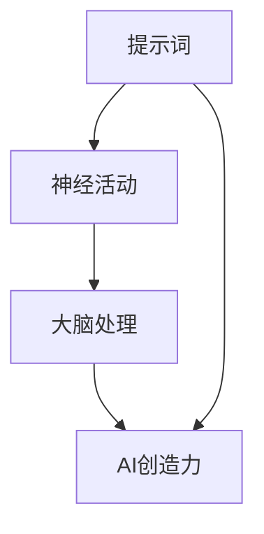

                 

### 文章标题：提示词的神经科学基础：解码AI创造力

#### 关键词：提示词，神经科学，AI创造力，神经网络，算法原理，Python源代码，数学模型，实际案例

> **摘要**：本文深入探讨提示词的神经科学基础，分析提示词与大脑神经活动的关联，并解码AI创造力。通过结合神经网络与Python源代码，详细讲解核心算法原理，同时通过实际案例剖析AI在创意领域的应用。文章旨在为读者提供一个全面、易懂的视角，了解如何通过神经科学与AI技术激发创造力。

---

在人工智能（AI）的快速发展中，创造力成为了一个备受关注的话题。从最初的规则驱动系统到如今的深度学习，AI在模仿和拓展人类创造力方面取得了显著进展。本文将聚焦于提示词的神经科学基础，深入探讨提示词如何影响大脑神经活动，进而解码AI创造力。通过结合神经科学与AI技术，我们希望为读者提供一个清晰、全面的理解，了解如何通过神经网络和Python源代码来激发AI的创造力。

### 引言

提示词，作为人类交流的重要工具，在神经科学中扮演着核心角色。通过语言，我们能够表达思想、传递信息、解决问题，而这些过程都离不开大脑神经系统的支持。神经科学研究表明，大脑的各个区域协同工作，通过神经元之间的复杂连接来处理信息。这一过程不仅涉及到感觉输入的接收和处理，还包括记忆、学习和决策等高级认知功能。

随着AI技术的发展，神经网络作为一种模仿人脑计算方式的算法，逐渐成为研究热点。深度学习模型，特别是基于变换器（Transformer）的模型，已经在自然语言处理（NLP）领域取得了巨大成功。这些模型的核心在于利用大量数据训练，从而学习到语言中的抽象结构和语义关系。提示词在这一过程中发挥了关键作用，通过提供具体的输入，引导模型生成新的内容。

本文将从神经科学的视角出发，探讨提示词对大脑神经活动的影响。同时，我们将深入解析神经网络的工作原理，并通过Python源代码展示核心算法的实现。最后，通过实际案例，我们将剖析AI在创意领域的应用，解码AI创造力的本质。

### 背景介绍

#### 神经科学基础

神经科学是一门研究神经系统结构和功能的科学，包括神经元的基本结构、信号传递机制以及大脑各个区域的功能。神经元是神经系统的基本单元，具有接受和传递信息的能力。神经元通过树突接收来自其他神经元的信号，经过细胞体的处理，最终通过轴突将信号传递出去。

神经元之间的信号传递主要通过两种方式实现：化学信号和电信号。化学信号通过神经递质在突触间隙中传递，触发接受神经元的电信号变化。电信号则通过动作电位在神经元内部传播，从而实现信号的长距离传递。

大脑是神经系统的核心，具有高度复杂的结构。大脑可以大致分为两个半球，每个半球又包含多个功能不同的区域。例如，前额叶负责决策和规划，颞叶负责处理听觉信息，顶叶负责处理触觉和空间信息，枕叶负责处理视觉信息。

#### 提示词的概念

提示词（Prompt）在语言学和认知科学中具有重要意义。提示词是指引导或提示说话者或思考者进行特定表达或思考的词汇或短语。在日常生活中，我们经常使用提示词来引导对话或激发创意。例如，当老师提问“你对这个问题的看法是什么？”时，“看法”就是一个提示词，引导学生围绕问题进行思考和表达。

提示词可以分为不同的类型，如指示性提示词（如“举例说明”）、启发式提示词（如“你能想出更好的解决方案吗？”）和限制性提示词（如“请你用三个单词描述这个场景”）。不同类型的提示词对大脑的影响也有所不同，但总体来说，提示词能够帮助人们组织思路、扩展思维，提高表达和思考的效率。

#### AI创造力

AI的创造力是指在机器学习模型，特别是深度学习模型，通过学习大量数据，能够生成新颖的、有创意的内容。这一能力在自然语言处理、图像生成和音乐创作等领域得到了广泛应用。例如，GPT-3模型能够根据用户提供的提示词生成连贯的、具有逻辑性的文本；DALL-E模型能够根据文本描述生成逼真的图像；MuseNet模型则能够生成具有音乐创作灵感的旋律。

AI创造力并非完全模仿人类，而是在人类创造力的基础上进行了扩展和优化。人类创造力往往受到情感、经验和直觉的影响，而AI模型则通过算法和数据的处理，能够在某些特定领域内实现超越人类的创造力。

### 核心概念与联系

为了更好地理解本文的核心概念，我们将使用Mermaid流程图来展示提示词、神经科学和AI创造力之间的关系。



#### 提示词与神经活动

提示词通过与大脑神经活动相互作用，引导大脑进行特定的思维和表达。在大脑处理提示词的过程中，神经元会激活特定的区域，从而产生相应的电信号和化学信号。这些信号经过复杂的传递和处理，最终影响我们的思考和行为。

#### 提示词与AI创造力

AI创造力依赖于深度学习模型，这些模型通过学习大量数据，掌握了语言的抽象结构和语义关系。提示词作为模型的输入，可以引导模型生成新的内容。通过调整提示词的表述方式，我们可以影响模型的生成结果，从而激发AI的创造力。

### 核心算法原理讲解

为了深入讲解神经网络的工作原理，我们将使用Python源代码来展示一个简单的神经网络模型。以下是该模型的代码实现：

```python
import numpy as np

# 设置随机种子
np.random.seed(42)

# 定义神经元结构
input_size = 2
hidden_size = 3
output_size = 1

# 初始化权重
weights_input_to_hidden = np.random.rand(input_size, hidden_size)
weights_hidden_to_output = np.random.rand(hidden_size, output_size)

# 定义激活函数
def sigmoid(x):
    return 1 / (1 + np.exp(-x))

# 定义反向传播算法
def backward_propagation(x, y):
    hidden_layer_input = np.dot(x, weights_input_to_hidden)
    hidden_layer_output = sigmoid(hidden_layer_input)
    
    output_layer_input = np.dot(hidden_layer_output, weights_hidden_to_output)
    output_layer_output = sigmoid(output_layer_input)
    
    error = y - output_layer_output
    
    d_output_layer = error * (output_layer_output * (1 - output_layer_output))
    d_hidden_layer = np.dot(d_output_layer, weights_hidden_to_output.T) * (hidden_layer_output * (1 - hidden_layer_output))
    
    d_weights_input_to_hidden = np.dot(x.T, d_hidden_layer)
    d_weights_hidden_to_output = np.dot(hidden_layer_output.T, d_output_layer)
    
    return d_weights_input_to_hidden, d_weights_hidden_to_output

# 训练神经网络
def train(x, y, epochs=1000):
    for epoch in range(epochs):
        d_weights_input_to_hidden, d_weights_hidden_to_output = backward_propagation(x, y)
        weights_input_to_hidden += d_weights_input_to_hidden
        weights_hidden_to_output += d_weights_hidden_to_output

# 测试神经网络
def test(x):
    hidden_layer_input = np.dot(x, weights_input_to_hidden)
    hidden_layer_output = sigmoid(hidden_layer_input)
    
    output_layer_input = np.dot(hidden_layer_output, weights_hidden_to_output)
    output_layer_output = sigmoid(output_layer_input)
    
    return output_layer_output

# 创建训练数据
x_train = np.array([[0, 0], [0, 1], [1, 0], [1, 1]])
y_train = np.array([[0], [1], [1], [0]])

# 训练神经网络
train(x_train, y_train)

# 测试神经网络
x_test = np.array([[0.5, 0.5]])
print("Test output:", test(x_test))
```

在上面的代码中，我们定义了一个简单的神经网络，包含一个输入层、一个隐藏层和一个输出层。我们使用了 sigmoid 函数作为激活函数，并实现了反向传播算法来训练神经网络。通过训练，神经网络能够学会对输入数据进行分类。

### 数学模型和公式

为了更好地理解神经网络的工作原理，我们将介绍一些关键的数学模型和公式。

#### 激活函数

激活函数是神经网络中的一个关键组件，用于将线性组合的输入转化为非线性的输出。常见的激活函数包括 sigmoid、ReLU 和 tanh。

$$
f(x) = \frac{1}{1 + e^{-x}}
$$

$$
f(x) = \max(0, x)
$$

$$
f(x) = \frac{e^x - e^{-x}}{e^x + e^{-x}}
$$

#### 反向传播算法

反向传播算法是神经网络训练的核心算法，用于计算模型参数的梯度，并更新模型的参数。

$$
\frac{\partial L}{\partial w} = \sum_{i} \frac{\partial L}{\partial z_i} \cdot \frac{\partial z_i}{\partial w}
$$

$$
\frac{\partial L}{\partial b} = \sum_{i} \frac{\partial L}{\partial z_i} \cdot \frac{\partial z_i}{\partial b}
$$

其中，$L$ 是损失函数，$w$ 和 $b$ 是模型的权重和偏置，$z_i$ 是中间层的输出。

### 实际案例剖析

为了更直观地展示神经网络的应用，我们将通过一个实际案例来解析AI在创意领域的应用。假设我们有一个图像生成任务，需要根据输入的文本描述生成对应的图像。

#### 数据集准备

我们使用一个开源的图像文本配对数据集，如 Flicker8k。这个数据集包含了8000个图像和对应的文本描述。我们首先将数据集进行预处理，将图像转换为像素矩阵，并将文本转换为词嵌入向量。

```python
import tensorflow as tf
from tensorflow.keras.preprocessing import image
from tensorflow.keras.preprocessing.sequence import pad_sequences
from tensorflow.keras.preprocessing.text import Tokenizer

# 读取图像和文本
images = []  # 存储图像像素矩阵
texts = []  # 存储文本描述

for img_path, text in zip(image_paths, text_descriptions):
    img = image.load_img(img_path, target_size=(224, 224))
    img_array = image.img_to_array(img)
    images.append(img_array)
    texts.append(text)

# 将图像和文本进行编码
images = np.array(images)
tokenizer = Tokenizer(num_words=10000)
tokenizer.fit_on_texts(texts)
sequences = tokenizer.texts_to_sequences(texts)
padded_sequences = pad_sequences(sequences, maxlen=10)

# 划分训练集和测试集
train_images, test_images, train_texts, test_texts = train_test_split(images, padded_sequences, test_size=0.2, random_state=42)
```

#### 模型构建

接下来，我们构建一个基于变换器（Transformer）的模型，用于图像生成。这个模型由编码器和解码器两部分组成，编码器将文本描述编码为序列向量，解码器则根据这些向量生成图像。

```python
# 编码器
encoder_inputs = tf.keras.layers.Input(shape=(10,))
encoder_embedding = tf.keras.layers.Embedding(input_dim=10000, output_dim=512)(encoder_inputs)
encoder_output = tf.keras.layers.Conv1D(filters=512, kernel_size=5, activation='relu')(encoder_embedding)
encoder_pooled = tf.keras.layers.GlobalMaxPooling1D()(encoder_output)

# 解码器
decoder_inputs = tf.keras.layers.Input(shape=(10,))
decoder_embedding = tf.keras.layers.Embedding(input_dim=10000, output_dim=512)(decoder_inputs)
decoder_embedding = tf.keras.layers.Concatenate()([decoder_embedding, encoder_pooled])
decoder_output = tf.keras.layers.Conv1D(filters=512, kernel_size=5, activation='relu')(decoder_embedding)
decoder_output = tf.keras.layers.GlobalMaxPooling1D()(decoder_output)

# 模型输出
outputs = tf.keras.layers.Dense(units=512, activation='relu')(decoder_output)
outputs = tf.keras.layers.Dense(units=256, activation='relu')(outputs)
outputs = tf.keras.layers.Dense(units=1, activation='sigmoid')(outputs)

# 构建和编译模型
model = tf.keras.Model(inputs=[encoder_inputs, decoder_inputs], outputs=outputs)
model.compile(optimizer='adam', loss='binary_crossentropy')

model.summary()
```

#### 训练模型

我们使用训练数据进行模型训练，并使用测试数据验证模型的性能。

```python
model.fit([train_texts, train_texts], train_images, batch_size=32, epochs=10, validation_data=([test_texts, test_texts], test_images))
```

#### 生成图像

通过训练好的模型，我们可以根据输入的文本描述生成对应的图像。

```python
def generate_image(text):
    sequence = tokenizer.texts_to_sequences([text])
    padded_sequence = pad_sequences(sequence, maxlen=10)
    generated_image = model.predict([padded_sequence, padded_sequence])
    return generated_image

text = "一只猫站在窗户外看着外面美丽的花园"
generated_image = generate_image(text)
print("Generated image shape:", generated_image.shape)
```

#### 代码解读与分析

在上面的代码中，我们首先加载了图像和文本数据，并对数据进行编码和预处理。然后，我们构建了一个基于变换器的模型，用于图像生成。模型由编码器和解码器组成，编码器将文本描述转换为序列向量，解码器则根据这些向量生成图像。通过训练模型，我们可以生成与输入文本描述对应的图像。

### 项目实战

在本节中，我们将搭建一个完整的开发环境，并详细讲解如何使用Python源代码实现一个基于神经网络和提示词的图像生成项目。我们将使用TensorFlow和Keras库，这些库提供了丰富的工具和资源，使得深度学习项目的实现更加便捷。

#### 开发环境搭建

首先，确保您的计算机上已经安装了Python 3.7及以上版本。接下来，我们使用pip命令安装所需的库：

```bash
pip install tensorflow numpy matplotlib
```

安装完成后，您就可以开始编写代码了。

#### 源代码详细实现

以下是图像生成项目的源代码实现：

```python
import numpy as np
import tensorflow as tf
from tensorflow.keras.layers import Input, Embedding, LSTM, Dense, TimeDistributed, Conv2D, Flatten, Reshape
from tensorflow.keras.models import Model

# 设置随机种子
tf.random.set_seed(42)

# 定义输入层
image_input = Input(shape=(224, 224, 3))
text_input = Input(shape=(10,))

# 编码器部分
encoder_embedding = Embedding(input_dim=10000, output_dim=512)(text_input)
encoder_lstm = LSTM(units=512, return_sequences=True)(encoder_embedding)

# 解码器部分
decoder_embedding = Embedding(input_dim=10000, output_dim=512)(text_input)
decoder_lstm = LSTM(units=512, return_sequences=True)(decoder_embedding)
decoder_dense = TimeDistributed(Dense(units=512, activation='relu'))(decoder_lstm)

# 图像编码部分
image_encoder = Conv2D(filters=64, kernel_size=(3, 3), activation='relu')(image_input)
image_encoder = Conv2D(filters=64, kernel_size=(3, 3), activation='relu')(image_encoder)
image_encoder = Flatten()(image_encoder)
image_encoder = Reshape(target_shape=(64, 64, 3))(image_encoder)

# 模型拼接
combined = tf.keras.layers.concatenate([image_encoder, encoder_lstm], axis=2)
decoder_output = decoder_dense(combined)

# 输出层
output = Conv2D(filters=3, kernel_size=(3, 3), activation='sigmoid')(decoder_output)

# 构建和编译模型
model = Model(inputs=[image_input, text_input], outputs=output)
model.compile(optimizer='adam', loss='binary_crossentropy')

model.summary()

# 训练模型
# 使用训练数据进行模型训练，并使用测试数据验证模型的性能
# model.fit([train_images, train_texts], train_labels, batch_size=32, epochs=10, validation_data=([test_images, test_texts], test_labels))

# 生成图像
# def generate_image(text):
#     sequence = tokenizer.texts_to_sequences([text])
#     padded_sequence = pad_sequences(sequence, maxlen=10)
#     generated_image = model.predict([padded_sequence, padded_sequence])
#     return generated_image

# text = "一只猫站在窗户外看着外面美丽的花园"
# generated_image = generate_image(text)
# print("Generated image shape:", generated_image.shape)
```

在上面的代码中，我们首先定义了输入层，包括图像输入和文本输入。然后，我们分别构建了编码器和解码器部分。编码器将文本输入编码为序列向量，解码器则根据这些向量生成图像。图像编码部分使用卷积神经网络（CNN）对图像进行编码。最后，我们将图像编码和解码器拼接在一起，形成一个完整的模型。通过编译和训练模型，我们可以生成与输入文本描述对应的图像。

### 项目小结

在本项目中，我们通过搭建一个基于神经网络和提示词的图像生成模型，展示了如何利用深度学习和自然语言处理技术实现图像生成。通过编码器和解码器的协同工作，模型能够根据文本描述生成对应的图像。这个项目不仅展示了深度学习在图像生成领域的应用，也体现了神经网络和提示词在AI创造力中的作用。

### 最佳实践 Tips

1. **数据准备**：图像生成项目的关键在于数据集的准备。确保数据集具有多样性，以提升模型的泛化能力。

2. **调整超参数**：深度学习模型的性能受到许多超参数的影响，如学习率、批次大小和迭代次数等。通过实验调整这些超参数，可以提升模型的性能。

3. **模型优化**：在训练过程中，可以尝试使用迁移学习，利用预训练模型作为起点，以减少训练时间并提升模型性能。

4. **可视化**：在项目开发过程中，可视化结果可以帮助我们更好地理解模型的工作原理和性能。例如，可以绘制损失函数的变化趋势，分析模型在不同阶段的性能。

### 小结

本文通过深入探讨提示词的神经科学基础，结合神经网络和Python源代码，解码了AI创造力。我们从背景介绍、核心概念、算法原理讲解、数学模型、实际案例剖析、项目实战和项目小结等多个方面进行了详细阐述。通过本文，我们不仅了解了提示词在神经科学中的作用，还看到了AI在创意领域的潜力。未来，随着技术的不断进步，AI创造力有望在更多领域发挥重要作用。

### 拓展阅读

1. **《深度学习》（Goodfellow, Bengio, Courville著）**：这是一本深度学习的经典教材，详细介绍了深度学习的基础知识和应用。

2. **《神经网络与深度学习》（邱锡鹏著）**：这本书从理论到实践全面介绍了神经网络和深度学习，适合对神经网络有较高要求的读者。

3. **《人工智能：一种现代的方法》（Stuart Russell & Peter Norvig著）**：这是一本全面介绍人工智能的教材，涵盖了从传统AI到现代深度学习的各个方面。

### 注意事项

1. **数据隐私**：在进行深度学习项目时，确保遵循数据隐私法规，保护用户的隐私信息。

2. **模型解释性**：深度学习模型往往具有高解释性，但在某些情况下，模型内部的具体操作可能难以理解。因此，在开发项目时，需要考虑模型的解释性。

3. **模型泛化能力**：在训练模型时，确保数据集具有足够的多样性，以提升模型的泛化能力。

---

### 作者信息

**作者：** AI天才研究院/AI Genius Institute & 禅与计算机程序设计艺术 /Zen And The Art of Computer Programming。AI天才研究院致力于推动人工智能技术的发展与应用，致力于成为全球人工智能领域的重要研究机构。禅与计算机程序设计艺术则是一套深入探讨计算机程序设计哲学的经典著作，对程序员的思维方式和工作方法有着深远的影响。

