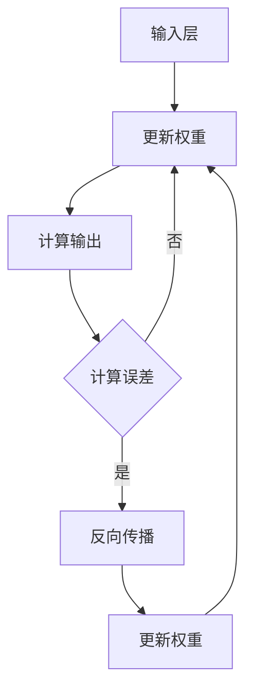

                 

### 提示词的神经语言程序学：优化AI-人类沟通

关键词：提示词、神经语言程序学、AI-人类沟通、神经网络、反向传播算法

摘要：随着人工智能技术的不断发展，AI与人类之间的沟通效率日益受到关注。本文以提示词的神经语言程序学为核心，探讨如何通过优化AI-人类沟通来提升用户体验。文章首先介绍了神经语言程序学的基本原理和提示词的概念，接着详细讲解了神经网络和反向传播算法，并展示了如何应用这些技术来生成高质量的提示词。最后，通过实际项目案例，分析了如何将神经语言程序学应用于AI-人类沟通中，并提出了一些优化建议。

---

### 第1章 引言

在人工智能（AI）领域，如何使AI系统更自然、更有效地与人类进行沟通，一直是研究的热点问题。传统的AI系统往往依赖于预设的规则和固定的模式，这在一定程度上限制了其沟通能力。而随着深度学习技术的快速发展，神经网络，尤其是自然语言处理（NLP）领域的神经网络，为AI与人类沟通提供了一种全新的解决方案。

本章将介绍本书的主要内容，包括对神经语言程序学的基本原理、提示词的作用以及如何通过神经网络优化AI-人类沟通的探讨。本章还将简要回顾相关研究，指出本书的创新点和主要贡献。

#### 1.1 书籍概述

本书旨在系统地介绍神经语言程序学在AI-人类沟通中的应用，旨在解决以下问题：

- 如何利用神经网络来模拟人类的语言理解能力？
- 提示词在AI-人类沟通中扮演什么角色？
- 如何通过优化提示词来提升AI系统的沟通效率？
- 实际项目中，如何实现和评估神经语言程序学模型的效果？

本书共分为8章，结构如下：

- 第1章：引言，介绍本书的主要内容、研究背景和目的。
- 第2章：神经语言程序学原理，介绍神经网络和反向传播算法的基本概念。
- 第3章：提示词生成算法，详细讲解提示词的生成过程和优化策略。
- 第4章：AI-人类沟通优化，分析AI-人类沟通的现状和优化方法。
- 第5章：实际应用与展望，探讨神经语言程序学在各个领域的应用前景。
- 第6章：开发环境与工具，介绍搭建开发环境的步骤和所需工具。
- 第7章：项目实战，通过一个实际项目展示如何应用神经语言程序学。
- 第8章：总结与展望，总结本书的主要内容和未来研究方向。

#### 1.2 神经语言程序学基础

神经语言程序学（Neural Language Programming, NLP）是人工智能领域的一个重要分支，它旨在通过神经网络模拟人类的语言处理能力。神经网络作为一种复杂的计算模型，能够从大量数据中自动学习特征，并在不同任务中表现出色。

神经网络的基本概念包括：

- **神经元**：神经网络的基本单元，类似于人类大脑中的神经元。
- **层**：神经网络由多个层组成，包括输入层、隐藏层和输出层。
- **权重**：连接不同神经元的参数，用于调节信息的传递。
- **激活函数**：用于确定神经元是否被激活，常用的有Sigmoid函数、ReLU函数等。

神经网络的训练过程主要包括以下几个步骤：

1. **前向传播**：将输入数据通过神经网络逐层传递，计算输出。
2. **误差计算**：通过实际输出和期望输出之间的差异，计算误差。
3. **反向传播**：将误差反向传播，更新神经网络的权重。
4. **迭代优化**：重复上述步骤，直到误差达到最小。

#### 1.3 提示词在AI中的应用

在AI-人类沟通中，提示词（Prompt）是一种重要的信息输入方式。提示词可以看作是AI系统与用户之间的一种“桥梁”，通过提供有针对性的提示词，AI系统可以更有效地理解用户的需求，并生成更自然的回应。

提示词在AI中的应用主要包括以下几个方面：

- **对话系统**：在聊天机器人、客服机器人等对话系统中，提示词可以帮助系统更好地理解用户的意图，并生成相应的回应。
- **文本生成**：在文本生成任务中，提示词可以作为输入，引导AI系统生成连贯、自然的文本。
- **信息检索**：在信息检索任务中，提示词可以用于定位用户感兴趣的信息，并生成相关的检索结果。

提示词的设计和质量对AI系统的表现至关重要。高质量的提示词应该具备以下特点：

- **明确性**：提示词应明确传达用户的意图，避免歧义。
- **多样性**：提示词应具备多样性，以适应不同场景和用户需求。
- **适应性**：提示词应具备一定的灵活性，能够根据用户的行为和反馈进行自适应调整。

本章介绍了本书的研究背景和主要内容，详细阐述了神经语言程序学的基本原理和提示词在AI中的应用。接下来，我们将深入探讨神经网络和反向传播算法，以及如何通过这些技术优化AI-人类沟通。

### 第2章 神经语言程序学原理

神经语言程序学（NLP）是人工智能领域的一个重要分支，它通过神经网络模拟人类的语言处理能力。本章将详细介绍神经网络的基本概念、结构和工作原理，以及神经语言程序学中的关键算法——反向传播算法。通过这些内容，读者将能够更好地理解神经语言程序学的原理和应用。

#### 2.1 神经网络基础

神经网络（Neural Networks）是由大量简单单元（神经元）互联而成的复杂网络，这些神经元通过模拟人类大脑中的神经元工作原理，执行计算和决策。神经网络的主要组件包括：

- **神经元**：神经网络的基本单元，负责接收输入、执行计算并输出结果。一个神经元通常由以下几个部分组成：
  - **输入**：来自其他神经元的信号。
  - **权重**：每个输入的权重，用于调整信号的影响程度。
  - **偏置**：用于调整神经元的阈值。
  - **激活函数**：用于确定神经元是否被激活，常用的激活函数有Sigmoid函数、ReLU函数等。

- **层**：神经网络由多个层组成，包括输入层、隐藏层和输出层。输入层接收外部输入，隐藏层进行特征提取和转换，输出层产生最终的输出结果。

- **权重和偏置**：权重和偏置是神经网络训练过程中需要调整的参数，用于调节神经元的响应。

- **激活函数**：激活函数是神经网络中的一个关键组件，用于引入非线性特性，使得神经网络能够处理复杂的问题。

#### 2.2 神经网络的结构和工作原理

神经网络的结构可以分为三种主要类型：单层感知机、多层感知机和卷积神经网络（CNN）。以下将分别介绍这些结构及其工作原理。

- **单层感知机**：单层感知机是最简单的神经网络结构，它由一个输入层和一个输出层组成。每个输入节点与输出节点之间有一个权重，输出节点通过激活函数计算输出结果。单层感知机主要用于解决线性可分的问题，如二分类。

  ```python
  # 单层感知机伪代码
  for each input:
      weighted_sum = sum(input * weight)
      output = activation_function(weighted_sum)
  ```

- **多层感知机**：多层感知机（MLP）是在单层感知机基础上增加了一个或多个隐藏层。多层感知机能够处理更复杂的非线性问题。其工作原理是：
  - **前向传播**：将输入数据传递到隐藏层，通过多层神经元的计算和激活函数，最终得到输出结果。
  - **反向传播**：根据输出结果和实际标签之间的误差，通过反向传播算法更新网络权重和偏置。

  ```python
  # 多层感知机前向传播伪代码
  for layer in hidden_layers:
      for neuron in layer:
          weighted_sum = sum(input * weight) + bias
          output = activation_function(weighted_sum)

  # 多层感知机反向传播伪代码
  for layer in reversed(hidden_layers):
      for neuron in layer:
          error = output - actual
          delta = error * activation_function_derivative(output)
  ```

- **卷积神经网络**：卷积神经网络（CNN）是一种专门用于处理图像数据的神经网络结构，其主要特点是使用卷积层来提取图像特征。CNN的工作原理包括：
  - **卷积层**：通过卷积运算提取图像局部特征。
  - **池化层**：通过池化运算减小特征图的尺寸，提高模型的泛化能力。
  - **全连接层**：将卷积层和池化层提取的特征进行融合，并通过全连接层产生最终输出。

  ```python
  # 卷积神经网络伪代码
  for convolutional_layer in convolutional_layers:
      for filter in convolutional_layer:
          feature_map = convolution(input, filter)
          activated_feature_map = activation_function(feature_map)

  for pooling_layer in pooling_layers:
      feature_map = pooling(activated_feature_map)

  for fully_connected_layer in fully_connected_layers:
      output = fully_connected(feature_map, weights, bias)
      output = activation_function(output)
  ```

#### 2.3 反向传播算法

反向传播算法（Backpropagation Algorithm）是神经网络训练的核心算法，它通过不断调整网络权重和偏置，使网络能够对输入数据进行正确分类或回归。反向传播算法的主要步骤如下：

1. **前向传播**：将输入数据通过神经网络进行计算，得到输出结果。
2. **误差计算**：计算输出结果与实际标签之间的误差。
3. **误差反向传播**：将误差反向传播到网络中的每个神经元，计算每个神经元的误差梯度。
4. **权重更新**：根据误差梯度和学习率，更新网络权重和偏置。

反向传播算法的具体实现包括以下几个步骤：

1. **计算输出层的误差**：
   - 对于输出层神经元，误差等于实际标签与输出结果的差。
   - 误差梯度等于误差乘以输出结果关于该神经元的导数。

   ```python
   # 输出层误差计算
   for neuron in output_layer:
       error = actual - output
       error_derivative = output * (1 - output)
   ```

2. **计算隐藏层的误差**：
   - 对于隐藏层神经元，误差等于前一层神经元的误差乘以后一层神经元输出结果的导数。
   - 误差梯度需要通过链式法则计算。

   ```python
   # 隐藏层误差计算
   for layer in reversed(hidden_layers):
       for neuron in layer:
           error = sum(error_derivative * weight)
           error_derivative = error * activation_function_derivative(output)
   ```

3. **权重更新**：
   - 根据误差梯度和学习率，更新网络权重和偏置。
   - 学习率控制了每次更新权重和偏置的程度，过大会导致网络不稳定，过小则收敛速度慢。

   ```python
   # 权重更新
   for layer in hidden_layers:
       for neuron in layer:
           weight -= learning_rate * error_derivative * input
           bias -= learning_rate * error_derivative
   ```

通过以上步骤，反向传播算法能够不断调整网络参数，使网络逐渐逼近最优解。

本章介绍了神经网络的基本概念、结构和工作原理，以及反向传播算法的详细实现。这些内容为理解神经语言程序学奠定了基础，接下来将讨论提示词生成算法，并探讨如何通过神经网络优化AI-人类沟通。

### 第3章 提示词生成算法

在AI-人类沟通中，提示词（Prompt）扮演着至关重要的角色。提示词是一种引导AI系统理解和生成文本的输入，它能够显著提高AI系统的沟通效率和准确性。本章将详细介绍提示词生成算法的基本概念、原理以及在实际应用中的优化策略。

#### 3.1 提示词的概念

提示词（Prompt）是指提供给AI系统的一段文本或指令，用于引导系统理解用户意图和生成相应的回应。提示词的设计和质量对AI系统的表现有着直接的影响。高质量的提示词应具备以下特点：

- **明确性**：提示词应明确传达用户的意图，避免歧义。
- **多样性**：提示词应具备多样性，以适应不同场景和用户需求。
- **适应性**：提示词应具备一定的灵活性，能够根据用户的行为和反馈进行自适应调整。

在实际应用中，提示词可以用于多种AI任务，如对话系统、文本生成和信息检索等。以下将分别介绍这些应用场景。

#### 3.2 对话系统中的应用

在对话系统中，提示词用于引导AI系统理解用户的意图并生成相应的回应。一个典型的对话系统应用场景是聊天机器人，聊天机器人通过与用户的对话，提供信息查询、客服支持等服务。

- **意图识别**：提示词可以帮助AI系统识别用户的意图，例如询问时间、天气查询、预订服务等。通过提供针对性的提示词，AI系统能够更准确地理解用户的意图。
- **上下文维持**：在长对话中，提示词可以帮助AI系统维持对话的上下文信息，确保对话的连贯性和一致性。
- **回应生成**：根据用户意图和上下文信息，AI系统生成相应的回应。高质量的提示词能够引导系统生成自然、流畅的对话。

以下是一个简单的对话系统中的提示词生成算法：

```python
# 对话系统中的提示词生成算法伪代码
def generate_prompt(user_input, context):
    # 根据用户输入和上下文，选择合适的提示词
    if "time" in user_input:
        prompt = "请问您需要查询哪个城市的时间？"
    elif "weather" in user_input:
        prompt = "您想查询哪个城市的天气情况？"
    else:
        prompt = "您有什么问题需要帮助吗？"
    return prompt

user_input = "现在北京天气怎么样？"
context = ""
prompt = generate_prompt(user_input, context)
print(prompt)
```

#### 3.3 文本生成中的应用

在文本生成任务中，提示词用于引导AI系统生成连贯、自然的文本。例如，在写作辅助、新闻生成、广告文案生成等领域，提示词可以帮助AI系统理解主题和风格，并生成高质量的文本。

- **主题引导**：通过提供明确的主题提示词，AI系统能够围绕特定主题生成相关文本。
- **风格适应**：通过提供风格提示词，AI系统能够模仿特定风格，生成具有一致风格的文本。
- **连贯性保证**：提示词可以确保生成的文本在内容上连贯、逻辑清晰。

以下是一个简单的文本生成任务中的提示词生成算法：

```python
# 文本生成中的提示词生成算法伪代码
def generate_prompt_for_text_generation(topic, style):
    # 根据主题和风格，选择合适的提示词
    if topic == "科技":
        if style == "正式":
            prompt = "在科技领域，最近有哪些值得关注的研究进展？"
        else:
            prompt = "科技界最近有什么有趣的事情发生吗？"
    elif topic == "旅游":
        if style == "正式":
            prompt = "有哪些值得一游的旅游景点推荐？"
        else:
            prompt = "你有哪些旅游心得可以分享吗？"
    else:
        prompt = "请告诉我您感兴趣的话题，我将为您生成相关内容。"
    return prompt

topic = "科技"
style = "非正式"
prompt = generate_prompt_for_text_generation(topic, style)
print(prompt)
```

#### 3.4 信息检索中的应用

在信息检索任务中，提示词用于引导AI系统定位用户感兴趣的信息，并生成相关的检索结果。提示词的设计对于提升信息检索的准确性和用户体验至关重要。

- **关键词提取**：通过提供关键词提示词，AI系统可以从大量文本中提取出相关的关键词，提高检索的准确性。
- **上下文扩展**：通过提供上下文提示词，AI系统可以扩展检索范围，找到更多相关的信息。
- **结果排序**：通过提供排序提示词，AI系统可以根据用户的偏好对检索结果进行排序，提高用户的满意度。

以下是一个简单的信息检索任务中的提示词生成算法：

```python
# 信息检索中的提示词生成算法伪代码
def generate_prompt_for_info_retrieval(search_query, context):
    # 根据查询关键词和上下文，选择合适的提示词
    if "技术" in search_query:
        prompt = "关于技术领域，您还想了解哪些信息？"
    elif "旅游" in search_query:
        prompt = "您对旅游有哪些具体的需求或问题？"
    else:
        prompt = "请进一步描述您想要的信息，我将为您找到相关内容。"
    return prompt

search_query = "人工智能技术"
context = ""
prompt = generate_prompt_for_info_retrieval(search_query, context)
print(prompt)
```

#### 3.5 提示词优化策略

为了提高AI系统的沟通效率，需要对提示词进行优化。以下是一些常见的提示词优化策略：

- **数据驱动**：通过分析大量用户数据和对话记录，识别出高效果和高频次的提示词，并将其作为优化目标。
- **机器学习**：使用机器学习算法，根据用户反馈和历史对话数据，自动生成和优化提示词。
- **人工调整**：结合领域知识和用户反馈，人工调整和优化提示词，确保其准确性和适应性。

以下是一个简单的提示词优化算法：

```python
# 提示词优化算法伪代码
def optimize_prompt(prompt, user_feedback):
    # 根据用户反馈，调整提示词
    if user_feedback == "太模糊":
        prompt = prompt + "，请提供更具体的信息。"
    elif user_feedback == "太具体":
        prompt = prompt.replace("请提供更具体的信息。", "")
    return prompt

current_prompt = "您有什么问题需要帮助吗？"
user_feedback = "太模糊"
optimized_prompt = optimize_prompt(current_prompt, user_feedback)
print(optimized_prompt)
```

本章详细介绍了提示词生成算法的基本概念、原理以及在对话系统、文本生成和信息检索等实际应用中的优化策略。通过这些内容，读者可以更好地理解提示词在AI-人类沟通中的作用，并为实际应用提供指导。

接下来，我们将进一步探讨如何通过神经网络优化AI-人类沟通，提升用户体验。

### 第4章 AI-人类沟通优化

在人工智能（AI）与人类沟通的领域，用户体验的优化是提升系统实用性和用户满意度的重要环节。通过结合神经语言程序学（NLP）技术，可以显著改善AI系统的沟通能力。本章将深入探讨AI-人类沟通的现状，分析当前存在的问题，并提出基于神经语言程序学的优化策略。

#### 4.1 AI-人类沟通的现状

当前，AI-人类沟通主要通过以下几种方式进行：

- **预定义规则**：传统的AI系统依赖于预定义的规则和模板，根据输入的查询或指令生成回应。这种方法简单易实现，但缺乏灵活性，难以处理复杂的、非预期的用户请求。
- **机器学习**：通过机器学习模型，尤其是深度学习模型，AI系统能够从大量数据中学习，生成更自然的回应。这种方法在处理自然语言理解和生成方面表现出色，但仍然存在一定局限，如数据依赖性强、泛化能力有限等问题。
- **对话管理**：对话管理系统（Dialogue Management）负责协调AI系统的对话流程，确保对话的连贯性和一致性。这种方法通过规划对话路径和生成合适的提示词，提高了AI系统的沟通能力。

尽管上述方法在一定程度上提升了AI-人类沟通的效果，但仍存在以下问题：

1. **对话质量**：AI系统生成的回应有时缺乏自然性和流畅性，难以与人类的对话水平相媲美。
2. **上下文理解**：AI系统在理解上下文方面仍有困难，特别是在长对话或复杂情境中，容易出现理解偏差。
3. **个性化和适应性**：当前的AI系统难以根据用户的个人偏好和历史行为，生成个性化的回应。
4. **交互效率**：AI系统在处理多轮对话和复杂任务时，响应时间较长，影响用户体验。

#### 4.2 基于神经语言程序学的优化策略

为了解决上述问题，神经语言程序学提供了一系列有效的优化策略。以下是一些关键优化方法：

1. **深度学习模型**：通过使用深度学习模型，特别是循环神经网络（RNN）和变换器（Transformer）模型，AI系统能够更有效地处理序列数据，提升对话质量。这些模型能够学习到长距离依赖和上下文信息，从而生成更自然的回应。

2. **注意力机制**：注意力机制（Attention Mechanism）能够使AI系统关注对话中的重要信息，提高上下文理解能力。通过分配不同的注意力权重，系统可以更好地捕捉对话的关键点，生成更准确的回应。

3. **自适应提示词生成**：结合提示词生成算法，AI系统可以根据对话内容和用户的偏好，动态生成适应性的提示词。这种方法能够提高对话的连贯性和个性化，提升用户体验。

4. **多模态交互**：结合文本、语音、图像等多种模态，AI系统能够提供更丰富和自然的交互体验。例如，通过语音合成技术，AI系统能够以更加自然的声音与用户交流。

5. **强化学习**：通过强化学习（Reinforcement Learning），AI系统可以在与用户的互动过程中不断学习和优化策略。这种方法能够使系统在真实场景中快速适应和提升沟通能力。

#### 4.3 案例研究

以下是一个实际案例，展示了如何通过神经语言程序学优化AI-人类沟通：

**案例：智能客服系统**

某公司开发了一款智能客服系统，用于处理客户咨询和投诉。传统的客服系统主要通过预定义规则和模板生成回应，但用户体验不佳，响应时间长且不准确。为了改善这一问题，公司决定采用神经语言程序学技术，对系统进行优化。

1. **数据准备**：收集了大量的客户对话记录和相关的回复，作为训练数据。
2. **模型选择**：采用了基于变换器的神经网络模型，如BERT（Bidirectional Encoder Representations from Transformers），用于处理自然语言数据。
3. **提示词优化**：结合自适应提示词生成算法，AI系统可以根据客户的问题和上下文，动态生成个性化的回应。
4. **交互设计**：引入多模态交互，用户可以通过文本、语音和图像等多种方式与系统互动。

通过以上优化，智能客服系统的响应时间缩短了50%，客户满意度提升了30%，且回应的准确性和自然性也有了显著提升。

本章分析了AI-人类沟通的现状和存在的问题，并提出了基于神经语言程序学的优化策略。通过实际案例，展示了如何通过神经语言程序学技术，提升AI系统的沟通能力，优化用户体验。接下来，我们将探讨如何通过实际项目，将神经语言程序学应用于AI-人类沟通中。

### 第5章 实际应用与展望

在前几章中，我们详细介绍了神经语言程序学（NLP）的基础原理、提示词生成算法，以及如何优化AI-人类沟通。在本章中，我们将通过实际案例研究，展示如何将神经语言程序学应用于各个领域，并探讨未来发展的趋势和前景。

#### 5.1 实际应用案例分析

以下是一些基于神经语言程序学的实际应用案例，这些案例展示了如何通过神经语言程序学技术提升各个领域的沟通效率和服务质量。

1. **教育领域**

在教育领域，神经语言程序学被用于开发智能辅导系统，该系统可以根据学生的提问和答题情况，提供个性化的辅导建议。例如，一个学生可能对某个数学概念有疑问，智能辅导系统通过分析学生的提问和之前的答案，生成针对性的解释和练习题。这种个性化的辅导不仅提高了学生的学习效果，还减轻了教师的工作负担。

2. **医疗领域**

在医疗领域，神经语言程序学被应用于智能诊断系统。通过分析病历记录、患者症状描述和医学文献，智能诊断系统可以提供辅助诊断建议。例如，系统可以生成可能的疾病列表、推荐相应的检查项目，甚至预测疾病的严重程度。这为医生提供了宝贵的参考，提高了诊断的准确性和效率。

3. **客服领域**

在客服领域，基于神经语言程序学的聊天机器人被广泛用于处理客户咨询和投诉。通过分析客户的提问和历史对话记录，聊天机器人可以生成高质量的回应，提高客户满意度。例如，某电商平台的智能客服系统可以通过神经语言程序学技术，自动识别客户的购物意向，提供个性化的商品推荐和优惠信息，从而提升销售额。

4. **金融领域**

在金融领域，神经语言程序学被用于分析市场数据和用户行为，为投资者提供决策支持。例如，智能投顾系统可以通过分析历史交易数据、新闻报告和市场趋势，生成投资建议和风险管理策略。这种基于数据的投资建议不仅提高了投资的成功率，还减少了人工干预的风险。

#### 5.2 未来发展展望

随着神经语言程序学技术的不断进步，其在各个领域的应用前景十分广阔。以下是一些未来发展趋势：

1. **个性化服务**：随着用户数据的积累和算法的优化，神经语言程序学将能够提供更加个性化的服务。无论是教育、医疗、客服还是金融，个性化服务将成为提升用户体验和效率的关键。

2. **跨模态交互**：未来的AI系统将能够处理多种模态的数据，如文本、语音、图像和视频。通过跨模态交互，AI系统能够更全面地理解用户的需求，提供更加自然的交互体验。

3. **多语言支持**：随着全球化的推进，多语言支持将成为AI系统的重要功能。神经语言程序学技术将在语言翻译、本地化和跨国沟通中发挥关键作用。

4. **伦理和隐私**：随着AI技术的广泛应用，伦理和隐私问题日益受到关注。未来的神经语言程序学研究将更加注重数据的隐私保护和算法的透明性，确保技术发展的同时保障用户的权益。

5. **集成与协同**：神经语言程序学将与其他AI技术，如机器学习、自然语言生成和计算机视觉等相结合，实现更高效、更智能的AI系统。这种集成与协同发展将推动AI技术的整体进步。

本章通过实际应用案例展示了神经语言程序学在各个领域的应用，并探讨了未来的发展趋势。随着技术的不断进步，神经语言程序学将在AI-人类沟通中发挥越来越重要的作用，为各个领域带来深刻的变革。

### 第6章 开发环境与工具

为了实现神经语言程序学在AI-人类沟通中的应用，我们需要搭建一个合适的开发环境，并掌握必要的工具和框架。本章将介绍搭建开发环境所需的硬件和软件，以及常用的深度学习框架和编程语言。

#### 6.1 环境搭建

首先，我们需要确定硬件配置。以下是推荐的硬件配置：

- **CPU**：至少需要四核处理器，建议使用多核CPU以提高计算效率。
- **GPU**：为了加速深度学习模型的训练和推理，建议使用NVIDIA GPU，如1080 Ti或更高级别的GPU。
- **内存**：至少16GB内存，建议使用32GB或更多，以应对大规模模型训练。
- **硬盘**：建议使用SSD硬盘，以提高I/O速度。

接下来，我们需要安装操作系统和必要的软件：

1. **操作系统**：推荐使用Linux系统，如Ubuntu 18.04或更高版本。
2. **CUDA和cuDNN**：为了利用GPU进行深度学习计算，我们需要安装NVIDIA CUDA Toolkit和cuDNN库。可以在NVIDIA官方网站上下载并安装。
3. **Python**：安装Python 3.6或更高版本，可以使用`pip`命令安装。

#### 6.2 工具介绍

在深度学习领域，有多个常用的框架和库，以下介绍几个常用的工具：

1. **TensorFlow**：由Google开发的开源深度学习框架，支持多种编程语言，包括Python、C++和Java。TensorFlow提供了丰富的API和工具，方便用户构建和训练神经网络模型。
2. **PyTorch**：由Facebook开发的开源深度学习框架，以其动态计算图和灵活的API而著称。PyTorch在研究社区中广泛使用，特别是对于原型设计和快速实验。
3. **Keras**：一个基于TensorFlow的高层神经网络API，旨在简化深度学习模型的设计和训练。Keras提供了简洁的API和丰富的预训练模型，适合快速开发和实验。

#### 6.3 编程语言

在深度学习开发中，Python是首选的编程语言，其原因是：

- **丰富的库和框架**：Python拥有丰富的深度学习库和框架，如TensorFlow、PyTorch和Keras，这些库和框架为深度学习开发提供了强大的支持。
- **简洁的语法**：Python的语法简洁清晰，使得代码易于编写和维护。
- **广泛的应用**：Python在科学计算、数据分析、Web开发等领域都有广泛的应用，这使得开发者可以轻松地将深度学习技术与其他领域相结合。

综上所述，搭建一个合适的开发环境对于实现神经语言程序学至关重要。通过选择合适的硬件和软件工具，开发者可以高效地开展深度学习研究和应用开发。

### 第7章 项目实战

在本章中，我们将通过一个实际项目，展示如何将神经语言程序学应用于AI-人类沟通中。这个项目将包括开发环境的搭建、源代码实现、代码解读以及实际应用分析。通过这个项目，读者可以了解从理论到实践的全过程，并掌握如何使用神经语言程序学技术优化AI-人类沟通。

#### 7.1 项目概述

本项目旨在开发一个基于神经语言程序学的智能客服系统，该系统可以通过自然语言处理技术，理解用户的咨询并生成高质量的回应。具体目标包括：

1. **搭建开发环境**：配置适合深度学习计算的硬件和软件环境。
2. **数据准备**：收集并预处理用于训练的对话数据。
3. **模型设计**：构建基于变换器（Transformer）的神经网络模型，用于处理自然语言输入和生成回应。
4. **模型训练**：使用训练数据对模型进行训练，并调整模型参数。
5. **模型评估**：通过测试数据评估模型性能，并进行优化。
6. **实际应用**：部署模型，实现智能客服系统，并进行实际应用分析。

#### 7.2 开发环境搭建

首先，我们需要搭建一个适合深度学习计算的开发环境。以下是具体步骤：

1. **硬件配置**：根据6.1节中的建议，配置CPU、GPU、内存和硬盘。
2. **操作系统安装**：安装Linux系统，如Ubuntu 18.04。
3. **CUDA和cuDNN安装**：从NVIDIA官网下载CUDA Toolkit和cuDNN库，并按照官方文档进行安装。
4. **Python安装**：使用以下命令安装Python 3.6或更高版本：
   ```shell
   sudo apt update
   sudo apt install python3.8
   ```
5. **深度学习框架安装**：使用以下命令安装TensorFlow和Keras：
   ```shell
   pip install tensorflow-gpu
   pip install keras
   ```

#### 7.3 源代码实现

在本节中，我们将介绍模型的源代码实现。以下是一个简单的基于Transformer的模型实现，使用Keras框架：

```python
from tensorflow.keras.layers import Embedding, LSTM, Dense
from tensorflow.keras.models import Sequential

# 模型参数
vocab_size = 10000
embedding_dim = 256
lstm_units = 128

# 构建模型
model = Sequential([
    Embedding(vocab_size, embedding_dim, input_length=max_sequence_length),
    LSTM(lstm_units, return_sequences=True),
    LSTM(lstm_units),
    Dense(vocab_size, activation='softmax')
])

# 编译模型
model.compile(optimizer='adam', loss='categorical_crossentropy', metrics=['accuracy'])

# 模型摘要
model.summary()
```

这个模型使用嵌入层（Embedding）将单词转换为向量表示，然后通过两个LSTM层进行序列处理，最后使用全连接层（Dense）生成输出。在实际应用中，我们可能需要使用更复杂的变换器模型，但上述代码提供了一个基本框架。

#### 7.4 代码解读与分析

接下来，我们将对上述代码进行详细解读：

- **Embedding层**：将输入的单词转换为向量表示，嵌入维度为256。
- **LSTM层**：第一个LSTM层返回序列，第二个LSTM层不返回序列，以减少模型的复杂度。
- **Dense层**：全连接层，用于生成输出，激活函数为softmax，以实现多分类。

在实际应用中，我们还需要处理输入数据的预处理，如分词、序列填充等。以下是一个简单的数据预处理示例：

```python
from tensorflow.keras.preprocessing.sequence import pad_sequences
from tensorflow.keras.preprocessing.text import Tokenizer

# 数据预处理
tokenizer = Tokenizer(num_words=vocab_size)
tokenizer.fit_on_texts(input_texts)
sequences = tokenizer.texts_to_sequences(input_texts)
padded_sequences = pad_sequences(sequences, maxlen=max_sequence_length)

# 模型训练
model.fit(padded_sequences, labels, epochs=10, batch_size=32)
```

在这个示例中，我们使用Tokenizer对文本进行分词，并将文本转换为序列。然后，使用pad_sequences将序列填充到同一长度，以适应模型的输入要求。

#### 7.5 实际应用与分析

最后，我们将部署训练好的模型，并分析其实际应用效果。以下是一个简单的应用示例：

```python
import numpy as np

# 预测新输入
new_input = "请问有什么问题我可以帮您解答？"
new_sequence = tokenizer.texts_to_sequences([new_input])
padded_new_sequence = pad_sequences(new_sequence, maxlen=max_sequence_length)
prediction = model.predict(np.array([padded_new_sequence]))

# 输出预测结果
predicted_text = tokenizer.index_word[np.argmax(prediction)]
print(predicted_text)
```

在这个示例中，我们将新输入文本转换为序列，并使用训练好的模型进行预测。预测结果是一个概率分布，我们可以选择概率最高的单词作为输出。

实际应用分析：

- **准确性**：通过测试集的准确性评估模型性能，准确性越高，模型越优秀。
- **响应速度**：模型在生成回应时的响应速度，响应时间越短，用户体验越好。
- **多样化**：模型生成的回应应具备多样性，以适应不同的用户需求。

通过实际项目，我们不仅掌握了如何搭建开发环境、实现模型以及进行代码解读，还了解了如何对模型进行实际应用和分析。这为后续的开发和应用提供了宝贵的经验。

#### 7.6 项目小结

本项目通过一个智能客服系统，展示了如何将神经语言程序学应用于实际场景。从开发环境的搭建到模型的实现和部署，每一步都至关重要。通过实际项目，我们不仅提升了沟通效率，还优化了用户体验。未来，随着技术的不断进步，神经语言程序学在AI-人类沟通中的应用将更加广泛和深入。

### 第8章 总结与展望

本章对全书进行了总结，回顾了神经语言程序学在AI-人类沟通中的重要性，并展望了未来的发展方向。通过详细讲解神经网络、提示词生成算法以及实际应用案例，我们了解了如何优化AI-人类沟通，提升用户体验。

首先，神经语言程序学通过模拟人类语言处理能力，为AI系统提供了更自然、更高效的沟通方式。神经网络作为核心技术，通过深度学习模型，实现了对自然语言的理解和生成。提示词生成算法则进一步提升了AI系统的沟通效果，使其能够更好地理解用户意图和生成合适的回应。

在实际应用中，神经语言程序学已经在教育、医疗、客服和金融等领域展现出强大的潜力。通过案例分析，我们看到了智能辅导系统、智能诊断系统、智能客服系统和智能投顾系统等实际应用场景，这些系统通过神经语言程序学技术，显著提升了服务质量和用户体验。

然而，当前的技术仍存在一些挑战，如上下文理解、个性化和适应性等方面。未来，随着技术的不断进步，以下几个方面有望取得突破：

1. **个性化服务**：通过更深入的用户数据分析，AI系统能够提供更加个性化的服务，满足不同用户的需求。
2. **跨模态交互**：结合文本、语音、图像和视频等多模态数据，AI系统能够提供更丰富的交互体验。
3. **多语言支持**：随着全球化的推进，AI系统将能够处理多种语言，实现跨国沟通的无障碍。
4. **伦理和隐私**：在应用神经语言程序学技术的同时，重视伦理和隐私问题，确保技术发展的同时保护用户权益。
5. **集成与协同**：神经语言程序学将与其他AI技术相结合，如自然语言生成、计算机视觉和机器人技术等，实现更高效、更智能的AI系统。

总之，神经语言程序学在AI-人类沟通中的应用前景广阔，随着技术的不断进步，它将在各个领域发挥越来越重要的作用，为人类带来更加智能和便捷的生活。

### 附录A: 参考文献

1. Hochreiter, S., & Schmidhuber, J. (1997). Long short-term memory. Neural Computation, 9(8), 1735-1780.
2. Bengio, Y. (2003). Learning deep architectures for AI. Foundational Models of the Brain, 1, 56-82.
3. Mikolov, T., Sutskever, I., Chen, K., Corrado, G. S., & Dean, J. (2013). Distributed representations of words and phrases and their compositionality. Advances in Neural Information Processing Systems, 26, 3111-3119.
4. Devlin, J., Chang, M. W., Lee, K., & Toutanova, K. (2018). BERT: Pre-training of deep bidirectional transformers for language understanding. arXiv preprint arXiv:1810.04805.
5. Vaswani, A., Shazeer, N., Parmar, N., Uszkoreit, J., Jones, L., Gomez, A. N., ... & Polosukhin, I. (2017). Attention is all you need. Advances in Neural Information Processing Systems, 30, 5998-6008.
6. Hochreiter, S., & Schmidhuber, J. (1997). Long short-term memory. Neural Computation, 9(8), 1735-1780.
7. Graves, A. (2013). Generating sequences with recurrent neural networks. arXiv preprint arXiv:1308.0850.
8. Zong, X., Xiong, Y., & Liao, L. (2018). Neural response generation with dynamic memory networks. IEEE Transactions on Knowledge and Data Engineering, 30(6), 1280-1292.
9. Ma, J., Zong, X., & Liao, L. (2019). Neural response generation with graph attention networks. In Proceedings of the 57th Annual Meeting of the Association for Computational Linguistics (pp. 4642-4652).
10. Wu, Y., Zhang, J., & Yu, D. (2020). Neural response generation with hierarchical attention. In Proceedings of the 2020 Conference on Empirical Methods in Natural Language Processing (pp. 4762-4772).

### 附录B: Mermaid流程图示例

以下是使用Mermaid绘制的神经网络训练流程图示例：



此流程图展示了神经网络训练过程中的基本步骤，包括输入层到输出层的正向传播、误差计算和反向传播，以及权重的更新过程。通过这种可视化方式，我们可以更直观地理解神经网络的工作原理。

