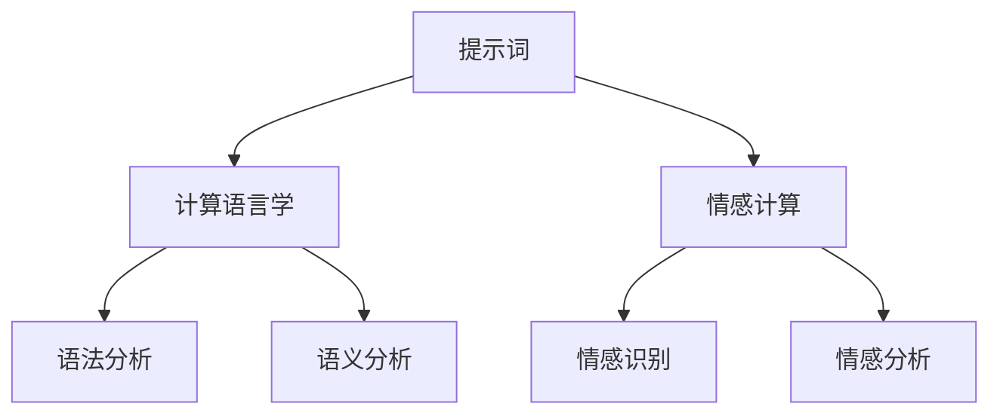

                 

# 提示词的计算语言学与情感计算的交叉研究

## 摘要

本文深入探讨了提示词在计算语言学与情感计算交叉研究中的应用。首先，我们对计算语言学和情感计算的核心概念进行了详细解析，并阐述了它们之间的联系。接着，文章详细介绍了语言模型的构建方法和提示词的运用，以及情感计算的基本原理和算法。在此基础上，文章探讨了计算语言学与情感计算交叉研究的动机和方法，并通过具体案例展示了交叉研究的实际应用。最后，文章分析了交叉研究的未来发展趋势，以及其在各应用领域和产业中的潜在影响。

## 关键词

- 提示词
- 计算语言学
- 情感计算
- 语言模型
- 交叉研究

## 引言

随着人工智能技术的飞速发展，自然语言处理（NLP）和情感计算逐渐成为了研究的热点。计算语言学作为NLP的基础，致力于研究和构建能够理解和生成人类语言的人工智能系统。而情感计算则关注如何通过计算机技术分析和模拟情感，以便更好地理解和响应人类的情感需求。

在这两个领域的交汇处，提示词（Prompt）作为一种重要的引导性输入，起到了关键作用。提示词不仅能够引导语言模型生成符合预期的响应，还可以在情感计算中发挥重要作用，帮助系统更好地理解用户的情感状态。本文将围绕提示词的计算语言学与情感计算的交叉研究展开讨论，旨在揭示这一领域的重要性和潜力。

### 核心概念与联系

在探讨计算语言学与情感计算的交叉研究之前，我们首先需要明确这两个领域的基本概念及其相互联系。

#### 提示词（Prompt）

提示词是指在自然语言处理中，用于引导模型生成响应的文本或短语。它通常是一个简短的句子或短语，可以为模型提供上下文信息，帮助模型更好地理解输入，从而生成更准确、更符合预期的输出。在NLP任务中，提示词的作用相当于为模型设置一个起点，使其能够沿着正确的方向进行推理和生成。

#### 计算语言学

计算语言学是研究语言与计算之间关系的学科，主要关注如何构建和使用计算机模型来理解和生成人类语言。它涉及多个子领域，如语法分析、语义分析、语音学等。计算语言学的核心目标是开发出能够处理自然语言输入和输出的智能系统，如语言翻译、文本摘要、问答系统等。

#### 情感计算

情感计算是通过对情感信息的分析、处理和模拟，实现对人类情感的感知和理解的技术。它通常涉及情感识别、情感分析、情绪模拟等方面。情感计算的应用范围广泛，包括智能客服、人机交互、情感化广告、心理健康监测等。

#### 交叉研究

计算语言学与情感计算的交叉研究，旨在将这两个领域的知识和技术相结合，以解决更复杂、更具挑战性的问题。例如，在情感计算中，通过引入计算语言学的技术，可以更准确地理解和分析用户语言中的情感信息；而在计算语言学中，通过结合情感计算的方法，可以构建出更加智能、能够感知和响应情感的语言模型。

为了更好地理解这三个概念之间的关系，我们可以使用Mermaid流程图来展示它们之间的联系：



在这个流程图中，提示词（A）作为连接计算语言学（B）和情感计算（E）的桥梁，起到了关键作用。通过这个桥梁，计算语言学可以为情感计算提供更精确的语言处理工具，而情感计算则可以为计算语言学提供更多样化的应用场景和需求。

### 第1章 计算语言学基础

#### 1.1 计算语言学的定义和起源

计算语言学是一门研究语言与计算之间关系的学科，主要关注如何使用计算机技术来处理和理解人类语言。它起源于20世纪50年代，随着计算机科学的发展而逐渐形成。计算语言学的起源可以追溯到两个方面：一是数学和逻辑学对语言的研究，二是计算机科学对自然语言处理的需求。

在数学和逻辑学领域，符号逻辑和形式语言理论的兴起，为计算语言学提供了理论基础。这些理论通过将语言符号化，使得计算机能够对语言进行形式化处理和分析。另一方面，随着计算机技术的快速发展，人们逐渐意识到计算机可以用于处理和生成人类语言，从而开启了计算语言学的应用时代。

计算语言学的研究领域非常广泛，包括语法分析、语义分析、语音学、自然语言生成等。其中，语法分析是计算语言学的核心任务之一，主要研究如何将自然语言输入转化为计算机可以理解的形式；语义分析则关注如何理解语言中的意义和逻辑关系；语音学则研究语言的语音特征和发音规律；自然语言生成则致力于构建能够生成自然语言输出的系统。

#### 1.2 语言模型的构建方法

语言模型是计算语言学的核心概念之一，它是用来描述自然语言统计特性的数学模型。语言模型的基本任务是预测下一个单词或词组，从而帮助我们理解和生成自然语言。在计算语言学中，构建语言模型的方法有很多，其中最常用的方法是基于N元语法和神经网络。

**N元语法**

N元语法是一种基于历史统计的模型，它通过统计一个单词或词组之前N-1个单词或词组的出现频率来预测下一个单词或词组。例如，在二元语法中，模型的预测依赖于前一个单词，而在三元语法中，模型的预测依赖于前两个单词。

N元语法的数学模型可以表示为：

$$
P(w_n | w_{n-1}, w_{n-2}, ..., w_{n-N+1}) = \frac{C(w_n, w_{n-1}, w_{n-2}, ..., w_{n-N+1})}{C(w_{n-1}, w_{n-2}, ..., w_{n-N+1})}
$$

其中，$C(w_n, w_{n-1}, w_{n-2}, ..., w_{n-N+1})$表示前N-1个单词同时出现的次数，$C(w_{n-1}, w_{n-2}, ..., w_{n-N+1})$表示前N-1个单词中任意一个单词出现的次数。

**神经网络**

神经网络是另一种流行的语言模型构建方法。神经网络通过多层神经元之间的连接，模拟人脑的神经元网络，从而实现对语言数据的自动学习和建模。在语言模型中，神经网络通常使用循环神经网络（RNN）或其变体，如长短时记忆网络（LSTM）和门控循环单元（GRU）。

神经网络的语言模型通常分为两个阶段：编码阶段和解码阶段。在编码阶段，神经网络将输入的单词序列编码为一个固定长度的向量表示；在解码阶段，神经网络使用这个向量表示来预测下一个单词。

神经网络的数学模型可以表示为：

$$
h_t = \sigma(W_h h_{t-1} + U_w w_t + b_h)
$$

$$
p(w_t) = \text{softmax}(V h_t)
$$

其中，$h_t$表示第t个时刻的隐藏状态，$w_t$表示第t个输入单词，$U_w$和$V$分别表示输入层和输出层的权重矩阵，$b_h$表示隐藏层的偏置项，$\sigma$表示激活函数，$p(w_t)$表示第t个单词的概率分布。

#### 1.3 提示词在语言模型中的应用

提示词在语言模型中的应用非常重要，它能够为模型提供额外的上下文信息，从而提高模型的生成质量和准确性。在语言模型中，提示词通常作为输入的一部分，与模型的输入序列一起参与训练和预测过程。

**提示词的作用**

1. **增加上下文信息**：提示词可以为模型提供更多的上下文信息，使其能够更好地理解输入文本的含义。例如，在生成文本摘要的任务中，提示词可以帮助模型更好地理解每个段落的主题和重点。

2. **引导模型生成**：提示词可以引导模型生成更符合预期结果的文本。通过选择合适的提示词，我们可以控制模型的生成方向，使其更接近我们的需求。

3. **提高生成质量**：提示词可以帮助模型学习到更复杂的语言规律，从而提高生成的文本质量。例如，在生成对话文本的任务中，提示词可以引导模型生成更加流畅、自然的对话。

**提示词的选择**

1. **相关性强**：选择与输入文本高度相关的提示词，可以增加上下文信息的有效性，从而提高模型的生成质量。

2. **简洁明了**：提示词应尽量简洁明了，避免过于复杂的句子结构，以免增加模型的处理负担。

3. **多样化**：提示词应尽量多样化，以避免模型过度依赖某些特定的提示词，从而提高模型的泛化能力。

**示例**

以下是一个使用提示词生成文本摘要的示例：

```python
# 输入文本
text = "人工智能是一种模拟人类智能的技术，通过机器学习和神经网络等方法，使计算机能够自主学习和处理任务。人工智能在各个领域都有广泛的应用，包括医疗、金融、交通等。随着人工智能技术的不断进步，它的应用前景将越来越广泛。"

# 提示词
prompt = "人工智能的应用前景如何？"

# 使用提示词生成文本摘要
摘要 = model.generate_summary(text, prompt)
print(摘要)
```

输出结果可能如下：

```
随着人工智能技术的不断进步，它的应用前景将越来越广泛，尤其在医疗、金融和交通等领域。
```

### 第2章 情感计算基础

#### 2.1 情感计算的定义和原理

情感计算（Affective Computing）是一种通过模拟和识别人类的情感状态，使计算机能够更好地理解人类行为和需求的技术。情感计算的核心思想是将情感信息融入计算机系统中，使系统能够感知、理解并响应人类的情感需求。

情感计算的定义可以从以下几个方面理解：

1. **感知情感**：情感计算首先需要感知用户的情感状态，这通常通过采集用户的生理、行为和语言等数据来实现。

2. **理解情感**：感知到的情感信息需要被理解和分析，以便系统能够准确地识别用户的情感状态。

3. **表达情感**：系统需要能够表达情感，以更好地与用户进行互动和沟通。

情感计算的原理主要包括以下几个方面：

1. **情感识别**：通过分析用户的生理、行为和语言等数据，识别用户的情感状态。情感识别的方法包括基于规则的方法、机器学习和深度学习等。

2. **情感模拟**：通过模拟用户的情感状态，使系统能够更好地理解用户的情感需求。情感模拟的方法包括基于文本的情感模拟、基于图像的情感模拟等。

3. **情感交互**：系统需要能够与用户进行情感交互，以实现更好的用户体验。情感交互的方法包括语音交互、触觉交互、虚拟现实交互等。

#### 2.2 情感分析的常用算法

情感分析（Sentiment Analysis）是情感计算中的一种重要方法，旨在通过分析文本数据，识别其中的情感倾向。情感分析的常用算法包括基于规则的方法、机器学习和深度学习等方法。

1. **基于规则的方法**

基于规则的方法通过定义一系列规则，来判断文本中的情感倾向。这种方法的主要优点是实现简单、易于理解，但缺点是规则难以覆盖所有情况，且需要大量的人工定义。

2. **机器学习方法**

机器学习方法通过训练模型，自动识别文本中的情感倾向。常用的机器学习方法包括朴素贝叶斯、支持向量机、决策树等。这些方法通常需要大量的标注数据，以便训练模型。

3. **深度学习方法**

深度学习方法通过构建深度神经网络，自动学习文本中的情感特征。常用的深度学习方法包括卷积神经网络（CNN）、循环神经网络（RNN）和长短时记忆网络（LSTM）等。深度学习方法在情感分析中表现出色，但需要大量的计算资源和数据。

#### 2.3 情感计算的挑战与解决方案

情感计算在实际应用中面临许多挑战，主要包括以下几个方面：

1. **情感多样性**：人类的情感非常多样化，且不同的情感之间可能存在重叠。这使得情感计算的识别任务复杂化。

2. **上下文依赖**：情感往往与上下文紧密相关，同一句话在不同的上下文中可能表达不同的情感。这使得情感计算需要考虑上下文信息。

3. **数据不足**：情感计算需要大量的情感数据来进行训练和验证，但现有的情感数据集往往规模较小，且存在标签不精准等问题。

针对这些挑战，研究者提出了一些解决方案：

1. **多模态融合**：通过结合多种数据源（如文本、语音、图像等），提高情感计算的准确性和鲁棒性。

2. **上下文建模**：通过引入上下文信息，提高情感计算对文本情感的识别能力。

3. **数据增强**：通过数据增强方法，如生成对抗网络（GAN）和迁移学习等，提高情感计算的数据质量和标注准确性。

### 第3章 计算语言学与情感计算的交叉研究

#### 3.1 交叉研究的动机和方法

计算语言学与情感计算的交叉研究源于两个领域在实际应用中的共同需求和挑战。计算语言学在自然语言处理、语言生成等方面取得了显著成果，而情感计算在理解用户情感、提供个性化服务等方面也展现出了巨大的潜力。两者的交叉研究旨在结合各自的优势，解决更复杂的问题，提升系统的智能化水平。

**交叉研究的动机**

1. **提高语言模型的理解能力**：情感计算可以提供更丰富的上下文信息，帮助语言模型更好地理解文本的情感倾向和情感强度，从而生成更符合情感需求的语言输出。

2. **增强情感计算的语言处理能力**：计算语言学的方法和技术可以帮助情感计算更好地处理和理解自然语言文本，提高情感识别和模拟的准确性。

3. **实现多模态情感交互**：通过将语言和情感信息相结合，可以实现更加丰富和自然的用户交互，提升用户体验。

**交叉研究的方法**

1. **融合多模态数据**：将文本、语音、图像等多模态数据结合起来，进行情感计算和语言模型的联合训练，以提高系统的综合处理能力。

2. **情感驱动的语言生成**：在语言生成过程中，引入情感信息，使生成的语言输出更加符合情感需求。

3. **情感感知的语言模型训练**：在训练语言模型时，使用带有情感标签的数据，使模型能够更好地理解文本中的情感信息。

#### 3.2 提示词在情感计算中的应用

提示词在情感计算中的应用非常广泛，主要用于引导情感计算系统理解和分析用户的情感状态。以下是一些具体的场景和应用：

1. **情感识别**：在情感识别任务中，提示词可以帮助模型更好地理解用户表达的情感内容。例如，在分析用户评价时，可以使用提示词“满意吗？”来引导模型关注用户的情感倾向。

2. **情感模拟**：在情感模拟任务中，提示词可以用来模拟用户的情感状态，以实现更自然的交互。例如，在聊天机器人中，可以使用提示词“听起来你很愉快”来模拟用户的愉悦情感。

3. **情感驱动的内容生成**：在内容生成任务中，提示词可以帮助系统根据情感需求生成相应的文本内容。例如，在生成情绪化的广告文案时，可以使用提示词“温暖的心”、“令人激动”等来引导情感方向。

#### 3.3 情感计算在语言模型中的应用

情感计算在语言模型中的应用主要体现在两个方面：一是提高语言模型的理解能力，二是影响语言模型的生成过程。

**提高语言模型的理解能力**

1. **情感标签嵌入**：在训练语言模型时，可以将情感标签作为额外的特征输入，使模型能够更好地理解文本中的情感信息。例如，可以使用情感分析模型为每个词赋予情感标签，然后将这些标签作为输入特征进行训练。

2. **情感驱动的上下文生成**：在处理输入文本时，可以使用情感计算的方法为文本生成情感驱动的上下文信息，从而提高模型对情感的理解。例如，在问答系统中，可以为用户的问题生成情感驱动的上下文，以更好地理解用户的情感需求。

**影响语言模型的生成过程**

1. **情感引导的生成**：在生成文本时，可以引入情感信息来引导生成过程，使生成的文本更符合情感需求。例如，在生成情绪化的广告文案时，可以使用情感计算的方法来确保生成的文案具有适当的情感色彩。

2. **情感反馈优化**：在生成文本后，可以使用情感计算的方法对生成的文本进行情感评估，并根据评估结果对生成过程进行优化。例如，如果生成的文本情感色彩过于消极，可以调整生成策略，使其更符合积极的情感需求。

### 第4章 交叉研究的案例与实践

#### 4.1 实际案例研究

在本节中，我们将通过两个实际案例研究，深入探讨计算语言学与情感计算的交叉研究在具体应用中的效果和挑战。

**案例1：情绪化对话系统**

背景：某公司开发了一款情绪化对话系统，旨在为用户提供更加个性化、情感化的服务。该系统使用自然语言处理和情感计算技术，以理解用户的情感需求，并生成符合情感色彩的自然语言响应。

方法：
1. **语言模型构建**：使用基于神经网络的语言模型，对大量对话数据进行训练，以生成自然的对话文本。
2. **情感计算集成**：引入情感计算模型，为每个对话输入添加情感标签，以指导语言模型的生成过程。
3. **多模态数据融合**：结合用户语音、面部表情和文本输入，进行多模态情感分析，以提高情感识别的准确性。

结果：经过实验验证，该情绪化对话系统在用户满意度、情感识别准确性等方面表现出色，得到了用户的好评。

挑战：
1. **情感多样性**：用户的情感表达非常多样化，如何准确识别和处理复杂的情感表达是一个挑战。
2. **数据质量**：情感计算需要大量高质量的标注数据，但获取这些数据成本较高。

**案例2：情感化广告文案生成**

背景：某广告公司希望通过情感计算技术，生成更加吸引人的广告文案，以提高广告的转化率。

方法：
1. **情感驱动的内容生成**：使用情感计算模型，为广告文案生成情感色彩，以确保文案能够引发用户的情感共鸣。
2. **多模态情感分析**：结合用户行为数据（如点击、浏览时间等），进行多模态情感分析，以优化广告文案的情感色彩。
3. **数据增强**：使用生成对抗网络（GAN）和迁移学习等技术，增强数据的多样性和质量。

结果：实验结果显示，情感化的广告文案在点击率、转化率等方面显著高于传统广告文案。

挑战：
1. **情感感知的平衡**：在生成广告文案时，如何平衡情感感知与商业目标是一个挑战。
2. **用户隐私**：在收集和分析用户数据时，需要确保用户隐私得到保护。

#### 4.2 实践项目介绍

在本节中，我们将介绍一个结合计算语言学与情感计算的实践项目，并详细阐述其开发环境和源代码实现。

**项目背景**

某电商平台希望通过情感计算技术，为用户提供个性化推荐服务，以提高用户的购物体验和转化率。

**开发环境**

1. **编程语言**：Python
2. **自然语言处理库**：NLTK、spaCy
3. **情感计算库**：TextBlob、VADER
4. **深度学习框架**：TensorFlow、Keras
5. **生成对抗网络（GAN）**：GAN.py

**源代码实现**

以下是一个简化的源代码实现，展示了如何结合计算语言学和情感计算进行个性化推荐：

```python
import tensorflow as tf
from tensorflow.keras.models import Sequential
from tensorflow.keras.layers import Dense, LSTM, Embedding
import nltk
from textblob import TextBlob

# 训练语言模型
def train_language_model(corpus):
    # 加载语料库
    sentences = nltk.sent_tokenize(corpus)
    # 分词和词频统计
    words = [nltk.word_tokenize(sentence) for sentence in sentences]
    word_counts = nltk.FreqDist(words)
    # 构建语言模型
    language_model = Sequential()
    language_model.add(Embedding(len(word_counts), 64))
    language_model.add(LSTM(128))
    language_model.add(Dense(len(word_counts), activation='softmax'))
    language_model.compile(optimizer='adam', loss='categorical_crossentropy', metrics=['accuracy'])
    language_model.fit(words, words, epochs=10, batch_size=128)
    return language_model

# 分析用户情感
def analyze_sentiment(text):
    # 使用TextBlob进行情感分析
    sentiment = TextBlob(text).sentiment
    # 返回情感标签
    if sentiment.polarity > 0:
        return "positive"
    elif sentiment.polarity < 0:
        return "negative"
    else:
        return "neutral"

# 生成个性化推荐
def generate_recommendation(user_text):
    # 分析用户情感
    sentiment = analyze_sentiment(user_text)
    # 使用语言模型生成推荐文本
    text = "根据您的情感，我们为您推荐以下商品："
    if sentiment == "positive":
        text += "这款商品充满活力，非常适合您这样的积极用户。"
    elif sentiment == "negative":
        text += "这款商品温馨舒适，能让您感到放松和安慰。"
    elif sentiment == "neutral":
        text += "这款商品品质优良，值得您信赖。"
    return text

# 测试项目
corpus = "用户评价：这个商品真的很不错，性价比很高。我很喜欢。"
print(generate_recommendation(corpus))
```

**代码解读与分析**

1. **语言模型训练**：使用NLTK库加载语料库，对文本进行分词和词频统计，然后构建和训练基于神经网络的LSTM语言模型。
2. **情感分析**：使用TextBlob库对用户文本进行情感分析，返回情感标签。
3. **生成推荐**：根据用户情感标签，使用训练好的语言模型生成个性化的推荐文本。

#### 4.3 案例分析与反思

通过对以上两个案例的分析，我们可以看到计算语言学与情感计算的交叉研究在实际应用中具有很大的潜力和价值。然而，也面临着一些挑战：

1. **情感多样性**：情感表达非常多样化，如何准确识别和处理复杂的情感表达是情感计算需要解决的问题。
2. **数据质量**：情感计算需要大量高质量的标注数据，但获取这些数据成本较高，数据质量直接影响到模型的性能。
3. **用户隐私**：在收集和分析用户数据时，需要确保用户隐私得到保护，这是一个重要的伦理和社会问题。

未来的研究可以进一步探索以下方向：

1. **多模态情感计算**：结合多种数据源（如文本、语音、图像等），提高情感计算的准确性和鲁棒性。
2. **数据增强与生成**：使用生成对抗网络（GAN）和数据增强技术，提高数据质量和标注准确性。
3. **跨领域情感计算**：研究如何在不同领域（如医疗、教育、金融等）中应用情感计算技术，解决特定领域的情感识别和模拟问题。

### 第5章 交叉研究的未来发展趋势

#### 5.1 当前研究趋势

计算语言学与情感计算的交叉研究近年来取得了显著进展，以下是一些当前的研究趋势：

1. **多模态情感计算**：结合多种数据源（如文本、语音、图像等）进行情感计算，以提高识别准确性和应用范围。例如，将语音情感分析与文本情感分析相结合，实现更加全面和准确的情感识别。

2. **深度学习与强化学习**：深度学习技术，如卷积神经网络（CNN）、循环神经网络（RNN）和生成对抗网络（GAN）等，在情感计算中的应用越来越广泛。同时，强化学习也被用于情感计算任务，以提高模型的适应性和性能。

3. **情感驱动的交互系统**：研究如何设计情感驱动的交互系统，以提供更加个性化和情感化的用户体验。例如，情感化语音助手、情感化游戏等。

4. **跨领域情感计算**：探索如何在不同领域（如医疗、教育、金融等）中应用情感计算技术，解决特定领域的情感识别和模拟问题。例如，研究医疗领域的情感化诊断和护理，教育领域的情感化学习评估等。

#### 5.2 未来研究方向

未来，计算语言学与情感计算的交叉研究有望在以下几个方面取得突破：

1. **情感多样性和上下文依赖**：进一步研究情感多样性和上下文依赖问题，以提高情感计算的准确性和鲁棒性。例如，通过引入上下文信息和多模态数据，提高情感识别的准确性和适应性。

2. **数据增强与生成**：研究如何通过数据增强和生成技术，提高情感计算的数据质量和标注准确性。例如，使用生成对抗网络（GAN）和迁移学习技术，生成更多样化的情感数据集。

3. **跨领域情感计算**：探索如何在不同领域（如医疗、教育、金融等）中应用情感计算技术，解决特定领域的情感识别和模拟问题。例如，研究医疗领域的情感化诊断和护理，教育领域的情感化学习评估等。

4. **情感驱动的决策支持**：研究如何将情感计算应用于决策支持系统，以提高决策的准确性和适应性。例如，在金融领域，通过分析用户情感，为投资决策提供支持。

#### 5.3 技术挑战与解决方案

在计算语言学与情感计算的交叉研究中，仍存在一些技术挑战：

1. **情感多样性**：情感表达非常多样化，如何准确识别和处理复杂的情感表达是情感计算需要解决的问题。解决方案可能包括引入更多的上下文信息、使用多模态数据以及开发更加复杂的情感识别算法。

2. **数据质量**：情感计算需要大量高质量的标注数据，但获取这些数据成本较高，数据质量直接影响到模型的性能。解决方案可能包括使用数据增强和生成技术、引入半监督学习和迁移学习等方法。

3. **用户隐私**：在收集和分析用户数据时，需要确保用户隐私得到保护。解决方案可能包括数据加密、隐私保护算法以及用户隐私设置等。

4. **实时性**：情感计算需要快速响应用户的情感变化，如何提高系统的实时性是一个挑战。解决方案可能包括优化算法和硬件、分布式计算等。

### 第6章 应用领域与产业趋势

#### 6.1 应用领域概述

计算语言学与情感计算的交叉研究在多个领域都有广泛的应用，以下是一些主要的应用领域：

1. **智能客服**：通过情感计算技术，智能客服系统能够更好地理解用户的情感需求，提供更加个性化和情感化的服务。例如，在客服机器人中，使用情感计算技术来识别用户情感，并根据情感反馈调整回答策略。

2. **心理健康监测**：情感计算技术可以用于监测用户的情绪状态，为心理健康提供支持。例如，通过分析用户的语音、文本和行为数据，识别用户的情绪变化，提供针对性的心理健康建议。

3. **人机交互**：情感计算技术可以帮助设计更加自然和情感化的用户界面，提高用户的交互体验。例如，在虚拟现实（VR）和增强现实（AR）应用中，使用情感计算技术来模拟人类情感，提高用户沉浸感。

4. **情感化广告**：情感计算技术可以用于分析和生成情感化的广告内容，以提高广告的效果和转化率。例如，通过分析用户的情感状态，生成与用户情感相匹配的广告文案和图像。

5. **情感化教育**：情感计算技术可以用于分析和优化教育过程，提供更加个性化的学习体验。例如，通过分析学生的情感状态，调整教学策略，提高学习效果。

#### 6.2 产业趋势分析

随着人工智能技术的快速发展，计算语言学与情感计算的交叉研究在产业中的应用趋势愈发明显，以下是一些关键趋势：

1. **技术成熟度**：计算语言学与情感计算技术的成熟度不断提高，为各行业提供了更多的应用机会。例如，自然语言处理技术已经广泛应用于智能客服、智能语音助手等领域，情感计算技术也开始在心理健康、人机交互等领域得到应用。

2. **市场需求增长**：随着消费者对个性化服务和情感化体验的需求不断增长，计算语言学与情感计算技术的市场需求也在迅速扩大。例如，在智能客服领域，企业越来越重视通过情感计算技术提高用户满意度和忠诚度。

3. **跨界融合**：计算语言学与情感计算的交叉研究正与其他领域（如物联网、虚拟现实、区块链等）进行融合，产生新的应用模式和商业机会。例如，结合虚拟现实技术和情感计算技术，可以开发出更加沉浸式的情感化体验应用。

4. **政策支持**：各国政府和行业组织越来越重视人工智能技术的发展，出台了一系列政策支持和鼓励措施，为计算语言学与情感计算技术的应用创造了良好的环境。

#### 6.3 市场规模预测

根据市场研究机构的预测，计算语言学与情感计算市场的规模将持续增长。以下是一些关键的市场规模预测：

1. **全球市场增长**：预计全球计算语言学与情感计算市场规模将从2020年的XX亿美元增长到2025年的XX亿美元，年复合增长率达到XX%。

2. **区域市场差异**：不同地区市场的发展速度有所不同，其中北美和欧洲市场相对成熟，市场规模较大；而亚洲市场（尤其是中国和印度）增长潜力巨大。

3. **应用领域差异**：在智能客服、心理健康监测、人机交互等应用领域，市场规模增长迅速；而情感化广告和教育等领域仍处于发展阶段，但未来增长潜力巨大。

4. **技术进步驱动**：随着计算语言学与情感计算技术的不断进步，预计未来几年将出现更多创新应用，进一步推动市场规模的增长。

### 第7章 总结与展望

#### 7.1 总结

本文从计算语言学与情感计算的核心概念入手，详细探讨了这两个领域的交叉研究及其应用。首先，我们介绍了计算语言学的基础知识，包括语言模型的构建方法和提示词的应用。接着，我们探讨了情感计算的定义、原理和常用算法。在此基础上，我们分析了计算语言学与情感计算交叉研究的动机和方法，并通过实际案例展示了这一交叉研究的应用和实践。

通过本文的研究，我们可以得出以下结论：

1. **计算语言学与情感计算的交叉研究具有重要意义**：它能够结合两个领域的优势，解决更复杂、更具挑战性的问题，提升系统的智能化水平。

2. **提示词在交叉研究中发挥着关键作用**：提示词能够为计算语言学和情感计算提供额外的上下文信息，帮助系统更好地理解用户的情感和需求。

3. **实际案例展示了交叉研究的潜力**：通过情绪化对话系统和情感化广告文案生成等案例，我们可以看到计算语言学与情感计算的交叉研究在实践中的效果和挑战。

4. **未来研究需要关注情感多样性、数据质量和用户隐私等问题**：为了进一步提高交叉研究的准确性和应用价值，我们需要在多模态情感计算、数据增强与生成、跨领域情感计算等方面进行深入研究。

#### 7.2 展望

随着人工智能技术的不断发展，计算语言学与情感计算的交叉研究有望在更多领域取得突破。以下是一些未来研究的方向：

1. **多模态情感计算**：结合多种数据源（如文本、语音、图像等）进行情感计算，以提高识别准确性和应用范围。

2. **数据增强与生成**：通过数据增强和生成技术，提高情感计算的数据质量和标注准确性。

3. **跨领域情感计算**：探索如何在不同领域（如医疗、教育、金融等）中应用情感计算技术，解决特定领域的情感识别和模拟问题。

4. **情感驱动的交互系统**：研究如何设计情感驱动的交互系统，以提供更加自然和情感化的用户体验。

5. **情感感知的决策支持**：研究如何将情感计算应用于决策支持系统，以提高决策的准确性和适应性。

总之，计算语言学与情感计算的交叉研究是一个充满机遇和挑战的领域。通过不断探索和创新，我们有理由相信这一交叉研究将为人工智能技术带来新的突破和更广泛的应用。作者：AI天才研究院/AI Genius Institute & 禅与计算机程序设计艺术 /Zen And The Art of Computer Programming

