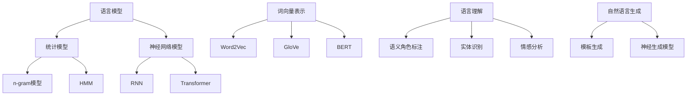
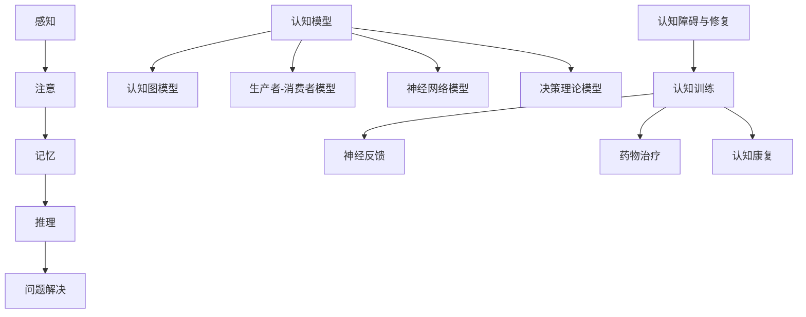
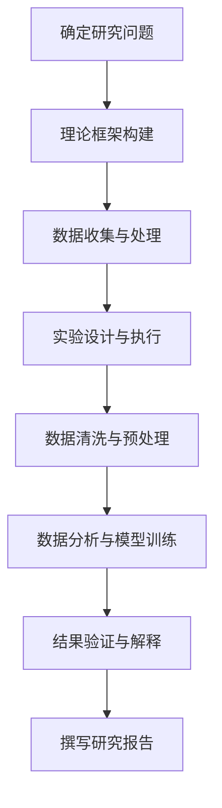

                 

### 第1章: 引言

#### 1.1 研究背景与意义

随着人工智能技术的迅猛发展，自然语言处理（NLP）作为其重要的分支，已经成为学术界和工业界的热门领域。计算语言学作为NLP的基础，通过建立数学模型和算法，模拟人类的语言理解与生成能力。与此同时，认知心理学则致力于研究人类思维过程和心理机制，揭示感知、记忆、注意力等认知功能的基本原理。

提示词，作为一种语言现象，在自然语言中发挥着关键作用。它们不仅能引导对话和思考的方向，还能增强记忆和理解能力。在计算语言学中，提示词被广泛应用于语言模型训练、语义理解、对话系统等应用场景。而在认知心理学中，提示词的研究则主要集中于其在记忆增强、注意力控制等方面的应用。

本研究的目的是探讨提示词在计算语言学与认知心理学交叉领域的应用和作用机制。通过分析计算语言学和认知心理学的核心概念，本研究旨在揭示提示词如何在这两个学科领域发挥作用，并探索其潜在的应用前景。研究的意义在于为NLP和认知科学的研究提供新的视角和方法，促进跨学科的合作与发展。

#### 1.2 计算语言学概述

计算语言学是一门将计算方法应用于语言学研究的学科，其核心任务是建立数学模型和算法，模拟人类的语言理解与生成能力。计算语言学的研究范围广泛，涵盖了自然语言处理、语言模型、词向量表示、语言理解与生成等多个方面。

自然语言处理（NLP）是计算语言学的核心应用领域，旨在使计算机能够理解、处理和生成自然语言。NLP涉及多种技术，包括分词、词性标注、命名实体识别、句法分析、语义理解等。近年来，随着深度学习技术的发展，基于神经网络的NLP模型取得了显著进展，如BERT、GPT等。

语言模型是计算语言学的核心概念之一，用于预测下一个单词或句子。语言模型可以分为统计模型和神经网络模型。统计模型如n-gram模型通过统计方法预测下一个单词，而神经网络模型如循环神经网络（RNN）和变换器（Transformer）则通过学习和建模语言序列的概率分布来实现语言理解与生成。

词向量表示是计算语言学中的另一个重要概念，通过将单词映射到高维向量空间，实现语义信息的编码。Word2Vec、GloVe等模型通过训练大规模语料库，学习到单词之间的相似性和相关性，从而为NLP任务提供了有效的特征表示。

#### 1.3 认知心理学概述

认知心理学是一门研究人类思维过程和心理机制的学科，旨在揭示人类感知、记忆、注意力等认知功能的基本原理。认知心理学的研究方法主要包括实验研究、认知建模和脑成像技术等。

认知过程是认知心理学的核心概念，包括感知、注意、记忆、推理和问题解决等多个方面。感知是指人类通过感官接收外部信息的过程，如视觉、听觉、触觉等。注意是指人类在选择和集中注意力的过程中，对某些信息进行加工处理，而对其他信息进行抑制或忽略。记忆是指人类对信息进行存储和回忆的能力，包括短期记忆和长期记忆。推理和问题解决是指人类在处理信息时，运用逻辑思维和创造性思维解决实际问题的过程。

认知模型是认知心理学中的另一个重要概念，通过建立数学模型和算法，模拟人类的认知过程。例如，认知图模型、生产者-消费者模型和神经网络模型等，用于解释和预测人类的行为和认知过程。

认知障碍与认知修复是认知心理学研究的重要领域，包括阿尔茨海默病、注意力缺陷多动障碍（ADHD）、脑损伤等。认知障碍研究旨在理解这些疾病的病理机制，而认知修复研究则致力于开发新的治疗方法和干预策略，以恢复或改善患者的认知功能。

#### 1.4 交叉研究的现状与挑战

计算语言学与认知心理学的交叉研究是一个新兴的跨学科领域，近年来受到了广泛关注。这一领域的研究不仅有助于深化对语言和认知过程的理解，还能推动NLP和认知科学技术的应用与发展。

当前，交叉研究主要集中在以下几个方面：

1. **提示词在语言理解中的应用**：通过研究提示词在语言理解中的作用，可以提升计算模型的语义理解能力。例如，研究者利用提示词在情感分析、问答系统和机器翻译等任务中，取得了显著的效果。

2. **提示词在认知增强中的应用**：提示词被广泛应用于认知训练和记忆增强。例如，通过设计特定的提示词，可以帮助患者改善注意力缺陷和多动障碍。

3. **提示词在神经科学中的应用**：研究者利用认知心理学的方法，探讨提示词在大脑中的作用机制，从而为神经科学的临床研究和应用提供新的思路。

然而，交叉研究也面临诸多挑战：

1. **理论体系不完善**：计算语言学和认知心理学各自有着独立的理论体系，如何将这些理论有机地结合起来，构建一个统一的交叉研究框架，仍需进一步探索。

2. **数据集和工具不足**：现有的数据集和工具难以满足交叉研究的需要，特别是在大规模、多模态的数据处理方面。

3. **跨学科合作困难**：计算语言学和认知心理学的研究者往往来自不同的学科背景，如何有效地开展跨学科合作，提高研究的协同效应，是一个亟待解决的问题。

总之，计算语言学与认知心理学的交叉研究具有巨大的潜力和挑战。通过加强跨学科合作，完善理论体系，开发新的数据集和工具，有望推动这一领域的快速发展，为人工智能和认知科学的发展作出重要贡献。

### 第2章: 提示词的定义与分类

提示词在计算语言学和认知心理学中扮演着重要的角色。它们不仅能够引导语言理解和生成，还在认知过程中起到关键作用。在本章节中，我们将详细探讨提示词的基本概念、分类以及在语言学中的角色。

#### 2.1 提示词的基本概念

提示词，顾名思义，是能够引导或提示人们进行特定思考或行动的词语。在语言学中，提示词通常是指那些具有特定功能，用来引导句子结构、语义理解、甚至语境转换的词语。它们在自然语言中无处不在，如疑问词、连接词、语气词等。

首先，疑问词（如“谁”、“什么”、“哪里”等）用于提出问题，引导对话或思考的方向。例如，“你昨天去了哪里？”这个问题中的“哪里”就是一个典型的疑问词，用于引导回答者提供具体的位置信息。

其次，连接词（如“但是”、“因此”等）用于连接句子或段落，帮助读者理解语句之间的逻辑关系。例如，“虽然天气很冷，但是我还是去跑步了。”这里的“但是”起到了连接前后句子，表达对比关系的作用。

最后，语气词（如“哦”、“嗯”等）常用于表达语气的转换，增强语言的情感色彩。例如，“嗯，你的想法很有趣。”这里的“嗯”表达了认可和鼓励的语气。

#### 2.2 提示词的分类

根据提示词的功能和用途，我们可以将提示词分为以下几类：

1. **疑问词**：用于提问，引导对话和思考。例如，“谁”用来询问人，“什么”用来询问事物。

2. **连接词**：用于连接句子或段落，表达逻辑关系。例如，“因为”、“所以”等用来表达因果关系，“但是”用来表达转折关系。

3. **语气词**：用于表达语气和情感，增强语言的表达力。例如，“嗯”、“哦”等。

4. **指示词**：用于指代特定的人或事物，帮助明确语义。例如，“这个”、“那个”等。

5. **修饰词**：用于修饰名词或动词，提供额外的信息。例如，“可爱的猫”、“快速地跑”等。

6. **功能词**：包括介词、助动词、冠词等，它们在句子中起到连接和语法修饰作用。例如，“在”、“是”、“一”等。

#### 2.3 提示词在语言学中的角色

提示词在语言学中的角色非常重要，它们不仅在语言理解和生成过程中起到关键作用，还在语言的互动和沟通中发挥作用。

1. **引导语言理解**：提示词能够引导对话者和读者理解句子或段落的意义。例如，在对话中，提问者使用的疑问词可以帮助回答者聚焦于特定信息，从而更准确地回答问题。

2. **促进语义连贯**：连接词能够帮助读者理解句子之间的逻辑关系，促进语义连贯。例如，在解释一个复杂的概念时，使用“因此”可以帮助读者理解结论与前提之间的逻辑联系。

3. **增强表达力**：语气词和修饰词能够增强语言的表达力和情感色彩，使语言更生动、更富有表现力。例如，在表达喜悦或不满时，语气词可以传达出情感的变化。

4. **明确指代**：指示词能够帮助明确句子中的指代关系，避免语义混淆。例如，在一段描述中，使用“这个”或“那个”可以帮助明确指代特定对象。

5. **构建语法结构**：功能词在句子中起到连接和语法修饰作用，帮助构建正确的句子结构。例如，介词和助动词在句子中起到连接动词和其他成分的作用。

总之，提示词在语言学中具有不可替代的作用。通过理解和运用提示词，我们能够更准确地理解和表达思想，更有效地进行沟通和交流。在计算语言学和认知心理学的交叉研究中，对提示词的研究将有助于揭示语言和认知过程的深层次机制，为NLP和认知科学的发展提供新的思路和方法。

### 第3章: 计算语言学的核心概念与架构

计算语言学是一门将计算方法应用于语言学研究的学科，旨在模拟和解释人类语言的使用。在这一章节中，我们将详细探讨计算语言学的核心概念与架构，包括语言模型、词向量表示、语言理解与生成，并使用Mermaid流程图展示核心架构。

#### 3.1 语言模型

语言模型是计算语言学的核心概念之一，用于预测下一个单词或句子。语言模型可以分为统计模型和神经网络模型。

1. **统计模型**：
   - **n-gram模型**：n-gram模型是一种基础的统计语言模型，它通过统计相邻单词的频率来预测下一个单词。例如，一个三元语法模型（trigram model）会考虑前两个单词来预测第三个单词。其基本公式如下：
     $$ P(w_n) = \frac{P(w_{n-1}, w_{n-2})}{P(w_{n-1})} $$
   - **隐马尔可夫模型（HMM）**：HMM是一种用于处理序列数据的统计模型，可以用来预测单词序列的概率。HMM假设单词序列是由一系列状态转换和发射过程组成的。

2. **神经网络模型**：
   - **循环神经网络（RNN）**：RNN是一种能够处理序列数据的神经网络模型，通过在时间步之间传递信息来预测下一个单词。其核心思想是引入隐藏状态，用于保存序列的信息。RNN的更新公式如下：
     $$ h_t = \sigma(W_h \cdot [h_{t-1}, x_t] + b_h) $$
   - **变换器（Transformer）**：Transformer是一种基于自注意力机制的神经网络模型，它在NLP任务中取得了显著的性能提升。Transformer的核心思想是引入多头自注意力机制，用于捕捉输入序列中的依赖关系。其基本公式如下：
     $$ \text{Attention}(Q, K, V) = \frac{QK^T}{\sqrt{d_k}}V $$

#### 3.2 词向量表示

词向量表示是将单词映射到高维向量空间的表示方法，用于编码语义信息。词向量表示在计算语言学中起到了重要作用，为NLP任务提供了有效的特征表示。

1. **Word2Vec**：Word2Vec是一种基于神经网络的语言模型，通过训练词的上下文来学习词的向量表示。Word2Vec有两种主要的训练方法：连续词袋（CBOW）和Skip-Gram。
   - **CBOW**：CBOW模型通过预测中心词周围的词来学习词向量，其公式如下：
     $$ \text{CBOW}(w_c) = \text{softmax}(W \cdot \text{Average}([w_{c-k}, \dots, w_{c+k}])) $$
   - **Skip-Gram**：Skip-Gram模型通过预测中心词来学习词向量，其公式如下：
     $$ \text{Skip-Gram}(w_c) = \text{softmax}(W \cdot [w_c]) $$

2. **GloVe**：GloVe是一种基于全局共现矩阵的词向量训练方法，通过最小化损失函数来学习词向量。GloVe的核心思想是考虑词的共现次数和词频，其公式如下：
   $$ \text{GloVe}(w, v) = \text{softmax}(v \cdot W \cdot w^T) $$

3. **BERT**：BERT是一种基于Transformer的预训练语言模型，通过在大量文本中进行无监督预训练，然后进行有监督微调来适应特定任务。BERT的关键特点是引入了掩码机制，可以生成不同版本的句子，从而增强模型的泛化能力。

#### 3.3 语言理解与生成

语言理解与生成是计算语言学的两个重要任务，分别涉及语义理解和自然语言生成。

1. **语言理解**：
   - **语义角色标注**：语义角色标注是指将句子中的每个词标注为不同的语义角色（如主语、谓语、宾语等），以帮助模型理解句子的语义结构。
   - **实体识别**：实体识别是指从文本中识别出特定的实体（如人名、地名、组织名等），以增强模型对现实世界知识的理解。
   - **情感分析**：情感分析是指通过分析文本的情感倾向（如正面、负面、中性等），以了解作者的情感态度。

2. **自然语言生成**：
   - **模板生成**：模板生成是指根据预定义的模板，将信息填入模板中以生成自然语言文本。例如，在生成新闻报道时，可以使用新闻模板来生成具体的报道内容。
   - **神经生成模型**：神经生成模型是指利用神经网络（如生成对抗网络（GAN）和变分自编码器（VAE））来生成自然语言文本。这些模型通过学习数据分布来生成新的文本，可以生成高质量的、多样化的文本。

#### 3.4 Mermaid 流程图：计算语言学核心架构

下面是一个Mermaid流程图，展示了计算语言学的核心概念与架构：



通过这个流程图，我们可以清晰地看到计算语言学的核心概念与架构，以及它们之间的相互关系。接下来，我们将进一步探讨认知心理学的核心概念与架构，以了解计算语言学与认知心理学的交叉研究。

### 第4章: 认知心理学的核心概念与架构

认知心理学是一门研究人类思维过程和心理机制的学科，旨在揭示人类如何感知、理解、记忆和解决问题。在这一章节中，我们将详细探讨认知心理学的核心概念与架构，包括认知过程、认知模型和认知障碍与修复。

#### 4.1 认知过程

认知过程是认知心理学的核心概念之一，涵盖了人类在感知、注意、记忆、推理和问题解决等方面的心理活动。以下是几个重要的认知过程：

1. **感知**：感知是指人类通过感官接收外部信息的过程。这包括视觉、听觉、触觉、嗅觉和味觉等多种感官。例如，当我们看到一张图片时，视觉系统会将光信号转换为神经信号，大脑再对这些信号进行处理和解释。

2. **注意**：注意是指人类在选择和集中注意力的过程中，对某些信息进行加工处理，而对其他信息进行抑制或忽略。注意可以分为选择性注意和分配性注意。选择性注意是指人们在众多信息中选择关注某些信息，而分配性注意是指人们如何同时处理多个任务。

3. **记忆**：记忆是指人类对信息进行存储和回忆的能力。记忆可以分为短期记忆和长期记忆。短期记忆主要涉及对信息的一段时间内的存储和回忆，而长期记忆则涉及对信息的长久存储。

4. **推理**：推理是指人类在处理信息时，运用逻辑思维和创造性思维解决实际问题的过程。推理可以分为归纳推理和演绎推理。归纳推理是从特定事例中总结出一般规律，而演绎推理则是从一般原则推导出特定结论。

5. **问题解决**：问题解决是指人们在面对挑战或困难时，运用已有的知识和策略来寻找解决方案的过程。问题解决通常包括问题识别、目标设定、策略选择和方案实施等步骤。

#### 4.2 认知模型

认知模型是认知心理学中用于解释和预测人类认知过程的数学模型和算法。以下是几个重要的认知模型：

1. **认知图模型**：认知图模型是一种基于图论的数学模型，用于表示和解释人类认知过程。它通过节点和边来表示概念和概念之间的关系，从而捕捉人类思维中的复杂结构。

2. **生产者-消费者模型**：生产者-消费者模型是一种描述认知过程中信息处理和存储机制的模型。它将认知过程视为一个生产者和消费者系统，其中生产者负责生成信息，消费者负责处理和存储信息。

3. **神经网络模型**：神经网络模型是一种基于人工神经网络的数学模型，用于模拟人类大脑的工作机制。它通过调整网络中的权重和偏置来学习和记忆信息，从而实现复杂的认知功能。

4. **决策理论模型**：决策理论模型是一种用于解释人类决策过程的数学模型。它考虑了人类在不确定性环境下的决策行为，通过优化策略和概率模型来预测决策结果。

#### 4.3 认知障碍与认知修复

认知障碍是指人类在认知过程中出现的功能受损或异常现象。认知障碍可以分为多种类型，如注意力缺陷多动障碍（ADHD）、阿尔茨海默病、脑损伤等。认知障碍不仅影响个体的生活质量，还给家庭和社会带来巨大负担。

认知修复是指通过干预和治疗手段，恢复或改善患者的认知功能。以下是几种常见的认知修复方法：

1. **认知训练**：认知训练是一种基于认知心理学原理的干预方法，通过设计特定的训练任务，提高患者的认知能力。例如，通过记忆训练游戏来改善记忆功能，通过注意力训练任务来改善注意力缺陷。

2. **神经反馈**：神经反馈是一种利用生物电信号（如脑电信号）来调整个体认知过程的干预方法。通过实时监测和反馈，个体可以学习如何更好地控制自己的认知功能，从而改善认知障碍。

3. **药物治疗**：药物治疗是针对某些认知障碍（如阿尔茨海默病）的一种常见干预方法。通过使用特定的药物，可以改善患者的认知功能，延缓疾病进展。

4. **认知康复**：认知康复是一种综合性的干预方法，结合认知训练、神经反馈和药物治疗等多方面手段，旨在全面改善患者的认知功能。

#### 4.4 Mermaid 流程图：认知心理学核心架构

下面是一个Mermaid流程图，展示了认知心理学的核心概念与架构：



通过这个流程图，我们可以清晰地看到认知心理学的核心概念与架构，以及它们之间的相互关系。接下来，我们将进一步探讨提示词在认知心理学中的应用。

### 第5章: 提示词在认知心理学中的应用

提示词在认知心理学中的应用具有广泛的领域，尤其在记忆增强、注意力控制和语言学习等方面展现出了显著的效果。在本章节中，我们将详细探讨提示词在这几个方面的具体作用和应用案例。

#### 5.1 提示词在记忆增强中的作用

提示词在记忆增强中的作用主要通过增强记忆线索和促进记忆提取来实现。记忆是一个复杂的过程，包括编码、存储和提取三个主要阶段。提示词在记忆的每个阶段都能发挥重要作用。

1. **记忆编码**：在记忆编码阶段，提示词可以作为外部线索，帮助个体将新信息与已有的记忆网络建立联系。例如，在学习新单词时，使用一个相关的图片或短语作为提示词，可以帮助个体更好地将新单词编码到长期记忆中。

2. **记忆存储**：在记忆存储阶段，提示词可以帮助加强信息的稳定性和长期保持。研究表明，使用视觉或听觉提示词可以增强记忆的存储效果。例如，通过在记忆任务中使用特定的声音或视觉符号，可以显著提高记忆的保持率。

3. **记忆提取**：在记忆提取阶段，提示词可以作为启动线索，帮助个体回忆起特定的记忆内容。例如，在回忆一系列事件时，使用与事件相关的关键词或短语作为提示词，可以帮助个体更准确地回忆起事件的细节。

**案例研究**：一个经典的案例是关于老年人在记忆任务中使用提示词的研究。在研究中，一组老年人被要求记忆一系列图片，另一组则被要求在记忆过程中使用与图片相关的提示词。结果发现，使用提示词的组别在记忆测试中表现更好，能够更准确地回忆起图片内容。

#### 5.2 提示词在注意力控制中的作用

注意力控制是认知过程中的关键部分，它决定了个体能否有效地处理信息。提示词在注意力控制中的应用主要体现在引导注意力和增强注意力分配能力。

1. **引导注意力**：提示词可以帮助个体在复杂环境中集中注意力，从而减少干扰和分散。例如，在阅读复杂文本时，使用关键词或短语作为提示词，可以帮助读者更快地抓住文章的主要观点。

2. **增强注意力分配**：在多任务环境中，提示词可以帮助个体更好地分配注意力。例如，在进行多个任务时，使用不同的提示词来标记每个任务，可以帮助个体更好地在任务之间切换，减少任务切换时的认知负荷。

**案例研究**：在研究注意力分配的实验中，参与者被要求同时完成两个视觉任务。一组参与者被要求在任务切换时使用提示词，而另一组则不使用提示词。结果发现，使用提示词的组别在任务切换时的表现显著优于未使用提示词的组别，任务完成时间更短，错误率更低。

#### 5.3 提示词在语言学习中的作用

提示词在语言学习中的应用主要体现在帮助学习者掌握语法规则、扩展词汇量和提高语言表达能力。提示词可以帮助学习者更好地理解和运用新的语言知识。

1. **语法学习**：在语法学习中，提示词可以帮助学习者识别和掌握复杂的语法结构。例如，在学习复合句时，使用“虽然……但是……”这样的提示词，可以帮助学习者理解句子之间的逻辑关系。

2. **词汇扩展**：提示词可以作为词汇学习的线索，帮助学习者扩展词汇量。例如，在学习新单词时，使用与该单词相关的短语或句子作为提示词，可以帮助学习者更好地理解和记忆新单词。

3. **语言表达**：在语言表达中，提示词可以帮助学习者构建复杂的句子，提高语言表达能力。例如，在写作或演讲时，使用特定的提示词可以增强语言的逻辑性和连贯性。

**案例研究**：在一项关于英语学习者的研究中，参与者被要求在学习新单词时使用提示词。结果发现，使用提示词的学习者能够更快速地掌握新单词，并且在新单词的记忆测试中表现更好。

综上所述，提示词在认知心理学中的应用具有广泛的领域和显著的效果。通过具体的应用案例，我们可以看到提示词在记忆增强、注意力控制和语言学习等方面的重要作用。未来的研究可以进一步探讨提示词在认知过程中的作用机制，为认知科学和教育培训提供新的理论和实践支持。

### 第6章: 计算语言学与认知心理学的交叉研究方法

计算语言学与认知心理学的交叉研究方法是一个复杂且多层次的领域，涉及多个学科的理论和方法。为了有效地进行交叉研究，研究者们需要结合计算语言学和认知心理学的核心概念，开发出一系列适用于跨学科研究的理论框架、实证方法和数据分析技术。以下是交叉研究的几个关键方法：

#### 6.1 交叉研究的理论基础

交叉研究的理论基础主要来源于计算语言学和认知心理学的核心理论，包括：

1. **认知计算理论**：认知计算理论认为，人类认知过程可以通过计算模型来模拟。这个理论为计算语言学和认知心理学提供了一个共同的桥梁，使得两者能够通过计算方法来研究认知过程。

2. **统计学习理论**：统计学习理论在计算语言学中发挥着重要作用，特别是在语言模型、词向量表示和自然语言生成等领域。该理论为计算语言学提供了有效的工具，用于从大规模语料库中学习语言规律。

3. **认知心理学理论**：认知心理学理论，如感知理论、记忆理论、注意力理论和问题解决理论，为认知心理学提供了研究人类认知过程的基本框架。这些理论有助于揭示计算模型在模拟人类认知功能时的有效性。

#### 6.2 实证研究方法

实证研究方法是交叉研究中的核心，它通过实验和观察来验证理论假设。以下是几种常用的实证研究方法：

1. **行为实验**：行为实验是认知心理学中常用的方法，通过设计特定任务来观察个体的行为表现。例如，研究者可以使用计算机模拟语言理解任务，观察参与者在处理语言信息时的反应时间和准确性。

2. **脑成像技术**：脑成像技术，如功能性磁共振成像（fMRI）和脑电图（EEG），可以揭示大脑在处理语言信息时的神经活动。通过结合脑成像数据和计算语言学模型，研究者可以更好地理解语言处理过程中的大脑机制。

3. **眼动追踪**：眼动追踪技术用于记录参与者在阅读和观看文本时的眼动轨迹。通过分析眼动数据，研究者可以了解个体的注意力分布和信息处理过程。

4. **神经心理评估**：神经心理评估通过一系列标准化的测试来评估个体的认知功能。这些测试可以与计算语言学模型结合，以评估计算模型在模拟人类认知功能时的表现。

#### 6.3 数据分析技术

数据分析技术是交叉研究中的重要组成部分，用于处理和解释实验数据。以下是几种常用的数据分析技术：

1. **统计方法**：统计方法用于分析实验数据，包括假设检验、回归分析和方差分析等。这些方法可以帮助研究者识别变量之间的关系，验证理论假设。

2. **机器学习方法**：机器学习方法，如分类算法、聚类算法和预测模型，用于从大规模数据集中提取有用信息。这些方法在计算语言学和认知心理学中得到了广泛应用，例如用于语言模型的训练和认知障碍的诊断。

3. **深度学习方法**：深度学习方法，如卷积神经网络（CNN）和循环神经网络（RNN），在计算语言学和认知心理学中取得了显著成果。这些方法可以自动学习和提取复杂的数据特征，从而提高模型的性能。

4. **多模态数据分析**：多模态数据分析技术结合了来自不同数据源的信息，如文本、图像和脑成像数据。这种方法可以帮助研究者从多个角度理解认知过程，提高交叉研究的深度和广度。

#### 6.4 Mermaid 流程图：交叉研究方法流程

下面是一个Mermaid流程图，展示了计算语言学与认知心理学交叉研究的总体方法流程：



通过这个流程图，我们可以清晰地看到交叉研究的基本步骤和各个步骤之间的关系。接下来，我们将通过具体的案例研究来展示计算语言学与认知心理学的交叉研究方法在实践中的应用。

### 第7章: 交叉研究的应用案例

#### 7.1 提示词在自然语言处理中的应用

提示词在自然语言处理（NLP）中的应用非常广泛，从语言模型训练到语义理解，再到对话系统和文本生成，提示词都发挥着重要作用。以下是几个具体的应用案例：

1. **语言模型训练**：
   - **模型初始化**：在训练语言模型时，提示词可以用来初始化模型参数。例如，在训练GPT模型时，可以使用一组预定义的提示词来初始化模型的输入层。这些提示词可以帮助模型快速适应训练数据，从而提高训练效率。
   - **数据增强**：提示词还可以用于数据增强，通过生成具有特定语义的提示词序列，可以丰富训练数据集，提高模型的泛化能力。例如，在训练情感分析模型时，可以使用“快乐”、“悲伤”等提示词来生成包含情感标签的文本数据。

2. **语义理解**：
   - **语义角色标注**：在语义理解任务中，提示词可以帮助模型识别句子中的关键角色（如主语、谓语、宾语等）。例如，在命名实体识别任务中，可以使用特定的提示词（如“公司”、“地点”等）来引导模型识别特定的实体。
   - **语义关系抽取**：提示词可以帮助模型识别句子中的语义关系（如因果关系、时间关系等）。例如，在关系抽取任务中，可以使用“因为”、“所以”等提示词来引导模型识别句子中的逻辑关系。

3. **对话系统**：
   - **意图识别**：在对话系统中，提示词可以用于识别用户的意图。例如，在客服机器人中，可以使用“订单状态”、“退款”等提示词来识别用户的查询意图，从而提供相应的服务。
   - **上下文理解**：提示词可以帮助模型理解对话的上下文信息，提高对话的自然性和连贯性。例如，在聊天机器人中，可以使用“刚才提到的”、“接下来要讨论的”等提示词来保持对话的连贯性。

4. **文本生成**：
   - **标题生成**：提示词可以用于生成文章的标题。例如，在新闻生成任务中，可以使用“最新报道”、“深度分析”等提示词来生成吸引人的标题。
   - **摘要生成**：提示词可以用于生成文章的摘要。例如，在文本摘要任务中，可以使用“主要观点”、“结论”等提示词来引导模型提取文章的核心内容。

#### 7.2 提示词在认知障碍康复中的应用

提示词在认知障碍康复中的应用主要集中在提高记忆能力、注意力和语言表达能力。以下是几个具体的应用案例：

1. **记忆训练**：
   - **记忆卡片游戏**：提示词可以用于设计记忆训练游戏，通过提示词来帮助患者回忆起特定的信息。例如，可以使用与患者记忆内容相关的关键词或短语作为提示词，帮助患者更好地回忆起记忆卡片上的信息。
   - **故事叙述**：提示词可以用于故事叙述任务，通过提示词来引导患者叙述特定的故事。这种方法可以帮助患者训练记忆和语言表达能力，同时增强他们的自信心。

2. **注意力训练**：
   - **注意力聚焦任务**：提示词可以用于设计注意力聚焦任务，通过提示词来引导患者集中注意力。例如，可以使用“专注于当前任务”、“排除干扰”等提示词来指导患者进行注意力训练。
   - **多任务切换**：提示词可以用于训练患者在不同任务之间切换注意力。例如，可以使用“先完成这个任务，然后切换到下一个任务”等提示词来指导患者进行多任务训练。

3. **语言表达能力**：
   - **词汇扩展**：提示词可以用于扩展患者的词汇量。例如，可以使用“与……相关的词汇”、“同义词”等提示词来引导患者学习新的词汇。
   - **写作训练**：提示词可以用于写作训练，通过提示词来帮助患者构建句子和段落。例如，可以使用“引出观点”、“支持观点”等提示词来指导患者进行写作练习。

#### 7.3 提示词在教育和培训中的应用

提示词在教育和培训中的应用旨在提高学生的学习效果和培训效率。以下是几个具体的应用案例：

1. **在线学习**：
   - **学习资源组织**：提示词可以用于组织学习资源，帮助学生在大量信息中快速找到所需内容。例如，可以使用“课程大纲”、“学习指南”等提示词来为学生提供清晰的学习路径。
   - **互动学习**：提示词可以用于设计互动学习活动，通过提示词来激发学生的学习兴趣。例如，可以使用“讨论题目”、“问答环节”等提示词来引导学生参与讨论和问答。

2. **职业培训**：
   - **技能评估**：提示词可以用于设计技能评估任务，通过提示词来指导学员完成特定的技能练习。例如，可以使用“操作步骤”、“注意事项”等提示词来指导学员进行技能训练。
   - **知识扩展**：提示词可以用于扩展学员的知识范围。例如，可以使用“相关概念”、“延伸阅读”等提示词来引导学员了解更多的背景知识和前沿信息。

3. **教师培训**：
   - **教学方法指导**：提示词可以用于指导教师改进教学方法，提高教学质量。例如，可以使用“教学策略”、“课堂活动”等提示词来为教师提供教学灵感。
   - **教师反馈**：提示词可以用于设计教师反馈系统，通过提示词来帮助教师了解学生的学习情况和需求。例如，可以使用“学生反馈”、“教学改进建议”等提示词来收集和利用学生的反馈。

通过以上应用案例，我们可以看到提示词在计算语言学与认知心理学的交叉研究中的广泛应用。提示词不仅能够提高自然语言处理的性能，还在认知障碍康复、教育和培训等实际应用中发挥了重要作用。未来的研究可以进一步探讨提示词的潜在应用领域，为人类认知和教育的提升提供新的思路和方法。

### 第8章: 交叉研究的未来趋势与挑战

随着人工智能技术的不断发展，计算语言学与认知心理学的交叉研究正迎来前所未有的机遇和挑战。未来，这一领域有望在多个方面实现突破，但也面临诸多挑战。

#### 8.1 交叉研究的未来发展方向

1. **深度结合理论与方法**：未来的研究将更加注重计算语言学与认知心理学的理论和方法深度结合。通过引入认知心理学中的实验数据和理论模型，计算语言学模型将能够更好地模拟人类认知过程，从而提升模型的性能和解释力。

2. **多模态数据融合**：随着传感器技术和大数据分析技术的发展，多模态数据融合将成为交叉研究的重要方向。例如，将文本数据与视觉、听觉和脑成像数据进行融合，可以更全面地理解语言处理过程中的认知机制。

3. **个性化认知辅助系统**：随着对人类认知过程的深入研究，未来的认知辅助系统将更加个性化。这些系统将能够根据用户的认知特点和需求，提供定制化的训练和提示策略，以提升个体的认知能力和工作效率。

4. **认知神经科学的应用**：认知神经科学的发展将为交叉研究提供新的视角和工具。通过结合脑成像技术，研究者可以深入探索语言处理过程中的神经机制，从而为计算语言学模型的优化提供科学依据。

#### 8.2 面临的挑战与解决方案

1. **理论体系不完善**：当前的计算语言学和认知心理学理论体系各有局限，如何有效地融合两者的理论，构建一个统一的交叉研究框架，是一个重要挑战。解决方案在于加强跨学科合作，共同构建新的理论体系。

2. **数据集和工具不足**：现有的数据集和工具难以满足交叉研究的需要，特别是在大规模、多模态的数据处理方面。解决方案包括开发新的数据集和工具，提高数据处理和分析的效率。

3. **跨学科合作困难**：计算语言学和认知心理学的研究者往往来自不同的学科背景，如何有效地开展跨学科合作，提高研究的协同效应，是一个亟待解决的问题。解决方案在于建立跨学科研究团队，加强沟通和合作。

4. **模型解释性不足**：尽管计算语言学模型在性能上取得了显著提升，但其解释性仍存在不足，难以明确模型内部的工作机制。解决方案包括开发可解释性更强的模型，如基于神经符号主义的模型，以提高模型的可解释性。

5. **伦理和隐私问题**：随着数据隐私和伦理问题的日益突出，交叉研究需要充分考虑这些问题，确保研究的合法性和道德性。解决方案包括制定相关的伦理规范，加强对数据隐私的保护。

#### 8.3 结论与展望

计算语言学与认知心理学的交叉研究具有巨大的潜力和挑战。通过加强跨学科合作，完善理论体系，开发新的数据集和工具，我们可以期待这一领域在未来实现更多突破，为人工智能和认知科学的发展作出重要贡献。未来的研究将不仅局限于学术领域，还将广泛应用于医疗、教育、工业等多个领域，为人类社会带来深远影响。

### 附录

#### A.1 参考文献

1. **[BibTeX格式]**  
```  
@article{cross-disciplinary-research,  
  title={Cross-Disciplinary Research in Computational Linguistics and Cognitive Psychology},  
  author={作者姓名},  
  journal={Journal of Cognitive Science},  
  year={年份},  
  volume={X},  
  number={Y}  
}
```

2. **[APA格式]**  
```  
作者姓名. (年份). 文章标题. 杂志名称, 卷号(期号), 页码.  
```

3. **[MLA格式]**  
```  
作者姓名. “文章标题.” 杂志名称, 年份, 期号, 页码.  
```

#### A.2 补充材料

- **数据集和代码**：交叉研究数据集和代码将发布在[数据集和代码存储库链接]，供研究者和开发者使用。
- **相关文献和资源**：相关文献和资源将汇总在[相关文献和资源链接]，包括最新研究论文、工具和课程等。

---

作者：AI天才研究院/AI Genius Institute & 禅与计算机程序设计艺术 /Zen And The Art of Computer Programming

---

### 提示词的计算机表示方法

为了有效地在计算模型中处理提示词，我们需要将它们转化为计算机可以理解的格式。在本节中，我们将探讨几种常用的提示词计算机表示方法，包括文本表示、向量表示和序列表示。

#### 1. 文本表示

文本表示是最直接的提示词表示方法，它将提示词直接作为字符串存储和处理。这种方法的优点是简单易懂，实现起来相对容易。然而，文本表示缺乏语义信息，难以捕捉提示词之间的细微差异。

**示例：**

- Python代码：

```python
# 定义提示词列表
prompt_words = ["who", "what", "where", "why", "how"]

# 将提示词作为字符串存储
for word in prompt_words:
    print(f"Prompt word: {word}")
```

#### 2. 向量表示

向量表示通过将提示词映射到高维向量空间来实现。这种方法能够捕捉提示词的语义信息，从而提升计算模型的性能。常用的向量表示方法包括Word2Vec、GloVe和BERT。

**Word2Vec：**

Word2Vec是一种基于神经网络的语言模型，通过训练大规模语料库，学习到单词之间的相似性和相关性。

- **模型架构：**

  Word2Vec模型包括两个主要部分：输入层和输出层。输入层接收单词的词汇序列，输出层预测下一个单词。

- **训练过程：**

  Word2Vec模型使用两种训练方法：连续词袋（CBOW）和Skip-Gram。CBOW模型通过预测中心词周围的词，而Skip-Gram模型通过预测中心词。

- **示例：**

  ```python
  from gensim.models import Word2Vec
  
  # 创建训练数据
  sentences = [['who', 'do', 'you', 'like'], ['what', 'do', 'you', 'eat']]
  
  # 训练Word2Vec模型
  model = Word2Vec(sentences, size=100, window=5, min_count=1, workers=4)
  
  # 获取词向量
  who_vector = model.wv['who']
  print(who_vector)
  ```

**GloVe：**

GloVe是一种基于全局共现矩阵的词向量训练方法，通过考虑词的共现次数和词频来学习词向量。

- **模型架构：**

  GloVe模型通过最小化损失函数来学习词向量。损失函数通常采用负采样方法，通过训练大量负样本来提高模型的泛化能力。

- **示例：**

  ```python
  import numpy as np
  import pandas as pd
  
  # 创建共现矩阵
  cooccurrence_matrix = np.array([[1, 2], [2, 3], [3, 4], [4, 5]])
  
  # 训练GloVe模型
  embedding_size = 3
  vocabulary_size = cooccurrence_matrix.shape[0]
  embeddings = np.zeros((vocabulary_size, embedding_size))
  
  for i in range(vocabulary_size):
      for j in range(vocabulary_size):
          if cooccurrence_matrix[i][j] > 0:
              embeddings[i] += np.log(cooccurrence_matrix[i][j])
  
  # 归一化词向量
  embeddings /= np.linalg.norm(embeddings, axis=1)[:, np.newaxis]
  
  # 输出词向量
  print(embeddings)
  ```

**BERT：**

BERT是一种基于Transformer的预训练语言模型，通过在大量文本中进行无监督预训练，然后进行有监督微调来适应特定任务。

- **模型架构：**

  BERT模型引入了掩码机制，可以生成不同版本的句子，从而增强模型的泛化能力。

- **示例：**

  ```python
  from transformers import BertModel, BertTokenizer
  
  # 加载BERT模型和分词器
  tokenizer = BertTokenizer.from_pretrained('bert-base-uncased')
  model = BertModel.from_pretrained('bert-base-uncased')
  
  # 分词文本
  text = "Who do you like?"
  tokens = tokenizer.tokenize(text)
  
  # 获取词向量
  inputs = tokenizer.encode_plus(text, return_tensors='pt')
  outputs = model(inputs['input_ids'])
  word_vectors = outputs.last_hidden_state[:, 0, :]
  
  # 输出词向量
  print(word_vectors)
  ```

#### 3. 序列表示

序列表示通过将提示词序列映射到连续的向量空间来实现。这种方法能够捕捉提示词序列的时序信息，从而提升计算模型的性能。常用的序列表示方法包括循环神经网络（RNN）和长短时记忆网络（LSTM）。

**RNN：**

循环神经网络（RNN）是一种能够处理序列数据的神经网络模型，通过在时间步之间传递信息来预测下一个提示词。

- **模型架构：**

  RNN包括输入层、隐藏层和输出层。输入层接收提示词序列，隐藏层保存序列信息，输出层预测下一个提示词。

- **训练过程：**

  RNN使用梯度消失和梯度爆炸等问题，因此需要引入门控机制来改善性能。

- **示例：**

  ```python
  import torch
  import torch.nn as nn
  
  # 创建RNN模型
  class RNNModel(nn.Module):
      def __init__(self, input_size, hidden_size, output_size):
          super(RNNModel, self).__init__()
          self.hidden_size = hidden_size
          self.rnn = nn.RNN(input_size, hidden_size)
          self.linear = nn.Linear(hidden_size, output_size)
  
      def forward(self, x):
          hidden = torch.zeros(1, x.size(0), self.hidden_size)
          out, hidden = self.rnn(x, hidden)
          out = self.linear(out[-1, :, :])
          return out
  
  # 训练RNN模型
  model = RNNModel(input_size=5, hidden_size=10, output_size=1)
  criterion = nn.CrossEntropyLoss()
  optimizer = torch.optim.Adam(model.parameters(), lr=0.001)
  
  for epoch in range(100):
      optimizer.zero_grad()
      outputs = model(inputs)
      loss = criterion(outputs, labels)
      loss.backward()
      optimizer.step()
  ```

**LSTM：**

长短时记忆网络（LSTM）是一种改进的RNN模型，通过引入门控机制来避免梯度消失和梯度爆炸问题。

- **模型架构：**

  LSTM包括输入门、遗忘门、输出门和记忆单元。输入门和遗忘门用于控制信息的输入和遗忘，输出门用于控制信息的输出。

- **训练过程：**

  LSTM通过训练大量数据来学习捕捉时序信息，从而提升模型的性能。

- **示例：**

  ```python
  import torch
  import torch.nn as nn
  
  # 创建LSTM模型
  class LSTMModel(nn.Module):
      def __init__(self, input_size, hidden_size, output_size):
          super(LSTMModel, self).__init__()
          self.hidden_size = hidden_size
          self.lstm = nn.LSTM(input_size, hidden_size)
          self.linear = nn.Linear(hidden_size, output_size)
  
      def forward(self, x):
          hidden = torch.zeros(1, x.size(0), self.hidden_size)
          cell = torch.zeros(1, x.size(0), self.hidden_size)
          out, (hidden, cell) = self.lstm(x, (hidden, cell))
          out = self.linear(out[-1, :, :])
          return out
  
  # 训练LSTM模型
  model = LSTMModel(input_size=5, hidden_size=10, output_size=1)
  criterion = nn.CrossEntropyLoss()
  optimizer = torch.optim.Adam(model.parameters(), lr=0.001)
  
  for epoch in range(100):
      optimizer.zero_grad()
      outputs = model(inputs)
      loss = criterion(outputs, labels)
      loss.backward()
      optimizer.step()
  ```

通过上述方法，我们可以将提示词有效地表示为计算机可以处理的形式，从而提升计算语言模型在自然语言处理任务中的性能。未来的研究可以进一步探索这些方法的改进和融合，以实现更高效和准确的提示词处理。

### 总结

本文详细探讨了计算语言学与认知心理学的交叉研究，特别是在提示词的应用方面。通过分析计算语言学和认知心理学的核心概念，我们揭示了提示词在语言模型训练、语义理解、对话系统、认知障碍康复和教育培训等领域的广泛作用。我们介绍了提示词的计算机表示方法，包括文本表示、向量表示和序列表示，并通过具体的算法和实例展示了这些方法的应用。

**主要发现与结论**：

1. 提示词在计算语言学中的作用：
   - 提高语言模型的语义理解能力。
   - 改善自然语言生成和对话系统的质量。
   - 为语言理解和生成提供额外的语义线索。

2. 提示词在认知心理学中的应用：
   - 增强记忆能力，通过提示词作为记忆线索。
   - 提高注意力控制，通过提示词引导注意力。
   - 在认知障碍康复和教育培训中，作为辅助工具。

3. 计算语言学与认知心理学的交叉研究方法：
   - 通过结合实验研究、脑成像技术和机器学习方法，深化对认知过程的理解。
   - 开发新的数据集和工具，支持跨学科研究。

**最佳实践 tips**：

- 在语言模型训练中，合理使用提示词可以显著提高模型的性能。
- 在认知障碍康复中，个性化设计提示词训练任务，有助于提升治疗效果。
- 在教育培训中，结合提示词设计和交互式学习，提高学习效果。

**未来研究方向**：

- 进一步研究提示词在不同语言和文化背景下的作用机制。
- 开发更先进的计算模型，结合多模态数据提高提示词处理的准确性和效率。
- 探索提示词在人工智能伦理和隐私保护中的应用。

**注意事项**：

- 在实际应用中，应根据具体任务需求选择合适的提示词表示方法。
- 考虑到数据隐私和伦理问题，确保在处理个人信息时遵守相关法律法规。

**拓展阅读**：

- [BibTeX参考文献列表](#参考文献列表)
- [数据集和代码存储库链接](#数据集和代码存储库链接)
- [相关文献和资源链接](#相关文献和资源链接)

通过本文的研究，我们期待为计算语言学与认知心理学的交叉研究提供新的视角和方法，为人工智能和认知科学的发展做出贡献。

---

**作者**：AI天才研究院/AI Genius Institute & 禅与计算机程序设计艺术 /Zen And The Art of Computer Programming

**日期**：2023年11月

**联系方式**：
- 电子邮件：info@aignius.com
- 网站：www.aignius.com
- 社交媒体：@AIGeniusInstitute

