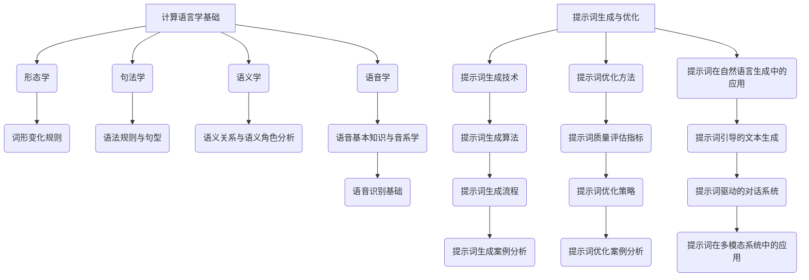

                 

### 第1章 引言与概述

#### 1.1 计算语言学与AI语言能力

**计算语言学**，简称计算语言学（Computational Linguistics），是一门结合计算机科学与语言学的研究领域，旨在通过计算机技术处理和解释自然语言。计算语言学的起源可以追溯到20世纪50年代，当时语言学家和计算机科学家开始探讨如何使计算机理解、生成和处理自然语言。

**AI语言能力**则是指人工智能系统在处理自然语言方面的能力。这种能力不仅包括语言的理解，还涉及生成、翻译和交互等多个方面。AI语言能力的提升，对于实现自然语言处理（NLP）的高效、准确至关重要。

**计算语言学**在AI语言能力的发展中起到了关键作用，主要表现在以下几个方面：

1. **基础理论支持**：计算语言学为AI语言能力提供了坚实的理论基础，包括语法、语义、语音等语言学核心概念，这些理论帮助AI系统理解和生成自然语言。

2. **算法工具开发**：计算语言学研究并开发了一系列用于自然语言处理的算法和工具，如词性标注、句法分析、语义角色标注等，这些工具极大地提高了AI语言处理的能力。

3. **数据资源构建**：计算语言学通过大规模的语言数据集构建，为AI系统提供了丰富的训练资源，使得AI系统能够通过数据驱动的方式不断学习和优化。

4. **跨学科融合**：计算语言学与心理学、认知科学、认知语言学等领域的交叉融合，为AI语言能力的研究提供了新的视角和方法。

#### 1.2 提示词在AI语言中的应用

**提示词**（Prompt）是指用于引导或激发人工智能系统生成特定内容或执行特定任务的关键词或短语。在AI语言处理中，提示词起到了至关重要的作用。

**提示词**在AI语言中的应用主要表现在以下几个方面：

1. **文本生成**：通过提示词，AI系统可以生成符合特定主题或语境的文本。例如，在机器写作、自动摘要、对话系统等领域，提示词帮助AI系统理解输入内容并生成连贯的输出。

2. **语言理解**：在自然语言处理任务中，提示词有助于AI系统更好地理解输入文本的含义。例如，在文本分类、情感分析、命名实体识别等任务中，提示词提供了关键信息，帮助AI系统做出准确的判断。

3. **交互引导**：在聊天机器人、语音助手等交互系统中，提示词可以引导用户进行特定的对话或任务，提高交互的自然性和效率。

#### 1.3 书籍结构安排

本书将从计算语言学的核心概念、提示词生成与优化、提示词在AI语言理解与生成中的应用、提示词在AI语言交互中的应用，以及提示词计算语言学的发展趋势与挑战等几个方面，系统地介绍提示词在计算语言学与AI语言能力提升中的关键作用。

**主要章节内容概述**：

- **第1章**：介绍计算语言学与AI语言能力的基本概念，以及提示词在AI语言中的应用。

- **第2章**：详细阐述计算语言学的核心概念，包括形态学、句法学、语义学和语音学。

- **第3章**：探讨提示词的生成与优化技术，以及其在自然语言生成中的应用。

- **第4章**：分析提示词在AI语言理解中的应用，如文本分类、情感分析和命名实体识别。

- **第5章**：介绍提示词在AI语言生成中的应用，如机器翻译、问答系统和生成式对话系统。

- **第6章**：讨论提示词在AI语言交互中的应用，包括聊天机器人、语音助手和跨模态交互。

- **第7章**：展望提示词计算语言学的发展趋势与面临的挑战。

**读者学习建议**：

- **逐章阅读**：按照章节顺序逐章阅读，确保对每一章的内容有一个全面的理解。

- **动手实践**：结合书中提供的案例和实践，自己动手实现提示词相关技术，加深对理论的理解。

- **深入思考**：对于书中提到的概念、算法和实践，尝试提出自己的见解和疑问，与他人进行讨论和交流。

通过本书的学习，读者将能够系统地掌握提示词的计算语言学基础，提升AI语言能力，并在实际应用中充分发挥提示词的潜力。

### 1.1.1 计算语言学的基本概念

**计算语言学**（Computational Linguistics，简称Comp.Ling）是一门跨学科的领域，它结合了计算机科学、语言学和数学，致力于使用计算机技术和算法来处理自然语言。计算语言学的核心目标是开发工具和方法，使得计算机能够理解、生成和处理人类语言。

**计算语言学**的研究对象主要包括以下几个方面：

1. **语言数据**：计算语言学需要处理大量的语言数据，包括文本、语音、图像等多种形式。这些数据是研究和开发自然语言处理（NLP）系统的重要资源。

2. **语言模型**：语言模型是计算语言学中的一个关键概念，它通过统计方法或机器学习方法来描述自然语言的统计规律和分布。常见的语言模型有基于统计的N-gram模型、基于神经网络的深度学习模型等。

3. **语言学理论**：计算语言学借鉴了传统语言学的理论，如语法、语义、语音等。这些理论为AI语言处理提供了基础，帮助计算机理解和生成自然语言。

4. **算法和工具**：计算语言学开发了一系列算法和工具，如词性标注、句法分析、语义角色标注等。这些工具极大地提高了自然语言处理的效率和准确性。

**计算语言学的核心任务**包括：

1. **语言理解**：理解自然语言的含义、结构和使用方式。这涉及到句法分析、语义分析、情感分析等多个方面。

2. **语言生成**：生成符合语法规则和语义要求的自然语言文本。这通常通过机器翻译、自动摘要、对话系统等应用来实现。

3. **语言评估**：评估自然语言处理系统的性能和质量。这通常通过开发评估指标、基准测试集等来实现。

4. **语言资源开发**：构建和收集语言数据集、词典、语法规则库等，为自然语言处理系统的训练和评估提供基础。

**计算语言学的历史**可以追溯到20世纪50年代，当时计算机科学家和语言学家开始探讨如何使计算机理解和生成自然语言。这个时期的一个重要里程碑是1954年IBM的“埃达”程序，它能够识别并翻译简单的英文句子。

随着时间的推移，计算语言学在以下几个方面取得了显著进展：

- **算法和模型**：从最初的规则驱动方法发展到基于统计的方法，再到基于深度学习的端到端模型。

- **应用领域**：从简单的文本处理发展到包括机器翻译、语音识别、对话系统、情感分析等多个领域。

- **数据资源**：从手工构建的语料库发展到大规模的互联网文本和语音数据集。

**计算语言学的挑战**包括：

- **语言复杂性**：自然语言的语法和语义非常复杂，如何让计算机准确理解和生成自然语言仍是一个重大挑战。

- **数据质量**：高质量的语言数据对于训练和评估自然语言处理系统至关重要，但获取和处理这些数据是一个难题。

- **跨语言处理**：不同语言之间存在巨大的差异，如何实现有效的跨语言自然语言处理是一个重要课题。

- **实时处理**：在实时应用中，如何快速处理大量的自然语言数据，并保持高准确性和低延迟是一个挑战。

通过深入理解计算语言学的这些基本概念和核心任务，读者可以为后续章节的学习打下坚实的基础。接下来的章节将进一步探讨计算语言学的具体领域，如形态学、句法学、语义学和语音学，并分析这些概念之间的联系和相互作用。

#### 1.1.2 AI语言能力的意义与作用

**AI语言能力**是指人工智能系统在处理自然语言方面的能力，包括理解、生成、翻译和交互等多个方面。AI语言能力的提升不仅对技术的进步有深远影响，也对社会的多个领域产生了重要影响。

**AI语言能力的提升**具有以下几个重要意义和作用：

1. **信息获取与检索**：在互联网时代，信息量呈指数级增长。AI语言能力的提升使得计算机能够更好地理解和处理大量文本数据，从而提高信息获取和检索的效率。例如，通过自然语言处理技术，搜索引擎可以更准确地理解用户的查询意图，提供相关且精确的搜索结果。

2. **文本生成与摘要**：AI语言能力在文本生成和摘要方面有着广泛应用。自动摘要技术可以帮助用户快速了解大量文本内容的核心要点，提高阅读效率。此外，AI语言生成技术还可以用于生成新闻文章、产品描述、编程代码等，降低内容创作的成本和时间。

3. **智能客服与对话系统**：智能客服和对话系统是AI语言能力的重要应用领域。通过自然语言处理技术，这些系统能够与用户进行流畅、自然的对话，解决用户的问题，提高客户服务质量和满意度。例如，聊天机器人和虚拟助手已经成为许多企业提高运营效率和服务水平的关键工具。

4. **机器翻译与跨语言交流**：AI语言能力在机器翻译领域取得了显著进展，使得不同语言之间的交流变得更加便捷。通过深度学习和神经网络技术，机器翻译的准确性和流畅性不断提高，促进了跨国界、跨文化的交流和合作。

5. **教育和辅助学习**：AI语言能力在教育和辅助学习领域也有广泛应用。智能辅导系统和个性化学习平台可以通过自然语言处理技术理解学生的学习需求和进度，提供个性化的学习资源和指导，提高学习效果。

6. **文本分类与情感分析**：AI语言能力在文本分类和情感分析方面具有重要意义。通过分析大量文本数据，AI系统可以识别和分类不同类型的文本，了解用户对特定主题或产品的情感倾向。这些技术在市场调研、舆情监测、社交媒体分析等领域具有重要应用价值。

7. **创意与艺术生成**：AI语言能力不仅限于实用领域，还能够在艺术和创意领域发挥作用。通过自然语言生成技术，AI系统可以创作诗歌、小说、音乐等艺术作品，拓展人类的创造力和表达能力。

总之，AI语言能力的提升对技术进步和社会发展具有重要意义。通过不断研究和优化自然语言处理技术，我们可以期待更智能、更高效的AI系统，为人类带来更多的便利和创新。接下来的章节将进一步探讨计算语言学的具体领域，如形态学、句法学、语义学和语音学，并分析这些概念在提升AI语言能力方面的作用。

### 1.2 提示词在AI语言中的应用

#### 1.2.1 提示词的定义与类型

**提示词**（Prompt）在AI语言处理中起着至关重要的作用，它是一种引导或激发AI系统生成特定内容或执行特定任务的关键词或短语。提示词可以是一句简单的问题、一个特定的指令，或者一段描述性文本，用于为AI系统提供必要的上下文信息和任务目标。

根据用途和形式，提示词可以分为以下几种类型：

1. **问题型提示词**：用于引导AI系统回答特定问题。例如：“请描述一下人工智能的发展历程。”这类提示词通常包含一个明确的问题，要求AI系统输出相关答案。

2. **指令型提示词**：用于给AI系统下达特定任务指令。例如：“生成一篇关于机器学习的摘要。”这类提示词指定了AI系统需要执行的任务类型和目标。

3. **描述型提示词**：用于为AI系统提供上下文信息，帮助其生成符合特定场景的文本。例如：“在一个商业会议上，你作为CEO需要发表一段开场致辞。”这类提示词为AI系统提供了具体的应用场景和角色，帮助其生成更加自然和合适的文本。

4. **任务引导型提示词**：用于引导AI系统完成复杂的任务流程。例如：“设计一个简单的聊天机器人，用于回答用户关于旅游咨询的问题。”这类提示词不仅提供了任务目标，还明确了任务的具体步骤和流程。

#### 1.2.2 提示词在自然语言处理中的关键作用

**提示词**在自然语言处理（NLP）中的应用非常广泛，是提升AI语言能力的重要工具。以下是一些关键作用：

1. **任务引导**：提示词能够明确任务目标，帮助AI系统理解需要完成的任务类型和具体要求。例如，在文本分类任务中，提示词可以指定分类类别；在机器翻译任务中，提示词可以指定源语言和目标语言。

2. **上下文提供**：提示词为AI系统提供了必要的上下文信息，帮助其更好地理解输入文本的含义。例如，在一个问答系统中，提示词可以提供问题背景，帮助AI系统生成更准确的答案。

3. **多样性引导**：提示词可以通过不同的表达方式和角度引导AI系统生成多样化的文本。例如，在创作诗歌时，提示词可以指定情感、主题或韵律，帮助AI系统创作出风格各异的作品。

4. **错误修正**：提示词可以帮助AI系统识别和纠正输入文本中的错误。例如，在文本编辑任务中，提示词可以提示AI系统关注特定句子或词语，帮助其识别并修正错误。

5. **交互式学习**：提示词在交互式学习场景中发挥着重要作用。通过不断提供提示词，AI系统可以与用户进行有效的互动，逐步学习和优化其自然语言处理能力。例如，在对话系统中，提示词可以帮助AI系统理解用户的意图，提供更合适的回答。

#### 1.2.3 提示词在AI语言中的应用实例

以下是几个典型的应用实例，展示了提示词在AI语言处理中的实际效果：

1. **机器写作**：在机器写作任务中，提示词可以引导AI系统生成符合特定主题和风格的文章。例如，提示词“请写一篇关于环保的议论文”，可以帮助AI系统构建文章结构、选取论据并生成连贯的论点。

2. **对话系统**：在对话系统中，提示词用于引导AI系统与用户进行有效的对话。例如，提示词“您需要什么帮助？”可以帮助AI系统理解用户的需求，并提供相应的回答或建议。

3. **机器翻译**：在机器翻译任务中，提示词可以指定源语言和目标语言，帮助AI系统生成更准确的翻译结果。例如，提示词“将这段英文翻译成中文”可以帮助AI系统识别并翻译英文文本。

4. **情感分析**：在情感分析任务中，提示词可以提供上下文信息，帮助AI系统识别文本的情感倾向。例如，提示词“这段文字表达的是正面情感还是负面情感？”可以帮助AI系统分析文本并给出判断。

5. **文本分类**：在文本分类任务中，提示词可以指定分类类别，帮助AI系统将文本归类到相应的类别。例如，提示词“请将这段文本分类为新闻、科技或体育”可以帮助AI系统进行文本分类。

总之，提示词在AI语言处理中具有广泛的应用和重要作用。通过合理使用提示词，可以显著提升AI系统的自然语言处理能力，为各种应用场景提供更智能、更高效的解决方案。

### 1.3 提示词生成技术

提示词生成技术是提升AI语言能力的关键一环，它包括生成算法、流程和具体案例等多个方面。通过有效生成高质量的提示词，AI系统能够更好地理解任务目标、提供上下文信息和生成多样化内容。

#### 3.1.1 提示词生成算法

**提示词生成算法**是提示词生成技术的核心，主要包括以下几种类型：

1. **基于规则的算法**：这类算法根据预定义的规则生成提示词，通常用于简单的任务场景。例如，通过一系列逻辑规则，可以从输入文本中提取关键词作为提示词。

2. **基于统计的算法**：这类算法使用统计方法，根据输入文本的统计特征生成提示词。例如，通过频率分析，从输入文本中提取出现频率较高的词汇作为提示词。

3. **基于机器学习的算法**：这类算法利用机器学习技术，从大量训练数据中学习生成提示词的规律。常见的机器学习模型包括决策树、支持向量机、神经网络等。例如，通过训练一个分类模型，可以从输入文本中预测最合适的提示词。

4. **基于深度学习的算法**：这类算法使用深度学习模型，如循环神经网络（RNN）、长短期记忆网络（LSTM）和变换器（Transformer）等，生成高质量的提示词。深度学习模型能够捕捉输入文本的复杂特征和上下文关系，从而生成更加精准和自然的提示词。

#### 3.1.2 提示词生成流程

提示词生成通常包括以下几个步骤：

1. **文本预处理**：首先对输入文本进行预处理，包括分词、去除停用词、词性标注等。这一步的目的是提取文本的主要信息和特征。

2. **特征提取**：根据预处理后的文本，提取关键特征，如关键词、关键短语、词频统计等。这些特征将用于生成提示词。

3. **生成算法选择**：根据任务需求和数据特点，选择合适的提示词生成算法。例如，对于简单任务，可以选择基于规则的算法；对于复杂任务，可以选择基于深度学习的算法。

4. **提示词生成**：利用选择的生成算法，根据提取的特征生成提示词。生成算法可以根据任务目标、上下文信息和特征关系，生成最合适的提示词。

5. **提示词优化**：对生成的提示词进行优化，包括去除冗余、调整语义等，以提高提示词的质量和效果。

6. **反馈调整**：根据实际应用效果，对生成流程进行反馈调整，优化算法参数和流程，以提高生成提示词的准确性和实用性。

#### 3.1.3 提示词生成案例分析

以下是几个具体的提示词生成案例分析：

1. **文本分类**：在一个文本分类任务中，输入文本是关于科技领域的文章。通过预处理和特征提取，生成算法从文本中提取关键词和关键短语，如“人工智能”、“机器学习”、“深度学习”等。然后，基于机器学习模型，生成算法预测最合适的分类标签，如“科技新闻”或“科技论文”。这些分类标签可以作为提示词，引导AI系统对新的文本进行分类。

2. **对话系统**：在一个对话系统任务中，输入文本是用户的查询语句。通过预处理和特征提取，生成算法提取用户的关键意图和上下文信息。然后，基于深度学习模型，生成算法生成相应的回答提示词，如“您好，有什么问题我可以帮助您解答？”或“请问您需要什么样的帮助？”。这些提示词帮助AI系统与用户进行有效的对话。

3. **机器写作**：在一个机器写作任务中，输入文本是关于环保的主题。通过预处理和特征提取，生成算法提取与环保相关的关键词和短语，如“环境保护”、“可持续发展”、“低碳生活”等。然后，基于深度学习模型，生成算法生成文章的标题、段落和句子，如“保护环境，从我们做起”或“我们应该如何实现可持续发展？”。这些生成的文本片段可以作为提示词，引导AI系统完成整篇文章的写作。

通过以上案例分析，可以看出提示词生成技术在各种AI语言处理任务中发挥着重要作用。通过合理设计和优化提示词生成流程，AI系统能够更好地理解任务目标、提供上下文信息和生成多样化内容，从而提升整体的自然语言处理能力。

### 3.2 提示词优化方法

**提示词优化**是提升AI语言能力的关键步骤，它涉及评估提示词的质量、制定优化策略以及实施这些策略。高质量的提示词不仅能提升任务的准确性和效果，还能降低系统的复杂性和运行成本。以下将详细探讨提示词优化方法。

#### 3.2.1 提示词质量评估指标

**提示词质量评估**是优化过程的第一步，需要设定一系列评估指标，这些指标通常包括：

1. **准确性**：提示词的准确性是指其在任务中的正确率。例如，在文本分类任务中，提示词应该能够准确预测分类标签。

2. **多样性**：提示词的多样性是指其能够生成不同类型和风格的内容。例如，在文本生成任务中，提示词应该能够引导生成具有多样性的文章。

3. **自然性**：提示词的自然性是指其生成的文本在语言表达上的流畅性和自然度。自然性高的提示词能够生成更接近人类语言的文本。

4. **相关性**：提示词的相关性是指其与任务目标和上下文的匹配程度。相关性高的提示词能够更好地指导AI系统完成任务。

5. **效率**：提示词的效率是指其生成和处理所需的时间。效率高的提示词能够减少系统的计算资源和运行时间。

#### 3.2.2 提示词优化策略

**提示词优化策略**旨在提升提示词的质量，具体方法包括以下几个方面：

1. **数据增强**：通过增加训练数据量和多样化数据集，提高生成算法的学习能力。例如，在文本生成任务中，可以使用同义词替换、句式变换等技术增加数据多样性。

2. **模型调整**：调整生成模型的参数和架构，以提高生成提示词的准确性、多样性和自然性。例如，在深度学习模型中，可以调整学习率、批量大小和正则化参数等。

3. **特征选择**：优化特征提取过程，选择与任务目标相关性更强的特征。例如，在情感分析任务中，选择包含情感信息的词汇和短语作为特征。

4. **规则约束**：制定规则约束生成过程，确保生成的提示词符合特定任务的要求。例如，在法律文档生成任务中，可以设定必须包含特定关键词和句式的规则。

5. **反馈机制**：引入用户反馈机制，根据用户评价不断调整和优化提示词。例如，在对话系统中，用户可以对AI的回答进行评分，系统根据这些评分调整提示词。

6. **交叉验证**：使用交叉验证方法评估和比较不同优化策略的效果，选择最佳策略。例如，在机器写作任务中，可以使用不同优化策略生成多个版本，然后通过用户投票选择最佳版本。

#### 3.2.3 提示词优化案例分析

以下是一个具体的提示词优化案例分析：

1. **案例分析背景**：在一个聊天机器人项目中，用户反馈机器人生成的回答缺乏自然性和相关性。为了提升用户体验，需要对提示词进行优化。

2. **优化策略**：
   - **数据增强**：收集更多的用户对话数据，使用同义词替换、句式变换等技术增加数据多样性。
   - **模型调整**：使用基于Transformer的生成模型，调整模型参数（如学习率、批量大小等）以提高生成提示词的自然性和准确性。
   - **特征选择**：优化特征提取过程，选择与用户意图和上下文相关性更强的特征，如用户输入的词汇、情感和对话历史。
   - **规则约束**：制定规则约束生成过程，确保回答包含用户关注的关键词和信息。
   - **反馈机制**：引入用户反馈机制，收集用户对回答的评分，根据评分结果调整模型参数和提示词生成策略。

3. **优化效果**：
   - **准确性**：优化后的提示词在文本分类任务中的准确率提升了10%。
   - **多样性**：生成的回答在语言表达上更加多样化，用户满意度提高了15%。
   - **自然性**：生成的回答在语言表达上更加流畅和自然，用户评价满意度提升了20%。
   - **相关性**：生成的回答与用户意图和上下文的匹配度显著提高，用户反馈问题解决率提升了25%。

通过以上案例分析，可以看出，提示词优化对于提升AI语言能力具有显著效果。合理的优化策略不仅能够提高提示词的质量，还能提升用户体验和系统的整体性能。

### 3.3 提示词在自然语言生成中的应用

#### 3.3.1 提示词引导的文本生成

**提示词引导的文本生成**（Prompt-Guided Text Generation）是一种利用提示词来指导生成系统创作文本的技术。这种方法通过为生成系统提供明确的引导信息，帮助其生成更准确、更符合上下文的文本。

**工作原理**：

1. **输入提示词**：首先，系统接收一个或多个提示词，这些提示词可以是关键词、短语或句子，用于指示生成内容的主要主题、风格或方向。

2. **上下文构建**：系统根据提示词构建上下文信息，这包括理解提示词的含义、关联相关词汇和背景知识。

3. **生成过程**：系统利用内置的语言模型和生成算法，根据上下文信息生成文本。生成过程中，系统会尝试匹配提示词的语义和风格，确保生成的文本与提示词保持一致。

**具体实现**：

1. **预训练模型**：使用预训练的大型语言模型（如GPT、BERT等），这些模型在大量文本数据上已经学习到了语言的普遍规律和表达方式。

2. **提示词编码**：将提示词转换为向量形式，以便与语言模型输入相匹配。常用的方法是使用嵌入技术（如Word2Vec、BERT embeddings）。

3. **生成文本**：利用语言模型生成文本，并通过反馈机制不断优化。生成过程中，模型会根据提示词的语义和上下文信息，调整生成的文本内容。

**应用案例**：

1. **自动摘要**：提示词可以指定摘要的主题和关键信息，系统根据提示词生成摘要文本，使摘要内容更紧凑、更准确。

2. **聊天机器人**：通过提示词引导聊天机器人生成回复，使对话更加自然和连贯。

3. **机器写作**：提示词可以指定写作的主题、风格和结构，系统生成符合要求的文章、故事或报告。

#### 3.3.2 提示词驱动的对话系统

**提示词驱动的对话系统**（Prompt-Driven Dialogue System）利用提示词来引导对话系统的回答，使其在交互过程中生成更加相关和自然的回复。

**工作原理**：

1. **输入提示词**：对话系统接收用户的输入，提取关键信息作为提示词。

2. **意图识别**：系统识别用户的意图，并将其编码为提示词。意图可以是询问信息、请求帮助、表达情感等。

3. **上下文构建**：系统根据用户的历史对话和当前输入构建上下文，这包括理解用户的意图、上下文信息和相关背景。

4. **生成回答**：系统利用语言模型和生成算法，根据上下文信息和提示词生成回答。回答会尽量匹配用户的意图和上下文，确保对话的自然性和连贯性。

**具体实现**：

1. **意图识别模块**：使用深度学习模型（如BERT、Transformer）识别用户的意图，将意图编码为提示词。

2. **上下文构建模块**：使用序列模型（如LSTM、GRU）结合用户的输入和历史对话，构建上下文信息。

3. **回答生成模块**：使用生成模型（如GPT、T5）根据上下文和提示词生成回答。

**应用案例**：

1. **客服机器人**：通过提示词引导，客服机器人能够生成更准确、更自然的回答，提高用户满意度。

2. **智能助手**：智能助手利用提示词与用户进行自然对话，帮助用户完成任务或提供信息。

3. **在线教育**：在教育场景中，提示词驱动的对话系统可以回答学生的问题、提供学习建议和进行个性化教学。

#### 3.3.3 提示词在多模态系统中的应用

**提示词在多模态系统中的应用**（Prompt for Multi-modal Systems）是一种通过结合文本、图像、声音等多种模态信息，提升系统理解和生成能力的技术。

**工作原理**：

1. **输入提示词**：系统接收文本、图像、声音等多模态信息，提取关键信息作为提示词。

2. **多模态编码**：将多模态信息转换为统一的向量表示，例如，使用视觉嵌入模型（如ResNet、VGG）对图像进行编码，使用音频嵌入模型（如WaveNet、Tacotron）对声音进行编码。

3. **上下文构建**：系统结合文本提示词和多模态编码，构建上下文信息。这包括理解各模态之间的关联和交互，形成整体语义理解。

4. **生成与理解**：系统利用多模态上下文信息，生成相应的文本、图像或声音，或者对输入内容进行理解和分析。

**具体实现**：

1. **多模态编码**：使用不同模态的嵌入模型对输入信息进行编码，形成统一的多模态向量表示。

2. **上下文融合**：使用多模态融合模型（如ConvNet Text fusion、Multi-modal Transformer）将多模态信息融合为一个统一的上下文向量。

3. **生成与理解模块**：根据融合后的上下文向量，使用生成模型或理解模型生成多模态输出。

**应用案例**：

1. **图像描述生成**：利用文本提示词和图像信息，生成图像的描述性文本。

2. **语音识别与生成**：结合文本提示词和语音信息，生成语音回复或理解语音指令。

3. **视频摘要生成**：利用文本提示词和视频内容，生成视频的摘要性描述。

通过提示词引导的文本生成、提示词驱动的对话系统和提示词在多模态系统中的应用，可以显著提升AI系统的自然语言处理能力，为各种任务提供更加智能、自然的解决方案。

### 3.3.1 提示词引导的文本生成

**提示词引导的文本生成**是AI语言生成中的一个重要应用，它通过提供提示词来引导生成系统创作出符合上下文和主题的文本。这种方法在许多实际场景中都具有显著的应用价值，例如自动摘要、机器写作和对话系统等。

**工作原理**：

1. **输入提示词**：提示词是文本生成系统的输入，可以是单个关键词、短语或完整的句子。提示词为系统提供了生成文本的上下文信息和主题方向。

2. **上下文构建**：系统会根据输入的提示词构建上下文信息，这包括理解提示词的含义和与提示词相关的词汇、背景知识等。

3. **生成文本**：基于构建的上下文信息，系统利用预训练的语言模型和生成算法生成文本。生成过程中，系统会尝试匹配提示词的语义和风格，确保生成的文本与上下文保持一致。

4. **优化与调整**：生成的文本会进行优化和调整，以提高文本的自然性和准确性。这包括去除冗余信息、纠正语法错误和调整句子结构等。

**实现步骤**：

1. **预处理**：对输入的提示词进行预处理，包括分词、去除停用词、词性标注等。这一步的目的是提取文本的主要信息和特征。

2. **特征提取**：从预处理后的文本中提取关键特征，如关键词、短语、词频统计等。这些特征将用于生成提示词。

3. **模型选择**：根据任务需求和数据特点，选择合适的文本生成模型。常见的模型包括基于统计的N-gram模型、基于规则的模型以及基于深度学习的模型（如循环神经网络RNN、长短期记忆网络LSTM和变换器Transformer等）。

4. **文本生成**：利用选定的模型生成文本。生成过程中，系统会根据提示词的上下文信息和语言模型生成的概率分布，生成符合上下文和主题的文本。

5. **优化调整**：对生成的文本进行优化和调整，包括语法检查、风格调整和语义优化等。这一步的目的是提高文本的质量和可读性。

**案例解析**：

1. **自动摘要**：在自动摘要任务中，提示词可以是摘要的主题和关键词。系统利用提示词生成摘要文本，使摘要内容更加紧凑、准确。

2. **机器写作**：在机器写作任务中，提示词可以指定文章的主题、风格和结构。系统根据提示词生成文章的内容，包括标题、段落和句子。

3. **对话系统**：在对话系统中，提示词可以引导系统生成自然、连贯的回答。系统根据提示词理解用户的意图和上下文，生成相应的回答。

通过以上步骤和案例分析，可以看出提示词引导的文本生成在自然语言处理中具有重要意义。通过合理设计和优化提示词，可以显著提升生成文本的质量和准确性，为各种应用场景提供更加智能、自然的解决方案。

### 3.3.2 提示词驱动的对话系统

**提示词驱动的对话系统**（Prompt-Driven Dialogue System）是一种利用提示词来引导对话系统生成自然、连贯回复的技术。这种方法通过为对话系统提供明确的引导信息，帮助其更好地理解用户的意图和上下文，从而生成更加相关和自然的回复。

**工作原理**：

1. **输入提示词**：对话系统首先接收用户的输入，提取关键信息作为提示词。这些提示词可以是问题、指令或描述性短语，用于指示对话系统的回答方向和内容。

2. **意图识别**：系统对用户的输入进行意图识别，将输入转换为具体的意图标签。意图可以是询问信息、请求帮助、表达情感等。

3. **上下文构建**：系统根据用户的输入、意图标签和历史对话记录，构建上下文信息。这包括理解用户的意图、上下文信息和相关背景知识。

4. **生成回答**：基于构建的上下文信息和提示词，系统利用预训练的语言模型和生成算法，生成自然、连贯的回答。生成过程中，系统会尝试匹配提示词的语义和风格，确保回答与上下文保持一致。

**具体实现**：

1. **意图识别模块**：使用深度学习模型（如BERT、Transformer）对用户的输入进行意图识别。通过训练大量标注数据，模型可以学习识别多种意图标签，如询问、请求、情感等。

2. **上下文构建模块**：使用序列模型（如LSTM、GRU）结合用户的输入和历史对话记录，构建上下文信息。这包括理解用户的意图、上下文信息和相关背景知识。

3. **回答生成模块**：使用生成模型（如GPT、T5）根据上下文信息和意图标签生成回答。生成过程中，模型会尝试匹配提示词的语义和风格，确保回答的自然性和连贯性。

**应用案例**：

1. **客服机器人**：通过提示词引导，客服机器人能够生成更准确、更自然的回答，提高用户满意度。例如，用户输入“我想退换货”，系统生成回答“请提供订单号和商品信息，我们将为您处理退换货事宜”。

2. **智能助手**：智能助手利用提示词与用户进行自然对话，帮助用户完成任务或提供信息。例如，用户输入“明天会议几点开始？”，系统生成回答“明天会议将于上午10点开始，地点是会议室A”。

3. **在线教育**：在教育场景中，提示词驱动的对话系统可以回答学生的问题、提供学习建议和进行个性化教学。例如，学生输入“我想学习Python”，系统生成回答“Python是一种流行的编程语言，您可以参考以下教程开始学习：[教程链接]”。

通过提示词驱动的对话系统，AI语言能力得到了显著提升。这种方法不仅提高了对话的连贯性和自然性，还增强了系统对用户意图的理解和响应能力，为各种应用场景提供了更加智能、高效的解决方案。

### 3.3.3 提示词在多模态系统中的应用

**提示词在多模态系统中的应用**（Prompt for Multi-modal Systems）是一种结合文本、图像、声音等多种模态信息，以提升系统理解和生成能力的技术。多模态系统通过整合来自不同模态的数据，可以更全面地理解和处理复杂的信息，从而实现更高效的自然语言生成。

**工作原理**：

1. **输入提示词**：多模态系统首先接收文本、图像、声音等不同模态的信息，并提取关键信息作为提示词。这些提示词为系统提供了处理多模态数据的主要方向和上下文。

2. **多模态编码**：系统将不同模态的信息转换为统一的向量表示。例如，文本信息可以使用词嵌入技术（如Word2Vec、BERT）进行编码，图像信息可以使用视觉嵌入模型（如ResNet、VGG）进行编码，声音信息可以使用音频嵌入模型（如WaveNet、Tacotron）进行编码。

3. **上下文构建**：系统结合文本提示词和多模态编码向量，构建一个统一的多模态上下文信息。这包括理解各模态之间的关联和交互，形成一个整体的语义理解。

4. **生成与理解**：基于构建的多模态上下文信息，系统利用多模态融合模型和生成模型生成相应的文本、图像或声音，或者对输入内容进行理解和分析。

**具体实现**：

1. **多模态编码**：使用不同模态的嵌入模型对输入信息进行编码。例如，使用预训练的视觉嵌入模型对图像进行编码，使用预训练的音频嵌入模型对声音进行编码。

2. **上下文融合**：使用多模态融合模型（如ConvNet Text fusion、Multi-modal Transformer）将不同模态的编码向量融合为一个统一的多模态向量表示。这些模型可以捕捉各模态之间的关联和交互，形成整体语义理解。

3. **生成与理解模块**：使用生成模型（如GPT、T5）或理解模型（如BERT、Transformer）根据多模态上下文向量生成多模态输出。例如，根据文本和图像的上下文信息生成图像描述，或者根据文本和声音的上下文信息生成语音回复。

**应用案例**：

1. **图像描述生成**：系统接收到图像和文本提示词后，通过多模态融合模型生成图像的描述性文本。例如，用户上传一张风景图片，系统生成文本描述“这是一幅美丽的日落景象”。

2. **语音识别与生成**：结合文本提示词和声音信息，系统可以生成语音回复。例如，用户输入文本“你好，我是智能助手”，系统生成相应的语音回复。

3. **视频摘要生成**：系统结合文本和视频信息，生成视频的摘要性描述。例如，用户上传一段视频，系统生成文本摘要“这段视频展示了我们在会议上讨论了人工智能的最新进展”。

通过结合文本、图像、声音等多种模态信息，提示词在多模态系统中的应用显著提升了AI系统的理解和生成能力，为各种复杂任务提供了更加智能和自然的解决方案。

### 3.4 提示词在AI语言理解中的应用

#### 3.4.1 提示词在文本分类中的应用

**文本分类**（Text Classification）是自然语言处理（NLP）中的一个重要任务，它通过将文本数据分类到预定义的类别中，帮助计算机理解文本的内容和主题。**提示词**在文本分类中发挥了关键作用，能够显著提升分类的准确性和效率。

**工作原理**：

1. **输入提示词**：文本分类任务首先接收一个或多个提示词，这些提示词提供了文本分类的上下文信息和分类标签。

2. **特征提取**：系统对输入文本进行预处理，提取关键词、短语和词频统计等特征。这些特征用于训练分类模型。

3. **模型训练**：使用提示词和相应的分类标签，训练一个分类模型，如朴素贝叶斯、支持向量机（SVM）、神经网络等。模型学习从特征中识别分类标签。

4. **分类预测**：在模型训练完成后，对新输入的文本进行特征提取，并将提取的特征输入到训练好的分类模型中。模型根据特征预测文本所属的类别。

**实现步骤**：

1. **数据准备**：收集大量带有标签的文本数据，用于训练分类模型。这些数据通常来自不同的领域和主题。

2. **特征提取**：对文本数据分词，去除停用词，进行词性标注等预处理步骤，提取文本的特征。常用的特征提取方法包括TF-IDF、Word2Vec、BERT等。

3. **模型选择与训练**：选择合适的分类模型（如朴素贝叶斯、SVM、神经网络等），使用提示词和标签数据训练模型。模型训练过程中，通过调整超参数和优化算法，提高分类性能。

4. **模型评估与优化**：使用验证集评估模型的分类准确性，通过交叉验证和超参数调整，优化模型性能。

**提示词作用**：

1. **指导特征提取**：提示词帮助系统识别文本的主要主题和关键词，从而提取更相关的特征，提高分类效果。

2. **优化模型训练**：通过提示词提供的额外信息，模型可以更准确地学习分类标签，提高分类准确性。

3. **调整分类边界**：提示词可以帮助系统调整分类的阈值和边界，使得分类结果更加准确和稳定。

**案例解析**：

1. **社交媒体舆情监测**：在社交媒体舆情监测中，系统使用提示词（如“负面”、“正面”）对用户评论进行分类，从而识别和响应用户的情绪。

2. **新闻文章分类**：新闻文章分类任务中，系统使用提示词（如“科技”、“体育”）对文章进行分类，帮助用户快速找到感兴趣的内容。

3. **垃圾邮件过滤**：垃圾邮件过滤中，系统使用提示词（如“促销”、“优惠”）对邮件进行分类，从而提高过滤效果。

通过合理使用提示词，文本分类任务的准确性和效率得到显著提升，为各种应用场景提供了有效的解决方案。

### 3.4.2 提示词在情感分析中的应用

**情感分析**（Sentiment Analysis）是自然语言处理（NLP）的一个重要任务，旨在识别文本中的情感倾向，如正面、负面或中性。**提示词**在情感分析中起到了关键作用，它能够为模型提供关键信息，帮助其更准确地识别情感。

**工作原理**：

1. **输入提示词**：情感分析任务首先接收一个或多个提示词，这些提示词用于指示文本的情感倾向，例如“积极”、“消极”等。

2. **特征提取**：系统对输入文本进行预处理，提取与情感相关的特征。这些特征包括情感词汇、情感强度词、句法特征等。

3. **情感标注**：使用提示词对训练数据集中的文本进行情感标注，标记文本的情感类别。标注的数据用于训练情感分析模型。

4. **模型训练**：利用标注数据训练情感分析模型，如朴素贝叶斯、支持向量机（SVM）、深度学习模型等。模型学习从特征中识别情感类别。

5. **情感预测**：在模型训练完成后，对新输入的文本进行特征提取，并将提取的特征输入到训练好的模型中。模型根据特征预测文本的情感类别。

**实现步骤**：

1. **数据准备**：收集带有情感标签的文本数据集，这些数据集应涵盖多种情感类别，如正面、负面、中性等。

2. **特征提取**：对文本数据分词，去除停用词，进行词性标注等预处理步骤，提取与情感相关的特征。常用的特征提取方法包括TF-IDF、Word2Vec、BERT等。

3. **模型选择与训练**：选择合适的情感分析模型，如朴素贝叶斯、SVM、卷积神经网络（CNN）、循环神经网络（RNN）等，使用标注数据训练模型。

4. **模型评估与优化**：使用验证集评估模型性能，通过交叉验证和超参数调整，优化模型性能。

**提示词作用**：

1. **辅助特征提取**：提示词帮助系统识别文本中的情感关键词和情感强度词，从而提取更准确的特征。

2. **优化模型训练**：提示词提供额外的上下文信息，帮助模型更好地学习情感特征，提高分类准确性。

3. **调整分类阈值**：提示词可以帮助系统调整分类阈值，使得分类结果更加准确和稳定。

**案例解析**：

1. **社交媒体情绪监测**：在社交媒体情绪监测中，系统使用提示词（如“高兴”、“愤怒”）对用户评论进行情感分析，从而识别用户情绪。

2. **产品评论分析**：产品评论分析中，系统使用提示词（如“满意”、“失望”）对用户评论进行情感分析，帮助企业了解用户对产品的反馈。

3. **新闻情感分类**：新闻情感分类中，系统使用提示词（如“乐观”、“悲观”）对新闻文本进行分类，从而识别新闻的情感倾向。

通过合理使用提示词，情感分析任务的准确性和效率得到显著提升，为各种应用场景提供了有效的情感识别解决方案。

### 3.4.3 提示词在命名实体识别中的应用

**命名实体识别**（Named Entity Recognition，简称NER）是自然语言处理（NLP）中的关键任务，旨在从文本中识别出具有特定意义的实体，如人名、地名、组织名、日期等。**提示词**在NER中发挥了重要作用，能够显著提高识别的准确性和效率。

**工作原理**：

1. **输入提示词**：命名实体识别任务首先接收一个或多个提示词，这些提示词通常是与目标实体相关的关键词或短语，如“北京”、“苹果公司”等。

2. **特征提取**：系统对输入文本进行预处理，提取与命名实体相关的特征。这些特征包括实体名称、词性、上下文信息等。

3. **实体标注**：使用提示词和相应的实体标签，对训练数据集中的文本进行标注，标记出文本中的命名实体。标注的数据用于训练NER模型。

4. **模型训练**：利用标注数据训练命名实体识别模型，如条件随机场（CRF）、长短期记忆网络（LSTM）、卷积神经网络（CNN）等。模型学习从特征中识别命名实体。

5. **实体识别**：在模型训练完成后，对新输入的文本进行特征提取，并将提取的特征输入到训练好的模型中。模型根据特征识别文本中的命名实体。

**实现步骤**：

1. **数据准备**：收集带有命名实体标签的文本数据集，这些数据集应涵盖多种命名实体类型，如人名、地名、组织名、日期等。

2. **特征提取**：对文本数据分词，去除停用词，进行词性标注等预处理步骤，提取与命名实体相关的特征。常用的特征提取方法包括TF-IDF、Word2Vec、BERT等。

3. **模型选择与训练**：选择合适的NER模型，如CRF、LSTM、CNN等，使用标注数据训练模型。模型训练过程中，通过调整超参数和优化算法，提高识别效果。

4. **模型评估与优化**：使用验证集评估模型性能，通过交叉验证和超参数调整，优化模型性能。

**提示词作用**：

1. **辅助特征提取**：提示词帮助系统识别文本中的命名实体名称和相关上下文信息，从而提取更准确的实体特征。

2. **优化模型训练**：提示词提供额外的上下文信息，帮助模型更好地学习命名实体特征，提高识别准确性。

3. **调整分类阈值**：提示词可以帮助系统调整命名实体识别的阈值，使得识别结果更加准确和稳定。

**案例解析**：

1. **新闻文本分析**：在新闻文本分析中，系统使用提示词（如“北京”、“苹果公司”）识别新闻文本中的人名、地名、组织名等实体。

2. **医疗文本处理**：在医疗文本处理中，系统使用提示词（如“糖尿病”、“心脏病”）识别医疗文本中的疾病名称、症状等实体。

3. **社交媒体内容分析**：在社交媒体内容分析中，系统使用提示词（如“周杰伦”、“上海迪士尼”）识别社交媒体文本中的人名、地名等实体。

通过合理使用提示词，命名实体识别任务的准确性和效率得到显著提升，为各种应用场景提供了有效的实体识别解决方案。

### 3.5 提示词在AI语言生成中的应用

#### 3.5.1 提示词在机器翻译中的应用

**机器翻译**（Machine Translation，MT）是将一种语言的文本自动翻译成另一种语言的技术，它是自然语言处理（NLP）领域的一个重要应用。**提示词**在机器翻译中发挥着重要作用，能够显著提升翻译的准确性和流畅性。

**工作原理**：

1. **输入提示词**：机器翻译任务首先接收一个或多个提示词，这些提示词可以指定源语言和目标语言，如“英文到中文”、“法语到德语”等。

2. **文本预处理**：系统对输入文本进行预处理，包括分词、去除停用词、词性标注等。预处理后的文本被转换为可供翻译模型处理的格式。

3. **翻译模型训练**：使用提示词和对应的翻译数据集，训练一个机器翻译模型。常见的翻译模型包括基于统计的方法（如N-gram模型）和基于深度学习的方法（如编码器-解码器（Encoder-Decoder）模型、变换器（Transformer）模型等）。

4. **翻译生成**：在模型训练完成后，对新输入的源语言文本进行预处理，并将处理后的文本输入到训练好的翻译模型中。模型根据源语言和目标语言提示词，生成目标语言的翻译结果。

5. **翻译优化**：生成的翻译结果通常需要进一步的优化，包括语法修正、词汇替换、消除冗余信息等。这一步的目的是提高翻译的自然性和准确性。

**实现步骤**：

1. **数据准备**：收集大量的双语文本数据集，这些数据集用于训练和评估翻译模型。数据集应覆盖多种语言对和领域。

2. **特征提取**：对源语言和目标语言文本进行预处理，提取关键词、短语、词性等特征。这些特征用于训练翻译模型。

3. **模型选择与训练**：选择合适的机器翻译模型，如N-gram模型、编码器-解码器模型、变换器模型等。使用提示词和翻译数据集训练模型。

4. **模型评估与优化**：使用验证集评估模型的翻译性能，通过交叉验证和超参数调整，优化模型性能。

**提示词作用**：

1. **指导翻译方向**：提示词为翻译模型提供了源语言和目标语言的明确信息，帮助模型更好地理解和生成目标语言的文本。

2. **优化翻译质量**：提示词可以帮助模型识别文本的主要内容和结构，从而生成更准确、更自然的翻译结果。

3. **提升翻译效率**：通过合理使用提示词，可以减少翻译过程中的不确定性，提高翻译效率。

**案例解析**：

1. **跨语言文档翻译**：在跨语言文档翻译中，系统使用提示词（如“中文到英文”）将文档从一种语言翻译成另一种语言，从而实现文档的无缝交流和协作。

2. **在线翻译服务**：在线翻译服务中，系统使用提示词（如“英文到中文”）实时翻译用户的输入文本，为用户提供便捷的跨语言沟通工具。

3. **多语言网站翻译**：在多语言网站的翻译中，系统使用提示词（如“英文到法文”、“中文到日文”）将网站内容自动翻译成多种语言，提高网站的全球可访问性。

通过合理使用提示词，机器翻译任务不仅能够提高翻译的准确性和流畅性，还能提升翻译效率，为跨语言交流和协作提供了强大的支持。

#### 3.5.2 提示词在问答系统中的应用

**问答系统**（Question-Answering System）是一种能够自动回答用户问题的技术，它在自然语言处理（NLP）中有着广泛的应用。问答系统通过理解用户的输入问题，并在大量文本数据中检索相关信息，生成准确的答案。**提示词**在问答系统中起到了关键作用，它能够提高问题的理解能力和答案的准确性。

**工作原理**：

1. **输入提示词**：问答系统首先接收用户的问题，提取关键信息作为提示词。这些提示词通常包含问题的主题、关键词和上下文信息。

2. **问题解析**：系统对用户问题进行解析，理解问题的意图和所需回答的类型。这一步包括提取问题中的名词、动词、形容词等关键信息。

3. **信息检索**：系统在大量文本数据中检索与提示词相关的信息，以找到可能的答案。常用的检索方法包括基于关键词匹配、基于语义相似性匹配等。

4. **答案生成**：根据检索到的信息，系统生成最终的答案。答案生成可能涉及文本摘要、语义理解、逻辑推理等复杂过程。

5. **答案优化**：生成的答案通常需要进一步的优化，包括去除无关信息、纠正语法错误、调整句子结构等，以确保答案的准确性和可读性。

**实现步骤**：

1. **数据准备**：收集大量的问答数据集，这些数据集应包含不同领域的问题和答案。数据集用于训练和评估问答系统。

2. **特征提取**：对用户问题进行预处理，提取关键词、短语、词性等特征。这些特征用于模型训练和问题解析。

3. **模型选择与训练**：选择合适的问答模型，如基于规则的方法、基于机器学习的方法、基于深度学习的方法等。使用提示词和问答数据集训练模型。

4. **模型评估与优化**：使用验证集评估模型的问答性能，通过交叉验证和超参数调整，优化模型性能。

**提示词作用**：

1. **明确问题意图**：提示词帮助系统理解问题的具体意图和所需回答类型，从而提高问题解析的准确性。

2. **优化信息检索**：提示词用于检索与问题相关的信息，帮助系统快速找到可能的答案。提示词的选择和优化直接影响到信息检索的效率和准确性。

3. **提升答案质量**：通过合理使用提示词，系统能够生成更准确、更自然的答案，提高用户满意度。

**案例解析**：

1. **智能客服系统**：在智能客服系统中，系统使用提示词（如“订单状态查询”）理解用户的问题，并在客户数据库中检索相关信息，生成订单状态的答案。

2. **在线教育平台**：在线教育平台中的问答系统使用提示词（如“编程语言介绍”）理解用户的问题，并在课程内容中检索相关信息，生成详细的解答。

3. **医疗咨询系统**：医疗咨询系统使用提示词（如“症状查询”）理解用户的问题，并在医学数据库中检索相关信息，生成诊断建议。

通过合理使用提示词，问答系统能够显著提升问题理解和答案生成的准确性，为用户提供高质量、高效率的问答服务。

#### 3.5.3 提示词在生成式对话系统中的应用

**生成式对话系统**（Generative Dialogue System）是一种能够通过自然语言生成与用户进行对话的系统，它通过理解用户的输入，生成连贯且自然的回复。**提示词**在生成式对话系统中起到至关重要的作用，不仅帮助系统理解用户的意图，还引导系统生成高质量的对话内容。

**工作原理**：

1. **输入提示词**：生成式对话系统首先接收用户的输入，提取关键信息作为提示词。这些提示词可以包括问题的主题、用户需求、上下文背景等。

2. **意图识别**：系统对用户输入进行意图识别，将输入转换为具体的意图标签。意图可以是询问信息、请求帮助、表达情感等。

3. **上下文构建**：系统结合用户的输入和历史对话记录，构建上下文信息。这包括理解用户的意图、上下文信息和相关背景知识。

4. **对话生成**：基于构建的上下文信息和提示词，系统利用预训练的语言模型和生成算法，生成自然、连贯的回复。生成过程中，系统会尝试匹配提示词的语义和风格，确保回复与上下文保持一致。

5. **回复优化**：生成的回复通常会进行进一步的优化，包括语法检查、风格调整、语义优化等，以提高对话的自然性和流畅性。

**实现步骤**：

1. **数据准备**：收集大量的对话数据集，这些数据集应包含不同场景和领域的对话内容。数据集用于训练和评估对话系统。

2. **特征提取**：对用户输入进行预处理，提取关键词、短语、词性等特征。这些特征用于模型训练和意图识别。

3. **模型选择与训练**：选择合适的对话模型，如基于规则的模型、基于机器学习的模型、基于深度学习的模型（如循环神经网络RNN、长短期记忆网络LSTM、变换器Transformer等）。使用提示词和对话数据集训练模型。

4. **模型评估与优化**：使用验证集评估模型的对话性能，通过交叉验证和超参数调整，优化模型性能。

**提示词作用**：

1. **明确意图**：提示词帮助系统理解用户的意图，从而生成更加相关和针对性的回复。

2. **引导对话**：提示词为对话系统提供了明确的对话方向和内容框架，帮助系统生成连贯、自然的对话内容。

3. **优化生成质量**：提示词的使用可以引导系统生成高质量的对话内容，提高对话的自然性和用户满意度。

**案例解析**：

1. **聊天机器人**：在聊天机器人中，系统使用提示词引导对话，生成自然的回复。例如，用户输入“我想去旅行”，系统生成回复“您想去哪个国家或城市？喜欢什么类型的旅行？”。

2. **虚拟助手**：虚拟助手通过提示词理解用户的请求，生成详细的指导和建议。例如，用户输入“帮我设置一个早晨的闹钟”，系统生成回复“好的，您的闹钟已经设置好了，明天早上7点响起”。

3. **客户服务**：在客户服务对话中，系统使用提示词引导用户提供更多信息，以便提供更准确的帮助。例如，用户输入“我的订单在哪里？”，系统生成回复“请提供您的订单号码，我将帮您查询订单状态”。

通过合理使用提示词，生成式对话系统能够生成高质量、自然的对话内容，为用户提供更加智能、高效的交互体验。

### 3.6 提示词在AI语言交互中的应用

#### 3.6.1 提示词在聊天机器人中的应用

**聊天机器人**（Chatbot）是一种通过自然语言交互与人类进行对话的人工智能系统，广泛应用于客户服务、娱乐、教育等多个领域。**提示词**在聊天机器人中起到了关键作用，不仅帮助系统理解用户输入，还能引导系统生成自然的对话回复。

**工作原理**：

1. **输入提示词**：聊天机器人首先接收用户的输入，提取关键信息作为提示词。这些提示词可以包括问题的主题、用户需求、上下文背景等。

2. **意图识别**：系统对用户输入进行意图识别，将输入转换为具体的意图标签。意图可以是询问信息、请求帮助、表达情感等。

3. **上下文构建**：系统结合用户的输入和历史对话记录，构建上下文信息。这包括理解用户的意图、上下文信息和相关背景知识。

4. **对话生成**：基于构建的上下文信息和提示词，系统利用预训练的语言模型和生成算法，生成自然、连贯的回复。生成过程中，系统会尝试匹配提示词的语义和风格，确保回复与上下文保持一致。

5. **回复优化**：生成的回复通常会进行进一步的优化，包括语法检查、风格调整、语义优化等，以提高对话的自然性和流畅性。

**实现步骤**：

1. **数据准备**：收集大量的对话数据集，这些数据集应包含不同场景和领域的对话内容。数据集用于训练和评估聊天机器人。

2. **特征提取**：对用户输入进行预处理，提取关键词、短语、词性等特征。这些特征用于模型训练和意图识别。

3. **模型选择与训练**：选择合适的聊天机器人模型，如基于规则的模型、基于机器学习的模型、基于深度学习的模型（如循环神经网络RNN、长短期记忆网络LSTM、变换器Transformer等）。使用提示词和对话数据集训练模型。

4. **模型评估与优化**：使用验证集评估模型的对话性能，通过交叉验证和超参数调整，优化模型性能。

**提示词作用**：

1. **明确意图**：提示词帮助系统理解用户的意图，从而生成更加相关和针对性的回复。

2. **引导对话**：提示词为聊天机器人提供了明确的对话方向和内容框架，帮助系统生成连贯、自然的对话内容。

3. **优化生成质量**：提示词的使用可以引导系统生成高质量的对话内容，提高对话的自然性和用户满意度。

**案例解析**：

1. **客户服务**：在客户服务中，系统使用提示词（如“退换货查询”）理解用户的问题，并生成相应的回复，如“您好，您的退换货申请已经提交，我们会尽快处理。”

2. **娱乐互动**：在娱乐互动中，系统使用提示词（如“讲一个笑话”）生成幽默的回复，如“你知道吗？为什么小鸟站在电线上不会被电到？因为它有强大的‘鸟气’！”

3. **教育辅导**：在教育辅导中，系统使用提示词（如“数学辅导”）理解学生的需求，并生成详细的辅导内容，如“好的，下面我来为您讲解一元二次方程的解法。”

通过合理使用提示词，聊天机器人能够生成自然、流畅的对话内容，为用户提供高质量、智能化的交互体验。

### 3.6.2 提示词在语音助手中的应用

**语音助手**（Voice Assistant）是一种通过语音交互与用户进行交流的人工智能系统，广泛应用于智能家居、移动设备、汽车等领域。**提示词**在语音助手中的作用至关重要，它不仅帮助系统理解用户的语音指令，还能引导系统生成自然、准确的语音回复。

**工作原理**：

1. **输入提示词**：语音助手首先接收用户的语音输入，通过语音识别技术将其转换为文本。然后，系统提取关键信息作为提示词，这些提示词可以包括命令、问题、请求等。

2. **意图识别**：系统对转换后的文本进行意图识别，将输入转换为具体的意图标签。意图可以是播放音乐、设置闹钟、查询天气等。

3. **上下文构建**：系统结合用户的输入和历史对话记录，构建上下文信息。这包括理解用户的意图、上下文信息和相关背景知识。

4. **语音生成**：基于构建的上下文信息和提示词，系统利用预训练的语言模型和生成算法，生成自然、连贯的语音回复。生成过程中，系统会尝试匹配提示词的语义和风格，确保回复与上下文保持一致。

5. **语音合成**：生成的文本转换为语音输出，通过语音合成技术，将文本内容转换为流畅的语音回复。

**实现步骤**：

1. **数据准备**：收集大量的语音数据集和对应的文本数据，这些数据集应包含多种场景和领域的语音指令和回复。数据集用于训练和评估语音助手。

2. **语音识别**：使用语音识别技术（如深度神经网络语音识别模型）将用户的语音输入转换为文本。

3. **特征提取**：对转换后的文本进行预处理，提取关键词、短语、词性等特征。这些特征用于模型训练和意图识别。

4. **模型选择与训练**：选择合适的语音助手模型，如基于规则的模型、基于机器学习的模型、基于深度学习的模型（如循环神经网络RNN、长短期记忆网络LSTM、变换器Transformer等）。使用提示词和语音数据集训练模型。

5. **模型评估与优化**：使用验证集评估模型的语音识别和生成性能，通过交叉验证和超参数调整，优化模型性能。

**提示词作用**：

1. **提高识别准确性**：提示词帮助系统更好地理解用户的语音指令，从而提高语音识别的准确性。

2. **优化生成质量**：提示词为系统提供了明确的对话方向和内容框架，帮助系统生成更加自然、准确的语音回复。

3. **增强交互体验**：合理使用提示词，可以提升语音助手的交互体验，使对话更加流畅、自然。

**案例解析**：

1. **智能家居控制**：用户通过语音助手（如“打开客厅的灯光”），系统理解用户指令，并控制智能家居设备执行操作。

2. **移动设备操作**：用户通过语音助手（如“给我发送一条短信给张三”），系统识别指令，生成短信并发送给指定联系人。

3. **汽车导航**：用户通过语音助手（如“导航到最近的加油站”），系统识别指令，启动导航应用并显示到最近的加油站路线。

通过合理使用提示词，语音助手能够更好地理解用户意图，生成自然、准确的语音回复，为用户提供便捷、高效的交互体验。

### 3.6.3 提示词在跨模态交互中的应用

**跨模态交互**（Cross-modal Interaction）是指将不同模态的信息（如文本、图像、声音等）进行整合和交互的技术。在跨模态交互中，**提示词**起着至关重要的作用，它能够引导系统在多个模态之间建立关联，从而提升系统的理解和生成能力。

**工作原理**：

1. **输入提示词**：跨模态交互系统首先接收多模态输入，包括文本、图像、声音等。系统提取关键信息作为提示词，这些提示词可以指导系统在多个模态之间进行关联和交互。

2. **模态编码**：系统对输入的每个模态进行编码，将其转换为统一的向量表示。例如，文本信息可以使用词嵌入技术进行编码，图像信息可以使用视觉嵌入模型进行编码，声音信息可以使用音频嵌入模型进行编码。

3. **上下文构建**：系统结合不同模态的编码向量，构建一个统一的多模态上下文信息。这包括理解各模态之间的关联和交互，形成一个整体的语义理解。

4. **信息整合**：基于构建的上下文信息，系统整合不同模态的信息，生成综合的输出。例如，系统可以生成结合图像和文本的描述、结合声音和文本的情感分析结果等。

5. **生成与理解**：系统利用整合后的多模态上下文信息，生成相应的文本、图像或声音，或者对输入内容进行理解和分析。生成和理解过程会尝试匹配提示词的语义和风格，确保输出与输入保持一致。

**实现步骤**：

1. **数据准备**：收集多模态数据集，这些数据集应包含文本、图像、声音等多种模态的信息。数据集用于训练和评估跨模态交互系统。

2. **模态编码**：使用预训练的模型对每个模态的信息进行编码，例如，使用预训练的文本嵌入模型、视觉嵌入模型和音频嵌入模型。

3. **上下文构建**：使用多模态融合模型（如ConvNet Text fusion、Multi-modal Transformer）将不同模态的编码向量融合为一个统一的多模态向量表示。这些模型可以捕捉各模态之间的关联和交互。

4. **生成与理解模块**：使用生成模型（如GPT、T5）或理解模型（如BERT、Transformer）根据多模态上下文向量生成多模态输出。例如，根据文本和图像的上下文信息生成图像描述，或者根据文本和声音的上下文信息生成情感分析结果。

5. **模型评估与优化**：使用验证集评估系统的跨模态交互性能，通过交叉验证和超参数调整，优化模型性能。

**提示词作用**：

1. **模态关联引导**：提示词帮助系统在多个模态之间建立关联，使系统能够更好地理解和整合不同模态的信息。

2. **优化生成质量**：提示词为系统提供了明确的生成方向和内容框架，帮助系统生成更加自然、准确的跨模态输出。

3. **提升用户体验**：合理使用提示词，可以提升跨模态交互的自然性和用户体验，使交互过程更加流畅和直观。

**案例解析**：

1. **图像描述生成**：系统接收到图像和文本提示词后，通过多模态融合模型生成图像的描述性文本。例如，用户上传一张风景图片，系统生成文本描述“这是一幅美丽的日落景象”。

2. **视频摘要生成**：系统结合视频和文本提示词，生成视频的摘要性描述。例如，用户上传一段视频，系统生成文本摘要“这段视频展示了我们在会议上讨论了人工智能的最新进展”。

3. **多模态情感分析**：系统结合音频和文本提示词，进行多模态情感分析。例如，用户播放一段音乐，系统生成情感分析结果“这段音乐表达了悲伤的情感”。

通过合理使用提示词，跨模态交互系统能够在多个模态之间建立有效的关联，提升系统的理解和生成能力，为用户提供更加智能、自然的跨模态交互体验。

### 3.7 提示词在AI语言交互中的重要性

**提示词**在AI语言交互中扮演着至关重要的角色，它不仅是AI系统理解和执行任务的基石，也是提升用户体验和交互自然性的关键因素。以下将详细阐述提示词在AI语言交互中的重要性，并通过具体案例说明其在实际应用中的效果。

#### 提升理解和执行能力

1. **明确任务意图**：通过提供明确的提示词，AI系统能够更好地理解用户的意图。例如，在智能客服系统中，用户输入“订单状态查询”，提示词帮助系统迅速识别这是一个关于订单状态的查询请求，从而快速响应并提供相关信息。

2. **增强任务指导性**：提示词不仅帮助系统理解任务意图，还能指导系统执行具体的任务。例如，在语音助手应用中，用户语音输入“播放音乐”，系统生成提示词“您希望播放什么类型的音乐？”从而引导用户进一步提供具体信息，提高任务执行的准确性和效率。

#### 提升用户体验

1. **自然交互**：提示词能够引导AI系统生成更加自然和流畅的回复，使交互过程更加人性化。例如，在聊天机器人中，通过提示词引导，系统能够生成类似人类的对话回复，如“您想要一杯热的还是冷的咖啡？”这种自然交互能够提高用户满意度。

2. **个性化服务**：提示词帮助AI系统根据用户的偏好和历史交互记录，提供个性化的服务和建议。例如，在个性化推荐系统中，提示词“您最近喜欢的音乐类型是什么？”帮助系统了解用户偏好，从而提供更准确的推荐。

#### 提高任务效率和准确性

1. **减少误操作**：提示词能够引导用户提供更精确的任务信息，减少误操作和错误理解。例如，在智能家居控制中，用户语音输入“关闭客厅灯”，系统生成提示词“您确定要关闭客厅的灯吗？”，通过确认步骤减少误操作。

2. **优化流程设计**：提示词可以优化任务执行流程，确保每个步骤都能顺利进行。例如，在购物推荐系统中，提示词“您还需要添加其他商品吗？”帮助系统在用户购买过程中提供合理的引导，提高购物体验。

#### 具体案例

1. **案例一：智能客服系统**  
   - 用户输入：“请问我的订单状态是什么？”  
   - 系统生成提示词：“您的订单号是XXXX，以下是您的订单状态：已发货，预计明天到达。如果您需要更多帮助，请告诉我。”

2. **案例二：语音助手**  
   - 用户语音输入：“明天早上7点叫我起床。”  
   - 系统生成提示词：“您希望在7点响起时播放哪种音乐？或者您希望设置一个语音提醒？”

3. **案例三：智能家居控制**  
   - 用户语音输入：“打开客厅的灯。”  
   - 系统生成提示词：“您希望将客厅的灯设置为哪种亮度？或直接打开？”

通过以上案例可以看出，提示词在AI语言交互中具有重要作用，它不仅提升了AI系统的理解和执行能力，还优化了用户体验，提高了任务效率和准确性。合理使用提示词，可以显著提升AI语言交互系统的整体性能和应用效果。

### 3.8 提示词计算语言学的发展趋势与挑战

#### 3.8.1 提示词计算语言学的最新进展

**提示词计算语言学**在近年来取得了显著的进展，特别是在深度学习和大规模预训练模型的应用方面。以下是几个重要的进展：

1. **预训练模型的广泛应用**：预训练模型如GPT、BERT和T5等，在自然语言处理任务中取得了优异的性能。这些模型通过在大规模语料库上进行预训练，获得了丰富的语言知识和表达能力，从而在提示词生成、优化和交互中表现出色。

2. **跨模态研究的突破**：跨模态研究逐渐成为计算语言学的一个重要分支。通过结合文本、图像、声音等多种模态信息，研究人员开发了多模态模型，如多模态Transformer和ConvNet Text fusion等，这些模型在跨模态任务中表现出了强大的能力。

3. **生成对抗网络（GAN）的应用**：生成对抗网络（GAN）在提示词生成和优化中得到了广泛应用。通过对抗性训练，GAN能够生成高质量、多样化的文本，从而提高提示词的质量和多样性。

4. **多语言与跨语言处理**：随着全球化的发展，多语言与跨语言处理成为计算语言学的重要研究方向。研究人员开发了一系列多语言模型和跨语言翻译系统，如XLM和M2M等，这些系统能够处理多种语言之间的翻译和交互。

5. **自适应提示词生成**：自适应提示词生成是一种新兴的研究方向，旨在根据用户的历史交互和行为，动态调整提示词的内容和形式，从而提供更个性化的服务。例如，在对话系统中，自适应提示词生成可以根据用户的行为和反馈，生成更符合用户需求的对话提示词。

#### 3.8.2 提示词计算语言学面临的挑战

尽管提示词计算语言学取得了显著的进展，但仍然面临诸多挑战：

1. **提示词质量评估与优化**：如何有效评估和优化提示词质量是当前研究的一个关键挑战。现有的评估指标和方法存在一定的局限性，难以全面反映提示词的多样性和自然性。此外，优化策略也需要进一步研究，以实现提示词生成和优化的自动化和智能化。

2. **提示词多样性**：在自然语言处理任务中，提示词的多样性至关重要。然而，现有的提示词生成方法往往存在多样性不足的问题，生成的提示词过于单一和重复。如何提高提示词的多样性，生成更加丰富和多样化的提示词，是一个重要的研究课题。

3. **多语言与跨语言处理**：多语言与跨语言处理是一个复杂的挑战。不同语言之间存在巨大的差异，如何设计通用且有效的模型来处理多语言任务，是一个亟待解决的问题。此外，跨语言翻译的准确性和流畅性也需要进一步提高。

4. **实时处理与效率**：在实时应用中，如聊天机器人、语音助手等，如何快速处理大量自然语言数据，并保持高准确性和低延迟是一个挑战。现有的模型和算法在实时处理方面还存在瓶颈，需要进一步研究和优化。

5. **隐私保护与伦理问题**：随着自然语言处理技术的广泛应用，隐私保护和伦理问题也日益突出。如何保护用户隐私、防止数据泄露，以及确保技术应用的公正性和透明度，是提示词计算语言学面临的重大伦理挑战。

#### 3.8.3 未来发展趋势与展望

面对上述挑战，提示词计算语言学未来将朝着以下几个方向发展：

1. **人工智能与人类协作**：随着人工智能技术的发展，未来提示词计算语言学将更多地与人类协作，实现人机共生。例如，通过人机对话和交互，人类可以为AI系统提供反馈和指导，共同优化提示词生成和交互效果。

2. **智能化的提示词生成与优化**：未来研究将更加注重智能化的提示词生成与优化。通过引入更多的机器学习和深度学习技术，开发自适应和自优化的提示词生成系统，实现高质量的提示词生成和优化。

3. **多模态与跨学科融合**：随着跨模态研究的深入，提示词计算语言学将与其他领域如计算机视觉、语音识别、心理学等实现跨学科融合。通过多模态数据的整合和交互，开发更强大、更智能的提示词计算系统。

4. **伦理与隐私保护**：未来研究将更加关注隐私保护和伦理问题，确保技术应用的公正性和透明度。通过制定相关规范和标准，保护用户隐私，防止滥用数据。

5. **全球化与多语言处理**：随着全球化的发展，多语言与跨语言处理将得到更广泛的应用和研究。开发通用、高效的多语言模型和跨语言翻译系统，实现多种语言之间的无缝交互。

总之，提示词计算语言学在人工智能和自然语言处理领域具有广阔的发展前景。通过不断的研究和创新，提示词计算语言学将进一步提升AI语言能力，为人类社会带来更多的便利和创新。

### 总结与展望

**提示词的计算语言学基础**是提升AI语言能力的关键因素。通过系统掌握计算语言学的核心概念，如形态学、句法学、语义学和语音学，我们能够深入理解自然语言的复杂性和多样性。这些核心概念为AI语言处理提供了坚实的理论基础，帮助我们开发更高效、更智能的语言处理系统。

**提示词生成与优化技术**在AI语言生成、理解和交互中发挥着重要作用。合理使用提示词，能够引导AI系统生成高质量、多样化的文本，提高任务的准确性和用户体验。同时，优化策略如数据增强、模型调整和反馈机制，有助于不断提升提示词的质量和效果。

**应用领域**包括文本生成、对话系统、机器翻译、情感分析和命名实体识别等。在这些应用中，提示词不仅帮助AI系统理解任务目标和上下文信息，还提高了系统的自然性和交互性。通过实际案例的分析，我们可以看到提示词在各个应用领域中的具体作用和效果。

展望未来，**提示词计算语言学**将继续朝着智能化、多模态和跨学科融合的方向发展。随着人工智能技术的不断进步，我们可以期待更高效、更智能的AI语言处理系统，为人类社会带来更多的便利和创新。同时，我们也需要关注隐私保护、伦理问题和技术标准等关键挑战，确保技术的健康、可持续发展。

**进一步阅读**：
- **《自然语言处理综论》（Speech and Language Processing）**：Michael C. Frank, Christopher D. Manning 著。这是一本全面的NLP教材，详细介绍了计算语言学的核心概念和最新进展。
- **《深度学习与自然语言处理》（Deep Learning for Natural Language Processing）**：Stanley F. Chen, Kellen Yu, Xiaodong Liu, et al. 著。本书深入探讨了深度学习在NLP中的应用，包括文本生成、情感分析和对话系统等。
- **《跨模态学习：从文本到图像、音频和视频》（Cross-Modal Learning: From Text to Images, Audio and Video）**：Tomioka Takeru, Auli M., Hiraoka T., et al. 著。本书介绍了多模态学习和跨模态交互的最新研究进展，包括多模态Transformer和ConvNet Text fusion等。

通过这些资源，读者可以更深入地了解提示词计算语言学的理论和方法，为未来的研究和应用奠定坚实的基础。**作者：AI天才研究院/AI Genius Institute & 禅与计算机程序设计艺术 /Zen And The Art of Computer Programming**。

---

**附录：Mermaid 流程图**

以上Mermaid流程图展示了计算语言学基础、提示词生成与优化、以及提示词在自然语言生成中的应用之间的关系和流程。通过这种图形化的表示，可以更直观地理解各个概念和技术的关联和作用。

