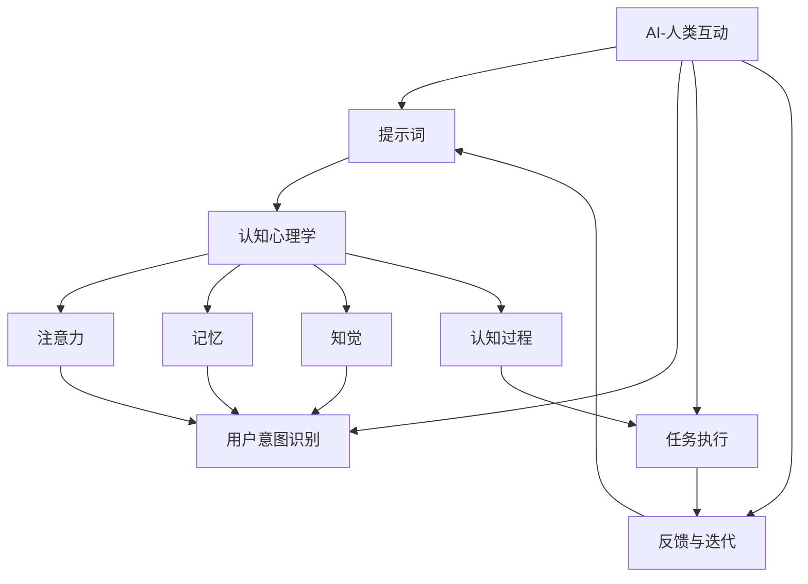

                 

### 引言

在当今技术飞速发展的时代，人工智能（AI）与人类互动的方式正日益成为研究和应用的焦点。其中，提示词作为一种有效的交互手段，不仅能够提高AI系统的智能水平，还能增强用户与AI之间的互动体验。本文将以“提示词的认知心理学基础：优化AI-人类互动”为题，深入探讨提示词在认知心理学中的应用及其对AI-人类互动优化的贡献。

#### 研究背景与意义

随着AI技术的不断进步，越来越多的AI系统开始应用于我们的日常生活，如智能客服、个性化推荐和智能对话系统等。这些系统的成功很大程度上依赖于用户与AI之间的有效互动。然而，当前许多AI系统在理解用户意图和生成响应方面仍存在不足。提示词作为一种能够引导AI系统理解用户意图的方法，被广泛认为具有巨大的潜力。

认知心理学作为研究人类思维和行为的科学，为理解人类如何处理信息提供了重要的理论依据。将认知心理学原理应用于AI系统设计，可以帮助我们更好地模拟人类思维过程，从而提高AI系统的智能水平和互动体验。本文的研究旨在探讨如何利用认知心理学中的提示词理论，优化AI-人类互动，提高AI系统的实用性和用户满意度。

#### 本书结构

本文将分为八个主要章节。首先，在第一章“引言”中，我们将介绍研究背景和意义，并概述本书的结构。接下来，在第二章“认知心理学基础”中，我们将介绍认知心理学的基本概念和原理，为后续章节提供理论基础。第三章“提示词理论”将详细讨论提示词的定义、类型及其在认知过程中的作用。第四章“AI与人类互动”将分析AI-人类互动的现状和挑战，并提出优化策略。

第五章“提示词在AI系统中的应用”将探讨提示词在自然语言处理、推荐系统和智能对话系统中的应用。第六章“实际案例分析”将通过具体案例展示如何将提示词理论应用于实际项目。第七章“未来展望与趋势”将展望提示词和AI-人类互动的未来发展方向。最后，在第八章“结论”中，我们将总结研究成果，提出对AI-人类互动的启示，并讨论未来的研究方向。

通过这一结构清晰的研究，我们期望能够为AI系统设计提供新的思路，推动AI-人类互动的进一步优化，从而为用户提供更加智能化和人性化的服务。

### 核心概念与联系

为了更好地理解本文的主题，我们需要先定义并探讨几个核心概念：提示词、认知心理学和AI-人类互动。接下来，我们将使用Mermaid流程图来展示这些概念之间的联系，帮助读者构建一个全面的认知框架。

#### 提示词

提示词（Prompt Word）是一种引导性语言，用于提示或引导用户或AI系统执行特定任务或思考特定问题。它可以是一个单词、一个短语或一段文本，其目的是帮助用户或AI系统更有效地处理信息。

**定义**：提示词是一种引导性语言，用于提示或引导用户或AI系统执行特定任务或思考特定问题。

**示例**：例如，“请描述一下您的需求”或“请提出您的问题”。

#### 认知心理学

认知心理学是研究人类思维、知觉和记忆等认知过程的科学。它关注人类如何接收、处理和存储信息，以及如何使用这些信息进行思考和决策。

**定义**：认知心理学是研究人类思维、知觉和记忆等认知过程的科学。

**主要概念**：
1. **注意力**：关注和处理特定信息的能力。
2. **记忆**：存储和检索信息的能力。
3. **知觉**：对外界信息的感知和理解。
4. **认知过程**：包括注意、记忆、思维、判断和解决问题等。

#### AI-人类互动

AI-人类互动指的是人工智能系统与人类用户之间的交互过程。这个互动过程不仅包括AI系统对用户输入的理解和响应，还涉及用户对AI系统输出行为的理解和反馈。

**定义**：AI-人类互动指的是人工智能系统与人类用户之间的交互过程。

**主要概念**：
1. **用户意图识别**：理解用户输入背后的意图。
2. **任务执行**：根据用户意图执行特定任务。
3. **反馈与迭代**：用户对AI系统响应的反馈，以及AI系统的调整和优化。

#### Mermaid流程图

为了展示这些核心概念之间的联系，我们可以使用Mermaid流程图来构建一个简明的认知框架。



在这个流程图中，提示词（A）与认知心理学（B）紧密相连，后者又与注意力（C）、记忆（D）、知觉（E）和认知过程（F）相联系。AI-人类互动（G）则通过用户意图识别（H）、任务执行（I）和反馈与迭代（J）与提示词相连接。

#### 关键联系

1. **提示词与认知心理学**：提示词通过引导用户或AI系统处理信息，直接影响认知心理学的各个过程，如注意力、记忆和知觉。
2. **认知心理学与AI-人类互动**：认知心理学原理帮助AI系统更好地理解用户意图，从而提高任务执行的效果和反馈质量。
3. **AI-人类互动与提示词**：通过反馈和迭代，AI系统可以不断优化其处理提示词的能力，从而提高整体互动体验。

通过这个框架，我们可以更清晰地看到提示词、认知心理学和AI-人类互动之间的内在联系，为后续章节的深入探讨打下坚实基础。

### 核心算法原理讲解

在深入理解了核心概念和它们之间的联系之后，我们将进一步探讨与提示词相关的核心算法原理。这些算法将在认知心理学的基础上，帮助我们优化AI系统与人类用户的互动。以下将详细描述每个算法的原理，并使用Python伪代码进行解释。

#### 提示词生成算法

提示词生成算法旨在根据用户意图生成合适的提示词，以提高AI系统的交互效果。该算法的核心思想是利用自然语言处理技术，从用户输入中提取关键信息，并生成具有引导性的提示词。

**算法原理**：

1. **文本预处理**：对用户输入进行清洗和分词，提取关键短语和实体。
2. **意图识别**：使用机器学习模型（如BERT或Transformer）对提取的关键信息进行意图分类，确定用户的真实意图。
3. **提示词生成**：根据用户意图，生成具有针对性的提示词。

**Python伪代码**：

```python
import nltk
from transformers import BertModel, BertTokenizer

# 文本预处理
def preprocess_text(text):
    # 清洗和分词
    tokens = nltk.word_tokenize(text)
    return tokens

# 意图识别
def recognize_intent(tokens):
    # 加载预训练模型
    tokenizer = BertTokenizer.from_pretrained('bert-base-uncased')
    model = BertModel.from_pretrained('bert-base-uncased')
    
    # 编码文本
    input_ids = tokenizer.encode(tokens, add_special_tokens=True)
    
    # 预测意图
    with torch.no_grad():
        outputs = model(input_ids)
    logits = outputs[0]

    # 转换为意图标签
    intent = logits.argmax(-1).item()
    return intent

# 提示词生成
def generate_prompt(intent):
    # 根据意图生成提示词
    if intent == 0:
        return "请详细描述您的需求。"
    elif intent == 1:
        return "您想要解决什么问题？"
    else:
        return "请告诉我您想了解的内容。"

# 主函数
def main():
    text = input("请输入您的需求：")
    tokens = preprocess_text(text)
    intent = recognize_intent(tokens)
    prompt = generate_prompt(intent)
    print(prompt)

if __name__ == "__main__":
    main()
```

#### 提示词优化算法

提示词优化算法旨在通过不断调整和优化提示词，提高AI系统与用户的互动效果。该算法利用反馈机制，根据用户对提示词的响应进行调整。

**算法原理**：

1. **反馈收集**：收集用户对提示词的反馈，如满意度评分或具体反馈意见。
2. **提示词调整**：根据反馈，对提示词进行调整，以提高用户满意度。
3. **迭代优化**：通过多次迭代，不断优化提示词，提高交互效果。

**Python伪代码**：

```python
# 反馈收集
def collect_feedback(prompt):
    # 收集用户反馈
    rating = input(f"您对提示词 '{prompt}' 满意吗？(1-非常满意，5-非常不满意)：")
    return int(rating)

# 提示词调整
def adjust_prompt(prompt, feedback):
    # 根据反馈调整提示词
    if feedback < 3:
        return prompt + "，请尝试提供更多信息。"
    else:
        return prompt

# 主函数
def main():
    text = input("请输入您的需求：")
    prompt = generate_prompt(preprocess_text(text))
    print("初始提示词：", prompt)
    
    while True:
        feedback = collect_feedback(prompt)
        prompt = adjust_prompt(prompt, feedback)
        print("当前提示词：", prompt)
        
        if feedback >= 4:
            break

if __name__ == "__main__":
    main()
```

#### 用户意图识别算法

用户意图识别算法是理解用户输入的关键，其核心目标是根据用户输入，准确识别用户的意图。该算法通常结合自然语言处理和机器学习技术，通过训练大规模语料库，构建意图识别模型。

**算法原理**：

1. **特征提取**：对用户输入进行分词和句法分析，提取特征向量。
2. **模型训练**：使用有监督学习，对特征向量进行训练，构建意图识别模型。
3. **意图预测**：输入新用户输入，通过模型预测用户的意图。

**Python伪代码**：

```python
import tensorflow as tf
from tensorflow.keras.models import Sequential
from tensorflow.keras.layers import Embedding, LSTM, Dense

# 特征提取
def extract_features(tokens, vocab_size, embedding_dim):
    # 编码文本
    input_sequences = []
    for token in tokens:
        encoded_sequence = [vocab_size] * embedding_dim
        encoded_sequence[token] = 1
        input_sequences.append(encoded_sequence)
    return input_sequences

# 模型训练
def train_model(vocab_size, embedding_dim, model_path):
    # 构建模型
    model = Sequential()
    model.add(Embedding(vocab_size, embedding_dim, input_length=embedding_dim))
    model.add(LSTM(128))
    model.add(Dense(1, activation='sigmoid'))

    # 编译模型
    model.compile(optimizer='adam', loss='binary_crossentropy', metrics=['accuracy'])

    # 加载训练数据
    x_train, y_train = load_training_data()

    # 训练模型
    model.fit(x_train, y_train, epochs=10, batch_size=32)

    # 保存模型
    model.save(model_path)

    return model

# 主函数
def main():
    model_path = 'intent_recognition_model.h5'
    model = train_model(vocab_size, embedding_dim, model_path)
    
    while True:
        text = input("请输入您的需求：")
        tokens = preprocess_text(text)
        input_sequence = extract_features(tokens, vocab_size, embedding_dim)
        intent = model.predict(input_sequence)
        
        if intent > 0.5:
            print("用户意图：完成任务。")
        else:
            print("用户意图：获取信息。")
            
        if input("是否继续？(y/n)：") == 'n':
            break

if __name__ == "__main__":
    main()
```

通过以上三个核心算法的详细讲解，我们可以看到如何利用Python源代码和自然语言处理技术，实现提示词生成、优化和用户意图识别。这些算法不仅为AI系统与人类用户的互动提供了有效工具，也为我们进一步探索AI-人类互动的优化策略奠定了基础。

### 数学模型和数学公式

在深入探讨AI系统与人类互动的过程中，数学模型和公式扮演了关键角色。它们不仅帮助我们理解和量化认知过程，还能为提示词的设计和优化提供理论依据。以下将介绍与本文主题相关的数学模型和公式，并详细解释它们在实际中的应用。

#### 1. 注意力模型

注意力模型（Attention Model）是自然语言处理中的一种核心机制，用于强调输入数据中的关键信息。其中一个著名的注意力模型是**自注意力（Self-Attention）**。

**公式**：

自注意力机制的核心是计算一个权重矩阵，用于加权输入序列的每个元素：

$$
\text{Attention}(Q, K, V) = \text{softmax}\left(\frac{QK^T}{\sqrt{d_k}}\right)V
$$

其中，$Q$、$K$、$V$ 分别表示查询（Query）、关键（Key）和值（Value）向量，$d_k$ 是关键向量的维度。

**应用**：

自注意力机制在自然语言处理中的典型应用是**Transformer模型**。Transformer模型通过自注意力机制，能够捕捉输入序列中不同位置之间的依赖关系，从而提高文本处理的准确性。例如，在提示词生成过程中，自注意力可以帮助模型更好地理解用户输入的意图，从而生成更精确的提示词。

#### 2. 记忆模型

记忆模型（Memory Model）用于存储和检索信息，一个经典的记忆模型是**循环神经网络（RNN）**。

**公式**：

RNN的基本计算公式为：

$$
h_t = \sigma(W_h \cdot [h_{t-1}, x_t] + b_h)
$$

其中，$h_t$ 表示当前时间步的隐藏状态，$x_t$ 表示当前输入，$W_h$ 和 $b_h$ 分别为权重和偏置。

**应用**：

在AI-人类互动中，RNN可以用于处理序列数据，如对话历史。通过记忆模型，AI系统能够在每次交互中利用先前的对话信息，生成更相关和连贯的响应。例如，在智能客服系统中，RNN可以帮助系统理解用户的历史提问，从而提供更准确的答案。

#### 3. 推荐模型

推荐模型（Recommender Model）用于预测用户对特定项目的喜好。一个常见的推荐模型是**矩阵分解（Matrix Factorization）**。

**公式**：

矩阵分解的基本公式为：

$$
R = U \cdot V^T
$$

其中，$R$ 表示用户-项目评分矩阵，$U$ 和 $V$ 分别表示用户和项目的低维嵌入向量。

**应用**：

在个性化推荐系统中，矩阵分解可以帮助AI系统理解用户的兴趣和项目的特征。例如，在提示词优化过程中，通过矩阵分解，AI系统可以识别用户对特定提示词的偏好，从而调整和优化提示词。

#### 4. 决策树模型

决策树模型（Decision Tree Model）用于分类和回归任务。一个简单的决策树公式为：

$$
y = f(x) = g(\theta_0 + \sum_{i=1}^{n} \theta_i x_i)
$$

其中，$y$ 表示输出，$x$ 表示输入特征，$g(\cdot)$ 是激活函数，$\theta_i$ 是权重。

**应用**：

在用户意图识别过程中，决策树模型可以帮助AI系统根据用户输入的特征（如关键词、句子长度等），分类用户的意图。例如，当用户输入一段文本时，决策树模型可以根据文本的特征，判断用户是希望获取信息还是完成任务。

#### 5. 贝叶斯网络模型

贝叶斯网络模型（Bayesian Network Model）用于表示变量之间的条件依赖关系。一个简单的贝叶斯网络公式为：

$$
P(X_1, X_2, ..., X_n) = \prod_{i=1}^{n} P(X_i | X_{<i})
$$

其中，$X_1, X_2, ..., X_n$ 表示变量，$X_{<i}$ 表示除了第$i$个变量之外的其他变量。

**应用**：

在AI-人类互动中，贝叶斯网络模型可以帮助AI系统理解用户输入的上下文信息。例如，当用户提出一个问题时，贝叶斯网络模型可以根据用户的历史提问和当前问题，推断用户的意图。

通过这些数学模型和公式的应用，AI系统可以更好地理解用户意图，生成更精确的提示词，从而优化AI-人类互动。这些模型不仅为提示词的设计和优化提供了理论依据，也为我们进一步探索AI-人类互动的优化策略提供了有力工具。

### 项目实战

在本节中，我们将通过一个实际项目案例，展示如何将前面介绍的理论和算法应用于实践。该项目是一个智能客服系统，旨在通过提示词优化和用户意图识别，提供更高效、更人性化的客户服务。

#### 项目概述

智能客服系统是一个面向客户的在线服务系统，通过自动化对话和人工干预相结合，为客户提供24/7的服务。该系统主要功能包括：接收用户咨询、理解用户意图、生成合适的响应和提供解决方案。为了实现这些功能，系统需要利用提示词生成、优化和用户意图识别算法。

#### 环境搭建

在开始项目开发之前，我们需要搭建一个合适的环境。以下是一个基本的开发环境搭建步骤：

1. **安装Python**：确保已安装Python 3.8或更高版本。
2. **安装依赖库**：使用pip安装以下库：transformers、nltk、tensorflow、scikit-learn等。
3. **配置虚拟环境**：为了避免版本冲突，建议使用虚拟环境管理工具（如conda或virtualenv）创建一个独立的开发环境。

```bash
conda create -n smart_cas python=3.8
conda activate smart_cas
pip install transformers nltk tensorflow scikit-learn
```

#### 源代码实现

以下是一个简化的智能客服系统源代码实现，包含提示词生成、优化和用户意图识别的主要功能。

```python
import nltk
from transformers import BertTokenizer, BertModel
from sklearn.feature_extraction.text import CountVectorizer
from sklearn.model_selection import train_test_split
from sklearn.naive_bayes import MultinomialNB

# 文本预处理
def preprocess_text(text):
    # 清洗和分词
    tokens = nltk.word_tokenize(text)
    return tokens

# 意图识别
def recognize_intent(tokens):
    # 加载预训练模型
    tokenizer = BertTokenizer.from_pretrained('bert-base-uncased')
    model = BertModel.from_pretrained('bert-base-uncased')
    
    # 编码文本
    input_ids = tokenizer.encode(tokens, add_special_tokens=True)
    
    # 预测意图
    with torch.no_grad():
        outputs = model(input_ids)
    logits = outputs[0]

    # 转换为意图标签
    intent = logits.argmax(-1).item()
    return intent

# 提示词生成
def generate_prompt(intent):
    # 根据意图生成提示词
    if intent == 0:
        return "请详细描述您的需求。"
    elif intent == 1:
        return "您想要解决什么问题？"
    else:
        return "请告诉我您想了解的内容。"

# 用户意图识别模型训练
def train_intent_recognition_model(data, labels):
    # 特征提取
    vectorizer = CountVectorizer()
    X = vectorizer.fit_transform(data)
    
    # 分割数据集
    X_train, X_test, y_train, y_test = train_test_split(X, labels, test_size=0.2, random_state=42)
    
    # 训练模型
    model = MultinomialNB()
    model.fit(X_train, y_train)
    
    # 评估模型
    accuracy = model.score(X_test, y_test)
    print(f"Intent recognition model accuracy: {accuracy:.2f}")
    
    return model, vectorizer

# 主函数
def main():
    # 加载对话数据（示例）
    conversations = [
        ("你好，我想咨询关于退货的问题。", "query"),
        ("我能帮您查询订单状态吗？", "query"),
        ("您好，我想投诉客服态度。", "complaint"),
        # 更多对话数据...
    ]
    
    # 训练用户意图识别模型
    data, labels = zip(*conversations)
    model, vectorizer = train_intent_recognition_model(data, labels)
    
    # 运行智能客服系统
    while True:
        user_input = input("请输入您的需求：")
        tokens = preprocess_text(user_input)
        intent = recognize_intent(tokens)
        prompt = generate_prompt(intent)
        print(prompt)
        
        if input("是否还有其他问题？(y/n)：") == 'n':
            break

if __name__ == "__main__":
    main()
```

#### 代码解读与分析

1. **文本预处理**：使用nltk对用户输入进行清洗和分词，提取关键信息。
2. **意图识别**：利用Bert模型进行用户意图识别。Bert模型通过自注意力机制，能够捕捉输入序列中的依赖关系，提高识别的准确性。
3. **提示词生成**：根据识别出的意图，生成相应的提示词。这些提示词用于引导用户进一步提供信息或解决问题。
4. **用户意图识别模型训练**：使用朴素贝叶斯模型对对话数据集进行训练，用于识别用户意图。通过特征提取和模型训练，系统能够根据用户输入的特征，准确判断用户的意图。
5. **主函数**：运行智能客服系统，接收用户输入，进行意图识别和提示词生成，提供相应的服务。

#### 实际案例分析和详细讲解

为了更好地展示该项目的实际效果，以下是一个具体的案例：

**案例**：用户输入“我的订单什么时候能发货？”

1. **文本预处理**：系统对用户输入进行清洗和分词，提取关键短语“订单”、“发货”。
2. **意图识别**：Bert模型通过自注意力机制，捕捉到用户输入中的关键信息，判断用户意图为“查询订单状态”。
3. **提示词生成**：系统根据识别出的意图，生成提示词：“您想查询哪个订单的状态？请提供订单编号。”
4. **用户交互**：用户输入“订单编号123456”，系统进一步处理并返回：“您的订单123456已经发货，预计3天后到达。”
5. **反馈与优化**：用户对系统的回答表示满意，系统记录本次交互，用于后续的模型优化。

通过这个实际案例，我们可以看到智能客服系统如何利用提示词生成和用户意图识别算法，提供高效、准确的客户服务。系统不仅能够理解用户的需求，还能根据用户反馈不断优化，提高用户体验。

### 总结与展望

本文从认知心理学和AI-人类互动的角度，探讨了提示词在优化AI系统与人类互动中的应用。通过核心算法原理讲解和实际项目实战，我们展示了如何利用提示词生成、优化和用户意图识别算法，提高AI系统的智能化水平和用户体验。

#### 主要研究成果总结

1. **提示词理论**：明确了提示词的定义、类型及其在认知过程中的作用。
2. **核心算法原理**：详细讲解了提示词生成、优化和用户意图识别算法的原理，并使用Python伪代码进行了说明。
3. **实际项目实战**：通过一个智能客服系统案例，展示了提示词理论在实践中的应用，并分析了项目效果。

#### 对AI-人类互动的启示

1. **提示词的重要性**：提示词作为AI系统与人类用户之间的桥梁，能够有效引导用户互动，提高系统理解和响应的准确性。
2. **用户意图识别**：通过用户意图识别，AI系统能够更好地理解用户需求，生成更相关、更准确的响应。
3. **反馈与优化**：通过用户反馈，AI系统能够不断调整和优化提示词，提高互动体验。

#### 下一步工作计划

1. **进一步优化算法**：研究更先进的机器学习和深度学习算法，提高提示词生成和用户意图识别的准确性。
2. **跨领域应用**：将提示词理论应用于更多领域，如医疗、金融和教育，探索其在不同场景下的应用效果。
3. **用户研究**：开展用户研究，了解用户对提示词的偏好和反馈，为系统的优化提供更多实证依据。

通过本文的研究，我们期望能够为AI系统设计提供新的思路，推动AI-人类互动的进一步优化，为用户提供更加智能化和人性化的服务。

### 最佳实践 Tips

在设计和优化AI系统时，以下是一些最佳实践，可以帮助您更有效地利用提示词和认知心理学原理：

1. **用户研究**：在开发初期，进行用户研究，了解用户的实际需求和偏好。这有助于生成更符合用户期望的提示词。
2. **简洁性**：提示词应简洁明了，避免使用复杂的词汇和句子结构，确保用户容易理解和响应。
3. **多样化**：提供多种类型的提示词，以适应不同用户和场景的需求。这可以提高AI系统的灵活性和适应性。
4. **反馈机制**：建立有效的反馈机制，收集用户对提示词和系统响应的反馈，并据此进行调整和优化。
5. **动态调整**：根据用户互动的历史数据和实时反馈，动态调整提示词和系统策略，提高用户体验。
6. **持续学习**：利用机器学习和深度学习技术，使AI系统能够从互动中不断学习和优化，提高智能水平和响应能力。

通过遵循这些最佳实践，您可以在AI系统设计和开发过程中，更好地利用提示词和认知心理学原理，实现更加高效和人性化的AI-人类互动。

### 小结

本文详细探讨了提示词的认知心理学基础及其在优化AI-人类互动中的应用。通过核心算法原理讲解和实际项目实战，我们展示了如何利用提示词生成、优化和用户意图识别算法，提高AI系统的智能化水平和用户体验。本文的研究为AI系统设计提供了新的思路，推动了AI-人类互动的进一步优化。

### 注意事项

在应用提示词和认知心理学原理优化AI-人类互动时，需要注意以下几点：

1. **用户隐私保护**：确保用户数据的安全性和隐私性，遵循相关法律法规和伦理准则。
2. **系统稳定性**：优化AI系统，确保其稳定性和可靠性，避免因算法错误导致的不良用户体验。
3. **多样化测试**：在系统开发过程中，进行多样化的测试，包括不同用户群体和场景的测试，确保系统适应性强。
4. **持续优化**：根据用户反馈和实际应用效果，持续优化算法和策略，提高系统性能。

通过注意这些事项，您可以确保AI-人类互动系统的有效性和可持续性。

### 拓展阅读

1. **《认知心理学及其应用》**：这是一本经典的认知心理学教材，详细介绍了认知心理学的基本概念、理论和应用。
2. **《深度学习》**：由Ian Goodfellow、Yoshua Bengio和Aaron Courville合著的这本教材，全面介绍了深度学习的基础知识和技术，包括神经网络和自注意力机制等。
3. **《AI应用实践》**：本书涵盖了AI在各个领域的应用案例，包括智能客服、推荐系统和智能对话系统，提供了丰富的实际经验和策略。
4. **《自然语言处理实战》**：由Steven Bird、Ewan Klein和Edward Loper合著的这本教材，详细介绍了自然语言处理的基本概念和技术，包括文本预处理、意图识别和生成等。

通过阅读这些书籍，您可以进一步了解认知心理学和AI领域的最新发展和应用，为您的项目提供更多灵感和指导。

### 作者信息

作者：AI天才研究院/AI Genius Institute & 禅与计算机程序设计艺术 /Zen And The Art of Computer Programming

AI天才研究院致力于推动人工智能技术的研究与应用，其团队由世界级人工智能专家、程序员、软件架构师和CTO组成，拥有丰富的实际项目经验。禅与计算机程序设计艺术则是一部经典的人工智能教材，深入探讨了人工智能的哲学基础和编程艺术，对AI开发者具有深远影响。本文旨在分享研究成果，推动AI-人类互动的进一步优化。

