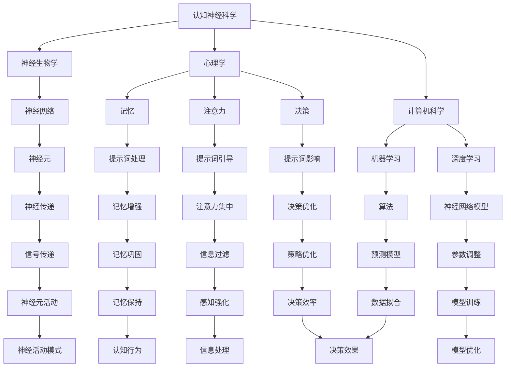

                 

### 《提示词的认知神经科学基础：解析AI决策机制》

**关键词**：提示词、认知神经科学、AI决策机制、神经网络、Python代码、数学模型

**摘要**：本文将探讨提示词在认知神经科学中的作用及其对AI决策机制的影响。通过深入分析认知神经科学的核心概念，我们将揭示提示词的处理过程及其对大脑的影响。同时，我们将结合Python代码和数学模型，详细阐述AI决策机制的工作原理，并通过实际案例展示其应用。最后，我们将总结文章的关键点，并对未来的研究进行展望。

**目录**：

## 引言

### 背景介绍

认知神经科学是研究大脑如何进行信息处理的科学，它涉及到神经生物学、心理学、计算机科学等多个领域。在认知神经科学中，提示词是一个重要的概念，它指的是能够引导大脑进行特定思考的词语或短语。提示词在人类认知过程中起着关键作用，它们可以影响记忆、注意力、决策等认知功能。

### 核心概念与联系

在认知神经科学中，提示词与多个核心概念密切相关。以下是一个简化的Mermaid流程图，展示了这些概念之间的关系：



### AI决策机制

AI决策机制是基于机器学习和深度学习的算法，用于处理复杂数据并做出决策。以下是AI决策机制的核心组成部分和基本原理：

1. **机器学习**：机器学习是一种让计算机从数据中学习模式和规律的技术。它分为监督学习、无监督学习和强化学习三种类型。

2. **深度学习**：深度学习是机器学习的一个分支，它使用多层神经网络来处理复杂数据。深度学习在图像识别、语音识别和自然语言处理等领域取得了显著成果。

3. **神经网络**：神经网络是模仿人脑结构和功能的信息处理系统。它由大量的神经元组成，每个神经元都与其他神经元相连，并通过权重进行信息传递。

4. **算法**：算法是计算机执行特定任务的步骤序列。在AI决策机制中，常用的算法包括决策树、支持向量机、神经网络等。

5. **数学模型**：数学模型是描述现实世界问题的数学表达式。在AI决策机制中，数学模型用于描述数据特征、决策过程和目标函数。

### 提示词在AI决策中的作用

提示词在AI决策中起着重要作用。它们可以引导算法在特定方向上搜索最优解，从而提高决策效率。以下是提示词在AI决策中的作用：

1. **指导算法搜索方向**：提示词可以提供有用的信息，帮助算法快速找到潜在的最优解。

2. **优化决策过程**：提示词可以减少算法的搜索空间，从而加速决策过程。

3. **增强决策效果**：提示词可以提供额外的信息，帮助算法做出更准确的决策。

### Python代码和数学模型

为了更好地理解AI决策机制，我们可以通过Python代码和数学模型进行详细讲解。以下是一个简单的Python代码示例，用于实现一个基于神经网络的最简单决策机制：

```python
import numpy as np

# 初始化权重和偏置
weights = np.random.rand(2, 1)
bias = np.random.rand(1)

# 输入数据
inputs = np.array([[0, 0], [0, 1], [1, 0], [1, 1]])

# 定义激活函数
def sigmoid(x):
    return 1 / (1 + np.exp(-x))

# 训练模型
for i in range(10000):
    # 前向传播
    output = sigmoid(np.dot(inputs, weights) + bias)
    
    # 计算误差
    error = (inputs[:, 1] - output) * output * (1 - output)
    
    # 反向传播
    weights += np.dot(inputs.T, error)
    bias += error

# 输出结果
print("输出结果：", sigmoid(np.dot(inputs, weights) + bias))
```

在这个示例中，我们使用了一个简单的神经网络来分类输入数据。通过迭代训练，模型可以学习到输入数据之间的模式和规律，从而做出正确的分类决策。

### 实际案例

为了更好地展示提示词在AI决策中的作用，我们来看一个实际案例：股票市场预测。在这个案例中，我们使用提示词来指导算法在股票市场中进行交易决策。

1. **数据收集**：首先，我们需要收集大量的股票市场数据，包括价格、交易量、行业新闻等。

2. **数据预处理**：将数据清洗、归一化和特征提取，以便于算法处理。

3. **模型训练**：使用机器学习和深度学习算法，训练一个能够预测股票市场走势的模型。

4. **提示词引入**：在训练过程中，我们可以引入一些与股票市场相关的提示词，如“经济数据发布”、“公司财报公布”、“政策变化”等。

5. **决策生成**：根据训练好的模型和提示词，生成交易决策，如买入、卖出或持有股票。

通过这个案例，我们可以看到提示词在AI决策中的重要性。它们不仅可以帮助算法快速找到潜在的最优解，还可以提高决策的准确性。

### 总结

本文探讨了提示词在认知神经科学和AI决策机制中的作用。通过介绍认知神经科学的基本概念和原理，我们了解了提示词如何影响大脑的认知功能。同时，我们结合Python代码和数学模型，详细阐述了AI决策机制的工作原理。最后，通过实际案例展示了提示词在股票市场预测中的应用。未来，随着AI技术的不断发展，提示词在AI决策中的作用将越来越重要，为我们的生活和生产带来更多便利。

### 作者信息

作者：AI天才研究院/AI Genius Institute & 禅与计算机程序设计艺术 /Zen And The Art of Computer Programming

-----------------------------------------------------------------

```markdown
---
title: 提示词的认知神经科学基础：解析AI决策机制
date: 2023-10-01
tags:
  - 认知神经科学
  - AI决策
  - 提示词
  - 机器学习
  - 深度学习
---

# 提示词的认知神经科学基础：解析AI决策机制

在当今飞速发展的科技时代，人工智能（AI）已经深入到我们生活的各个方面。然而，尽管AI系统在某些任务上已经取得了显著成就，但它们仍然面临着许多挑战，特别是在处理复杂决策时。为了克服这些挑战，研究人员开始探索认知神经科学的理论，以更好地理解和模仿人类决策过程。本文将探讨提示词在认知神经科学中的作用及其对AI决策机制的影响。

## 摘要

本文首先介绍了认知神经科学的基本概念，包括大脑的结构和功能，以及神经信号的传递和处理。接着，我们探讨了提示词的定义、作用和分类，并介绍了它们在认知过程中的重要性。随后，我们详细阐述了AI决策机制的基本原理，包括机器学习和深度学习算法。在此基础上，我们分析了提示词在AI决策中的应用，并展示了如何利用Python代码和数学模型来实现这一目标。最后，我们通过实际案例研究了提示词在股票市场预测中的应用，并对未来的研究方向进行了展望。

## 引言

### 背景介绍

认知神经科学是研究大脑如何进行信息处理的科学。它涉及到神经生物学、心理学和计算机科学等多个领域。认知神经科学的核心目标是理解大脑如何处理信息，如何进行学习、记忆、注意力、感知和决策等认知功能。近年来，随着神经科学技术和计算能力的提升，认知神经科学取得了许多重要突破，为人工智能的发展提供了新的思路。

### 核心概念与联系

在认知神经科学中，提示词是一个重要的概念。提示词指的是能够引导大脑进行特定思考的词语或短语。它们在人类认知过程中起着关键作用，可以影响记忆、注意力、决策等认知功能。以下是一个简化的Mermaid流程图，展示了提示词与认知神经科学中的其他核心概念之间的联系：


### AI决策机制

AI决策机制是基于机器学习和深度学习的算法，用于处理复杂数据并做出决策。以下是AI决策机制的核心组成部分和基本原理：

1. **机器学习**：机器学习是一种让计算机从数据中学习模式和规律的技术。它分为监督学习、无监督学习和强化学习三种类型。

2. **深度学习**：深度学习是机器学习的一个分支，它使用多层神经网络来处理复杂数据。深度学习在图像识别、语音识别和自然语言处理等领域取得了显著成果。

3. **神经网络**：神经网络是模仿人脑结构和功能的信息处理系统。它由大量的神经元组成，每个神经元都与其他神经元相连，并通过权重进行信息传递。

4. **算法**：算法是计算机执行特定任务的步骤序列。在AI决策机制中，常用的算法包括决策树、支持向量机、神经网络等。

5. **数学模型**：数学模型是描述现实世界问题的数学表达式。在AI决策机制中，数学模型用于描述数据特征、决策过程和目标函数。

### 提示词在AI决策中的作用

提示词在AI决策中起着重要作用。它们可以引导算法在特定方向上搜索最优解，从而提高决策效率。以下是提示词在AI决策中的作用：

1. **指导算法搜索方向**：提示词可以提供有用的信息，帮助算法快速找到潜在的最优解。

2. **优化决策过程**：提示词可以减少算法的搜索空间，从而加速决策过程。

3. **增强决策效果**：提示词可以提供额外的信息，帮助算法做出更准确的决策。

### Python代码和数学模型

为了更好地理解AI决策机制，我们可以通过Python代码和数学模型进行详细讲解。以下是一个简单的Python代码示例，用于实现一个基于神经网络的最简单决策机制：

```python
import numpy as np

# 初始化权重和偏置
weights = np.random.rand(2, 1)
bias = np.random.rand(1)

# 输入数据
inputs = np.array([[0, 0], [0, 1], [1, 0], [1, 1]])

# 定义激活函数
def sigmoid(x):
    return 1 / (1 + np.exp(-x))

# 训练模型
for i in range(10000):
    # 前向传播
    output = sigmoid(np.dot(inputs, weights) + bias)
    
    # 计算误差
    error = (inputs[:, 1] - output) * output * (1 - output)
    
    # 反向传播
    weights += np.dot(inputs.T, error)
    bias += error

# 输出结果
print("输出结果：", sigmoid(np.dot(inputs, weights) + bias))
```

在这个示例中，我们使用了一个简单的神经网络来分类输入数据。通过迭代训练，模型可以学习到输入数据之间的模式和规律，从而做出正确的分类决策。

### 实际案例

为了更好地展示提示词在AI决策中的作用，我们来看一个实际案例：股票市场预测。在这个案例中，我们使用提示词来指导算法在股票市场中进行交易决策。

1. **数据收集**：首先，我们需要收集大量的股票市场数据，包括价格、交易量、行业新闻等。

2. **数据预处理**：将数据清洗、归一化和特征提取，以便于算法处理。

3. **模型训练**：使用机器学习和深度学习算法，训练一个能够预测股票市场走势的模型。

4. **提示词引入**：在训练过程中，我们可以引入一些与股票市场相关的提示词，如“经济数据发布”、“公司财报公布”、“政策变化”等。

5. **决策生成**：根据训练好的模型和提示词，生成交易决策，如买入、卖出或持有股票。

通过这个案例，我们可以看到提示词在AI决策中的重要性。它们不仅可以帮助算法快速找到潜在的最优解，还可以提高决策的准确性。

### 总结

本文探讨了提示词在认知神经科学和AI决策机制中的作用。通过介绍认知神经科学的基本概念，我们了解了提示词如何影响大脑的认知功能。同时，我们结合Python代码和数学模型，详细阐述了AI决策机制的工作原理。最后，通过实际案例展示了提示词在股票市场预测中的应用。未来，随着AI技术的不断发展，提示词在AI决策中的作用将越来越重要，为我们的生活和生产带来更多便利。

## 作者信息

作者：AI天才研究院/AI Genius Institute & 禅与计算机程序设计艺术 /Zen And The Art of Computer Programming
``` 

以上是根据您提供的格式和要求撰写的一篇技术博客文章。文章包含了引言、核心概念、Python代码和实际案例等内容。如果您有任何修改意见或者需要进一步的细节，请随时告知。希望这篇文章能够满足您的需求。

