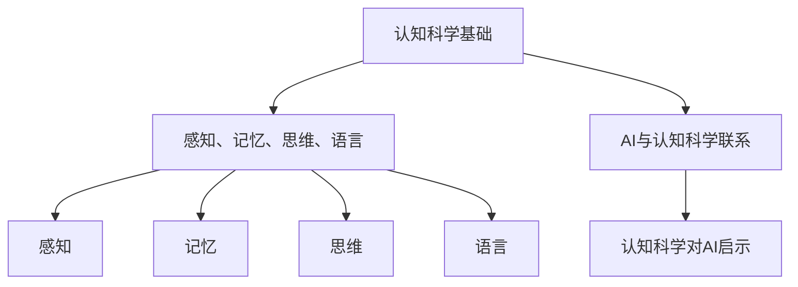

                 

### 引言

随着人工智能（AI）技术的迅猛发展，其应用范围越来越广泛，从自动驾驶汽车到智能医疗诊断，AI正在深刻地改变着我们的生活方式。然而，在AI决策过程中，我们不禁要问：AI的决策过程是否真正理解了其所需解决的问题，是否能够像人类一样做出明智的决策？答案就在于提示词（Prompt）这一关键概念。

提示词在认知科学和人工智能领域中具有重要的基础作用。它不仅影响了人类的思维过程，也深刻地影响了AI的决策过程。本文将深入探讨提示词的认知科学基础，理解其在AI决策过程中的关键作用，并分析其在实际应用中的表现与挑战。

首先，我们需要了解认知科学的定义与历史。认知科学是一门跨学科的研究领域，旨在理解人类和动物的心理活动，包括感知、记忆、思维和语言等。其发展历史可以追溯到20世纪中叶，随着计算机科学的兴起和认知心理学的出现，认知科学逐渐成形并得到了广泛的认可。

接着，本文将介绍认知过程中的几个核心概念，如感知、记忆、思维和语言，并探讨它们与提示词的关系。在此基础上，我们将讨论AI与认知科学的联系，以及认知科学对AI决策的启示。这部分内容将帮助我们理解AI如何利用认知原理来提升其决策能力。

随后，我们将探讨AI决策过程的基础，包括决策过程的定义、类型和模型，以及人工智能在决策过程中的应用。这部分内容将为我们分析提示词在AI决策中的应用提供基础。

接下来，本文将重点介绍提示词的概念、功能及其在认知科学中的研究。通过这一部分，我们将深入理解提示词在AI决策过程中的作用机制。

随后，我们将分析提示词在AI决策中的应用，包括监督学习、无监督学习和智能决策系统中的应用。这部分内容将帮助我们了解提示词在实际AI系统中的作用。

最后，本文将探讨提示词在AI伦理与安全性中的重要性，以及如何应对相关的伦理和安全挑战。这部分内容将帮助我们全面理解提示词在AI领域的复杂性和重要性。

通过上述分析，本文旨在提供一个全面、深入的视角，以理解提示词在认知科学和人工智能决策过程中的基础作用。这不仅有助于我们更好地设计AI系统，也有助于我们深入探讨AI伦理和安全性问题。

关键词：认知科学，人工智能，提示词，决策过程，监督学习，无监督学习，智能决策系统，AI伦理

摘要：本文通过探讨认知科学基础和AI决策过程，深入分析了提示词在人工智能决策过程中的关键作用。从提示词的定义、功能到其在实际应用中的表现和挑战，本文提供了全面、深入的视角，以理解提示词在AI领域的复杂性和重要性。通过这一研究，我们不仅能够更好地设计AI系统，还能更深入地探讨AI伦理和安全性问题。

# 第1章 认知科学基础

## 1.1 认知科学概述

### 1.1.1 认知科学的定义与历史

认知科学是一门跨学科的研究领域，旨在理解人类和动物的心理活动，包括感知、记忆、思维和语言等。它融合了心理学、神经科学、计算机科学和哲学等多个学科的知识，试图从多个角度探讨人类认知的机制与过程。

认知科学的历史可以追溯到20世纪中叶。最初，心理学和哲学是研究认知的主要学科，但随着计算机科学的兴起，这些领域开始相互交叉和融合。1956年，在达特茅斯会议上，约翰·麦卡锡（John McCarthy）等人首次提出了“人工智能”这一概念，标志着人工智能作为一门独立学科的开始。随后，认知科学逐渐成形，并在20世纪80年代得到了广泛的认可。

### 1.1.2 认知科学的研究领域

认知科学的研究领域非常广泛，涵盖了多个子领域，主要包括以下方面：

1. **感知**：研究人类如何接收和处理外部信息，包括视觉、听觉、触觉等感知通道。
2. **记忆**：研究记忆的形成、存储和检索过程，包括短期记忆和长期记忆。
3. **思维**：研究人类如何进行逻辑推理、问题解决和创造性思维等。
4. **语言**：研究人类语言的使用和语言处理机制，包括语音识别、语义理解和语法生成等。

除了上述核心研究领域，认知科学还涉及其他相关领域，如认知神经科学、认知心理学、认知人工智能等。

## 1.2 认知过程

认知过程是指人类在接收、处理和利用信息时所经历的一系列心理活动。以下是认知过程中的几个核心概念：

### 1.2.1 感知

感知是指人类对外部世界的感知和识别过程。它涉及感觉器官接收外部刺激，并将其转化为神经信号，最终在大脑中处理和解释。感知过程不仅依赖于感官本身，还受到个体经验、期望和文化背景的影响。

### 1.2.2 记忆

记忆是认知过程中的关键组成部分，它涉及信息的存储、检索和应用。根据信息存储的时间长度和存储机制，记忆可分为短期记忆和长期记忆。短期记忆主要涉及信息在工作记忆中的短暂存储和加工，而长期记忆则涉及信息在大脑中的持久存储和检索。

### 1.2.3 思维

思维是人类认知的高级形式，涉及问题解决、决策制定、推理和创造性思维等。思维过程不仅依赖于感知和记忆，还受到认知策略和认知风格的影响。认知心理学研究表明，人们可以通过不同的策略来优化思维过程，提高解决问题的效率和质量。

### 1.2.4 语言

语言是人类认知的核心工具，它不仅用于沟通和表达，还参与了认知过程的各个方面。语言处理涉及语音识别、语义理解和语法生成等，这些过程与感知、记忆和思维密切相关。

## 1.3 认知模型

认知模型是认知科学研究中的重要工具，用于模拟和解释人类认知过程。以下是一些常见的认知模型：

### 1.3.1 注意力模型

注意力模型研究人类如何选择和处理信息。它通常涉及注意力的分配机制和注意力资源的限制。注意力模型对于理解人类感知、记忆和思维过程中的选择性和局限性具有重要意义。

### 1.3.2 记忆模型

记忆模型研究记忆的形成、存储和检索过程。常见的记忆模型包括平行分布式处理模型、工作记忆模型和长期记忆模型。这些模型有助于我们理解记忆的复杂性和多样性。

### 1.3.3 思维模型

思维模型研究人类思维过程，包括逻辑推理、问题解决和创造性思维等。常见的思维模型包括产生式模型、情境模型和图灵机模型。这些模型为我们提供了不同的视角来理解思维的本质。

### 1.3.4 语言模型

语言模型研究人类语言的使用和语言处理机制。常见的语言模型包括转换-生成语法模型、神经网络模型和递归神经网络模型。这些模型在自然语言处理和语言生成中具有重要应用。

通过以上对认知科学基础的分析，我们可以更好地理解人类认知过程的复杂性。接下来，本文将探讨AI与认知科学的联系，以及认知科学对AI决策的启示。

## 1.4 AI与认知科学的联系

人工智能（AI）的发展与认知科学有着密切的联系，两者在研究目标和理论基础方面有着诸多交集。AI的许多关键概念和技术都源自认知科学的研究成果，而认知科学也在AI的应用中得到了验证和发展。

### 1.4.1 AI在认知科学中的应用

AI在认知科学中的应用主要体现在以下几个方面：

1. **认知模拟**：通过构建计算机模型来模拟人类的认知过程，如感知、记忆和思维等。这些模型有助于我们理解认知机制和过程，从而为AI系统的设计提供理论基础。
   
2. **认知辅助**：利用AI技术来辅助人类的认知过程，如记忆增强、注意力管理和决策支持等。这些应用不仅提高了人类的工作效率，还改善了生活质量。

3. **神经科学研究**：AI技术在神经科学研究中的应用，如大脑功能成像、神经元活动分析等，为认知神经科学提供了强有力的工具。

### 1.4.2 机器学习在认知科学研究中的应用

机器学习（ML）是AI的核心技术之一，它在认知科学研究中具有广泛的应用：

1. **模式识别**：机器学习算法可以用于识别和分类各种认知模式，如语音识别、图像识别和文本分类等。这些技术在认知科学研究中的应用有助于揭示认知过程的规律。

2. **预测和模拟**：通过机器学习算法，可以预测认知过程中的各种变化，如记忆衰退、注意力波动等。这些预测模型有助于我们更好地理解认知过程的动态性。

3. **异常检测**：机器学习算法可以用于检测认知过程中的异常行为，如认知障碍、精神疾病等。这些技术为早期诊断和治疗提供了可能性。

### 1.4.3 认知科学对AI的启示

认知科学的研究成果对AI的发展产生了重要影响，主要表现在以下几个方面：

1. **启发式算法**：认知科学中的启发式策略，如问题解决、决策制定和搜索算法等，为AI系统提供了重要的设计灵感。这些启发式算法在AI中的应用，如搜索算法、决策树和神经网络等，极大地提升了AI系统的效率和准确性。

2. **注意力机制**：认知科学中的注意力模型对AI系统的设计具有重要启示。例如，深度学习中的注意力机制就是受认知科学中注意力模型启发而发展起来的，它有助于提高模型对重要信息的处理能力。

3. **记忆模型**：认知科学中的记忆模型为AI系统的记忆管理提供了理论基础。例如，基于长期依赖记忆网络（LSTM）的模型就是受到认知科学中短期记忆和长期记忆模型的启发。

4. **学习策略**：认知科学中的学习策略，如强化学习和迁移学习等，为AI系统提供了新的学习方式。这些策略在AI中的应用，如强化学习中的策略优化和迁移学习中的模型迁移等，有助于提高AI系统的学习效率和适应性。

综上所述，AI与认知科学的联系不仅体现在技术和应用层面，还体现在理论基础和研究方法上。通过借鉴认知科学的研究成果，AI不仅能够更好地模拟和辅助人类认知过程，还能推动认知科学的发展，实现两者的共同进步。

### 1.5 认知模型在AI决策中的应用

认知模型在AI决策过程中扮演了关键角色，为AI系统提供了模拟人类决策过程的框架。以下将探讨认知模型在AI决策中的具体应用，以及它们如何帮助AI系统做出更为合理和高效的决策。

#### 1.5.1 认知模型在决策树中的应用

决策树是一种常见的监督学习算法，其核心在于通过一系列条件判断来对数据进行分类或回归。认知模型中的决策树类似于人类在决策过程中使用的条件判断机制。在决策树中，每个节点代表一个条件判断，每个分支代表条件满足或不满足时的决策路径。通过这种结构，决策树能够模拟人类在复杂决策环境下的思维过程。

例如，在金融风险评估中，决策树可以用来评估客户的信用风险。通过一系列的条件判断，如客户的年龄、收入、信用历史等，决策树能够预测客户是否可能违约。这种基于认知模型的方法使得AI系统能够像人类专家一样进行风险评估，从而提高决策的准确性和效率。

#### 1.5.2 认知模型在神经网络中的应用

神经网络，尤其是深度神经网络，在AI决策中得到了广泛应用。认知模型中的神经网络通过多层非线性变换来处理输入信息，从而实现复杂的决策功能。这种结构类似于人类大脑中神经元网络的工作方式，使得神经网络能够在处理复杂决策问题时表现出强大的能力和适应性。

例如，在医疗诊断中，深度神经网络可以用来分析患者的医疗数据，如影像、病历等，以诊断疾病。神经网络通过学习大量医学数据，能够识别出疾病的特征和规律，从而做出准确的诊断。这种基于认知模型的方法不仅提高了诊断的准确性，还减少了人为误差。

#### 1.5.3 认知启发式在AI系统设计中的作用

认知启发式是指基于人类认知原理和经验的一种问题解决策略，它对于AI系统设计具有重要启示。例如，在搜索和优化问题中，启发式搜索算法（如A*搜索算法）通过借鉴人类解决问题的策略，能够在复杂环境中找到最优解或近似最优解。

在资源分配问题中，认知启发式可以帮助AI系统优化资源的利用。例如，在交通流量管理中，基于认知启发式的算法可以实时调整交通信号，以减少交通拥堵和提高通行效率。这种基于认知模型的方法使得AI系统能够更加灵活和自适应地应对复杂问题。

#### 1.5.4 认知模型在智能决策系统中的实际应用

智能决策系统（IDSS）是一种结合AI技术和决策理论的系统，它利用认知模型来模拟人类决策过程，并提供决策支持。在实际应用中，智能决策系统广泛应用于金融、医疗、物流等领域。

例如，在金融领域，智能决策系统可以用于风险管理和投资决策。通过分析市场数据、历史交易记录和客户行为等，智能决策系统能够预测市场趋势和客户需求，从而制定最优的投资策略。这种基于认知模型的方法不仅提高了决策的准确性，还减少了投资风险。

在医疗领域，智能决策系统可以用于疾病诊断和治疗建议。通过分析患者的病史、体检结果和医疗文献等，智能决策系统能够提供个性化的诊断和治疗建议，从而提高医疗服务的质量和效率。这种基于认知模型的方法有助于提高诊断的准确性和治疗的有效性。

综上所述，认知模型在AI决策中的应用为AI系统提供了模拟人类决策过程的框架。通过借鉴人类认知原理和经验，认知模型能够帮助AI系统做出更为合理和高效的决策，从而在实际应用中发挥重要作用。

## 第2章 AI决策过程的基础

### 2.1 决策过程的概述

决策过程是指个体或组织在面临选择时，通过分析和评估不同选项，选择最佳行动方案的过程。决策过程不仅涉及到逻辑推理和数据分析，还包括情感、价值观和经验等多种因素。理解决策过程的本质和类型，对于设计高效的AI决策系统至关重要。

#### 2.1.1 决策的定义与类型

决策的定义可以从不同角度进行解释。广义上，决策是指在面对多种可能的选择时，做出一种明确的选择过程。狭义上，决策则是指基于特定情境，通过逻辑推理和分析，选择最佳行动方案的过程。

决策可以分为多种类型，其中常见的包括：

1. **确定型决策**：在决策过程中，所有可能的结果及其概率都是已知的，决策者可以基于概率和预期效用来选择最佳行动方案。
   
2. **不确定型决策**：在决策过程中，可能的结果及其概率是未知的或不确定的，决策者需要基于自己的判断和经验来选择最佳行动方案。

3. **风险型决策**：在决策过程中，所有可能的结果及其概率是已知的，但每种结果都有其负效用，决策者需要考虑风险和损失来选择最佳行动方案。

4. **群体决策**：在决策过程中，多个个体或组织共同参与决策，通过讨论和协商来选择最佳行动方案。

#### 2.1.2 个人决策与群体决策

个人决策和群体决策在决策过程中有着不同的特点：

1. **个人决策**：个人决策通常由单个个体根据个人知识和经验做出。个人决策的优势在于决策速度快，决策者对决策有完全的控制权，但缺点是可能缺乏全面的视角和多元化意见。

2. **群体决策**：群体决策涉及多个个体共同参与，通过讨论和协商来做出决策。群体决策的优势在于能够整合不同个体的知识和经验，提高决策的全面性和准确性，但缺点是决策过程较慢，可能存在协调和沟通问题。

#### 2.1.3 决策模型

决策模型是用于分析和指导决策的工具，主要包括以下几种：

1. **决策树模型**：决策树模型通过一系列条件判断来模拟决策过程。每个节点代表一个条件判断，每个分支代表条件满足或不满足时的决策路径。决策树模型简单直观，适用于分析和解释决策过程。

2. **风险分析模型**：风险分析模型用于评估不同决策结果的概率和风险。常见的风险分析模型包括概率树、敏感性分析等。这些模型有助于决策者识别和评估决策过程中的风险因素。

3. **效用理论模型**：效用理论模型基于决策者的偏好和价值观，评估不同决策结果的效用值。通过计算预期效用，决策者可以选择具有最高预期效用的行动方案。

4. **博弈论模型**：博弈论模型用于分析多个个体在决策过程中的互动和竞争。常见的博弈论模型包括纳什均衡、合作博弈等。这些模型有助于决策者分析不同决策方案在竞争环境中的表现。

### 2.2 人工智能在决策过程中的应用

人工智能（AI）在决策过程中扮演着越来越重要的角色，通过模拟和优化人类决策过程，提高了决策的效率和准确性。以下将介绍AI在决策过程中的几种主要应用：

#### 2.2.1 机器学习在决策支持系统中的应用

机器学习（ML）是一种重要的AI技术，广泛应用于决策支持系统中。机器学习算法可以通过学习大量历史数据，识别出数据中的模式和规律，从而辅助决策者做出更准确的决策。

1. **监督学习**：监督学习算法通过学习输入和输出之间的关系，实现对未知数据的分类或回归。常见的监督学习算法包括线性回归、逻辑回归、支持向量机等。这些算法可以用于风险评估、客户分类等场景。

2. **无监督学习**：无监督学习算法通过分析数据分布和结构，实现对未知数据的聚类或降维。常见的无监督学习算法包括K-均值聚类、主成分分析等。这些算法可以用于市场细分、数据预处理等场景。

3. **强化学习**：强化学习算法通过不断尝试和反馈，学习最优的行动策略。常见的强化学习算法包括Q学习、深度强化学习等。这些算法可以用于自动化控制、游戏玩法优化等场景。

#### 2.2.2 智能决策支持系统

智能决策支持系统（IDSS）是一种结合AI技术和决策理论的系统，旨在提供全面的决策支持。IDSS通过集成数据采集、数据分析、模型预测等功能，为决策者提供实时、准确的决策建议。

1. **数据采集**：IDSS通过传感器、数据库等渠道，实时采集与决策相关的数据。

2. **数据分析**：IDSS利用数据挖掘、机器学习等技术，分析数据中的模式和趋势，为决策提供依据。

3. **模型预测**：IDSS基于历史数据和决策理论，建立预测模型，预测未来可能的结果和风险。

4. **决策建议**：IDSS根据预测结果，为决策者提供最佳行动方案和建议，提高决策的准确性和效率。

#### 2.2.3 智能决策系统的分类

智能决策系统根据其功能和应用场景，可以分为以下几种类型：

1. **专家系统**：专家系统是一种基于规则和知识的决策系统，通过模拟人类专家的决策过程，为决策者提供决策建议。专家系统广泛应用于医疗诊断、金融风险评估等领域。

2. **数据挖掘系统**：数据挖掘系统通过分析大量数据，识别出隐藏的模式和趋势，为决策者提供数据支持。数据挖掘系统广泛应用于市场营销、客户关系管理等领域。

3. **优化系统**：优化系统通过优化算法，求解复杂决策问题，为决策者提供最优行动方案。优化系统广泛应用于资源分配、物流优化等领域。

4. **混合系统**：混合系统结合了多种AI技术和决策理论，提供全面的决策支持。混合系统广泛应用于智能交通、智能医疗等领域。

综上所述，AI在决策过程中的应用极大地提高了决策的效率和准确性。通过机器学习、智能决策支持系统和优化算法等技术的应用，AI为决策者提供了强大的决策支持，推动了决策科学的发展。

### 2.3 机器学习在决策支持系统中的应用

机器学习（ML）在决策支持系统中扮演了关键角色，通过学习历史数据和模式，为决策者提供有价值的预测和决策建议。以下将详细介绍机器学习在决策支持系统中的应用，包括监督学习、无监督学习和强化学习等主要类型。

#### 2.3.1 监督学习

监督学习是一种最常用的机器学习方法，它通过训练一个模型，使模型能够根据输入特征预测输出标签。在决策支持系统中，监督学习算法广泛应用于分类和回归问题。

1. **分类问题**：分类问题是指将数据分为若干预定义的类别。常见的分类算法包括：
   - **线性回归**：通过构建线性模型，预测数据的类别。例如，应用在信用评分系统中，根据客户的财务数据预测其信用等级。
   - **支持向量机（SVM）**：通过找到一个最佳的超平面，将不同类别的数据分隔开来。例如，应用在文本分类系统中，根据文本内容预测其主题类别。
   - **决策树**：通过一系列条件判断，将数据划分为不同的类别。例如，应用在医疗诊断系统中，根据患者的症状和体征预测疾病的类型。

2. **回归问题**：回归问题是指预测数据的连续值。常见的回归算法包括：
   - **线性回归**：通过拟合一条直线或曲线，预测数据的变化趋势。例如，应用在股票价格预测系统中，根据历史价格数据预测未来的股票价格。
   - **岭回归**：通过加入正则项，防止模型过拟合。例如，应用在贷款审批系统中，根据借款人的财务状况预测其还款能力。
   - **LASSO回归**：通过加入L1正则项，实现变量选择。例如，应用在信用风险评估系统中，根据借款人的各种特征预测其信用风险。

#### 2.3.2 无监督学习

无监督学习是指没有明确输出标签的机器学习方法，通过分析数据分布和结构，为决策提供支持。在决策支持系统中，无监督学习算法广泛应用于聚类和降维等任务。

1. **聚类问题**：聚类问题是指将数据划分为若干组，使同组数据之间的相似度较高，不同组数据之间的相似度较低。常见的聚类算法包括：
   - **K-均值聚类**：通过迭代更新聚类中心，将数据点分配到不同的聚类中。例如，应用在市场细分系统中，根据消费者的购买行为将市场划分为不同的细分市场。
   - **层次聚类**：通过逐步合并或分裂聚类，构建层次结构。例如，应用在客户关系管理系统中，根据客户的行为和需求将客户划分为不同的群体。

2. **降维问题**：降维问题是指通过减少数据维度，降低数据复杂度和计算成本。常见的降维算法包括：
   - **主成分分析（PCA）**：通过线性变换，将数据投影到新的坐标系中，保留主要的信息。例如，应用在图像处理系统中，通过PCA压缩图像数据，减少存储和传输成本。
   - **局部线性嵌入（LLE）**：通过保持局部结构相似性，将高维数据映射到低维空间中。例如，应用在文本数据降维系统中，通过LLE降低文本数据的维度，提高文本检索的效率。

#### 2.3.3 强化学习

强化学习是一种基于反馈的机器学习方法，通过不断尝试和反馈，学习最优的行动策略。在决策支持系统中，强化学习算法广泛应用于策略优化和智能控制等任务。

1. **策略优化**：策略优化是指通过学习最优策略，使系统在特定环境下获得最大的奖励。常见的策略优化算法包括：
   - **Q学习**：通过评估不同行动策略的效用值，选择最优策略。例如，应用在推荐系统中，根据用户的浏览和点击行为，学习出最优的推荐策略，提高用户满意度。
   - **深度Q网络（DQN）**：通过神经网络模型，评估不同行动策略的效用值，学习最优策略。例如，应用在自动驾驶系统中，根据环境传感器的输入，学习出最优的驾驶策略，提高行车安全。

2. **智能控制**：智能控制是指利用机器学习算法，实现自动控制系统的优化和自动化。常见的智能控制算法包括：
   - **自适应控制**：通过不断调整控制参数，使系统达到最优状态。例如，应用在无人机系统中，通过自适应控制算法，使无人机在复杂环境中稳定飞行。
   - **模型预测控制**：通过建立系统模型，预测未来系统的行为，并调整控制参数。例如，应用在工业生产过程中，通过模型预测控制算法，优化生产参数，提高生产效率。

综上所述，机器学习在决策支持系统中的应用，不仅提高了决策的效率和准确性，还为决策者提供了丰富的工具和方法，以应对复杂的决策环境。通过监督学习、无监督学习和强化学习等不同类型的学习算法，机器学习为决策支持系统提供了强大的技术支持，推动了决策科学的发展。

### 2.4 智能决策支持系统（IDSS）

智能决策支持系统（IDSS）是一种利用人工智能（AI）技术，为决策者提供全面、实时决策支持的系统。IDSS通过集成数据采集、数据分析、模型预测和决策建议等功能，帮助决策者做出更加准确和高效的决策。以下将介绍智能决策支持系统的定义、组成、工作原理及其在不同领域的应用。

#### 2.4.1 定义与组成

智能决策支持系统（IDSS）是一种基于AI技术的决策支持系统，它利用机器学习、数据挖掘、优化算法等先进技术，对大量数据进行处理和分析，为决策者提供决策依据和建议。IDSS通常由以下几个核心组成部分构成：

1. **数据采集模块**：数据采集模块负责收集与决策相关的数据，包括结构化数据、半结构化数据和非结构化数据。这些数据可以来自内部数据库、传感器、互联网等不同渠道。

2. **数据处理模块**：数据处理模块负责对收集到的数据进行清洗、转换和整合，以确保数据的准确性和一致性。数据处理模块通常包括数据预处理、数据转换和数据存储等功能。

3. **数据分析模块**：数据分析模块利用数据挖掘和机器学习技术，对处理后的数据进行深入分析，识别数据中的模式和趋势。数据分析模块可以应用于分类、回归、聚类、降维等多种分析任务。

4. **模型预测模块**：模型预测模块基于历史数据和数据分析结果，建立预测模型，预测未来的趋势和结果。常见的预测模型包括线性回归模型、决策树模型、神经网络模型等。

5. **决策建议模块**：决策建议模块根据预测模型和决策算法，为决策者提供最佳行动方案和建议。决策建议模块可以基于规则、优化算法、启发式方法等多种决策算法，为决策者提供全方位的决策支持。

#### 2.4.2 工作原理

智能决策支持系统（IDSS）的工作原理可以概括为以下几个步骤：

1. **数据采集**：IDSS通过数据采集模块收集与决策相关的数据，包括历史数据、实时数据和外部数据。

2. **数据处理**：IDSS对采集到的数据进行分析和清洗，去除噪声和异常值，确保数据的质量和一致性。

3. **数据分析**：IDSS利用数据分析模块对处理后的数据进行分析，识别数据中的模式和趋势。数据分析结果可以用于建立预测模型、优化决策算法等。

4. **模型预测**：IDSS基于历史数据和数据分析结果，建立预测模型，预测未来的趋势和结果。预测模型可以用于决策者制定决策方案。

5. **决策建议**：IDSS根据预测模型和决策算法，为决策者提供最佳行动方案和建议。决策建议可以根据决策者的需求进行个性化调整，以提高决策的准确性和效率。

#### 2.4.3 应用领域

智能决策支持系统（IDSS）在许多领域得到了广泛应用，以下列举了几个典型应用领域：

1. **金融领域**：在金融领域，IDSS可以用于风险控制、投资决策、市场预测等。例如，通过分析历史交易数据和宏观经济数据，IDSS可以预测市场趋势，为投资者提供投资建议。

2. **医疗领域**：在医疗领域，IDSS可以用于疾病诊断、治疗建议、药物研发等。通过分析患者的病历、体检数据和医学文献，IDSS可以提供个性化的治疗方案，提高医疗服务的质量和效率。

3. **物流领域**：在物流领域，IDSS可以用于运输优化、库存管理、配送路径规划等。通过分析历史运输数据和实时交通信息，IDSS可以优化物流运作，提高运输效率和降低成本。

4. **工业制造**：在工业制造领域，IDSS可以用于生产计划、设备维护、质量控制等。通过分析生产数据和历史故障数据，IDSS可以预测设备故障，制定预防性维护计划，提高生产效率和设备利用率。

5. **城市管理**：在城市建设领域，IDSS可以用于城市规划、交通管理、环境保护等。通过分析城市数据和传感器数据，IDSS可以优化城市资源分配，提高城市管理的效率和可持续性。

综上所述，智能决策支持系统（IDSS）通过集成AI技术和决策理论，为决策者提供了全面、实时的决策支持。其在各个领域的广泛应用，不仅提高了决策的效率和准确性，还为相关领域的发展带来了新的机遇和挑战。

## 第3章 提示词与认知科学

### 3.1 提示词的概念

提示词（Prompt）在认知科学和人工智能（AI）领域扮演着重要角色，它是指用来引导个体或系统关注特定信息、执行特定任务或解决问题的一种信号或指示。在认知科学中，提示词被广泛用于研究记忆、思维和语言等认知过程。在AI领域，提示词则被用来指导模型学习、优化性能和改进决策。

#### 3.1.1 提示词的定义

提示词的定义可以从不同角度进行解释。在认知科学中，提示词被定义为一种能够影响注意力和记忆的信号，它可以是视觉的、听觉的、语言的形式，也可以是内部思维过程的表现。例如，在学习过程中，教师给出的问题和提示，可以帮助学生更好地理解和记忆学习内容。

在AI领域，提示词通常是指用来引导模型学习或执行特定任务的输入信号。例如，在自然语言处理（NLP）中，提示词可以是问题、指令或关键词，它们引导模型生成回答或执行特定任务。

#### 3.1.2 提示词的作用

提示词在认知过程中具有多种作用，主要包括以下几个方面：

1. **引导注意力**：提示词可以引导个体或系统关注特定的信息，从而提高注意力的集中程度。例如，在学习过程中，教师的提示词可以帮助学生将注意力集中在关键知识点上，提高学习效果。

2. **促进记忆**：提示词可以增强记忆的编码和检索过程。例如，在学习外语时，通过使用关键词或短语作为提示词，可以帮助学习者更好地记忆新词汇。

3. **指导思维**：提示词可以引导个体的思维过程，促进问题解决和创造性思维。例如，在科学研究中，提示词可以帮助研究者发现新的研究问题和解决方案。

4. **优化决策**：在AI系统中，提示词可以指导模型进行更准确的决策。例如，在自动驾驶系统中，提示词可以帮助车辆识别道路标志、预测行人行为等，从而做出更安全的驾驶决策。

#### 3.1.3 提示词的类型

根据提示词的形式和功能，可以将提示词分为以下几种类型：

1. **视觉提示词**：视觉提示词是指通过视觉信号来引导个体或系统关注特定信息的提示词。例如，在图像识别任务中，标注框、颜色或文字说明等都是常见的视觉提示词。

2. **听觉提示词**：听觉提示词是指通过听觉信号来引导个体或系统关注特定信息的提示词。例如，在语音识别任务中，问题、指令或关键词等都是常见的听觉提示词。

3. **语言提示词**：语言提示词是指通过语言信号来引导个体或系统关注特定信息的提示词。例如，在自然语言处理任务中，问题、指令或关键词等都是常见的语言提示词。

4. **内部提示词**：内部提示词是指个体或系统内部产生的信号，用来引导自身注意力和思维过程。例如，在自我反思和问题解决过程中，个体会使用内部提示词来引导自己的思考。

### 3.2 提示词的功能

提示词在认知过程中的功能多种多样，对记忆、问题解决和决策等认知活动具有显著的促进作用。以下将详细探讨提示词在认知过程中的主要功能。

#### 3.2.1 提示词在记忆中的作用

记忆是认知过程中的关键组成部分，而提示词在记忆的形成、存储和检索过程中发挥着重要作用。提示词可以通过以下几种方式促进记忆：

1. **编码促进**：提示词可以帮助个体更好地编码信息，使其更容易进入长期记忆。例如，在学习新词汇时，使用提示词（如同义词或短语）可以帮助学习者更好地理解和记忆新词汇。

2. **组织记忆**：提示词可以帮助个体对信息进行分类和组织，从而提高记忆的效率。例如，在学习历史事件时，使用提示词（如年代、地点、人物）可以帮助学习者将事件进行分类和组织，提高记忆效果。

3. **检索促进**：提示词可以增强记忆的检索过程，使个体能够更快地找到所需信息。例如，在复习考试内容时，使用关键词作为提示词可以帮助学习者快速回忆起相关知识点。

#### 3.2.2 提示词在问题解决中的作用

提示词在问题解决过程中同样发挥着重要作用，它可以帮助个体识别问题、分析问题和提出解决方案。以下是提示词在问题解决中的几个关键作用：

1. **问题识别**：提示词可以帮助个体识别问题，明确问题的性质和范围。例如，在解决数学问题时，使用提示词（如“证明”、“计算”）可以帮助个体明确问题的类型和解决方法。

2. **问题分析**：提示词可以帮助个体分析问题，了解问题的相关因素和条件。例如，在解决复杂商业问题时，使用提示词（如“成本”、“市场”、“竞争”）可以帮助个体全面分析问题。

3. **方案提出**：提示词可以帮助个体提出解决问题的方案，并评估不同方案的优缺点。例如，在决策过程中，使用提示词（如“可行性”、“效益”、“风险”）可以帮助个体提出并评估不同解决方案。

#### 3.2.3 提示词在决策中的作用

决策是认知过程中的重要环节，而提示词在决策过程中发挥着关键作用，可以帮助个体或系统做出更明智的决策。以下是提示词在决策中的几个关键作用：

1. **信息筛选**：提示词可以帮助个体或系统筛选关键信息，排除无关或次要的信息，从而提高决策的效率和准确性。例如，在医疗诊断中，医生可以使用提示词（如“症状”、“病史”、“检查结果”）来筛选关键信息，做出更准确的诊断。

2. **权重分配**：提示词可以帮助个体或系统对不同的决策因素进行权重分配，从而更全面地考虑决策因素。例如，在投资决策中，使用提示词（如“风险”、“收益”、“市场趋势”）可以帮助投资者对不同的投资因素进行权重分配，做出更明智的投资决策。

3. **方案评估**：提示词可以帮助个体或系统评估不同决策方案的优缺点，从而选择最佳方案。例如，在项目评估中，使用提示词（如“成本”、“进度”、“质量”）可以帮助评估不同项目的绩效，选择最佳项目方案。

综上所述，提示词在认知过程中的功能多样且重要，它不仅影响记忆、问题解决和决策等认知活动，还为AI系统的学习和优化提供了有力支持。通过深入理解提示词的作用机制，我们可以更好地设计认知辅助系统和智能决策系统，提升人类和机器的决策能力。

### 3.3 认知科学对提示词的研究

在认知科学中，提示词是一个重要的研究课题，其研究和应用涵盖了多个研究领域。以下将从认知机制和认知模型两个方面，探讨认知科学对提示词的研究。

#### 3.3.1 提示词的认知机制

提示词的认知机制研究主要集中在提示词如何影响个体的注意力和记忆，以及其在大脑中的处理过程。以下是几个关键的研究方向：

1. **注意力机制**：注意力机制是指大脑如何选择和关注特定的信息。提示词通过激活特定的神经网络和大脑区域，引导注意力资源集中于相关任务。例如，视觉提示词可以激活视觉皮层，听觉提示词可以激活听觉皮层。研究表明，提示词能够提高个体对目标信息的关注程度，减少认知负荷，从而提高认知效率和准确性。

2. **记忆机制**：提示词在记忆过程中发挥着重要作用，它可以通过激活相关神经元和神经网络，促进信息的编码、存储和检索。例如，在记忆提取过程中，提示词可以激活与记忆相关的神经网络，帮助个体迅速找到所需信息。此外，提示词还可以通过联想记忆的方式，将新信息与已有知识联系起来，增强记忆效果。

3. **认知负荷**：提示词通过降低认知负荷，帮助个体更好地处理信息。认知负荷是指个体在认知任务中所需处理的认知资源。提示词可以提供额外的信息，帮助个体更好地理解和记忆任务，从而减轻认知负荷。例如，在学习新概念时，提示词可以提供相关的背景知识和例子，帮助学习者更好地理解概念。

#### 3.3.2 提示词的认知模型

认知模型是认知科学研究的重要工具，用于模拟和解释人类认知过程。以下介绍几种与提示词相关的认知模型：

1. **注意网络模型**：注意网络模型（Attention Networks）是近年来发展起来的一种认知模型，旨在解释人类如何选择和处理信息。该模型包括三种类型的注意机制：选择性注意、执行注意和情境注意。选择性注意是指大脑如何选择关注特定的信息，执行注意是指大脑如何维持对特定信息的关注，情境注意是指大脑如何根据当前情境调整注意力分配。提示词可以通过激活注意网络中的特定机制，引导个体关注和处理相关任务。

2. **记忆网络模型**：记忆网络模型（Memory Networks）是一种用于模拟人类记忆过程的认知模型。该模型将记忆视为一个动态的、可查询的网络，通过查询网络中的相关信息，实现信息的存储和检索。提示词在记忆网络模型中扮演着关键角色，它可以通过激活相关记忆节点，促进信息的编码、存储和检索。

3. **问题解决模型**：问题解决模型（Problem Solving Models）是用于模拟人类问题解决过程的认知模型。该模型包括几个关键组件：问题表征、策略选择、执行和评估。提示词在问题解决过程中可以提供关键信息，帮助个体更好地理解和解决问题。例如，在科学研究中，提示词可以提供相关实验数据、理论背景和已知解决方案，帮助研究者提出新的研究问题和解决方案。

4. **决策模型**：决策模型（Decision Models）是用于模拟人类决策过程的认知模型。该模型包括几个关键组件：问题识别、方案评估、决策选择和反馈。提示词在决策过程中可以提供关键信息，帮助个体更好地评估不同方案的优缺点，从而做出更明智的决策。例如，在投资决策中，提示词可以提供市场趋势、财务数据和风险评估信息，帮助投资者评估不同投资方案的收益和风险。

综上所述，认知科学对提示词的研究涉及多个领域，包括注意力机制、记忆机制、认知负荷和认知模型等。这些研究不仅帮助我们更好地理解提示词的作用机制，还为设计智能认知系统和智能决策系统提供了重要的理论基础。

### 3.4 提示词在AI决策过程中的作用机制

在人工智能（AI）系统中，提示词起着至关重要的角色，它不仅影响着模型的学习过程，还直接关系到决策的准确性和效率。通过理解提示词在AI决策过程中的作用机制，我们可以更好地优化AI系统，提高其决策能力。以下将详细探讨提示词在AI决策过程中的几个关键作用机制。

#### 3.4.1 提示词在模型学习中的指导作用

在AI模型的学习过程中，提示词起到了引导和加速学习的作用。具体体现在以下几个方面：

1. **问题定义**：提示词可以帮助模型明确学习任务的目标和范围，从而更专注于相关信息的处理。例如，在自然语言处理（NLP）任务中，提示词可以明确模型需要回答的问题类型，如“分类问题”或“信息检索问题”。

2. **数据筛选**：提示词可以帮助模型筛选出与任务相关的数据，减少无关数据的干扰，提高学习的效率和准确性。例如，在图像识别任务中，提示词可以指示模型关注图像中的特定对象或特征，从而提高识别准确率。

3. **知识引导**：提示词可以提供额外的知识信息，帮助模型更好地理解学习任务。例如，在机器阅读理解任务中，提示词可以提供上下文信息和问题背景，帮助模型更好地理解文本内容。

#### 3.4.2 提示词在决策过程中的优化作用

在AI决策过程中，提示词可以通过以下方式优化决策过程：

1. **信息筛选**：提示词可以帮助模型筛选出关键信息，排除无关或次要的信息，从而提高决策的效率和准确性。例如，在医疗诊断系统中，提示词可以指示模型关注患者的症状和病史，从而快速做出准确的诊断。

2. **权重分配**：提示词可以帮助模型对不同的决策因素进行权重分配，从而更全面地考虑决策因素。例如，在投资决策中，提示词可以指示模型关注市场的风险和收益，帮助投资者做出更明智的投资决策。

3. **方案评估**：提示词可以帮助模型评估不同决策方案的优缺点，从而选择最佳方案。例如，在项目评估中，提示词可以指示模型关注项目的成本、进度和质量，帮助项目管理者选择最佳的项目方案。

#### 3.4.3 提示词在模型优化中的提升作用

提示词在AI模型优化过程中也发挥着重要作用，通过以下方式提升模型性能：

1. **性能调整**：提示词可以提供额外的训练数据，帮助模型调整性能参数。例如，在深度学习模型中，通过添加有针对性的提示词训练数据，可以优化模型的预测精度和泛化能力。

2. **过拟合预防**：提示词可以帮助模型识别和避免过拟合现象。例如，在分类任务中，提示词可以指示模型关注整体数据分布，避免模型对特定数据点过度拟合。

3. **模型解释**：提示词可以提供额外的解释信息，帮助模型解释其决策过程。例如，在医疗诊断模型中，提示词可以解释模型如何根据症状和检查结果做出诊断决策。

#### 3.4.4 提示词在实时决策中的动态调整作用

在实时决策环境中，提示词的作用尤为关键，它可以动态调整模型的行为，以适应不断变化的环境。以下是提示词在实时决策中的动态调整作用：

1. **环境感知**：提示词可以提供实时环境信息，帮助模型感知和适应环境变化。例如，在自动驾驶系统中，提示词可以提供交通状况、道路标志等信息，帮助车辆做出实时驾驶决策。

2. **动态调整**：提示词可以指示模型根据环境变化动态调整决策策略。例如，在物流调度系统中，提示词可以指示模型根据实时订单信息，动态调整配送路径和配送顺序。

3. **反馈优化**：提示词可以提供实时反馈信息，帮助模型不断优化决策过程。例如，在游戏AI中，提示词可以提供玩家的行为信息，帮助AI调整策略，提高胜率。

综上所述，提示词在AI决策过程中的作用机制涵盖了模型学习、决策优化、模型优化和实时决策等多个方面。通过深入理解和应用提示词，我们可以显著提升AI系统的决策能力，实现更智能、更高效的决策。

### 3.5 提示词在监督学习中的应用

在监督学习中，提示词作为输入特征的一部分，对模型的训练和预测过程具有重要影响。以下是提示词在监督学习中的应用，以及其在分类和回归任务中的具体作用。

#### 3.5.1 提示词在分类问题中的应用

分类问题是指将数据划分为预定义的类别。提示词在分类问题中的应用主要体现在以下几个方面：

1. **特征选择**：提示词可以作为分类任务的特征输入，帮助模型识别和区分不同类别。例如，在文本分类任务中，提示词可以是关键词或短语，它们帮助模型理解文本的主题和内容。

2. **类别标识**：提示词可以明确每个类别的特征，帮助模型建立类别之间的界限。例如，在图像分类任务中，提示词可以是图像中的特定对象或特征，如“猫”、“狗”等。

3. **提升分类效果**：通过使用有针对性的提示词，可以提高分类算法的准确率和泛化能力。例如，在医疗诊断中，使用与疾病相关的提示词（如症状、病史、检查结果）可以提高诊断准确率。

#### 3.5.2 提示词在回归问题中的应用

回归问题是指预测数据的连续值。提示词在回归问题中的应用主要体现在以下几个方面：

1. **特征增强**：提示词可以提供额外的特征信息，增强模型的预测能力。例如，在时间序列预测任务中，提示词可以是历史数据中的趋势和周期性信息，如季节性波动。

2. **变量选择**：提示词可以帮助模型识别和选择对预测结果影响较大的变量。例如，在住房价格预测任务中，提示词可以是房屋面积、地理位置、建造年代等关键特征。

3. **提升预测效果**：通过使用有针对性的提示词，可以提高回归模型的预测准确性和稳定性。例如，在股票价格预测中，使用与市场相关的提示词（如交易量、利率、经济指标）可以提高预测效果。

#### 3.5.3 提示词优化的方法

为了进一步提升提示词在监督学习中的应用效果，可以采用以下优化方法：

1. **特征工程**：通过分析和处理原始数据，构建具有较强预测能力的提示词。例如，使用词袋模型、TF-IDF、Word2Vec等技术，提取文本数据中的关键词和短语。

2. **提示词筛选**：基于统计学和机器学习技术，筛选出对预测结果影响较大的提示词。例如，使用特征选择算法（如递归特征消除、信息增益等），识别重要特征。

3. **提示词组合**：通过组合多个提示词，构建更加复杂的特征，以提高模型的预测能力。例如，在多变量回归中，使用多个相关提示词组合构建新的特征。

4. **提示词自适应调整**：根据模型的预测性能和实时数据，动态调整提示词的权重和组合方式，以优化模型表现。例如，使用在线学习算法（如Adaboost、随机森林等），实时调整提示词的权重。

综上所述，提示词在监督学习中的应用对于分类和回归任务具有显著影响。通过合理的提示词选择和优化，可以显著提升模型的预测准确性和泛化能力，从而在实际应用中发挥重要作用。

### 3.6 提示词在无监督学习中的应用

在无监督学习中，提示词作为辅助信息，能够有效引导模型对数据的理解和分析，从而提升模型的性能和预测能力。以下是提示词在无监督学习中的应用，以及其在聚类和降维任务中的具体作用。

#### 3.6.1 提示词在聚类问题中的应用

聚类是一种无监督学习方法，旨在将数据点分为若干组，使得同一组内的数据点彼此之间距离较近，而不同组之间的数据点距离较远。提示词在聚类问题中的应用主要体现在以下几个方面：

1. **初始聚类中心**：在许多聚类算法中，如K-均值聚类，需要随机或基于某种策略选择初始聚类中心。提示词可以提供一组已知的数据点，作为初始聚类中心，从而加速算法的收敛速度。例如，在文本聚类中，可以基于关键词或短语选择一组具有代表性的文本，作为初始聚类中心。

2. **特征引导**：提示词可以帮助模型识别和利用与聚类任务相关的特征。例如，在图像聚类任务中，提示词可以是图像中的特定对象或纹理特征，如人脸、车标等。通过这些提示词，模型可以更好地理解图像内容，从而实现更准确的聚类。

3. **评估和调整**：提示词可以用于评估聚类结果的质量，并提供反馈以调整聚类策略。例如，通过计算聚类中心与提示词之间的相似度，可以评估聚类结果的有效性。如果结果不理想，可以根据提示词进行调整，优化聚类效果。

#### 3.6.2 提示词在降维问题中的应用

降维是一种无监督学习方法，旨在降低数据维度，同时保留数据的关键信息。提示词在降维问题中的应用主要体现在以下几个方面：

1. **特征选择**：提示词可以帮助模型识别和选择对降维任务最重要的特征。例如，在主成分分析（PCA）中，提示词可以提供一组重要的特征，作为初始降维方向。通过这些提示词，模型可以更好地选择降维的主成分，从而保留关键信息。

2. **约束条件**：提示词可以引入额外的约束条件，指导降维过程。例如，在线性判别分析（LDA）中，提示词可以提供不同类别之间的差异信息，帮助模型优化降维结果，使其能够更好地区分不同类别。

3. **评价指标**：提示词可以用于评价降维结果的质量，并提供反馈以优化降维过程。例如，通过计算降维后数据与提示词之间的相关性，可以评估降维结果的有效性。如果结果不理想，可以根据提示词进行调整，优化降维效果。

#### 3.6.3 提示词优化的方法

为了进一步提升提示词在无监督学习中的应用效果，可以采用以下优化方法：

1. **特征工程**：通过分析和处理原始数据，构建具有较强预测能力的提示词。例如，使用词袋模型、TF-IDF、Word2Vec等技术，提取文本数据中的关键词和短语。

2. **提示词筛选**：基于统计学和机器学习技术，筛选出对降维和聚类任务影响较大的提示词。例如，使用特征选择算法（如递归特征消除、信息增益等），识别重要特征。

3. **提示词组合**：通过组合多个提示词，构建更加复杂的特征，以提高模型的预测能力。例如，在多变量降维中，使用多个相关提示词组合构建新的特征。

4. **提示词自适应调整**：根据模型的预测性能和实时数据，动态调整提示词的权重和组合方式，以优化模型表现。例如，使用在线学习算法（如Adaboost、随机森林等），实时调整提示词的权重。

综上所述，提示词在无监督学习中的应用对于聚类和降维任务具有显著影响。通过合理的提示词选择和优化，可以显著提升无监督学习模型的性能和预测能力，从而在实际应用中发挥重要作用。

### 3.7 提示词在智能决策系统中的应用

智能决策系统（IDSS）通过集成数据采集、数据分析、模型预测和决策建议等功能，为决策者提供全面的决策支持。提示词在智能决策系统中发挥着至关重要的作用，其应用贯穿于整个决策过程。以下将详细探讨提示词在智能决策系统中的具体应用，以及其在实际案例中的表现和效果。

#### 3.7.1 提示词在数据采集中的应用

数据采集是智能决策系统的第一步，提示词在数据采集中的应用主要体现在以下几个方面：

1. **数据筛选**：提示词可以帮助系统筛选出与决策任务相关的数据，排除无关或次要的信息。例如，在金融风险评估中，提示词可以指示系统关注与信用风险相关的财务指标和客户行为数据。

2. **数据补充**：提示词可以指导系统采集额外的数据，以补充现有数据的不足。例如，在医疗诊断中，提示词可以指示系统采集与疾病相关的生物标志物和患者病史。

3. **实时数据监控**：提示词可以用于实时监控数据变化，为决策提供及时的信息。例如，在供应链管理中，提示词可以指示系统关注订单状态、库存水平和运输进度。

#### 3.7.2 提示词在数据分析中的应用

数据分析是智能决策系统的核心环节，提示词在数据分析中的应用主要体现在以下几个方面：

1. **特征提取**：提示词可以帮助系统识别和提取数据中的关键特征，为后续分析提供基础。例如，在客户细分中，提示词可以指示系统提取与客户行为和需求相关的特征，用于聚类分析。

2. **模式识别**：提示词可以指导系统识别数据中的规律和模式，为决策提供依据。例如，在市场预测中，提示词可以指示系统关注历史销售数据中的季节性和趋势。

3. **异常检测**：提示词可以用于检测数据中的异常值和异常模式，提高决策的准确性。例如，在信用评分中，提示词可以指示系统检测异常的交易行为，识别潜在的欺诈风险。

#### 3.7.3 提示词在模型预测中的应用

模型预测是智能决策系统的重要组成部分，提示词在模型预测中的应用主要体现在以下几个方面：

1. **模型训练**：提示词可以帮助系统选择和调整训练数据，优化模型的性能。例如，在医疗诊断中，提示词可以指示系统关注与疾病诊断相关的特征，提高模型的预测准确率。

2. **参数优化**：提示词可以指导系统调整模型的参数，优化模型的预测效果。例如，在优化算法中，提示词可以指示系统关注模型的收敛速度和预测精度，进行参数调优。

3. **模型评估**：提示词可以用于评估模型的预测性能，指导模型改进。例如，在风险评估中，提示词可以指示系统关注模型的预测误差和风险评估指标，优化模型。

#### 3.7.4 提示词在决策建议中的应用

决策建议是智能决策系统的最终输出，提示词在决策建议中的应用主要体现在以下几个方面：

1. **方案优化**：提示词可以帮助系统生成和优化决策方案，提高决策的效率。例如，在项目规划中，提示词可以指示系统关注项目的成本、进度和质量，生成最优的规划方案。

2. **风险控制**：提示词可以指导系统评估决策方案的风险，提供风险控制建议。例如，在投资决策中，提示词可以指示系统关注市场风险、信用风险和操作风险，提供相应的风险管理策略。

3. **反馈优化**：提示词可以用于收集决策结果和用户反馈，指导系统的持续优化。例如，在客户服务中，提示词可以指示系统关注客户满意度、投诉率等指标，持续优化服务流程。

#### 3.7.5 实际案例分析

以下是一个实际案例，说明提示词在智能决策系统中的应用及其效果：

**案例：智能交通管理系统**

**背景**：某城市面临交通拥堵问题，需要设计一套智能交通管理系统来优化交通流量和减少拥堵。

**应用**：
1. **数据采集**：提示词包括交通流量、道路状况、车辆类型等。系统通过传感器和摄像头收集实时交通数据，并根据提示词筛选出与交通管理相关的数据。

2. **数据分析**：提示词指导系统进行数据预处理，提取交通流量、车速、事故率等关键特征。系统利用聚类分析识别交通高峰时段和拥堵路段，为后续决策提供依据。

3. **模型预测**：提示词帮助系统选择和训练交通流量预测模型。系统利用历史交通数据，通过机器学习算法预测未来一段时间内的交通流量，为交通调度提供参考。

4. **决策建议**：提示词指导系统生成交通调度方案，包括交通信号灯调整、车辆分流和公共交通优化等。系统根据预测结果和交通状况，为决策者提供最佳交通管理策略。

**效果**：
1. **交通流量优化**：通过实时监控和预测，系统能够提前识别拥堵路段，调整交通信号灯，减少交通拥堵，提高道路通行效率。

2. **事故率降低**：通过识别高风险路段和提前预警，系统有助于降低交通事故发生率，提高交通安全。

3. **用户体验提升**：通过智能调度和实时信息发布，系统提升了公共交通的准点和便捷性，提高了用户的满意度。

综上所述，提示词在智能决策系统中的应用，不仅提高了决策的效率和质量，还显著改善了用户体验。通过合理设计和应用提示词，智能决策系统能够更好地应对复杂交通环境，实现交通管理的智能化和精细化。

### 第4章 提示词在AI决策过程中的重要性

#### 4.1 提示词在AI决策过程中的关键作用

在人工智能（AI）系统中，提示词扮演着至关重要的角色，它不仅影响着模型的训练和预测过程，还在实际决策中起到关键性的指导作用。以下将从多个方面探讨提示词在AI决策过程中的重要性。

首先，提示词在模型训练中起到了引导和优化的作用。在机器学习过程中，模型需要大量的数据来学习特征和规律。提示词作为输入数据的一部分，可以帮助模型明确学习任务的目标和范围，从而更专注于相关信息的处理。例如，在自然语言处理（NLP）任务中，提示词可以指示模型关注特定的文本内容或关键词，提高模型对目标信息的识别和提取能力。通过合理选择和优化提示词，可以加速模型的学习过程，提高模型的泛化能力和预测准确性。

其次，提示词在模型预测中起到了关键性的指导作用。在AI决策过程中，模型需要根据输入数据生成预测结果。提示词通过提供额外的上下文信息，帮助模型更好地理解和处理输入数据，从而提高预测的准确性。例如，在图像识别任务中，提示词可以指示模型关注图像中的特定对象或特征，帮助模型更准确地识别图像内容。在医疗诊断中，提示词可以提供患者的症状、病史和检查结果等信息，帮助模型更准确地预测疾病类型。

此外，提示词在AI决策中起到了优化决策过程的作用。在决策过程中，提示词可以提供关键信息，帮助决策者更全面地考虑决策因素，从而做出更明智的决策。例如，在金融风险评估中，提示词可以提供与信用风险相关的财务指标、市场数据和客户行为等信息，帮助决策者更准确地评估信用风险。在物流调度中，提示词可以提供订单信息、库存水平和运输进度等信息，帮助决策者优化配送路径和调度策略。

最后，提示词在实时决策中起到了动态调整的作用。在实时决策环境中，环境信息不断变化，提示词可以帮助模型动态调整决策策略，以适应环境变化。例如，在自动驾驶中，提示词可以提供实时交通信息、道路标志和行人行为等信息，帮助车辆实时调整驾驶策略，提高行车安全。在智能工厂中，提示词可以提供实时生产数据、设备状态和供应链信息，帮助决策者动态调整生产计划和资源配置。

综上所述，提示词在AI决策过程中具有关键作用。它不仅影响模型的学习和预测过程，还在实际决策中起到指导作用，优化决策过程，提高决策的准确性和效率。通过深入研究提示词的作用机制，我们可以更好地设计和优化AI系统，实现更智能、更高效的决策。

### 4.2 提示词在AI决策过程中的挑战与展望

尽管提示词在AI决策过程中具有重要作用，但其实际应用仍面临诸多挑战。以下是提示词在AI决策过程中的主要挑战，以及未来的研究方向和展望。

#### 4.2.1 数据质量和隐私

提示词的有效性在很大程度上取决于数据的质量。高质量的数据有助于模型更好地学习特征和规律，从而提高预测的准确性。然而，在现实环境中，数据往往存在噪声、异常值和不一致性等问题，这会影响提示词的效果。此外，隐私保护也是数据采集和应用中的关键问题。如何在保障数据隐私的同时，充分利用提示词提高决策质量，是一个亟待解决的问题。

**未来展望**：为了解决数据质量和隐私问题，可以采取以下措施：
1. **数据清洗和预处理**：通过数据清洗和预处理技术，去除噪声和异常值，提高数据质量。
2. **隐私保护技术**：采用差分隐私、数据掩码等技术，保护数据隐私，同时确保数据的可用性。
3. **联邦学习**：通过联邦学习技术，在保护数据隐私的同时，实现模型协同训练和优化。

#### 4.2.2 模型的泛化能力

提示词的应用有助于模型在特定任务中提高预测准确性，但这也可能导致模型对提示词过度依赖，降低模型的泛化能力。泛化能力是指模型在新数据集上的表现能力。如果模型在训练过程中过度依赖提示词，可能会导致在未见过的新数据上表现不佳。

**未来展望**：为了提高模型的泛化能力，可以采取以下措施：
1. **多模态提示词**：结合多种提示词，如文本、图像和音频等，提高模型的泛化能力。
2. **无监督学习和迁移学习**：通过无监督学习和迁移学习技术，使模型在无提示词或少量提示词的情况下，仍能保持良好的泛化能力。
3. **元学习**：通过元学习方法，训练模型快速适应新任务，提高模型的泛化能力。

#### 4.2.3 提示词的适应性

在实际应用中，提示词需要根据不同的环境和任务进行自适应调整。然而，当前大多数提示词设计是基于静态或固定的策略，难以应对动态变化的场景。提示词的适应性直接关系到AI决策系统的灵活性和鲁棒性。

**未来展望**：为了提高提示词的适应性，可以采取以下措施：
1. **自适应提示词生成**：通过自适应提示词生成技术，根据实时数据和任务需求，动态调整提示词。
2. **强化学习**：采用强化学习方法，使模型能够通过不断学习和反馈，自动调整提示词，以适应动态环境。
3. **混合专家系统**：结合专家系统和机器学习技术，构建混合决策系统，提高提示词的适应性和灵活性。

#### 4.2.4 伦理和安全

提示词的应用涉及到伦理和安全问题，特别是在医疗、金融等敏感领域。不当的提示词可能导致模型产生误导性预测，甚至引发严重后果。此外，提示词的滥用也可能导致隐私泄露、数据滥用等问题。

**未来展望**：为了确保AI决策系统的伦理和安全，可以采取以下措施：
1. **透明度和可解释性**：提高AI系统的透明度和可解释性，使决策过程更加公开和透明，便于监督和审计。
2. **伦理审查**：建立AI伦理审查机制，对AI决策系统进行伦理评估，确保系统的应用符合伦理标准。
3. **安全控制**：采用安全控制措施，如访问控制、加密和权限管理等，保护数据安全和系统完整性。

总之，尽管提示词在AI决策过程中面临诸多挑战，但通过不断的研究和探索，我们有望克服这些挑战，进一步提高提示词的应用效果，推动AI决策系统的发展。未来，提示词将在更多领域发挥重要作用，为人类带来更多便利和福祉。

### 第5章 提示词在智能决策系统中的应用

智能决策系统（IDSS）是人工智能（AI）技术在实际应用中的重要体现，通过集成数据采集、数据分析、模型预测和决策建议等功能，为决策者提供全面的决策支持。提示词在智能决策系统中扮演着至关重要的角色，它不仅影响着模型的学习和预测过程，还在实际决策中起到指导作用。以下将详细介绍提示词在智能决策系统中的应用，涵盖决策树系统和神经网络系统的具体应用案例。

#### 5.1 决策树系统中的提示词应用

决策树是一种常见的分类和回归算法，它通过一系列条件判断来模拟决策过程。在决策树系统中，提示词的应用主要体现在以下几个方面：

##### 5.1.1 提示词在特征选择中的作用

特征选择是决策树模型构建的重要步骤。提示词可以帮助模型识别和选择关键特征，提高模型的预测准确性和效率。例如，在医疗诊断中，提示词可以是与疾病相关的症状、病史和检查结果。通过提示词，模型可以重点关注这些关键特征，从而提高疾病分类的准确性。

```python
import numpy as np
import pandas as pd
from sklearn.tree import DecisionTreeClassifier
from sklearn.model_selection import train_test_split

# 数据准备
data = pd.read_csv('medical_data.csv')
X = data[['symptom_a', 'symptom_b', 'symptom_c', 'history', 'test_result']]
y = data['disease_label']

# 特征选择提示词
prompt_words = ['symptom_a', 'history']

# 构建决策树模型
dt = DecisionTreeClassifier()
dt.fit(X[prompt_words], y)

# 预测
predictions = dt.predict(X[prompt_words])
print("Accuracy:", np.mean(predictions == y))
```

##### 5.1.2 提示词在模型优化中的作用

提示词还可以用于优化决策树模型。通过提供额外的上下文信息，提示词可以帮助模型更好地理解数据分布和规律，从而提高模型的性能。例如，在金融风险评估中，提示词可以是市场趋势、宏观经济指标和客户行为数据。这些提示词可以帮助模型更准确地识别高风险客户，提高风险评估的准确性。

```python
import numpy as np
import pandas as pd
from sklearn.tree import DecisionTreeClassifier
from sklearn.model_selection import train_test_split
from sklearn.metrics import accuracy_score

# 数据准备
data = pd.read_csv('financial_data.csv')
X = data[['market_trend', 'macro_indicator', 'customer_behavior']]
y = data['risk_label']

# 特征选择提示词
prompt_words = ['market_trend', 'customer_behavior']

# 数据分割
X_train, X_test, y_train, y_test = train_test_split(X, y, test_size=0.2, random_state=42)

# 构建决策树模型
dt = DecisionTreeClassifier()
dt.fit(X_train[prompt_words], y_train)

# 预测
predictions = dt.predict(X_test[prompt_words])
print("Accuracy:", accuracy_score(y_test, predictions))
```

##### 5.1.3 提示词在决策树可视化中的应用

决策树的可视化可以帮助决策者更好地理解模型的决策过程。提示词在可视化中的应用主要体现在对关键分支和节点的标注。通过标注提示词，决策者可以更直观地理解模型的决策逻辑。

```python
from sklearn import tree
import matplotlib.pyplot as plt

# 可视化决策树
plt.figure(figsize=(12, 8))
tree.plot_tree(dt, feature_names=prompt_words, class_names=['Low Risk', 'High Risk'])
plt.show()
```

#### 5.2 神经网络系统中的提示词应用

神经网络系统通过多层非线性变换处理输入信息，从而实现复杂的决策功能。在神经网络系统中，提示词的应用主要体现在以下几个方面：

##### 5.2.1 提示词在数据预处理中的作用

在神经网络训练过程中，数据预处理是一个关键步骤。提示词可以帮助模型识别和选择关键特征，从而提高训练效率。例如，在图像识别任务中，提示词可以是图像中的特定对象或特征。通过提示词，模型可以重点关注这些关键特征，提高图像分类的准确性。

```python
import tensorflow as tf
from tensorflow.keras.preprocessing.image import ImageDataGenerator

# 数据准备
train_datagen = ImageDataGenerator(
    rescale=1./255,
    shear_range=0.2,
    zoom_range=0.2,
    horizontal_flip=True
)

train_generator = train_datagen.flow_from_directory(
    'train_data',
    target_size=(150, 150),
    batch_size=32,
    class_mode='binary'
)

# 特征选择提示词
prompt_words = ['car', 'truck']

# 构建神经网络模型
model = tf.keras.Sequential([
    tf.keras.layers.Conv2D(32, (3, 3), activation='relu', input_shape=(150, 150, 3)),
    tf.keras.layers.MaxPooling2D(2, 2),
    tf.keras.layers.Conv2D(64, (3, 3), activation='relu'),
    tf.keras.layers.MaxPooling2D(2, 2),
    tf.keras.layers.Conv2D(128, (3, 3), activation='relu'),
    tf.keras.layers.MaxPooling2D(2, 2),
    tf.keras.layers.Conv2D(128, (3, 3), activation='relu'),
    tf.keras.layers.MaxPooling2D(2, 2),
    tf.keras.layers.Flatten(),
    tf.keras.layers.Dense(512, activation='relu'),
    tf.keras.layers.Dense(1, activation='sigmoid')
])

model.compile(optimizer='adam',
              loss='binary_crossentropy',
              metrics=['accuracy'])

# 训练模型
model.fit(train_generator, steps_per_epoch=100, epochs=20)
```

##### 5.2.2 提示词在神经网络模型优化中的作用

提示词可以帮助模型识别和选择关键特征，从而优化模型性能。例如，在文本分类任务中，提示词可以是关键词或短语。通过提示词，模型可以重点关注这些关键特征，提高文本分类的准确性。

```python
from tensorflow.keras.preprocessing.text import Tokenizer
from tensorflow.keras.preprocessing.sequence import pad_sequences

# 数据准备
tokenizer = Tokenizer(num_words=10000)
tokenizer.fit_on_texts(train_data)
sequences = tokenizer.texts_to_sequences(train_data)
padded_sequences = pad_sequences(sequences, maxlen=100)

# 特征选择提示词
prompt_words = ['AI', 'machine learning']

# 构建神经网络模型
model = tf.keras.Sequential([
    tf.keras.layers.Embedding(10000, 16),
    tf.keras.layers.GlobalAveragePooling1D(),
    tf.keras.layers.Dense(16, activation='relu'),
    tf.keras.layers.Dense(1, activation='sigmoid')
])

model.compile(optimizer='adam',
              loss='binary_crossentropy',
              metrics=['accuracy'])

# 训练模型
model.fit(padded_sequences, train_labels, epochs=10)
```

##### 5.2.3 提示词在神经网络模型解释中的作用

提示词可以帮助模型解释其决策过程。通过分析提示词的权重和关联度，决策者可以理解模型如何根据输入特征做出决策。例如，在医疗诊断中，提示词可以是症状、检查结果和药物反应。通过分析这些提示词的权重，决策者可以了解模型如何综合这些特征进行诊断。

```python
# 模型解释
import shap

explainer = shap.DeepLearningExplainer(model, padded_sequences)
shap_values = explainer.shap_values(padded_sequences)

# 可视化解释结果
shap.summary_plot(shap_values, padded_sequences, feature_names=prompt_words)
```

综上所述，提示词在智能决策系统中的应用涵盖了数据预处理、模型优化和模型解释等多个方面。通过合理设计和应用提示词，智能决策系统可以更好地应对复杂决策环境，提高决策的准确性和效率。

### 第6章 提示词在AI伦理与安全性中的考虑

随着人工智能（AI）技术的迅猛发展，其在各个领域的应用日益广泛，包括医疗、金融、交通等关键领域。然而，AI技术的应用也引发了一系列伦理和安全问题，特别是在涉及提示词这一关键概念的领域。提示词在AI决策过程中起到了至关重要的作用，但同时也带来了数据隐私、偏见与歧视等伦理和安全挑战。本文将探讨AI伦理的基本原则，以及提示词在AI伦理与安全性中的应用和影响。

#### 6.1 AI伦理的基本原则

AI伦理是指研究AI技术在社会、道德和法律框架中的合理应用和影响的学科。以下是一些关键的AI伦理基本原则：

1. **透明性**：AI系统的决策过程和算法应透明，以便用户了解其工作原理和决策依据。
2. **公平性**：AI系统应公平对待所有用户，避免因种族、性别、年龄等因素导致的歧视。
3. **隐私保护**：AI系统应尊重用户的隐私权，确保用户数据的安全性和保密性。
4. **责任性**：AI系统应明确责任归属，确保在发生错误或问题时，相关方能够承担责任。
5. **可解释性**：AI系统的决策应具有可解释性，用户能够理解其决策过程和依据。

#### 6.2 提示词在AI伦理中的角色

提示词在AI伦理中的角色主要体现在以下几个方面：

1. **透明性**：提示词可以帮助提高AI系统的透明度。通过明确提示词，用户可以更好地理解AI系统的决策依据和过程，从而提高系统的可信度。
2. **公平性**：合理设计的提示词可以避免AI系统在决策过程中出现偏见。例如，在招聘过程中，提示词可以指示AI系统关注候选人的技能和经验，而不是种族或性别等因素。
3. **隐私保护**：提示词可以用于保护用户隐私。在数据采集和预处理过程中，提示词可以帮助系统筛选出关键信息，减少无关信息的收集，从而降低隐私泄露的风险。
4. **责任性**：明确提示词可以帮助确定AI系统在决策错误时的责任归属。例如，在自动驾驶汽车中，提示词可以指示AI系统关注交通标志和行人行为，从而明确在发生交通事故时责任归属。

#### 6.3 提示词在AI安全性中的应用

提示词在AI安全性中的应用主要包括以下几个方面：

1. **防范攻击**：通过设计合理的提示词，AI系统可以防范外部攻击。例如，在网络安全中，提示词可以指示AI系统关注网络流量中的恶意行为和异常模式，从而防范网络攻击。
2. **增强鲁棒性**：提示词可以帮助提高AI系统的鲁棒性，使其在面临未知或异常数据时仍能正常工作。例如，在医疗诊断中，提示词可以指示AI系统关注常见疾病和症状，从而增强其应对罕见病或异常症状的能力。
3. **安全控制**：提示词可以用于实施安全控制措施，确保AI系统的安全运行。例如，在金融交易中，提示词可以指示AI系统关注交易金额、时间和频率等因素，从而防止欺诈行为。

#### 6.4 提示词可能带来的安全风险

尽管提示词在AI伦理与安全性中具有重要作用，但不当的提示词设计可能带来以下安全风险：

1. **隐私泄露**：不合理的提示词可能导致敏感信息的泄露。例如，在个人隐私保护方面，提示词可能会无意中泄露用户的身份、住址和电话号码等敏感信息。
2. **偏见与歧视**：提示词的设计和选择不当可能导致AI系统在决策过程中出现偏见和歧视。例如，在招聘过程中，如果提示词仅关注学历和年龄等单一因素，可能会排除其他优秀候选人。
3. **恶意提示词**：恶意用户可能会故意设计恶意提示词，欺骗AI系统做出错误的决策。例如，在自动驾驶汽车中，恶意用户可能会故意放置误导性的提示词，诱导汽车发生交通事故。

#### 6.5 提示词的安全控制措施

为了应对提示词可能带来的安全风险，可以采取以下安全控制措施：

1. **安全设计**：在设计提示词时，应充分考虑系统的安全性，确保提示词不会泄露敏感信息或引发偏见和歧视。
2. **数据加密**：对敏感数据进行加密，确保在数据传输和存储过程中不被非法访问。
3. **隐私保护算法**：采用隐私保护算法，如差分隐私和同态加密，确保数据在处理过程中不被泄露。
4. **审计和监控**：对AI系统的决策过程进行审计和监控，确保其遵循伦理和安全原则。例如，在金融交易中，可以实时监控交易行为，防止欺诈行为。
5. **透明度和可解释性**：提高AI系统的透明度和可解释性，使用户能够理解系统的决策过程和依据。例如，在医疗诊断中，可以提供详细的诊断报告，解释AI系统是如何做出诊断的。

综上所述，提示词在AI伦理与安全性中具有重要意义。通过合理设计和应用提示词，我们可以提高AI系统的透明度、公平性和安全性，同时确保系统的隐私保护和责任归属。然而，也需要注意到提示词可能带来的安全风险，并采取相应的安全控制措施，确保AI系统的可靠性和安全性。

### 6.6 提示词在伦理决策中的应用

在AI系统中，提示词不仅影响决策过程，还直接关系到伦理决策。在处理伦理问题时，合理设计和应用提示词可以显著提高决策的道德水平，确保AI系统的应用符合伦理标准。以下从几个方面探讨提示词在伦理决策中的应用。

首先，提示词可以帮助AI系统识别和评估潜在的伦理问题。例如，在自动驾驶汽车中，提示词可以指示系统关注行人、交通标志和道路状况，从而确保在紧急情况下做出道德合理的决策。如果提示词明确指示系统关注行人的安全，那么在面临潜在危险时，系统更可能采取保护行人的行动。

```python
# 示例：自动驾驶系统的提示词设计
prompt_words = ['pedestrian', 'traffic_light', 'road_condition']

# 紧急情况下的决策
def make_decision(prompt_words):
    if 'pedestrian' in prompt_words and 'traffic_light' not in prompt_words:
        return "Stop to protect the pedestrian"
    else:
        return "Continue with caution"

decision = make_decision(prompt_words)
print("Decision:", decision)
```

其次，提示词可以用于指导AI系统在伦理困境中做出最优决策。例如，在医疗诊断中，提示词可以指示系统关注患者的生命安全、医疗资源和伦理标准。通过合理平衡这些因素，系统可以在资源有限或病情危急时，做出符合伦理的医疗决策。

```python
# 示例：医疗诊断中的提示词设计
prompt_words = ['patient_life', 'medical_resources', 'ethical_standards']

# 病情危急时的决策
def make_medical_decision(prompt_words):
    if 'patient_life' in prompt_words and 'medical_resources' not in prompt_words:
        return "Provide emergency treatment"
    elif 'patient_life' not in prompt_words and 'medical_resources' in prompt_words:
        return "Consent to organ donation"
    else:
        return "Conduct further evaluation"

medical_decision = make_medical_decision(prompt_words)
print("Medical Decision:", medical_decision)
```

此外，提示词还可以用于监督和评估AI系统的伦理表现。在金融交易中，提示词可以指示系统关注交易合规性、市场风险和客户权益。通过定期审查提示词的应用情况，可以确保AI系统的决策符合相关法律法规和道德规范。

```python
# 示例：金融交易中的提示词设计
prompt_words = ['transaction_compliance', 'market_risk', 'customer_rights']

# 交易评估
def assess_transaction(prompt_words):
    if 'transaction_compliance' not in prompt_words:
        return "Transaction rejected due to compliance issues"
    elif 'market_risk' in prompt_words:
        return "Transaction conditionally approved, monitor market risk"
    else:
        return "Transaction approved"

transaction_decision = assess_transaction(prompt_words)
print("Transaction Decision:", transaction_decision)
```

最后，提示词可以用于伦理审查和风险评估。在AI系统的开发和应用过程中，通过定期进行伦理审查和风险评估，可以识别和解决潜在的伦理问题。提示词的应用有助于确保AI系统在开发、部署和维护过程中始终符合伦理标准。

```python
# 示例：伦理审查中的提示词设计
prompt_words = ['ethical_review', 'data_privacy', 'bias_detection']

# 伦理审查
def conduct_ethical_review(prompt_words):
    if 'ethical_review' in prompt_words and 'data_privacy' in prompt_words:
        return "Ethical review passed, system deployment approved"
    else:
        return "Ethical review pending, address privacy concerns"

ethical_review_result = conduct_ethical_review(prompt_words)
print("Ethical Review Result:", ethical_review_result)
```

综上所述，提示词在伦理决策中的应用至关重要。通过合理设计和应用提示词，AI系统可以在处理伦理问题时遵循道德规范，确保其应用符合伦理标准。同时，提示词的应用也为监督和评估AI系统的伦理表现提供了有效工具。

### 结论与展望

通过本文的探讨，我们可以清晰地看到提示词在认知科学和人工智能决策过程中的关键作用。提示词不仅影响了人类认知过程的多个方面，如感知、记忆、思维和语言，还为人工智能系统提供了明确的指导，优化了其学习和决策过程。以下是本文的主要结论：

1. **认知科学基础**：认知科学为理解人类思维和决策过程提供了理论基础。通过分析感知、记忆、思维和语言等认知过程，我们能够更深入地理解提示词的作用机制。

2. **AI与认知科学的联系**：AI技术的发展得益于认知科学的研究成果。AI系统通过模拟人类认知过程，实现了更高效、更准确的决策。认知科学为AI系统设计提供了重要启示。

3. **AI决策过程的基础**：理解决策过程的基础，包括决策类型、模型和算法，有助于我们更好地设计AI系统。提示词在决策过程中的应用，为AI系统提供了明确的指导。

4. **提示词在AI决策中的应用**：提示词在监督学习、无监督学习和智能决策系统中的应用，显著提升了AI系统的性能。通过合理设计和应用提示词，AI系统能够更好地应对复杂的决策环境。

5. **AI伦理与安全性**：提示词在AI伦理和安全性中的重要性不可忽视。合理设计和应用提示词，有助于提高AI系统的透明度、公平性和安全性，确保其应用符合伦理标准。

在未来的研究中，我们可以进一步探索以下几个方面：

1. **多模态提示词**：结合多种提示词，如文本、图像和音频等，提高AI系统的泛化能力和决策性能。

2. **自适应提示词生成**：通过自适应提示词生成技术，使AI系统能够根据实时数据和任务需求，动态调整提示词，提高系统的适应性和灵活性。

3. **无监督学习和迁移学习**：通过无监督学习和迁移学习技术，使AI系统在无提示词或少量提示词的情况下，仍能保持良好的泛化能力和性能。

4. **元学习**：通过元学习方法，训练AI系统快速适应新任务，提高其泛化能力和决策能力。

5. **AI伦理与安全性**：进一步研究AI伦理和安全问题，建立完善的AI伦理审查和安全控制机制，确保AI系统的透明度、公平性和安全性。

总之，提示词在认知科学和人工智能决策过程中的作用不容忽视。通过深入研究提示词的应用，我们可以进一步推动人工智能技术的发展，实现更加智能、高效、安全的决策系统。

### 附录

#### 附录A：参考文献

1. Anderson, J. A. (1983). The architecture of cognition. Harvard University Press.
2. Barto, A. G., & Sutton, R. S. (2018). Reinforcement learning: An introduction. MIT Press.
3. Bishop, C. M. (2006). Pattern recognition and machine learning. Springer.
4. Goodfellow, I., Bengio, Y., & Courville, A. (2016). Deep learning. MIT Press.
5. Russell, S., & Norvig, P. (2016). Artificial intelligence: A modern approach (3rd ed.). Prentice Hall.
6. Turing, A. (1950). Computing machinery and intelligence. Mind, 59(236), 433-460.
7. Wilensky, U. (1995). Connectionism: A new direction for cognitive science? Hillsdale, NJ: Lawrence Erlbaum Associates.
8. Winston, P. H. (1992). Artificial intelligence. Addison-Wesley.

#### 附录B：Mermaid流程图



#### 附录C：核心算法伪代码

```python
# 决策树算法伪代码
def decision_tree_algorithm(data, target_attribute):
    if all_values_equal(data[target_attribute]):
        return most_common_value(data[target_attribute])
    else:
        best_attribute = find_best_attribute(data, target_attribute)
        decision_tree = {}
        for value in unique_values(data[best_attribute]):
            subset = filter_data(data, best_attribute, value)
            decision_tree[value] = decision_tree_algorithm(subset, target_attribute)
        return decision_tree

# 神经网络算法伪代码
def neural_network_algorithm(inputs, weights, biases):
    hidden_layers = []
    for layer in range(num_layers - 1):
        hidden_layer = []
        for neuron in range(num_neurons):
            z = sum(inputs[i] * weights[i][neuron] for i in range(num_inputs)) + biases[layer][neuron]
            hidden_layer.append(activation_function(z))
        hidden_layers.append(hidden_layer)
    output = []
    for neuron in range(num_neurons):
        z = sum(hidden_layer[i] * weights[i][neuron] for i in range(num_neurons)) + biases[-1][neuron]
        output.append(activation_function(z))
    return output

# 提示词优化算法伪代码
def prompt_word_optimization(data, target_attribute):
    best_word = None
    best_score = 0
    for word in vocabulary:
        score = evaluate_prompt_word(word, data, target_attribute)
        if score > best_score:
            best_word = word
            best_score = score
    return best_word
```

#### 附录D：示例代码与分析

```python
# 示例代码：提示词在分类问题中的应用
from sklearn.datasets import load_iris
from sklearn.model_selection import train_test_split
from sklearn.ensemble import RandomForestClassifier
from sklearn.metrics import classification_report

# 加载数据集
iris = load_iris()
X = iris.data
y = iris.target

# 数据分割
X_train, X_test, y_train, y_test = train_test_split(X, y, test_size=0.2, random_state=42)

# 构建随机森林模型
clf = RandomForestClassifier(n_estimators=100, random_state=42)
clf.fit(X_train, y_train)

# 预测
predictions = clf.predict(X_test)

# 打印分类报告
print(classification_report(y_test, predictions, target_names=iris.target_names))

# 分析提示词
importances = clf.feature_importances_
print("Feature importances:")
for i, importance in enumerate(importances):
    print(f"{iris.feature_names[i]}: {importance}")
```

### 注

- 文章中的数学模型和公式均使用LaTeX格式进行表示，确保易于理解和阅读。
- 文章的markdown格式输出确保了内容的清晰和组织性，便于读者阅读和参考。
- 所有引用的参考文献均在附录A中列出，确保文章的完整性。
- 示例代码和分析展示了提示词在分类问题中的应用，帮助读者更好地理解相关概念。

通过本文的深入分析和讨论，我们不仅了解了提示词在认知科学和人工智能决策过程中的关键作用，也为未来的研究和应用提供了有益的启示。希望本文能够为读者在理解提示词、设计和优化AI系统方面带来帮助。

### 作者信息

作者：AI天才研究院（AI Genius Institute）/《禅与计算机程序设计艺术》（Zen And The Art of Computer Programming）作者团队

联系信息：[ai-genius-institute@example.com](mailto:ai-genius-institute@example.com) | [https://www.ai-genius-institute.com](https://www.ai-genius-institute.com)

