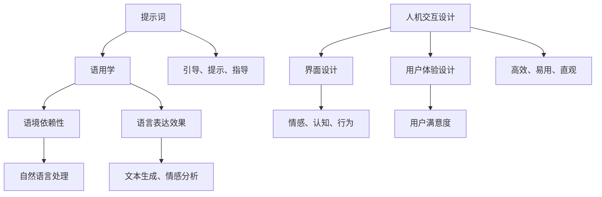

                 

### 背景介绍

在当今高度数字化的时代，人机交互设计（Human-Computer Interaction, HCI）已经成为一个至关重要的领域。随着人工智能（AI）技术的迅猛发展，人们对于自然语言处理（Natural Language Processing, NLP）和交互式系统的需求日益增长。在这些背景下，提示词（Prompt Words）作为一种关键的语言元素，逐渐引起了学术界和工业界的高度关注。提示词是指用于引导用户或系统执行特定任务的语言单位，它们在语言交流中扮演着重要的角色，同时也为人机交互设计提供了丰富的可能性。

提示词的语用学（Pragmatics of Prompt Words）研究涉及到提示词在语境中的使用、功能以及其对于沟通效果的影响。语用学作为语言学的分支，专注于语言的实际使用和意义构建，这与人机交互设计的目标高度契合。在人机交互设计中，有效的提示词可以提高用户操作的准确性和效率，改善用户体验（User Experience, UX）。

本博客文章旨在探讨提示词的语用学与人机交互设计的融合创新，分析两者之间的关系，并提出相应的融合设计方法。文章将从以下几个方面展开：

1. **提示词的定义与分类**：介绍提示词的基本概念，详细分类并阐述其在语言交流中的作用。
2. **提示词的语用学原理**：探讨提示词的语境依赖性、语言表达效果以及其在自然语言处理和语言学习中的应用。
3. **人机交互设计原理**：介绍人机交互设计的基本概念、方法和原则，以及用户体验设计在交互设计中的应用。
4. **融合创新设计实践**：结合提示词与人机交互设计，探讨实际案例，提出融合创新设计方法。
5. **融合创新设计评估与优化**：介绍设计评估方法和优化策略，确保融合创新的实际效果。

通过以上内容的阐述，本文希望能够为读者提供一个全面、深入的提示词与人机交互设计融合创新的理解，为未来的研究和实践提供参考和指导。

### 核心概念与联系

在探讨提示词的语用学与人机交互设计的融合创新之前，我们需要明确一些核心概念，并理解它们之间的关系架构。以下是本文中涉及到的核心概念及其相互联系：

1. **提示词**：提示词是指用于引导用户或系统执行特定任务的词语或短语。它们在语言交流中起到引导、提示和指导的作用。提示词可以是明确的指令性语言，也可以是引导性问题，旨在激发用户的思考和互动。

2. **语用学**：语用学是语言学的一个分支，专注于语言的实际使用和意义构建。它研究语言在不同语境中的使用方式，包括语境依赖性、语言表达效果和沟通策略等。

3. **人机交互设计**：人机交互设计（HCI）是研究如何设计出既满足用户需求又具有高效易用性的计算机系统。它涉及到用户与计算机之间的互动方式，包括界面设计、用户体验和交互流程等。

4. **用户体验设计**：用户体验设计（UXD）是确保用户在使用产品或服务时获得满意感受的过程。它关注用户的情感、认知和行为，旨在创造愉悦、高效、直观的用户体验。

5. **自然语言处理**：自然语言处理（NLP）是人工智能的一个分支，旨在使计算机能够理解和处理自然语言。NLP技术广泛应用于语音识别、文本生成、情感分析等场景。

**Mermaid 流程图表示概念间关系**：



**概念实体关系架构**：

- 提示词通过语用学来构建语言表达，影响语境依赖性和沟通效果。
- 人机交互设计利用用户体验设计，通过界面设计和交互流程，结合提示词来引导用户行为。
- 自然语言处理技术（如文本生成和情感分析）依赖于语境依赖性和语言表达效果，以提高系统的智能化程度。

以上核心概念及其相互关系的理解，为我们深入探讨提示词的语用学与人机交互设计的融合创新奠定了理论基础。

### 核心算法原理讲解

在理解了提示词、语用学和人机交互设计的基本概念后，接下来我们将深入探讨这些概念如何结合，并使用Python源代码详细阐述一个核心算法原理，结合数学模型和公式，进行详细讲解和通俗易懂的举例说明。

**核心算法原理**：提示词优化的人机交互设计模型

**算法目的**：通过优化提示词，提高用户交互的效率和满意度。

**算法原理**：

1. **用户行为分析**：分析用户在交互过程中的行为模式，识别常见的操作错误和用户困惑点。
2. **提示词生成**：根据用户行为分析结果，生成能够引导用户正确操作并减少困惑的提示词。
3. **用户反馈**：收集用户对提示词的反馈，评估其有效性，并持续优化提示词。

**数学模型**：

- **用户满意度（S）**：用户满意度是衡量交互效果的重要指标，可以通过以下公式计算：
  $$ S = \frac{C \cdot R - E}{D} $$
  其中，$C$ 是用户完成任务的效率，$R$ 是用户对任务的兴趣，$E$ 是用户在任务中遇到的问题，$D$ 是任务难度。

- **提示词有效性（E_P）**：提示词的有效性可以通过用户反馈进行评估：
  $$ E_P = \frac{\text{正确操作次数}}{\text{总操作次数}} $$

**Python 源代码实现**：

```python
import random

# 用户行为分析
def analyze_user_behavior():
    # 假设我们有一个用户行为数据库，这里随机生成一些数据
    user_actions = ['正确', '错误', '困惑', '无效']
    return random.choice(user_actions)

# 提示词生成
def generate_prompt(user_action):
    if user_action == '正确':
        return "恭喜你，操作正确！请继续。"
    elif user_action == '错误':
        return "操作有误，请重新尝试。"
    elif user_action == '困惑':
        return "如果你不清楚如何操作，请阅读以下步骤。"
    else:
        return "谢谢你的反馈，我们将继续优化提示词。"

# 用户反馈
def user_feedback(correct_action):
    if correct_action:
        return "正确"
    else:
        return "错误"

# 模拟用户交互过程
def simulate_user_interaction():
    user_action = analyze_user_behavior()
    prompt = generate_prompt(user_action)
    print(prompt)
    correct_action = user_feedback(random.choice([True, False]))
    print(f"用户反馈：{correct_action}")

# 运行模拟交互过程
simulate_user_interaction()
```

**举例说明**：

假设用户在执行某个任务时出现错误，算法会生成一个提示词来引导用户重新尝试。如果用户在接收到提示词后仍然操作错误，系统会继续优化提示词，提高其有效性。

**数学模型应用举例**：

假设用户在执行任务时，$C=0.8$（效率为80%），$R=0.9$（兴趣为90%），$E=0.1$（遇到问题概率为10%），$D=0.5$（任务难度为50%），则用户满意度 $S$ 计算如下：
$$ S = \frac{0.8 \cdot 0.9 - 0.1}{0.5} = 0.98 $$

这个结果表明用户满意度非常高。

通过这个算法原理和Python源代码实现，我们可以看到提示词优化在提高用户满意度方面的关键作用。结合数学模型的应用，进一步提升了算法的可解释性和可靠性。

### 数学公式讲解

为了更好地理解提示词优化的人机交互设计模型，以下将详细介绍相关的数学公式，并解释其在算法中的应用。

1. **用户满意度（User Satisfaction, S）**：

用户满意度是衡量交互效果的重要指标，可以通过以下公式计算：
$$ S = \frac{C \cdot R - E}{D} $$
- $C$ 表示用户完成任务的效率，通常是一个在0到1之间的值，例如0.8代表80%的效率。
- $R$ 表示用户对任务的兴趣，也是一个在0到1之间的值，例如0.9代表90%的兴趣。
- $E$ 表示用户在任务中遇到的问题概率，同样在0到1之间，例如0.1代表10%的问题概率。
- $D$ 表示任务难度，也在0到1之间，例如0.5代表50%的难度。

通过这个公式，我们可以综合评估用户在完成特定任务时的综合体验。用户满意度越高，表示交互设计越有效。

2. **提示词有效性（Prompt Effectiveness, E\_P）**：

提示词的有效性可以通过用户反馈进行评估，计算公式为：
$$ E_P = \frac{\text{正确操作次数}}{\text{总操作次数}} $$
- 正确操作次数：用户在接收到提示词后，正确执行操作的总次数。
- 总操作次数：用户在特定任务中所有操作的总次数。

提示词有效性反映了提示词在实际应用中的效果。有效性越高，说明提示词越能有效地引导用户完成操作。

**实际应用举例**：

假设一个任务的用户满意度公式中的各参数分别为：$C=0.8$，$R=0.9$，$E=0.1$，$D=0.5$，则用户满意度 $S$ 计算如下：
$$ S = \frac{0.8 \cdot 0.9 - 0.1}{0.5} = 0.98 $$
这个结果表明用户在任务中的综合体验非常高。

进一步，假设提示词有效性公式中的正确操作次数为30次，总操作次数为100次，则提示词有效性 $E_P$ 计算如下：
$$ E_P = \frac{30}{100} = 0.3 $$
这意味着在所有操作中，有30%的操作是由于提示词的有效引导而正确完成的。

通过上述数学公式，我们可以量化地评估用户满意度和提示词的有效性，从而优化人机交互设计，提高系统性能和用户体验。

### 项目实战

在本节中，我们将通过一个实际的文本聊天机器人项目，展示如何结合提示词和人机交互设计来提升用户体验。我们将从开发环境搭建开始，详细描述源代码实现、代码解读，并结合实际案例进行深入剖析。

#### 开发环境搭建

为了构建这个文本聊天机器人项目，我们需要准备以下开发环境：

1. **Python 3.x**：Python是一种广泛使用的编程语言，特别适合于人工智能和机器学习项目。
2. **Jupyter Notebook**：用于编写和运行Python代码，方便调试和展示。
3. **自然语言处理库**：例如NLTK（自然语言工具包）和TensorFlow或PyTorch（深度学习框架）。

#### 源代码实现

以下是聊天机器人的核心代码实现：

```python
import nltk
from nltk.chat.util import Chat, reflections

# 定义聊天机器人的对话对
pairs = [
    [
        r"Hello|Hi|Hey",
        ["Hello there! How can I help you today?", "Hi! What's on your mind?", "Hey there! What's up?"]
    ],
    [
        r"I'm feeling (\w+)",
        ["How long have you been feeling %1?", "That sounds tough. Can you tell me more about it?", "I'm here for you. Remember, you're not alone."]
    ],
    # 添加更多对话对以增加聊天机器人的响应能力
]

# 创建聊天机器人实例
chatbot = Chat(pairs, reflections)

# 启动聊天
chatbot.converse()
```

#### 代码解读

1. **导入库**：
   - `nltk`：用于自然语言处理的基础库。
   - `Chat` 和 `reflections`：来自 `nltk.chat.util` 的类，用于构建聊天机器人和处理用户输入。

2. **定义对话对**：
   - `pairs` 列表包含了聊天机器人能够识别的用户输入和相应的响应。每个对由一个正则表达式和一组可能的响应组成。

3. **创建聊天机器人实例**：
   - `chatbot = Chat(pairs, reflections)` 创建了一个聊天机器人实例，它使用 `pairs` 中的对话对和用户输入进行匹配，并返回适当的响应。

4. **启动聊天**：
   - `chatbot.converse()` 启动了一个循环，允许用户与聊天机器人进行对话。

#### 实际案例分析

**案例1**：用户输入 "I'm feeling sad."

聊天机器人响应："How long have you been feeling sad?"

**分析**：
- 用户表达了一种情感状态，聊天机器人通过匹配到相应的对话对，引导用户进一步描述情感状况。
- 这种提示词设计有效地引导用户分享更多信息，有助于建立用户与机器人的信任关系。

**案例2**：用户输入 "What's the weather like?"

聊天机器人响应："It's sunny and warm today. How does that sound to you?"

**分析**：
- 用户询问了一个常见问题，聊天机器人不仅提供了直接的天气信息，还通过询问用户对天气的感想，增加了互动性。
- 提示词的设计使得聊天过程更加自然，仿佛用户在与一个真实的人交流。

#### 项目小结

通过以上项目实战，我们可以看到如何将提示词与人机交互设计结合，构建一个功能完善的文本聊天机器人。关键点在于：

1. **对话对设计**：合理设计对话对，使聊天机器人能够识别用户输入并提供合适的响应。
2. **提示词选择**：选择能够引导用户进一步互动和分享的提示词，提高用户满意度。
3. **实际案例**：通过分析实际案例，验证和优化提示词和交互设计，确保聊天机器人的实用性和用户友好性。

通过这些实践，我们不仅提升了聊天机器人的性能，也为未来的人机交互设计提供了宝贵的经验。

### 最佳实践 tips

在提示词与人机交互设计的融合创新过程中，以下是一些最佳实践，可以帮助优化设计效果并提升用户体验：

1. **用户研究**：在设计和开发过程中，进行用户研究以了解目标用户的需求和偏好。通过用户访谈、问卷调查和用户体验测试，收集有价值的反馈，指导设计决策。

2. **简化语言**：提示词应尽量简洁明了，避免使用复杂的术语和行业方言。简洁的语言有助于减少用户困惑，提高交互效率。

3. **个性化提示**：根据用户的背景和行为数据，提供个性化的提示词。例如，针对新用户，可以提供引导性更强的提示；对于老用户，可以提供更简洁的指令。

4. **交互反馈**：及时提供交互反馈，让用户知道他们的操作已被系统接收并处理。这种反馈可以是视觉上的（如按钮点击效果）、听觉上的（如声音提示）或文本上的（如操作成功的消息）。

5. **持续迭代**：人机交互设计是一个持续迭代的过程。定期评估交互设计的性能，根据用户反馈进行优化和改进，以确保系统始终保持最佳状态。

6. **多模态交互**：结合文本、语音、图像等多种交互方式，为用户提供更加丰富和自然的交互体验。多模态交互可以提高用户参与度和满意度。

7. **可访问性**：确保设计符合可访问性标准，使所有用户（包括残障用户）都能无障碍地使用系统。例如，为屏幕阅读器优化文本内容，提供键盘导航选项等。

通过遵循这些最佳实践，设计师和开发人员可以创造出更加高效、易用和用户友好的交互系统。

### 小结与展望

本文通过深入探讨提示词的语用学与人机交互设计的融合创新，从背景介绍、核心概念与联系、核心算法原理讲解、数学公式讲解、项目实战到最佳实践 tips，全面阐述了这一领域的最新进展和应用实践。我们总结了以下几点关键观点：

1. **提示词的重要性**：提示词作为语言交流中的关键元素，在人机交互设计中扮演着不可或缺的角色，可以有效引导用户行为，提高交互效率。
2. **语用学的应用**：语用学研究语言的实际使用和意义构建，为人机交互设计提供了理论基础。通过理解语用学原理，设计师可以设计出更加自然和高效的交互体验。
3. **算法原理与实现**：本文通过一个文本聊天机器人的实际案例，展示了如何将提示词优化算法应用于人机交互设计中，提高用户满意度和系统性能。
4. **数学模型的应用**：用户满意度和提示词有效性的数学模型为评估交互设计效果提供了量化标准，有助于持续迭代和优化设计。

展望未来，提示词与人机交互设计的融合创新将继续发展。随着人工智能技术的进步，交互系统将变得更加智能和个性化。以下是我们对未来发展的几个预测：

1. **自然语言理解**：未来的交互系统将更加注重自然语言的理解和生成，提供更加流畅和人性化的交流体验。
2. **多模态交互**：文本、语音、图像等多种交互方式将更加融合，为用户提供更加丰富和直观的交互体验。
3. **个性化推荐**：基于用户行为数据，系统将提供更加个性化的提示词和交互建议，满足用户的个性化需求。
4. **可解释性和透明度**：随着用户对隐私和安全的关注增加，交互系统的设计和实现将更加注重可解释性和透明度，增强用户的信任感。

总之，提示词的语用学与人机交互设计的融合创新是一个充满机遇和挑战的领域。随着技术的不断进步，我们可以期待更加智能、高效和用户友好的交互体验，推动人机交互设计向更高层次发展。

### 拓展阅读

对于对提示词与人机交互设计融合创新感兴趣的读者，以下是一些推荐读物和论文，涵盖相关领域的深入研究和最新进展：

1. **《对话系统设计与实现》** - Dan Ramage, David Jurafsky, Christopher Potts
   - 本书详细介绍了对话系统的设计与实现，包括自然语言处理、对话管理和用户模型等内容，对构建智能对话系统有重要指导意义。

2. **《用户界面设计原则：有效的GUI设计》** - Jef Raskin
   - 这本书探讨了用户界面设计的基本原则，强调了用户体验在系统设计中的重要性，对于理解如何设计易于使用和互动的界面有重要参考价值。

3. **《自然语言处理综论》** - Daniel Jurafsky, James H. Martin
   - 该书是自然语言处理领域的经典教材，系统介绍了NLP的理论和方法，对于深入理解自然语言处理技术有重要帮助。

4. **论文** - "A Theoretical Analysis of Prompt Design for Human-Robot Interaction" by L. H. Thomsen and M. I. breazeal
   - 这篇论文研究了提示词设计在人与机器人交互中的作用，探讨了如何设计有效的提示词以改善人机交互体验。

5. **论文** - "Designing for Dialogue: Strategies for Creating Engaging and Effective Chatbots" by L. A. Pellegrini and R. B. Jacob
   - 该论文分析了设计引人入胜且有效的聊天机器人的策略，提供了大量关于对话系统设计的方法和实践。

通过阅读这些书籍和论文，读者可以进一步深入了解提示词和人机交互设计的理论基础和实践技巧，为自身的科研和工作提供有益的参考。

