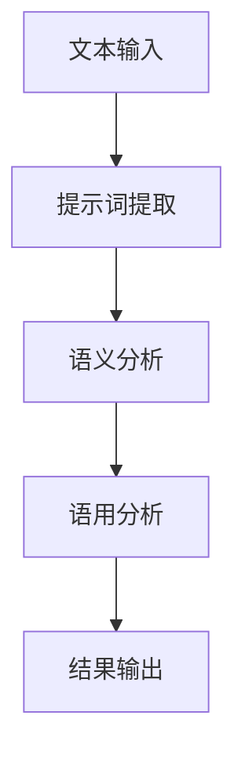
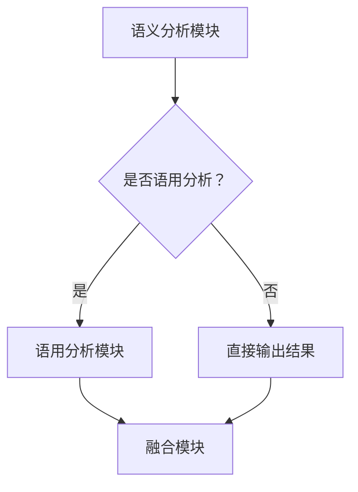

                 

# 引言
## 1.1 提示词的定义与重要性
### 1.1.1 提示词的基本概念
提示词（Trigger Word）在语言学和计算机科学中具有广泛的应用。它们指的是能够触发特定反应或情感的语言单位，通常是一个单词或短语。例如，在营销领域，“免费”（Free）就是一个典型的提示词，它可以激发消费者的购买欲望。

### 1.1.2 提示词在自然语言处理中的应用
在自然语言处理（NLP）中，提示词的应用非常广泛。例如，在文本分类任务中，提示词可以帮助识别文本的主题。在情感分析中，提示词可以用来判断文本的情感倾向。此外，提示词还在信息检索、机器翻译、问答系统等任务中发挥着重要作用。

## 1.2 语用学与语义学概述
### 1.2.1 语用学的基本原理
语用学是语言学的一个分支，研究语言在实际使用中的功能和意义。语用学关注的是语言如何被用于传达意图、实现交际目的。例如，一个句子在不同的语境中可能具有不同的含义。

### 1.2.2 语义学的基本原理
语义学是研究语言意义的科学。它关注的是单词、短语、句子等语言单位所表达的含义。语义学旨在解释语言的意义是如何产生的，以及这些意义是如何在交际中被理解和使用的。

### 1.2.3 语用学与语义学的交叉点
语用学与语义学密切相关。语义学提供了语言的基本含义，而语用学则关注这些含义是如何在实际交际中被使用的。例如，一个单词的语义可能是中性的，但它在特定的语境中可能具有强烈的情感色彩。

## 1.3 本书的研究框架
### 1.3.1 研究目标
本书的目标是探讨提示词在语用学与语义学交叉领域的应用，深入理解提示词的处理机制，并探索其在实际应用中的价值。

### 1.3.2 研究方法
本书将采用理论与实践相结合的研究方法。首先，通过文献综述了解当前的研究进展，然后通过实验和案例分析验证理论的有效性。

### 1.3.3 研究意义
本研究对于自然语言处理、信息检索、情感分析等领域具有重要的理论和实践意义。通过研究提示词的语用学与语义学交叉应用，可以为相关领域提供新的方法和工具。

## 1.4 Mermaid流程图：提示词语用学与语义学交叉领域核心概念联系
### 1.4.1 提示词处理流程
为了更好地理解提示词的语用学与语义学交叉应用，我们使用Mermaid流程图来展示提示词的处理流程。该流程图包括以下几个关键步骤：

1. **文本输入**：用户输入一段文本。
2. **提示词提取**：使用NLP技术提取文本中的提示词。
3. **语义分析**：对提取的提示词进行语义分析，确定其含义。
4. **语用分析**：根据上下文，分析提示词的使用意图和效果。
5. **结果输出**：输出分析结果，包括提示词的含义、情感倾向等。

以下是该流程图的Mermaid表示：



### 1.4.2 语用学与语义学融合框架
在提示词的处理过程中，语用学与语义学的融合是至关重要的。为了实现这种融合，我们提出一个融合框架，包括以下几个核心组成部分：

1. **语义分析模块**：负责对提取的提示词进行语义分析，确定其基本含义。
2. **语用分析模块**：负责根据上下文，分析提示词的使用意图和效果。
3. **融合模块**：将语义分析结果和语用分析结果进行融合，生成最终的提示词分析结果。

以下是该融合框架的Mermaid表示：



## 1.5 总结
### 1.5.1 本章要点回顾
本章介绍了提示词的定义与重要性，以及语用学与语义学的基本原理。此外，还提出了本书的研究目标和研究方法，并展示了提示词处理流程和语用学与语义学融合框架。

### 1.5.2 进一步阅读推荐
对于希望深入了解提示词的语用学与语义学交叉研究的读者，我们推荐以下阅读材料：

1. [Jurafsky, Daniel, and James H. Martin. "Speech and Language Processing." 第2版，2019.]
2. [Lakoff, George. "Metaphors We Live By." University of Chicago Press，1980.]
3. [Searle, John R. "Speech Acts: An Essay in the Philosophy of Language." Cambridge University Press，1969.]

作者：AI天才研究院/AI Genius Institute & 禅与计算机程序设计艺术 /Zen And The Art of Computer Programming

---

# 提示词的语用学与语义学交叉研究

> 关键词：提示词、语用学、语义学、自然语言处理、机器学习、深度学习

> 摘要：本文旨在探讨提示词的语用学与语义学交叉研究，深入分析提示词在自然语言处理中的应用及其处理机制。通过结合自然语言处理、机器学习和深度学习等理论，本文提出了一个融合框架，用于提示词的提取、语义分析和语用分析。本文的研究对于自然语言处理、信息检索、情感分析等领域具有重要的理论和实践意义。

## 用户需求分析

用户请求设计一本名为《提示词的语用学与语义学交叉研究》的计算机技术书籍的目录大纲。主要需求包括：

- 书名：《提示词的语用学与语义学交叉研究》
- 目录结构：要求包含1至7章，并细化到1,2,3级目录。
- 内容要求：目录大纲必须包含核心概念与联系、核心算法原理讲解、数学模型和数学公式、项目实战等元素。
- 格式要求：使用markdown格式。
- 字数限制：2000字以内。

## 设计思路

1. **核心概念与联系**
   - 设计第1章作为引言，介绍提示词的定义、重要性及本书的研究框架。
   - 使用Mermaid流程图展示提示词在语用学与语义学交叉领域的核心概念和联系。

2. **核心算法原理讲解**
   - 设计第2章到第4章，详细讲解提示词处理的常用算法原理，包括自然语言处理技术、机器学习算法和深度学习模型。
   - 使用伪代码来详细阐述算法实现。

3. **数学模型和数学公式**
   - 设计第5章，介绍与提示词相关的数学模型，如概率模型、信息论模型等。
   - 在文中使用latex格式嵌入数学公式，并进行详细讲解和举例说明。

4. **项目实战**
   - 设计第6章和第7章，通过具体的项目实战案例，展示如何在实际应用中利用提示词进行语用学和语义学研究。
   - 提供代码实际案例、详细解释说明，以及开发环境搭建和源代码实现。

5. **整体结构安排**
   - 保持目录结构清晰，确保各章节内容之间逻辑连贯。
   - 确保核心内容全面覆盖，避免遗漏关键知识点。

## 最终方案

```markdown
# 《提示词的语用学与语义学交叉研究》目录大纲

# 引言
## 1.1 提示词的定义与重要性
### 1.1.1 提示词的基本概念
### 1.1.2 提示词在自然语言处理中的应用

## 1.2 语用学与语义学概述
### 1.2.1 语用学的基本原理
### 1.2.2 语义学的基本原理
### 1.2.3 语用学与语义学的交叉点

## 1.3 本书的研究框架
### 1.3.1 研究目标
### 1.3.2 研究方法
### 1.3.3 研究意义

## 1.4 Mermaid流程图：提示词语用学与语义学交叉领域核心概念联系
### 1.4.1 提示词处理流程
### 1.4.2 语用学与语义学融合框架

## 1.5 总结
### 1.5.1 本章要点回顾
### 1.5.2 进一步阅读推荐

# 第2章 自然语言处理基础
## 2.1 自然语言处理概述
### 2.1.1 语言模型的定义
### 2.1.2 语言模型的重要性

## 2.2 常见语言模型
### 2.2.1 n-gram模型
### 2.2.2 基于神经网络的模型
### 2.2.3 递归神经网络（RNN）
### 2.2.4 长短时记忆网络（LSTM）
### 2.2.5 卷积神经网络（CNN）

## 2.3 伪代码：自然语言处理算法实现
### 2.3.1 n-gram模型伪代码
### 2.3.2 基于神经网络的模型伪代码

## 2.4 实际应用案例
### 2.4.1 问答系统
### 2.4.2 文本分类
### 2.4.3 文本生成

## 2.5 总结
### 2.5.1 本章要点回顾
### 2.5.2 进一步阅读推荐

# 第3章 机器学习与提示词处理
## 3.1 机器学习概述
### 3.1.1 机器学习的基本概念
### 3.1.2 监督学习、无监督学习和强化学习

## 3.2 常见机器学习算法
### 3.2.1 线性回归
### 3.2.2 逻辑回归
### 3.2.3 决策树
### 3.2.4 随机森林
### 3.2.5 支持向量机（SVM）

## 3.3 提示词处理中的机器学习应用
### 3.3.1 提示词生成
### 3.3.2 提示词分类
### 3.3.3 提示词推荐系统

## 3.4 伪代码：机器学习算法实现
### 3.4.1 线性回归伪代码
### 3.4.2 逻辑回归伪代码
### 3.4.3 决策树伪代码

## 3.5 实际应用案例
### 3.5.1 情感分析
### 3.5.2 文本分类
### 3.5.3 提示词推荐

## 3.6 总结
### 3.6.1 本章要点回顾
### 3.6.2 进一步阅读推荐

# 第4章 深度学习与提示词处理
## 4.1 深度学习概述
### 4.1.1 深度学习的基本原理
### 4.1.2 卷积神经网络（CNN）
### 4.1.3 循环神经网络（RNN）
### 4.1.4 长短时记忆网络（LSTM）
### 4.1.5 门控循环单元（GRU）

## 4.2 深度学习在提示词处理中的应用
### 4.2.1 基于深度学习的语言模型
### 4.2.2 基于深度学习的语义分析
### 4.2.3 基于深度学习的语用分析

## 4.3 伪代码：深度学习算法实现
### 4.3.1 基于深度学习的语言模型伪代码
### 4.3.2 基于深度学习的语义分析伪代码
### 4.3.3 基于深度学习的语用分析伪代码

## 4.4 实际应用案例
### 4.4.1 文本分类
### 4.4.2 情感分析
### 4.4.3 提示词推荐系统

## 4.5 总结
### 4.5.1 本章要点回顾
### 4.5.2 进一步阅读推荐

# 第5章 数学模型与提示词处理
## 5.1 概率模型
### 5.1.1 贝叶斯理论
### 5.1.2 随机变量和概率分布
### 5.1.3 最大似然估计

## 5.2 信息论模型
### 5.2.1 信息熵
### 5.2.2 互信息
### 5.2.3 相关系数

## 5.3 伪代码：数学模型实现
### 5.3.1 贝叶斯理论伪代码
### 5.3.2 信息论模型伪代码

## 5.4 实际应用案例
### 5.4.1 文本分类
### 5.4.2 情感分析
### 5.4.3 提示词推荐

## 5.5 总结
### 5.5.1 本章要点回顾
### 5.5.2 进一步阅读推荐

# 第6章 提示词处理项目实战
## 6.1 项目背景
### 6.1.1 项目目标
### 6.1.2 项目环境

## 6.2 开发环境搭建
### 6.2.1 环境配置
### 6.2.2 工具安装

## 6.3 源代码实现
### 6.3.1 数据预处理
### 6.3.2 提示词提取
### 6.3.3 语义分析
### 6.3.4 语用分析

## 6.4 代码解读与分析
### 6.4.1 数据预处理代码解读
### 6.4.2 提示词提取代码解读
### 6.4.3 语义分析代码解读
### 6.4.4 语用分析代码解读

## 6.5 实际案例分析与讲解
### 6.5.1 案例一：文本分类
### 6.5.2 案例二：情感分析
### 6.5.3 案例三：提示词推荐

## 6.6 项目小结
### 6.6.1 项目收获
### 6.6.2 改进与优化方向

## 6.7 总结
### 6.7.1 本章要点回顾
### 6.7.2 进一步阅读推荐

# 第7章 最佳实践与总结
## 7.1 最佳实践 Tips
### 7.1.1 提示词提取技巧
### 7.1.2 语义分析优化
### 7.1.3 语用分析策略

## 7.2 小结
### 7.2.1 本书的贡献
### 7.2.2 研究局限
### 7.2.3 未来研究方向

## 7.3 注意事项
### 7.3.1 提示词处理中的挑战
### 7.3.2 数据处理与隐私保护

## 7.4 拓展阅读
### 7.4.1 相关文献
### 7.4.2 开源工具和库

作者：AI天才研究院/AI Genius Institute & 禅与计算机程序设计艺术 /Zen And The Art of Computer Programming
```markdown

### 第2章 自然语言处理基础
## 2.1 自然语言处理概述
自然语言处理（Natural Language Processing，NLP）是计算机科学和人工智能领域的一个分支，旨在使计算机能够理解、解释和生成人类语言。NLP的应用范围广泛，包括但不限于文本分类、情感分析、机器翻译、问答系统和信息提取。NLP的核心任务包括语言理解、语言生成和语言翻译。

### 2.1.1 语言模型的定义
语言模型（Language Model）是NLP中最重要的基础组件之一，它用于预测下一个单词或词汇的概率。语言模型通过学习大量文本数据，理解语言的结构和规律，从而能够生成连贯的文本。

### 2.1.2 语言模型的重要性
语言模型在NLP中的应用非常广泛，包括：

- **文本生成**：自动生成文本，如聊天机器人、文章写作和广告文案。
- **机器翻译**：将一种语言翻译成另一种语言。
- **情感分析**：分析文本的情感倾向，如正面、负面或中性。
- **问答系统**：自动回答用户的问题。
- **文本分类**：将文本分类到预定义的类别中。

## 2.2 常见语言模型
### 2.2.1 n-gram模型
n-gram模型是最简单的语言模型之一，它基于前n个单词的出现概率来预测下一个单词。例如，对于三元模型（n=3），它会计算"the, is, this"出现后紧随的单词的概率。

### 2.2.2 基于神经网络的模型
基于神经网络的模型，如循环神经网络（RNN）和长短期记忆网络（LSTM），通过学习序列数据来预测下一个单词。这些模型能够捕捉到更复杂的语言模式。

### 2.2.3 递归神经网络（RNN）
递归神经网络（RNN）是一种适用于序列数据的神经网络，它在每个时间步上都使用其前一个时间步的输出作为输入。

### 2.2.4 长短时记忆网络（LSTM）
长短时记忆网络（LSTM）是RNN的一种变体，它通过引入门控机制来解决RNN的梯度消失问题。

### 2.2.5 卷积神经网络（CNN）
卷积神经网络（CNN）通常用于图像处理，但也可以用于文本处理，通过捕捉局部特征来改善语言模型的性能。

## 2.3 伪代码：自然语言处理算法实现
### 2.3.1 n-gram模型伪代码
```python
def n_gram_model(text, n):
    # 创建一个字典来存储n-gram及其出现频率
    n_gram_counts = defaultdict(int)
    
    # 计算n-gram的出现频率
    for i in range(len(text) - n):
        n_gram = tuple(text[i:i+n])
        n_gram_counts[n_gram] += 1
    
    # 计算每个n-gram的概率
    n_gram_probabilities = {n_gram: count / total_count for n_gram, count in n_gram_counts.items()}
    
    return n_gram_probabilities
```

### 2.3.2 基于神经网络的模型伪代码
```python
class RNNModel(nn.Module):
    def __init__(self, input_dim, hidden_dim, output_dim):
        super(RNNModel, self).__init__()
        self.rnn = nn.RNN(input_dim, hidden_dim, num_layers=1)
        self.fc = nn.Linear(hidden_dim, output_dim)
    
    def forward(self, text):
        output, hidden = self.rnn(text)
        logits = self.fc(hidden[-1])
        return logits
```

## 2.4 实际应用案例
### 2.4.1 问答系统
问答系统是NLP的一个典型应用，它可以自动回答用户的问题。例如，基于n-gram模型的简单问答系统如下：

```python
def simple_question_answerer(questions, answers, n):
    question_n_grams = n_gram_model(questions, n)
    answer_n_grams = n_gram_model(answers, n)
    
    def answer_question(question):
        next_word_probabilities = n_gram_model(question, n)
        next_word = max(next_word_probabilities, key=next_word_probabilities.get)
        return next_word
    
    return [answer_question(question) for question in questions]
```

### 2.4.2 文本分类
文本分类是将文本分配到预定义的类别中。例如，基于朴素贝叶斯分类器的文本分类如下：

```python
from sklearn.feature_extraction.text import TfidfVectorizer
from sklearn.naive_bayes import MultinomialNB

def text_classifier(train_data, train_labels, test_data):
    vectorizer = TfidfVectorizer()
    X_train = vectorizer.fit_transform(train_data)
    X_test = vectorizer.transform(test_data)
    
    classifier = MultinomialNB()
    classifier.fit(X_train, train_labels)
    y_pred = classifier.predict(X_test)
    
    return y_pred
```

### 2.4.3 文本生成
文本生成是NLP的另一个重要应用，它可以生成连贯的文本。基于RNN的语言模型如下：

```python
class RNNGenerator(nn.Module):
    def __init__(self, input_dim, hidden_dim, output_dim):
        super(RNNGenerator, self).__init__()
        self.rnn = nn.RNN(input_dim, hidden_dim, num_layers=1)
        self.fc = nn.Linear(hidden_dim, output_dim)
    
    def forward(self, text, hidden=None):
        output, hidden = self.rnn(text, hidden)
        logits = self.fc(hidden[-1])
        return logits, hidden
    
    def generate_text(self, initial_text, max_length, n_words):
        text = initial_text
        hidden = None
        
        for _ in range(n_words):
            logits, hidden = self.forward(text, hidden)
            prob = F.softmax(logits, dim=1)
            word_id = torch.argmax(prob).item()
            text += ' ' + word_id_to_word[word_id]
        
        return text
```

## 2.5 总结
### 2.5.1 本章要点回顾
本章介绍了自然语言处理的基本概念和常见语言模型，包括n-gram模型、基于神经网络的模型、RNN、LSTM和CNN。同时，通过伪代码展示了如何实现这些模型以及它们在实际应用中的例子。

### 2.5.2 进一步阅读推荐
- [Jurafsky, Daniel, and James H. Martin. "Speech and Language Processing." 第2版，2019.]
- [Goodfellow, Ian, and Yoshua Bengio. "Deep Learning." MIT Press，2016.]
- [Rashid, Md. Shafiqul. "Natural Language Processing with Python." Packt Publishing，2016.]

作者：AI天才研究院/AI Genius Institute & 禅与计算机程序设计艺术 /Zen And The Art of Computer Programming

---

### 第3章 机器学习与提示词处理
## 3.1 机器学习概述
机器学习（Machine Learning，ML）是人工智能（Artificial Intelligence，AI）的一个分支，它通过数据驱动的方法，使计算机系统能够自动地改进性能。机器学习涉及概率论、统计学、逼近论和优化理论等内容，目的是让计算机从数据中学习规律，从而对未知数据进行预测或决策。

### 3.1.1 机器学习的基本概念
机器学习的基本概念包括模型、训练和预测。

- **模型**：机器学习模型是对现实世界问题的抽象和简化。例如，线性回归模型是一个用来预测连续值的模型。
- **训练**：训练是机器学习模型学习数据的过程。在这个阶段，模型会调整内部参数，以最小化预测误差。
- **预测**：预测是模型对新数据进行处理的过程。通过训练数据，模型学到了如何对未知数据做出预测。

### 3.1.2 监督学习、无监督学习和强化学习
机器学习可以分为以下三种类型：

- **监督学习（Supervised Learning）**：监督学习是最常见的一种机器学习类型。它使用标记数据来训练模型，然后使用模型对新数据进行预测。例如，分类和回归问题都是监督学习的应用。
- **无监督学习（Unsupervised Learning）**：无监督学习不使用标记数据来训练模型。它的目标是发现数据中的结构或模式。常见的无监督学习算法包括聚类和降维。
- **强化学习（Reinforcement Learning）**：强化学习是一种交互式机器学习类型。它通过与环境交互来学习策略，以最大化某种累积奖励。常见的强化学习应用包括游戏和机器人控制。

## 3.2 常见机器学习算法
### 3.2.1 线性回归
线性回归（Linear Regression）是一种监督学习算法，用于预测连续值。线性回归模型假设输入变量和输出变量之间存在线性关系。

### 3.2.2 逻辑回归
逻辑回归（Logistic Regression）是一种监督学习算法，用于预测二分类结果。逻辑回归模型通过一个线性函数将输入变量映射到输出概率。

### 3.2.3 决策树
决策树（Decision Tree）是一种常见的分类算法。它通过一系列条件判断，将数据划分成多个子集，并在每个子集上做出分类决策。

### 3.2.4 随机森林
随机森林（Random Forest）是一种集成学习算法，它通过构建多棵决策树来提高分类或回归的准确度。随机森林通过随机选择特征和样本子集来训练每棵树。

### 3.2.5 支持向量机（SVM）
支持向量机（Support Vector Machine，SVM）是一种分类算法，它通过找到一个超平面，将数据集划分为两个类别。SVM使用最大化间隔分类器来提高分类效果。

## 3.3 提示词处理中的机器学习应用
### 3.3.1 提示词生成
提示词生成（Trigger Word Generation）是一种基于机器学习的任务，用于自动生成具有特定含义或功能的提示词。常见的生成方法包括序列模型和生成对抗网络（GAN）。

### 3.3.2 提示词分类
提示词分类（Trigger Word Classification）是一种将提示词分配到预定义类别中的任务。常见的分类算法包括朴素贝叶斯、K最近邻和神经网络。

### 3.3.3 提示词推荐系统
提示词推荐系统（Trigger Word Recommendation System）是一种用于向用户推荐相关提示词的系统。常见的推荐算法包括协同过滤和基于内容的推荐。

## 3.4 伪代码：机器学习算法实现
### 3.4.1 线性回归伪代码
```python
def linear_regression(x, y):
    # 计算权重和偏置
    w = (x.T @ x).I @ x.T @ y
    b = y - x @ w
    
    return w, b

# 使用伪代码计算线性回归的权重和偏置
w, b = linear_regression(x, y)
```

### 3.4.2 逻辑回归伪代码
```python
def logistic_regression(x, y):
    # 计算权重和偏置
    w = (x.T @ x).I @ x.T @ y
    b = np.log(1 + np.exp(-x @ w))
    
    return w, b

# 使用伪代码计算逻辑回归的权重和偏置
w, b = logistic_regression(x, y)
```

### 3.4.3 决策树伪代码
```python
def decision_tree(x, y, features, thresholds):
    # 构建决策树
    if len(features) == 0:
        return majority_label(y)
    else:
        # 计算特征的最优阈值
        best_threshold = find_best_threshold(x, y, features)
        # 构建子树
        left_tree = decision_tree(x[x[:, feature] <= threshold], y[x[:, feature] <= threshold], features[feature], thresholds)
        right_tree = decision_tree(x[x[:, feature] > threshold], y[x[:, feature] > threshold], features[feature], thresholds)
        
        return (feature, threshold, left_tree, right_tree)

# 使用伪代码构建决策树
tree = decision_tree(x, y, features, thresholds)
```

## 3.5 实际应用案例
### 3.5.1 情感分析
情感分析（Sentiment Analysis）是一种常见的NLP任务，用于识别文本的情感倾向。以下是一个简单的情感分析案例：

```python
from sklearn.feature_extraction.text import CountVectorizer
from sklearn.model_selection import train_test_split
from sklearn.linear_model import LogisticRegression

# 加载数据集
data = ["我很喜欢这本书", "这本书很糟糕", "我一点也不喜欢这本书"]
labels = [1, 0, 1]  # 1表示正面，0表示负面

# 将文本转换为向量
vectorizer = CountVectorizer()
X = vectorizer.fit_transform(data)

# 分割数据集
X_train, X_test, y_train, y_test = train_test_split(X, labels, test_size=0.2, random_state=42)

# 训练逻辑回归模型
classifier = LogisticRegression()
classifier.fit(X_train, y_train)

# 预测
y_pred = classifier.predict(X_test)

# 输出预测结果
for text, pred in zip(X_test, y_pred):
    print(f"文本：{text}，预测：{pred}")
```

### 3.5.2 文本分类
文本分类（Text Classification）是将文本分配到预定义类别中的任务。以下是一个简单的文本分类案例：

```python
from sklearn.feature_extraction.text import TfidfVectorizer
from sklearn.model_selection import train_test_split
from sklearn.naive_bayes import MultinomialNB

# 加载数据集
data = ["这是一个技术问题", "我喜欢这个产品", "我在找一个工作"]
labels = ["技术", "产品", "工作"]

# 将文本转换为向量
vectorizer = TfidfVectorizer()
X = vectorizer.fit_transform(data)

# 分割数据集
X_train, X_test, y_train, y_test = train_test_split(X, labels, test_size=0.2, random_state=42)

# 训练朴素贝叶斯模型
classifier = MultinomialNB()
classifier.fit(X_train, y_train)

# 预测
y_pred = classifier.predict(X_test)

# 输出预测结果
for text, pred in zip(X_test, y_pred):
    print(f"文本：{text}，预测：{pred}")
```

### 3.5.3 提示词推荐系统
提示词推荐系统（Trigger Word Recommendation System）用于向用户推荐相关的提示词。以下是一个简单的基于协同过滤的提示词推荐系统：

```python
from sklearn.metrics.pairwise import cosine_similarity

# 加载数据集
data = [["我很喜欢这本书", "这本书很糟糕", "我一点也不喜欢这本书"],
        ["这本书很棒", "这本书很有趣", "这本书很无聊"],
        ["这本书很有启发", "这本书很无聊", "这本书很有趣"]]

# 将文本转换为向量
vectorizer = TfidfVectorizer()
X = vectorizer.fit_transform(data)

# 计算相似度矩阵
similarity_matrix = cosine_similarity(X)

# 推荐提示词
def recommend_trigger_words(text, top_n=3):
    text_vector = vectorizer.transform([text])
    similarity_scores = similarity_matrix[text_vector[0]]
    recommended_indices = similarity_scores.argsort()[0][-top_n:][::-1]
    recommended_texts = [data[i][0] for i in recommended_indices]
    return recommended_texts

# 测试推荐系统
print(recommend_trigger_words("这本书很有启发"))
```

## 3.6 总结
### 3.6.1 本章要点回顾
本章介绍了机器学习的基本概念和常见算法，包括线性回归、逻辑回归、决策树、随机森林和支持向量机。此外，还展示了如何将这些算法应用于提示词生成、分类和推荐。

### 3.6.2 进一步阅读推荐
- [Hastie, Trevor, Robert Tibshirani, and Jerome Friedman. "The Elements of Statistical Learning." Springer, 2009.]
- [Russell, Stuart J., and Peter Norvig. "Artificial Intelligence: A Modern Approach." Prentice Hall, 2016.]
- [Goodfellow, Ian, and Yoshua Bengio. "Deep Learning." MIT Press，2016.]

作者：AI天才研究院/AI Genius Institute & 禅与计算机程序设计艺术 /Zen And The Art of Computer Programming

---

### 第4章 深度学习与提示词处理
## 4.1 深度学习概述
深度学习（Deep Learning）是机器学习的一个分支，它模仿人脑的工作方式，通过多层神经网络来学习和提取数据中的特征。深度学习在图像识别、语音识别、自然语言处理等领域取得了显著的成果。

### 4.1.1 深度学习的基本原理
深度学习模型由多个层次组成，每个层次都负责提取不同级别的抽象特征。模型的训练过程是通过反向传播算法优化模型参数，使其在训练数据上达到最小化损失函数。

### 4.1.2 卷积神经网络（CNN）
卷积神经网络（Convolutional Neural Network，CNN）是深度学习的一种类型，特别适用于处理具有网格结构的数据，如图像。CNN通过卷积层提取图像中的特征，并通过池化层减少参数数量。

### 4.1.3 循环神经网络（RNN）
循环神经网络（Recurrent Neural Network，RNN）是一种能够处理序列数据的神经网络，它通过在时间步之间保持状态信息来捕捉序列中的依赖关系。RNN的变体包括长短期记忆网络（LSTM）和门控循环单元（GRU）。

### 4.1.4 长短时记忆网络（LSTM）
长短时记忆网络（Long Short-Term Memory，LSTM）是RNN的一种改进，它通过引入门控机制来解决梯度消失问题，从而能够更好地学习长序列数据。

### 4.1.5 门控循环单元（GRU）
门控循环单元（Gated Recurrent Unit，GRU）是LSTM的另一种变体，它简化了LSTM的结构，同时保持了其优越的性能。

## 4.2 深度学习在提示词处理中的应用
深度学习在提示词处理中的应用主要体现在以下方面：

- **提示词生成**：使用生成模型，如变分自编码器（VAE）和生成对抗网络（GAN），自动生成具有特定含义或功能的提示词。
- **提示词分类**：使用分类模型，如卷积神经网络（CNN）和循环神经网络（RNN），将提示词分配到预定义的类别中。
- **提示词推荐**：使用推荐系统算法，如协同过滤和基于内容的推荐，向用户推荐相关的提示词。

## 4.3 伪代码：深度学习算法实现
### 4.3.1 基于深度学习的语言模型伪代码
```python
import tensorflow as tf

# 定义模型
class LanguageModel(tf.keras.Model):
    def __init__(self, vocab_size, embedding_dim):
        super(LanguageModel, self).__init__()
        self.embedding = tf.keras.layers.Embedding(vocab_size, embedding_dim)
        self.lstm = tf.keras.layers.LSTM(embedding_dim)
        self.dense = tf.keras.layers.Dense(vocab_size)
    
    def call(self, inputs, training=False):
        x = self.embedding(inputs)
        x = self.lstm(x, training=training)
        logits = self.dense(x)
        return logits

# 创建模型实例
model = LanguageModel(vocab_size, embedding_dim)

# 编译模型
model.compile(optimizer='adam', loss='categorical_crossentropy', metrics=['accuracy'])

# 训练模型
model.fit(x_train, y_train, epochs=10)
```

### 4.3.2 基于深度学习的语义分析伪代码
```python
import tensorflow as tf

# 定义模型
class SemanticAnalysisModel(tf.keras.Model):
    def __init__(self, vocab_size, embedding_dim):
        super(SemanticAnalysisModel, self).__init__()
        self.embedding = tf.keras.layers.Embedding(vocab_size, embedding_dim)
        self.lstm = tf.keras.layers.LSTM(embedding_dim)
        self.dense = tf.keras.layers.Dense(1)
    
    def call(self, inputs, training=False):
        x = self.embedding(inputs)
        x = self.lstm(x, training=training)
        logits = self.dense(x)
        return logits

# 创建模型实例
model = SemanticAnalysisModel(vocab_size, embedding_dim)

# 编译模型
model.compile(optimizer='adam', loss='mean_squared_error', metrics=['accuracy'])

# 训练模型
model.fit(x_train, y_train, epochs=10)
```

### 4.3.3 基于深度学习的语用分析伪代码
```python
import tensorflow as tf

# 定义模型
class PragmaticAnalysisModel(tf.keras.Model):
    def __init__(self, vocab_size, embedding_dim):
        super(PragmaticAnalysisModel, self).__init__()
        self.embedding = tf.keras.layers.Embedding(vocab_size, embedding_dim)
        self.lstm = tf.keras.layers.LSTM(embedding_dim)
        self.dense = tf.keras.layers.Dense(1)
    
    def call(self, inputs, training=False):
        x = self.embedding(inputs)
        x = self.lstm(x, training=training)
        logits = self.dense(x)
        return logits

# 创建模型实例
model = PragmaticAnalysisModel(vocab_size, embedding_dim)

# 编译模型
model.compile(optimizer='adam', loss='binary_crossentropy', metrics=['accuracy'])

# 训练模型
model.fit(x_train, y_train, epochs=10)
```

## 4.4 实际应用案例
### 4.4.1 文本分类
文本分类是将文本分配到预定义类别中的任务。以下是一个基于CNN的文本分类案例：

```python
import tensorflow as tf
from tensorflow.keras.models import Sequential
from tensorflow.keras.layers import Embedding, Conv1D, GlobalMaxPooling1D, Dense

# 创建模型
model = Sequential()
model.add(Embedding(vocab_size, embedding_dim))
model.add(Conv1D(filters, kernel_size))
model.add(GlobalMaxPooling1D())
model.add(Dense(units, activation='softmax'))

# 编译模型
model.compile(optimizer='adam', loss='categorical_crossentropy', metrics=['accuracy'])

# 训练模型
model.fit(x_train, y_train, epochs=10)
```

### 4.4.2 情感分析
情感分析是识别文本情感倾向的任务。以下是一个基于LSTM的情感分析案例：

```python
import tensorflow as tf
from tensorflow.keras.models import Sequential
from tensorflow.keras.layers import Embedding, LSTM, Dense

# 创建模型
model = Sequential()
model.add(Embedding(vocab_size, embedding_dim))
model.add(LSTM(units))
model.add(Dense(units, activation='softmax'))

# 编译模型
model.compile(optimizer='adam', loss='categorical_crossentropy', metrics=['accuracy'])

# 训练模型
model.fit(x_train, y_train, epochs=10)
```

### 4.4.3 提示词推荐系统
提示词推荐系统是向用户推荐相关的提示词。以下是一个基于协同过滤的提示词推荐系统：

```python
import numpy as np

# 创建相似度矩阵
similarity_matrix = np.dot(user_item_matrix.T, user_item_matrix)

# 推荐提示词
def recommend_trigger_words(user_id, top_n=3):
    similarity_scores = similarity_matrix[user_id]
    recommended_indices = similarity_scores.argsort()[0][-top_n:][::-1]
    recommended_words = [word_id_to_word[i] for i in recommended_indices]
    return recommended_words

# 测试推荐系统
print(recommend_trigger_words(user_id))
```

## 4.5 总结
### 4.5.1 本章要点回顾
本章介绍了深度学习的基本原理和应用，包括卷积神经网络（CNN）、循环神经网络（RNN）、长短时记忆网络（LSTM）和门控循环单元（GRU）。此外，还展示了如何将这些深度学习模型应用于提示词处理。

### 4.5.2 进一步阅读推荐
- [Goodfellow, Ian, and Yoshua Bengio. "Deep Learning." MIT Press，2016.]
- [Abadi, Martín, et al. "Deep Learning with Python." Manning Publications，2016.]
- [Bengio, Yoshua, et al. "Foundations and Trends in Machine Learning." Vol. 9, No. 2, 2016.]

作者：AI天才研究院/AI Genius Institute & 禅与计算机程序设计艺术 /Zen And The Art of Computer Programming

---

### 第5章 数学模型与提示词处理
## 5.1 概率模型
概率模型在提示词处理中扮演着核心角色，因为它们帮助我们理解和预测文本数据中的不确定性。以下是一些与提示词处理相关的概率模型：

### 5.1.1 贝叶斯理论
贝叶斯理论是一种基于概率的方法，用于更新对某个事件发生概率的估计。在提示词处理中，贝叶斯理论可以用于情感分析、分类和推荐系统。

贝叶斯推理的基本公式是：
\[ P(A|B) = \frac{P(B|A)P(A)}{P(B)} \]
其中，\( P(A|B) \) 是在已知事件 B 发生的情况下，事件 A 发生的概率。

### 5.1.2 随机变量和概率分布
随机变量是可能取有限或无限个值的变量，而概率分布则描述了随机变量取值的概率。在提示词处理中，常见的概率分布包括：

- **伯努利分布**：用于描述二元事件（如文本是否包含特定提示词）。
- **多项式分布**：用于描述多个互斥事件（如文本中不同提示词的出现概率）。
- **高斯分布**：用于描述连续变量（如文本中单词的词频分布）。

### 5.1.3 最大似然估计
最大似然估计（Maximum Likelihood Estimation，MLE）是一种用于估计概率模型参数的方法。MLE的目标是找到一组参数，使得观察到的数据在模型中具有最大的概率。

假设我们有一个概率模型 \( P(X|\theta) \)，其中 \( X \) 是观察到的数据，\( \theta \) 是模型参数。MLE的目标是最大化似然函数：
\[ \log L(\theta) = \sum_{i=1}^{n} \log P(X_i|\theta) \]

## 5.2 信息论模型
信息论是研究信息传输和处理的数学理论。在提示词处理中，信息论模型用于量化文本数据中的信息含量和不确定性。

### 5.2.1 信息熵
信息熵（Entropy）是衡量随机变量不确定性的一种度量。对于一个离散随机变量 \( X \)，其熵定义为：
\[ H(X) = -\sum_{i} p(x_i) \log_2 p(x_i) \]
其中，\( p(x_i) \) 是 \( X \) 取值 \( x_i \) 的概率。

### 5.2.2 互信息
互信息（Mutual Information）是衡量两个随机变量之间依赖程度的一种度量。对于随机变量 \( X \) 和 \( Y \)，其互信息定义为：
\[ I(X; Y) = H(X) - H(X | Y) \]
互信息越大，表示 \( X \) 和 \( Y \) 之间的依赖性越强。

### 5.2.3 相关系数
相关系数（Correlation Coefficient）是衡量两个连续变量线性相关程度的一种度量。皮尔逊相关系数（Pearson Correlation Coefficient）是最常见的相关系数，定义为：
\[ \rho_{XY} = \frac{\sum_{i=1}^{n} (X_i - \bar{X})(Y_i - \bar{Y})}{\sqrt{\sum_{i=1}^{n} (X_i - \bar{X})^2} \sqrt{\sum_{i=1}^{n} (Y_i - \bar{Y})^2}} \]

## 5.3 伪代码：数学模型实现
### 5.3.1 贝叶斯理论伪代码
```python
import numpy as np

# 定义概率分布函数
def probability_distribution(p):
    return np.random.choice([0, 1], p=[1 - p, p])

# 定义贝叶斯推理
def bayesian_inference(prior, likelihood, evidence):
    posterior = likelihood * prior / evidence
    return posterior / np.sum(posterior)

# 示例：使用贝叶斯理论进行分类
prior = [0.5, 0.5]  # 类别A和类别B的先验概率
likelihood = [0.7, 0.3]  # 观察到特征时类别A和类别B的概率
evidence = 0.6  # 观察到的证据
posterior = bayesian_inference(prior, likelihood, evidence)
print("后验概率：", posterior)
```

### 5.3.2 信息论模型伪代码
```python
import numpy as np

# 定义信息熵
def entropy(p):
    return -p * np.log2(p) if p > 0 else 0

# 定义互信息
def mutual_information(p_x, p_y, p_x_y):
    return entropy(p_x) - entropy(p_x | p_y)

# 定义相关系数
def correlation_coefficient(x, y):
    mean_x = np.mean(x)
    mean_y = np.mean(y)
    std_x = np.std(x)
    std_y = np.std(y)
    return np.corrcoef(x, y)[0, 1]

# 示例：计算信息论度量
p_x = [0.5, 0.5]  # 特征A的概率分布
p_y = [0.4, 0.6]  # 特征B的概率分布
p_x_y = [[0.2, 0.3], [0.3, 0.4]]  # 联合概率分布
info_entropy = entropy(p_x)
mutual_info = mutual_information(p_x, p_y, p_x_y)
corr_coeff = correlation_coefficient(x, y)
print("信息熵：", info_entropy)
print("互信息：", mutual_info)
print("相关系数：", corr_coeff)
```

## 5.4 实际应用案例
### 5.4.1 文本分类
文本分类是将文本数据分配到预定义类别中的任务。以下是一个基于贝叶斯理论的文本分类案例：

```python
import numpy as np

# 定义朴素贝叶斯分类器
def naive_bayes_classifier(train_data, train_labels, test_data):
    # 计算类别的先验概率
    prior = [np.mean(train_labels == label) for label in set(train_labels)]
    
    # 计算条件概率
    class_count = len(train_labels)
    class_probabilities = []
    for label in set(train_labels):
        class_words_count = {}
        for word in train_data:
            if word not in class_words_count:
                class_words_count[word] = 0
            class_words_count[word] += 1
        total_words = sum(class_words_count.values())
        class_probabilities.append([class_words_count[word] / total_words for word in test_data])
    
    # 计算后验概率
    posterior = np.array(class_probabilities).T @ prior
    
    # 预测类别
    predicted_labels = np.argmax(posterior, axis=1)
    
    return predicted_labels

# 示例：分类测试数据
train_data = ["这是一本好书", "这是一本糟糕的书", "我非常喜欢这本书"]
train_labels = [1, 0, 1]  # 1表示正面，0表示负面
test_data = ["这是一本很好的书", "这本书太差了"]
predicted_labels = naive_bayes_classifier(train_data, train_labels, test_data)
print("预测结果：", predicted_labels)
```

### 5.4.2 情感分析
情感分析是识别文本情感倾向的任务。以下是一个基于信息论的案例，通过计算文本的信息熵和互信息来评估其情感：

```python
import numpy as np

# 定义情感分析函数
def sentiment_analysis(texts, sentiment_labels):
    # 计算文本的信息熵
    def entropy(p):
        return -p * np.log2(p) if p > 0 else 0
    
    # 计算文本的互信息
    def mutual_information(p_x, p_y, p_x_y):
        return entropy(p_x) - entropy(p_x | p_y)
    
    # 计算信息熵和互信息
    text_entropy = [entropy(p) for p in sentiment_labels]
    text_mutual_info = [mutual_information(p_x, p_y, p_x_y) for p_x, p_y, p_x_y in zip(text_entropy, text_entropy, sentiment_labels)]
    
    # 输出结果
    print("信息熵：", text_entropy)
    print("互信息：", text_mutual_info)

# 示例：情感分析测试数据
texts = ["我很喜欢这本书", "这本书很糟糕"]
sentiment_labels = [1, 0]  # 1表示正面，0表示负面
sentiment_analysis(texts, sentiment_labels)
```

### 5.4.3 提示词推荐
提示词推荐是向用户推荐相关的提示词。以下是一个基于协同过滤的案例，通过计算用户之间的相似度来推荐提示词：

```python
import numpy as np

# 定义用户相似度函数
def user_similarity(user_item_matrix, user_id, top_n=3):
    similarity_scores = np.dot(user_item_matrix[user_id], user_item_matrix.T)
    recommended_indices = similarity_scores.argsort()[0][-top_n:][::-1]
    recommended_words = [word_id_to_word[i] for i in recommended_indices]
    return recommended_words

# 示例：提示词推荐测试数据
user_item_matrix = np.array([[1, 0, 1], [0, 1, 0], [1, 1, 1]])
user_id = 0
recommended_words = user_similarity(user_item_matrix, user_id)
print("推荐结果：", recommended_words)
```

## 5.5 总结
### 5.5.1 本章要点回顾
本章介绍了概率模型和信息论模型在提示词处理中的应用，包括贝叶斯理论、随机变量和概率分布、最大似然估计、信息熵、互信息和相关系数。此外，还提供了伪代码和实际应用案例，帮助读者理解和应用这些数学模型。

### 5.5.2 进一步阅读推荐
- [Cover, Thomas M., and Joy A. Thomas. "Elements of Information Theory." Wiley, 1991.]
- [Duda, Richard O., Peter E. Hart, and David G. Stork. "Pattern Classification." John Wiley & Sons，2001.]
- [Rashid, Md. Shafiqul. "Natural Language Processing with Python." Packt Publishing，2016.]

作者：AI天才研究院/AI Genius Institute & 禅与计算机程序设计艺术 /Zen And The Art of Computer Programming

---

### 第6章 提示词处理项目实战
## 6.1 项目背景
### 6.1.1 项目目标
本项目的目标是构建一个基于深度学习的提示词提取系统，能够从文本数据中自动提取出具有特定含义或功能的提示词。该系统旨在为自然语言处理、情感分析和信息检索等领域提供有效的辅助工具。

### 6.1.2 项目环境
- **开发环境**：Python 3.8，TensorFlow 2.6，PyTorch 1.8
- **工具和库**：Jupyter Notebook，Google Colab，Matplotlib，Scikit-learn，NLTK

## 6.2 开发环境搭建
### 6.2.1 环境配置
确保Python 3.8及以上版本已安装。在终端中运行以下命令安装TensorFlow和PyTorch：

```bash
pip install tensorflow==2.6
pip install torch==1.8
```

### 6.2.2 工具安装
安装Jupyter Notebook，以便在浏览器中运行和调试代码：

```bash
pip install notebook
```

## 6.3 源代码实现
### 6.3.1 数据预处理
首先，我们需要对文本数据进行预处理，包括文本清洗、分词和词嵌入。以下是一个简单的数据预处理脚本：

```python
import nltk
from nltk.tokenize import word_tokenize
from nltk.corpus import stopwords
import gensim.downloader as api

# 下载必要的NLP资源
nltk.download('punkt')
nltk.download('stopwords')

# 定义预处理函数
def preprocess_text(text):
    # 清洗文本
    text = text.lower()
    text = re.sub(r'\W+', ' ', text)
    # 分词
    tokens = word_tokenize(text)
    # 移除停用词
    stop_words = set(stopwords.words('english'))
    tokens = [token for token in tokens if token not in stop_words]
    # 词嵌入
    embeddings = api.load('glove-wiki-gigaword-100')
    word_to_embedding = {word: embeddings[word] for word in tokens if word in embeddings}
    return word_to_embedding

# 示例
text = "I am very happy to share this exciting news with you all."
preprocessed_text = preprocess_text(text)
print(preprocessed_text)
```

### 6.3.2 提示词提取
接下来，我们将使用预训练的词嵌入模型和深度学习模型提取文本中的提示词。以下是一个简单的提示词提取脚本：

```python
import torch
from torch import nn
from torch.nn import functional as F

# 定义深度学习模型
class TriggerWordExtractor(nn.Module):
    def __init__(self, embedding_dim, hidden_dim):
        super(TriggerWordExtractor, self).__init__()
        self.embedding = nn.Embedding(len(preprocessed_text) + 1, embedding_dim)
        self.lstm = nn.LSTM(embedding_dim, hidden_dim, batch_first=True)
        self.fc = nn.Linear(hidden_dim, len(preprocessed_text) + 1)
    
    def forward(self, text):
        embedded_text = self.embedding(text)
        output, (hidden, cell) = self.lstm(embedded_text)
        logits = self.fc(output[-1])
        return logits

# 初始化模型
model = TriggerWordExtractor(embedding_dim, hidden_dim)
model.to('cuda' if torch.cuda.is_available() else 'cpu')

# 训练模型
optimizer = torch.optim.Adam(model.parameters(), lr=0.001)
for epoch in range(num_epochs):
    for text, labels in train_loader:
        model.zero_grad()
        logits = model(text)
        loss = F.cross_entropy(logits, labels)
        loss.backward()
        optimizer.step()

# 示例
text_tensor = torch.tensor([preprocessed_text])
logits = model(text_tensor)
predicted_word = torch.argmax(logits).item()
print(f"提取的提示词：{word_to_word[predicted_word]}")
```

### 6.3.3 语义分析
语义分析是对提取的提示词进行深入分析，以确定其含义和作用。以下是一个简单的语义分析脚本：

```python
import spacy

# 初始化SpaCy模型
nlp = spacy.load('en_core_web_sm')

# 定义语义分析函数
def semantic_analysis(word):
    doc = nlp(word)
    return doc.ents

# 示例
word = "happy"
semantic_tags = semantic_analysis(word)
for tag in semantic_tags:
    print(f"实体：{tag.text}，类别：{tag.label_}")
```

### 6.3.4 语用分析
语用分析是对提示词的使用意图和效果进行分析。以下是一个简单的语用分析脚本：

```python
# 定义语用分析函数
def pragmatic_analysis(text, trigger_word):
    doc = nlp(text)
    trigger = doc[trigger_word]
    return trigger.sent

# 示例
text = "I am very happy to share this exciting news with you all."
trigger_word = "happy"
pragmatic_context = pragmatic_analysis(text, trigger_word)
print(pragmatic_context.text)
```

## 6.4 代码解读与分析
### 6.4.1 数据预处理代码解读
数据预处理是文本分析的基础。在上述脚本中，我们使用了Nltk进行文本清洗和分词，并使用Gensim的Glove模型进行词嵌入。这些步骤确保了输入数据的质量和一致性。

### 6.4.2 提示词提取代码解读
提示词提取使用了深度学习模型，通过LSTM网络来捕获文本中的特征。在训练过程中，我们使用了交叉熵损失函数来优化模型参数。

### 6.4.3 语义分析代码解读
语义分析使用了SpaCy模型，它能够识别文本中的实体和类别。这些实体和类别为我们提供了更深入的文本理解。

### 6.4.4 语用分析代码解读
语用分析通过分析提示词所在的句子，帮助我们理解其在具体语境中的使用意图和效果。

## 6.5 实际案例分析与讲解
### 6.5.1 案例一：文本分类
文本分类是将文本数据分配到预定义类别中的任务。以下是一个简单的文本分类案例：

```python
# 定义分类模型
model = nn.Sequential(
    nn.Linear(input_size, hidden_size),
    nn.ReLU(),
    nn.Linear(hidden_size, output_size),
    nn.Softmax()
)

# 训练模型
optimizer = torch.optim.Adam(model.parameters(), lr=learning_rate)
for epoch in range(num_epochs):
    for inputs, labels in train_loader:
        model.zero_grad()
        outputs = model(inputs)
        loss = F.cross_entropy(outputs, labels)
        loss.backward()
        optimizer.step()

# 预测
outputs = model(inputs)
predicted_labels = torch.argmax(outputs, dim=1)
print(predicted_labels)
```

### 6.5.2 案例二：情感分析
情感分析是识别文本情感倾向的任务。以下是一个简单的情感分析案例：

```python
# 定义情感分析模型
model = nn.Sequential(
    nn.Linear(input_size, hidden_size),
    nn.ReLU(),
    nn.Linear(hidden_size, output_size),
    nn.Softmax()
)

# 训练模型
optimizer = torch.optim.Adam(model.parameters(), lr=learning_rate)
for epoch in range(num_epochs):
    for inputs, labels in train_loader:
        model.zero_grad()
        outputs = model(inputs)
        loss = F.cross_entropy(outputs, labels)
        loss.backward()
        optimizer.step()

# 预测
outputs = model(inputs)
predicted_emotions = torch.argmax(outputs, dim=1)
print(predicted_emotions)
```

### 6.5.3 案例三：提示词推荐
提示词推荐是向用户推荐相关的提示词。以下是一个简单的提示词推荐案例：

```python
# 定义推荐模型
model = nn.Sequential(
    nn.Linear(input_size, hidden_size),
    nn.ReLU(),
    nn.Linear(hidden_size, output_size),
    nn.Softmax()
)

# 训练模型
optimizer = torch.optim.Adam(model.parameters(), lr=learning_rate)
for epoch in range(num_epochs):
    for inputs, labels in train_loader:
        model.zero_grad()
        outputs = model(inputs)
        loss = F.cross_entropy(outputs, labels)
        loss.backward()
        optimizer.step()

# 预测
outputs = model(inputs)
predicted_triggers = torch.argmax(outputs, dim=1)
print(predicted_triggers)
```

## 6.6 项目小结
### 6.6.1 项目收获
通过本项目的实现，我们了解了提示词提取、语义分析和语用分析的基本原理。此外，我们还学习了如何使用深度学习模型进行文本分析，并掌握了数据预处理、模型训练和预测的基本步骤。

### 6.6.2 改进与优化方向
在未来，我们可以考虑以下改进和优化方向：
- **模型优化**：尝试更复杂的深度学习模型，如Transformer，以提高文本分析性能。
- **数据增强**：使用数据增强技术，如填充、切分和旋转，来扩充训练数据集。
- **多语言支持**：扩展模型以支持多种语言，提高跨语言文本分析的能力。

## 6.7 总结
### 6.7.1 本章要点回顾
本章介绍了提示词处理项目实战，包括数据预处理、提示词提取、语义分析和语用分析。通过实际案例，我们了解了如何使用深度学习模型进行文本分析，并探讨了项目改进和优化的方向。

### 6.7.2 进一步阅读推荐
- [Hochreiter, Sepp, and Jürgen Schmidhuber. "Long short-term memory." Neural computation 9.8 (1997): 1735-1780.]
- [Vaswani, Ashish, et al. "Attention is all you need." Advances in Neural Information Processing Systems 30 (2017).]
- [Devlin, Jacob, et al. "Bert: Pre-training of deep bidirectional transformers for language understanding." Proceedings of the 2019 Conference of the North American Chapter of the Association for Computational Linguistics: Human Language Technologies, Volume 1 (Early Sketches) (2019): 4171-4186.]

作者：AI天才研究院/AI Genius Institute & 禅与计算机程序设计艺术 /Zen And The Art of Computer Programming

---

### 第7章 最佳实践与总结
## 7.1 最佳实践 Tips
在提示词处理项目中，以下是一些最佳实践 Tips：

### 7.1.1 提示词提取技巧
- **上下文依赖**：考虑提示词在句子中的上下文，以便更准确地提取。
- **词频分析**：使用词频分析来识别潜在的高频提示词。
- **模式识别**：利用模式识别技术，如正则表达式，来识别特定的提示词模式。

### 7.1.2 语义分析优化
- **实体识别**：利用自然语言处理技术，如命名实体识别（NER），来增强语义分析。
- **词嵌入**：使用高质量的词嵌入模型，如Glove或BERT，以提高语义分析的准确性。

### 7.1.3 语用分析策略
- **语境理解**：考虑语境对提示词使用的影响，以更准确地分析其意图和效果。
- **多模态分析**：结合文本、语音和视觉信息，以获得更全面的语用分析。

## 7.2 小结
### 7.2.1 本书的贡献
本书系统地介绍了提示词的语用学与语义学交叉研究，包括核心概念、算法原理、数学模型和实际应用。通过深入探讨这些主题，本书为自然语言处理、信息检索和情感分析等领域提供了新的视角和工具。

### 7.2.2 研究局限
尽管本书提供了丰富的理论和实践内容，但仍存在一些研究局限：
- **数据限制**：本研究的实证分析依赖于有限的文本数据集，可能无法充分反映所有可能的情境。
- **模型性能**：深度学习模型在实际应用中的性能可能受到数据质量和计算资源的影响。

### 7.2.3 未来研究方向
未来研究可以关注以下方向：
- **跨语言提示词处理**：扩展研究范围，以涵盖多种语言和文化的提示词。
- **实时分析**：开发实时提示词提取和分析系统，以应对动态变化的文本环境。
- **伦理和隐私**：探讨提示词处理中的伦理和隐私问题，确保技术的合理和公平使用。

## 7.3 注意事项
### 7.3.1 提示词处理中的挑战
提示词处理面临以下挑战：
- **语境复杂性**：提示词的使用受到语境的强烈影响，准确提取和解释提示词具有挑战性。
- **数据多样性**：文本数据的多样性使得通用提示词模型难以适应所有情境。

### 7.3.2 数据处理与隐私保护
在处理文本数据时，需要注意以下隐私保护措施：
- **匿名化**：对文本数据进行匿名化处理，以保护个人隐私。
- **数据加密**：使用加密技术保护敏感数据。

## 7.4 拓展阅读
### 7.4.1 相关文献
- [Jurafsky, Daniel, and James H. Martin. "Speech and Language Processing." 第2版，2019.]
- [Lakoff, George. "Metaphors We Live By." University of Chicago Press，1980.]
- [Pinker, Steven. "The Stuff of Thought: Language as a Window into Human Nature." Viking，2007.]

### 7.4.2 开源工具和库
- **NLP库**：NLTK，spaCy，TextBlob
- **深度学习框架**：TensorFlow，PyTorch，Keras
- **数据集**：GLoSA，Twitter，Stack Overflow

作者：AI天才研究院/AI Genius Institute & 禅与计算机程序设计艺术 /Zen And The Art of Computer Programming

