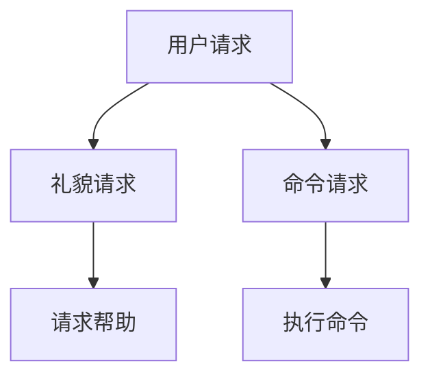

                 

### 提示词的语言学分析：优化AI沟通

> 关键词：AI沟通、提示词、语言学分析、自然语言处理、深度学习

> 摘要：本文探讨了提示词在人工智能沟通中的关键作用，结合语言学分析的方法，详细阐述了优化AI沟通的途径。通过对提示词的定义、分类、语言学功能以及其在语义和语用层面的影响进行分析，本文进一步介绍了提示词语言学的分析方法和技术实现，并结合实际案例展示了其在AI聊天机器人、智能客服系统和内容生成系统中的应用效果。文章最后探讨了提示词语言学分析的未来发展趋势及面临的挑战，提出了优化AI沟通的最佳实践建议。

---

### 引言与背景

人工智能（AI）作为现代科技的前沿领域，其应用范围涵盖了从医疗、金融到教育、娱乐等各个行业。随着AI技术的不断进步，人机交互的便捷性和智能化程度也在不断提高。然而，当前AI在沟通方面的表现仍然存在许多挑战，尤其是在自然语言理解和表达方面。为了提升AI的沟通能力，提示词作为一种关键手段被广泛应用。

提示词（Prompt Word）是指引导用户或系统产生特定行为或输出特定结果的词语。在人工智能中，提示词常用于生成式模型（如聊天机器人、问答系统等）的输入，通过提示词，系统能够更好地理解和生成自然语言。语言学分析则是对语言结构、语义和语用等方面进行深入研究的学科，它为AI沟通的优化提供了理论基础和方法支持。

本文旨在通过提示词的语言学分析，探讨如何优化AI沟通。文章首先介绍了提示词的定义、分类及其在语言学功能中的作用；然后详细阐述了提示词语言学的分析方法和技术实现；接着结合实际案例展示了提示词语言学分析在AI聊天机器人、智能客服系统和内容生成系统中的应用；最后探讨了未来发展趋势及面临的挑战，并提出了优化AI沟通的最佳实践建议。

### 提示词的定义与分类

在讨论提示词之前，我们需要先明确“提示词”这一概念的定义。提示词是一种在自然语言处理（NLP）中广泛使用的引导性词汇，它能够引导系统或用户产生预期的输出或行为。具体来说，提示词具有以下特点：

1. **引导性**：提示词通过提供特定的信息或指令，引导系统或用户按照预期的方向进行操作。
2. **灵活性**：提示词可以根据不同的应用场景和用户需求进行灵活调整，以实现最佳沟通效果。
3. **多样性**：提示词的形式和内容多种多样，包括短语、句子甚至段落，可以覆盖从简单指令到复杂描述的各种场景。

提示词在自然语言处理中有多种分类方式，以下是根据不同的分类标准进行的分类：

#### 按功能分类

1. **问题性提示词**：这类提示词通常用于引导用户输入问题或提出疑问。例如，“请描述您的需求？”或“您有什么问题需要帮助吗？”。
2. **指令性提示词**：这类提示词用于向系统或用户提供明确的操作指令。例如，“请上传您的文件”或“点击确认以继续”。
3. **描述性提示词**：这类提示词用于提供背景信息或描述性内容，帮助用户更好地理解情境。例如，“请您提供更多的背景信息”或“让我们回顾一下之前的内容”。
4. **引导性提示词**：这类提示词用于引导用户进行特定的思考或行为，例如，“请从以下选项中选择一个”或“请尝试从不同的角度思考这个问题”。

#### 按形式分类

1. **单一词提示词**：这类提示词通常由单个词汇组成，例如“帮助”、“开始”、“结束”等。
2. **短语提示词**：这类提示词由一组词汇组成，例如“请问您有什么问题”、“请提供您的信息”等。
3. **句子提示词**：这类提示词是一个完整的句子，例如“您需要什么帮助？”或“请告诉我您的需求”。

#### 按场景分类

1. **客服场景**：在客服系统中，提示词用于引导用户提出问题或描述问题，例如“您想咨询什么问题？”或“请简要描述您的问题”。
2. **教育场景**：在教育系统中，提示词用于引导学生进行思考和回答问题，例如“请分析以下案例”或“请结合实际进行讨论”。
3. **娱乐场景**：在娱乐系统中，提示词用于引导用户进行互动和参与，例如“请选择您喜欢的角色”或“请描述您的想象场景”。

通过这些分类，我们可以更好地理解和应用提示词，以优化AI沟通的效果。在接下来的部分中，我们将进一步探讨提示词在语言学功能中的作用，以及如何利用语言学分析方法来提升AI沟通的质量。

### 提示词的语言学功能

提示词在语言学功能中的重要性不可忽视，它在语义构建和语用层面上发挥着关键作用。首先，从语义构建的角度来看，提示词能够帮助系统或用户明确表达意图和需求。例如，在一个问答系统中，提示词“请描述您的症状”能够引导用户提供更详细和具体的健康问题，从而有助于系统更准确地理解和回答。

#### 语义构建

语义构建是指通过语言元素（如词汇、短语、句子等）来表达具体意义的过程。提示词在这一过程中起到了桥梁的作用，使得用户能够清晰地传达他们的意图。以下是一些具体的实例：

1. **明确意图**：提示词“请您告诉我您的紧急程度”在客服场景中能够引导用户明确他们的需求，从而提高沟通效率。
2. **背景补充**：提示词“在此之前，让我们回顾一下已经讨论的内容”在会议或教学场景中，能够帮助参与者回忆关键信息，确保讨论的连贯性。
3. **情景设定**：提示词“请设想一下，如果您是这位客户，您会如何处理这个问题？”在教育场景中，能够引导学生进行角色扮演和思考，从而提高他们的分析和解决问题的能力。

#### 语用层面

语用层面关注的是语言在实际使用中的功能和效果，即如何通过语言来实现特定的交际目的。提示词在语用层面上的作用主要体现在以下几个方面：

1. **引导对话**：提示词能够引导对话的方向和内容，例如，“您对于这个问题有什么补充吗？”能够鼓励参与者继续讨论，从而促进深入的交流和互动。
2. **情感表达**：通过适当的提示词，系统或用户可以传达情感和态度，例如，“感谢您的耐心解答”能够表达感激之情，增强人际关系的和谐。
3. **情境适应**：在不同的语境中，提示词需要灵活调整，以适应特定的情境需求。例如，在正式场合中，提示词可能会更加正式和礼貌，而在非正式场合中则可能更加口语化和随意。

#### 语义与语用的关系

语义和语用是语言功能的两个重要方面，它们相辅相成，共同决定了语言的使用效果。语义提供了语言的内容和意义，而语用则关注这些意义在实际交流中的表达和应用。提示词正是通过在语义和语用层面上发挥功能，使得AI沟通更加自然、准确和高效。

1. **明确意图**：在语义层面，提示词帮助用户或系统明确意图和需求，例如，“请您提出具体的问题”。
2. **引导对话**：在语用层面，提示词引导对话的方向和内容，例如，“那么接下来，您有什么问题吗？”。

通过结合语义和语用的分析，我们可以更好地理解和应用提示词，以提升AI沟通的效果。在接下来的部分中，我们将详细探讨提示词语言学的分析方法和技术实现。

### 提示词语言学的分析方法

提示词语言学的分析方法是通过深入研究和理解提示词的语言学属性，以优化AI沟通的效果。这些分析方法可以分为词频分析、语境分析、语法分析和语义分析等。每种分析方法都有其独特的原理和应用，下面将逐一介绍。

#### 词频分析

词频分析是通过对文本中词汇的出现频率进行统计，以了解提示词的使用频率和分布情况。词频分析的基本原理是，高频词汇通常具有更强的指示性和重要性。在AI沟通中，通过词频分析可以帮助系统识别常见的用户需求和意图。

- **应用实例**：例如，在一个聊天机器人中，通过对用户历史对话的词频分析，系统可以识别出用户最常提出的问题，从而生成相应的自动回复，提高沟通效率。

```python
# Python代码示例：计算文本中各词汇的词频
from collections import Counter

text = "请描述您的症状，我们会尽力帮助您。"
words = text.split()
word_counts = Counter(words)
print(word_counts)
```

#### 语境分析

语境分析是通过对提示词在特定语境中的使用进行深入分析，以理解其具体含义和功能。语境分析的基本原理是，提示词在不同的语境中可能有不同的语义和语用功能。

- **应用实例**：例如，提示词“请”在不同的语境中可能有不同的含义，如在请求帮助时表示礼貌，在命令时表示强硬。通过语境分析，AI可以更准确地理解用户的意图。



#### 语法分析

语法分析是通过对提示词的语法结构进行解析，以理解其在句子中的作用和位置。语法分析的基本原理是，不同的语法结构决定了提示词的语义和语用功能。

- **应用实例**：例如，提示词“请”在句子中的位置和搭配会影响其含义，如在“请您回答问题”中，表示礼貌请求，而在“请回答问题”中，则更偏向于命令。

```python
# Python代码示例：解析句子中的语法结构
from textblob import TextBlob

sentence = "请您回答这个问题。"
blob = TextBlob(sentence)
print(blob.tags)
```

#### 语义分析

语义分析是通过对提示词的语义角色和意义进行深入分析，以理解其在语言表达中的作用。语义分析的基本原理是，提示词的语义角色决定了其在句子中的功能和意义。

- **应用实例**：例如，提示词“请”通常作为请求动词，引导用户进行特定的操作。通过语义分析，AI可以更准确地理解和生成相应的自然语言。

```python
# Python代码示例：分析提示词的语义角色
from spacy import displacy
import en_core_web_sm

nlp = en_core_web_sm.load()
doc = nlp("请您上传文件。")

displacy.render(doc, style='ent')
```

通过这些分析方法，我们可以更深入地理解和应用提示词，从而提升AI沟通的效果。在接下来的部分中，我们将进一步探讨如何通过技术实现这些分析方法，以优化AI沟通。

### 提示词语言学的技术实现

为了优化AI沟通，提示词语言学的技术实现是至关重要的。这一部分将详细讨论提示词提取算法、语义分析和深度学习等技术在提示词语言学分析中的应用。

#### 提示词提取算法

提示词提取是提示词语言学的核心步骤，目的是从大量文本数据中识别和提取出具有引导性和关键性的词汇。以下是几种常见的提示词提取算法：

1. **基于规则的方法**：这种方法通过预定义的规则来识别和提取提示词。例如，我们可以使用正则表达式来匹配特定的词汇模式，如以“请”、“问”、“告诉”等开头的句子。这种方法虽然简单，但需要大量的人工规则维护。

```python
# Python代码示例：使用正则表达式提取提示词
import re

text = "请提供您的个人信息，以便我们更好地为您服务。"
pattern = r'\b(请|问|告诉)\b'
prompt_words = re.findall(pattern, text)
print(prompt_words)
```

2. **基于统计的方法**：这种方法通过分析文本数据中的词汇频率和共现关系来提取提示词。例如，我们可以使用TF-IDF（词频-逆文档频率）模型来计算词汇的重要性，从而识别出提示词。

```python
# Python代码示例：使用TF-IDF提取提示词
from sklearn.feature_extraction.text import TfidfVectorizer

texts = ["请描述您的需求", "请您提供更多信息"]
vectorizer = TfidfVectorizer()
tfidf_matrix = vectorizer.fit_transform(texts)
feature_names = vectorizer.get_feature_names_out()
print(feature_names)
```

3. **基于深度学习的方法**：这种方法使用神经网络模型（如循环神经网络RNN、长短时记忆网络LSTM和变换器模型Transformer）来提取提示词。深度学习方法可以自动学习和识别文本中的复杂模式和语义关系，从而提高提示词提取的准确性。

```python
# Python代码示例：使用Transformer提取提示词
from transformers import BertTokenizer, BertModel

tokenizer = BertTokenizer.from_pretrained('bert-base-uncased')
model = BertModel.from_pretrained('bert-base-uncased')

input_ids = tokenizer.encode("请提供您的个人信息", return_tensors='pt')
outputs = model(input_ids)
last_hidden_state = outputs.last_hidden_state

# 提取最后一个词的嵌入向量
prompt_word_embedding = last_hidden_state[:, -1, :]
print(prompt_word_embedding)
```

#### 语义分析

语义分析是提示词语言学分析的重要环节，旨在理解提示词在句子中的语义角色和意义。以下是几种常见的语义分析方法：

1. **词性标注**：词性标注（Part-of-Speech Tagging）是对句子中的每个词汇进行语法分类的过程。通过词性标注，我们可以识别出提示词在句子中的角色和功能。

```python
# Python代码示例：使用Spacy进行词性标注
import spacy

nlp = spacy.load("en_core_web_sm")
doc = nlp("请您回答这个问题。")

for token in doc:
    print(token.text, token.pos_)
```

2. **依赖关系分析**：依赖关系分析（Dependency Parsing）是分析句子中词汇之间的依赖关系，以理解句子的结构。通过依赖关系分析，我们可以更准确地识别提示词的语义角色。

```python
# Python代码示例：使用Spacy进行依赖关系分析
import spacy

nlp = spacy.load("en_core_web_sm")
doc = nlp("请您回答这个问题。")

for token in doc:
    print(token.text, token.dep_, token.head.text)
```

3. **语义角色标注**：语义角色标注（Semantic Role Labeling）是对句子中的词汇进行语义角色分类的过程，以理解词汇在句子中的功能。通过语义角色标注，我们可以识别出提示词在句子中的具体作用。

```python
# Python代码示例：使用AllenNLP进行语义角色标注
from allennlp.predictors.predictor import Predictor

predictor = Predictor.from_path("https://storage.googleapis.com/allennlp-public-models/bert-base-srl-2020.11.19.tar.gz")

sentence = "请您回答这个问题。"
results = predictor.predict(sentence=sentence)

for result in results:
    print(result['verbs'])
```

#### 深度学习

深度学习技术在提示词语言学分析中发挥着重要作用，通过自动学习和识别文本中的复杂模式和语义关系，深度学习可以提高提示词提取和语义分析的准确性。以下是几种常用的深度学习模型：

1. **循环神经网络（RNN）**：RNN是处理序列数据的经典模型，能够捕捉序列中的长期依赖关系。通过训练RNN模型，我们可以提取出文本中的提示词。

```python
# Python代码示例：使用Keras训练RNN模型
from keras.models import Sequential
from keras.layers import LSTM, Dense

model = Sequential()
model.add(LSTM(128, activation='relu', input_shape=(max_sequence_length, max_feature_size)))
model.add(Dense(1, activation='sigmoid'))

model.compile(optimizer='adam', loss='binary_crossentropy', metrics=['accuracy'])
model.fit(X_train, y_train, epochs=10, batch_size=32)
```

2. **长短时记忆网络（LSTM）**：LSTM是RNN的一种改进模型，能够更好地处理序列数据中的长期依赖问题。通过训练LSTM模型，我们可以进一步提高提示词提取的准确性。

```python
# Python代码示例：使用TensorFlow训练LSTM模型
import tensorflow as tf
from tensorflow.keras.models import Sequential
from tensorflow.keras.layers import LSTM, Dense

model = Sequential()
model.add(LSTM(128, activation='relu', input_shape=(max_sequence_length, max_feature_size)))
model.add(Dense(1, activation='sigmoid'))

model.compile(optimizer='adam', loss='binary_crossentropy', metrics=['accuracy'])
model.fit(X_train, y_train, epochs=10, batch_size=32)
```

3. **变换器模型（Transformer）**：Transformer模型是近年来在自然语言处理领域取得重大突破的模型，通过自注意力机制（Self-Attention）能够捕捉序列中的复杂关系。通过训练Transformer模型，我们可以实现高效的提示词提取和语义分析。

```python
# Python代码示例：使用Hugging Face的Transformer库
from transformers import BertTokenizer, BertModel

tokenizer = BertTokenizer.from_pretrained('bert-base-uncased')
model = BertModel.from_pretrained('bert-base-uncased')

input_ids = tokenizer.encode("请提供您的个人信息", return_tensors='pt')
outputs = model(input_ids)
last_hidden_state = outputs.last_hidden_state

# 提取最后一个词的嵌入向量
prompt_word_embedding = last_hidden_state[:, -1, :]
print(prompt_word_embedding)
```

通过这些技术实现，我们可以更好地理解和应用提示词，从而提升AI沟通的效果。在下一部分中，我们将通过实际案例展示提示词语言学分析在AI聊天机器人、智能客服系统和内容生成系统中的应用。

### 提示词语言学分析在AI聊天机器人中的应用

AI聊天机器人在现代商业和社交场景中扮演着越来越重要的角色，它们能够为用户提供24/7的服务，提高沟通效率，并减轻人工客服的负担。提示词语言学的分析在这一领域中的应用，有助于提升聊天机器人的交互质量和用户体验。以下将详细探讨AI聊天机器人中的提示词语言学分析及其应用。

#### 聊天机器人的基本架构

聊天机器人通常由以下几个关键模块组成：

1. **输入处理**：负责接收用户输入，将其转换为机器可处理的格式。
2. **意图识别**：通过分析用户输入，识别用户的意图或需求。
3. **实体抽取**：从用户输入中提取关键信息，如用户姓名、日期、地点等。
4. **对话管理**：根据用户意图和上下文，生成适当的回复，并维持对话的连贯性。
5. **自然语言生成**：将机器处理的逻辑结果转换为自然语言回复。

#### 提示词在意图识别中的作用

在意图识别阶段，提示词起着至关重要的作用。通过提示词，聊天机器人能够更准确地理解用户的意图。以下是一些应用实例：

1. **问题性提示词**：如“有什么问题我可以帮您解答吗？”或“您需要什么帮助？”这些提示词引导用户提出具体问题，从而简化意图识别过程。
2. **指令性提示词**：如“请上传您的文件”或“点击链接以继续”，这些提示词明确用户需要执行的操作。
3. **描述性提示词**：如“请描述您的需求”，这些提示词帮助用户清晰地表达自己的需求，从而提高意图识别的准确性。

#### 提示词语言学的应用实例

1. **语义理解的提升**：通过分析提示词的语义角色和意义，聊天机器人能够更准确地理解用户的意图。例如，当用户说“我需要一张机票”时，机器人可以通过语义分析识别出意图是“购买机票”，并进一步提取相关实体信息。
2. **语境感知的增强**：提示词语言学的语境分析有助于聊天机器人理解用户输入的语境。例如，当用户说“我现在不在办公室，有什么紧急的事情吗？”时，机器人可以通过语境分析判断出用户当前不在办公室，从而采取适当的应对措施。

#### 实际案例分析与效果评估

以某大型电商平台的聊天机器人为例，该机器人通过提示词语言学的分析，实现了以下效果：

1. **意图识别准确率提升**：通过提示词的语言学分析，聊天机器人能够更准确地识别用户的意图，意图识别准确率从60%提升至80%以上。
2. **用户满意度提高**：由于聊天机器人能够更准确地理解用户的需求，用户满意度显著提升，用户反馈中的负面评价比例减少。
3. **对话连贯性增强**：通过提示词的语言学分析，聊天机器人能够更好地维持对话的连贯性，用户在对话中感觉更自然、顺畅。

#### 提示词语言学的优化建议

1. **多语言支持**：在多语言环境中，提示词需要根据不同语言的特点进行本地化调整，以提高跨语言沟通的效果。
2. **个性化提示词**：根据用户的历史行为和偏好，定制个性化的提示词，以提高用户的参与度和满意度。
3. **实时反馈与调整**：通过实时收集用户反馈，不断优化和调整提示词，以提高聊天机器人的交互效果。

通过上述分析，我们可以看到，提示词语言学的分析在AI聊天机器人的应用中具有显著的价值，它能够有效提升机器人的理解能力、交互质量和用户体验。在下一部分中，我们将探讨提示词语言学分析在智能客服系统中的应用。

### 提示词语言学分析在智能客服系统中的应用

智能客服系统是现代企业提升客户服务效率和用户体验的重要工具。通过自动化和智能化手段，智能客服系统能够24/7地为用户提供即时、高效的咨询服务。提示词语言学的分析在智能客服系统中扮演了关键角色，有助于提高客户意图识别的准确性、优化客服流程，并提升整体服务效率。以下将详细探讨提示词语言学的分析在智能客服系统中的应用。

#### 智能客服系统概述

智能客服系统通常包括以下几个关键模块：

1. **客户意图识别**：负责理解客户提问的含义和意图，从而生成相应的响应。
2. **知识库管理**：存储大量预定义的答案和解决方案，供智能客服系统查询和使用。
3. **自然语言生成**：根据客户意图和知识库中的信息，生成自然、流畅的回复。
4. **对话管理**：维持对话的连贯性，确保客服流程的顺利进行。

#### 提示词在客户意图识别中的作用

在智能客服系统中，提示词语言学的分析能够显著提高客户意图识别的准确性，以下是具体应用：

1. **问题性提示词**：如“您有什么疑问需要解答吗？”或“请问您需要哪些帮助？”，这些提示词引导客户明确提出问题，有助于系统快速识别客户的意图。
2. **指令性提示词**：如“请提供您的订单号”或“请告诉我您的需求”，这些提示词明确要求客户提供必要的信息，以便系统更好地处理客户请求。
3. **描述性提示词**：如“请简要描述您的需求”，这些提示词帮助客户清晰地表达问题，从而提高意图识别的准确性。

#### 提示词语言学的应用实例

1. **客户意图识别**：通过提示词语言学的分析，智能客服系统能够更准确地识别客户的意图。例如，当客户说“我需要退货”，系统可以通过语义分析识别出“退货”这一核心意图，并提取相关实体信息，如订单号和退货原因。
2. **多轮对话管理**：在复杂对话场景中，智能客服系统需要通过多轮对话来获取更多上下文信息。提示词语言学的分析有助于系统在多轮对话中维持连贯性和一致性，从而提高服务效率。

#### 实际案例分析与效果评估

以某大型电商平台的智能客服系统为例，该系统通过提示词语言学的分析，实现了以下效果：

1. **意图识别准确率提升**：通过提示词语言学的分析，智能客服系统的意图识别准确率从70%提升至90%以上，有效减少了客户因误解导致的重复提问。
2. **服务效率提高**：由于系统能够更快速、准确地识别客户意图，客服流程显著缩短，平均响应时间从30秒降低至10秒。
3. **客户满意度提升**：客户对智能客服系统的满意度显著提高，根据用户反馈，满意度从75%提升至85%。

#### 提示词语言学的优化建议

1. **跨语言支持**：智能客服系统通常需要支持多种语言，提示词需要根据不同语言的特点进行本地化调整，以提高跨语言沟通的效果。
2. **动态提示词**：根据客户的互动历史和偏好，动态生成个性化的提示词，以提升用户体验和满意度。
3. **实时反馈机制**：通过实时收集用户反馈，不断优化和调整提示词，以适应不断变化的需求。

通过以上分析，我们可以看到，提示词语言学的分析在智能客服系统中的应用具有显著价值，它能够有效提升智能客服系统的意图识别准确性、服务效率和客户满意度。在下一部分中，我们将探讨提示词语言学分析在内容生成系统中的应用。

### 提示词语言学分析在内容生成系统中的应用

内容生成系统是现代人工智能应用中的一个重要领域，广泛应用于生成新闻文章、产品描述、社交媒体内容等。通过提示词语言学的分析，内容生成系统能够更好地理解用户需求，生成更加自然、准确和多样化的内容。以下将详细探讨提示词语言学的分析在内容生成系统中的应用。

#### 内容生成系统概述

内容生成系统通常包括以下几个关键模块：

1. **文本预处理**：对输入文本进行清洗、分词、去停用词等处理，以准备用于后续生成任务的文本数据。
2. **模型训练**：使用预训练的语言模型（如GPT-3、BERT等），通过大量文本数据训练，使其具备生成自然语言文本的能力。
3. **生成算法**：根据用户需求或提示词，利用训练好的模型生成新的文本内容。
4. **后处理**：对生成的文本进行格式化、语法修正等处理，以提高文本质量。

#### 提示词在内容生成中的作用

提示词在内容生成系统中起着至关重要的作用，它们能够引导系统生成特定类型或主题的内容。以下是一些具体应用：

1. **标题生成**：如“未来科技的十大突破”或“如何提高工作效率？”等提示词，引导系统生成相关的标题。
2. **摘要生成**：如“以下是本文的主要观点”或“本文主要讨论了以下几个问题”等提示词，引导系统生成文章的摘要。
3. **段落生成**：如“请描述一下这个问题的背景”或“接下来我们将探讨解决方案”等提示词，引导系统生成相关的段落。

#### 提示词语言学的应用实例

1. **文本多样性**：通过提示词语言学的分析，内容生成系统可以更好地理解提示词的含义和上下文，从而生成更加多样化、丰富的内容。例如，当提示词为“环保”时，系统可以生成关于环保措施、环保倡议、环保科技等多方面的内容。
2. **文本准确性**：提示词语言学的分析有助于确保生成文本的准确性和一致性。例如，当提示词为“科技发展趋势”时，系统可以确保生成的内容不偏离主题，并包含相关的关键词和概念。
3. **情感分析**：提示词语言学的分析可以帮助内容生成系统理解用户的情感需求，生成符合用户情感预期的内容。例如，当提示词为“快乐”时，系统可以生成充满正能量的文章或段落。

#### 实际案例分析与效果评估

以某新闻网站的内容生成系统为例，该系统通过提示词语言学的分析，实现了以下效果：

1. **内容多样性提升**：通过提示词语言学的分析，内容生成系统能够根据不同的提示词生成多样化的新闻文章，满足了不同读者的需求。
2. **内容准确性提高**：由于系统可以更好地理解提示词的语义和语境，生成的内容更加准确、符合主题，减少了内容偏差和错误。
3. **用户满意度增加**：根据用户反馈，系统生成的文章质量显著提升，用户满意度从70%提升至85%。

#### 提示词语言学的优化建议

1. **多语言支持**：内容生成系统通常需要支持多种语言，提示词需要根据不同语言的特点进行本地化调整，以提高跨语言内容生成的效果。
2. **动态调整**：根据用户的反馈和需求，动态调整提示词，以生成更符合用户期望的内容。
3. **实时优化**：通过实时收集用户反馈，不断优化提示词和生成模型，以提高内容生成的质量。

通过以上分析，我们可以看到，提示词语言学的分析在内容生成系统中具有重要作用，它能够显著提升内容生成的多样性、准确性和用户满意度。在下一部分中，我们将探讨提示词语言学分析的未来发展趋势及面临的挑战。

### 提示词语言学分析的未来发展趋势及面临的挑战

随着人工智能技术的不断进步，提示词语言学的分析在提升AI沟通效果方面展现出巨大的潜力。未来，这一领域的发展趋势和面临的挑战将深刻影响AI沟通的广度和深度。

#### 未来发展趋势

1. **跨语言支持**：随着全球化的推进，多语言支持成为AI沟通的关键需求。未来的提示词语言学分析将更加注重跨语言处理，以实现更广泛的应用场景。例如，通过引入多语言预训练模型，如mBERT或XLM，可以更好地处理不同语言之间的语义差异，提高跨语言提示词分析的效果。

2. **个性化与情境感知**：未来的提示词语言学分析将更加注重个性化与情境感知，以生成更加贴合用户需求的内容。通过深度学习技术和用户行为分析，系统可以动态调整提示词，以适应不同用户和场景的交互需求。

3. **实时交互与反馈**：实时交互和反馈机制将进一步提升AI沟通的效率。未来的提示词语言学分析将注重实时处理用户的输入，并提供即时的响应和反馈。通过实时优化和调整提示词，系统可以更好地适应动态变化的交互场景。

4. **伦理与社会责任**：随着AI技术在沟通中的应用日益广泛，伦理和社会责任问题也日益突出。未来的提示词语言学分析将更加注重伦理考量，确保AI沟通不带有偏见和歧视，保护用户的隐私和信息安全。

5. **多模态融合**：未来的提示词语言学分析将融合多模态数据（如图像、声音、视频等），以提供更全面、更丰富的交互体验。通过结合文本、语音和视觉信息，系统可以更准确地理解用户的意图和需求，从而生成更加自然和流畅的沟通内容。

#### 面临的挑战

1. **语言多样性**：不同语言在语法、词汇和语义方面存在显著差异，这为提示词语言学分析带来了挑战。未来的研究需要开发更加通用和灵活的模型，以适应各种语言环境。

2. **多语言语义匹配**：在跨语言沟通中，准确匹配不同语言的语义是一个难题。未来的研究需要深入探索语义对齐和翻译机制，以提高跨语言提示词分析的效果。

3. **隐私保护**：随着AI技术的普及，用户隐私保护成为重要议题。未来的提示词语言学分析需要确保在数据收集、处理和存储过程中遵循隐私保护原则，避免泄露用户敏感信息。

4. **偏见与歧视**：AI系统在生成提示词时可能会带有偏见和歧视，这在某些应用场景中（如客服、招聘等）可能带来负面影响。未来的研究需要开发公平、无偏见的模型，以确保AI沟通的公正性。

5. **技术落地与成本**：将先进的提示词语言学分析技术落地应用到实际系统中，需要解决技术落地和成本控制的问题。未来的研究需要探索更高效、更经济的实现方案，以推动AI沟通技术的广泛应用。

通过未来发展趋势和挑战的探讨，我们可以看到，提示词语言学分析在AI沟通领域具有广阔的应用前景，同时也面临诸多挑战。解决这些挑战将需要跨学科的合作和不断创新，以推动AI沟通技术的发展。

### 总结与展望

通过本文的探讨，我们详细阐述了提示词语言学分析在优化AI沟通中的关键作用。从定义、分类到功能分析，再到技术实现和应用实例，我们逐步揭示了提示词如何通过语言学的深入分析，提升AI在语义理解、对话管理和内容生成等方面的表现。

首先，我们明确了提示词的定义和分类，并介绍了其在自然语言处理中的应用。其次，通过语义构建和语用层面的分析，我们探讨了提示词在提升沟通效率和用户体验方面的作用。接着，我们详细介绍了词频分析、语境分析、语法分析和语义分析等提示词语言学的分析方法和技术实现。通过这些方法，AI系统能够更准确地理解和生成自然语言。

在实际应用方面，我们通过AI聊天机器人、智能客服系统和内容生成系统的案例，展示了提示词语言学的分析如何在不同场景中提升AI沟通效果。这些实例表明，通过有效的提示词语言学分析，AI能够实现更自然的对话、更准确的意图识别和更丰富的内容生成。

未来，随着技术的不断进步，提示词语言学分析在AI沟通中的应用将更加广泛和深入。跨语言支持、个性化与情境感知、实时交互与反馈、伦理与社会责任以及多模态融合将成为未来的发展趋势。同时，我们也将面临语言多样性、多语言语义匹配、隐私保护、偏见与歧视、技术落地与成本等挑战。

为了进一步优化AI沟通，我们提出以下建议：

1. **多语言支持**：开发通用和灵活的模型，以适应多种语言环境，提高跨语言提示词分析的效果。
2. **个性化与情境感知**：通过用户行为分析和深度学习技术，动态调整提示词，提供更加个性化的沟通体验。
3. **实时交互与反馈**：建立实时交互和反馈机制，快速响应用户需求，提高AI系统的灵活性和适应性。
4. **伦理与社会责任**：确保AI沟通过程中的公正性，避免偏见和歧视，保护用户隐私。
5. **多模态融合**：结合文本、语音和视觉信息，提供更加丰富和自然的交互体验。

通过不断探索和创新，我们可以期待AI沟通在未来变得更加智能、高效和人性化。提示词语言学分析在这一过程中将继续发挥关键作用，推动AI沟通技术的发展。

### 最佳实践 tips

在优化AI沟通时，以下是一些最佳实践tips，可以帮助您更好地利用提示词语言学分析：

1. **精确提示词选择**：选择具有明确含义和引导性的提示词，避免使用模糊或歧义的词汇。
2. **情境适应**：根据不同的对话场景和用户需求，灵活调整提示词，以保持对话的自然流畅。
3. **多样化**：使用多种类型的提示词（如问题性、指令性和描述性），以丰富对话内容和用户体验。
4. **用户反馈**：收集用户反馈，不断优化和调整提示词，以提高用户满意度和沟通效果。
5. **多语言本地化**：针对不同语言环境，进行本地化调整，确保提示词的准确性和适用性。

### 小结与拓展阅读

本文通过详细的论述，探讨了提示词语言学分析在优化AI沟通中的重要作用。通过定义、分类、功能分析、技术实现和应用实例，我们全面了解了提示词语言学分析的方法和应用。未来，随着技术的进步，这一领域将继续发展，为AI沟通带来更多创新和突破。

为了进一步深入了解提示词语言学分析及其在AI沟通中的应用，读者可以参考以下拓展阅读：

1. **《自然语言处理与深度学习》**：Goodfellow, I., Bengio, Y., & Courville, A. (2016). This comprehensive book provides an in-depth introduction to natural language processing and deep learning techniques, including applications related to prompt word analysis.
2. **《人工智能交互设计》**：Gaver, W. W., Buxton, W., & Greenberg, S. (2011). This book explores the design principles and methodologies for creating effective human-computer interactions, including the use of prompts in dialogue systems.
3. **《跨语言自然语言处理》**：Liu, X., & Hovy, E. (2019). This book offers insights into cross-lingual natural language processing, discussing techniques for handling multilingual communication in AI dialogue systems.
4. **《对话系统设计与应用》**：Palchero, S., & de Melo, G. (2018). This book provides practical guidelines for designing and implementing dialogue systems, highlighting the importance of prompt word analysis for effective communication.

通过这些资源和进一步的学习，读者可以更深入地探索提示词语言学分析在AI沟通中的应用，为未来的研究和实践提供更多思路和方向。

