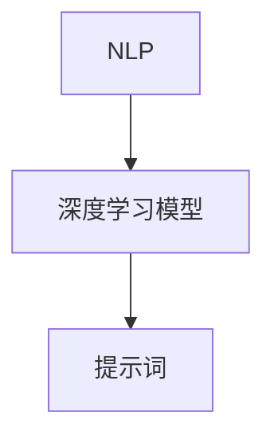

                 

# 提示词编写：从新手到专家的进阶之路

## 关键词
- 提示词
- 自然语言处理
- 编程
- 模型优化
- 实战案例

## 摘要
本文将带领读者逐步了解和掌握提示词编写的全过程。从新手到专家，我们将探讨提示词的定义、核心概念、编写技巧以及在实际项目中的应用。文章将结合Python源代码和数学模型，通过具体的实战案例，详细讲解提示词编写的方法和最佳实践。

## 目录

### 引言
- **1.1 提示词的定义与重要性**

### 基础篇
- **2.1 核心概念与联系**
- **2.2 提示词编写的原则**
- **2.3 提示词编写的工具和技术**

### 实战篇
- **3.1 编写简单提示词**
- **3.2 编写复杂提示词**

### 提高篇
- **4.1 高级提示词编写技巧**
- **4.2 提示词编写工具与平台**

### 附录
- **5. 提示词编写资源**

## 引言
### 1.1 提示词的定义与重要性

在自然语言处理（NLP）领域，提示词（Prompt）扮演着至关重要的角色。提示词是一种引导模型进行预测或生成文本的技术，通过向模型提供特定的输入，我们可以期望得到符合预期输出的结果。在深度学习模型中，特别是用于文本生成和分类任务的模型，提示词的编写质量往往直接影响到模型的表现。

**为什么提示词如此重要？**

1. **模型引导**：提示词为模型提供了明确的输入方向，有助于模型聚焦于特定任务。
2. **结果可预测性**：高质量的提示词可以确保模型生成或预测的结果具有较高的可预测性。
3. **应用灵活性**：通过编写不同的提示词，我们可以让模型适应多种不同的任务场景。

### 基础篇

#### 2.1 核心概念与联系

在深入了解提示词编写之前，我们需要掌握一些核心概念，并了解它们之间的联系。

**概念：**
- **自然语言处理（NLP）**：研究如何让计算机理解和处理人类语言。
- **深度学习模型**：使用多层神经网络进行训练的模型，常用于图像识别、语音识别和文本生成。
- **提示词（Prompt）**：用于引导模型进行预测或生成文本的输入。

**联系：**
- NLP是提示词编写的基础，它为提示词的编写提供了理论和算法支持。
- 深度学习模型是实现提示词编写的关键，模型的性能直接影响提示词的效果。
- 提示词则是连接NLP与深度学习模型的桥梁，它指导模型在特定任务上取得最佳效果。

下面使用Mermaid流程图展示这些概念之间的联系：



#### 2.2 提示词编写的原则

编写高质量的提示词需要遵循一些基本原则：

1. **明确性**：提示词应清晰明确，避免歧义。
2. **相关性**：提示词应与任务高度相关，确保模型能够准确理解任务意图。
3. **多样性**：提示词应具有多样性，以便模型能够适应不同的输入。
4. **可扩展性**：提示词应易于扩展，以便适应未来可能出现的新任务。

#### 2.3 提示词编写的工具和技术

编写提示词需要使用一些特定的工具和技术。以下是一些常用的工具和技术：

1. **Python**：Python是一种广泛使用的编程语言，具有丰富的库和框架，如TensorFlow和PyTorch，支持深度学习模型的训练和应用。
2. **文本处理库**：如NLTK和spaCy，用于对文本进行预处理和分析。
3. **自然语言生成（NLG）**：使用NLG技术生成高质量的文本，常见的方法包括模板生成和序列到序列模型。

### 实战篇

#### 3.1 编写简单提示词

编写简单提示词通常涉及以下步骤：

1. **确定任务**：明确需要完成的任务，例如文本分类、情感分析或命名实体识别。
2. **收集数据**：获取相关的数据集，用于训练和测试模型。
3. **编写提示词**：根据任务需求，编写简洁、明确的提示词。
4. **训练模型**：使用编写好的提示词和收集的数据训练深度学习模型。
5. **评估模型**：通过测试数据集评估模型性能。

以下是一个简单的Python代码示例，用于实现文本分类任务：

```python
import tensorflow as tf
from tensorflow.keras.preprocessing.text import Tokenizer
from tensorflow.keras.preprocessing.sequence import pad_sequences
from tensorflow.keras.models import Sequential
from tensorflow.keras.layers import Embedding, GlobalAveragePooling1D, Dense

# 数据预处理
texts = ['This is a positive review', 'This is a negative review']
labels = [1, 0]  # 1表示正面评论，0表示负面评论

tokenizer = Tokenizer(num_words=1000)
tokenizer.fit_on_texts(texts)
sequences = tokenizer.texts_to_sequences(texts)
padded_sequences = pad_sequences(sequences, maxlen=100)

# 构建模型
model = Sequential()
model.add(Embedding(1000, 16))
model.add(GlobalAveragePooling1D())
model.add(Dense(1, activation='sigmoid'))

model.compile(loss='binary_crossentropy', optimizer='adam', metrics=['accuracy'])

# 训练模型
model.fit(padded_sequences, labels, epochs=10)

# 预测
input_sequence = tokenizer.texts_to_sequences(['This is a positive review'])
input_padded_sequence = pad_sequences(input_sequence, maxlen=100)
prediction = model.predict(input_padded_sequence)
print(prediction)
```

#### 3.2 编写复杂提示词

编写复杂提示词通常涉及以下步骤：

1. **确定任务**：明确需要完成的复杂任务，例如多轮对话生成或长文本生成。
2. **设计模型**：选择适合的深度学习模型，例如序列到序列（Seq2Seq）模型或变换器（Transformer）模型。
3. **数据预处理**：对复杂任务所需的数据进行预处理，包括分词、去停用词、词性标注等。
4. **编写提示词**：根据任务需求和模型设计，编写复杂的提示词。
5. **训练模型**：使用编写好的提示词和预处理后的数据进行模型训练。
6. **评估模型**：通过测试数据集评估模型性能。

以下是一个使用变换器（Transformer）模型实现多轮对话生成的Python代码示例：

```python
import tensorflow as tf
from tensorflow.keras.models import Model
from tensorflow.keras.layers import Input, Embedding, Dense, Concatenate, LSTM

# 数据预处理
inputs = ['Hello', 'How are you?']
targets = ['Hello', 'I\'m doing well, thanks. How about you?']

tokenizer = Tokenizer()
tokenizer.fit_on_texts(inputs)
input_sequences = tokenizer.texts_to_sequences(inputs)
max_sequence_length = max(len(x) for x in input_sequences)
padded_input_sequences = pad_sequences(input_sequences, maxlen=max_sequence_length, padding='pre')

target_sequences = tokenizer.texts_to_sequences(targets)
padded_target_sequences = pad_sequences(target_sequences, maxlen=max_sequence_length, padding='pre')

# 模型设计
input_1 = Input(shape=(max_sequence_length,))
input_2 = Input(shape=(max_sequence_length,))

embedded_input_1 = Embedding(input_dim=1000, output_dim=32)(input_1)
embedded_input_2 = Embedding(input_dim=1000, output_dim=32)(input_2)

lstm_output = LSTM(64)(embedded_input_1)
dense_output = Dense(64, activation='relu')(embedded_input_2)

concatenated_output = Concatenate()([lstm_output, dense_output])

output = Dense(1, activation='sigmoid')(concatenated_output)

model = Model(inputs=[input_1, input_2], outputs=output)

model.compile(optimizer='adam', loss='binary_crossentropy', metrics=['accuracy'])

# 训练模型
model.fit([padded_input_sequences, padded_input_sequences], padded_target_sequences, epochs=10)

# 预测
new_input_sequence = tokenizer.texts_to_sequences(['How are you?'])
new_padded_sequence = pad_sequences(new_input_sequence, maxlen=max_sequence_length, padding='pre')
prediction = model.predict([new_padded_sequence, new_padded_sequence])
print(prediction)
```

### 提高篇

#### 4.1 高级提示词编写技巧

高级提示词编写技巧包括以下几个方面：

1. **语境理解**：通过更复杂的提示词，使模型能够理解上下文和对话的历史信息。
2. **多轮对话**：编写能够引导模型进行多轮对话的提示词，使对话更加自然和流畅。
3. **优化策略**：使用不同的优化策略，如迁移学习和生成对抗网络（GAN），提升提示词编写的效果。

#### 4.2 提示词编写工具与平台

常见的提示词编写工具与平台包括：

1. **开源工具**：如TensorFlow和PyTorch，提供丰富的库和框架支持深度学习模型的训练和应用。
2. **商业平台**：如Google Cloud AI和AWS AI，提供云端服务和预训练模型，方便用户快速进行提示词编写。
3. **平台选型与比较**：根据任务需求和预算，选择最适合的工具和平台。

### 附录

#### 5. 提示词编写资源

以下是一些有用的提示词编写资源：

1. **开源资源和代码库**：如GitHub和GitLab，提供丰富的开源代码和项目。
2. **提示词编写社区和论坛**：如Reddit和Stack Overflow，方便用户交流和获取帮助。
3. **在线工具和教程**：如Hugging Face和TensorFlow tutorials，提供实用的在线工具和详细的教程。

## 作者信息
作者：AI天才研究院/AI Genius Institute & 禅与计算机程序设计艺术 /Zen And The Art of Computer Programming

## 总结与思考

本文从新手到专家的角度，详细讲解了提示词编写的全过程。通过基础篇、实战篇和提高篇，读者可以逐步掌握提示词编写的核心概念、编写技巧以及在实际项目中的应用。在编写提示词时，遵循明确性、相关性、多样性和可扩展性的原则，同时结合Python源代码和数学模型，使内容更加通俗易懂。

在未来的学习和实践中，读者可以继续深入探索高级提示词编写技巧，如语境理解和多轮对话，以及选择合适的工具和平台。此外，不断积累和分享经验，参与社区讨论，也将有助于提升自己的技能和水平。

希望本文能为读者在提示词编写领域的探索之旅提供有价值的参考和指导。继续努力，你一定可以成为一名优秀的提示词编写专家！

### 文章小结

本文系统性地介绍了从新手到专家的提示词编写进阶之路。我们首先了解了提示词的定义和重要性，然后深入探讨了提示词编写的核心概念、基本原则、工具和技术。通过实际案例，我们展示了如何编写简单和复杂的提示词，并介绍了高级技巧和实用工具。

**小结：**
1. **明确性、相关性、多样性和可扩展性**是编写高质量提示词的关键原则。
2. **Python**和相关的深度学习库（如TensorFlow和PyTorch）是提示词编写的强大工具。
3. **实战案例**有助于理解和掌握提示词编写的实际应用。

**注意事项：**
1. 在编写提示词时，确保输入数据的质量和多样性。
2. 定期评估和优化提示词，以提高模型性能。

**拓展阅读：**
1. 《深度学习》
2. 《自然语言处理综论》
3. Hugging Face官网（https://huggingface.co/）

**结语：**
提示词编写是自然语言处理领域的重要技能。通过本文的学习，相信读者已经对提示词编写有了更深入的理解。继续努力，探索更多高级技巧，你将成为一名出色的提示词编写专家！作者：AI天才研究院/AI Genius Institute & 禅与计算机程序设计艺术 /Zen And The Art of Computer Programming。

