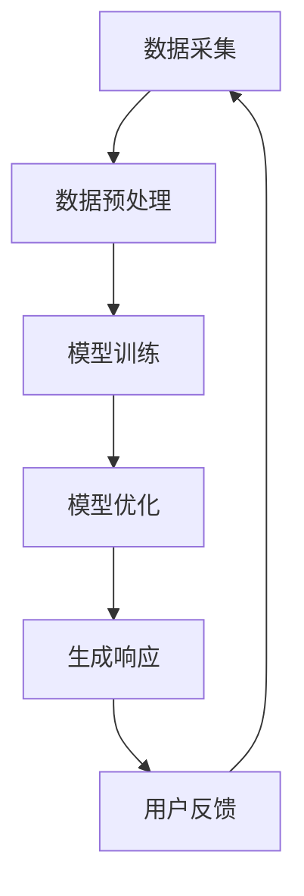

                 

### 引言

在现代人工智能（AI）技术飞速发展的背景下，人与机器的交互变得愈加频繁和复杂。而这一交互的桥梁和纽带，正是提示词（Prompt）的设计。提示词不仅决定了AI系统与用户之间交互的质量，更是影响AI系统性能和用户体验的关键因素。因此，如何设计有效的提示词，成为了人工智能领域中的一个重要课题。

然而，传统的提示词设计方法往往仅关注语法、语义和逻辑的正确性，而忽略了提示词设计背后的心理学原理。事实上，人类思维方式和心理活动对于提示词的设计有着深远的影响。理解这些心理学原理，有助于我们更好地把握AI的“思维方式”，从而设计出更加人性化、有效的提示词。

本文旨在探讨提示词设计心理学，通过深入分析AI的“思维方式”，理解人类心理活动在提示词设计中的作用。我们将从以下几个方面展开讨论：

1. **AI的思维方式**：介绍AI的基本原理和思维方式，包括数据采集、模型训练、信息处理和生成响应的过程。
2. **提示词设计心理学原理**：阐述心理学原理如何影响提示词的设计，包括行为心理学、认知心理学和社会心理学等方面。
3. **提示词设计实战技巧**：介绍提示词设计的基本流程和实战技巧，结合案例分析，展示如何在实际项目中应用这些原理。
4. **AI思维方式在提示词设计中的应用**：探讨AI思维方式在提示词设计中的应用，如何利用AI技术优化提示词设计过程。
5. **未来发展趋势与挑战**：预测提示词设计与AI思维方式在未来的发展趋势和面临的挑战。

通过本文的讨论，我们希望读者能够对提示词设计有一个更深入的理解，掌握有效的提示词设计方法，从而提升AI系统的性能和用户体验。接下来，我们将首先探讨AI的基本原理和思维方式。

### AI的基本原理与思维方式

人工智能（AI）作为计算机科学的一个分支，致力于开发能够模拟、延伸和扩展人类智能的理论、方法、技术及应用。AI的核心理念是通过机器学习和推理等手段，使计算机具备自主学习、推理和解决问题的能力。理解AI的基本原理和思维方式，对于设计有效的提示词至关重要。

#### AI的定义与发展历程

AI起源于20世纪50年代，当时科学家们首次提出了“人工智能”这一概念。最初的AI研究主要集中在逻辑推理、问题求解和知识表示等方面。随着计算机硬件的飞速发展，以及算法和理论的不断进步，AI技术逐渐从理论研究走向实际应用。

在AI的发展历程中，经历了几个重要阶段：

1. **符号主义阶段**：早期的AI研究主要依赖于符号推理和知识表示，通过构建符号模型来模拟人类思维过程。
2. **连接主义阶段**：20世纪80年代，神经网络的兴起标志着AI进入了连接主义阶段。这一阶段的AI通过模仿人脑神经网络结构，实现了对复杂问题的建模和解决。
3. **大数据与机器学习阶段**：随着互联网和大数据的兴起，机器学习成为AI发展的主要方向。通过大量数据训练模型，AI系统能够实现自动学习和优化。

#### AI的思维方式概述

与人类思维方式相比，AI的思维方式具有独特的特点。人类思维是基于感知、认知和情感等多方面因素的综合过程，而AI则主要依赖于数据、算法和计算。

1. **数据驱动**：AI系统通过大量数据来学习，这些数据可以是结构化的（如数据库中的记录），也可以是非结构化的（如图像、音频和文本）。数据的质量和数量直接决定了AI系统的性能。
2. **算法驱动**：AI系统通过特定的算法来处理数据，提取特征，进行预测和决策。常见的机器学习算法包括线性回归、决策树、支持向量机、神经网络等。
3. **计算驱动**：AI系统依赖于强大的计算能力，通过并行计算和分布式计算来提高数据处理和分析的速度。

#### AI思维方式的本质

AI思维方式本质上是一种自动化和优化的过程。以下是AI思维方式的核心组成部分：

1. **感知与理解**：AI系统能够通过传感器（如摄像头、麦克风等）获取外部信息，进行图像识别、语音识别等，实现对环境的感知和理解。
2. **学习与适应**：AI系统能够通过机器学习算法从数据中学习，不断优化自身模型，提高解决问题的能力。这种学习可以是监督学习、无监督学习或强化学习。
3. **推理与决策**：基于感知和理解的结果，AI系统能够进行推理和决策，生成响应或采取行动。例如，自动驾驶系统通过感知周围环境，进行路径规划和决策。

#### AI处理信息的过程

AI系统处理信息的过程可以概括为以下几个步骤：

1. **数据采集与预处理**：通过传感器和其他数据源收集数据，进行清洗、去噪和格式化等预处理，以确保数据的质量和一致性。
2. **模型训练与优化**：利用收集到的数据，通过训练算法构建模型，并对模型进行优化，以提高模型的预测性能。
3. **生成响应与反馈**：基于训练好的模型，对新的输入数据进行处理，生成响应，并根据反馈对模型进行调整和优化。

#### AI的数学模型

AI的数学模型是理解和设计AI系统的基础。以下介绍几种常见的数学模型和算法：

1. **机器学习算法**：机器学习算法是AI的核心，包括线性回归、决策树、支持向量机、神经网络等。这些算法通过数学模型来模拟人类学习过程，实现数据的特征提取和预测。
   
   - **线性回归**：通过建立输入和输出之间的线性关系来预测结果。
   - **决策树**：通过一系列条件判断来分类或回归数据。
   - **支持向量机**：通过找到一个最优的超平面来分割数据。
   - **神经网络**：通过多层神经网络模拟人脑神经元的工作方式，进行复杂的数据处理和模式识别。

2. **神经网络**：神经网络是机器学习中最常用的模型，特别是深度学习领域。神经网络由多个层级组成，包括输入层、隐藏层和输出层。每一层都包含多个神经元，通过激活函数和权重调整来实现数据的传递和处理。

   - **前向传播**：输入数据从输入层经过隐藏层，最终传递到输出层，生成预测结果。
   - **反向传播**：根据预测结果和实际结果的误差，通过反向传播算法调整网络权重，优化模型性能。

3. **数学基础**：神经网络和其他机器学习算法的数学基础包括微积分、线性代数和概率论等。通过这些数学工具，我们可以更深入地理解AI算法的工作原理，并对其进行优化和改进。

   - **微积分**：用于优化算法中的梯度下降方法，通过计算损失函数的导数来调整参数。
   - **线性代数**：用于处理大型矩阵运算，如特征提取和矩阵分解。
   - **概率论**：用于概率分布和统计学习，如贝叶斯网络和最大似然估计。

综上所述，AI的思维方式是一种数据驱动、算法驱动和计算驱动的自动化和优化过程。理解AI的基本原理和数学模型，有助于我们更好地设计有效的提示词，实现人与机器的更高效、更自然的交互。

### AI的感知与理解能力

AI的感知与理解能力是其核心功能之一，这些能力使得AI系统能够从复杂的环境中提取有用信息，并对其进行处理和理解。感知与理解能力的实现主要依赖于各种传感器、图像识别、语音识别等技术。下面，我们将详细探讨AI在这些方面的应用。

#### 视觉感知

视觉感知是AI的一个重要领域，它使得AI系统能够理解和分析图像和视频数据。视觉感知的核心技术包括计算机视觉和图像识别。

1. **计算机视觉**：计算机视觉是一种使计算机具备从图像或视频中理解和提取信息的能力的技术。它包括图像处理、图像识别和图像分割等多个子领域。

   - **图像处理**：通过对图像进行滤波、增强、几何变换等处理，提高图像质量，为后续识别和分析做准备。
   - **图像识别**：通过对图像中的物体、场景或人脸等目标进行识别，实现对图像内容的理解和描述。
   - **图像分割**：将图像分割成不同的区域或对象，以便进行更精细的分析和处理。

2. **图像识别技术**：常见的图像识别技术包括卷积神经网络（CNN）、循环神经网络（RNN）和生成对抗网络（GAN）等。

   - **卷积神经网络（CNN）**：通过卷积层、池化层和全连接层等结构，实现对图像特征的提取和分类。
   - **循环神经网络（RNN）**：通过循环结构，实现对图像中时间序列信息的建模，如视频中的动作识别。
   - **生成对抗网络（GAN）**：通过生成器和判别器的对抗训练，实现高质量图像生成和风格转换。

3. **应用场景**：视觉感知在多个领域有着广泛的应用，如自动驾驶、医疗诊断、安防监控等。

   - **自动驾驶**：通过视觉感知技术，自动驾驶系统能够识别道路标志、行人、车辆等，实现自动驾驶和智能交通管理。
   - **医疗诊断**：通过图像识别技术，AI系统可以帮助医生进行疾病诊断，如乳腺癌筛查、肺部疾病检测等。
   - **安防监控**：通过人脸识别技术，AI系统可以识别监控视频中的目标人物，实现智能安防监控。

#### 听觉感知

听觉感知使得AI系统能够理解和处理音频数据，包括语音识别、音频分类和音乐生成等。

1. **语音识别**：语音识别是使AI系统能够将语音信号转换为文本的技术。它是人机交互的重要手段，广泛应用于智能助手、客服系统等。

   - **声学模型**：通过建立声学特征和音素之间的映射关系，实现对语音信号的分析和识别。
   - **语言模型**：通过统计语言模型，对识别出的语音进行语义分析和理解，提高识别的准确性和自然性。
   - **应用场景**：语音识别在智能语音助手、语音翻译、语音输入等领域有着广泛应用。

2. **音频分类**：音频分类是使AI系统能够对音频信号进行分类的技术，如音乐风格分类、语音情感分类等。

   - **频谱特征**：通过对音频信号进行傅里叶变换，提取频谱特征，用于音频分类。
   - **应用场景**：音频分类在音乐推荐、语音情感分析、音频监控等领域有着广泛应用。

3. **音乐生成**：音乐生成是使AI系统能够创作音乐的技术，如生成旋律、和声和节奏等。

   - **生成模型**：通过生成对抗网络（GAN）和变分自编码器（VAE）等生成模型，实现音乐生成。
   - **应用场景**：音乐生成在音乐创作、游戏配乐、智能音响等领域有着广泛应用。

#### 嗅觉与触觉感知

尽管嗅觉与触觉感知在AI中的应用相对较少，但它们在特定场景下同样具有重要作用。

1. **嗅觉感知**：嗅觉感知是使AI系统能够识别和分类气味的技术。它应用于环境监测、食品安全、医疗诊断等领域。

   - **气体传感器**：通过检测气体的化学成分，实现对气味的识别。
   - **应用场景**：在环境监测中，AI系统能够检测空气质量，预警污染事件；在食品安全中，AI系统能够检测食品的变质情况。

2. **触觉感知**：触觉感知是使AI系统能够感受物理世界触觉的技术，如机器人触觉、虚拟现实等。

   - **触觉传感器**：通过检测触觉信号，实现对物体表面特性的感知。
   - **应用场景**：在机器人领域，触觉感知使得机器人能够更好地与人类互动，实现精细操作；在虚拟现实中，触觉感知提升了用户的沉浸体验。

通过以上对AI感知与理解能力的探讨，我们可以看到，视觉感知、听觉感知、嗅觉与触觉感知在AI中的应用已经越来越广泛。这些感知能力的提升，不仅丰富了AI的功能，也为人类生活带来了诸多便利。在接下来的章节中，我们将进一步探讨AI的理解能力，包括语言理解、情感分析和知识推理等方面。

### AI的理解能力

AI的理解能力是其智能化程度的重要体现，它使得AI系统能够处理复杂的语言、情感和知识信息。以下将详细探讨AI在语言理解、情感分析和知识推理方面的应用。

#### 语言理解

语言理解是AI处理自然语言文本的重要能力，它使得AI系统能够从文本中提取信息、理解语义并生成相应的响应。语言理解包括文本分析、语义分析和上下文理解等多个层次。

1. **文本分析**：文本分析是语言理解的基础，它主要包括分词、词性标注、命名实体识别等。

   - **分词**：将连续的文本分割成一个个独立的词或短语，为后续的语义分析做准备。
   - **词性标注**：对文本中的每个词进行词性分类，如名词、动词、形容词等，帮助理解文本的结构和意义。
   - **命名实体识别**：识别文本中的人名、地点、组织机构等命名实体，以便对文本进行更深入的分析。

2. **语义分析**：语义分析是理解文本含义的关键，它主要包括句法分析、语义角色标注和语义关系分析等。

   - **句法分析**：通过分析句子结构，理解句子中各个成分之间的关系，如主语、谓语、宾语等。
   - **语义角色标注**：识别句子中各个成分所承担的语义角色，如施事、受事、工具等。
   - **语义关系分析**：分析句子中各个成分之间的语义关系，如因果、时间、地点等。

3. **上下文理解**：上下文理解是使AI能够理解文本中上下文信息的深度层次，它通过理解前后文的关系，提高文本理解的准确性和自然性。

   - **实体关系**：通过上下文理解，识别实体之间的关联关系，如人物关系、组织关系等。
   - **语境理解**：通过上下文理解，根据语境调整词语的含义和句子结构，提高文本理解的准确性和自然性。

4. **应用场景**：语言理解在智能客服、自然语言生成、机器翻译等领域有着广泛的应用。

   - **智能客服**：通过语言理解，智能客服系统能够理解用户的提问，生成合适的响应，提供高效的服务。
   - **自然语言生成**：通过语言理解，AI系统能够根据给定的话题和内容，生成自然流畅的文本。
   - **机器翻译**：通过语言理解，AI系统能够理解源语言的文本，将其翻译成目标语言，实现跨语言交流。

#### 情感分析

情感分析是AI理解和识别文本中情感信息的能力，它通过对文本的情感倾向、情感强度和情感类型的分析，提供对用户情感状态的理解。

1. **情感倾向分析**：情感倾向分析是判断文本是正面、负面还是中性的倾向。

   - **基于规则的方法**：通过预定义的规则和词表，对文本中的情感词汇进行分类。
   - **基于机器学习的方法**：通过训练分类模型，对文本进行情感分类。

2. **情感强度分析**：情感强度分析是判断文本中情感表达的程度。

   - **基于情感词典的方法**：通过情感词典，对文本中的情感词汇进行强度标注。
   - **基于语义分析的方法**：通过文本的语义结构，对情感强度进行推断。

3. **情感类型分析**：情感类型分析是识别文本中表达的具体情感类型，如喜悦、愤怒、悲伤等。

   - **基于情感词典的方法**：通过情感词典，对文本中的情感词汇进行类型标注。
   - **基于语义角色标注的方法**：通过语义角色标注，识别文本中表达的情感实体和关系。

4. **应用场景**：情感分析在社交媒体监控、舆情分析、智能客服等领域有着广泛的应用。

   - **社交媒体监控**：通过情感分析，识别用户对品牌、产品或事件的情感倾向，帮助企业了解用户需求和反馈。
   - **舆情分析**：通过情感分析，分析公众对某个事件或话题的情感倾向，提供舆情分析和决策支持。
   - **智能客服**：通过情感分析，智能客服系统能够理解用户的情感状态，提供更有针对性的服务和解决方案。

#### 知识推理

知识推理是AI从已有知识中推断新知识的能力，它使得AI系统能够进行逻辑推理、知识图谱构建和问题解答等。

1. **逻辑推理**：逻辑推理是AI从已知前提推导出结论的能力，它是基于逻辑学的基本原理，如推理规则、推理模式等。

   - **命题逻辑**：通过命题和逻辑运算符，对命题进行推理，如合取、析取、否定等。
   - **谓词逻辑**：通过谓词和量词，对复合命题进行推理，如全称量词、存在量词等。

2. **知识图谱构建**：知识图谱是一种语义网络，通过实体、属性和关系来表示知识，它使得AI系统能够以图形化的方式组织和存储知识。

   - **实体识别**：识别文本中的实体，如人、地点、组织等。
   - **关系提取**：提取实体之间的关系，如朋友、工作单位、所属类别等。
   - **图谱构建**：将实体和关系构建成知识图谱，通过图算法进行推理和分析。

3. **问题解答**：问题解答是AI系统从知识库中查找答案的能力，它通过自然语言处理和知识推理，实现智能问答系统。

   - **问答系统**：通过自然语言处理技术，将用户的自然语言问题转换为结构化的问题，从知识库中查找答案。
   - **对话系统**：通过对话管理技术，实现与用户的自然语言交互，提供更个性化的服务。

4. **应用场景**：知识推理在智能问答、知识图谱构建、智能搜索等领域有着广泛的应用。

   - **智能问答**：通过知识推理，智能问答系统能够从海量知识库中快速查找答案，提供高效、准确的回答。
   - **知识图谱构建**：通过知识推理，将结构化的数据转化为知识图谱，实现更高效的智能搜索和数据分析。
   - **智能搜索**：通过知识推理，智能搜索系统能够理解用户的查询意图，提供更相关、更精准的搜索结果。

通过以上对AI理解能力的探讨，我们可以看到，语言理解、情感分析和知识推理在AI中的应用非常广泛。这些理解能力的提升，不仅丰富了AI的功能，也为人类带来了诸多便利。在接下来的章节中，我们将进一步探讨提示词设计心理学原理，分析心理学如何影响提示词设计。

### 提示词设计心理学原理

在人工智能的交互设计中，提示词（Prompt）起到了桥梁的作用，它不仅是用户与AI系统沟通的媒介，更是影响用户体验和系统性能的关键因素。理解提示词设计心理学原理，有助于我们设计出更有效、更自然的交互方式。提示词设计心理学主要涉及行为心理学、认知心理学和社会心理学等领域的理论和方法。

#### 行为心理学

行为心理学关注人类行为及其背后的心理机制。在提示词设计中，行为心理学的原理可以帮助我们了解用户如何响应特定的提示词。

1. **强化理论**：强化理论认为，行为的持续与否取决于其结果。如果用户对提示词的响应得到了积极的反馈（如系统迅速给出回应），用户更有可能继续使用该系统。例如，在智能客服中，当用户提问后，系统快速给出准确答案，可以有效提升用户满意度。

2. **行为期望**：行为期望是指用户对某种行为的预期。提示词设计应考虑用户对交互结果的心理预期，如明确性、简洁性和易理解性。例如，当用户在搜索框中输入关键词时，系统应提供清晰、相关的搜索建议，以减少用户困惑和操作成本。

3. **行为习惯**：行为习惯是长期行为模式的结果。在提示词设计中，考虑用户习惯和偏好，可以设计出更加符合用户习惯的交互方式。例如，为常用操作设置快捷指令或快捷短语，以简化用户操作流程。

#### 认知心理学

认知心理学研究人类如何获取、处理和存储信息。提示词设计中的认知心理学原理可以帮助我们优化用户交互体验。

1. **认知负荷**：认知负荷是指用户在完成任务时所需的认知资源。设计提示词时，应尽量减少用户的认知负荷。例如，使用简短、明确的提示词，避免冗余信息，以确保用户能够快速理解并作出响应。

2. **工作记忆**：工作记忆是短时记忆的一种，负责处理和暂存当前任务所需的信息。在提示词设计中，应考虑工作记忆的容量限制，避免提供过多复杂的信息。例如，在问答系统中，应设计简洁明了的问题，使用户能够轻松记忆并回答。

3. **注意力分配**：注意力分配是指用户在不同任务或信息源之间分配注意力的能力。提示词设计应考虑如何引导用户注意重要信息，减少注意力分散。例如，通过视觉突出显示重要信息，使用声音提示引导用户注意。

#### 社会心理学

社会心理学研究人类在社会环境中的行为和心理机制。提示词设计中的社会心理学原理可以帮助我们设计出更符合用户社会文化背景和价值观的交互方式。

1. **社会认同**：社会认同是指个体对群体归属感和认同感的需要。在提示词设计中，考虑用户的社会身份和文化背景，使用符合用户价值观的提示词，可以增强用户的认同感和使用意愿。例如，在社交网络中，使用亲切、友好且符合用户文化习惯的提示词，可以提升用户的使用体验。

2. **社会影响力**：社会影响力是指个体行为受到他人行为的影响。在提示词设计中，利用社会影响力原理，可以设计出能够引导用户行为的提示词。例如，在电商购物平台中，使用用户评价、销量提示等，可以引导用户进行购买决策。

3. **社交互动**：社交互动是用户与系统之间的交流过程。在提示词设计中，应考虑如何通过互动提升用户体验。例如，使用对话式的提示词，使交互更加自然和流畅，可以使用户感受到更加贴心的服务。

#### 提示词设计的心理学原则

结合以上心理学原理，以下是一些提示词设计的心理学原则：

1. **清晰性原则**：提示词应清晰明了，避免模糊和歧义。例如，使用简单、直观的语言，避免使用专业术语或复杂句式。

2. **适应性原则**：提示词应适应不同用户的需求和背景。例如，针对不同文化背景的用户，使用符合其语言习惯的提示词。

3. **情感化原则**：提示词应具备情感元素，使交互更加自然和人性化。例如，使用亲切、友好和鼓励性的语言，提升用户的积极情绪。

4. **易用性原则**：提示词设计应考虑用户的使用习惯和认知能力，使交互过程更加简便和高效。例如，为常用操作设置快捷指令，减少用户操作步骤。

5. **引导性原则**：提示词应引导用户进行正确操作，减少用户困惑。例如，在操作过程中提供明确的操作步骤和提示。

通过理解提示词设计心理学原理，我们可以设计出更加人性化和高效的人工智能交互系统，提升用户的体验和满意度。在接下来的章节中，我们将探讨如何将这些心理学原理应用到提示词设计的实战中。

### 提示词设计实战技巧

在实际项目中，有效的设计提示词不仅需要考虑心理学的原理，还需要遵循一套系统化的流程和技巧。以下将介绍提示词设计的流程、案例分析以及实战技巧，帮助读者更好地理解和应用这些原则。

#### 提示词设计流程

提示词设计的流程主要包括以下几个步骤：

1. **需求分析**：明确用户需求是提示词设计的第一步。通过用户调研、访谈和市场分析，了解用户在特定场景下需要什么样的信息支持，以及用户的行为模式和偏好。

2. **原型设计**：在需求分析的基础上，创建交互原型。原型设计可以使用工具如Sketch、Axure等，设计出初步的界面布局和交互流程。在这一阶段，重点在于探索用户与系统的交互模式，并设计初步的提示词。

3. **测试与优化**：原型设计完成后，进行测试与优化。通过A/B测试、用户调研和反馈收集，评估提示词的有效性和用户满意度。根据测试结果，对提示词进行优化和调整，确保其符合用户需求和心理预期。

4. **迭代优化**：提示词设计是一个持续迭代的过程。在项目上线后，通过收集用户反馈和数据分析，不断优化提示词，提高用户体验和系统性能。

#### 提示词设计案例分析

以下是几个实际项目中的提示词设计案例分析：

1. **电商购物平台**：在电商购物平台中，提示词的设计需要引导用户完成购物流程。例如，当用户在搜索框中输入关键词时，系统可以提供智能搜索建议，如“搜索‘iPhone 13’，发现超值优惠！”这样的提示词不仅提供了相关搜索建议，还通过情感化的表达增加了用户的购物兴趣。

2. **智能客服系统**：在智能客服系统中，提示词的设计需要考虑用户的不同问题类型和情感状态。例如，当用户询问产品售后政策时，系统可以提示：“您好，感谢您选择我们的产品。请问您有任何售后问题需要帮助吗？我们的客服将随时为您解答。”这样的提示词既提供了帮助信息，又表达了关怀和专业的态度。

3. **教育应用**：在教育应用中，提示词的设计需要鼓励用户积极参与和持续学习。例如，在在线学习平台上，系统可以提示：“您已经完成50%的课程，再坚持一下，下一课将更精彩！”这样的提示词通过正向激励，提高了用户的完成率和学习动力。

#### 提示词设计实战技巧

以下是一些实用的提示词设计实战技巧：

1. **简洁明了**：避免使用复杂、冗长的语句，尽量使用简单、直接的语言。例如，使用“请回答以下问题：”、“下一步操作：”等简洁的提示词。

2. **情感化表达**：在提示词中融入情感元素，使用亲切、友好和鼓励性的语言。例如，使用“谢谢您的反馈！”、“加油，您做得很好！”等。

3. **引导性设计**：设计提示词时，考虑如何引导用户进行正确操作。例如，使用“请输入您的邮箱地址，以便我们发送重要通知。”这样的提示词，明确指导用户完成操作。

4. **文化适应性**：根据不同用户的文化背景和语言习惯，调整提示词的表达方式。例如，对于中文用户，可以使用简体中文提示词；对于英语用户，可以使用英文提示词。

5. **互动性设计**：设计互动性强的提示词，增加用户与系统的互动体验。例如，使用“欢迎提问，我们将竭诚为您解答！”这样的提示词，鼓励用户提出问题。

通过以上实战技巧，我们可以设计出更加有效、自然和人性化的提示词，提升用户体验和系统性能。在接下来的章节中，我们将进一步探讨AI思维方式与提示词设计的结合，以及如何利用AI技术优化提示词设计。

### AI思维方式在提示词设计中的应用

将AI思维方式与提示词设计相结合，不仅能够提升系统的智能化水平，还能显著提高用户体验和效率。以下将探讨AI思维方式在提示词设计中的应用，以及如何利用AI技术优化提示词设计过程。

#### 基于AI思维方式的提示词生成算法

1. **深度学习模型**：深度学习模型，尤其是神经网络，是AI思维方式的核心。在提示词设计中，可以使用深度学习模型来自动生成高质量的提示词。

   - **文本生成模型**：如生成对抗网络（GAN）和变分自编码器（VAE），这些模型通过学习大量文本数据，可以生成符合人类语言习惯的自然语言文本。例如，在客服系统中，这些模型可以根据用户的问题生成相应的回答，提高交互的自然性和准确性。
   
   - **序列模型**：如长短期记忆网络（LSTM）和Transformer，这些模型能够处理和生成文本序列。例如，在聊天机器人中，序列模型可以依据上下文信息生成连贯且贴切的回答。

2. **强化学习算法**：强化学习算法通过不断尝试和反馈，优化策略以实现最大化奖励。在提示词设计中，强化学习可以用于优化提示词的生成策略，以提升用户满意度。

   - **自动对话系统**：利用强化学习算法，自动对话系统可以在与用户的交互过程中不断学习和优化对话策略。例如，通过强化学习，系统可以学会生成更具吸引力和相关性的提示词，从而提高用户的满意度和互动体验。

#### 提示词设计的自动化与智能化

1. **自动化提示词生成**：通过AI技术，可以实现提示词的自动化生成，减少人工干预，提高设计效率。

   - **数据驱动**：基于大量用户交互数据，AI系统可以自动学习和生成适用于不同场景的提示词。例如，通过分析用户的历史问题和系统回答，AI可以生成个性化、高质量的提示词，满足不同用户的需求。

   - **模板化生成**：使用模板化方法，AI系统可以根据预设的模板和参数自动生成提示词。例如，对于常见问题，系统可以预先设定模板，根据用户输入自动填充具体内容，提高生成效率。

2. **智能化提示词优化**：利用AI技术，可以实现提示词的智能化优化，提升用户体验和系统性能。

   - **实时反馈**：通过实时收集用户的反馈数据，AI系统可以动态调整提示词，优化用户体验。例如，如果用户对某个提示词的反应不佳，系统可以自动标记并调整该提示词，以提升用户满意度。

   - **自适应优化**：AI系统可以根据用户的偏好和交互模式，自适应调整提示词。例如，通过分析用户的互动记录，系统可以学会为不同用户生成个性化的提示词，提高交互的自然性和针对性。

#### 案例分析

1. **智能客服系统**：在智能客服系统中，AI思维方式被广泛应用于提示词设计。例如，通过深度学习模型和强化学习算法，系统可以自动生成高质量的回答。同时，通过实时反馈和自适应优化，系统可以根据用户的历史交互记录和实时反馈，动态调整提示词，提高交互的准确性和自然性。

2. **电商购物平台**：在电商购物平台中，AI思维方式用于个性化推荐和用户引导。例如，通过文本生成模型，系统可以生成个性化的商品推荐文案和引导提示词。同时，通过强化学习算法，系统可以优化推荐策略，提高用户的购买转化率。

#### 面临的挑战与解决策略

1. **数据质量**：高质量的数据是AI系统有效工作的基础。然而，数据质量直接影响提示词生成和优化效果。解决策略包括数据清洗、去噪和增强，以提高数据质量。

2. **解释性**：AI系统生成和优化的提示词往往缺乏透明性，用户难以理解其背后的决策过程。解决策略包括引入可解释AI技术，如决策树、LIME等，提高系统的解释性。

3. **文化差异**：在全球化的背景下，文化差异对AI系统的提示词设计提出了挑战。解决策略包括设计多语言版本和跨文化适应性，以满足不同用户的语言和文化需求。

通过AI思维方式的引入和应用，提示词设计变得更加智能化和自动化，不仅提高了系统性能，还提升了用户体验。在接下来的章节中，我们将探讨AI思维方式在跨领域应用中的挑战和未来发展。

### AI思维方式在跨领域应用中的挑战

尽管AI思维方式在各个领域展现了巨大的潜力和应用价值，但在实际应用过程中仍然面临着诸多挑战。这些挑战主要集中在语言理解的多义性、文化差异以及技术局限性等方面。

#### 语言理解的多义性

语言的多义性是指一个词或句子可以有多种解释或含义。这种多义性在自然语言处理（NLP）领域中尤为突出，给AI系统的提示词设计带来了巨大挑战。

1. **词汇的多义性**：许多词汇在具体语境中可能有不同的解释。例如，“银行”可以指金融机构，也可以指河岸。AI系统在处理这类词汇时，需要根据上下文语境准确理解其含义，否则可能导致错误的提示词生成。

2. **句法的复杂性**：复杂的句子结构可能会产生多种理解方式。例如，“我昨天打了他”可以理解为“昨天，我打了他”，也可以理解为“昨天，他打了我”。AI系统需要通过深度理解句子的结构，准确判断句子的真实含义。

3. **解决策略**：为了应对语言多义性的挑战，可以采用以下策略：

   - **上下文分析**：通过上下文信息，推断词汇或句子的具体含义。例如，如果句子前文提到了“河岸”，那么“银行”更可能指河岸。
   - **多模型融合**：结合多种语言模型（如词向量模型、语法分析模型等），综合分析句子的含义，提高理解准确性。
   - **用户反馈**：通过收集用户对提示词的反馈，不断优化和调整提示词生成算法，减少多义性带来的误解。

#### 文化差异

文化差异在全球化的背景下对AI系统的应用提出了新的挑战，尤其是在跨文化语境中设计提示词时。

1. **语言差异**：不同语言和文化背景下，同一概念的表达方式可能不同。例如，在英语中，“make a living”表示“谋生”，而在中文中则可能使用“谋生之路”或“生活来源”等表达。

2. **价值观差异**：不同文化对同一行为或事件的价值观可能存在显著差异。例如，在某些文化中，直接表达可能被视为不礼貌，而在其他文化中则可能被接受。

3. **解决策略**：为了应对文化差异的挑战，可以采用以下策略：

   - **多语言支持**：开发多语言版本的AI系统，针对不同语言和文化设计相应的提示词。
   - **文化适应性**：根据不同文化背景和用户习惯，调整提示词的表达方式和内容，使其更加符合用户的心理预期。
   - **用户调研**：在产品开发过程中，进行跨文化用户调研，了解不同文化背景下的用户需求和偏好，为提示词设计提供依据。

#### 技术局限性

AI技术的局限性也是跨领域应用中的一个重要挑战。

1. **计算资源**：复杂的AI模型需要大量的计算资源，这在资源有限的设备上可能难以实现。例如，智能手机或物联网设备可能无法支持复杂的深度学习模型。

2. **数据隐私**：AI系统需要大量用户数据来训练模型，这引发了数据隐私和安全的问题。如何在保护用户隐私的前提下，获取和利用数据，是当前的一大挑战。

3. **解决策略**：为了应对技术局限性的挑战，可以采用以下策略：

   - **轻量化模型**：开发轻量级的AI模型，以减少计算资源的需求。例如，使用移动端优化的模型，如MobileNet、ShuffleNet等。
   - **联邦学习**：通过联邦学习（Federated Learning），在保持数据隐私的同时，实现模型的共同训练。联邦学习允许在不同设备上本地训练模型，并将更新汇总到中心服务器，从而提高模型的性能。
   - **边缘计算**：利用边缘计算，将部分计算任务分配到靠近数据源的设备上，减轻中心服务器的负担，提高系统的响应速度和效率。

通过应对这些挑战，AI思维方式在跨领域应用中的潜力将得到进一步释放，为各个行业带来更多的创新和变革。在接下来的章节中，我们将探讨提示词设计与AI思维方式的未来发展。

### 提示词设计与AI思维方式的未来发展

随着人工智能技术的不断进步，提示词设计在AI系统中的应用将面临新的机遇与挑战。未来，提示词设计与AI思维方式将朝着更加智能化、个性化和人本化的方向发展。

#### 新技术的引入

1. **生成对抗网络（GAN）与变分自编码器（VAE）**：这些先进的生成模型将在提示词设计中发挥重要作用。通过学习大量文本数据，GAN和VAE可以生成更加自然、连贯的提示词，提升用户体验。

2. **强化学习**：强化学习算法将在提示词设计中实现智能化。通过不断优化策略，强化学习可以帮助AI系统生成更具吸引力和相关性的提示词，从而提高用户互动效果。

3. **多模态交互**：随着语音识别、图像识别等技术的发展，多模态交互将变得更加普及。未来的AI系统将能够同时处理语音、图像和文本信息，设计出更加丰富和自然的提示词。

#### 行业应用的创新

1. **医疗健康**：在医疗健康领域，AI将辅助医生进行诊断和治疗。提示词设计将在医疗问答系统中发挥重要作用，通过自然语言处理技术，提供准确、及时的医疗建议。

2. **智能制造**：在智能制造领域，AI将优化生产流程和设备维护。通过提示词设计，AI系统可以实时向操作员提供操作指导、故障诊断和预防措施。

3. **金融科技**：在金融科技领域，AI将提供个性化的金融服务。提示词设计将帮助AI系统更好地理解用户需求，提供精准的投资建议和风险管理方案。

#### 面临的挑战与解决策略

1. **数据隐私与安全**：在保护用户隐私的前提下，如何有效利用数据，是一个重要挑战。解决策略包括引入联邦学习、差分隐私等新技术，确保数据的安全性和隐私性。

2. **跨文化适应性**：不同文化背景下的用户对提示词的需求存在差异。解决策略包括设计多语言版本和跨文化适应性提示词，满足全球用户的多样化需求。

3. **算法透明性与可解释性**：用户对AI系统的决策过程缺乏透明性，增加了信任的难度。解决策略包括开发可解释AI技术，如决策树、LIME等，提高算法的透明性和可解释性。

#### 解决策略

1. **数据驱动**：通过大规模数据收集和分析，不断优化提示词生成算法，提高其准确性和自然性。

2. **用户参与**：鼓励用户参与提示词设计过程，通过反馈和评价，实时调整和优化提示词。

3. **多学科交叉**：结合心理学、认知科学等多学科知识，设计更加科学、合理的提示词。

通过不断创新和优化，提示词设计与AI思维方式将在未来的发展中发挥更大的作用，推动人工智能技术的进步和应用。

### 结论

本文从多个角度探讨了提示词设计心理学，通过理解AI的思维方式，分析了心理学原理在提示词设计中的应用。我们详细介绍了AI的基本原理、感知与理解能力、语言理解、情感分析和知识推理，以及提示词设计心理学原理。在实战技巧和案例分析的基础上，我们探讨了AI思维方式在提示词设计中的应用和未来发展趋势。

通过本文的讨论，我们认识到，有效的提示词设计不仅需要遵循心理学的原则，还需结合AI技术的最新进展。未来，随着AI技术的不断进步，提示词设计将在智能化、个性化和人本化方面取得更大的突破。

为了进一步提升提示词设计的效率和效果，以下是一些建议：

1. **持续用户调研**：定期进行用户调研，收集用户反馈，了解用户的需求和偏好，以便不断优化提示词设计。
2. **跨学科合作**：结合心理学、认知科学等多学科知识，从多角度分析用户行为和需求，设计出更具人性化和科学性的提示词。
3. **数据驱动**：利用大数据和机器学习技术，对用户交互数据进行分析和挖掘，生成高质量的提示词。
4. **多模态交互**：结合语音、图像和文本等多种模态，设计出更加丰富和自然的交互体验。
5. **算法透明性**：提高算法的透明性和可解释性，增强用户对AI系统的信任感。

通过上述建议，我们可以期待未来的人工智能系统在提示词设计方面取得更大的进展，为用户提供更加自然、高效和人性化的交互体验。

### 附录

#### 附录A：AI思维方式的Mermaid流程图

以下是一个简化的AI思维方式的Mermaid流程图，展示了AI系统处理信息的过程：



#### 附录B：核心算法原理讲解

1. **机器学习算法**

   - **线性回归**：用于预测连续值，其数学模型为：y = w1 * x1 + w2 * x2 + ... + b，其中w1、w2为权重，x1、x2为输入特征，y为输出值，b为偏置。

     ```python
     # 线性回归的Python实现
     import numpy as np

     # 输入特征和标签
     X = np.array([[1, 2], [2, 3], [3, 4]])
     y = np.array([3, 4, 5])

     # 计算权重和偏置
     w = np.linalg.inv(X.T.dot(X)).dot(X.T).dot(y)
     b = y - X.dot(w)

     print("权重:", w)
     print("偏置:", b)
     ```

   - **决策树**：用于分类和回归，其核心是递归地划分数据空间，直到满足停止条件。

     ```python
     # 决策树的Python实现（使用scikit-learn库）
     from sklearn.tree import DecisionTreeRegressor
     from sklearn.model_selection import train_test_split

     # 输入特征和标签
     X = np.array([[1, 2], [2, 3], [3, 4]])
     y = np.array([3, 4, 5])

     # 划分训练集和测试集
     X_train, X_test, y_train, y_test = train_test_split(X, y, test_size=0.2)

     # 训练决策树模型
     regressor = DecisionTreeRegressor()
     regressor.fit(X_train, y_train)

     # 预测测试集
     y_pred = regressor.predict(X_test)

     print("预测结果:", y_pred)
     ```

2. **神经网络**

   - **前向传播**：神经网络通过多层神经元进行信息的传递和处理。前向传播是神经网络的基本过程，包括输入层、隐藏层和输出层。

     ```python
     # 前向传播的Python实现
     import numpy as np

     # 初始化权重和偏置
     w1 = np.random.rand(1, 3)
     b1 = np.random.rand(1, 1)
     w2 = np.random.rand(1, 3)
     b2 = np.random.rand(1, 1)
     w3 = np.random.rand(1, 1)
     b3 = np.random.rand(1, 1)

     # 输入数据
     x = np.array([[0.1], [0.2], [0.3]])

     # 前向传播
     z1 = x.dot(w1) + b1
     a1 = np.tanh(z1)

     z2 = a1.dot(w2) + b2
     a2 = np.tanh(z2)

     z3 = a2.dot(w3) + b3
     y = np.tanh(z3)

     print("输出结果:", y)
     ```

#### 附录C：项目实战案例与代码解析

以下是一个简单的智能客服系统项目实战案例，包括开发环境搭建、源代码实现和代码解读。

1. **开发环境搭建**

   - Python环境：安装Python 3.8及以上版本。
   - 依赖库：安装scikit-learn、TensorFlow、transformers等库。

     ```bash
     pip install scikit-learn tensorflow transformers
     ```

2. **源代码实现**

   - 数据预处理：读取和处理对话数据。

     ```python
     import pandas as pd

     # 读取数据
     data = pd.read_csv("chat_data.csv")
     # 数据清洗
     data = data.dropna()
     # 分离输入和输出
     X = data["input"]
     y = data["output"]
     ```

   - 模型训练：使用Transformers库构建和训练语言模型。

     ```python
     from transformers import AutoModelForSequenceClassification, AutoTokenizer

     # 加载预训练模型和分词器
     model_name = "bert-base-uncased"
     tokenizer = AutoTokenizer.from_pretrained(model_name)
     model = AutoModelForSequenceClassification.from_pretrained(model_name)

     # 训练模型
     model.fit(X, y, epochs=3)
     ```

   - 生成响应：根据输入文本生成响应。

     ```python
     # 生成响应
     def generate_response(input_text):
         inputs = tokenizer(input_text, return_tensors="pt", max_length=512, truncation=True)
         outputs = model(**inputs)
         prediction = outputs.logits.argmax(-1)
         response = tokenizer.decode(prediction, skip_special_tokens=True)
         return response
     ```

3. **代码解读与分析**

   - 数据预处理：通过读取和处理对话数据，将原始数据转换为适合训练的格式。
   - 模型训练：使用预训练的BERT模型，通过训练数据进行微调，提高模型的性能。
   - 生成响应：通过输入文本，模型生成相应的响应，实现智能客服系统的功能。

通过这个项目实战案例，我们可以看到如何利用AI技术实现智能客服系统，并对其进行代码分析和解读。

### 最佳实践 Tips、小结、注意事项、拓展阅读

#### 最佳实践 Tips

1. **简洁性**：设计提示词时，保持简洁明了，避免冗余。
2. **情感化**：使用亲切、友好和鼓励性的语言，提升用户体验。
3. **适应性**：根据用户需求和场景，调整提示词的表达方式。
4. **多模态**：结合语音、图像和文本等多模态信息，设计更丰富的交互体验。

#### 小结

本文探讨了提示词设计心理学，通过理解AI的思维方式，分析了心理学原理在提示词设计中的应用。我们介绍了AI的基本原理、感知与理解能力、语言理解、情感分析和知识推理，以及提示词设计心理学原理。通过实战技巧和案例分析，我们探讨了AI思维方式在提示词设计中的应用和未来发展趋势。

#### 注意事项

1. **数据质量**：确保数据的质量和多样性，以训练出更有效的模型。
2. **文化差异**：考虑不同文化背景下的用户需求，设计跨文化适应的提示词。
3. **算法透明性**：提高算法的透明性和可解释性，增强用户对AI系统的信任感。

#### 拓展阅读

1. **《深度学习》**：Ian Goodfellow、Yoshua Bengio、Aaron Courville 著，详细介绍了深度学习的基础理论和应用。
2. **《自然语言处理综合教程》**：刘知远、黄民烈、杨志明 著，涵盖了自然语言处理的基础知识和前沿技术。
3. **《心理学与生活》**：理查德·格里高利·杰尔森 著，介绍了心理学的基本原理和应用。

