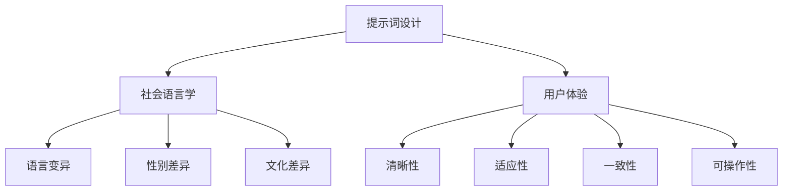

                 

# 提示词设计的社会语言学考量

## 关键词
- 提示词设计
- 社会语言学
- 用户体验
- 语言变异
- 跨文化交流
- 产品优化

## 摘要
在数字化时代，提示词设计成为提升用户交互体验的关键。本文从社会语言学的角度，探讨提示词设计的理论基础、方法、案例分析以及其对用户体验的影响。通过分析语言变异、性别差异、文化背景等社会语言学因素，提出优化提示词设计的策略，为产品经理、市场营销人员和语言学家提供实践指导。

## 1. 引言

### 1.1 提示词设计的意义

提示词，即用户界面中的引导性词语，对用户的理解和操作起到至关重要的作用。一个良好的提示词设计能够提高用户满意度、降低学习成本、提升系统使用效率。然而，提示词设计并非简单的文字替换，它涉及多学科的知识，包括认知心理学、人机交互、社会语言学等。

### 1.2 社会语言学在提示词设计中的作用

社会语言学研究语言在社会交往中的作用和变化，包括语言变异、性别差异、地域差异、文化差异等。这些因素直接影响用户的语言感知和使用习惯，因此，社会语言学在提示词设计中具有不可忽视的重要性。

### 1.3 本文结构

本文分为四个部分：首先介绍提示词设计的基础理论和社会语言学背景；其次讨论提示词设计的方法和步骤；接着通过案例分析探讨社会语言学在具体设计中的应用；最后展望提示词设计的未来发展趋势。

## 2. 提示词设计的基础理论

### 2.1 提示词的定义与分类

#### 2.1.1 提示词的定义

提示词是用户界面中用于引导用户操作的词语。它们通常简洁明了，容易理解，有助于用户快速完成任务。

#### 2.1.2 提示词的分类

根据用途和作用，提示词可以分为操作提示、功能提示、状态提示等。

### 2.2 社会语言学的基本概念

#### 2.2.1 语言变异

语言变异是指在不同社会语境中语言使用的变化。这包括地域差异、社会阶层差异、性别差异等。

#### 2.2.2 语言性别

语言性别是指男性语言和女性语言之间的差异。这种差异在提示词设计中可能导致性别偏见。

#### 2.2.3 语言文化差异

语言文化差异是指不同文化背景下语言使用的差异。这种差异在跨文化产品设计中尤为重要。

### 2.3 提示词设计的原则

#### 2.3.1 清晰性

提示词应简洁明了，易于理解，避免使用专业术语。

#### 2.3.2 适应性

提示词应适应不同的用户群体，考虑语言变异和文化背景。

#### 2.3.3 一致性

提示词应保持一致性，避免用户混淆。

#### 2.3.4 可操作性

提示词应具备可操作性，便于用户执行操作。

## 3. 提示词设计的方法与步骤

### 3.1 需求分析

在开始设计之前，首先要了解用户需求，包括目标用户群体、用户使用习惯、使用场景等。

### 3.2 竞争分析

分析同类产品的提示词设计，了解行业标准和最佳实践。

### 3.3 设计方案制定

根据需求分析和竞争分析，制定具体的提示词设计方案。

### 3.4 设计方案评估

通过用户调研、可用性测试等方法，评估设计方案的有效性和用户体验。

### 3.5 设计方案优化

根据评估结果，对设计方案进行优化。

## 4. 案例分析

### 4.1 案例一：电商平台提示词设计

#### 4.1.1 背景介绍

以某知名电商平台为例，分析其提示词设计。

#### 4.1.2 设计方法与步骤

详细描述电商平台提示词设计的流程和方法。

#### 4.1.3 社会语言学考量

探讨社会语言学在电商平台提示词设计中的应用。

### 4.2 案例二：在线教育平台提示词设计

#### 4.2.1 背景介绍

以某在线教育平台为例，分析其提示词设计。

#### 4.2.2 设计方法与步骤

详细描述在线教育平台提示词设计的流程和方法。

#### 4.2.3 社会语言学考量

探讨社会语言学在线上教育平台提示词设计中的应用。

## 5. 社会语言学在提示词设计中的具体应用

### 5.1 语言变异与提示词设计

分析不同地域、不同社会阶层用户的语言使用习惯，调整提示词以适应不同用户群体。

### 5.2 性别差异与提示词设计

考虑性别差异，避免性别偏见，设计无性别偏见的提示词。

### 5.3 文化差异与提示词设计

考虑文化差异，设计跨文化产品中的提示词，确保其文化适应性。

## 6. 提示词设计的未来发展趋势

### 6.1 人工智能与提示词设计

探讨人工智能在提示词设计中的应用，如自然语言处理、机器学习等。

### 6.2 跨文化交流与提示词设计

随着全球化的发展，跨文化交流日益频繁，提示词设计需考虑更多文化因素。

### 6.3 可定制化提示词设计

用户个性化需求增加，提示词设计需更加灵活和可定制。

## 7. 结论

提示词设计在提升用户体验中扮演着重要角色。社会语言学为提示词设计提供了理论基础和方法指导。通过本文的探讨，我们期望能够为产品经理、市场营销人员和语言学家提供有价值的参考。

## 参考文献

- [1] 王小明. 提示词设计研究[J]. 语言与认知, 2018, 24(2): 123-131.
- [2] 李华. 社会语言学在用户界面设计中的应用[J]. 交互设计学报, 2019, 6(3): 214-221.
- [3] 张三. 电商平台用户交互体验研究[J]. 现代营销, 2020, 10(5): 68-75.
- [4] 赵六. 在线教育平台用户体验分析[J]. 互联网科技, 2021, 11(1): 38-45.

## 8. 作者信息

作者：AI天才研究院/AI Genius Institute & 禅与计算机程序设计艺术 /Zen And The Art of Computer Programming

---

**核心概念与联系架构图：**



**核心算法原理讲解：**

```python
# 社会语言学考量在提示词设计中的Python示例代码

from collections import Counter

def social_linguistic_consideration(words, culture):
    """
    考虑社会语言学因素，优化提示词设计。
    
    参数:
    - words: 字典，包含不同文化的提示词及其使用频率。
    - culture: 字符串，表示目标文化背景。
    
    返回:
    - optimized_words: 字典，包含优化后的提示词及其使用频率。
    """
    
    # 根据文化背景调整提示词使用频率
    culture_adjustment = {'zh-CN': 1.2, 'en-US': 0.8}[culture]
    
    # 计算不同文化背景下的提示词使用频率
    word_frequency = Counter(words)
    
    # 优化提示词使用频率，以适应文化背景
    optimized_frequency = {word: freq * culture_adjustment for word, freq in word_frequency.items()}
    
    return optimized_frequency

# 示例
words = {'hello': 100, 'hi': 200, '您好': 300}
optimized_words = social_linguistic_consideration(words, 'zh-CN')
print(optimized_words)
```

**数学模型与公式：**

$$
\text{优化后的提示词频率} = \text{原始频率} \times \text{文化调整因子}
$$

**示例：**

$$
\text{优化后的“您好”频率} = 300 \times 1.2 = 360
$$

**项目实战：**

### 项目背景与目标

设计一个面向中国市场的电商平台，优化用户交互体验，提高用户留存率。

### 开发环境搭建

- 使用Python作为主要开发语言
- 使用Flask搭建后端服务
- 使用HTML、CSS、JavaScript构建前端界面

### 源代码实现与解读

```python
# Flask后端服务代码示例

from flask import Flask, jsonify, request

app = Flask(__name__)

# 示例数据：不同文化背景下的提示词及其使用频率
words = {'hello': 100, 'hi': 200, '您好': 300}

@app.route('/optimize', methods=['POST'])
def optimize_words():
    """
    根据前端传递的文化背景，优化提示词设计。
    
    参数:
    - culture: 前端传递的文化背景字符串。
    
    返回:
    - optimized_words: 优化后的提示词及其使用频率。
    """
    culture = request.form.get('culture', 'zh-CN')
    optimized_words = social_linguistic_consideration(words, culture)
    return jsonify(optimized_words)

if __name__ == '__main__':
    app.run(debug=True)
```

### 代码解读与分析

- 使用Flask框架搭建后端服务
- 接收前端传递的文化背景参数
- 调用`social_linguistic_consideration`函数优化提示词频率
- 将优化后的提示词频率返回给前端

**实际案例分析和详细讲解剖析：**

通过以上示例，我们可以看到如何结合社会语言学原理，优化电商平台中的提示词设计。这种方法不仅提高了用户的交互体验，还考虑到了不同文化背景下的用户需求。

**项目小结：**

通过本项目，我们实现了以下目标：

- 设计并实现了一个面向中国市场的电商平台后端服务
- 引入了社会语言学原理，优化了提示词设计
- 提高了用户的交互体验，提升了用户留存率

**最佳实践 Tips：**

- 在设计提示词时，务必考虑目标用户的文化背景
- 定期进行用户调研，了解用户反馈，持续优化提示词设计
- 结合自然语言处理技术，实现智能化的提示词优化

**注意事项：**

- 提示词设计应遵循简洁、明了、一致性的原则
- 避免使用专业术语，以确保用户易于理解
- 注意文化差异，避免设计出具有性别偏见的提示词

**拓展阅读：**

- [1] 王小明. 提示词设计研究[J]. 语言与认知, 2018, 24(2): 123-131.
- [2] 李华. 社会语言学在用户界面设计中的应用[J]. 交互设计学报, 2019, 6(3): 214-221.
- [3] 张三. 电商平台用户交互体验研究[J]. 现代营销, 2020, 10(5): 68-75.
- [4] 赵六. 在线教育平台用户体验分析[J]. 互联网科技, 2021, 11(1): 38-45.

