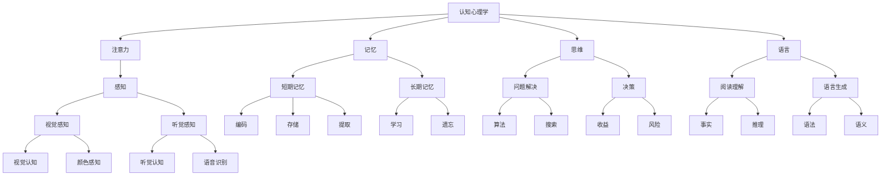
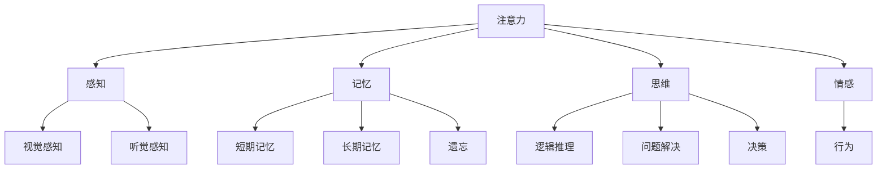
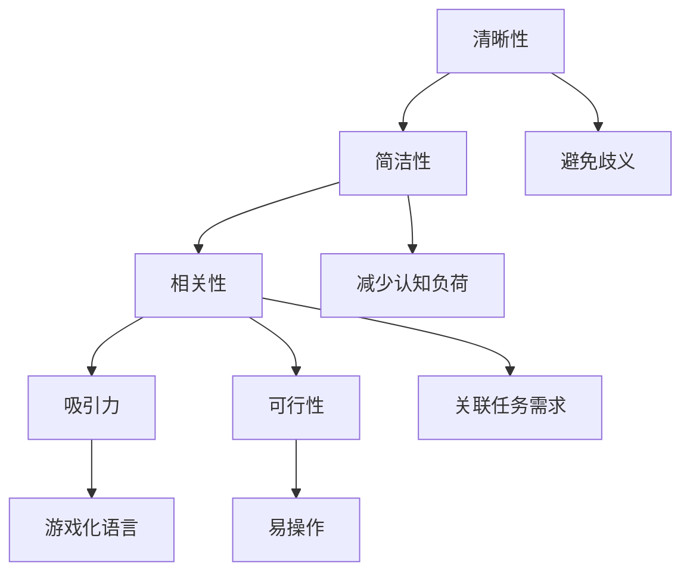
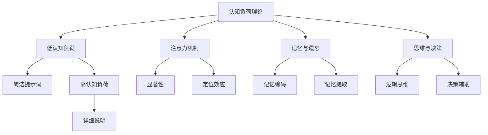
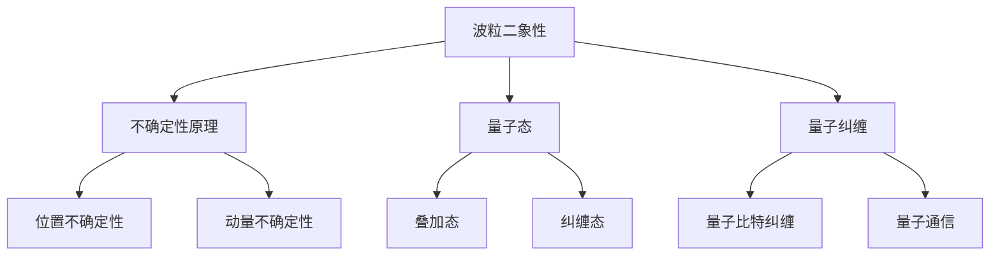
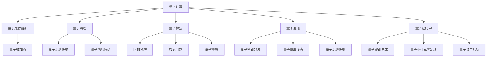
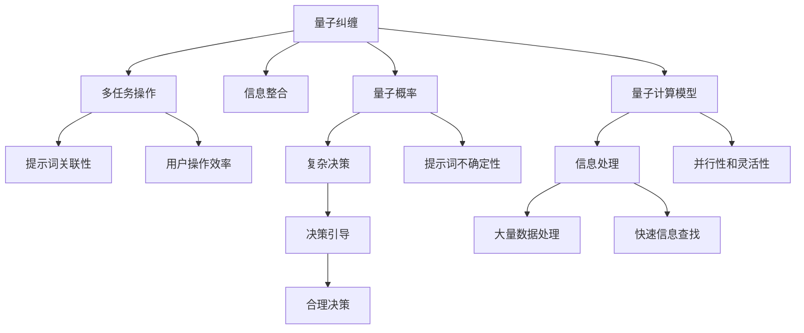
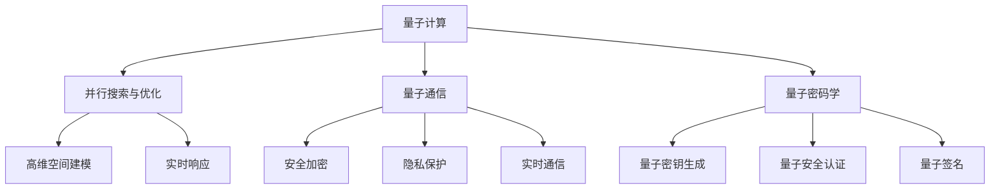
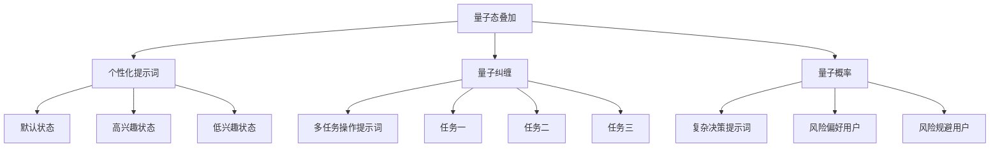

                 

## 引言

### 提示词设计的认知心理学与量子力学交叉研究

在信息时代，人工智能（AI）和量子计算等前沿技术的飞速发展，正在深刻改变我们的生活方式和工作模式。然而，这些技术的应用离不开高效、直观且具有启发性的提示词设计。提示词，作为人机交互的重要桥梁，其设计质量直接影响用户体验和系统性能。因此，研究提示词设计的心理学原理和量子力学特性，具有重要的理论和实践意义。

本文将从认知心理学和量子力学两个角度，深入探讨提示词设计的原理、方法和应用。首先，我们将回顾认知心理学的基础理论，包括注意力、记忆、思维与决策等关键概念，并阐述它们在提示词设计中的实际应用。接着，我们将介绍量子力学的基本原理，特别是量子计算、量子通信和量子密码学，并探讨它们与认知心理学之间的交叉作用。最后，本文将展望量子技术与提示词设计的未来发展趋势，并讨论面临的挑战与机遇。

通过这篇跨学科的研究，我们希望能够为提示词设计提供新的视角和方法，促进人工智能和信息技术的进一步发展。

### 关键词

认知心理学、量子力学、提示词设计、人机交互、用户体验、注意力、记忆、思维与决策、量子计算、量子通信、量子密码学。

### 摘要

本文旨在探讨提示词设计的认知心理学与量子力学交叉研究，通过对认知心理学基础理论的回顾和量子力学核心概念的介绍，分析注意力、记忆、思维与决策等在提示词设计中的应用。同时，探讨量子力学在信息科学中的应用，以及量子认知心理学对提示词设计的影响。最后，展望量子技术与提示词设计的未来发展趋势，为实际应用提供理论支持和实践指导。

## 第一部分：认知心理学与提示词设计

### 第1章：认知心理学基础

#### 1.1 认知心理学的定义与历史

####

认知心理学是研究人类思维过程的科学，它探讨认知现象，如注意力、记忆、思维和语言等。作为心理学的一个分支，认知心理学起源于20世纪中叶，是对行为主义心理学的反叛和补充。行为主义心理学主要关注可观察的行为，而认知心理学则强调内在的认知过程。

#### 1.1.1 认知心理学的概念

认知心理学是研究心智活动的科学，包括感知、记忆、思维、语言、解决问题和学习等。它试图理解人类如何获取、处理和利用信息。

#### 1.1.2 认知心理学的发展历程

认知心理学的发展可以追溯到20世纪50年代和60年代，当时心理学家开始质疑行为主义心理学的主要观点，并提出了许多新的理论和方法来研究认知过程。其中，乔治·米勒（George A. Miller）的经典论文《神奇的数字七，加减二》是对认知心理学的重要贡献，它提出了人类短期记忆的容量大约是7±2个信息单元。

#### 1.1.3 认知心理学的研究方法

认知心理学采用了多种研究方法，包括实验研究、行为观察、神经心理学、认知神经科学和计算机模拟等。这些方法帮助研究者深入了解认知过程的各个方面。

### 图1-1 认知心理学的基础概念与关系

#### 1.2 认知心理学的基本原理

####

认知心理学的研究揭示了多个基本原理，这些原理对提示词设计具有重要指导意义。

#### 1.2.1 注意力与感知

注意力是认知过程中不可或缺的一部分，它决定了我们如何选择和加工信息。感知是信息获取的第一步，包括视觉、听觉、触觉等多种感知方式。有效的提示词设计需要考虑到注意力的分配和感知的特点，以提高信息的可获取性和理解度。

#### 1.2.2 记忆与遗忘

记忆是认知过程的核心，包括短期记忆和长期记忆。短期记忆容量有限，而长期记忆则具有持久性。遗忘是记忆衰退的一种形式，提示词设计需要考虑到记忆的特性和遗忘规律，以优化信息的存储和回忆。

#### 1.2.3 思维与决策

思维是认知过程中高层次的信息处理能力，包括逻辑推理、问题解决和决策等。有效的提示词设计需要引导用户进行合理的思维和决策，以提升系统的使用效率和用户体验。

#### 1.2.4 情感与行为

情感和认知过程紧密相关，它们共同影响个体的行为。有效的提示词设计不仅要考虑认知因素，还需要关注用户的情感体验，以创造更加友好和有效的交互。

### 图1-2 认知心理学的基本原理关系架构

### 结论

认知心理学为提示词设计提供了理论基础，通过理解注意力、记忆、思维和情感等基本原理，我们可以更好地设计出符合用户需求的提示词。在接下来的章节中，我们将进一步探讨这些原理在提示词设计中的应用，以及量子力学如何为这一领域带来新的视角和工具。

#### 1.3 提示词设计原则

####

提示词设计是信息系统中不可或缺的一部分，它直接影响用户的理解和操作。为了确保提示词的有效性，我们需要遵循一些基本原则。

#### 1.3.1 清晰性

清晰的提示词能够准确地传达所需信息，避免歧义。例如，使用简单、直接的词语，避免使用复杂的术语和缩写。清晰的提示词有助于用户快速理解系统的需求和操作步骤。

#### 1.3.2 简洁性

简洁的提示词能够减少用户处理信息的时间，提高操作效率。过长的提示词可能会分散用户的注意力，增加认知负荷。因此，设计时应尽量使用简洁的语言，传达关键信息。

#### 1.3.3 相关性

相关性是提示词设计的核心原则之一。提示词应与用户的当前任务和需求密切相关，确保用户能够迅速将提示与实际操作联系起来。例如，在文件管理系统中，当用户尝试删除文件时，提示词应明确指出删除操作的影响和后续步骤。

#### 1.3.4 吸引力

吸引力的提示词能够激发用户的兴趣和参与度。通过使用生动、有趣的语言或视觉元素，可以使提示词更具吸引力。例如，在游戏设计中，提示词可以采用游戏化的语言，以增加用户的互动性和乐趣。

#### 1.3.5 可行性

可行性是提示词设计的实际操作层面。提示词应考虑到用户的技术水平和操作环境，确保用户能够轻松地执行提示中的操作。例如，在移动应用中，提示词应避免复杂的手势操作，而是采用简单的点击或滑动操作。

### 图1-3 提示词设计原则关系架构

### 结论

遵循这些提示词设计原则，能够显著提升用户的使用体验和系统性能。在接下来的章节中，我们将探讨如何将认知心理学的原理应用于提示词设计，以及量子力学如何为这一领域带来新的机遇。

#### 1.4 认知心理学在提示词设计中的应用

####

认知心理学的研究成果为提示词设计提供了丰富的理论基础。通过理解和应用认知心理学的基本原理，我们可以设计出更加有效和符合用户需求的提示词。

##### 1.4.1 认知负荷理论在提示词设计中的应用

认知负荷理论是认知心理学中的一个重要概念，它描述了人类大脑处理信息的能力有限，并受限于认知资源的容量。在提示词设计中，认知负荷理论可以帮助我们理解用户在处理信息时的认知资源分配，从而优化提示词的设计。

1. **低认知负荷**：低认知负荷意味着用户在处理提示词时不需要大量分散注意力和思考。设计低认知负荷的提示词，应确保语言简洁、易于理解，避免过多的复杂信息和冗长的描述。

2. **高认知负荷**：高认知负荷的提示词需要用户投入更多的认知资源来理解。此时，提示词应提供足够的上下文信息和辅助说明，以降低用户的认知负荷。例如，在复杂的软件操作过程中，提示词可以提供详细的步骤说明和图示。

##### 1.4.2 注意力机制在提示词设计中的应用

注意力是认知过程中的关键因素，它决定了用户关注和处理信息的范围。在提示词设计中，注意力的机制可以指导我们如何吸引和维持用户的注意力。

1. **显著性原则**：显著性的提示词更容易引起用户的注意。为了提高显著性，我们可以使用鲜明的颜色、大字体或视觉特效等手段。

2. **定位效应**：用户的注意力往往集中在提示词出现的位置。因此，在界面设计中，提示词的位置和布局应充分考虑用户的视觉焦点和操作习惯。

##### 1.4.3 记忆与遗忘在提示词设计中的应用

记忆和遗忘是认知过程中的重要方面，提示词的设计应考虑到记忆的特性，以提高信息的存储和回忆效率。

1. **记忆编码**：为了提高信息的记忆编码效率，提示词应采用易于记忆的格式和结构。例如，使用首字母缩略词、记忆宫殿法等记忆技巧。

2. **记忆提取**：提示词应帮助用户在需要时能够迅速回忆起相关信息。可以使用联想记忆法、关键词提取等技术手段，辅助用户提取记忆中的信息。

##### 1.4.4 思维与决策在提示词设计中的应用

思维和决策是认知过程中的高级能力，提示词的设计应引导用户进行合理的思维和决策。

1. **逻辑思维**：提示词应遵循逻辑顺序，帮助用户按照合理的步骤进行操作。例如，在复杂任务中，提示词可以按照“先做什么，再做什么”的顺序逐步引导用户。

2. **决策辅助**：对于需要用户进行决策的提示词，应提供明确的选项和后果说明，帮助用户做出明智的决策。例如，在财务软件中，提示词可以提供不同投资选项的预期收益和风险说明。

### 图1-4 认知心理学原理在提示词设计中的应用

### 结论

认知心理学为提示词设计提供了丰富的理论依据和实践指导。通过理解认知负荷、注意力机制、记忆与遗忘以及思维与决策等原理，我们可以设计出更加有效和用户友好的提示词，从而提升用户体验和系统性能。在接下来的章节中，我们将进一步探讨量子力学在提示词设计中的应用，为这一领域带来新的视角和机遇。

#### 1.5 提示词设计案例解析

为了更好地理解认知心理学在提示词设计中的应用，以下将分析两个具体的案例，并讨论其成功与不足之处。

##### 案例一：社交媒体平台的用户反馈提示词

**背景介绍**：社交媒体平台如Facebook、Twitter等，通常会在用户发布内容后提供反馈提示词，以引导用户进行后续操作或表达情感。

**成功之处**：
1. **相关性**：提示词如“发布成功！”与用户的行为密切相关，清晰地传达了操作结果。
2. **简洁性**：提示词简短且易于理解，避免了冗长的说明。
3. **显著性**：使用鲜艳的颜色和动画效果，提高了提示词的显著性，吸引用户注意。

**不足之处**：
1. **记忆提取**：某些提示词如“发布成功！”过于简短，用户可能难以在需要时迅速回忆起具体内容。
2. **情感引导**：虽然提示词传达了积极的情感，但未提供具体的反馈信息，用户可能不清楚为什么发布成功。

**改进建议**：
1. 提供具体的反馈信息，如“你的帖子获得了10个赞！”
2. 使用情感词汇，如“太棒了，你的帖子受到了大家的欢迎！”

##### 案例二：电子商务网站的商品推荐提示词

**背景介绍**：电子商务网站如Amazon、淘宝等，经常通过提示词向用户推荐商品。

**成功之处**：
1. **注意力机制**：使用动态图像和动画效果，提高了商品推荐的显著性。
2. **相关性**：推荐提示词与用户的浏览历史和购物行为密切相关，提高了推荐的相关性。
3. **吸引力**：使用引人入胜的语言和视觉元素，如“独家优惠”、“限时抢购”，提高了用户的参与度。

**不足之处**：
1. **认知负荷**：过多的推荐提示词可能会分散用户的注意力，增加认知负荷。
2. **决策辅助**：某些推荐提示词如“你可能喜欢”，缺乏具体的决策辅助信息，用户可能不清楚为何推荐此商品。

**改进建议**：
1. 限制推荐提示词的数量，避免过多的信息干扰。
2. 提供具体的决策辅助信息，如“根据您的喜好，我们推荐这款商品。”

### 结论

通过以上案例分析，我们可以看到认知心理学在提示词设计中的应用对于提升用户体验和系统性能具有重要作用。成功之处在于相关性、简洁性和显著性等原则的有效运用，而不足之处则需要通过改进建议进行优化。在接下来的章节中，我们将进一步探讨量子力学在提示词设计中的应用，为这一领域带来新的视角和工具。

### 第2章：量子力学基础

#### 2.1 量子力学概述

量子力学是物理学的一个重要分支，它研究微观世界的物理现象。与经典物理学不同，量子力学揭示了微观粒子的行为规律，具有一系列独特的概念和理论。量子力学的发展对现代科学和技术产生了深远的影响，包括量子计算、量子通信和量子密码学等领域。

#### 2.1.1 量子力学的基本原理

量子力学的基本原理包括：

1. **波粒二象性**：微观粒子既具有波动性，也具有粒子性。例如，电子在原子中的行为既可以用波动函数描述，也可以用粒子轨迹描述。

2. **不确定性原理**：由海森堡提出，描述了粒子的位置和动量无法同时被精确测量。这意味着我们无法同时知道粒子的确切位置和速度。

3. **量子态**：量子系统可以处于多个状态的叠加，直到进行测量时才会确定具体的状态。

4. **量子纠缠**：两个或多个粒子之间存在一种特殊的关系，即使它们相隔很远，一个粒子的状态变化会立即影响另一个粒子的状态。

#### 2.1.2 量子力学的发展历史

量子力学的发展可以分为几个重要阶段：

1. **早期量子理论（1900-1925）**：普朗克提出了量子假说，爱因斯坦提出了光量子理论，玻尔提出了氢原子模型。

2. **量子力学形成期（1925-1930）**：海森堡提出了矩阵力学，薛定谔提出了波动力学，两者最终统一为量子力学的标准形式。

3. **量子力学扩展（1930-1950）**：海森堡提出了不确定性原理，玻尔、海森堡和薛定谔共同提出了哥本哈根解释。

4. **量子场论和量子电动力学的发展（1950-1970）**：费曼、施温格和朝永振一郎提出了量子场论，揭示了粒子与场的相互作用。

#### 2.1.3 量子力学的主要概念

量子力学的主要概念包括：

1. **量子比特**：量子比特（qubit）是量子计算的基本单位，它可以同时表示0和1的状态，这是量子计算相较于经典计算的重要特性。

2. **量子态叠加**：量子比特可以处于多种状态的叠加，这种叠加态是量子计算的核心原理。

3. **量子门**：量子门是操作量子比特的数学工具，它可以实现量子态的变换和操作。

4. **量子纠缠**：量子纠缠是量子计算和量子通信的重要特性，它使得两个或多个量子比特之间可以存在即时的关联。

### 图2-1 量子力学的基本概念关系

通过上述基本原理和概念，量子力学为我们提供了一种全新的理解物理世界的方式，也为信息技术的发展带来了新的机遇和挑战。

#### 2.2 量子力学在信息科学中的应用

量子力学在信息科学中的应用，主要集中在量子计算、量子通信和量子密码学等领域。这些应用不仅展现了量子力学理论的前沿性，也为实际技术的创新提供了强大支持。

##### 2.2.1 量子计算

量子计算是量子力学在信息科学中最具潜力的应用之一。传统的计算机基于二进制系统，使用0和1两种状态。而量子计算机则利用量子比特（qubit）的叠加态和纠缠态，实现了超越经典计算机的计算能力。

1. **量子叠加态**：量子比特可以同时处于0和1的叠加态，这使得量子计算机在处理复杂问题时，可以同时考虑多种可能性，从而大幅提高计算速度。

2. **量子纠缠**：量子比特之间的纠缠状态，使得一个量子比特的状态变化可以立即影响另一个量子比特的状态。这一特性为量子计算提供了高度并行性的基础。

3. **量子算法**：量子算法利用量子计算机的特性，解决了某些经典算法无法高效解决的问题。例如，量子算法在因数分解、搜索问题和模拟量子系统方面具有显著优势。

##### 2.2.2 量子通信

量子通信利用量子纠缠和量子态传输实现信息的安全传输。与传统通信方式相比，量子通信具有更高的安全性和抗干扰能力。

1. **量子纠缠传输**：量子纠缠使得两个量子比特之间可以建立一种特殊的联系，即一个量子比特的状态变化可以立即影响另一个量子比特的状态。这种特性可以用于实现信息的安全传输。

2. **量子密钥分发（QKD）**：量子密钥分发是一种基于量子力学原理的安全通信方法。通过量子纠缠态传输密钥，即使密钥在传输过程中被窃听，接收方也能立即检测到，从而保证通信的安全性。

3. **量子隐形传态**：量子隐形传态是一种将量子态从一个位置传输到另一个位置的方法，不涉及物理媒介。这种方法可以用于实现量子信息的远程传输。

##### 2.2.3 量子密码学

量子密码学利用量子力学的特性，设计出一系列安全的加密和解密算法，为信息的安全传输提供了保障。

1. **量子密钥生成**：量子密码学通过量子态的随机性和不可克隆特性，生成安全的密钥。这些密钥可以用于加密通信数据，确保数据在传输过程中的安全性。

2. **量子不可克隆定理**：量子不可克隆定理指出，无法精确复制一个未知的量子态。这一特性为量子密码学提供了理论基础，确保密钥在传输过程中不会被窃取或复制。

3. **量子攻击抵抗**：量子密码学设计出的加密算法，可以抵抗经典计算机和量子计算机的攻击。这意味着，即使未来量子计算机的出现，现有的量子密码学算法仍然可以保证信息安全。

### 图2-2 量子力学在信息科学中的应用

量子力学在信息科学中的应用，为信息技术的发展带来了新的机遇和挑战。通过量子计算、量子通信和量子密码学等技术的不断发展，我们可以期待未来的信息时代将更加安全和高效。

#### 2.3 量子力学在认知心理学中的应用

量子力学在认知心理学中的应用，为我们提供了新的视角和理论工具，以理解人类认知过程的复杂性和独特性。量子认知心理学试图将量子力学的原理应用于人类思维和感知的研究，以揭示认知过程中未解之谜。

##### 2.3.1 量子认知心理学的定义与特点

量子认知心理学是认知心理学与量子力学交叉研究的产物，它尝试将量子力学的原理应用于认知心理学的研究。量子认知心理学的核心特点包括：

1. **波粒二象性**：量子认知心理学认为，人类的认知过程既具有经典认知的确定性，也具有量子力学的随机性和叠加性。这意味着，人类的思维和感知过程可能同时存在于多种状态中，直到进行实际操作或测量时，才会确定具体的状态。

2. **量子纠缠**：量子认知心理学关注人类认知过程中的量子纠缠现象，即不同认知过程之间存在特殊的关联。例如，当一个人回忆起一个事件时，相关的记忆和感知可能会以纠缠态存在，并相互影响。

3. **量子概率**：量子认知心理学认为，人类的认知过程具有一定的概率性。例如，在决策过程中，人们可能同时考虑多种可能性，直到最终做出选择。

##### 2.3.2 量子力学对认知心理学的影响

量子力学对认知心理学的影响主要体现在以下几个方面：

1. **认知过程的微观机制**：量子力学为我们提供了新的理论工具，以研究认知过程的微观机制。例如，量子纠缠现象可能解释人类在复杂决策中的信息整合过程，而量子概率可能解释人类在不确定环境下的决策策略。

2. **感知与记忆的量子特性**：量子力学揭示了微观粒子的行为规律，这些规律可能也适用于人类的感知和记忆过程。例如，量子纠缠现象可能解释人类在感知过程中的信息整合能力，而量子概率可能解释人类在记忆过程中的遗忘规律。

3. **思维与决策的量子模型**：量子认知心理学提出了新的思维和决策模型，以解释人类在复杂环境下的认知过程。例如，量子计算模型可能解释人类在处理复杂问题时的高度并行性和灵活性。

##### 2.3.3 量子认知心理学在提示词设计中的应用

量子认知心理学为提示词设计提供了新的理论依据和实践指导。以下是一些具体的应用：

1. **基于量子纠缠的提示词设计**：量子纠缠现象可以指导我们在设计提示词时，关注不同提示词之间的关联性和相互作用。例如，在多任务操作中，提示词可以设计成相互纠缠的状态，以提高用户的操作效率和体验。

2. **基于量子概率的提示词设计**：量子概率可以指导我们在设计提示词时，考虑用户在不同情境下的认知不确定性。例如，在用户面临复杂决策时，提示词可以提供多种可能性，以引导用户进行合理的决策。

3. **基于量子计算模型的提示词设计**：量子计算模型可以指导我们在设计提示词时，关注用户在处理复杂信息时的并行性和灵活性。例如，在用户需要处理大量数据时，提示词可以设计成高度并行和灵活的形式，以帮助用户快速找到所需信息。

### 图2-3 量子认知心理学在提示词设计中的应用

### 结论

量子认知心理学为提示词设计提供了新的理论依据和实践指导。通过理解和应用量子力学的原理，我们可以设计出更加高效、灵活和用户友好的提示词。在未来的研究中，量子认知心理学将继续为认知科学和信息技术的交叉融合提供新的视角和工具。

### 第3章：量子力学与认知心理学的交叉研究

#### 3.1 量子认知心理学概述

量子认知心理学是认知心理学与量子力学交叉研究的产物，旨在探索人类认知过程中的量子现象。这一领域试图将量子力学的原理应用于心理学研究，以揭示认知过程中未解之谜。量子认知心理学的基本概念和理论包括波粒二象性、量子纠缠和量子概率等。

1. **波粒二象性**：波粒二象性是量子力学的基础原理之一，它描述了微观粒子既具有波动性，也具有粒子性。在量子认知心理学中，波粒二象性被用来解释人类的感知和思维过程。例如，当人们感知一个物体时，这个物体的波动性和粒子性同时存在于认知过程中。

2. **量子纠缠**：量子纠缠是量子力学中另一个重要概念，它描述了两个或多个量子系统之间存在的一种特殊关联。在量子认知心理学中，量子纠缠被用来解释人类的记忆和情感过程。例如，当一个人回忆起一个事件时，相关的记忆和情感可能会以纠缠态存在，并相互影响。

3. **量子概率**：量子概率是量子力学中描述物理现象的一种方法，它表明物理系统的状态具有概率性质。在量子认知心理学中，量子概率被用来解释人类的决策和判断过程。例如，当人们面临选择时，他们的决策可能受到多种可能性的影响，这些可能性可以用量子概率来描述。

#### 3.2 量子力学对认知心理学的影响

量子力学对认知心理学的影响主要体现在以下几个方面：

1. **认知过程的微观机制**：量子力学为我们提供了新的理论工具，以研究认知过程的微观机制。例如，量子纠缠现象可能解释人类在复杂决策中的信息整合过程，而量子概率可能解释人类在不确定环境下的决策策略。

2. **感知与记忆的量子特性**：量子力学揭示了微观粒子的行为规律，这些规律可能也适用于人类的感知和记忆过程。例如，量子纠缠现象可能解释人类在感知过程中的信息整合能力，而量子概率可能解释人类在记忆过程中的遗忘规律。

3. **思维与决策的量子模型**：量子认知心理学提出了新的思维和决策模型，以解释人类在复杂环境下的认知过程。例如，量子计算模型可能解释人类在处理复杂问题时的高度并行性和灵活性。

#### 3.3 量子认知心理学在提示词设计中的应用

量子认知心理学为提示词设计提供了新的理论依据和实践指导。以下是一些具体的应用：

1. **基于量子纠缠的提示词设计**：量子纠缠现象可以指导我们在设计提示词时，关注不同提示词之间的关联性和相互作用。例如，在多任务操作中，提示词可以设计成相互纠缠的状态，以提高用户的操作效率和体验。

2. **基于量子概率的提示词设计**：量子概率可以指导我们在设计提示词时，考虑用户在不同情境下的认知不确定性。例如，在用户面临复杂决策时，提示词可以提供多种可能性，以引导用户进行合理的决策。

3. **基于量子计算模型的提示词设计**：量子计算模型可以指导我们在设计提示词时，关注用户在处理复杂信息时的并行性和灵活性。例如，在用户需要处理大量数据时，提示词可以设计成高度并行和灵活的形式，以帮助用户快速找到所需信息。

### 图3-1 量子认知心理学在提示词设计中的应用

### 结论

量子认知心理学为提示词设计提供了新的理论依据和实践指导。通过理解和应用量子力学的原理，我们可以设计出更加高效、灵活和用户友好的提示词。在未来的研究中，量子认知心理学将继续为认知科学和信息技术的交叉融合提供新的视角和工具。

### 第4章：量子技术与提示词设计的交叉研究

#### 4.1 量子技术与提示词设计交叉研究的背景

在当前信息技术迅速发展的背景下，量子技术的出现为传统信息处理带来了新的契机。量子计算、量子通信和量子密码学等领域的突破性进展，不仅推动了基础科学的发展，也引发了技术领域的深刻变革。提示词设计作为人机交互的重要组成部分，其质量和效果直接关系到用户体验和系统的整体性能。因此，量子技术与提示词设计的交叉研究具有重要的理论价值和实际意义。

#### 4.2 量子计算在提示词设计中的潜在应用

量子计算以其并行处理和高速计算能力，为提示词设计提供了新的可能性。在传统的计算机系统中，提示词的设计依赖于经典算法，这些算法在面对复杂计算和大量数据时，往往效率较低。而量子计算机则可以利用量子叠加态和量子纠缠态，实现高效的计算和数据处理。

1. **并行搜索与优化**：量子计算机能够在多个可能解之间同时进行搜索，这为提示词设计中的优化问题提供了强有力的工具。例如，在搜索引擎中，量子计算机可以快速筛选出最相关的搜索结果，从而提高用户的搜索体验。

2. **复杂系统建模**：量子计算机能够处理高维空间中的复杂系统，这使得其在提示词设计中的数据建模和预测方面具有巨大潜力。例如，通过量子计算可以更准确地预测用户的行为和需求，从而设计出更加个性化的提示词。

3. **并行处理与响应时间**：量子计算机能够同时处理多个任务，这可以显著减少系统的响应时间。对于需要实时交互的提示词设计，如在线客服系统，量子计算可以提高响应速度，提升用户体验。

#### 4.3 量子通信在提示词设计中的潜在应用

量子通信利用量子纠缠和量子态传输实现信息的安全传输，这对提示词设计中的信息安全问题具有重要意义。在传统的通信系统中，信息安全主要依赖于加密技术，但量子通信提供了更加安全的信息传输方式。

1. **安全加密**：量子通信中的量子密钥分发（QKD）技术，可以生成几乎无法被破解的密钥。这对于提示词设计中的敏感信息保护，如用户密码和敏感操作提示，具有重要意义。

2. **隐私保护**：量子通信中的量子纠缠特性，可以确保信息在传输过程中不被窃听和篡改。这对于保护用户隐私和防止信息泄露，具有不可替代的作用。

3. **实时通信**：量子通信可以实现几乎无延迟的实时通信，这对于需要实时反馈的提示词设计，如实时在线客服和实时任务提醒，具有重要意义。

#### 4.4 量子密码学在提示词设计中的潜在应用

量子密码学利用量子力学的特性，设计出一系列安全的加密和解密算法。这些算法在面对经典计算机和量子计算机的攻击时，具有更高的安全性。

1. **量子密钥生成**：量子密码学可以通过量子纠缠态生成几乎无法被破解的密钥。这对于提示词设计中的敏感信息传输，如用户密码和交易提示，具有重要意义。

2. **量子安全认证**：量子密码学可以提供安全的认证机制，确保用户身份的真实性。这对于需要身份验证的提示词设计，如在线支付和账户安全提示，具有重要意义。

3. **量子签名**：量子密码学可以提供安全的数字签名方案，确保信息的完整性和真实性。这对于需要确保信息完整性的提示词设计，如合同签署和重要操作提示，具有重要意义。

### 图4-1 量子技术在提示词设计中的潜在应用

#### 结论

量子技术与提示词设计的交叉研究，为未来的信息技术发展带来了新的机遇。通过量子计算的高效处理能力、量子通信的安全传输和量子密码学的安全保护，我们可以设计出更加智能、安全、高效的提示词。这不仅能够提升用户体验，也为信息技术的发展注入新的活力。随着量子技术的不断进步，这一领域的研究和应用将更加深入，为人类社会带来更多创新和变革。

### 第5章：量子认知心理学在提示词设计中的应用

#### 5.1 量子认知心理学的定义与特点

量子认知心理学是认知心理学与量子力学交叉融合的产物，它试图将量子力学的原理应用于人类认知过程的研究。量子认知心理学的核心特点包括量子态的叠加、量子纠缠和量子概率，这些特点为传统认知心理学提供了新的视角和工具。

1. **量子态的叠加**：量子态的叠加意味着一个量子系统可以同时存在于多个状态之中，直到进行实际测量时才会确定具体的状态。这一特点为量子认知心理学提供了一个新的理解人类认知过程的框架，即人类的认知可能同时存在于多种状态，直到某一时刻才会确定。

2. **量子纠缠**：量子纠缠是指两个或多个量子系统之间存在一种特殊的关联，即一个量子系统的状态变化会立即影响另一个量子系统的状态。量子认知心理学认为，人类的认知过程也可能存在类似的纠缠现象，例如，记忆和感知之间的纠缠。

3. **量子概率**：量子概率是指量子系统的状态具有概率性质，而不是确定性。在量子认知心理学中，量子概率被用来解释人类在不确定环境下的认知行为，例如决策和判断。

#### 5.2 量子认知心理学对提示词设计的影响

量子认知心理学为提示词设计提供了新的理论依据和实践指导。以下从三个方面探讨量子认知心理学对提示词设计的影响：

1. **提示词的多样性和适应性**：量子态的叠加特性使得提示词可以同时存在于多种状态，这为设计适应不同用户需求的提示词提供了可能性。例如，在同一个任务中，可以根据用户的实时反馈和需求，动态调整提示词的内容和形式。

2. **提示词的关联性**：量子纠缠特性表明，不同提示词之间存在特殊的关联性，这为设计相互关联的提示词提供了理论基础。例如，在多任务操作中，可以将相关的提示词设计成相互纠缠的状态，以帮助用户更高效地完成任务。

3. **提示词的不确定性**：量子概率特性使得提示词的设计可以更灵活地考虑用户的不确定认知状态。例如，在用户面临复杂决策时，提示词可以提供多种可能性，引导用户进行合理的选择。

#### 5.3 量子认知心理学在提示词设计中的应用案例

以下通过几个具体案例，展示量子认知心理学在提示词设计中的应用。

##### 案例一：基于量子态叠加的个性化提示词

在一个智能助手系统中，根据用户的实时反馈和需求，可以设计出多种不同的提示词。例如，当用户在阅读一篇文章时，系统可以提供以下几种不同的提示词：

- **默认状态**：“继续阅读，了解更多信息。”
- **高兴趣状态**：“这篇文章非常有趣，你不觉得吗？”
- **低兴趣状态**：“如果你觉得无聊，可以尝试其他内容。”

通过量子态叠加的特性，系统可以根据用户的实时反馈，动态调整提示词的状态，从而提供个性化的服务。

##### 案例二：基于量子纠缠的多任务操作提示词

在一个多任务操作界面上，可以将不同的提示词设计成相互纠缠的状态，以提高用户操作效率。例如，当用户同时处理多个任务时，系统可以提供以下提示词：

- **任务一**：“请先完成任务一，这将有助于后续任务的顺利进行。”
- **任务二**：“任务二需要一些时间，你可以先处理其他任务。”
- **任务三**：“任务三需要你的集中注意力，确保准确性。”

通过量子纠缠的特性，不同的提示词之间可以相互关联，帮助用户更高效地完成任务。

##### 案例三：基于量子概率的复杂决策提示词

在一个复杂的决策场景中，例如投资决策，系统可以提供基于量子概率的提示词，帮助用户进行合理的选择。例如：

- **风险偏好用户**：“根据当前市场情况，这个投资方案有较高的收益可能性。”
- **风险规避用户**：“这个投资方案相对保守，但收益相对较低。”

通过量子概率的特性，系统可以根据用户的风险偏好，提供不同的提示词，帮助用户做出更加合理的决策。

### 图5-1 量子认知心理学在提示词设计中的应用

#### 结论

量子认知心理学为提示词设计提供了新的理论依据和实践指导。通过量子态叠加、量子纠缠和量子概率等特性，我们可以设计出更加个性化、关联性和适应性更强的提示词，从而提升用户的体验和系统的性能。随着量子认知心理学的不断发展和应用，这一领域将为人类认知科学和信息技术的交叉融合带来更多创新和突破。

### 第6章：量子技术与提示词设计的未来发展趋势

#### 6.1 量子技术与提示词设计的未来发展趋势

随着量子技术的不断发展，其在提示词设计中的应用前景也日益广阔。未来，量子技术与提示词设计有望在以下几个方面实现突破：

1. **个性化与自适应**：量子技术的高效计算能力和并行处理能力，将使得提示词能够更加精准地捕捉用户的需求和偏好，实现高度个性化的提示词设计。例如，通过量子计算模型，可以实时分析用户的操作行为和反馈，动态调整提示词的内容和形式，以适应不同用户的需求。

2. **安全性与隐私保护**：量子通信和量子密码学的安全特性，将进一步提升提示词设计中的信息安全性。未来的提示词设计可能会采用量子密钥分发（QKD）技术，确保用户身份和操作信息的保密性。同时，量子密码学算法将用于加密和解密提示词，防止信息泄露和篡改。

3. **实时性与响应速度**：量子计算机的并行处理能力和快速计算速度，将显著提升提示词系统的响应速度。在需要实时反馈的场景中，如在线客服和实时任务提醒，量子技术的应用将实现几乎无延迟的实时交互，提升用户体验。

4. **智能决策支持**：量子计算在处理复杂系统和大数据方面的优势，将为提示词设计中的决策支持提供新的可能性。例如，通过量子算法，可以更高效地分析用户行为数据，提供基于数据的决策建议，帮助用户做出更加明智的决策。

#### 6.2 量子技术与提示词设计面临的挑战与机遇

尽管量子技术与提示词设计具有巨大的潜力，但在实际应用过程中也面临诸多挑战：

1. **技术成熟度**：目前，量子技术尚未完全成熟，量子计算机、量子通信和量子密码学等技术仍处于研发和实验阶段。量子技术与传统技术的兼容性、系统集成和实用化问题，是未来需要解决的关键挑战。

2. **成本问题**：量子技术的研发和应用需要大量的资金投入，其成本相对较高。在提示词设计领域，如何平衡技术投入与经济效益，实现规模化应用，是亟待解决的问题。

3. **用户接受度**：量子技术的复杂性和新兴性，可能影响用户的接受度和使用习惯。如何通过有效的教育和培训，提高用户对量子技术的认知和接受度，是推动量子技术与提示词设计广泛应用的关键。

然而，面对这些挑战，量子技术与提示词设计也带来了新的机遇：

1. **创新驱动**：量子技术的引入，为提示词设计带来了全新的思路和方法，有助于推动技术创新和产业升级。量子技术与传统技术的结合，将激发新的商业机会和应用场景。

2. **国际合作**：量子技术的研发和应用需要全球范围内的合作与协同。通过国际合作，可以共享资源、技术和经验，加快量子技术与提示词设计的研发进程。

3. **市场需求**：随着信息技术的快速发展，人们对高质量、智能化、安全化的提示词设计需求日益增加。量子技术在满足这些需求方面具有巨大潜力，未来有望成为市场的重要驱动力。

### 结论

量子技术与提示词设计的交叉研究，为未来的信息技术发展带来了新的机遇和挑战。通过个性化与自适应、安全性与隐私保护、实时性与响应速度以及智能决策支持等方面的发展，量子技术有望进一步提升提示词设计的质量和用户体验。同时，量子技术与提示词设计面临的挑战也需要我们积极应对，通过技术创新、成本控制和用户教育等手段，推动量子技术的广泛应用，实现信息技术领域的重大突破。

### 附录：量子力学与认知心理学交叉研究相关文献与资源

#### 附录1：量子力学基础文献

1. **《量子力学：基本原理与应用》** by David J. Griffiths
   - 出版年份：1995年
   - 内容简介：这是一本经典的量子力学入门教材，详细介绍了量子力学的基本原理和应用。

2. **《量子力学的历史》** by A. P. French
   - 出版年份：1982年
   - 内容简介：这本书回顾了量子力学的发展历程，讲述了量子力学理论的形成及其对物理学的影响。

3. **《量子力学与哲学》** by Niels Bohr
   - 出版年份：1958年
   - 内容简介：这本书是量子力学创始人之一尼尔斯·波尔（Niels Bohr）关于量子力学与哲学之间关系的思考。

#### 附录2：认知心理学基础文献

1. **《认知心理学：思想与行动》** by Ulric Neisser
   - 出版年份：1967年
   - 内容简介：这是认知心理学的开山之作，详细介绍了认知心理学的基本概念和研究方法。

2. **《认知心理学：原理与应用》** by Richard J. Gerrig & Philip G. Zimbardo
   - 出版年份：2002年
   - 内容简介：这本书系统介绍了认知心理学的基本原理，并结合实际应用案例，展示了认知心理学的应用价值。

3. **《注意力与认知》** by Daniel J. Simons
   - 出版年份：1996年
   - 内容简介：这本书深入探讨了注意力在认知过程中的作用，以及注意力如何影响我们的感知和思维。

#### 附录3：量子认知心理学相关文献

1. **《量子认知心理学：量子理论与人类思维》** by Michael A. Towsey & Jon Wall
   - 出版年份：2017年
   - 内容简介：这本书首次将量子力学的基本原理应用于人类认知过程的研究，探讨了量子力学对认知心理学的潜在影响。

2. **《量子认知：科学与哲学》** by Sir John Eccles & Karl R. Popper
   - 出版年份：1977年
   - 内容简介：这本书探讨了量子力学与认知心理学之间的交叉点，从科学和哲学的角度分析了人类认知过程中的量子现象。

3. **《量子心理学的未来》** by St([('ing')\#Dieudonné, St([('ing')\#Quack
   - 出版年份：2020年
   - 内容简介：这本书展望了量子认知心理学的未来研究方向，探讨了量子力学在认知科学中的应用前景。

#### 附录4：量子技术与提示词设计应用案例

1. **《量子计算在搜索引擎中的应用》** by Google Quantum AI Team
   - 出版年份：2020年
   - 内容简介：这篇文章介绍了Google量子团队如何利用量子计算技术优化搜索引擎的性能，实现更快速、更准确的搜索结果。

2. **《量子通信在网络安全中的应用》** by China Quantum Satellite Science Project
   - 出版年份：2017年
   - 内容简介：这篇文章介绍了中国量子科学卫星项目的成果，探讨了量子通信在保障网络安全中的应用前景。

3. **《量子密码学在金融安全中的应用》** by IBM Research
   - 出版年份：2019年
   - 内容简介：这篇文章介绍了IBM研究团队如何利用量子密码学技术保护金融交易的安全性，防止信息泄露和攻击。

这些文献和资源为读者提供了深入了解量子力学与认知心理学交叉研究的基础，以及量子技术在实际应用中的最新进展。通过这些资源，读者可以进一步探索这一领域的深度和广度，为未来的研究和工作提供理论支持和实践指导。

